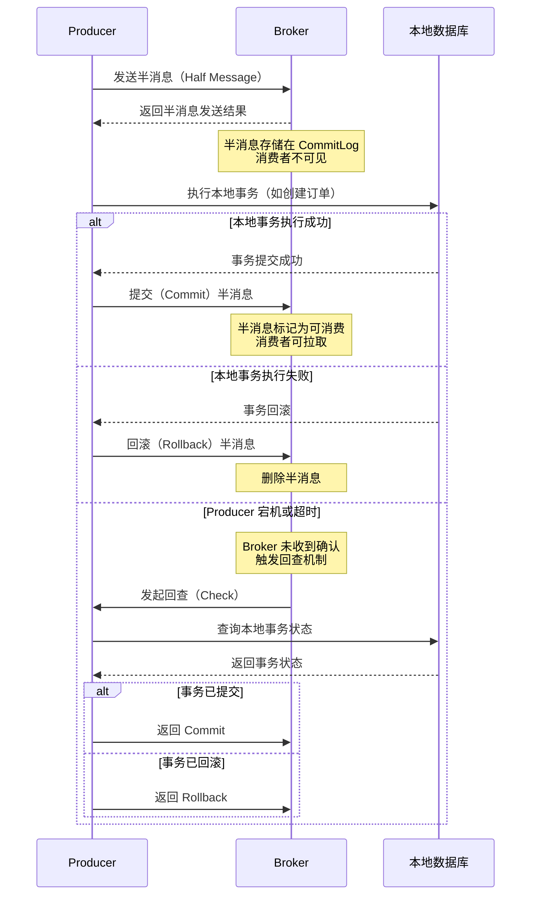
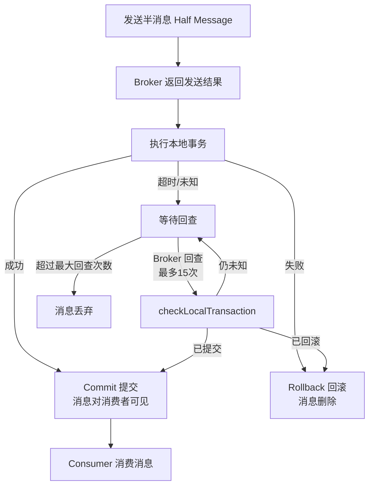

# RocketMQ 高级特性

> 学习路线对应：第4周 -- 消息队列
> 前置知识：RocketMQ 核心原理（NameServer、Broker、存储模型）
> 对比 Node.js：RocketMQ 的顺序消息、事务消息、延迟消息在 Node.js 生态中需要额外中间件或自行实现

> 📖 **参考链接**：
> - [RocketMQ Documentation](https://rocketmq.apache.org/docs/) -- RocketMQ 官方文档总入口
> - [RocketMQ 高级特性](https://rocketmq.apache.org/docs/feature/transaction-message/) -- 事务消息、延迟消息、顺序消息官方说明

---

## 一、核心概念

### 1.1 消费模式（集群 vs 广播）

RocketMQ 提供两种消费模式，通过 Consumer 的 MessageModel 配置切换。

| 维度 | 集群模式（CLUSTERING） | 广播模式（BROADCASTING） |
|------|------------------------|--------------------------|
| 消费行为 | 同一 ConsumerGroup 内每条消息只被一个 Consumer 消费 | 同一 ConsumerGroup 内每条消息被所有 Consumer 消费 |
| 负载均衡 | 支持，MessageQueue 均匀分配给 Consumer | 不支持，每个 Consumer 消费全部 MessageQueue |
| 消费进度 | 存储在 Broker 端 | 存储在 Consumer 本地 |
| 适用场景 | 订单处理、分布式任务调度 | 配置刷新、缓存更新、通知推送 |
| 消费者数量 | 可动态增减，自动 Rebalance | 增减不影响其他 Consumer |

**集群模式配置：**

```java
DefaultMQPushConsumer consumer = new DefaultMQPushConsumer("order-consumer-group");
consumer.setMessageModel(MessageModel.CLUSTERING); // 默认集群模式
```

**广播模式配置：**

```java
DefaultMQPushConsumer consumer = new DefaultMQPushConsumer("config-refresh-group");
consumer.setMessageModel(MessageModel.BROADCASTING); // 广播模式
```

> 注意：广播模式下消费进度存储在 Consumer 本地，Consumer 重启后可能重复消费。建议 Consumer 实现幂等逻辑。

### 1.2 长轮询机制

RocketMQ 的 Push 消费模式底层实际是长轮询（Long Polling），并非 Broker 主动推送。

| 特性 | 说明 |
|------|------|
| 本质 | 消费者发起拉取请求，Broker 挂起请求等待消息到达 |
| 挂起时间 | 默认 15s（`longPollingEnable=true`），可配置 `longPollingInterval` |
| 短轮询 | `longPollingEnable=false`，消费者不断发起拉取请求，Broker 立即返回（可能为空） |
| 优势 | 长轮询兼顾实时性和资源消耗，避免短轮询的空转和纯 Push 的服务端压力 |

**长轮询流程：**

```
1. Consumer 向 Broker 发起 PullRequest
2. Broker 检查消息队列：
   - 有新消息 -> 立即返回消息
   - 无新消息 -> 挂起请求（默认 15s）
3. 挂起期间：
   - 新消息到达 -> 唤醒挂起请求，返回消息
   - 超时（15s） -> 返回空，Consumer 立即发起下一次拉取
```

### 1.3 消费重试（进阶）

在核心原理文件的基础上，本节补充消费重试的配置调优和死信处理。

**重试配置调优：**

| 配置项 | 默认值 | 调优建议 |
|--------|--------|----------|
| `maxReconsumeTimes` | 16 | 普通业务 3-5 次；金融业务 5-10 次 |
| `consumeMessageBatchMaxSize` | 1 | 批量消费场景可适当增大，提升吞吐 |
| `consumeThreadMin` | 20 | 根据 CPU 核数调整，建议 CPU 核数 * 2 |
| `consumeThreadMax` | 64 | 不超过 CPU 核数 * 8 |

**死信队列处理：**

```java
@RocketMQMessageListener(
    topic = "%DLQ%order-consumer-group",
    consumerGroup = "order-dlq-consumer-group"
)
public class OrderDlqConsumer implements RocketMQListener<MessageExt> {

    @Override
    public void onMessage(MessageExt message) {
        // 1. 记录死信消息到数据库
        String msgId = message.getMsgId();
        String body = new String(message.getBody());
        int reconsumeTimes = message.getReconsumeTimes();
        System.err.println("死信消息: msgId=" + msgId
            + ", reconsumeTimes=" + reconsumeTimes
            + ", body=" + body);

        // 2. 人工处理或告警通知
        // alertService.sendAlert("死信消息告警", msgId);
    }
}
```

### 1.4 顺序消息（全局顺序 vs 分区顺序）

RocketMQ 支持严格顺序消息，分为全局顺序和分区顺序两种。

| 维度 | 全局顺序消息 | 分区顺序消息 |
|------|-------------|-------------|
| 原理 | 一个 Topic 仅创建一个 MessageQueue，所有消息串行写入和消费 | 同一业务 Key 的消息发送到同一 MessageQueue，分区内严格有序 |
| 吞吐量 | 极低（单队列串行） | 较高（多队列并行，分区内有序） |
| 适用场景 | 极少数全局有序场景 | 订单状态流转、数据库 Binlog 同步 |
| 实现方式 | `writeQueueNums=1, readQueueNums=1` | 通过 `MessageQueueSelector` 按业务 Key 选择队列 |

**分区顺序消息实现：**

```java
// 生产者：按订单 ID 选择队列，同一订单的消息发送到同一队列
SendResult result = rocketMQTemplate.syncSendOrderly(
    "order-topic:status-change",
    MessageBuilder.withPayload(orderStatusChange).build(),
    orderStatusChange.getOrderId()  // 哈希键，相同 Key 发到同一队列
);

// 消费者：顺序消费
@RocketMQMessageListener(
    topic = "order-topic",
    consumerGroup = "order-status-consumer",
    consumeMode = ConsumeMode.ORDERLY  // 顺序消费模式
)
public class OrderStatusConsumer implements RocketMQListener<MessageExt> {
    @Override
    public void onMessage(MessageExt message) {
        // 单线程顺序消费，保证同一队列内消息按顺序处理
        processOrderStatus(message);
    }
}
```

**顺序消息的可靠性保障：**

| 保障点 | 说明 |
|--------|------|
| 发送端 | `syncSendOrderly` 自动重试时不会切换队列，保证同一 Key 的消息始终发往同一队列 |
| 消费端 | `ConsumeMode.ORDERLY` 使用单线程消费，前一条消息处理成功后才拉取下一条 |
| 锁机制 | 消费时对 MessageQueue 加分布式锁，防止 Rebalance 期间并发消费 |

### 1.5 事务消息（半消息 / 两阶段确认 / 消息回查）

事务消息是 RocketMQ 区别于 Kafka 和 RabbitMQ 的核心特性，通过半消息机制实现分布式事务的最终一致性。

**事务消息三阶段：**

```
第一阶段（发送半消息）：
  Producer -> Broker: 发送 Half Message（半消息，消费者不可见）
  Broker -> Producer: 返回半消息发送结果

第二阶段（执行本地事务）：
  Producer: 执行本地事务（如创建订单、扣减库存）
  Producer -> Broker: 提交（Commit）或回滚（Rollback）半消息
  - Commit: Broker 将半消息标记为可消费，消费者可拉取
  - Rollback: Broker 删除半消息

第三阶段（消息回查 - 异常兜底）：
  当 Broker 未收到 Commit/Rollback 时（超时或 Producer 宕机）
  Broker -> Producer: 发起回查（Check）
  Producer: 根据本地事务状态返回 Commit 或 Rollback
```

**事务消息状态流转：**

```
半消息发送 -> 本地事务执行：
  - 成功 -> Commit -> 消息可消费
  - 失败 -> Rollback -> 消息删除
  - 超时/未知 -> 触发回查
      回查 -> 本地事务已提交 -> Commit
      回查 -> 本地事务已回滚 -> Rollback
      回查 -> 仍未知 -> 继续回查（最多 15 次）
```

**事务消息实现：**

```java
@Service
public class OrderTransactionService {

    @Autowired
    private RocketMQTemplate rocketMQTemplate;

    @Autowired
    private OrderService orderService;

    /**
     * 发送事务消息
     */
    public void sendOrderTransaction(Order order) {
        TransactionSendResult result = rocketMQTemplate.sendMessageInTransaction(
            "order-transaction-producer-group",
            "order-topic:create",
            MessageBuilder.withPayload(order).build(),
            order  // 业务参数
        );
        System.out.println("事务消息发送结果: " + result.getSendStatus());
    }
}

/**
 * 事务消息监听器
 */
@RocketMQTransactionListener
public class OrderTransactionListener implements RocketMQLocalTransactionListener {

    @Autowired
    private OrderService orderService;

    /**
     * 执行本地事务
     */
    @Override
    public RocketMQLocalTransactionState executeLocalTransaction(Message msg, Object arg) {
        Order order = (Order) arg;
        try {
            // 执行本地事务：创建订单
            orderService.createOrder(order);
            return RocketMQLocalTransactionState.COMMIT;  // 提交事务消息
        } catch (Exception e) {
            return RocketMQLocalTransactionState.ROLLBACK; // 回滚事务消息
        }
    }

    /**
     * 消息回查：Broker 未收到确认时回调
     */
    @Override
    public RocketMQLocalTransactionState checkLocalTransaction(Message msg) {
        String orderId = new String((byte[]) msg.getKeys());
        Order order = orderService.getOrder(orderId);
        if (order != null && order.getStatus() == OrderStatus.CREATED) {
            return RocketMQLocalTransactionState.COMMIT;
        } else {
            return RocketMQLocalTransactionState.ROLLBACK;
        }
    }
}
```

**事务消息完整时序图**：



> 事务消息通过**半消息 + 两阶段确认 + 回查**三阶段机制，实现了分布式事务的最终一致性。半消息在 Commit 之前对消费者不可见，确保本地事务执行与消息发送的原子性；回查机制作为异常兜底，最多重试 15 次，防止半消息长时间悬挂。

> **生活化类比：事务消息 = 签收付款** —— 事务消息就像快递的"签收付款"（货到付款）模式。寄件人先把包裹送到快递站，但标记为"待确认"状态（半消息），收件人暂时看不到。然后寄件人去完成自己的事（本地事务，如创建订单）：事办成了，通知快递站"发货"（Commit），包裹才对收件人可见；事没办成，通知"退回"（Rollback），包裹销毁。如果快递站长时间没收到通知（寄件人失联），就会主动打电话问"那件事办成了吗"（回查），根据回答决定发货还是退回。

**事务消息状态流转 Mermaid 图：**



> 📖 **参考链接**：
> - [RocketMQ 事务消息](https://rocketmq.apache.org/docs/feature/transaction-message/) -- 事务消息半消息机制官方说明

### 1.6 延迟消息（18 个等级）

RocketMQ 原生支持 18 个预设延迟等级，使用 `delayTimeLevel` 参数指定。

| 延迟等级 | 延迟时间 | 延迟等级 | 延迟时间 |
|----------|----------|----------|----------|
| 1 | 1s | 10 | 6m |
| 2 | 5s | 11 | 7m |
| 3 | 10s | 12 | 8m |
| 4 | 30s | 13 | 9m |
| 5 | 1m | 14 | 10m |
| 6 | 2m | 15 | 20m |
| 7 | 3m | 16 | 30m |
| 8 | 4m | 17 | 1h |
| 9 | 5m | 18 | 2h |

**使用方式：**

```java
// 发送延迟消息（30 分钟后消费）
Message message = new Message("order-topic", "cancel", "ORDER_001", orderBody.getBytes());
message.setDelayTimeLevel(16);  // 等级 16 = 30 分钟
producer.send(message);
```

**实现原理：**

| 阶段 | 说明 |
|------|------|
| 存储 | 延迟消息存储到 `SCHEDULE_TOPIC_XXXX` 内部 Topic，按延迟等级分队列 |
| 调度 | 定时任务 `ScheduleMessageService` 按延迟等级定时扫描，到期后写入目标 Topic |
| 精度 | 非精确延迟，依赖定时任务调度间隔，实际延迟可能有秒级偏差 |

> 注意：延迟等级不可自定义，如需自定义延迟时间（如 45 秒），需要修改 Broker 配置 `messageDelayLevel` 或在应用层自行实现。

> **生活化类比：延迟消息 = 定时快递** —— 延迟消息就像快递公司的"定时派送"服务。你下单时选择"30 分钟后送达"，快递站不会立刻派送，而是先把包裹放在定时派送区（SCHEDULE_TOPIC_XXXX），按预设的档期（18 个延迟等级）排列。等到点后，调度员（ScheduleMessageService）扫描到该包裹到期，才把它转入正常派送流程。注意快递公司只提供固定的送达时间档（1s、5s、10s...2h），不能选任意时间（如 45 秒），想要精确时间得跟公司商量改档期配置。

> 📖 **参考链接**：
> - [RocketMQ 延迟消息](https://rocketmq.apache.org/docs/feature/delay-message/) -- 延迟消息与 18 个延迟等级官方说明

### 1.7 消息过滤（Tag 过滤 / SQL 表达式过滤）

RocketMQ 提供 Tag 过滤和 SQL 表达式过滤两种方式，减少不必要消息的网络传输。

**Tag 过滤：**

| 方式 | 示例 | 说明 |
|------|------|------|
| 单 Tag | `selectorExpression = "create"` | 只消费 Tag 为 create 的消息 |
| 多 Tag | `selectorExpression = "create || pay"` | 消费 Tag 为 create 或 pay 的消息 |
| 全部 | `selectorExpression = "*"` | 消费所有 Tag 的消息 |

**SQL 表达式过滤（需要 Broker 开启 `enablePropertyFilter=true`）：**

```java
// 生产者：设置消息属性
Message message = new Message("order-topic", "create", orderBody.getBytes());
message.putUserProperty("amount", "1000");
message.putUserProperty("region", "east");
producer.send(message);

// 消费者：SQL 表达式过滤
@RocketMQMessageListener(
    topic = "order-topic",
    consumerGroup = "order-filter-group",
    selectorType = SelectorType.SQL92,
    selectorExpression = "amount > 500 AND region = 'east'"
)
public class OrderFilterConsumer implements RocketMQListener<MessageExt> {
    @Override
    public void onMessage(MessageExt message) {
        // 只消费 amount > 500 且 region = east 的消息
    }
}
```

**两种过滤方式对比：**

| 维度 | Tag 过滤 | SQL 表达式过滤 |
|------|----------|----------------|
| 过滤位置 | Broker 端（基于 ConsumeQueue 的 Tag HashCode） | Broker 端（解析消息属性） |
| 过滤粒度 | 粗粒度（Tag 级别） | 细粒度（属性值级别） |
| 性能 | 高（仅比较 HashCode） | 较低（需解析属性和计算表达式） |
| 配置复杂度 | 低 | 需 Broker 开启 `enablePropertyFilter=true` |
| 适用场景 | 简单分类过滤 | 复杂条件过滤 |

### 1.8 高可用集群（多 Master / 多 Master 多 Slave / Dledger 选主）

RocketMQ 支持多种集群部署模式，在可用性和可靠性之间权衡。

**三种集群模式对比：**

| 维度 | 多 Master 模式 | 多 Master 多 Slave 模式 | Dledger 模式 |
|------|---------------|------------------------|-------------|
| 架构 | 多个 Master，无 Slave | 每个 Master 配 1-2 个 Slave | 基于 Raft 协议的自动选主 |
| 可用性 | 低（Master 宕机消息不可消费） | 高（Master 宕机 Slave 可读） | 极高（自动选主、自动切换） |
| 数据可靠性 | 低（Master 宕机磁盘数据丢失） | 中（异步复制可能丢少量数据） | 高（Raft 强一致，不丢消息） |
| 故障恢复 | 需人工介入 | 需人工介入（Slave 提升为 Master） | 自动恢复（10s 内完成选主） |
| 运维复杂度 | 低 | 中 | 中（需配置 Dledger 参数） |
| 适用场景 | 开发测试环境 | 生产环境（对可靠性要求一般的场景） | 生产环境（金融级可靠性要求） |

**Dledger 模式原理：**

```
Dledger 基于 Raft 协议实现自动选主和日志复制：

1. 每个 Broker 组包含 N 个节点（推荐 3 个），组成 Raft Group
2. 节点角色：Leader（读写）、Follower（备份）、Candidate（选举中）
3. Leader 故障时，Follower 自动发起选举，10s 内选出新 Leader
4. 消息写入采用 Raft 日志复制，超过半数节点确认即返回成功
5. Dledger 替代了传统的 Master-Slave 手动切换，实现自动故障转移
```

**Dledger 配置示例：**

```properties
# Broker 配置
brokerClusterName = DefaultCluster
brokerName = RaftNode00
brokerId = 0
listenPort = 30911
storePathRootDir = /tmp/rmqstore/node00
storePathCommitLog = /tmp/rmqstore/node00/commitlog

# Dledger 配置
enableDLegerCommitLog = true
dLegerGroup = RaftNode00
dLegerPeers = n0-127.0.0.1:40911;n1-127.0.0.1:40912;n2-127.0.0.1:40913
dLegerSelfId = n0
```

---

## 二、底层原理

### 2.1 顺序消息实现原理

**发送端顺序保证：**

```
1. Producer 根据 MessageQueueSelector 选择目标队列
2. 同一业务 Key（如订单 ID）的消息通过哈希算法映射到固定 MessageQueue
3. 同步发送时自动重试不会切换队列，仅重试同一队列的发送
4. 失败重试默认 2 次，仍失败则抛出异常
```

**消费端顺序保证：**

```
1. ConsumeMode.ORDERLY 模式下，消费者对每个 MessageQueue 使用独立的锁
2. 向 Broker 申请该 MessageQueue 的分布式锁（Lock）
3. 获取锁后，单线程顺序消费该队列消息
4. 前一条消息返回 CONSUME_SUCCESS 后，才拉取并消费下一条
5. 消费失败时挂起该队列的消费，按延迟等级重试，不跳过失败消息
```

**Rebalance 期间的处理：**

```
Rebalance 触发时：
1. 当前 Consumer 释放持有的 MessageQueue 锁
2. 新分配的 Consumer 向 Broker 申请该 MessageQueue 的锁
3. 获取锁后，从上一个 Consumer 提交的 offset 继续顺序消费
4. 保证同一 MessageQueue 在同一时刻只有一个 Consumer 在消费
```

### 2.2 事务消息底层实现

**半消息存储：**

| 特性 | 说明 |
|------|------|
| 存储位置 | 半消息存储在 CommitLog，但标记为 `TRANSACTION_NOT_TYPE` 或 `TRANSACTION_PREPARED_TYPE` |
| 消费者可见性 | 半消息在 Commit 前不会被构建到 ConsumeQueue，消费者不可见 |
| 超时时间 | 半消息在 Broker 端有超时时间，超过后触发回查 |

**事务状态存储：**

```
Broker 端维护事务状态表，记录每条半消息的状态：
- PREPARED: 半消息已存储，等待 Producer 确认
- COMMIT: 已提交，消息可消费
- ROLLBACK: 已回滚，消息丢弃
- UNKNOWN: 状态未知，等待回查
```

**回查机制：**

```
1. Broker 定时扫描 PREPARED 状态的半消息
2. 对超过回查时间（默认 60s）的半消息，向 Producer 发起回查
3. Producer 通过 checkLocalTransaction 回调返回本地事务状态
4. Broker 根据回查结果更新事务状态
5. 回查最多 15 次，超过后丢弃消息
```

### 2.3 延迟消息实现原理

**延迟消息存储：**

```
1. 延迟消息写入 CommitLog 时，Topic 被替换为 SCHEDULE_TOPIC_XXXX
2. 原始 Topic 和 QueueId 存储在消息属性中
3. 消息写入后，ConsumeQueue 按延迟等级分队列写入
```

**延迟消息投递：**

```
1. ScheduleMessageService 定时任务扫描各延迟等级的 ConsumeQueue
2. 根据延迟等级对应的延迟时间，判断消息是否到期
3. 到期消息：读取原始 Topic 和 QueueId，重新写入目标 Topic 的 CommitLog
4. 未到期消息：继续等待，下次扫描时再判断
```

**延迟精度分析：**

| 延迟等级 | 扫描间隔 | 最大延迟偏差 |
|----------|----------|-------------|
| 1-2（1s-5s） | 100ms | 约 100ms |
| 3-10（10s-6m） | 100ms | 约 100ms |
| 11-18（7m-2h） | 100ms | 约 100ms |

### 2.4 Dledger 选主原理

Dledger 基于 Raft 协议实现，核心流程如下：

**Leader 选举：**

```
1. 每个节点启动时为 Follower，启动选举定时器（150ms-300ms 随机）
2. 定时器到期未收到 Leader 心跳，转为 Candidate，Term 加 1
3. Candidate 向所有节点发送 RequestVote 请求
4. 收到超过半数节点的投票，成为 Leader
5. Leader 定期发送心跳（AppendEntries）维持领导地位
```

**日志复制：**

```
1. 生产者发送消息到 Leader
2. Leader 将消息写入本地 CommitLog，同时向 Follower 发送 AppendEntries
3. Follower 接收到日志后写入本地，返回确认
4. Leader 收到超过半数节点确认后，提交消息（标记为已提交）
5. 提交后，消息可被消费者消费
```

**故障切换：**

```
Leader 故障场景：
1. Follower 选举定时器超时（150ms-300ms）
2. 发起选举，Term 加 1
3. 获取超过半数投票，成为新 Leader
4. 新 Leader 开始接收消息并向 Follower 同步
5. 整个过程在 10s 内完成
```

---

## 三、实战应用

### 3.1 订单状态流转（顺序消息实战）

```java
@Service
public class OrderStatusFlowService {

    @Autowired
    private RocketMQTemplate rocketMQTemplate;

    /**
     * 发送订单状态变更消息（顺序消息）
     */
    public void sendOrderStatusChange(String orderId, OrderStatus newStatus) {
        OrderStatusChange change = new OrderStatusChange(orderId, newStatus);
        SendResult result = rocketMQTemplate.syncSendOrderly(
            "order-status-topic:change",
            MessageBuilder.withPayload(change).build(),
            orderId  // 同一订单的消息发往同一队列
        );
        System.out.println("顺序消息发送: " + result.getSendStatus());
    }
}

@Component
@RocketMQMessageListener(
    topic = "order-status-topic",
    consumerGroup = "order-status-group",
    consumeMode = ConsumeMode.ORDERLY  // 顺序消费
)
public class OrderStatusConsumer implements RocketMQListener<OrderStatusChange> {

    @Override
    public void onMessage(OrderStatusChange change) {
        // 同一订单的消息按顺序消费
        System.out.println("订单状态变更: orderId=" + change.getOrderId()
            + ", status=" + change.getNewStatus());
        // 处理状态变更业务逻辑
    }
}
```

### 3.2 分布式事务下单（事务消息实战）

```java
@Service
public class DistributedOrderService {

    @Autowired
    private RocketMQTemplate rocketMQTemplate;

    @Autowired
    private OrderMapper orderMapper;

    @Autowired
    private InventoryService inventoryService;

    /**
     * 分布式事务下单
     */
    public void createOrderWithTransaction(Order order) {
        TransactionSendResult result = rocketMQTemplate.sendMessageInTransaction(
            "order-create-group",
            "order-topic:create",
            MessageBuilder.withPayload(order).setHeader("orderId", order.getOrderId()).build(),
            order
        );
        if (result.getSendStatus() == SendStatus.SEND_OK) {
            System.out.println("事务消息发送成功");
        }
    }
}

@RocketMQTransactionListener
public class OrderCreateTransactionListener implements RocketMQLocalTransactionListener {

    @Autowired
    private OrderMapper orderMapper;

    @Autowired
    private InventoryService inventoryService;

    @Override
    public RocketMQLocalTransactionState executeLocalTransaction(Message msg, Object arg) {
        Order order = (Order) arg;
        try {
            // 1. 扣减库存
            inventoryService.deduct(order.getSkuId(), order.getQuantity());
            // 2. 创建订单
            orderMapper.insert(order);
            return RocketMQLocalTransactionState.COMMIT;
        } catch (Exception e) {
            System.err.println("本地事务执行失败: " + e.getMessage());
            return RocketMQLocalTransactionState.ROLLBACK;
        }
    }

    @Override
    public RocketMQLocalTransactionState checkLocalTransaction(Message msg) {
        String orderId = msg.getHeaders().get("orderId", String.class);
        // 根据订单 ID 查询订单是否存在
        Order order = orderMapper.selectById(orderId);
        if (order != null) {
            return RocketMQLocalTransactionState.COMMIT;
        }
        return RocketMQLocalTransactionState.ROLLBACK;
    }
}
```

### 3.3 延迟消息实现订单超时取消

```java
@Service
public class OrderTimeoutCancelService {

    @Autowired
    private RocketMQTemplate rocketMQTemplate;

    /**
     * 下单时发送延迟消息
     */
    public void scheduleOrderCancel(String orderId, int timeoutMinutes) {
        // 延迟消息（30 分钟后检查）
        Message message = MessageBuilder
            .withPayload(orderId)
            .setHeader("orderId", orderId)
            .build();
        rocketMQTemplate.syncSend("order-cancel-topic:cancel",
            message, 3000, getDelayLevel(timeoutMinutes));
    }

    private int getDelayLevel(int minutes) {
        // 根据分钟数选择延迟等级
        if (minutes <= 0) return 1;
        if (minutes <= 1) return 5;   // 1m
        if (minutes <= 5) return 9;   // 5m
        if (minutes <= 10) return 14; // 10m
        if (minutes <= 30) return 16; // 30m
        return 18;                     // 2h
    }
}

@Component
@RocketMQMessageListener(
    topic = "order-cancel-topic",
    consumerGroup = "order-cancel-group",
    selectorExpression = "cancel"
)
public class OrderTimeoutCancelConsumer implements RocketMQListener<String> {

    @Autowired
    private OrderService orderService;

    @Override
    public void onMessage(String orderId) {
        Order order = orderService.findById(orderId);
        if (order != null && order.getStatus() == OrderStatus.UNPAID) {
            // 订单仍未支付，执行取消
            orderService.cancelOrder(orderId);
            System.out.println("订单 " + orderId + " 已超时取消");
        }
    }
}
```

---

## 四、常见面试题

### 1. RocketMQ 如何实现顺序消息？全局顺序和分区顺序有什么区别？

**答案：**

RocketMQ 通过 MessageQueueSelector 和 ConsumeMode.ORDERLY 实现顺序消息。

**全局顺序**：一个 Topic 仅创建一个 MessageQueue（writeQueueNums=1, readQueueNums=1），所有消息串行写入和消费。吞吐量极低，仅适用于极少数全局有序场景。

**分区顺序**：同一业务 Key（如订单 ID）的消息通过哈希发送到同一 MessageQueue，分区内严格有序。消费端使用 ConsumeMode.ORDERLY 模式，对每个 MessageQueue 加分布式锁，单线程顺序消费。Rebalance 期间通过锁机制保证同一队列只有一个消费者在处理。

### 2. 事务消息的三阶段流程是怎样的？回查机制如何保证最终一致性？

**答案：**

事务消息三阶段：
1. **发送半消息**：Producer 向 Broker 发送半消息，消费者不可见
2. **执行本地事务**：Producer 执行本地事务（如创建订单），成功返回 Commit，失败返回 Rollback
3. **消息回查**：Broker 未收到确认时，定时向 Producer 回查本地事务状态，Producer 根据本地事务结果返回 Commit 或 Rollback

回查机制保证最终一致性：Broker 定时扫描 PREPARED 状态的半消息，超过 60s 未确认的触发回查。Producer 的 checkLocalTransaction 方法根据本地事务状态返回最终结果。最多回查 15 次。

### 3. RocketMQ 的延迟消息是如何实现的？有什么局限性？

**答案：**

实现原理：延迟消息写入时 Topic 被替换为 SCHEDULE_TOPIC_XXXX，原始 Topic 存储在消息属性中。ScheduleMessageService 定时任务按延迟等级扫描到期的延迟消息，重新写入目标 Topic。

局限性：
1. 仅支持 18 个预设延迟等级，不支持自定义延迟时间（如 45 秒）
2. 延迟精度不是精确的，有秒级偏差
3. 大量延迟消息积压时，ScheduleMessageService 扫描压力增大
4. 延迟消息也占用 CommitLog 存储空间

### 4. Dledger 模式和传统主从模式有什么区别？什么场景下推荐使用 Dledger？

**答案：**

| 维度 | 传统主从模式 | Dledger 模式 |
|------|------------|-------------|
| 选主 | 需人工介入 | 基于 Raft 自动选主 |
| 故障切换 | 手动切换（Slave 提升为 Master） | 自动切换（10s 内完成） |
| 数据一致性 | 异步复制可能丢数据 | Raft 强一致，超过半数确认 |
| 适用场景 | 对可用性要求一般的场景 | 金融级可靠性要求 |

推荐使用 Dledger 的场景：金融支付、订单交易等对数据一致性和可用性要求极高的场景。

> 📖 **参考链接**：
> - [RocketMQ 顺序消息](https://rocketmq.apache.org/docs/feature/order-message/) -- 顺序消息实现原理官方说明
> - [RocketMQ Dledger 集群](https://rocketmq.apache.org/docs/rmq-arc/) -- Dledger 模式与 Raft 选主官方说明
> - [RocketMQ 最佳实践](https://rocketmq.apache.org/docs/best-practice/) -- 生产环境配置与运维最佳实践

---

## 五、避坑指南

| 常见错误 | 现象 | 原因 | 解决方案 |
|---------|------|------|---------|
| 广播模式下未实现幂等 | 消费者重启后重复消费消息 | 广播模式消费进度存储在 Consumer 本地，重启后从上次本地进度消费，可能重复 | 消费者实现幂等逻辑（唯一业务 ID 去重）；消费前检查消息是否已处理 |
| 顺序消费时处理耗时过长 | 顺序消息积压，吞吐量极低 | ConsumeMode.ORDERLY 单线程消费，前一条消息处理慢会阻塞后续所有消息 | 将耗时操作异步化（如发送到线程池处理）；非关键逻辑拆分为普通消息消费 |
| 事务消息回查逻辑不完善 | 半消息长时间未确认，最终被回滚 | checkLocalTransaction 实现有 Bug，未能正确返回本地事务状态 | 回查逻辑必须幂等；根据数据库实际状态判断；添加日志记录每次回查结果 |
| 延迟消息等级选择不当 | 消息延迟时间不符合预期 | 未理解延迟等级与延迟时间的对应关系，选择了错误的等级 | 参考延迟等级表选择；如需自定义延迟时间，修改 Broker 的 messageDelayLevel 配置 |
| SQL 过滤条件和 Tag 同时使用 | 消息未按预期过滤 | Tag 和 SQL 过滤是 AND 关系，同时设置时只有两者都满足的消息才会被消费 | 避免同时使用 Tag 和 SQL 过滤；优先使用 Tag 过滤（性能更好）；SQL 过滤用于复杂条件 |
| Dledger 节点数配置为偶数 | 选举失败，集群不可用 | Raft 协议要求超过半数节点投票才能选出 Leader，偶数节点可能出现平票 | Dledger 节点数配置为奇数（推荐 3 个或 5 个） |

---

## 本章学习自检

完成本章学习后，应该能够：
- [ ] 区分集群模式和广播模式的使用场景和消费进度存储差异
- [ ] 理解长轮询机制的原理及其对实时性和资源消耗的平衡
- [ ] 阐述顺序消息的发送端和消费端实现原理，区分全局顺序和分区顺序
- [ ] 画出事务消息的三阶段流程图，理解半消息、两阶段确认和回查机制
- [ ] 掌握 18 个延迟等级与延迟时间的对应关系，能合理选择延迟等级
- [ ] 对比 Tag 过滤和 SQL 表达式过滤的粒度、性能和适用场景
- [ ] 区分多 Master、多 Master 多 Slave、Dledger 三种集群模式的可用性和可靠性差异
- [ ] 在实战中应用顺序消息、事务消息和延迟消息解决业务问题

---

> **学习导航**：
> - 返回 [学习路线总览](../../../README.md)
> - 本模块其他文件：[01-RocketMQ核心原理](./01-RocketMQ核心原理.md) | [RocketMQ笔面试题集](./RocketMQ笔面试题集.md)