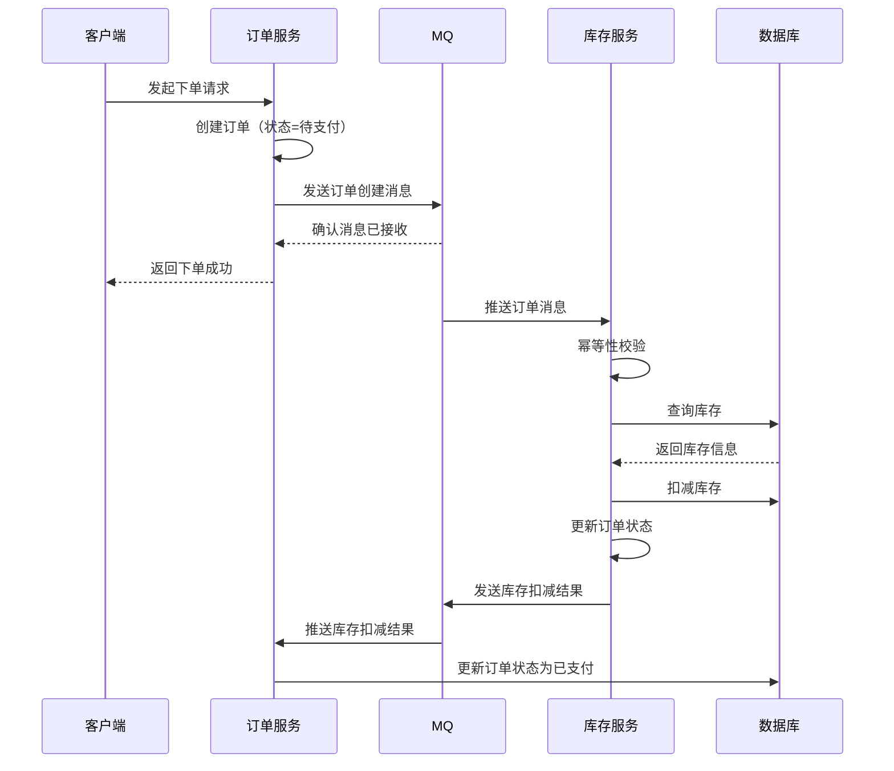

# 消息队列 - 综合场景串联

---

## 场景一：秒杀系统消息队列削峰

### 场景描述
电商秒杀活动期间，瞬时流量可达日常的数十倍。前端请求直接打到后端服务会导致数据库压力过大甚至宕机。通过消息队列将秒杀请求暂存，后端按固定速率消费，实现流量削峰填谷。

### 涉及知识点
- [Kafka核心原理](kafka/01-Kafka核心原理.md)：高吞吐原理、分区机制、消费者组
- [RabbitMQ核心原理](rabbitmq/02-RabbitMQ核心原理.md)：消息确认机制、持久化、死信队列
- [RocketMQ核心原理](rocketmq/01-RocketMQ核心原理.md)：消息存储、同步/异步刷盘、消费重试
- [消息队列笔面试题集](03-消息队列笔面试题集.md)：消息队列三大作用

### 协作流程
1. 用户发起秒杀请求，网关层进行限流和初步校验
2. 请求通过后，将秒杀订单消息发送到消息队列（Kafka 或 RocketMQ）
3. 后端秒杀服务以固定速率（如 1000 TPS）从队列消费消息
4. 消费时校验库存，扣减库存，创建订单
5. 秒杀结果通过 WebSocket 或轮询方式通知前端
6. 库存不足时，后续消息快速返回已售罄

### 关键要点
- 消息队列在秒杀系统中充当缓冲区，隔离前端流量冲击与后端处理能力
- Kafka 适合超高吞吐场景（百万级），RocketMQ 适合需要事务消息保证库存扣减一致性的场景
- 需设置合理的分区数，消费者数量不超过分区数
- 秒杀结果通知可通过独立的 Topic 异步推送，避免阻塞秒杀消费线程
- 消息可靠性由 acks=all（Kafka）或同步刷盘（RocketMQ）保障



> 上图展示了订单异步处理的完整时序流程：客户端下单后，订单服务先创建订单并将消息发送到 MQ，然后立即返回结果给客户端；库存服务异步消费消息完成库存扣减，最终更新订单状态。这种异步解耦模式有效提升了系统的吞吐量和响应速度。

---

## 场景二：RocketMQ 实现分布式事务最终一致性

### 场景描述
电商下单场景中，订单创建和库存扣减分属不同微服务，需要保证两者同时成功或同时失败。使用 RocketMQ 事务消息实现分布式事务的最终一致性。

### 涉及知识点
- [RocketMQ高级特性 - 事务消息](rocketmq/02-RocketMQ高级特性.md)：半消息机制、两阶段确认、消息回查
- [RocketMQ核心原理](rocketmq/01-RocketMQ核心原理.md)：消息发送可靠性、同步发送

### 协作流程
1. 订单服务发送半消息到 RocketMQ（消费者此时不可见）
2. 订单服务执行本地事务：创建订单 + 扣减库存（在同一数据库事务中）
3. 本地事务成功则向 Broker 发送 Commit，半消息变为可消费
4. 本地事务失败则向 Broker 发送 Rollback，半消息被删除
5. 若 Broker 未收到 Commit/Rollback 确认（如订单服务宕机），定时回查订单服务的 checkLocalTransaction 方法
6. 回查时根据订单是否存在于数据库判断实际状态，返回 Commit 或 Rollback
7. 支付服务消费已 Commit 的事务消息，执行支付相关逻辑

### 关键要点
- 事务消息三阶段：发送半消息、执行本地事务、Broker 回查兜底
- 回查逻辑必须幂等，根据数据库实际状态返回结果，最多回查 15 次
- 本地事务需包含订单创建和库存扣减，保证原子性
- 消费端需实现幂等，防止重复消费
- 事务消息适用于最终一致性场景，不适用于需要强一致性的业务

---

## 完整可运行示例代码

以下是一个基于 RocketMQ 的订单异步处理完整示例，涵盖下单、发送消息、消费消息、更新状态的全流程。

### 步骤一：Maven 依赖 pom.xml

```xml
<!-- pom.xml -->
<project xmlns="http://maven.apache.org/POM/4.0.0"
         xmlns:xsi="http://www.w3.org/2001/XMLSchema-instance"
         xsi:schemaLocation="http://maven.apache.org/POM/4.0.0
         http://maven.apache.org/xsd/maven-4.0.0.xsd">
    <modelVersion>4.0.0</modelVersion>

    <parent>
        <groupId>org.springframework.boot</groupId>
        <artifactId>spring-boot-starter-parent</artifactId>
        <version>2.7.18</version>
        <relativePath/>
    </parent>

    <groupId>com.example</groupId>
    <artifactId>rocketmq-order-demo</artifactId>
    <version>1.0.0</version>

    <properties>
        <java.version>11</java.version>
        <rocketmq.version>2.3.0</rocketmq.version>
    </properties>

    <dependencies>
        <!-- Spring Boot Web -->
        <dependency>
            <groupId>org.springframework.boot</groupId>
            <artifactId>spring-boot-starter-web</artifactId>
        </dependency>
        <!-- RocketMQ Spring Boot Starter -->
        <dependency>
            <groupId>org.apache.rocketmq</groupId>
            <artifactId>rocketmq-spring-boot-starter</artifactId>
            <version>${rocketmq.version}</version>
        </dependency>
        <!-- RocketMQ Client -->
        <dependency>
            <groupId>org.apache.rocketmq</groupId>
            <artifactId>rocketmq-client</artifactId>
            <version>5.1.4</version>
        </dependency>
        <!-- MySQL -->
        <dependency>
            <groupId>com.mysql</groupId>
            <artifactId>mysql-connector-j</artifactId>
            <scope>runtime</scope>
        </dependency>
        <!-- MyBatis Plus -->
        <dependency>
            <groupId>com.baomidou</groupId>
            <artifactId>mybatis-plus-boot-starter</artifactId>
            <version>3.5.5</version>
        </dependency>
        <!-- Lombok -->
        <dependency>
            <groupId>org.projectlombok</groupId>
            <artifactId>lombok</artifactId>
            <optional>true</optional>
        </dependency>
        <!-- Fastjson (用于消息序列化) -->
        <dependency>
            <groupId>com.alibaba</groupId>
            <artifactId>fastjson</artifactId>
            <version>2.0.43</version>
        </dependency>
    </dependencies>
</project>
```

### 步骤二：数据库建表 SQL

```sql
-- 订单表
CREATE TABLE `t_order` (
    `id` BIGINT NOT NULL AUTO_INCREMENT COMMENT '主键ID',
    `order_id` VARCHAR(64) NOT NULL COMMENT '订单编号',
    `user_id` BIGINT NOT NULL COMMENT '用户ID',
    `product_id` BIGINT NOT NULL COMMENT '商品ID',
    `product_name` VARCHAR(200) NOT NULL COMMENT '商品名称',
    `quantity` INT NOT NULL COMMENT '购买数量',
    `total_amount` DECIMAL(10,2) NOT NULL COMMENT '订单总金额',
    `status` TINYINT NOT NULL DEFAULT 0 COMMENT '订单状态: 0-待支付, 1-已支付, 2-已发货, 3-已完成, 4-已取消, 5-支付超时',
    `create_time` DATETIME NOT NULL DEFAULT CURRENT_TIMESTAMP COMMENT '创建时间',
    `update_time` DATETIME NOT NULL DEFAULT CURRENT_TIMESTAMP ON UPDATE CURRENT_TIMESTAMP COMMENT '更新时间',
    PRIMARY KEY (`id`),
    UNIQUE KEY `uk_order_id` (`order_id`),
    KEY `idx_user_id` (`user_id`),
    KEY `idx_status` (`status`),
    KEY `idx_create_time` (`create_time`)
) ENGINE=InnoDB DEFAULT CHARSET=utf8mb4 COMMENT='订单表';

-- 订单消息发送记录表（用于幂等性校验）
CREATE TABLE `t_order_message` (
    `id` BIGINT NOT NULL AUTO_INCREMENT COMMENT '主键ID',
    `order_id` VARCHAR(64) NOT NULL COMMENT '订单编号',
    `msg_id` VARCHAR(128) NOT NULL COMMENT '消息ID',
    `msg_status` TINYINT NOT NULL DEFAULT 0 COMMENT '消息状态: 0-发送中, 1-已发送, 2-消费中, 3-已消费, 4-消费失败',
    `create_time` DATETIME NOT NULL DEFAULT CURRENT_TIMESTAMP COMMENT '创建时间',
    `update_time` DATETIME NOT NULL DEFAULT CURRENT_TIMESTAMP ON UPDATE CURRENT_TIMESTAMP COMMENT '更新时间',
    PRIMARY KEY (`id`),
    UNIQUE KEY `uk_msg_id` (`msg_id`),
    KEY `idx_order_id` (`order_id`)
) ENGINE=InnoDB DEFAULT CHARSET=utf8mb4 COMMENT='订单消息发送记录表';
```

### 步骤三：application.yml 配置

```yaml
# src/main/resources/application.yml
server:
  port: 8080

spring:
  application:
    name: rocketmq-order-demo
  datasource:
    url: jdbc:mysql://127.0.0.1:3306/order_db?useSSL=false&serverTimezone=Asia/Shanghai&characterEncoding=utf8
    username: root
    password: root
    driver-class-name: com.mysql.cj.jdbc.Driver

# RocketMQ 配置
rocketmq:
  name-server: 127.0.0.1:9876
  producer:
    group: order-producer-group
    # 发送消息超时时间（毫秒）
    send-message-timeout: 3000
    # 消息最大大小（字节）
    max-message-size: 4194304
    # 同步发送失败重试次数
    retry-times-when-send-failed: 2
    # 异步发送失败重试次数
    retry-times-when-send-async-failed: 2
  consumer:
    # ===== 订单创建消费者 =====
    order-create-consumer:
      group: order-create-consumer-group
      topic: order-topic
      tag: order-create
      # 消费模式: CLUSTERING(集群) / BROADCASTING(广播)
      message-model: CLUSTERING
      # 消费线程数
      consume-thread-min: 5
      consume-thread-max: 10
    # ===== 订单支付消费者 =====
    order-pay-consumer:
      group: order-pay-consumer-group
      topic: order-topic
      tag: order-pay
      message-model: CLUSTERING
      consume-thread-min: 5
      consume-thread-max: 10

# 日志级别
logging:
  level:
    com.example: debug
    RocketmqClient: warn
```

### 步骤四：实体类定义

```java
// src/main/java/com/example/order/entity/Order.java
package com.example.order.entity;

import com.baomidou.mybatisplus.annotation.*;
import lombok.Data;

import java.math.BigDecimal;
import java.time.LocalDateTime;

@Data
@TableName("t_order")
public class Order {

    @TableId(type = IdType.AUTO)
    private Long id;

    /** 订单编号 */
    private String orderId;

    /** 用户ID */
    private Long userId;

    /** 商品ID */
    private Long productId;

    /** 商品名称 */
    private String productName;

    /** 购买数量 */
    private Integer quantity;

    /** 订单总金额 */
    private BigDecimal totalAmount;

    /**
     * 订单状态:
     * 0 - 待支付
     * 1 - 已支付
     * 2 - 已发货
     * 3 - 已完成
     * 4 - 已取消
     * 5 - 支付超时
     */
    private Integer status;

    @TableField(fill = FieldFill.INSERT)
    private LocalDateTime createTime;

    @TableField(fill = FieldFill.INSERT_UPDATE)
    private LocalDateTime updateTime;
}
```

```java
// src/main/java/com/example/order/entity/OrderMessage.java
package com.example.order.entity;

import com.baomidou.mybatisplus.annotation.*;
import lombok.Data;

import java.time.LocalDateTime;

@Data
@TableName("t_order_message")
public class OrderMessage {

    @TableId(type = IdType.AUTO)
    private Long id;

    /** 订单编号 */
    private String orderId;

    /** 消息ID */
    private String msgId;

    /**
     * 消息状态:
     * 0 - 发送中
     * 1 - 已发送
     * 2 - 消费中
     * 3 - 已消费
     * 4 - 消费失败
     */
    private Integer msgStatus;

    /** 消息体（JSON 序列化后的订单数据） */
    private String payload;

    /** 目标 Topic */
    private String topic;

    /** 消息标签 */
    private String tag;

    @TableField(fill = FieldFill.INSERT)
    private LocalDateTime createTime;

    @TableField(fill = FieldFill.INSERT_UPDATE)
    private LocalDateTime updateTime;
}
```

```java
// src/main/java/com/example/order/dto/CreateOrderDTO.java
package com.example.order.dto;

import lombok.Data;

import java.math.BigDecimal;

@Data
public class CreateOrderDTO {
    /** 用户ID */
    private Long userId;
    /** 商品ID */
    private Long productId;
    /** 商品名称 */
    private String productName;
    /** 购买数量 */
    private Integer quantity;
    /** 订单总金额 */
    private BigDecimal totalAmount;
}
```

```java
// src/main/java/com/example/order/dto/OrderMessageDTO.java
package com.example.order.dto;

import lombok.AllArgsConstructor;
import lombok.Builder;
import lombok.Data;
import lombok.NoArgsConstructor;

import java.math.BigDecimal;
import java.time.LocalDateTime;

/**
 * 订单消息 DTO（通过 RocketMQ 传输的订单数据）
 */
@Data
@Builder
@NoArgsConstructor
@AllArgsConstructor
public class OrderMessageDTO {
    /** 订单编号 */
    private String orderId;
    /** 用户ID */
    private Long userId;
    /** 商品ID */
    private Long productId;
    /** 商品名称 */
    private String productName;
    /** 购买数量 */
    private Integer quantity;
    /** 订单总金额 */
    private BigDecimal totalAmount;
    /** 下单时间 */
    private LocalDateTime createTime;
}
```

### 步骤五：订单状态枚举

```java
// src/main/java/com/example/order/enums/OrderStatus.java
package com.example.order.enums;

import lombok.AllArgsConstructor;
import lombok.Getter;

@Getter
@AllArgsConstructor
public enum OrderStatus {
    PENDING_PAY(0, "待支付"),
    PAID(1, "已支付"),
    SHIPPED(2, "已发货"),
    COMPLETED(3, "已完成"),
    CANCELLED(4, "已取消"),
    PAY_TIMEOUT(5, "支付超时");

    private final int code;
    private final String desc;

    public static OrderStatus fromCode(int code) {
        for (OrderStatus status : values()) {
            if (status.code == code) {
                return status;
            }
        }
        throw new IllegalArgumentException("未知订单状态: " + code);
    }
}
```

### 步骤六：订单服务 - 下单并发送消息

```java
// src/main/java/com/example/order/service/OrderService.java
package com.example.order.service;

import com.alibaba.fastjson2.JSON;
import com.baomidou.mybatisplus.core.conditions.query.LambdaQueryWrapper;
import com.example.order.dto.CreateOrderDTO;
import com.example.order.dto.OrderMessageDTO;
import com.example.order.entity.Order;
import com.example.order.entity.OrderMessage;
import com.example.order.enums.OrderStatus;
import com.example.order.mapper.OrderMapper;
import com.example.order.mapper.OrderMessageMapper;
import lombok.RequiredArgsConstructor;
import lombok.extern.slf4j.Slf4j;
import org.apache.rocketmq.client.producer.SendResult;
import org.apache.rocketmq.client.producer.SendStatus;
import org.apache.rocketmq.spring.core.RocketMQTemplate;
import org.springframework.messaging.Message;
import org.springframework.messaging.support.MessageBuilder;
import org.springframework.stereotype.Service;
import org.springframework.transaction.annotation.Transactional;

import java.time.LocalDateTime;
import java.util.UUID;

@Slf4j
@Service
@RequiredArgsConstructor
public class OrderService {

    private final OrderMapper orderMapper;
    private final OrderMessageMapper orderMessageMapper;
    private final RocketMQTemplate rocketMQTemplate;

    private static final String ORDER_TOPIC = "order-topic";
    private static final String ORDER_CREATE_TAG = "order-create";

    /**
     * 下单完整流程：创建订单 → 记录消息 → 事务提交后异步发送
     * 使用本地消息表模式保证最终一致性，避免 syncSend 在事务内的风险
     */
    @Transactional(rollbackFor = Exception.class)
    public String createOrder(CreateOrderDTO createOrderDTO) {
        // ===== 步骤 1: 创建订单，写入数据库 =====
        Order order = new Order();
        order.setOrderId(generateOrderId());
        order.setUserId(createOrderDTO.getUserId());
        order.setProductId(createOrderDTO.getProductId());
        order.setProductName(createOrderDTO.getProductName());
        order.setQuantity(createOrderDTO.getQuantity());
        order.setTotalAmount(createOrderDTO.getTotalAmount());
        order.setStatus(OrderStatus.PENDING_PAY.getCode());
        orderMapper.insert(order);
        log.info("订单已创建，订单编号: {}", order.getOrderId());

        // ===== 步骤 2: 构建订单消息 DTO =====
        OrderMessageDTO messageDTO = OrderMessageDTO.builder()
                .orderId(order.getOrderId())
                .userId(order.getUserId())
                .productId(order.getProductId())
                .productName(order.getProductName())
                .quantity(order.getQuantity())
                .totalAmount(order.getTotalAmount())
                .createTime(LocalDateTime.now())
                .build();

        // ===== 步骤 3: 写入本地消息表（与订单在同一事务中）=====
        String msgKey = UUID.randomUUID().toString();
        OrderMessage orderMessage = new OrderMessage();
        orderMessage.setOrderId(order.getOrderId());
        orderMessage.setMsgId(msgKey);
        orderMessage.setMsgStatus(0); // 0-待发送
        orderMessage.setPayload(JSON.toJSONString(messageDTO));
        orderMessage.setTopic(ORDER_TOPIC);
        orderMessage.setTag(ORDER_CREATE_TAG);
        orderMessageMapper.insert(orderMessage);
        log.info("消息已写入本地消息表，待事务提交后发送");

        return order.getOrderId();
    }

    /**
     * 事务提交后，由定时任务扫描本地消息表发送到 RocketMQ
     * 或使用 @TransactionalEventListener 在事务提交后触发
     */
    @TransactionalEventListener(phase = TransactionPhase.AFTER_COMMIT)
    public void sendOrderMessage(OrderMessage orderMessage) {
        Message<String> message = MessageBuilder
                .withPayload(orderMessage.getPayload())
                .setHeader("orderId", orderMessage.getOrderId())
                .setHeader("msgKey", orderMessage.getMsgId())
                .build();

        SendResult sendResult = rocketMQTemplate.syncSend(
                orderMessage.getTopic() + ":" + orderMessage.getTag(),
                message,
                3000
        );

        if (sendResult.getSendStatus() == SendStatus.SEND_OK) {
            orderMessage.setMsgStatus(1); // 已发送
            orderMessageMapper.updateStatus(orderMessage.getMsgId(), 1);
        } else {
            // 发送失败，定时任务会重试
            log.error("消息发送失败: {}", orderMessage.getMsgId());
        }
    }

    /**
     * 生成订单编号
     */
    private String generateOrderId() {
        // 格式: ORD + 时间戳 + 4位随机数
        return "ORD" + System.currentTimeMillis() +
               String.format("%04d", (int) (Math.random() * 10000));
    }

    /**
     * 查询订单
     */
    public Order getOrderByOrderId(String orderId) {
        LambdaQueryWrapper<Order> wrapper = new LambdaQueryWrapper<>();
        wrapper.eq(Order::getOrderId, orderId);
        return orderMapper.selectOne(wrapper);
    }
}
```

### 步骤七：订单创建消费者 - 消费消息并处理业务

```java
// src/main/java/com/example/order/consumer/OrderCreateConsumer.java
package com.example.order.consumer;

import com.alibaba.fastjson2.JSON;
import com.baomidou.mybatisplus.core.conditions.query.LambdaQueryWrapper;
import com.example.order.dto.OrderMessageDTO;
import com.example.order.entity.Order;
import com.example.order.entity.OrderMessage;
import com.example.order.enums.OrderStatus;
import com.example.order.mapper.OrderMapper;
import com.example.order.mapper.OrderMessageMapper;
import lombok.RequiredArgsConstructor;
import lombok.extern.slf4j.Slf4j;
import org.apache.rocketmq.spring.annotation.RocketMQMessageListener;
import org.apache.rocketmq.spring.annotation.ConsumeMode;
import org.apache.rocketmq.spring.annotation.SelectorType;
import org.apache.rocketmq.spring.core.RocketMQListener;
import org.springframework.stereotype.Component;
import org.springframework.transaction.annotation.Transactional;

/**
 * 订单创建消费者
 * 消费下单消息，执行库存扣减、优惠券核销等异步处理
 */
@Slf4j
@Component
@RequiredArgsConstructor
@RocketMQMessageListener(
    topic = "order-topic",
    selectorExpression = "order-create",      // 过滤标签
    selectorType = SelectorType.TAG,          // 按标签过滤
    consumerGroup = "order-create-consumer-group",
    consumeThreadMax = 10,
    consumeMode = ConsumeMode.CONCURRENTLY
)
public class OrderCreateConsumer implements RocketMQListener<String> {

    private final OrderMapper orderMapper;
    private final OrderMessageMapper orderMessageMapper;

    @Override
    @Transactional(rollbackFor = Exception.class)
    public void onMessage(String message) {
        log.info("===== 收到订单创建消息 =====");
        log.info("消息内容: {}", message);

        OrderMessageDTO orderDTO = JSON.parseObject(message, OrderMessageDTO.class);

        try {
            // ===== 步骤 1: 幂等性校验 =====
            // 检查订单是否已被处理，防止重复消费
            Order existingOrder = orderMapper.selectOne(
                    new LambdaQueryWrapper<Order>()
                            .eq(Order::getOrderId, orderDTO.getOrderId())
            );
            if (existingOrder != null && existingOrder.getStatus() != OrderStatus.PENDING_PAY.getCode()) {
                log.warn("订单已处理，跳过重复消费。订单编号: {}, 当前状态: {}",
                        orderDTO.getOrderId(), existingOrder.getStatus());
                return;
            }

            // ===== 步骤 2: 执行异步业务处理 =====
            // 2.1 库存扣减（调用库存服务）
            boolean stockReduced = reduceStock(orderDTO.getProductId(), orderDTO.getQuantity());
            if (!stockReduced) {
                log.error("库存扣减失败，订单编号: {}", orderDTO.getOrderId());
                // 库存不足，更新订单状态为已取消
                updateOrderStatus(orderDTO.getOrderId(), OrderStatus.CANCELLED);
                return;
            }

            // 2.2 优惠券核销（调用优惠券服务）
            boolean couponUsed = useCoupon(orderDTO.getUserId(), orderDTO.getOrderId());
            if (!couponUsed) {
                log.warn("优惠券核销失败，订单编号: {}，但不影响订单流程", orderDTO.getOrderId());
            }

            // 2.3 发送下单成功通知（短信/推送）
            sendNotification(orderDTO.getUserId(), orderDTO.getOrderId());

            // ===== 步骤 3: 更新订单状态为已支付 =====
            updateOrderStatus(orderDTO.getOrderId(), OrderStatus.PAID);
            log.info("订单异步处理完成，订单编号: {}", orderDTO.getOrderId());

        } catch (Exception e) {
            log.error("订单异步处理异常，订单编号: {}", orderDTO.getOrderId(), e);
            // 抛出异常触发 RocketMQ 重试机制（默认重试 16 次）
            throw new RuntimeException("订单异步处理失败", e);
        }
    }

    /**
     * 更新订单状态
     */
    private void updateOrderStatus(String orderId, OrderStatus status) {
        Order order = orderMapper.selectOne(
                new LambdaQueryWrapper<Order>().eq(Order::getOrderId, orderId)
        );
        if (order != null) {
            order.setStatus(status.getCode());
            orderMapper.updateById(order);
            log.info("订单状态已更新，订单编号: {}, 新状态: {}", orderId, status.getDesc());
        }
    }

    // ===== 模拟外部服务调用 =====

    private boolean reduceStock(Long productId, int quantity) {
        log.info("模拟库存扣减: productId={}, quantity={}", productId, quantity);
        return true;
    }

    private boolean useCoupon(Long userId, String orderId) {
        log.info("模拟优惠券核销: userId={}, orderId={}", userId, orderId);
        return true;
    }

    private void sendNotification(Long userId, String orderId) {
        log.info("模拟发送通知: userId={}, orderId={}", userId, orderId);
    }
}
```

### 步骤八：订单支付消费者 - 处理支付回调

```java
// src/main/java/com/example/order/consumer/OrderPayConsumer.java
package com.example.order.consumer;

import com.alibaba.fastjson2.JSON;
import com.alibaba.fastjson2.JSONObject;
import com.baomidou.mybatisplus.core.conditions.query.LambdaQueryWrapper;
import com.example.order.entity.Order;
import com.example.order.enums.OrderStatus;
import com.example.order.mapper.OrderMapper;
import lombok.RequiredArgsConstructor;
import lombok.extern.slf4j.Slf4j;
import org.apache.rocketmq.spring.annotation.RocketMQMessageListener;
import org.apache.rocketmq.spring.annotation.SelectorType;
import org.apache.rocketmq.spring.core.RocketMQListener;
import org.springframework.stereotype.Component;

/**
 * 订单支付消费者
 * 消费支付成功消息，更新订单状态并触发发货流程
 */
@Slf4j
@Component
@RequiredArgsConstructor
@RocketMQMessageListener(
    topic = "order-topic",
    selectorExpression = "order-pay",
    selectorType = SelectorType.TAG,
    consumerGroup = "order-pay-consumer-group",
    consumeThreadMax = 10,
    consumeMode = ConsumeMode.CONCURRENTLY
)
public class OrderPayConsumer implements RocketMQListener<String> {

    private final OrderMapper orderMapper;

    @Override
    public void onMessage(String message) {
        log.info("===== 收到支付成功消息 =====");
        log.info("消息内容: {}", message);

        JSONObject payInfo = JSON.parseObject(message);
        String orderId = payInfo.getString("orderId");
        String transactionId = payInfo.getString("transactionId");

        // 查询订单
        Order order = orderMapper.selectOne(
                new LambdaQueryWrapper<Order>().eq(Order::getOrderId, orderId)
        );
        if (order == null) {
            log.error("订单不存在，订单编号: {}", orderId);
            return;
        }

        // 幂等性校验：只有待支付状态的订单才能更新为已支付
        if (order.getStatus() != OrderStatus.PENDING_PAY.getCode()) {
            log.warn("订单状态不是待支付，跳过处理。订单编号: {}, 当前状态: {}",
                    orderId, order.getStatus());
            return;
        }

        // 更新订单状态为已支付
        order.setStatus(OrderStatus.PAID.getCode());
        orderMapper.updateById(order);

        log.info("支付处理完成，订单编号: {}, 交易流水号: {}, 状态已更新为: {}",
                orderId, transactionId, OrderStatus.PAID.getDesc());

        // 后续可触发发货流程（发送物流消息到另一个 Topic）
    }
}
```

### 步骤九：订单控制器

```java
// src/main/java/com/example/order/controller/OrderController.java
package com.example.order.controller;

import com.example.order.dto.CreateOrderDTO;
import com.example.order.entity.Order;
import com.example.order.service.OrderService;
import lombok.RequiredArgsConstructor;
import lombok.extern.slf4j.Slf4j;
import org.springframework.web.bind.annotation.*;

import java.util.HashMap;
import java.util.Map;

@Slf4j
@RestController
@RequestMapping("/orders")
@RequiredArgsConstructor
public class OrderController {

    private final OrderService orderService;

    /**
     * 创建订单（下单入口）
     */
    @PostMapping
    public Map<String, Object> createOrder(@RequestBody CreateOrderDTO createOrderDTO) {
        Map<String, Object> result = new HashMap<>();
        try {
            String orderId = orderService.createOrder(createOrderDTO);
            result.put("success", true);
            result.put("orderId", orderId);
            result.put("message", "下单成功");
            log.info("下单成功，订单编号: {}", orderId);
        } catch (Exception e) {
            result.put("success", false);
            result.put("message", "下单失败: " + e.getMessage());
            log.error("下单失败", e);
        }
        return result;
    }

    /**
     * 查询订单详情
     */
    @GetMapping("/{orderId}")
    public Map<String, Object> getOrder(@PathVariable String orderId) {
        Map<String, Object> result = new HashMap<>();
        Order order = orderService.getOrderByOrderId(orderId);
        if (order != null) {
            result.put("success", true);
            result.put("order", order);
        } else {
            result.put("success", false);
            result.put("message", "订单不存在");
        }
        return result;
    }
}
```

### 步骤十：启动类

```java
// src/main/java/com/example/order/OrderApplication.java
package com.example.order;

import org.mybatis.spring.annotation.MapperScan;
import org.springframework.boot.SpringApplication;
import org.springframework.boot.autoconfigure.SpringBootApplication;

@SpringBootApplication
@MapperScan("com.example.order.mapper")
public class OrderApplication {
    public static void main(String[] args) {
        SpringApplication.run(OrderApplication.class, args);
    }
}
```

### 步骤十一：Docker Compose 本地测试环境

```yaml
# docker-compose.yml
version: '3.8'
services:
  # RocketMQ NameServer
  namesrv:
    image: apache/rocketmq:5.1.4
    container_name: rmq-namesrv
    ports:
      - "9876:9876"
    command: sh mqnamesrv
    environment:
      JAVA_OPT_EXT: "-server -Xms512m -Xmx512m -Xmn256m"
    networks:
      - rmq-network

  # RocketMQ Broker
  broker:
    image: apache/rocketmq:5.1.4
    container_name: rmq-broker
    ports:
      - "10909:10909"
      - "10911:10911"
    command: sh mqbroker -n namesrv:9876
    environment:
      JAVA_OPT_EXT: "-server -Xms1g -Xmx1g -Xmn512m"
    depends_on:
      - namesrv
    networks:
      - rmq-network

  # RocketMQ Dashboard（可选，方便管理）
  dashboard:
    image: apacherocketmq/rocketmq-dashboard:latest
    container_name: rmq-dashboard
    ports:
      - "8088:8080"
    environment:
      JAVA_OPTS: "-Drocketmq.namesrv.addr=namesrv:9876"
    depends_on:
      - namesrv
    networks:
      - rmq-network

  # MySQL
  mysql:
    image: mysql:8.0
    container_name: order-mysql
    ports:
      - "3306:3306"
    environment:
      MYSQL_ROOT_PASSWORD: root
      MYSQL_DATABASE: order_db
    volumes:
      - ./sql/init.sql:/docker-entrypoint-initdb.d/init.sql
    networks:
      - rmq-network

networks:
  rmq-network:
    driver: bridge
```

```bash
# 启动所有服务
docker-compose up -d

# 访问 RocketMQ Dashboard: http://localhost:8088

# 测试下单接口
curl -X POST http://localhost:8080/orders \
  -H "Content-Type: application/json" \
  -d '{
    "userId": 1001,
    "productId": 2001,
    "productName": "iPhone 15 Pro Max",
    "quantity": 1,
    "totalAmount": 9999.00
  }'

# 预期返回:
# {"orderId":"ORD17187654320980001","success":true,"message":"下单成功"}

# 查询订单状态
curl http://localhost:8080/orders/ORD17187654320980001

# 查看 RocketMQ Dashboard 中消息消费情况
# 访问 http://localhost:8088 -> 消息 -> 选择 order-topic
```

> [返回模块目录](../../README.md) | [返回知识导览](../../知识导览.md)