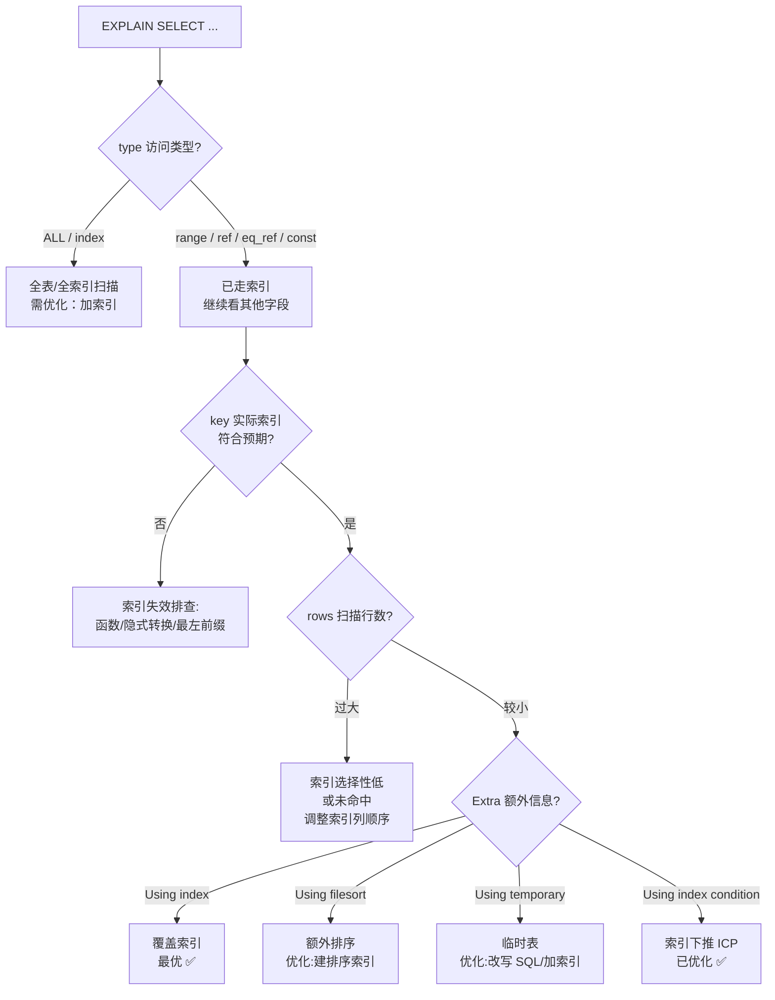

# MySQL 深度优化

> 学习路线对应：第3周 -- 数据访问与 ORM
> 前置知识：SQL 基本操作
> 预计学习时间：2 天

## 一、核心概念

### 1.1 InnoDB 存储引擎架构

| 组件 | 作用 | 关键参数 |
|------|------|---------|
| **Buffer Pool** | 缓存数据页和索引页，减少磁盘 I/O | `innodb_buffer_pool_size`（建议物理内存的 60%-80%） |
| **Change Buffer** | 缓存二级索引的变更，减少随机 I/O | `innodb_change_buffer_max_size` |
| **Redo Log** | 物理日志，记录数据页的修改，保证持久性 | `innodb_log_file_size`、`innodb_log_files_in_group` |
| **Undo Log** | 逻辑日志，记录数据修改前的值，支持事务回滚和 MVCC | 自动管理 |
| **Doublewrite Buffer** | 防止页断裂（Partial Page Write） | 位于系统表空间 |
| **Adaptive Hash Index** | 自动为热点数据页建立哈希索引，加速查询 | `innodb_adaptive_hash_index` |

**InnoDB vs MyISAM 对比：**

| 维度 | InnoDB | MyISAM |
|------|--------|--------|
| 事务 | 支持（ACID） | 不支持 |
| 行锁 | 支持 | 不支持（表锁） |
| 外键 | 支持 | 不支持 |
| 聚簇索引 | 是（主键索引存储数据） | 否（索引和数据分离） |
| 崩溃恢复 | 支持（Redo Log） | 不支持 |
| 全文索引 | MySQL 5.6+ 支持 | 支持 |
| 推荐版本 | MySQL 5.5+ 默认引擎 | 已基本被淘汰 |

### 1.2 行格式（Row Format）

| 行格式 | 特点 | 适用场景 |
|--------|------|---------|
| **Compact** | 基本格式，变长字段长度列表 + NULL 位图 | 通用场景 |
| **Dynamic** | 大字段（TEXT/BLOB）溢出页存储 | MySQL 5.7+ 默认 |
| **Compressed** | 支持页级压缩（zlib） | 存储空间敏感 |
| **Redundant** | 旧格式，已废弃 | 不建议使用 |

---

## 二、底层原理

### 2.1 B+ 树索引

**为什么 InnoDB 使用 B+ 树？**

| 特性 | B+ 树优势 |
|------|----------|
| **磁盘 I/O 友好** | 每个节点是一个页（默认 16KB），一次 I/O 读取一个节点 |
| **范围查询高效** | 叶子节点形成有序链表，范围查询只需遍历叶子节点 |
| **查询稳定** | 所有查询都要到叶子节点，查询时间复杂度 O(log n) |
| **扇出率高** | 每个节点存储多个索引键，树的高度低（3-4 层即可存储千万级数据） |

**B+ 树 vs B 树：**

| 维度 | B+ 树 | B 树 |
|------|------|------|
| 数据存储 | 只在叶子节点存储数据 | 所有节点都存储数据 |
| 叶子节点 | 形成有序链表 | 无链表 |
| 范围查询 | 高效（遍历链表） | 需中序遍历 |
| 非叶子节点 | 只存储索引键 | 存储索引键 + 数据 |

**聚簇索引 vs 二级索引：**

| 维度 | 聚簇索引（主键索引） | 二级索引（辅助索引） |
|------|-------------------|-------------------|
| 叶子节点内容 | 完整的行数据 | 索引列 + 主键值 |
| 数量 | 每表只有 1 个 | 可以有多个 |
| 查询流程 | 直接定位到行数据 | 先查二级索引 -> 回表查聚簇索引 |

**回表：** 通过二级索引查询时，先找到主键值，再通过主键值到聚簇索引中查找完整行数据。如果查询的列都在二级索引中，则不需要回表（覆盖索引）。

> **生活化类比：索引 = 图书馆目录柜** —— 没有索引时找一本书，得从第一排书架走到最后一排逐本翻（全表扫描，O(N)）。图书馆的"目录柜"就是索引：每张卡片记着"书名 → 所在书架号"（二级索引：索引列 → 主键），查卡片 O(logN) 定位到书架号，再去书架取书（回表）。如果目录卡片上同时写了书名、作者、摘要，你查卡片就够用了不用跑书架（覆盖索引，Using index）。目录卡片按拼音字母排好序（B+ 树有序），找"A~Z"范围的书只要从 A 翻到 Z 顺着走（范围查询走叶子链表）。图书馆主目录按图书编号排（聚簇索引，叶子节点就是书本身），辅助目录按书名排（二级索引，叶子存图书编号再去主目录找）。

> 📖 **参考链接**：
> - [MySQL 8.0 参考手册 - InnoDB Indexes](https://dev.mysql.com/doc/refman/8.0/en/innodb-indexes.html) -- InnoDB 索引（聚簇/二级）官方说明
> - [MySQL 8.0 参考手册 - B-Tree Index Characteristics](https://dev.mysql.com/doc/refman/8.0/en/index-btree-hash.html) -- B+ 树索引特性与适用场景
> - [MySQL 8.0 参考手册 - Clustered and Secondary Indexes](https://dev.mysql.com/doc/refman/8.0/en/innodb-index-types.html) -- 聚簇索引与二级索引回表机制

### 2.2 索引优化

#### 最左前缀原则

联合索引 `(a, b, c)` 的生效情况：

| WHERE 条件 | 是否使用索引 | 说明 |
|-----------|------------|------|
| `a = 1` | 是 | 使用索引的 a 列 |
| `a = 1 AND b = 2` | 是 | 使用索引的 a、b 列 |
| `a = 1 AND c = 3` | 部分（只用 a） | a 列匹配，c 列跳过 b 无法使用 |
| `b = 2` | 否 | 不满足最左前缀 |
| `a = 1 AND b > 2 AND c = 3` | 部分（a、b） | 范围查询后的 c 列无法使用索引 |

#### 覆盖索引

查询的列全部在索引中，不需要回表。

```sql
-- 创建索引: idx_name_email(name, email)
-- 覆盖索引查询（Extra: Using index）
SELECT name, email FROM users WHERE name = '张三';
-- 不需要回表，因为 name 和 email 都在索引中

-- 非覆盖索引查询
SELECT name, email, age FROM users WHERE name = '张三';
-- age 不在索引中，需要回表
```

#### 索引下推（ICP，Index Condition Pushdown）

MySQL 5.6+ 将 WHERE 条件下推到存储引擎层过滤，减少回表次数。

```sql
-- 索引: idx_name_age(name, age)
-- 查询: SELECT * FROM users WHERE name LIKE '张%' AND age = 25;
-- 无 ICP：存储引擎根据 name LIKE '张%' 找到所有行，返回 Server 层过滤 age = 25
-- 有 ICP：存储引擎在索引层面同时过滤 name LIKE '张%' AND age = 25，减少回表
```

#### 索引失效场景

| 场景 | 原因 | 示例 |
|------|------|------|
| 索引列使用函数 | 索引存储的是原始值 | `WHERE DATE(create_time) = '2025-01-01'` |
| 隐式类型转换 | 字符串和数字比较 | `WHERE phone = 13800138000`（phone 是 varchar） |
| LIKE 前导模糊 | 无法利用索引有序性 | `WHERE name LIKE '%张三'` |
| OR 条件 | 非索引列参与 OR | `WHERE a = 1 OR b = 2`（b 无索引） |
| 联合索引不满足最左前缀 | 跳过了最左列 | `WHERE b = 2`（索引是 a, b, c） |
| NOT、!=、<> | 无法精确定位 | `WHERE status != 1` |
| IS NULL / IS NOT NULL | 数据分布影响优化器选择 | `WHERE name IS NULL`（取决于NULL值占比和成本估算） |

### 2.3 SQL 优化

#### EXPLAIN 关键字段解读

| 字段 | 含义 | 优化判据 |
|------|------|---------|
| **type** | 访问类型 | `range` 为及格线，`ALL` 和 `index` 需优化 |
| **key** | 实际使用的索引 | 判断是否按预期使用索引 |
| **key_len** | 使用的索引长度 | 判断联合索引中多少列被使用 |
| **rows** | 预估扫描行数 | 越小越好 |
| **Extra** | 额外信息 | `Using index`（好）、`Using filesort`（需优化）、`Using temporary`（需优化） |

**type 从优到劣：** `system > const > eq_ref > ref > range > index > ALL`

> **生活化类比：EXPLAIN 执行计划 = 导航软件的路线规划** —— 你问导航"从 A 到 B 怎么走最快"，导航不会真开一遍车，而是先给你一张"规划路线单"（EXPLAIN 执行计划）：选了哪条路（key 用了哪个索引）、走的是高速还是小路（type 访问类型：const 高速直达 / range 部分路段 / ALL 土路全程堵）、预计开多远（rows 扫描行数预估）、有没有绕路绕道（Extra 的 Using filesort 临时排序 / Using temporary 临时表 = 绕路开销）。看懂路线单（EXPLAIN）才能判断该不该换路（加索引/改 SQL）。type=ALL 相当于导航说"全程无高速走县道"，rows=百万相当于"要开一百万公里"，Using filesort 相当于"中途还得停下来重新整理行李"——这些都是要优化的信号。

> **EXPLAIN 执行计划解读流程图**：下图展示拿到一条 SQL 后，如何按 EXPLAIN 字段顺序逐步诊断优化点。



> 📖 **参考链接**：
> - [MySQL 8.0 参考手册 - EXPLAIN Output Format](https://dev.mysql.com/doc/refman/8.0/en/explain-output.html) -- EXPLAIN 各字段（type/key/rows/Extra）官方详解
> - [MySQL 8.0 参考手册 - EXPLAIN](https://dev.mysql.com/doc/refman/8.0/en/explain.html) -- EXPLAIN 语法与使用
> - [MySQL 8.0 参考手册 - Range Access Method](https://dev.mysql.com/doc/refman/8.0/en/range-optimization.html) -- range 访问类型与范围查询优化

#### 慢查询日志分析

```sql
-- 开启慢查询日志
SET GLOBAL slow_query_log = ON;
SET GLOBAL long_query_time = 1;  -- 超过 1 秒的查询记录

-- 使用 mysqldumpslow 分析
-- mysqldumpslow -s t -t 10 /var/log/mysql/slow.log
```

> **生活化类比：慢查询日志 = 系统的年度体检报告** —— 体检报告不会告诉你"哪里治"，而是把所有异常指标（超标项）列出来让你逐条排查。慢查询日志就是数据库的体检报告：它按"执行时间超过阈值（long_query_time）"筛出所有亚健康的 SQL（异常指标），记录每条 SQL 的执行耗时、扫描行数、锁定时间。mysqldumpslow / pt-query-digest 相当于"体检报告汇总工具"，把成千上万条慢 SQL 按耗时/次数排序、归类合并（参数化后的同一模板算一类），帮你快速定位"最该优化的 Top 10"。体检报告的价值在于"先找最大的毛病"——优化一条执行 10 万次每次 2 秒的 SQL，远胜过优化一条执行 1 次每次 10 秒的 SQL。

**慢查询分析详解：**

```sql
-- 1. 慢查询相关核心参数
SHOW VARIABLES LIKE 'slow_query_log%';        -- 查看慢查询日志开关与路径
SHOW VARIABLES LIKE 'long_query_time';        -- 慢查询阈值（默认 10s，生产建议 1s 甚至 0.1s）
SHOW VARIABLES LIKE 'log_queries_not_using_indexes';  -- 是否记录未走索引的查询

-- 2. 动态开启（重启失效，持久化需改 my.cnf）
SET GLOBAL slow_query_log = ON;
SET GLOBAL long_query_time = 1;
SET GLOBAL log_queries_not_using_indexes = ON;

-- 3. 慢查询日志内容示例解读
-- # Time: 2025-01-10T10:00:00.123456Z
-- # User@Host: root[root] @ localhost []
-- # Query_time: 3.215438  Lock_time: 0.000123  Rows_sent: 1  Rows_examined: 2000000
-- SELECT * FROM orders WHERE user_id = 12345;
-- 解读: Query_time 总耗时 3.2s，Rows_examined 扫描 200 万行只为返回 1 行 → 典型缺索引
```

**mysqldumpslow 与 pt-query-digest 对比：**

| 工具 | 排序参数 | 特点 |
|------|---------|------|
| `mysqldumpslow` | `-s t`(总耗时) `-s c`(次数) `-s r`(行数) `-s at`(平均耗时) | MySQL 自带，功能基础，仅聚合 |
| `pt-query-digest` | 详细统计 | Percona Toolkit，支持指纹聚合、95% 分位、执行计划关联，生产首选 |

```bash
# mysqldumpslow: 按总耗时排序，取 Top 10
mysqldumpslow -s t -t 10 /var/log/mysql/slow.log

# pt-query-digest: 生产级分析（输出每类 SQL 的耗时分布、95% 分位、样本）
pt-query-digest /var/log/mysql/slow.log > slow_report.txt
```

> 📖 **参考链接**：
> - [MySQL 8.0 参考手册 - Slow Query Log](https://dev.mysql.com/doc/refman/8.0/en/slow-query-log.html) -- 慢查询日志开启与配置官方说明
> - [MySQL 8.0 参考手册 - mysqldumpslow](https://dev.mysql.com/doc/refman/8.0/en/mysqldumpslow.html) -- mysqldumpslow 参数与用法
> - [MySQL 8.0 参考手册 - Server System Variables](https://dev.mysql.com/doc/refman/8.0/en/server-system-variables.html) -- long_query_time 等系统变量

> **生活化类比：看病流程** -- 把慢查询优化想象成看病流程：
> - **慢查询日志 = 症状**：你感觉身体不舒服（系统响应变慢），医生第一步是问你哪里不舒服，记录下来（慢查询日志记录了所有执行时间超标的SQL）。
> - **EXPLAIN = 拍CT**：医生给你开CT检查单，看你的骨骼（执行计划）有没有问题。EXPLAIN 就是SQL的CT机，告诉你SQL走了什么索引（type、key）、扫描了多少行（rows）、有没有额外排序（Using filesort）。
> - **建索引 = 对症下药**：CT结果显示某处有问题（全表扫描 type=ALL），医生对症下药（给查询条件列建索引），问题解决。如果药不对症（建了索引但没用上），还需要重新诊断。

#### 深分页优化

```sql
-- 原始慢查询（OFFSET 100000 时需扫描并丢弃 100000 行）
SELECT * FROM orders WHERE status = 1 ORDER BY id LIMIT 100000, 20;

-- 优化方案：子查询定位 ID + 关联查询
SELECT o.* FROM orders o
JOIN (
    SELECT id FROM orders
    WHERE status = 1
    ORDER BY id
    LIMIT 100000, 20
) tmp ON o.id = tmp.id;

-- 优化方案：游标分页（记录上次 ID）
SELECT * FROM orders WHERE id > 100020 ORDER BY id LIMIT 20;
```

### 2.4 分库分表方案

#### 垂直拆分 vs 水平拆分

| 维度 | 垂直分库 | 垂直分表 | 水平分库 | 水平分表 |
|------|---------|---------|---------|---------|
| 拆分维度 | 按业务模块 | 按列（字段） | 按行（数据） | 按行（数据） |
| 优点 | 业务清晰，独立扩展 | 减少单行大小 | 分散写入压力 | 实现简单 |
| 缺点 | 跨库 JOIN 困难 | 需 JOIN 获取完整数据 | 跨分片查询复杂 | 数据分布可能不均 |

#### 分片算法

| 算法 | 原理 | 优点 | 缺点 |
|------|------|------|------|
| **哈希取模** | `hash(key) % N` | 数据分布均匀 | 扩容时迁移量大 |
| **一致性哈希** | 哈希环 + 虚拟节点 | 扩容时迁移少 | 实现复杂 |
| **范围分片** | 按值范围划分 | 范围查询高效 | 可能热点数据 |
| **日期分片** | 按年/月/日分片 | 归档方便 | 跨月查询需合并 |

#### 分片键选择原则

1. **高区分度：** 值分布均匀，避免数据倾斜
2. **查询高频：** 大部分查询都能带上分片键
3. **避免跨分片：** 关联查询尽量落在同一分片
4. **不可变：** 分片键值不应频繁修改
5. **业务相关性：** 与业务主键关联

> 📖 **参考链接**：
> - [MySQL 8.0 参考手册 - Partitioning](https://dev.mysql.com/doc/refman/8.0/en/partitioning.html) -- MySQL 分区（Partitioning）官方说明
> - [MySQL 8.0 参考手册 - InnoDB Architecture](https://dev.mysql.com/doc/refman/8.0/en/innodb-architecture.html) -- InnoDB 内存与后台线程架构

---

## 三、实战应用

### 3.1 索引设计原则

1. **高选择性列优先：** 区分度高的列（如 user_id）放在联合索引最左侧
2. **联合索引列顺序：** 等值查询列在前，范围查询列在后
3. **覆盖索引：** 尽量让查询的列都在索引中，避免回表
4. **避免冗余索引：** `(a)` 和 `(a, b)` 同时存在时，`(a)` 是冗余的
5. **索引数量控制：** 每张表索引不超过 5-6 个（索引维护有代价）

### 3.2 慢 SQL 优化案例

```sql
-- 案例1：隐式类型转换
-- 原始（phone 是 varchar 类型，这里用数字比较，导致索引失效）
SELECT * FROM users WHERE phone = 13800138000;
-- 优化
SELECT * FROM users WHERE phone = '13800138000';

-- 案例2：索引列使用函数
-- 原始（DATE() 函数导致索引失效）
SELECT * FROM orders WHERE DATE(created_at) = '2025-01-01';
-- 优化
SELECT * FROM orders WHERE created_at >= '2025-01-01' AND created_at < '2025-01-02';

-- 案例3：OR 条件
-- 原始（b 列无索引，导致全表扫描）
SELECT * FROM t WHERE a = 1 OR b = 2;
-- 优化
SELECT * FROM t WHERE a = 1
UNION
SELECT * FROM t WHERE b = 2;
```

**更多索引优化案例：**

```sql
-- 案例4：深分页优化（回表代价大）
-- 原始（LIMIT 100000,20：先走二级索引查 100020 个主键，再逐个回表，大部分回表结果被丢弃）
SELECT * FROM orders ORDER BY create_time LIMIT 100000, 20;
-- 优化：子查询先走覆盖索引拿到 20 个主键，只回表 20 次
SELECT * FROM orders o
JOIN (SELECT id FROM orders ORDER BY create_time LIMIT 100000, 20) t ON o.id = t.id;

-- 案例5：ORDER BY 与索引方向不一致导致 Using filesort
-- 原始（idx(a_asc, b_asc)，但查询要 a 升序 b 降序，无法利用索引有序性）
SELECT * FROM t WHERE a = 1 ORDER BY a, b DESC;  -- Extra: Using filesort
-- 优化（MySQL 8.0 支持降序索引）
ALTER TABLE t ADD INDEX idx_a_b_desc(a ASC, b DESC);
SELECT * FROM t WHERE a = 1 ORDER BY a, b DESC;  -- Extra: Using index，无需 filesort

-- 案例6：避免 SELECT * 触发回表
-- 原始（idx_name(name)，SELECT * 必须回表取所有列）
SELECT * FROM users WHERE name = '张三';
-- 优化：只查需要的列，且这些列都在索引中（覆盖索引）
ALTER TABLE users ADD INDEX idx_name_age(name, age);
SELECT id, name, age FROM users WHERE name = '张三';  -- Using index，不回表

-- 案例7：范围查询导致联合索引后续列失效
-- 原始（idx(a,b,c)，a 走等值、b 走范围，则 c 无法用索引）
SELECT * FROM t WHERE a = 1 AND b > 10 AND c = 5;  -- 只用到 a、b
-- 优化：调整联合索引列顺序，等值列在前、范围列在后
ALTER TABLE t ADD INDEX idx_a_c_b(a, c, b);
SELECT * FROM t WHERE a = 1 AND b > 10 AND c = 5;  -- a、c 走索引，b 走范围
```

> 📖 **参考链接**：
> - [MySQL 8.0 参考手册 - Optimization](https://dev.mysql.com/doc/refman/8.0/en/optimization.html) -- MySQL 查询优化官方总览
> - [MySQL 8.0 参考手册 - DESC Indexes](https://dev.mysql.com/doc/refman/8.0/en/create-index.html#create-index-descending) -- MySQL 8.0 降序索引说明
> - [MySQL 8.0 参考手册 - Covering Index](https://dev.mysql.com/doc/refman/8.0/en/glossary.html#glos_covering_index) -- 覆盖索引概念与 Using index 判定

### 3.3 分表策略

```sql
-- 取模分表（按 user_id 取模）
-- 表名: orders_0, orders_1, ..., orders_7
-- 路由: orders_{user_id % 8}

-- 日期分表（按月）
-- 表名: orders_202501, orders_202502, ...
-- 路由: 根据 created_at 确定表名

-- 哈希+取模（先哈希再取模，适用于分布不均的键）
-- 路由: orders_{hash(user_id) % 16}
```

### 3.4 慢查询分析与索引优化实战（综合案例）

**案例背景**：订单表 `orders`（5000 万行），排查线上慢查询，某接口平均响应 3.2s，触发慢查询告警。

#### 3.4.1 慢查询定位与 EXPLAIN 诊断

**原始慢 SQL**：

```sql
SELECT order_id, user_id, status, create_time
FROM orders
WHERE user_id = 10086 AND status = 1
ORDER BY create_time DESC
LIMIT 20;
```

**EXPLAIN 优化前（type=ALL，全表扫描）**：

| 字段 | 值 | 诊断 |
|------|-----|------|
| type | `ALL` | 全表扫描，扫描 5000 万行，必须优化 |
| key | `NULL` | 未使用任何索引 |
| rows | `50000000` | 预估扫描全表 |
| Extra | `Using where; Using filesort` | 需回表过滤 + 额外排序，最差组合 |

#### 3.4.2 索引优化实战

**步骤一：建立联合索引（遵循最左前缀）**

等值查询列（user_id、status）在前，范围/排序列（create_time）在后：

```sql
ALTER TABLE orders ADD INDEX idx_uid_status_ctime(user_id, status, create_time);
```

**EXPLAIN 优化后（type=ref，命中索引）**：

| 字段 | 值 | 诊断 |
|------|-----|------|
| type | `ref` | 走联合索引等值查找 |
| key | `idx_uid_status_ctime` | 命中预期索引 |
| key_len | `12` | user_id(4) + status(4) + create_time(4) 全部命中 |
| rows | `150` | 扫描行数从 5000 万降至 150 |
| Extra | `Using index condition` | 索引下推生效，无需 filesort |

**步骤二：覆盖索引优化（避免回表）**

业务只需 order_id、user_id、status、create_time 四列，而 order_id 是主键已在二级索引叶子节点，其余三列都在索引中，构成覆盖索引：

```sql
-- 查询列全部在 idx_uid_status_ctime 中（含隐式主键），Using index 不回表
SELECT order_id, user_id, status, create_time
FROM orders
WHERE user_id = 10086 AND status = 1
ORDER BY create_time DESC LIMIT 20;
-- Extra: Using index（最优，完全避免回表）
```

**步骤三：索引下推（ICP）验证**

对于模糊查询场景，验证 ICP 是否生效：

```sql
-- 索引 idx_name_age(name, age)
SELECT * FROM users WHERE name LIKE '张%' AND age > 18;
-- 无 ICP：按 name LIKE '张%' 找到所有行（可能上万行）全部回表，再过滤 age
-- 有 ICP（Extra: Using index condition）：存储引擎在索引层直接过滤 age>18，只回表命中行
```

#### 3.4.3 优化效果对比

| 指标 | 优化前 | 优化后 | 提升 |
|------|--------|--------|------|
| type | ALL（全表扫描） | ref（索引查找） | 命中索引 |
| 扫描行数 rows | 5000 万 | 150 | 降低 99.99% |
| Extra | Using filesort | Using index | 消除排序 + 免回表 |
| 平均响应时间 | 3.2s | 8ms | 提升 400 倍 |
| 慢查询告警 | 频繁触发 | 消除 | - |

> 📖 **参考链接**：
> - [MySQL 8.0 参考手册 - EXPLAIN Output](https://dev.mysql.com/doc/refman/8.0/en/explain-output.html) -- EXPLAIN type/key/rows/Extra 字段官方详解
> - [MySQL 8.0 参考手册 - Index Condition Pushdown](https://dev.mysql.com/doc/refman/8.0/en/index-condition-pushdown-optimization.html) -- 索引下推 ICP 原理与触发条件
> - [MySQL 8.0 参考手册 - Covering Index](https://dev.mysql.com/doc/refman/8.0/en/glossary.html#glos_covering_index) -- 覆盖索引与 Using index 判定

---

## 四、常见面试题（附答案）

### 1. 为什么 InnoDB 使用 B+ 树而不是 B 树或哈希？

- **B+ 树 vs B 树：** B+ 树数据只存储在叶子节点，非叶子节点只存索引键，扇出率更高，树更矮。叶子节点形成有序链表，范围查询高效。
- **B+ 树 vs 哈希：** 哈希只支持等值查询，不支持范围查询和排序。B+ 树支持等值查询、范围查询、排序和前缀匹配。

### 2. 什么是回表？如何避免回表？

回表是通过二级索引查询时，先找到主键值，再到聚簇索引中查找完整行数据的过程。**避免回表的方法：** 使用覆盖索引，让查询的所有列都在索引中。例如，查询 `SELECT name, email FROM users WHERE name = '张三'`，如果 `(name, email)` 上有联合索引，则不需要回表。

### 3. 联合索引的最左前缀原则是什么？

联合索引 `(a, b, c)` 的索引结构是先按 a 排序，a 相同时按 b 排序，b 相同时按 c 排序。查询条件必须从最左列开始才能使用索引。例如 `WHERE a = 1 AND b = 2` 可以使用索引，`WHERE b = 2` 不能使用索引。

### 4. 分库分表后如何保证全局唯一 ID？

1. **雪花算法（Snowflake）：** 64 位，高性能，趋势递增，本地生成，但依赖时钟同步
2. **号段模式（Leaf）：** 从数据库批量获取 ID 号段，高性能，全局唯一
3. **Redis 自增：** 使用 `INCR` 命令，简单可靠，但依赖 Redis 高可用
4. **UUID：** 实现简单，但无序导致索引性能差

> 📖 **参考链接**：
> - [MySQL 8.0 参考手册 - Index Hints](https://dev.mysql.com/doc/refman/8.0/en/index-hints.html) -- 索引提示（USE/FORCE/IGNORE INDEX）官方说明
> - [MySQL 8.0 参考手册 - LIMIT Optimization](https://dev.mysql.com/doc/refman/8.0/en/limit-optimization.html) -- LIMIT 分页查询优化

---

## 五、避坑指南

| 常见错误 | 现象 | 原因 | 解决方案 |
|---------|------|------|---------|
| 索引列上使用函数 | 索引失效，全表扫描 | 对索引列使用函数（DATE()、LOWER() 等）导致无法使用索引 | 将函数移到比较值一侧：`WHERE create_time >= '2025-01-01' AND create_time < '2025-01-02'` |
| 隐式类型转换 | 索引失效，查询变慢 | 字符串列与数字比较时触发隐式转换 | 确保参数类型与列类型一致：`WHERE phone = '13800138000'`（varchar 类型） |
| 使用 SELECT * | 无法使用覆盖索引，增加网络传输和内存开销 | 返回所有列，即使只需要少数几列 | 只查询需要的列：`SELECT id, name, email FROM users WHERE ...` |
| 多表 JOIN 未优化 | 查询超时，CPU 飙升 | 关联列无索引；驱动表数据量大；JOIN 过多 | 关联列建索引；小表驱动大表；WHERE 条件提前过滤；避免超过 3 个表 JOIN |

---

> **学习导航**：
> - 返回 [学习路线总览](../../README.md)
> - 本模块其他文件：[01-MySQL基础与SQL核心](./01-MySQL基础与SQL核心.md) | [02-JDBC核心原理](./02-JDBC核心原理.md) | [03-MyBatis原生框架](./03-MyBatis原生框架.md) | [04-Spring-Data-JPA深度](./04-Spring-Data-JPA深度.md) | [05-MyBatis-Plus实战](./05-MyBatis-Plus实战.md) | [07-数据库笔面试题集](./07-数据库笔面试题集.md)
> - 实战应用：[电商订单实时统计分析平台](../../extensions/project/01-电商订单实时统计分析平台.md)


