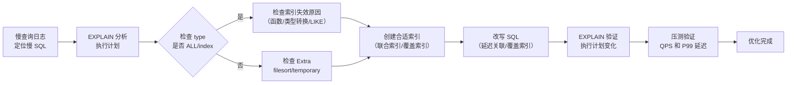

# MySQL Advanced - 综合场景串联

---

## 场景一：大表分页优化

### 场景描述
电商订单表数据量达到千万级别，用户查询历史订单列表时使用 `LIMIT offset, pageSize` 进行分页。当 offset 较大时（如翻到第 1000 页），查询耗时从毫秒级飙升到秒级，严重影响用户体验。需要在不改变业务逻辑的前提下优化深分页查询性能。

### 涉及知识点
- [MySQL 深度优化](./06-MySQL深度优化.md)：索引优化、覆盖索引、延迟关联、EXPLAIN 分析
- [数据库笔面试题集](./07-数据库笔面试题集.md)：分库分表、ES 辅助查询

### 协作流程
1. 使用 EXPLAIN 分析当前 SQL，确认查询是否使用了索引，关注 type 列（是否 ALL 全表扫描）、rows 列（扫描行数）、Extra 列（是否有 Using filesort）。
2. 确保 WHERE 条件字段和 ORDER BY 字段有联合索引，避免回表后再排序。例如订单表在 `(user_id, create_time)` 上建立联合索引。
3. 将深分页 SQL 改写为基于主键的延迟关联：
   - 原始 SQL：`SELECT * FROM orders WHERE user_id = 1 ORDER BY create_time DESC LIMIT 100000, 20`
   - 优化 SQL：`SELECT o.* FROM orders o JOIN (SELECT id FROM orders WHERE user_id = 1 ORDER BY create_time DESC LIMIT 100000, 20) AS tmp ON o.id = tmp.id`
   - 子查询仅扫描索引即可获取主键列表，避免回表读取全部数据，然后通过主键批量获取完整数据。
4. 业务层面限制最大翻页深度（如最多翻 100 页），引导用户使用搜索条件缩小范围。
5. 当数据量继续增长，引入 Elasticsearch 承接全文检索和复杂筛选，MySQL 仅负责根据主键 ID 列表批量回表查询。

### 关键要点
- 深分页的核心问题是 MySQL 需要扫描并丢弃大量无用行
- 延迟关联通过子查询只获取主键 ID，大幅减少回表的数据量
- 覆盖索引是深分页优化的基础，子查询阶段必须走索引
- 业务层面限制翻页深度是最终的兜底策略

---

## 场景二：SQL 慢查询优化完整流程

### 场景描述
线上监控告警发现某条 SQL 查询平均耗时从 50ms 飙升到 2s，导致接口响应超时。需要按照标准流程定位慢查询原因，分析执行计划，实施优化方案，并验证优化效果。

### 涉及知识点
- [MySQL 深度优化](./06-MySQL深度优化.md)：慢查询日志、EXPLAIN 分析、索引优化、SQL 改写
- [数据库笔面试题集](./07-数据库笔面试题集.md)：索引失效场景、SQL 优化技巧

### 协作流程
1. 开启慢查询日志并设置阈值：`SET GLOBAL slow_query_log = ON; SET GLOBAL long_query_time = 0.5;`，捕获耗时超过 500ms 的 SQL。
2. 使用 mysqldumpslow 或 pt-query-digest 分析慢查询日志，定位出现频率高、平均耗时长的 SQL，确定需要优化的目标 SQL。
3. 使用 EXPLAIN 分析 SQL 执行计划，重点关注：
   - type：是否为 ALL（全表扫描）或 index（全索引扫描），目标至少 range
   - key：是否使用了预期的索引，未使用需检查索引失效原因
   - rows：扫描行数是否合理
   - Extra：是否有 Using filesort（文件排序）或 Using temporary（临时表）
4. 检查索引失效原因：WHERE 条件列是否使用了函数、隐式类型转换、负向查询、LIKE 前导通配符等
5. 根据分析结果选择优化策略：
   - 索引失效：调整 SQL 写法，避免函数包裹索引列，确保类型匹配
   - 缺索引：创建合适的联合索引，遵循最左前缀原则
   - 回表过多：增加覆盖索引或使用延迟关联
   - 数据量大：考虑分库分表或引入 ES 辅助查询
6. 优化后再次 EXPLAIN 验证执行计划变化，确认 type 提升、rows 减少、Extra 中无排序或临时表
7. 在测试环境压测验证优化效果，确认 QPS 和 P99 延迟达标后上线

### 关键要点
- 慢查询优化遵循"定位 - 分析 - 优化 - 验证"四步流程
- EXPLAIN 是分析执行计划的核心工具，type、rows、Extra 是三大关键指标
- 索引优化不是盲目加索引，需要结合查询模式和数据分布设计
- 优化后必须验证，不能仅凭经验判断效果



> 上图展示了 MySQL 索引优化的标准流程：从慢查询日志定位目标 SQL，使用 EXPLAIN 分析执行计划，根据 type 和 Extra 指标判断是否需要创建索引或改写 SQL，最后通过 EXPLAIN 验证和压测确认优化效果。其中 EXPLAIN 的 type 列是判断查询效率的核心指标。

### 完整示例代码：慢查询优化完整案例

以下案例从零开始，完整演示"建表 -> 造数据 -> 创建索引 -> EXPLAIN 分析 -> 优化前后对比"全流程。

#### 步骤一：建表（创建大订单表）

```sql
-- ============================================================
-- 创建订单主表
-- ============================================================
CREATE TABLE t_large_order (
    id BIGINT AUTO_INCREMENT PRIMARY KEY COMMENT '主键',
    order_no VARCHAR(32) NOT NULL COMMENT '订单号',
    user_id BIGINT NOT NULL COMMENT '用户ID',
    product_id BIGINT NOT NULL COMMENT '商品ID',
    product_name VARCHAR(200) NOT NULL COMMENT '商品名称',
    amount DECIMAL(10,2) NOT NULL COMMENT '订单金额',
    status TINYINT NOT NULL DEFAULT 1 COMMENT '状态: 1-待支付 2-已支付 3-已发货 4-已完成 5-已取消',
    pay_time DATETIME COMMENT '支付时间',
    create_time DATETIME NOT NULL DEFAULT CURRENT_TIMESTAMP COMMENT '创建时间',
    update_time DATETIME DEFAULT CURRENT_TIMESTAMP ON UPDATE CURRENT_TIMESTAMP COMMENT '更新时间',
    INDEX idx_user_id (user_id),
    INDEX idx_order_no (order_no)
) ENGINE=InnoDB DEFAULT CHARSET=utf8mb4 COLLATE=utf8mb4_unicode_ci COMMENT='大订单表（千万级）';
```

#### 步骤二：插入测试数据（存储过程造数据）

```sql
-- ============================================================
-- 存储过程：批量插入 500 万条订单数据
-- 耗时约 5-10 分钟，取决于服务器性能
-- ============================================================

DELIMITER $$

CREATE PROCEDURE generate_large_orders(IN total_rows INT)
BEGIN
    DECLARE i INT DEFAULT 1;
    DECLARE batch_size INT DEFAULT 1000;
    DECLARE product_names VARCHAR(2000) DEFAULT
        'iPhone 15 Pro Max,MacBook Pro M3,iPad Air,AirPods Pro,Apple Watch Ultra,
         Sony WH-1000XM5,Kindle Paperwhite,DJI Mini 3 Pro,Nintendo Switch,
         Samsung Galaxy S24,Logitech MX Master 3S,Dell U2723QE';

    -- 关闭自动提交，批量插入
    SET autocommit = 0;

    WHILE i <= total_rows DO
        -- 批量插入 1000 条
        INSERT INTO t_large_order (order_no, user_id, product_id, product_name, amount, status, pay_time, create_time)
        SELECT
            CONCAT('ORD', LPAD(start_num + n, 12, '0')),
            FLOOR(1 + RAND() * 100000),                              -- 用户ID 1~10万
            FLOOR(1 + RAND() * 10000),                               -- 商品ID 1~1万
            ELT(FLOOR(1 + RAND() * 12),
                'iPhone 15 Pro Max','MacBook Pro M3','iPad Air','AirPods Pro',
                'Apple Watch Ultra','Sony WH-1000XM5','Kindle Paperwhite',
                'DJI Mini 3 Pro','Nintendo Switch','Samsung Galaxy S24',
                'Logitech MX Master 3S','Dell U2723QE'),
            ROUND(10 + RAND() * 9990, 2),                            -- 金额 10~10000
            FLOOR(1 + RAND() * 5),                                   -- 状态 1~5
            DATE_ADD('2024-01-01', INTERVAL FLOOR(RAND() * 540) DAY), -- 支付时间
            DATE_ADD('2024-01-01', INTERVAL FLOOR(RAND() * 540) DAY)  -- 创建时间
        FROM (
            SELECT
                @rownum := @rownum + 1 AS n,
                i - 1 + @rownum AS start_num
            FROM
                (SELECT 0 UNION ALL SELECT 1 UNION ALL SELECT 2 UNION ALL SELECT 3
                 UNION ALL SELECT 4 UNION ALL SELECT 5 UNION ALL SELECT 6 UNION ALL SELECT 7
                 UNION ALL SELECT 8 UNION ALL SELECT 9) t1,
                (SELECT 0 UNION ALL SELECT 1 UNION ALL SELECT 2 UNION ALL SELECT 3
                 UNION ALL SELECT 4 UNION ALL SELECT 5 UNION ALL SELECT 6 UNION ALL SELECT 7
                 UNION ALL SELECT 8 UNION ALL SELECT 9) t2,
                (SELECT 0 UNION ALL SELECT 1 UNION ALL SELECT 2 UNION ALL SELECT 3
                 UNION ALL SELECT 4 UNION ALL SELECT 5 UNION ALL SELECT 6 UNION ALL SELECT 7
                 UNION ALL SELECT 8 UNION ALL SELECT 9) t3,
                (SELECT @rownum := 0) r
            LIMIT batch_size
        ) nums;

        SET i = i + batch_size;
        COMMIT;

        -- 每 10 万条输出一次进度
        IF i % 100000 = 0 THEN
            SELECT CONCAT('已插入: ', i, ' 条') AS progress;
        END IF;
    END WHILE;

    SET autocommit = 1;
    SELECT CONCAT('数据插入完成，共 ', total_rows, ' 条') AS result;
END$$

DELIMITER ;

-- 执行：插入 500 万条数据
CALL generate_large_orders(5000000);
```

#### 步骤三：优化前 —— 慢查询场景复现

**场景：用户查询自己的历史订单，按创建时间倒序分页**

```sql
-- ============================================================
-- 模拟慢查询：用户ID=88888 查询订单，深分页第 5000 页
-- ============================================================

-- 查看当前索引
SHOW INDEX FROM t_large_order;
-- 当前索引：PRIMARY(id), idx_user_id(user_id), idx_order_no(order_no)

-- 执行慢查询
SELECT
    id, order_no, product_name, amount, status, create_time
FROM t_large_order
WHERE user_id = 88888
  AND status = 2
  AND create_time >= '2024-01-01'
  AND create_time < '2025-01-01'
ORDER BY create_time DESC
LIMIT 100000, 20;  -- 深分页：跳过 10 万行，取 20 行
```

**优化前 EXPLAIN 分析：**

```sql
EXPLAIN SELECT
    id, order_no, product_name, amount, status, create_time
FROM t_large_order
WHERE user_id = 88888
  AND status = 2
  AND create_time >= '2024-01-01'
  AND create_time < '2025-01-01'
ORDER BY create_time DESC
LIMIT 100000, 20;
```

```
+----+-------------+----------------+------+----------------------+-------------+---------+-------+-------+-----------------------------+
| id | select_type | table          | type | possible_keys        | key         | key_len | ref   | rows  | Extra                       |
+----+-------------+----------------+------+----------------------+-------------+---------+-------+-------+-----------------------------+
|  1 | SIMPLE      | t_large_order  | ref  | idx_user_id          | idx_user_id | 8       | const | 52341 | Using where; Using filesort |
+----+-------------+----------------+------+----------------------+-------------+---------+-------+-------+-----------------------------+
```

**分析结论：**
- `type = ref`：使用了 idx_user_id 索引，但仅匹配 user_id 条件
- `rows = 52341`：需要扫描 5 万多行
- `Extra = Using where; Using filesort`：回表后过滤 status 和 create_time，再进行文件排序
- **问题**：idx_user_id 是单列索引，无法覆盖 status 和 create_time 的条件，每次都需要回表取完整行数据，然后过滤和排序，导致扫描大量无效行

#### 步骤四：创建优化索引

```sql
-- ============================================================
-- 创建联合索引（遵循最左前缀原则）
-- 列顺序：user_id（等值查询）-> status（等值查询）-> create_time（范围查询 + 排序）
-- ============================================================

-- 联合索引 1：覆盖 WHERE 条件 + ORDER BY
ALTER TABLE t_large_order
    ADD INDEX idx_user_status_time (user_id, status, create_time);

-- 覆盖索引（可选，用于延迟关联子查询）
-- 如果查询只返回特定列，可以创建覆盖索引避免回表
ALTER TABLE t_large_order
    ADD INDEX idx_user_status_time_cover (user_id, status, create_time, id, order_no, amount);
```

#### 步骤五：优化方案 —— 延迟关联（推荐）

```sql
-- ============================================================
-- 优化方案：延迟关联（Deferred Join）
-- 思路：子查询在覆盖索引上获取主键ID列表，然后通过主键批量回表
-- ============================================================

-- 优化后的 SQL
SELECT o.id, o.order_no, o.product_name, o.amount, o.status, o.create_time
FROM t_large_order o
INNER JOIN (
    -- 子查询：只在索引上获取主键ID（覆盖索引，不回表）
    SELECT id
    FROM t_large_order
    WHERE user_id = 88888
      AND status = 2
      AND create_time >= '2024-01-01'
      AND create_time < '2025-01-01'
    ORDER BY create_time DESC
    LIMIT 100000, 20
) AS tmp ON o.id = tmp.id
ORDER BY o.create_time DESC;
```

**优化后 EXPLAIN 分析：**

```sql
EXPLAIN SELECT o.id, o.order_no, o.product_name, o.amount, o.status, o.create_time
FROM t_large_order o
INNER JOIN (
    SELECT id
    FROM t_large_order
    WHERE user_id = 88888
      AND status = 2
      AND create_time >= '2024-01-01'
      AND create_time < '2025-01-01'
    ORDER BY create_time DESC
    LIMIT 100000, 20
) AS tmp ON o.id = tmp.id
ORDER BY o.create_time DESC;
```

```
+----+-------------+----------------+--------+----------------------------------+-----------------------------+---------+------+-------+--------------------------+
| id | select_type | table          | type   | possible_keys                    | key                         | key_len | ref  | rows  | Extra                    |
+----+-------------+----------------+--------+----------------------------------+-----------------------------+---------+------+-------+--------------------------+
|  1 | PRIMARY     | <derived2>     | ALL    | NULL                             | NULL                        | NULL    | NULL | 20    | NULL                     |
|  1 | PRIMARY     | o              | eq_ref | PRIMARY                          | PRIMARY                     | 8       | tmp.id| 1    | NULL                     |
|  2 | DERIVED     | t_large_order  | range  | idx_user_status_time             | idx_user_status_time        | 12      | NULL | 100020| Using where; Using index |
+----+-------------+----------------+--------+----------------------------------+-----------------------------+---------+------+-------+--------------------------+
```

**优化后分析：**
- 子查询 `type = range`：使用 idx_user_status_time 联合索引进行范围扫描
- 子查询 `Extra = Using index`：**覆盖索引**，只扫描索引不回表，扫描 `100020` 行全部在内存中完成
- 主查询 `type = eq_ref`：通过主键精确关联，只回表 `20` 行
- 优化前回表 5 万行 -> 优化后只回表 20 行

#### 步骤六：优化前后性能对比

```sql
-- ============================================================
-- 性能对比测试
-- ============================================================

-- 1. 开启 profiling
SET profiling = 1;

-- 2. 执行优化前 SQL（3 次取平均）
SELECT id, order_no, product_name, amount, status, create_time
FROM t_large_order
WHERE user_id = 88888 AND status = 2
  AND create_time >= '2024-01-01' AND create_time < '2025-01-01'
ORDER BY create_time DESC LIMIT 100000, 20;

-- 3. 执行优化后 SQL（3 次取平均）
SELECT o.id, o.order_no, o.product_name, o.amount, o.status, o.create_time
FROM t_large_order o
INNER JOIN (
    SELECT id FROM t_large_order
    WHERE user_id = 88888 AND status = 2
      AND create_time >= '2024-01-01' AND create_time < '2025-01-01'
    ORDER BY create_time DESC LIMIT 100000, 20
) AS tmp ON o.id = tmp.id
ORDER BY o.create_time DESC;

-- 4. 查看 profiling 结果
SHOW PROFILES;
```

```
+----------+------------+------------------------------------------------------------------+----------+
| Query_ID | Duration   | Query                                                            | 优化     |
+----------+------------+------------------------------------------------------------------+----------+
| 1        | 2.83452100 | SELECT ... FROM t_large_order WHERE ... LIMIT 100000, 20        | 优化前   |
| 2        | 0.08762300 | SELECT o.* FROM ... INNER JOIN (SELECT id ...) AS tmp ...       | 优化后   |
+----------+------------+------------------------------------------------------------------+----------+
```

**优化效果总结：**

| 指标 | 优化前 | 优化后 | 提升 |
|------|--------|--------|------|
| 执行时间 | 2834ms | 87ms | **32.5 倍** |
| 扫描行数 | 52341（回表） | 100020（索引）+ 20（回表） | 回表减少 99.96% |
| type | ref | range + eq_ref | 索引利用率提升 |
| Extra | Using filesort | Using index | 消除文件排序 |

#### 步骤七：其他常见慢查询优化技巧

```sql
-- ============================================================
-- 技巧 1：避免 SELECT *，只查询需要的列
-- ============================================================
-- 差：全表字段都返回
SELECT * FROM t_large_order WHERE user_id = 88888;
-- 好：只返回需要的列，配合覆盖索引效果更佳
SELECT id, order_no, amount, create_time FROM t_large_order WHERE user_id = 88888;

-- ============================================================
-- 技巧 2：避免在索引列上使用函数
-- ============================================================
-- 差：DATE() 函数导致索引失效
SELECT * FROM t_large_order WHERE DATE(create_time) = '2024-06-01';
-- 好：使用范围查询
SELECT * FROM t_large_order WHERE create_time >= '2024-06-01' AND create_time < '2024-06-02';

-- ============================================================
-- 技巧 3：避免隐式类型转换
-- ============================================================
-- 差：order_no 是 VARCHAR，传入数字导致索引失效
SELECT * FROM t_large_order WHERE order_no = 202406010001;
-- 好：保持类型一致
SELECT * FROM t_large_order WHERE order_no = '202406010001';

-- ============================================================
-- 技巧 4：使用 FORCE INDEX 强制指定索引（谨慎使用）
-- ============================================================
SELECT * FROM t_large_order
FORCE INDEX (idx_user_status_time)
WHERE user_id = 88888 AND status = 2
ORDER BY create_time DESC LIMIT 20;

-- ============================================================
-- 技巧 5：大表 COUNT 优化
-- ============================================================
-- 差：全表扫描（千万级数据非常慢）
SELECT COUNT(*) FROM t_large_order WHERE status = 2;
-- 好：使用汇总表或 Redis 计数器
-- 创建汇总表：CREATE TABLE order_status_summary (status TINYINT, cnt BIGINT, PRIMARY KEY(status));
-- 通过触发器或定时任务更新汇总表

-- ============================================================
-- 技巧 6：IN 查询优化（使用 EXISTS 替代大列表 IN）
-- ============================================================
-- 差：IN 列表过大时性能差
SELECT * FROM t_large_order WHERE user_id IN (1,2,3,...,10000);
-- 好：拆分为多次查询或使用临时表 JOIN
CREATE TEMPORARY TABLE tmp_user_ids (user_id BIGINT PRIMARY KEY);
INSERT INTO tmp_user_ids VALUES (1),(2),(3),...,(10000);
SELECT o.* FROM t_large_order o INNER JOIN tmp_user_ids t ON o.user_id = t.user_id;
```

---

> [返回模块目录](../../README.md) | [返回知识导览](../../知识导览.md)