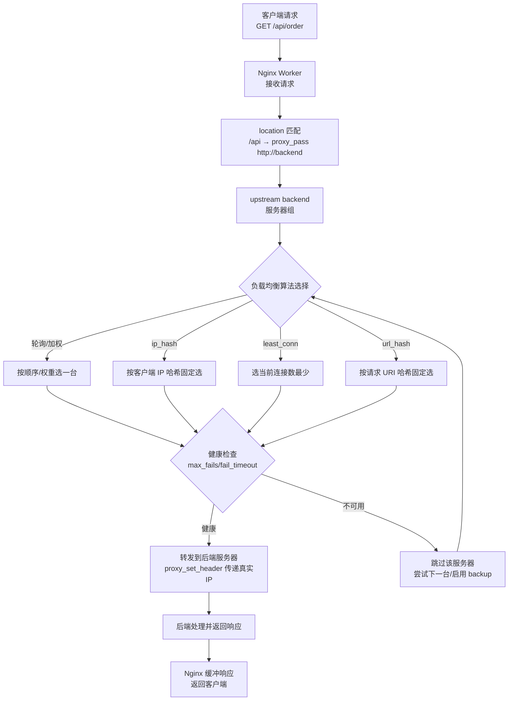

# Nginx反向代理与负载均衡

## 一、Nginx概述：高性能Web服务器与反向代理服务器

### Master-Worker架构设计
Nginx采用了经典的Master-Worker多进程架构，这是其高性能的核心设计之一：

**Master进程**：主要负责读取和验证配置文件、管理Worker进程、接收外界信号、承担监控职责，不处理具体的业务请求。Master进程只有一个，它是整个Nginx系统的管理者。

**Worker进程**：实际处理用户请求的进程，数量通常配置为与CPU核心数相等，充分利用多核优势进行并发处理。每个Worker进程都是单线程的，采用异步非阻塞的事件驱动模型来处理多个连接。

这种架构的优势在于：Worker进程相互独立，一个进程崩溃不会影响其他进程；支持热升级和平滑重启，不中断对外服务；通过进程池机制减少内存分配开销。

> 📖 **参考链接**：
> - [Nginx 官方文档 - Core functionality](https://nginx.org/en/docs/ngx_core_module.html) -- worker_processes / worker_connections 等核心指令官方说明
> - [Nginx 官方文档 - Connection processing methods](https://nginx.org/en/docs/events.html) -- epoll 事件驱动模型与 Worker 进程说明

### 与Apache、Tomcat的对比

| 对比维度 | Nginx | Apache | Tomcat |
|---------|-------|--------|--------|
| **定位** | Web服务器、反向代理、负载均衡器 | Web服务器、Servlet容器（通过mod_php） | Java Servlet容器、应用服务器 |
| **处理模型** | 异步非阻塞、事件驱动、多进程单线程 | 同步多进程/多线程，每个连接一个进程/线程 | 多线程，每个请求一个线程 |
| **并发能力** | 高，支持数万并发连接 | 相对较低，并发受进程数限制 | 中等，依赖Java虚拟机调优 |
| **内存消耗** | 轻量，内存占用小 | 较重，每个进程占用较多内存 | 较重，JVM内存占用大 |
| **静态资源处理** | 非常擅长，直接处理效率极高 | 一般，不如Nginx | 不擅长，适合动态内容 |
| **动态内容处理** | 不直接处理，通过反向转发给后端 | 支持嵌入式处理（PHP、Python） | 专门处理Java动态内容 |
| **反向代理/负载均衡** | 原生支持，功能强大 | 需要额外模块，功能较弱 | 不支持，不是为此设计 |

总结来说：Nginx适合作为前端反向代理和负载均衡器处理静态资源；Apache适合处理动态内容；Tomcat是Java应用容器，专门运行Java Web应用。生产环境中常用Nginx作为反向代理，Tomcat作为后端应用服务器。

## 二、nginx.conf配置结构：http、server、location层级关系

Nginx配置文件采用分层块级结构，核心配置层级是`http → server → location`：

### 全局块
配置影响Nginx全局的指令：
```nginx
user  nginx;                          # 运行用户
worker_processes  4;                  # Worker进程数，通常设为CPU核心数
error_log  /var/log/nginx/error.log; # 错误日志路径
pid        /var/run/nginx.pid;       # PID文件路径
events {
    worker_connections  10240;        # 每个Worker最大连接数
    use epoll;                        # 使用epoll事件模型（Linux推荐）
}
```

### http块：配置HTTP服务器全局参数
```nginx
http {
    include       mime.types;             # 导入MIME类型映射
    default_type  application/octet-stream; # 默认MIME类型
    
    # 日志格式定义
    log_format  main  '$remote_addr - $remote_user [$time_local] "$request" '
                      '$status $body_bytes_sent "$http_referer" '
                      '"$http_user_agent" "$http_x_forwarded_for"';
    
    access_log  /var/log/nginx/access.log  main;
    
    sendfile            on;               # 开启高效文件传输模式
    keepalive_timeout   65;               # 长连接超时时间
    gzip                on;               # 开启gzip压缩
    
    # 这里可以定义多个server
    server {
        # server配置在这里
    }
}
```

### server块：定义一个虚拟主机
```nginx
server {
    listen       80;               # 监听端口
    server_name  example.com www.example.com; # 域名，可以多个
    
    # 这里可以定义多个location
    location / {
        # location配置在这里
    }
}
```

### location块：匹配特定URI并进行配置
location的匹配规则：
- `=`：精确匹配
- `^~`：前缀匹配，匹配成功后不再搜索正则
- `~`：区分大小写的正则匹配
- `~*`：不区分大小写的正则匹配
- `/`：通用匹配，任何请求都会匹配到

示例：
```nginx
# 精确匹配首页
location = / {
    root   /usr/share/nginx/html;
    index  index.html index.htm;
}

# 静态资源前缀匹配
location ^~ /static/ {
    root /var/www;
    expires 7d; # 缓存7天
}

# 正则匹配图片
location ~* \.(gif|jpg|jpeg|png)$ {
    expires 30d;
}

# 默认转发
location / {
    proxy_pass http://backend;
}
```

配置匹配优先级：精确匹配(`=`) > 前缀匹配(`^~`) > 正则匹配(`~`/`~*`) > 前缀匹配(最长前缀) > 通用匹配(`/`)。

> **生活化类比：动静分离 = 高速公路的快慢车道** —— 一个网站既发静态资源（图片/CSS/JS，像私家车，轻量、快、可缓存）又发动态接口（订单/库存查询，像大货车，重、慢、要算力）。如果不分车道全挤一起，大货车堵住私家车（动态请求拖慢静态资源）。Nginx 的 location 就是分车道：用正则把 `.js/.css/.png` 这些"私家车"导流到 Nginx 本地直接处理的"快车道"（root + expires 长缓存，毫秒级返回），把 `/api` 这些"大货车"导流到 proxy_pass 后端应用服务器的"慢车道"（Tomcat 处理）。这样静态资源不占用后端算力，动态请求也独享后端资源，各走各的道互不拖累。

> 📖 **参考链接**：
> - [Nginx 官方文档 - ngx_http_core_module location](https://nginx.org/en/docs/http/ngx_http_core_module.html#location) -- location 匹配规则与优先级官方说明
> - [Nginx 官方文档 - ngx_http_core_module root](https://nginx.org/en/docs/http/ngx_http_core_module.html#root) -- root 指令（静态资源根目录）说明

## 三、反向代理核心配置：proxy_pass、proxy_set_header与WebSocket代理

### 什么是反向代理
反向代理是指Nginx接收客户端请求，然后将请求转发给后端服务器，再将后端服务器的响应返回给客户端。对客户端来说，Nginx就是后端服务器，客户端不知道真正的后端服务器在哪里。

> **生活化类比：反向代理 = 公司前台接待** —— 正向代理像你（客户端）自己雇了个跑腿小哥去帮你买东西，你知道店家在哪但店家不知道你是谁（代理客户端，翻墙工具就是这种）；反向代理像公司前台接待：客户（客户端）只认识前台，把需求交给前台，前台背后联系哪个部门、哪个员工（后端服务器）去处理，客户一概不知。前台的好处：对外只有一个统一门面（统一入口）、员工换了客户无感知（后端扩缩容透明）、可挡掉可疑访客（安全防护/WAF）、可在前台做登记分流（负载均衡）。所以反向代理是"代理服务端"，对客户端隐藏真实后端。

> 📖 **参考链接**：
> - [Nginx 官方文档 - ngx_http_proxy_module](https://nginx.org/en/docs/http/ngx_http_proxy_module.html) -- proxy_pass / proxy_set_header 反向代理指令官方说明
> - [Nginx 官方文档 - WebSocket proxying](https://nginx.org/en/docs/http/websocket.html) -- WebSocket 代理官方配置指南

> **生活化类比：** 反向代理 + 负载均衡就像银行大堂经理。你去银行办业务，不需要知道哪个柜员有空、哪个柜员擅长什么业务，你只需要找大堂经理（Nginx）。大堂经理根据当前情况（负载均衡算法）帮你分配：哪个柜员比较闲（最少连接）、哪个柜员是你上次办过的（ip_hash）、VIP客户去贵宾窗口（加权轮询）。柜员办完后把结果交给大堂经理，大堂经理再转交给你。你全程只和大堂经理打交道，背后有多少柜员、柜员换了没有，你完全不用关心。

### proxy_pass指令
`proxy_pass`用于指定后端服务器地址：

```nginx
# 方式一：URI不带结尾，后端会保留原URI
location /api {
    proxy_pass http://127.0.0.1:8080;
}
# 请求 /api/user → 转发到 http://127.0.0.1:8080/api/user

# 方式二：URI带结尾，Nginx会替换location匹配部分
location /api/ {
    proxy_pass http://127.0.0.1:8080/;
}
# 请求 /api/user → 转发到 http://127.0.0.1:8080/user
```

关键区别：`proxy_pass`后面是否带路径，会影响转发后的URI。

### proxy_set_header指令
`proxy_set_header`用于设置转发给后端服务器的请求头，让后端服务器获取客户端真实信息：

```nginx
location / {
    proxy_pass http://backend;
    # 设置主机头，传递原始Host
    proxy_set_header Host $host;
    # 传递客户端真实IP
    proxy_set_header X-Real-IP $remote_addr;
    # 传递经过的代理链路IP
    proxy_set_header X-Forwarded-For $proxy_add_x_forwarded_for;
    # 传递协议（HTTP/HTTPS）
    proxy_set_header X-Forwarded-Proto $scheme;
}
```

常用变量说明：
- `$host`：原始请求的Host头
- `$remote_addr`：客户端IP地址
- `$proxy_add_x_forwarded_for`：在原有X-Forwarded-For基础上追加当前IP
- `$scheme`：请求协议（http或https）

### 常用超时配置
```nginx
proxy_connect_timeout 60s;   # 连接后端超时时间
proxy_read_timeout 60s;      # 读取后端响应超时时间
proxy_send_timeout 60s;      # 发送请求到后端超时时间
proxy_buffer_size 4k;        # 缓冲区大小
proxy_buffering on;          # 是否开启缓冲
```

### WebSocket代理配置
WebSocket需要特殊配置，因为它是长连接：

```nginx
location /ws {
    proxy_pass http://backend;
    # WebSocket必需设置
    proxy_http_version 1.1;
    proxy_set_header Upgrade $http_upgrade;
    proxy_set_header Connection "upgrade";
    # 设置心跳检测
    proxy_read_timeout 3600s;
}
```

说明：
- `Upgrade $http_upgrade`：告知服务器协议升级
- `Connection "upgrade"`：声明连接要升级
- 超时时间需要设置长一些，因为WebSocket是持久连接

> **Nginx 请求处理完整流程**：下图展示了从客户端连接建立到最终响应返回的全链路处理过程，覆盖了 Nginx 核心的 Master-Worker 架构、location 匹配和反向代理机制。


> 整个流程中，Master 进程仅负责管理和分配，Worker 进程通过 epoll 异步非阻塞模型处理实际请求，location 匹配决定了请求的转发路径，负载均衡策略则确保后端服务器资源被合理利用。

## 四、负载均衡六种算法对比：轮询、加权、ip_hash、least_conn、url_hash、fair

Nginx通过`upstream`指令定义后端服务器组，支持多种负载均衡调度算法。

> **生活化类比：负载均衡 = 出租车调度中心** —— 一群乘客（请求）要打车，调度中心（Nginx）手下有一队出租车（后端服务器）。轮询：让每辆车轮流接客，公平但不管车况；加权轮询：大车（性能强）多接几单，小车少接几单；ip_hash：同一个乘客永远派同一辆车（会话保持，司机认得你常去哪）；least_conn：看哪辆车当前空座最多（连接数最少）就派给谁，避免有人忙死有人闲死；url_hash：同一个目的地永远派同一辆车（提高缓存命中，司机对这条路最熟）。选哪种取决于"是否需要会话保持""后端性能是否一致""是否缓存场景"。

> **请求转发流程图**：下图展示 Nginx 反向代理 + 负载均衡的请求转发全链路，重点呈现 upstream 算法选择与健康检查环节。



> 📖 **参考链接**：
> - [Nginx 官方文档 - ngx_http_upstream_module](https://nginx.org/en/docs/http/ngx_http_upstream_module.html) -- upstream 服务器组与 weight/backup/max_fails 参数官方说明
> - [Nginx 官方文档 - Load Balancing](https://nginx.org/en/docs/http/load_balancing.html) -- 六种负载均衡算法官方对比
> - [Nginx 官方文档 - hash 指令](https://nginx.org/en/docs/http/ngx_http_upstream_module.html#hash) -- hash（url_hash）指令说明

### 1. 轮询（默认）
每个请求按时间顺序逐一分配到不同的后端服务器：

```nginx
upstream backend {
    server 192.168.1.10:8080;
    server 192.168.1.11:8080;
    server 192.168.1.12:8080;
}
```

**特点**：配置简单，无需额外参数
**优点**：实现简单，均等分配
**缺点**：不考虑服务器性能差异，会话保持不好
**适用场景**：后端服务器性能相近，无状态应用

### 2. 加权轮询（weight）
根据权重分配请求，权重越高分配的请求越多：

```nginx
upstream backend {
    server 192.168.1.10:8080 weight=5;
    server 192.168.1.11:8080 weight=3;
    server 192.168.1.12:8080 weight=2;
}
```

**特点**：权重指定访问比例
**优点**：可以根据服务器性能调整负载
**缺点**：权重固定，不能动态调整
**适用场景**：后端服务器性能差异较大

### 3. ip_hash
根据客户端IP的hash结果分配请求，同一个IP的客户端固定访问同一台后端服务器：

```nginx
upstream backend {
    ip_hash;
    server 192.168.1.10:8080;
    server 192.168.1.11:8080;
    server 192.168.1.12:8080;
}
```

**特点**：基于客户端IP做hash
**优点**：实现会话保持，同一用户固定访问一个服务器
**缺点**：可能导致负载不均，IP变化会重新分配
**适用场景**：需要会话保持的有状态应用

### 4. least_conn（最少连接）
将请求分配给当前活动连接数最少的后端服务器：

```nginx
upstream backend {
    least_conn;
    server 192.168.1.10:8080;
    server 192.168.1.11:8080;
}
```

**特点**：根据后端当前连接数动态分配
**优点**：更智能，避免忙的服务器更忙
**缺点**：增加一点计算开销
**适用场景**：请求处理时间差异大，长连接应用

### 5. url_hash（URL哈希）
根据请求URL的hash结果分配请求，同一个URL固定访问同一台后端：

```nginx
upstream backend {
    hash $request_uri;
    server 192.168.1.10:8080;
    server 192.168.1.11:8080;
}
```

**特点**：基于URL做hash，需要Nginx 1.7.2+
**优点**：提高缓存命中率，适合静态资源缓存场景
**缺点**：URL变化会分配到不同服务器
**适用场景**：后端服务器是缓存服务器，内容分发场景

### 6. fair（第三方）
> **注意**：`nginx-upstream-fair` 是第三方模块，**已多年未维护**，兼容性差（与 Nginx 1.15+ 存在兼容性问题），不推荐在生产环境使用。Nginx Plus 商业版内置的 `least_time` 是推荐替代方案。

根据后端服务器的响应时间分配请求，响应时间短的优先分配：

```nginx
upstream backend {
    server 192.168.1.10:8080;
    server 192.168.1.11:8080;
    fair; # 需要第三方模块nginx-upstream-fair
}
```

**特点**：按响应时间智能分配，第三方模块
**优点**：更智能，优先分给处理快的服务器
**缺点**：需要编译安装第三方模块
**适用场景**：希望根据后端实际响应能力调度

### 六种算法对比表

| 算法 | 实现方式 | 会话保持 | 负载感知 | 优点 | 缺点 | 适用场景 |
|-----|---------|---------|---------|------|------|---------|
| **轮询** | 按顺序轮流 | ❌ | ❌ | 简单高效 | 不考虑性能差异 | 服务器性能相近，无状态 |
| **加权轮询** | 按权重分配 | ❌ | ⚠️ | 可控制分配比例 | 权重静态 | 性能差异明显 |
| **ip_hash** | 按IP哈希 | ✅ | ❌ | 会话保持 | 可能负载不均 | 需要会话保持 |
| **least_conn** | 按连接数 | ❌ | ✅ | 动态均衡负载 | 小开销计算 | 请求处理时间差异大 |
| **url_hash** | 按URL哈希 | ❌ | ❌ | 提高缓存命中率 | 配置复杂 | 缓存场景 |
| **fair** | 按响应时间 | ❌ | ✅ | 最智能 | 需要第三方模块 | 追求最佳响应 |

## 五、Rewrite重定向与URL重写

### 5.1 rewrite指令语法

Nginx的`rewrite`指令用于URL重定向和重写，语法如下：

```nginx
rewrite regex replacement [flag];
```

- `regex`：匹配URI的正则表达式（区分大小写，使用`~*`不区分大小写）
- `replacement`：替换后的URI，可使用`$1`、`$2`等捕获组引用正则分组
- `flag`：控制rewrite行为的关键参数

### 5.2 flag参数详解

| flag | 行为 | 是否重新匹配location | 适用场景 |
|------|------|---------------------|---------|
| `last` | 停止当前rewrite规则，用新URI重新匹配location | 是（重新发起location匹配） | URL重写后需要进入新的location处理 |
| `break` | 停止当前rewrite规则，不再重新匹配location | 否（继续在当前location执行） | URL重写后在当前location完成处理 |
| `redirect` | 返回302临时重定向，浏览器地址栏变化 | 否（客户端重新发起新请求） | 临时URL跳转 |
| `permanent` | 返回301永久重定向，浏览器缓存 | 否（客户端重新发起新请求） | 永久URL变更、域名迁移 |

**last vs break核心区别**：

`last`会重新发起location匹配，相当于"换一个地方继续"；`break`留在当前location继续执行后续指令，相当于"在这里改写URI但不换地方"。

```nginx
server {
    # last示例：/old/abc → /new/abc，重新匹配到/new/的location
    location /old/ {
        rewrite ^/old/(.*)$ /new/$1 last;
    }
    
    location /new/ {
        proxy_pass http://backend;
    }
    
    # break示例：重写URI但不离开当前location
    location /api/ {
        rewrite ^/api/(.*)$ /v2/$1 break;
        proxy_pass http://backend;  # 使用重写后的URI /v2/xxx
    }
}
```

### 5.3 if条件判断

```nginx
if (condition) {
    # 执行操作
}
```

**条件运算符**：

| 运算符 | 含义 | 示例 |
|--------|------|------|
| `=` | 相等 | `if ($request_method = POST)` |
| `!=` | 不等 | `if ($request_uri != "/")` |
| `~` | 正则匹配（区分大小写） | `if ($http_user_agent ~ MSIE)` |
| `~*` | 正则匹配（不区分大小写） | `if ($http_user_agent ~* "mobile")` |
| `!~` | 正则不匹配 | `if ($host !~ "^www\.")` |
| `-f` | 文件存在 | `if (-f $request_filename)` |
| `-d` | 目录存在 | `if (-d $root/cache)` |
| `-e` | 文件或目录存在 | `if (-e $request_filename)` |

### 5.4 常见重定向场景

**场景1：HTTP跳转HTTPS**

```nginx
server {
    listen 80;
    server_name example.com;
    # 永久重定向到HTTPS
    return 301 https://$host$request_uri;
}
```

**场景2：旧域名跳转新域名**

```nginx
server {
    listen 80;
    server_name old-domain.com;
    rewrite ^/(.*)$ https://new-domain.com/$1 permanent;
}
```

**场景3：去除URL中的.php后缀**

```nginx
# /article.php?id=123 → /article?id=123
location / {
    rewrite ^/(.*)\.php$ /$1 last;
}
```

**场景4：基于UA的设备重定向**

```nginx
server {
    listen 80;
    server_name example.com;
    
    set $is_mobile 0;
    if ($http_user_agent ~* "(Android|iPhone|iPad|Windows Phone)") {
        set $is_mobile 1;
    }
    
    if ($is_mobile = 1) {
        rewrite ^/(.*)$ https://m.example.com/$1 redirect;
    }
}
```

> 📖 **参考链接**：
> - [Nginx 官方文档 - ngx_http_rewrite_module](https://nginx.org/en/docs/http/ngx_http_rewrite_module.html) -- rewrite 指令与 last/break/redirect/permanent flag 官方说明
> - [Nginx 官方文档 - return 指令](https://nginx.org/en/docs/http/ngx_http_rewrite_module.html#return) -- return 301/302 重定向说明

## 六、健康检查与upstream完整配置示例

### 后端服务器状态参数
在upstream中，可以为每个服务器设置不同状态参数：

```nginx
upstream backend {
    server 192.168.1.10:8080;                  # 普通服务器
    server 192.168.1.11:8080 weight=5;         # 权重5
    server 192.168.1.12:8080 backup;           # 备用服务器，主服务器故障才启用
    server 192.168.1.13:8080 down;             # 标记为永久下线，不分配请求
    server 192.168.1.14:8080 max_fails=3 fail_timeout=30s;
}
```

参数说明：
- `weight`：权重，默认1
- `backup`：备份服务器，只有其他非备份服务器都故障才启用
- `down`：永久下线，用于维护
- `max_fails=N`：允许N次失败后标记服务器不可用，默认1
- `fail_timeout=T`：标记不可用后，等待T秒再尝试，默认10秒

### 被动健康检查
Nginx默认提供被动健康检查：

```nginx
upstream backend {
    server 192.168.1.10:8080 max_fails=2 fail_timeout=30s;
    server 192.168.1.11:8080 max_fails=2 fail_timeout=30s;
    
    # 连接超时和读取超时
    proxy_connect_timeout 10s;
    proxy_read_timeout 30s;
}
```

被动检查特点：在处理请求过程中发现失败，标记服务器不可用，等待fail_timeout后再重试。

### 主动健康检查（第三方模块）
使用nginx-upstream-healthcheck模块可以实现主动健康检查：

```nginx
upstream backend {
    server 192.168.1.10:8080;
    server 192.168.1.11:8080;
    
    # 主动健康检查，每5秒检查一次
    check interval=5000 rise=2 fall=3 timeout=2000;
    # interval: 检查间隔毫秒
    # rise: 连续2次成功认为可用
    # fall: 连续3次失败认为不可用
    # timeout: 检查超时时间
}
```

主动检查特点：Nginx定期主动向后端发送健康检查请求，自动判断健康状态。

### 完整配置示例

```nginx
http {
    # 定义后端服务器组
    upstream backend_servers {
        # 使用加权轮询
        server app1.example.com:8080 weight=3 max_fails=3 fail_timeout=30s;
        server app2.example.com:8080 weight=3 max_fails=3 fail_timeout=30s;
        server app3.example.com:8080 weight=2 max_fails=3 fail_timeout=30s;
        server backup.example.com:8080 backup;
    }
    
    # HTTP服务配置
    server {
        listen 80;
        server_name example.com;
        
        # 静态资源直接由Nginx处理
        location ~* \.(js|css|png|jpg|gif|ico)$ {
            root /var/www/static;
            expires 7d;
            add_header Cache-Control public;
        }
        
        # API请求转发给后端应用服务器
        location /api {
            proxy_pass http://backend_servers;
            
            # 传递必要请求头
            proxy_set_header Host $host;
            proxy_set_header X-Real-IP $remote_addr;
            proxy_set_header X-Forwarded-For $proxy_add_x_forwarded_for;
            proxy_set_header X-Forwarded-Proto $scheme;
            
            # 超时配置
            proxy_connect_timeout 10s;
            proxy_read_timeout 30s;
            proxy_send_timeout 30s;
            
            # 连接池配置
            proxy_http_version 1.1;
            proxy_set_header Connection "";
        }
        
        # WebSocket连接
        location /ws {
            proxy_pass http://backend_servers;
            proxy_http_version 1.1;
            proxy_set_header Upgrade $http_upgrade;
            proxy_set_header Connection "upgrade";
            proxy_read_timeout 3600s;
        }
        
        # 其他请求转发
        location / {
            proxy_pass http://backend_servers;
            proxy_set_header Host $host;
            proxy_set_header X-Real-IP $remote_addr;
            proxy_set_header X-Forwarded-For $proxy_add_x_forwarded_for;
        }
    }
}
```

> 📖 **参考链接**：
> - [Nginx 官方文档 - ngx_http_upstream_module server](https://nginx.org/en/docs/http/ngx_http_upstream_module.html#server) -- server 指令 weight/backup/down/max_fails/fail_timeout 参数说明
> - [Nginx 官方文档 - Health checks](https://nginx.org/en/docs/http/load_balancing.html#health_check) -- 被动健康检查与主动健康检查官方说明

---

## 学习导航

📚 **推荐学习路径**：
1. [Nginx官方文档](https://nginx.org/en/docs/) - 权威文档，英文原版
2. [Nginx中文文档](https://nginx.org/en/docs/) - 中文参考
3. [NGINX Cookbook](https://www.nginx.com/resources/library/nginx-cookbook/) - 实战配方
4. 下一章节：Nginx配置优化与缓存策略

🔧 **实践练习**：
- 在本地用Docker启动两个Nginx作为后端，再用一个Nginx做负载均衡
- 配置不同的负载均衡算法，用ab工具压测观察效果
- 尝试配置WebSocket代理，用简单的echo服务测试
- 模拟后端服务器宕机，观察健康检查是否生效

## 自检清单

✅ **请检查你是否掌握了以下知识点：**

- [ ] 能够解释Nginx的Master-Worker架构，说明每个角色的作用
- [ ] 能够说出Nginx与Apache、Tomcat的核心区别
- [ ] 能够画出nginx.conf配置层级结构图（全局→events→http→server→location）
- [ ] 能够解释location不同匹配符号(`=`, `^~`, `~`, `~*`)的含义和优先级
- [ ] 理解反向代理的工作原理和作用
- [ ] 能够解释`proxy_pass`带路径和不带路径的区别
- [ ] 知道为什么需要配置`proxy_set_header X-Real-IP`和`X-Forwarded-For`
- [ ] 能够写出完整的WebSocket代理配置
- [ ] 能够说出六种负载均衡算法各自的特点和适用场景
- [ ] 理解`weight`、`backup`、`max_fails`、`fail_timeout`参数的含义
- [ ] 区分被动健康检查和主动健康检查
- [ ] 能够写出包含upstream、反向代理、负载均衡、健康检查的完整配置

> - 返回 [学习路线总览](../../README.md)

