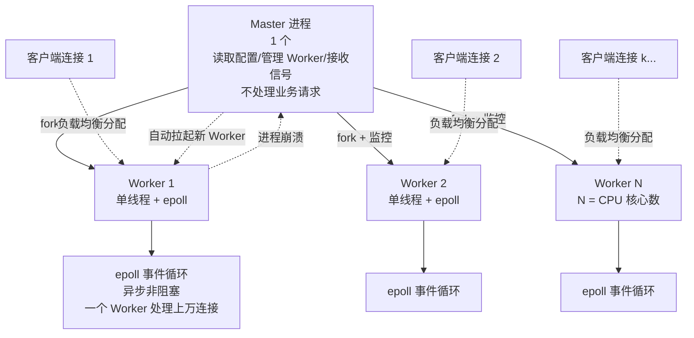

# Nginx 性能优化与安全配置

> 学习路线对应：补充模块 — Nginx 专题
> 前置知识：Nginx 基础配置、反向代理与负载均衡
> 预计学习时间：2 天

---

## 一、动静分离架构

### 1.1 什么是动静分离

动静分离是将动态请求与静态资源请求分开处理的架构设计：

- **动态资源**：由 Tomcat、Spring Boot、Node.js 等应用服务器处理（如 JSP、PHP、API 接口）
- **静态资源**：直接由 Nginx 处理（如 HTML、CSS、JS、图片、视频等）

优势：
1. **减轻应用服务器压力**：应用服务器只处理动态逻辑，不需要处理静态文件
2. **提升响应速度**：Nginx 处理静态文件的性能远高于应用服务器
3. **便于缓存优化**：可以对静态资源进行独立的缓存策略配置

### 1.2 配置示例

```nginx
server {
    listen 80;
    server_name example.com;

    # 静态资源直接由 Nginx 返回
    location ~* \.(html|css|js|jpg|jpeg|png|gif|ico|svg|woff|ttf)$ {
        root /data/static;
        expires 7d;  # 浏览器缓存
        add_header Cache-Control public;
    }

    # 动态请求转发给应用服务器
    location / {
        proxy_pass http://backend_servers;
        proxy_set_header Host $host;
        proxy_set_header X-Real-IP $remote_addr;
    }
}
```

### 1.3 sendfile 零拷贝优化

**sendfile 原理**：传统文件传输需要经过 "磁盘 → 内核缓冲区 → 用户空间 → 内核缓冲区 → 网卡" 四次数据拷贝；sendfile 直接在内核空间完成传输，减少拷贝次数。

开启配置：
```nginx
http {
    sendfile on;              # 开启 sendfile 零拷贝
    tcp_nopush on;            # 减少网络报文段数量，提高网络吞吐量
    tcp_nodelay on;           # 对实时性要求高的连接启用，不延迟发送
}
```

| 参数 | 作用 | 场景 |
|------|------|------|
| `sendfile on` | 开启零拷贝机制 | 所有静态文件服务推荐开启 |
| `tcp_nopush on` | 攒够一包再发送 | 减少网络碎片，提升吞吐量 |
| `tcp_nodelay on` | 立即发送数据包 | 提升交互式请求的实时性 |

> **生活化类比：sendfile 零拷贝 = 快递直达通道** —— 传统文件传输像快递要从"仓库（磁盘）→ 分拣中心A（内核缓冲区）→ 派件员手中（用户空间）→ 分拣中心B（Socket 缓冲区）→ 收件人（网卡）"，货物在分拣中心和派件员之间来回搬运 4 次，派件员（CPU）累个半死还慢。sendfile 则是"仓库 → 分拣中心 → 收件人"直达通道，货物在内核空间直接从磁盘搬到网卡，派件员（用户态进程）根本不用碰货物，只下了一道"把这批货直接发走"的指令。少搬两次 = 少两次上下文切换和内存拷贝，所以静态大文件传输快得多。

> 📖 **参考链接**：
> - [Nginx 官方文档 - sendfile 指令](https://nginx.org/en/docs/http/ngx_http_core_module.html#sendfile) -- sendfile 零拷贝开关官方说明
> - [Nginx 官方文档 - tcp_nopush / tcp_nodelay](https://nginx.org/en/docs/http/ngx_http_core_module.html#tcp_nopush) -- 网络报文发送策略指令

### 1.4 gzip 压缩优化

gzip 可以压缩响应内容，减少网络传输体积，提升加载速度。

配置示例：
```nginx
gzip on;
gzip_min_length 1k;         # 最小压缩文件大小
gzip_buffers 4 16k;         # 压缩缓冲区大小
gzip_http_version 1.1;      # 最低HTTP版本
gzip_comp_level 6;          # 压缩级别（1-9，级别越高压缩率越高但越耗CPU）
gzip_types text/plain text/css text/xml application/javascript application/json image/svg+xml;
gzip_vary on;               # 根据浏览器决定是否压缩
gzip_disable "MSIE [1-6]\."; # 禁用IE6及以下
```

**压缩级别选择**：
- 级别 1-3：压缩快，压缩率低
- 级别 4-6：平衡压缩率和CPU消耗（推荐）
- 级别 7-9：压缩率高，CPU消耗大（慎⽤）

通常不推荐对已经压缩过的图片格式（JPG、PNG）启用 gzip，因为压缩效果不明显且浪费 CPU。

### 1.5 静态资源缓存

通过 HTTP 缓存头让浏览器缓存静态资源，减少重复请求：

```nginx
location ~* \.(css|js|jpg|jpeg|png|gif|ico|svg)$ {
    expires 30d;  # 30天缓存
    add_header Cache-Control "public, immutable";
    add_header Vary Accept-Encoding;
}

# HTML文件通常不缓存或缓存时间较短
location ~* \.html$ {
    expires 1h;
    add_header Cache-Control "no-cache";
}
```

缓存策略要点：
- 文件名带内容哈希（如 `app.abc123.js`）：可以设置很长的缓存时间
- 文件名不变：设置较短缓存或让浏览器每次验证

> 📖 **参考链接**：
> - [Nginx 官方文档 - ngx_http_gzip_module](https://nginx.org/en/docs/http/ngx_http_gzip_module.html) -- gzip 压缩指令（gzip_comp_level/gzip_types）官方说明
> - [Nginx 官方文档 - expires 指令](https://nginx.org/en/docs/http/ngx_http_headers_module.html#expires) -- expires 浏览器缓存头配置说明

---

## 二、HTTPS 配置优化

### 2.1 SSL/TLS 握手流程

**完整握手流程**：
1. 客户端 → 服务端：Client Hello（支持的加密套件、随机数 A）
2. 服务端 → 客户端：Server Hello（选择加密套件、随机数 B、证书）
3. 服务端 → 客户端：Server Key Exchange、Server Done
4. 客户端 → 服务端：Client Key Exchange（预主密钥）
5. 双方生成会话密钥，Finished 握手完成

**缩写握手（TLS 1.2）/ 0-RTT（TLS 1.3）**：利用之前会话缓存或预共享密钥，减少握手次数，提升性能。

### 2.2 HTTPS 基础配置

```nginx
server {
    listen 443 ssl http2;  # 开启 SSL 和 HTTP/2
    server_name example.com;

    # 证书配置
    ssl_certificate /etc/nginx/ssl/example.com.crt;    # 公钥证书
    ssl_certificate_key /etc/nginx/ssl/example.com.key; # 私钥

    # 选择安全的加密套件
    ssl_protocols TLSv1.2 TLSv1.3;                      # 禁用不安全的 SSLv3、TLSv1.0、TLSv1.1
    ssl_ciphers ECDHE-ECDSA-AES128-GCM-SHA256:ECDHE-RSA-AES128-GCM-SHA256:ECDHE-ECDSA-AES256-GCM-SHA384;
    ssl_prefer_server_ciphers on;

    # 会话缓存优化
    ssl_session_cache shared:SSL:10m;  # 共享会话缓存
    ssl_session_timeout 1d;            # 会话超时时间

    # 启用 HTTP Strict Transport Security (HSTS)
    add_header Strict-Transport-Security "max-age=31536000; includeSubDomains" always;
}
```

### 2.3 证书说明

- **ssl_certificate**：服务器公钥证书，通常是全链证书（服务器证书 + 中间证书）
- **ssl_certificate_key**：服务器私钥文件，需要妥善保管，不能泄露
- **获取免费证书**：Let's Encrypt（certbot）、ZeroSSL、阿里云免费证书等

### 2.4 HTTP/2 优势

HTTP/2 相比 HTTP/1.1 的优势：

1. **二进制分帧**：二进制格式传输，解析更高效
2. **多路复用**：同一个连接上可以同时处理多个请求
3. **头部压缩**：HPACK 算法压缩请求头，减少体积
4. **服务端推送**：服务器可以主动推送资源给客户端

开启方式：`listen 443 ssl http2;`（Nginx 1.9.5+ 支持）

### 2.5 性能优化要点

- **禁用旧协议**：只保留 TLSv1.2 和 TLSv1.3
- **会话复用**：开启 `ssl_session_cache` 避免重复握手
- **OCSP Stapling**：让 Nginx 预先获取证书状态，减少客户端访问次数
  ```nginx
  ssl_stapling on;
  ssl_stapling_verify on;
  resolver 8.8.8.8 1.1.1.1 valid=60s;
  ```

> 📖 **参考链接**：
> - [Nginx 官方文档 - ngx_http_ssl_module](https://nginx.org/en/docs/http/ngx_http_ssl_module.html) -- SSL/TLS 证书与 ssl_protocols/ssl_ciphers/ssl_session_cache 官方说明
> - [Nginx 官方文档 - ngx_http_v2_module](https://nginx.org/en/docs/http/ngx_http_v2_module.html) -- HTTP/2 多路复用与配置说明

---

## 三、核心性能优化

### 3.1 worker_processes 进程数配置

```nginx
user nginx;
worker_processes auto;  # 自动设置为 CPU 核心数
worker_rlimit_nofile 65535;  # 每个进程最大打开文件数
```

**配置原则**：
- 一般设置为 CPU 核心数 `auto` 自动识别即可
- 如果是单用途 Nginx 服务器，可以设置为核心数或核心数 × 2
- 不建议设置过大，会增加进程切换开销

### 3.2 worker_connections 连接数配置

```nginx
events {
    worker_connections 10240;  # 每个 worker 最大连接数
    use epoll;                  # Linux 推荐使用 epoll 事件模型
    multi_accept on;            # 一次性接收所有新连接
}
```

**最大并发连接数计算**：
```
总连接数 = worker_processes × worker_connections
```
如果 8 核 × 10240 = 81920 并发连接，足够绝大多数场景。

> **Nginx Worker 进程模型图**：下图展示 Master-Worker 多进程架构与 epoll 异步非阻塞事件驱动模型的协作关系。



> Master 不干活只管人，Worker 单线程用 epoll 同时管上万连接（一个线程非阻塞轮询多个 socket，谁有数据就处理谁，绝不阻塞等待）。Worker 间相互独立，一个崩了 Master 立刻拉起一个新的，对外服务不中断。

> 📖 **参考链接**：
> - [Nginx 官方文档 - worker_processes](https://nginx.org/en/docs/ngx_core_module.html#worker_processes) -- worker_processes 进程数配置官方说明
> - [Nginx 官方文档 - worker_connections](https://nginx.org/en/docs/ngx_core_module.html#worker_connections) -- worker_connections 连接数配置说明
> - [Nginx 官方文档 - events 模块](https://nginx.org/en/docs/events.html) -- epoll 事件模型与 multi_accept 说明

### 3.3 keepalive 长连接优化

```nginx
http {
    keepalive_timeout 65s;          # 客户端连接空闲超时时间
    keepalive_requests 100;         # 一个连接最多处理多少个请求
    send_timeout 60s;               # 客户端读超时
}
```

优势：
- 复用 TCP 连接，减少三次握手开销
- 降低 TCP 连接建立的延迟

### 3.4 缓冲区调优

```nginx
http {
    # 客户端请求缓冲区
    client_body_buffer_size 128k;      # 请求体缓冲区大小
    client_header_buffer_size 1k;      # 请求头缓冲区大小
    large_client_header_buffers 4 4k;  # 大请求头缓冲区

    # 后端连接缓冲区
    proxy_buffering on;
    proxy_buffer_size 4k;
    proxy_buffers 8 16k;
    proxy_busy_buffers_size 64k;
}
```

配置说明：
- 如果很多请求头很大（如携带很多 Cookie），需要调大 `large_client_header_buffers`
- 开启 `proxy_buffering` 可以让 Nginx 缓存后端响应，减少后端压力

> 📖 **参考链接**：
> - [Nginx 官方文档 - keepalive_timeout](https://nginx.org/en/docs/http/ngx_http_core_module.html#keepalive_timeout) -- keepalive 长连接超时配置说明
> - [Nginx 官方文档 - proxy_buffers](https://nginx.org/en/docs/http/ngx_http_proxy_module.html#proxy_buffers) -- proxy_buffers 缓冲区调优指令

### 3.5 内核参数优化（Linux）

在 `/etc/sysctl.conf` 中添加：

```
# 开启 TCP 重用，允许将 TIME_WAIT  sockets 重新用于新连接
net.ipv4.tcp_tw_reuse = 1
# 注意：tcp_tw_recycle 已在 Linux 内核 4.12 中移除，NAT 环境下会导致丢包

# 增大 backlog 队列长度
net.core.somaxconn = 1024
net.core.netdev_max_backlog = 2000

# 增大最大连接数
net.ipv4.tcp_max_syn_backlog = 2048
net.ipv4.tcp_max_tw_buckets = 5000

# 调整 TCP 超时时间
net.ipv4.tcp_fin_timeout = 30
net.ipv4.tcp_keepalive_time = 600
```

修改后执行 `sysctl -p` 生效。

---

## 四、安全配置实践

### 4.1 隐藏版本号

```nginx
server_tokens off;  # 不显示 Nginx 版本号
```

避免泄露具体版本，减少针对特定版本的攻击。

### 4.2 IP 访问控制

```nginx
# 禁止访问敏感目录
location ~* /\.git {
    deny all;
    return 404;
}

# 只允许特定 IP 访问管理后台
location /admin {
    allow 192.168.1.0/24;
    allow 10.0.0.0/8;
    deny all;
}
```

### 4.3 限流配置 limit_req_zone

```nginx
http {
    # 定义限流区域：基于客户端 IP 限流，桶大小 100，每秒处理 10 个请求
    limit_req_zone $binary_remote_addr zone=perip:10m rate=10r/s;

    server {
        location /api/ {
            limit_req zone=perip burst=20 nodelay;  # 突发最多 20 个排队
            proxy_pass http://backend;
        }
    }
}
```

参数说明：
- `rate`：平均速率（如 `10r/s` = 每秒 10 请求）
- `burst`：允许突发请求排队的数量
- `nodelay`：不延迟处理排队的请求，直接处理，超过桶大小直接拒绝

作用：保护后端应用不被突发流量打垮，防止暴力爬取和 DDoS 攻击。

> **生活化类比：limit_req 限流 = 地铁早高峰安检口限流** —— rate=10r/s 像安检口"每秒只放 10 个人进站"的恒定速率；burst=20 像站外临时围出的能容纳 20 人的蛇形排队区（令牌桶），人突然多时先在排队区等；nodelay 像排队区有人就立刻放进站不磨蹭，但排队区满了（超过 burst）就直接拦在外面不让进（返回 503）。没有限流时，早高峰一瞬间全涌进来会挤垮站台（后端被打挂）；限流就是把瞬时洪峰削平成匀速水流。注意 rate 设太低会误伤正常用户，设太高起不到保护作用，需结合压测调参。

> 📖 **参考链接**：
> - [Nginx 官方文档 - ngx_http_limit_req_module](https://nginx.org/en/docs/http/ngx_http_limit_req_module.html) -- limit_req_zone / limit_req 令牌桶限流官方说明
> - [Nginx 官方文档 - server_tokens](https://nginx.org/en/docs/http/ngx_http_core_module.html#server_tokens) -- 隐藏版本号安全配置

### 4.4 CORS 跨域配置

```nginx
location /api/ {
    if ($request_method = OPTIONS) {
        add_header Access-Control-Allow-Origin $http_origin;
        add_header Access-Control-Allow-Methods "GET, POST, PUT, DELETE, OPTIONS";
        add_header Access-Control-Allow-Headers "Authorization, Content-Type";
        add_header Access-Control-Allow-Credentials true;
        add_header Access-Control-Max-Age 86400;
        return 204;
    }

    add_header Access-Control-Allow-Origin $http_origin;
    add_header Access-Control-Allow-Credentials true;
    proxy_pass http://backend;
}
```

生产环境建议：
- 不要使用 `*` 允许所有来源，限制允许的域名
- 预请求 OPTIONS 直接返回 204，减少后端压力

### 4.5 其他安全建议

1. **防止点击劫持**：
   ```nginx
   add_header X-Frame-Options DENY;
   add_header X-Content-Type-Options nosniff;
   add_header X-XSS-Protection "1; mode=block";
   ```

2. **阻止常见恶意 User-Agent**：
   ```nginx
   if ($http_user_agent ~* (bingbot|Googlebot|Baidu|Yahoo! Slurp|Sogou)) {
       return 403;
   }
   ```

3. **避免目录遍历**：
   ```nginx
   autoindex off;  # 关闭目录列表
   ```

> 📖 **参考链接**：
> - [Nginx 官方文档 - ngx_http_access_module](https://nginx.org/en/docs/http/ngx_http_access_module.html) -- allow/deny IP 访问控制官方说明
> - [Nginx 官方文档 - add_header](https://nginx.org/en/docs/http/ngx_http_headers_module.html#add_header) -- X-Frame-Options / X-Content-Type-Options 安全响应头说明

---

## 五、避坑指南

| 常见问题 | 现象 | 原因 | 解决方案 |
|---------|------|------|---------|
| gzip 压缩 CPU 占用过高 | CPU 使用率持续高 | 开启了对大文件/已经压缩格式的压缩 | 调整 `gzip_min_length`，排除 JPG/PNG，压缩级别不超过 6 |
| worker_connections 设置过小 | 大量连接处于等待状态 | 并发连接数超过限制 | 根据实际并发调整，一般设置 10240 足够 |
| HTTPS 握手慢 | 首次访问延迟高 | 未开启会话缓存，使用旧协议 | 开启 `ssl_session_cache`，只保留 TLSv1.2+，启用 HTTP/2 |
| 大请求头返回 400 错误 | 客户端请求被直接拒绝 | `large_client_header_buffers` 太小 | 调大为 `4 8k` 或更大 |
| 静态资源不缓存 | 每次都重新请求 | `expires` 配置位置不对 | 在 `location` 块正确配置 `expires`，检查响应头 |
| 限流配置不生效 | 规则没匹配上 | `limit_req` 位置错误，漏了某些 location | 将 `limit_req` 放在正确的 location 中，检查匹配顺序 |
| 文件描述符耗尽 | 报错 "open() ... failed (24: Too many open files)" | `worker_rlimit_nofile` 设置过小 | 设置 `worker_rlimit_nofile 65535;`，调整系统 `ulimit` |

---

## 本章学习自检

完成本章学习后，应该能够：

- [ ] 解释动静分离架构的优势，能够独立配置动静分离
- [ ] 理解 sendfile 零拷贝原理，知道 gzip 压缩的配置和优化要点
- [ ] 理解 SSL/TLS 握手过程，能够配置安全高性能的 HTTPS
- [ ] 掌握 worker_processes、worker_connections、keepalive 等核心参数的调优
- [ ] 配置 IP 访问控制、限流、CORS 等常见安全规则
- [ ] 排查常见的性能和安全问题

---

> **学习导航**：
> - 返回 [学习路线总览](../../README.md)
> - 本模块其他文章：[01-Nginx反向代理与负载均衡](./01-Nginx反向代理与负载均衡.md)
> - 下一模块：[Redis 核心数据结构与底层原理](../redis/01-Redis核心数据结构与底层原理.md)

