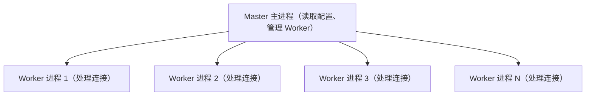

# Nginx 笔面试题集

> 覆盖反向代理、负载均衡、动静分离、HTTPS、性能优化、限流等核心知识点

---

## 一、选择题（15道）

### 1. Nginx 中反向代理的主要作用是什么？ ★
A. 提高静态资源访问速度  
B. 隐藏后端服务器地址，实现负载均衡  
C. 直接处理动态请求  
D. 增加域名解析速度  

**答案：B**  
**解析：** 反向代理位于客户端和后端服务器之间，客户端请求先经过 Nginx，Nginx 再转发请求到后端服务器。这样可以隐藏后端服务器的真实地址，同时可以根据规则将请求分发到多台后端服务器实现负载均衡。A 是动静分离的作用，C 错误，Nginx 通常不直接处理复杂动态请求，D 是 DNS 的作用。

> 📖 **参考链接**：[Nginx 官方文档 - ngx_http_proxy_module](https://nginx.org/en/docs/http/ngx_http_proxy_module.html) -- proxy_pass 反向代理指令官方说明

---

### 2. Nginx 负载均衡中，默认的调度算法是？ ★
A. ip_hash  
B. least_conn  
C. round_robin（轮询）  
D. fair  

**答案：C**  
**解析：** Nginx 默认的负载均衡调度算法是轮询（round_robin），即按照顺序依次将请求分配给各个后端服务器。ip_hash 根据客户端 IP 分配，可以实现会话保持；least_conn 优先分配给连接数少的服务器；fair 是第三方模块，按响应时间分配。

> 📖 **参考链接**：[Nginx 官方文档 - Load Balancing](https://nginx.org/en/docs/http/load_balancing.html) -- 六种负载均衡算法官方对比

---

### 3. 关于 Nginx 动静分离，以下说法正确的是？ ★★
A. 动静分离要求动态内容和静态内容必须部署在不同服务器  
B. 动静分离只能通过 location 正则匹配实现  
C. 动静分离可以减少后端服务器的压力，提高静态资源访问速度  
D. 动静分离会增加系统复杂度，没有任何好处  

**答案：C**  
**解析：** 动静分离将静态资源（HTML、CSS、JS、图片等）交给 Nginx 直接处理，动态请求（PHP、Java 等）转发给后端应用服务器。这样可以充分利用 Nginx 强大的静态资源处理能力，减轻后端服务器压力，提升整体响应速度。A 错误，不一定非要不同服务器，同一服务器不同目录也可以实现；B 错误，也可以通过不同域名、端口等方式分离；D 明显错误。

> 📖 **参考链接**：[Nginx 官方文档 - ngx_http_core_module root](https://nginx.org/en/docs/http/ngx_http_core_module.html#root) -- root 指令静态资源处理说明

---

### 4. Nginx 配置 HTTPS 需要在 http 块中配置哪个指令？ ★
A. ssl on;  
B. listen 443 ssl;  
C. ssl_certificate 和 ssl_certificate_key  
D. ssl_protocols TLSv1.2;  

**答案：C**  
**解析：** 配置 HTTPS 最核心的两个指令是 `ssl_certificate` 指定证书文件路径，`ssl_certificate_key` 指定私钥文件路径，这两个是必须配置的。A 在新版 Nginx 中已经废弃；B 是 listen 指令的写法，不是核心配置；D 是指定 SSL 协议版本，可选配置，不是必须。

> 📖 **参考链接**：[Nginx 官方文档 - ngx_http_ssl_module](https://nginx.org/en/docs/http/ngx_http_ssl_module.html) -- SSL 证书与 HTTPS 配置官方说明

---

### 5. Nginx 中 `proxy_pass` 指令的作用是？ ★★
A. 配置代理缓存  
B. 设置反向代理的后端服务器地址  
C. 配置代理连接超时时间  
D. 设置代理请求头  

**答案：B**  
**解析：** `proxy_pass http://backend;` 用于指定反向代理的后端服务器地址，是反向代理最核心的指令。A 对应 `proxy_cache`；C 对应 `proxy_connect_timeout`；D 对应 `proxy_set_header`。

> 📖 **参考链接**：[Nginx 官方文档 - proxy_pass](https://nginx.org/en/docs/http/ngx_http_proxy_module.html#proxy_pass) -- proxy_pass 反向代理转发指令官方说明

---

### 6. 关于 Nginx 限流，`limit_req_zone` 指令中 `rate` 参数的作用是？ ★★
A. 限制每秒处理请求数  
B. 限制每秒传输速率  
C. 限制连接数  
D. 限制带宽  

**答案：A**  
**解析：** `limit_req_zone` 用于对请求速率进行限制，`rate=10r/s` 表示每秒最多处理 10 个请求。限制连接数用 `limit_conn`，限制带宽用 `limit_rate`。

> 📖 **参考链接**：[Nginx 官方文档 - ngx_http_limit_req_module](https://nginx.org/en/docs/http/ngx_http_limit_req_module.html) -- limit_req_zone / rate 请求速率限流官方说明

---

**Nginx Master-Worker 进程模型图：**



> Nginx 采用 Master-Worker 多进程模型，Master 进程负责配置管理和 Worker 进程调度，Worker 进程单线程基于事件驱动处理客户端连接。每个 Worker 绑定到一个 CPU 核心，充分利用多核并行处理能力。

### 7. Nginx 中 worker_processes 配置为 CPU 核心数的主要原因是？ ★★
A. 节省内存占用  
B. 充分利用多核 CPU，提高并发处理能力  
C. 减少进程切换开销  
D. 方便管理  

**答案：B**  
**解析：** Nginx 是多进程单线程（每个 worker 进程单线程）模型，将 `worker_processes` 设置为等于 CPU 核心数，可以让每个 worker 进程绑定到一个 CPU 核心，避免进程在多个核心间切换，充分利用多核并行处理能力，提升并发性能。虽然也能减少切换开销，但主要目的是充分利用多核。

> 📖 **参考链接**：[Nginx 官方文档 - worker_processes](https://nginx.org/en/docs/ngx_core_module.html#worker_processes) -- worker_processes 进程数配置官方说明

---

### 8. 以下哪个不是 Nginx 负载均衡的健康检查相关指令？ ★★★
A. proxy_next_upstream  
B. proxy_connect_timeout  
C. max_fails 和 fail_timeout  
D. proxy_read_timeout  

**答案：B**  
**解析：** `max_fails` 和 `fail_timeout` 是 upstream 块中配置后端服务器健康检查的核心指令，当失败次数达到 `max_fails`，Nginx 会在 `fail_timeout` 时间内认为该节点不可用，不再转发请求过去。`proxy_next_upstream` 定义了哪些错误情况会将请求转发到下一个节点。`proxy_connect_timeout` 只是连接超时时间，不是专门的健康检查控制指令。

> 📖 **参考链接**：[Nginx 官方文档 - upstream server](https://nginx.org/en/docs/http/ngx_http_upstream_module.html#server) -- max_fails/fail_timeout 健康检查参数官方说明

---

### 9. Nginx 配置 Gzip 压缩，主要目的是？ ★
A. 减少文件传输体积，加快传输速度  
B. 加密传输内容  
C. 缓存静态文件  
D. 提升服务器压缩能力  

**答案：A**  
**解析：** Gzip 压缩可以将文本类资源（HTML、CSS、JS、JSON 等）压缩到原体积的 1/3 ~ 1/5，大幅减少网络传输量，从而加快页面加载速度，节省带宽。

> 📖 **参考链接**：[Nginx 官方文档 - ngx_http_gzip_module](https://nginx.org/en/docs/http/ngx_http_gzip_module.html) -- gzip 压缩指令官方说明

---

### 10. 关于 Nginx 正向代理和反向代理，说法错误的是？ ★★
A. 正向代理代理的是客户端，为客户端服务  
B. 反向代理代理的是服务器，为服务器端服务  
C. 反向代理需要配置 resolver 解析域名  
D. 正向代理可以用来翻墙，访问被禁止的网站  

**答案：C**  
**解析：** 反向代理不需要配置 resolver，正向代理因为要代理客户端访问任意域名，所以需要 DNS 解析，需要配置 resolver。C 说反了，所以错误。

> 📖 **参考链接**：[Nginx 官方文档 - resolver](https://nginx.org/en/docs/http/ngx_http_core_module.html#resolver) -- resolver 域名解析指令（正向代理场景）说明

---

### 11. Nginx 中 `keepalive_timeout` 的作用是？ ★★
A. 设置客户端连接保持存活的超时时间  
B. 设置后端连接超时时间  
C. 设置请求读取超时时间  
D. 设置发送响应超时时间  

**答案：A**  
**解析：** `keepalive_timeout` 设置长连接保持打开的时间，超时后 Nginx 会关闭连接。合理设置该参数可以复用连接，减少三次握手开销，提升性能。

> 📖 **参考链接**：[Nginx 官方文档 - keepalive_timeout](https://nginx.org/en/docs/http/ngx_http_core_module.html#keepalive_timeout) -- keepalive 长连接超时配置说明

---

### 12. 以下哪种场景不适合使用 Nginx 限流？ ★
A. 防止爬虫疯狂爬取网站  
B. 防止接口被恶意 DDoS 攻击  
C. 静态资源文件下载限速  
D. 提升静态资源访问速度  

**答案：D**  
**解析：** 限流是限制速率，目的是保护服务器，防止被打垮。提升访问速度需要优化缓存、压缩、CDN 等手段，限流不会提升速度，反而会限制速度。

> 📖 **参考链接**：[Nginx 官方文档 - ngx_http_limit_req_module](https://nginx.org/en/docs/http/ngx_http_limit_req_module.html) -- limit_req 限流适用场景官方说明

---

### 13. Nginx 负载均衡中 ip_hash 的主要作用是？ ★★
A. 让相同 IP 的客户端请求始终分发到同一台后端服务器  
B. 负载更均衡  
C. 提高安全性  
D. 减少缓存命中  

**答案：A**  
**解析：** ip_hash 根据客户端 IP 的哈希结果分配后端服务器，这样同一个客户端 IP 始终访问同一台后端服务器，可以实现会话保持（Session 粘滞），解决后端 Session 共享问题。

> 📖 **参考链接**：[Nginx 官方文档 - ip_hash](https://nginx.org/en/docs/http/ngx_http_upstream_module.html#ip_hash) -- ip_hash 会话保持指令官方说明

---

### 14. 关于 Nginx 缓存，以下说法错误的是？ ★★★
A. `proxy_cache` 可以缓存后端服务器的响应内容  
B. 缓存可以降低后端服务器的 QPS  
C. `proxy_cache_valid` 用于设置不同响应码的缓存时间  
D. Nginx 缓存只能存储在内存中  

**答案：D**  
**解析：** Nginx 的 `proxy_cache` 缓存是存储在硬盘（文件系统）中的，可以配置缓存路径、大小、层级等，不是只能存在内存中。所以 D 错误。

> 📖 **参考链接**：[Nginx 官方文档 - proxy_cache](https://nginx.org/en/docs/http/ngx_http_proxy_module.html#proxy_cache) -- proxy_cache 磁盘缓存指令官方说明

---

### 15. Nginx 处理请求时，worker 进程采用什么模型？ ★★★
A. 多进程多线程  
B. 单进程单线程  
C. 多进程单线程  
D. 单进程多线程  

**答案：C**  
**解析：** Nginx 采用 master-worker 模型，一个 master 进程管理多个 worker 进程，每个 worker 进程是单线程的，基于事件驱动模型处理请求，这样内存占用少，切换开销小，并发能力强。

> 📖 **参考链接**：[Nginx 官方文档 - Core functionality](https://nginx.org/en/docs/ngx_core_module.html) -- Master-Worker 进程模型官方说明

---

## 二、简答题（8道）

### 1. 请简述 Nginx 反向代理的工作流程。 ★

**参考答案：**  
1. 客户端向 Nginx 发起请求，解析请求头和 URL；
2. Nginx 根据配置中的 `location` 规则匹配，找到对应的反向代理配置；
3. Nginx 构建发往后端服务器的请求，添加/修改请求头（如 `proxy_set_header`）；
4. 建立与后端服务器的连接，发送请求；
5. 接收后端服务器的响应；
6. 将响应转发回客户端，处理连接释放或保持。

反向代理对客户端是透明的，客户端感知不到后端服务器的存在。

> 📖 **参考链接**：[Nginx 官方文档 - ngx_http_proxy_module](https://nginx.org/en/docs/http/ngx_http_proxy_module.html) -- proxy_pass 反向代理工作流程与指令说明

---

### 2. Nginx 负载均衡有哪几种常用调度算法？分别适用什么场景？ ★★

**参考答案：**  
常用调度算法：

1. **轮询（round-robin）**：默认算法，按顺序轮流分配给各后端节点。适用于后端节点性能相近、无状态的场景。
2. **加权轮询（weight）**：给每个节点设置权重，权重越高被分配的请求越多。适用于后端节点硬件性能差异大的场景，性能好的机器承担更多请求。
3. **ip_hash**：根据客户端 IP 哈希结果分配节点，同一 IP 固定访问同一节点。适用于需要会话保持（Session 粘滞）的场景，解决 Session 共享问题。
4. **least_conn（最小连接数）**：优先将请求分配给当前活跃连接数最少的节点。适用于请求处理时间差异大，长连接较多的场景，能更好地均衡负载。
5. **fair**：第三方模块，按后端服务器响应时间分配，响应时间短的优先分配。更智能，但需要额外编译模块。

> 📖 **参考链接**：[Nginx 官方文档 - Load Balancing](https://nginx.org/en/docs/http/load_balancing.html) -- 五种调度算法（轮询/加权/ip_hash/least_conn）官方对比

---

### 3. 什么是动静分离？为什么要做动静分离？ ★★

**参考答案：**  
**定义**：动静分离是一种架构思想，将网站的动态资源（如 PHP、JSP、ASP.NET 等动态程序）和静态资源（HTML、CSS、JavaScript、图片、视频等）分开处理，通常由 Nginx 直接处理静态资源，动态请求转发给后端应用服务器。

**原因/优势**：
1. Nginx 对静态文件的处理能力远强于应用服务器（如 Tomcat、PHP-FPM），能提供更高的并发和更低的延迟；
2. 减轻后端应用服务器的压力，让应用服务器专注处理动态逻辑，提升整体系统吞吐量；
3. 可以对静态资源做单独优化，如缓存、压缩、CDN 加速，提升用户体验；
4. 便于架构扩展，静态资源可以独立部署到存储或 CDN，动态资源独立扩容。

> 📖 **参考链接**：[Nginx 官方文档 - ngx_http_core_module location](https://nginx.org/en/docs/http/ngx_http_core_module.html#location) -- location 动静分离路由配置说明

---

### 4. 请简述 Nginx 配置 HTTPS 的步骤和核心配置项。 ★★

**参考答案：**  
配置步骤：

1. **获取 SSL 证书**：可以从 CA 机构（如 Let's Encrypt、阿里云、腾讯云等）申请免费或付费证书，得到证书文件（一般是 `.pem` 或 `.crt`）和私钥文件（`.key`）；
2. **上传证书**：将证书和私钥上传到服务器指定目录；
3. **修改 Nginx 配置**：
   - 监听 443 端口，开启 ssl：`listen 443 ssl;`
   - 指定证书路径：`ssl_certificate /path/to/cert.pem;`
   - 指定私钥路径：`ssl_certificate_key /path/to/private.key;`
   - （可选）配置 SSL 协议版本和加密套件：`ssl_protocols TLSv1.2 TLSv1.3; ssl_ciphers ...;`
   - （推荐）开启 HTTP 严格传输安全：`add_header Strict-Transport-Security "max-age=31536000; includeSubDomains";`
4. **（可选）配置 HTTP 跳转 HTTPS**：监听 80 端口，将请求 301 重定向到 HTTPS；
5. **测试配置并重载 Nginx**：`nginx -t && nginx -s reload`。

核心配置项是 `ssl_certificate` 和 `ssl_certificate_key`，必须正确配置才能启动 HTTPS。

> 📖 **参考链接**：[Nginx 官方文档 - Configuring HTTPS servers](https://nginx.org/en/docs/http/configuring_https_servers.html) -- HTTPS 服务器配置步骤官方指南

---

### 5. Nginx 限流的主要实现方式有几种？分别解决什么问题？ ★★★

**参考答案：**  
Nginx 主要有两种限流方式：

1. **限制请求速率（`limit_req`）**：基于 `limit_req_zone` 配置，限制单位时间内的请求数（如 `rate=10r/s` 限制每秒最多10个请求）。主要解决：
   - 防止爬虫恶意爬取
   - 防止 DDoS 攻击导致服务器被打垮
   - 保护接口不被突发流量冲垮

2. **限制并发连接数（`limit_conn`）**：基于 `limit_conn_zone` 配置，限制同一客户端IP同时并发的连接数。主要解决：
   - 防止单IP占用过多连接，影响其他用户
   - 限制下载站、资源站的并发下载，节省带宽和连接资源

3. **限制带宽速率（`limit_rate`）**：限制单个连接的传输速率。主要用于下载场景，防止单个用户占满出口带宽。

实际生产中常常组合使用，比如先限制并发连接数，再限制请求速率，双重保护。

> 📖 **参考链接**：[Nginx 官方文档 - ngx_http_limit_req_module](https://nginx.org/en/docs/http/ngx_http_limit_req_module.html) -- limit_req / limit_conn / limit_rate 三种限流方式官方说明

---

### 6. 请列举几个 Nginx 性能优化的常用手段。 ★★

**参考答案：**  
常见优化手段：

1. **进程优化**：`worker_processes` 设置为 CPU 核心数，`worker_connections` 调整每个 worker 最大连接数，打开文件句柄数调大；
2. **事件模型优化**：使用 epoll（Linux 下），开启 `multi_accept`，让 worker 一次性接受所有新连接；
3. **Gzip/Brotli 压缩**：开启静态资源压缩，减小传输体积，节省带宽；
4. **静态资源缓存**：设置 `expires` 缓存头，让浏览器缓存静态资源，减少重复请求；
5. **开启长连接**：合理设置 `keepalive_timeout` 和 `keepalive_requests`，复用连接，减少握手开销；
6. **反向代理优化**：开启 `proxy_cache` 缓存后端响应，降低后端 QPS；复用后端连接，设置 `keepalive` 连接池；
7. **关闭不必要日志**：静态资源请求关闭 access_log，减少磁盘 IO；
8. **开启 sendfile 和 tcp_nopush/tcp_nodelay**：优化静态文件传输，减少内存拷贝。

> 📖 **参考链接**：[Nginx 官方文档 - Core functionality](https://nginx.org/en/docs/ngx_core_module.html) -- worker_processes/worker_connections 性能优化指令说明

---

### 7. Nginx 502 Bad Gateway 错误常见原因是什么？怎么排查？ ★★★

**参考答案：**  
502 表示 Nginx 作为反向代理，从后端服务器收到了无效的响应。常见原因：

1. **后端服务挂了**：后端服务器没有启动，或进程挂掉，端口没监听；
2. **后端连接超时**：后端处理太慢，超过了 `proxy_connect_timeout` 或 `proxy_read_timeout`；
3.**后端负载过高**：后端服务器资源耗尽（CPU、内存跑满），无法处理请求；
4. **网络不通**：Nginx 机器无法连通后端服务器端口（防火墙拦截、路由不可达）；
5. **后端配置错误**：比如 upstream 配置错误，端口写错，地址不可达；
6.**FastCGI 配置错误**：如果是 PHP，可能是 php-fpm 没启动，或者 sock 文件路径配置错误。

**排查思路**：
1. 检查后端服务是否正常运行，端口是否监听；
2. 在 Nginx 服务器手动 curl 后端接口，看是否能通；
3. 检查后端日志，看是否有报错；
4. 检查 Nginx 错误日志，看具体报错信息；
5. 检查超时配置是否过短，调大超时时间观察是否恢复；
6. 检查后端负载，看是否 CPU/内存跑满。

> **生活化类比：502/504 排查 = 快递投递失败的排查** —— Nginx 像"分拣中心"，后端服务器像"末端派送站"。502 Bad Gateway 像分拣中心把包裹送到派送站，结果派送站要么关着门没人（服务没启动/进程挂了），要么收件人根本不在这（端口/地址写错），要么派送站忙到瘫倒（资源耗尽）回了个"没法处理"。504 Gateway Timeout 像包裹送过去了，但派送站半天不签收（处理超时）。排查就按"快递链路"走：先看派送站开没开门（后端端口监听没）、再从分拣中心打电话试通不通（curl 后端接口）、查派送站当日记录（后端日志）、查分拣中心投递记录（Nginx 错误日志）、最后看派送站是否被挤爆（CPU/内存负载）。

> 📖 **参考链接**：[Nginx 官方文档 - proxy_next_upstream](https://nginx.org/en/docs/http/ngx_http_proxy_module.html#proxy_next_upstream) -- 502/504 错误处理与故障转移官方说明

---

### 8. 请解释 Nginx 的 master-worker 模型，以及优点。 ★★★

**参考答案：**  
Nginx 采用 **一个 master 进程 + 多个 worker 进程** 的模型：

- **master 进程**：主要负责读取配置文件、验证配置、管理 worker 进程（启动、停止、重启、升级时平滑替换），不处理具体请求；
- **worker 进程**：每个 worker 是单线程，基于事件驱动处理客户端请求，真正处理网络请求和响应的就是 worker 进程，数量通常配置为 CPU 核心数。

**优点**：
1. **稳定性高**：如果某个 worker 进程异常退出，master 进程可以快速启动新的 worker 进程，不影响整个服务；
2. **支持热部署/平滑升级**：可以在不停止服务的情况下升级 Nginx 版本、重新加载配置，对用户无感知；
3. **充分利用多核**：多个 worker 进程可以分布在不同 CPU 核心上，实现并行处理，提升并发能力；
4. **内存可控**：多进程隔离，每个进程独立，不会互相影响，调试简单；
5. **低开销**：单线程模型没有多线程的锁竞争、线程切换开销，并发性能更好。

> **生活化类比：Master-Worker 模型 = 工厂厂长与车间工人** —— Master 进程像"厂长"：不亲自下车间干活，只在办公室看配置图纸（读配置）、招工辞工（启停 Worker）、接收上级指令（信号处理），厂长一旦"病倒"整个厂就停了，所以厂长必须稳如泰山不碰脏活累活。Worker 进程像"车间工人"：每人单独一个工位（单线程），用"事件看板"（epoll）同时盯着几十个订单（连接），哪个订单来料了就处理哪个，绝不在某个订单上死等（非阻塞）。多核就像多车间，每个工人独占一个车间（CPU 亲和），互不抢工位。某个工人累倒了（Worker 崩溃），厂长立刻招个新工人顶上（Master 重启 Worker），车间生产不停。

> 📖 **参考链接**：[Nginx 官方文档 - Core functionality](https://nginx.org/en/docs/ngx_core_module.html) -- Master-Worker 多进程模型官方说明

---

## 三、场景设计题（2道）

### 1. 场景设计：公司有一个 Web 服务，三台后端应用服务器，需要用 Nginx 做负载均衡，要求：会话保持，异常节点自动剔除，权重根据机器性能分配（机器性能：C > B > A），当一台机器挂了自动屏蔽，1分钟后检查是否恢复。请写出核心配置并解释。 ★★★

**参考答案：**

核心配置示例：

```nginx
upstream backend {
    # 根据性能设置权重，C性能最好分配最高权重
    server 192.168.1.10:8080 weight=5 max_fails=2 fail_timeout=60s; # A
    server 192.168.1.11:8080 weight=8 max_fails=2 fail_timeout=60s; # B
    server 192.168.1.12:8080 weight=10 max_fails=2 fail_timeout=60s; # C
    
    # 会话保持，同一IP访问同一节点
    ip_hash;
}

server {
    listen 80;
    server_name example.com;

    location / {
        proxy_pass http://backend;
        proxy_set_header Host $host;
        proxy_set_header X-Real-IP $remote_addr;
        proxy_set_header X-Forwarded-For $proxy_add_x_forwarded_for;
        
        # 连接和读取超时
        proxy_connect_timeout 10s;
        proxy_read_timeout 60s;
        
        # 哪些错误情况转发到下一个节点
        proxy_next_upstream error timeout invalid_header http_500 http_502 http_503 http_504;
    }
}
```

配置解释：

1. **权重分配**：`weight` 参数根据性能 A(5) < B(8) < C(10)，性能越好权重越高，承担更多请求；
2. **健康检查**：`max_fails=2` 表示连续失败2次就认为节点不可用，`fail_timeout=60s` 表示60秒后再尝试检查该节点，符合题目"1分钟后检查"的要求；
3. **会话保持**：添加 `ip_hash;` 指令，根据客户端 IP 哈希分配节点，实现同一客户端始终访问同一节点，满足会话保持需求；
4. **故障转移**：`proxy_next_upstream` 配置了当节点出现错误、超时、502/503等错误时，自动将请求转发给下一个节点，提高可用性。

---

### 2. 场景设计：网站有大量静态资源（图片、CSS、JS），访问量较大，要求做限流防止被爬，同时优化性能。要求：
- 对 `/api/` 开头的接口限流，每秒最多 100 个请求，突发允许 50 个；
- 静态资源开启缓存，过期时间 7 天；
- 开启 Gzip 压缩文本资源；
- 静态文件下载限制单链接速率最大 1MB/s，避免占满带宽。
请写出核心配置并解释。 ★★★

**参考答案：**

核心配置示例：

```nginx
http {
    # 定义限流区域，必须放在 http {} 块内部，10m 存储空间，rate=100r/s 每秒最多100请求
    limit_req_zone $binary_remote_addr zone=api:10m rate=100r/s;

    # gzip 配置
    gzip on;
    gzip_min_length 1k;
    gzip_types text/plain text/css application/json application/javascript text/xml application/xml+rss text/javascript;
    gzip_vary on;

    server {
        listen 80;
        server_name example.com;

        # API 限流
        location /api/ {
            # 启用限流，burst=50 允许最大突发50，nodelay 不延迟处理突发请求
            limit_req zone=api burst=50 nodelay;
            
            proxy_pass http://backend;
            proxy_set_header Host $host;
            proxy_set_header X-Real-IP $remote_addr;

        }

        # 静态资源 location
        location ~* \.(jpg|jpeg|png|gif|ico|css|js)$ {
            # 浏览器缓存7天
            expires 7d;
            # 关闭日志，减少IO
            access_log off;
            # 限速 1MB/s = 1024k
            limit_rate 1024k;
            # 静态文件直接由Nginx处理，不需要转发后端
            root /path/to/static;
        }
    }
}
```

配置解释：

1. **API 限流**：
   - `limit_req_zone $binary_remote_addr zone=api:10m rate=100r/s;` 基于客户端 IP 做限流，分配 10MB 内存存储限流状态，限制速率为每秒100请求；
   - `limit_req zone=api burst=50 nodelay;` `burst=50` 允许突发最多50个请求排队，`nodelay` 表示突发请求也立即处理不排队，既允许合理突发又保护服务器，满足题目要求。

2. **静态资源缓存**：
   - `expires 7d;` 设置 `Cache-Control: max-age=604800`，浏览器会缓存静态资源7天，减少重复请求，降低服务器压力；
   - `access_log off;` 静态资源访问不需要记录日志，减少磁盘 IO，提升性能。

3. **Gzip 压缩**：
   - `gzip on` 开启压缩，`gzip_min_length 1k` 小于1k不压缩，`gzip_types` 指定压缩文本类资源（CSS、JS、JSON等），图片等已经压缩过不需要再压；
   - 大幅减小传输体积，加快加载速度，节省带宽。

4. **下载限速**：
   - `limit_rate 1024k;` 限制每个连接最大传输速率为 1024KB/s = 1MB/s，防止单个用户下载占满整个服务器出口带宽，影响其他用户访问，满足题目要求。

---

## 🧭 学习导航栏

| 知识点 | 推荐学习顺序 | 难度 | 掌握要求 |
|--------|--------------|------|----------|
| [Nginx 反向代理与负载均衡](./01-Nginx反向代理与负载均衡.md) | 1 | ★ | 必须掌握反向代理配置、负载均衡调度算法、健康检查 |
| [Nginx 性能优化与安全配置](./02-Nginx性能优化与安全配置.md) | 2 | ★★ | 必须掌握性能优化参数调优、安全配置、HTTPS 配置 |
| **笔面试题集**（当前） | 3 | ★★★ | 做完题，理解每道题的解析 |
| HTTPS 配置 | 4 | ★★ | 会配置证书、HTTP 跳转 HTTPS、HSTS |
| 动静分离 | 5 | ★★ | 理解原理，能独立配置动静分离 |
| 限流限速 | 6 | ★★★ | 理解 `limit_req`/`limit_conn`/`limit_rate` 区别和用法 |
| Nginx 性能优化 | 7 | ★★★ | 掌握常见优化点，能根据场景优化 |
| 常见问题排查 | 8 | ★★★ | 了解 502/504 常见原因和排查方法 |

---

> 如果你觉得这个题集对你有帮助，欢迎点赞收藏 ✧⁺⸜(●˙▾˙●)⸝⁺✧

