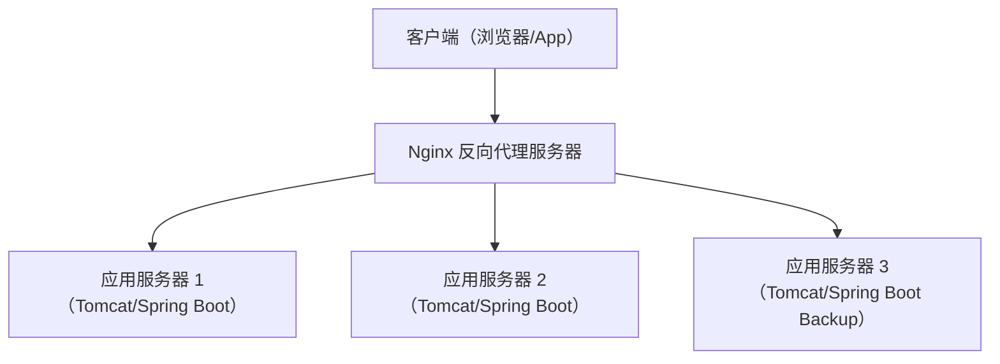

# Nginx - 综合场景串联

---

## 场景一：Nginx 配置反向代理 + 负载均衡实现高可用

### 场景描述
某电商平台后端部署了多台应用服务器（Tomcat/Spring Boot），需要在前端入口统一使用 Nginx 作为反向代理和负载均衡器，实现请求分发、故障转移和流量控制，保证系统高可用。

### 涉及知识点
- [Nginx 反向代理与负载均衡](./01-Nginx反向代理与负载均衡.md)：upstream 配置、负载均衡算法、健康检查、proxy_pass
- [Nginx 性能优化与安全配置](./02-Nginx性能优化与安全配置.md)：连接数优化、超时配置、限流配置
- [Nginx 笔面试题集](./03-Nginx笔面试题集.md)：upstream 参数调优、故障转移机制



> Nginx 作为反向代理和负载均衡器，将客户端请求统一分发到多台后端应用服务器。通过 upstream 配置权重、健康检查和 backup 机制，实现高可用和故障转移。

### 协作流程
1. 配置 upstream 后端服务器池，定义多个后端节点和负载均衡策略：
   ```nginx
   upstream backend {
       server 192.168.1.10:8080 weight=3 max_fails=3 fail_timeout=30s;
       server 192.168.1.11:8080 weight=2 max_fails=3 fail_timeout=30s;
       server 192.168.1.12:8080 backup;
   }
   ```
2. 配置 server 块中的反向代理，将客户端请求转发到 upstream：
   ```nginx
   location /api/ {
       proxy_pass http://backend;
       proxy_set_header Host $host;
       proxy_set_header X-Real-IP $remote_addr;
       proxy_set_header X-Forwarded-For $proxy_add_x_forwarded_for;
   }
   ```
3. 配置被动健康检查：max_fails=3 表示 30 秒内失败 3 次则标记为不可用，fail_timeout=30s 表示不可用持续 30 秒后重新尝试。
4. 配置 backup 备用服务器：正常时只有主服务器承接流量，所有主服务器都不可用时 backup 自动接管。
5. 配置超时参数：proxy_connect_timeout 控制连接超时，proxy_read_timeout 控制读取响应超时，防止慢请求阻塞连接。
6. 配置连接数限制：worker_connections 控制每个 worker 最大连接数，limit_conn 限制每个客户端的并发连接数，防止单个客户端占用过多资源。
7. 配置日志：access_log 记录请求日志，error_log 记录错误日志，便于问题排查和监控。

### 关键要点
- upstream 中 weight 参数按服务器性能比例分配流量
- max_fails 和 fail_timeout 是被动健康检查的核心参数
- proxy_set_header 必须设置 X-Real-IP 和 X-Forwarded-For，确保后端能获取真实客户端 IP
- backup 服务器是最后兜底，正常运行时不会接收流量

---

## 场景二：配置 HTTPS 证书实现安全访问

### 场景描述
某企业官网需要从 HTTP 升级到 HTTPS，使用 Nginx 配置 SSL 证书实现全站加密传输，同时配置 HTTP 自动跳转 HTTPS、HSTS 强制安全传输、SSL 协议优化，确保网站安全合规。

### 涉及知识点
- [Nginx 反向代理与负载均衡](./01-Nginx反向代理与负载均衡.md)：server 块配置、端口监听
- [Nginx 性能优化与安全配置](./02-Nginx性能优化与安全配置.md)：SSL 证书配置、安全协议配置、HTTP 跳转 HTTPS
- [Nginx 笔面试题集](./03-Nginx笔面试题集.md)：SSL/TLS 握手过程、证书链验证

### 协作流程
1. 申请 SSL 证书（如 Let's Encrypt 免费证书），获取证书文件（fullchain.pem）和私钥文件（privkey.pem）。
2. 配置 HTTPS server 块，监听 443 端口：
   ```nginx
   server {
       listen 443 ssl http2;
       server_name example.com;
       ssl_certificate /etc/nginx/ssl/fullchain.pem;
       ssl_certificate_key /etc/nginx/ssl/privkey.pem;
       ssl_protocols TLSv1.2 TLSv1.3;
       ssl_ciphers HIGH:!aNULL:!MD5;
   }
   ```
3. 配置 HTTP 自动跳转 HTTPS：在 80 端口 server 块中配置 `return 301 https://$host$request_uri;`，将所有 HTTP 请求永久重定向到 HTTPS。
4. 配置 HSTS 响应头：`add_header Strict-Transport-Security "max-age=31536000; includeSubDomains" always;`，强制浏览器在一年内只能通过 HTTPS 访问该域名。
5. 配置 SSL 会话缓存：`ssl_session_cache shared:SSL:10m;` 和 `ssl_session_timeout 10m;`，缓存 SSL 会话参数减少 TLS 握手开销。
6. 配置 OCSP Stapling：`ssl_stapling on;` 和 `ssl_stapling_verify on;`，由 Nginx 代替客户端验证证书状态，减少客户端验证开销。
7. 验证配置：使用 `nginx -t` 检查语法，使用 SSL Labs 在线工具检测 SSL 配置安全等级。

### 关键要点
- ssl_protocols 必须仅启用 TLSv1.2 和 TLSv1.3，禁用已被淘汰的 TLS 1.0/1.1
- ssl_ciphers 配置高强度加密套件，避免使用弱加密算法
- HSTS 响应头是防止 SSL 降级攻击的关键配置
- HTTP 跳转 HTTPS 使用 301 永久重定向，搜索引擎会更新索引
- 证书文件必须妥善保管，私钥文件权限设置为 600

---

## 完整可运行示例代码

以下是一个完整的 Nginx 生产级配置示例，涵盖反向代理、负载均衡和 HTTPS 三大核心功能，可直接用于电商平台前端入口。

### 步骤一：环境准备与目录结构

```bash
# 创建 SSL 证书目录
mkdir -p /etc/nginx/ssl
mkdir -p /etc/nginx/conf.d
mkdir -p /var/log/nginx
mkdir -p /usr/share/nginx/html

# 使用 OpenSSL 生成自签名证书（仅用于测试环境，生产环境请使用 CA 签发证书）
openssl req -x509 -nodes -days 365 -newkey rsa:2048 \
  -keyout /etc/nginx/ssl/privkey.pem \
  -out /etc/nginx/ssl/fullchain.pem \
  -subj "/C=CN/ST=Zhejiang/L=Hangzhou/O=MyCompany/CN=example.com"

# 生成 DH 参数（增强安全性，需要几分钟）
openssl dhparam -out /etc/nginx/ssl/dhparam.pem 2048

# 创建后端模拟服务（用于测试负载均衡）
mkdir -p /usr/share/nginx/html/server1
mkdir -p /usr/share/nginx/html/server2
mkdir -p /usr/share/nginx/html/server3
echo "Server 1 (weight=3)" > /usr/share/nginx/html/server1/index.html
echo "Server 2 (weight=2)" > /usr/share/nginx/html/server2/index.html
echo "Server 3 (backup)" > /usr/share/nginx/html/server3/index.html
```

### 步骤二：主配置文件 nginx.conf

```nginx
# /etc/nginx/nginx.conf
user nginx;
worker_processes auto;                    # 自动匹配CPU核心数
worker_rlimit_nofile 65535;               # 每个worker最大文件描述符数

error_log /var/log/nginx/error.log warn;
pid /var/run/nginx.pid;

events {
    use epoll;                            # Linux下使用epoll事件模型
    worker_connections 4096;              # 每个worker最大连接数
    multi_accept on;                      # 同时接受多个新连接
}

http {
    # ===== 基础配置 =====
    include       /etc/nginx/mime.types;
    default_type  application/octet-stream;
    charset utf-8;

    # ===== 日志格式 =====
    log_format main '$remote_addr - $remote_user [$time_local] '
                    '"$request" $status $body_bytes_sent '
                    '"$http_referer" "$http_user_agent" '
                    '$request_time $upstream_response_time '
                    '$upstream_addr';

    access_log /var/log/nginx/access.log main buffer=64k flush=5s;

    # ===== 性能优化 =====
    sendfile        on;                   # 零拷贝文件传输
    tcp_nopush      on;                   # 减少网络报文段数量
    tcp_nodelay     on;                   # 禁用 Nagle 算法，减小延迟
    keepalive_timeout 65;                 # 长连接超时时间
    keepalive_requests 1000;              # 单个长连接最大请求数
    client_max_body_size 20m;             # 客户端请求体最大大小
    client_body_buffer_size 128k;         # 客户端请求体缓冲区大小

    # ===== Gzip 压缩 =====
    gzip on;
    gzip_min_length 1k;
    gzip_comp_level 5;
    gzip_types text/plain text/css
               application/json application/javascript
               application/xml text/xml image/svg+xml;
    gzip_vary on;
    gzip_disable "MSIE [1-6]\.";

    # ===== 限流配置 =====
    # 请求频率限制：每个IP每秒最多10个请求
    limit_req_zone $binary_remote_addr zone=req_limit_per_ip:10m rate=10r/s;
    # 并发连接数限制：每个IP最多10个并发连接
    limit_conn_zone $binary_remote_addr zone=conn_limit_per_ip:10m;

    # ===== 上游后端服务器池 =====
    upstream backend_pool {
        # 加权轮询（默认算法），weight 按服务器性能比例分配
        server 192.168.1.10:8080 weight=3 max_fails=3 fail_timeout=30s;
        server 192.168.1.11:8080 weight=2 max_fails=3 fail_timeout=30s;
        # 备用服务器：所有主服务器不可用时自动接管
        server 192.168.1.12:8080 backup;
        # 长连接池：保持与后端的空闲连接，减少握手开销
        keepalive 32;
        keepalive_timeout 60s;
        keepalive_requests 100;
    }

    # 引入子配置文件
    include /etc/nginx/conf.d/*.conf;
}
```

### 步骤三：HTTP 重定向到 HTTPS 配置

```nginx
# /etc/nginx/conf.d/http-redirect.conf
server {
    listen 80;
    listen [::]:80;
    server_name example.com www.example.com;

    # 301 永久重定向到 HTTPS
    return 301 https://$host$request_uri;
}
```

### 步骤四：HTTPS 反向代理 + 负载均衡完整配置

```nginx
# /etc/nginx/conf.d/ssl-proxy.conf
server {
    # HTTP/2 支持，提升 HTTPS 性能
    listen 443 ssl http2;
    listen [::]:443 ssl http2;
    server_name example.com www.example.com;

    # ===== SSL 证书配置 =====
    ssl_certificate     /etc/nginx/ssl/fullchain.pem;
    ssl_certificate_key /etc/nginx/ssl/privkey.pem;

    # ===== SSL 安全协议与加密套件 =====
    # 仅启用 TLSv1.2 和 TLSv1.3，禁用已淘汰的 TLS 1.0/1.1
    ssl_protocols TLSv1.2 TLSv1.3;
    # 高强度加密套件，优先使用 ECDHE 前向保密
    ssl_ciphers 'ECDHE-ECDSA-AES256-GCM-SHA384:ECDHE-RSA-AES256-GCM-SHA384:'
                'ECDHE-ECDSA-AES128-GCM-SHA256:ECDHE-RSA-AES128-GCM-SHA256:'
                'ECDHE-ECDSA-CHACHA20-POLY1305:ECDHE-RSA-CHACHA20-POLY1305';
    ssl_prefer_server_ciphers on;         # 优先使用服务端加密套件

    # ===== SSL 会话缓存（减少 TLS 握手开销） =====
    ssl_session_cache   shared:SSL:10m;
    ssl_session_timeout 10m;
    ssl_session_tickets off;              # 禁用会话票据，增强安全性

    # ===== DH 参数（增强密钥交换安全性） =====
    ssl_dhparam /etc/nginx/ssl/dhparam.pem;

    # ===== OCSP Stapling（服务端代替客户端验证证书状态） =====
    ssl_stapling on;
    ssl_stapling_verify on;
    resolver 8.8.8.8 114.114.114.114 valid=300s;
    resolver_timeout 5s;

    # ===== 安全响应头 =====
    # HSTS：强制浏览器一年内仅通过 HTTPS 访问
    add_header Strict-Transport-Security "max-age=31536000; includeSubDomains; preload" always;
    add_header X-Frame-Options "SAMEORIGIN" always;
    add_header X-Content-Type-Options "nosniff" always;
    add_header X-XSS-Protection "1; mode=block" always;
    add_header Referrer-Policy "strict-origin-when-cross-origin" always;

    # ===== 静态资源处理 =====
    location / {
        root /usr/share/nginx/html;
        index index.html;
        try_files $uri $uri/ /index.html;
    }

    # ===== API 反向代理（核心配置） =====
    location /api/ {
        # 请求频率限制（每个IP每秒最多10个请求，突发20个）
        limit_req zone=req_limit_per_ip burst=20 nodelay;
        # 并发连接数限制
        limit_conn conn_limit_per_ip 10;

        # 代理到后端服务器池
        proxy_pass http://backend_pool;
        proxy_http_version 1.1;

        # 透传真实客户端信息
        proxy_set_header Host $host;
        proxy_set_header X-Real-IP $remote_addr;
        proxy_set_header X-Forwarded-For $proxy_add_x_forwarded_for;
        proxy_set_header X-Forwarded-Proto $scheme;
        proxy_set_header X-Forwarded-Host $host;
        proxy_set_header X-Forwarded-Port $server_port;

        # 长连接复用（配合 upstream 中的 keepalive）
        proxy_set_header Connection "";

        # 超时配置
        proxy_connect_timeout 10s;        # 连接后端超时
        proxy_send_timeout 30s;           # 发送请求到后端超时
        proxy_read_timeout 30s;           # 读取后端响应超时

        # 缓冲配置
        proxy_buffering on;
        proxy_buffer_size 4k;
        proxy_buffers 8 4k;
        proxy_busy_buffers_size 8k;

        # 错误处理：后端不可用时使用备用页面
        proxy_next_upstream error timeout http_500 http_502 http_503;
        proxy_next_upstream_tries 2;
        proxy_next_upstream_timeout 10s;
    }

    # ===== WebSocket 代理（支持实时通信） =====
    location /ws/ {
        proxy_pass http://backend_pool;
        proxy_http_version 1.1;
        proxy_set_header Upgrade $http_upgrade;
        proxy_set_header Connection "upgrade";
        proxy_set_header Host $host;
        proxy_set_header X-Real-IP $remote_addr;
        proxy_set_header X-Forwarded-For $proxy_add_x_forwarded_for;
        proxy_read_timeout 3600s;         # WebSocket 长连接超时
    }

    # ===== 健康检查端点（不限制频率） =====
    location /health {
        proxy_pass http://backend_pool;
        access_log off;                   # 不记录健康检查日志
        limit_req zone=req_limit_per_ip burst=0 nodelay;
    }
}
```

### 步骤五：验证配置并启动

```bash
# 检查配置文件语法
nginx -t

# 如果输出 "syntax is ok" 和 "test is successful"，则重新加载配置
nginx -s reload

# 或者直接重启 Nginx
systemctl restart nginx

# 查看 Nginx 状态
systemctl status nginx

# 验证 HTTP 到 HTTPS 重定向
curl -I http://example.com
# 预期返回：HTTP/1.1 301 Moved Permanently
#          Location: https://example.com/

# 验证 HTTPS 访问
curl -k https://example.com/api/health
# 预期返回：后端服务的健康检查响应

# 查看访问日志（确认负载均衡分发正常）
tail -f /var/log/nginx/access.log | grep upstream_addr
```

### 步骤六：Docker Compose 一键部署（可选）

```yaml
# docker-compose.yml
version: '3.8'
services:
  nginx:
    image: nginx:1.25-alpine
    container_name: nginx-gateway
    ports:
      - "80:80"
      - "443:443"
    volumes:
      - ./nginx.conf:/etc/nginx/nginx.conf:ro
      - ./conf.d:/etc/nginx/conf.d:ro
      - ./ssl:/etc/nginx/ssl:ro
      - ./html:/usr/share/nginx/html:ro
      - ./logs:/var/log/nginx
    restart: always
    networks:
      - app-network

  backend1:
    image: nginx:alpine
    container_name: backend-server1
    volumes:
      - ./html/server1:/usr/share/nginx/html:ro
    networks:
      - app-network

  backend2:
    image: nginx:alpine
    container_name: backend-server2
    volumes:
      - ./html/server2:/usr/share/nginx/html:ro
    networks:
      - app-network

  backend3:
    image: nginx:alpine
    container_name: backend-server3
    volumes:
      - ./html/server3:/usr/share/nginx/html:ro
    networks:
      - app-network

networks:
  app-network:
    driver: bridge
```

```bash
# 启动所有服务
docker-compose up -d

# 测试负载均衡（多次请求观察分发到不同后端）
for i in $(seq 1 10); do
  curl -k https://localhost/api/ 2>/dev/null
done
```

> [返回模块目录](../../README.md) | [返回知识导览](../../知识导览.md)