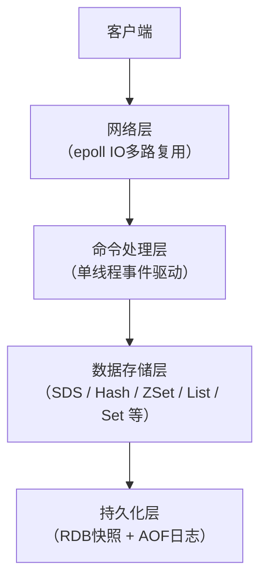
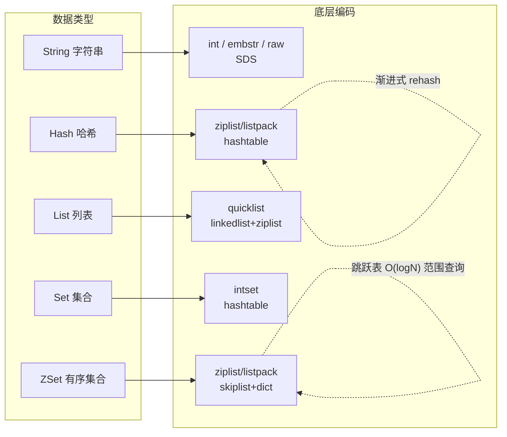

# Redis 核心数据结构与底层原理

> 学习路线对应：补充模块 — Redis 专题
> 前置知识：Java 基础、基本数据结构概念
> 预计学习时间：2 天

---

## 一、核心概念

### 1.1 Redis 是什么

Redis（Remote Dictionary Server）是一个基于内存的高性能 Key-Value 数据库，使用 ANSI C 编写，采用单线程事件驱动模型。它支持丰富的数据结构（字符串、哈希、列表、集合、有序集合等），并提供持久化、主从复制、哨兵、集群等企业级特性。官方 benchmark 显示单机 QPS 可达 10 万级别。

> **缓存击穿**：商场最热门的限量球鞋今天限时优惠结束，但明天还会恢复原价销售（热点 key 过期了，但数据库里还有这个商品）。优惠结束的瞬间，所有顾客同时冲去仓库确认价格——大量并发请求同时打到数据库。解决方案：让第一个顾客去仓库查价格并锁门（互斥锁），其他人排队等结果；或者干脆给这款鞋标上"长期有效"（逻辑过期），后台定时刷新最新价格。

> **生活化类比：Redis 是一把瑞士军刀** —— Memcached 像一把单功能的水果刀，只能削苹果（纯缓存），但极致轻巧锋利；Redis 则是瑞士军刀，除了削苹果（缓存）还能开瓶盖（分布式锁）、拧螺丝（排行榜）、剪电线（消息队列）、当手电筒（计数器/Session 共享）。瑞士军刀的每个工具（数据结构）都为特定场景专门设计（SDS、跳跃表、压缩列表），并且整体采用单手操作（单线程）避免双手打架（锁竞争），所以既全能又高效。选型时：要极致简单缓存选水果刀，要一物多用选瑞士军刀。

> 📖 **参考链接**：
> - [Redis 官方文档 - Introduction](https://redis.io/docs/about/) -- Redis 官方介绍，涵盖定位、特性与典型使用场景
> - [Redis 官方文档 - Data types](https://redis.io/docs/data-types/) -- Redis 全部数据类型（String/Hash/List/Set/ZSet/Stream 等）官方说明
> - [Redis 官方文档 - Commands](https://redis.io/commands/) -- Redis 全部命令参考手册，按数据结构分组

### 1.2 与 Memcached 对比

| 维度 | Redis | Memcached |
|------|-------|-----------|
| 数据结构 | 支持 String、Hash、List、Set、ZSet、Bitmap、HyperLogLog、GEO、Stream 等 | 仅支持 String（二进制） |
| 持久化 | 支持 RDB 快照 + AOF 日志，数据可恢复 | 不支持持久化，进程重启数据丢失 |
| 集群 | 原生支持 Redis Cluster（16384 个槽位） | 需要客户端一致性哈希或第三方代理（如 Twemproxy） |
| 发布订阅 | 原生支持 Pub/Sub | 不支持 |
| 内存管理 | 多种内存淘汰策略（LRU/LFU/TTL 等） | 仅 LRU 淘汰 |
| 线程模型 | 6.0 前单线程，6.0+ 引入多线程 I/O（命令执行仍单线程） | 多线程 |
| 事务 | 支持 MULTI/EXEC 事务（非原子性回滚） | 不支持 |
| Lua 脚本 | 支持（原子性执行） | 不支持 |
| 适用场景 | 缓存、分布式锁、排行榜、消息队列、计数器、Session 共享 | 纯缓存场景 |

**总结**：Memcached 更轻量但在功能上远不如 Redis 丰富。现代项目选型中，Redis 是绝大多数场景的首选。

### 1.3 单线程为什么快

Redis 6.0 之前所有命令执行均在单线程中完成，但性能极高，原因如下：

1. **纯内存操作**：所有数据存储在内存中，读写速度远高于磁盘 I/O，内存带宽是主要瓶颈而非 CPU。
2. **IO 多路复用（epoll）**：单线程通过 epoll 机制同时监听多个客户端连接，有事件就处理，无事件就阻塞等待，避免为每个连接创建线程的开销。
3. **单线程避免锁竞争**：没有多线程并发访问共享数据的问题，不需要加锁，也无需上下文切换开销。
4. **高效的数据结构**：底层使用 SDS、跳跃表、压缩列表等专门为高性能设计的数据结构。

> **Redis 6.0 为什么引入多线程？** 瓶颈不在 CPU 和命令执行，而在网络 I/O。6.0 引入多线程处理网络数据的读写和协议解析，而命令执行仍保持单线程。这既保证了原子性，又提升了网络吞吐量。

### 1.4 全局命令速查

| 命令 | 用途 | 注意事项 |
|------|------|----------|
| `KEYS pattern` | 查询匹配模式的所有 key | **生产禁用**，O(N) 复杂度，会阻塞主线程 |
| `SCAN cursor [MATCH pattern] [COUNT count]` | 渐进式遍历 key | 安全替代 KEYS，基于游标，每次返回部分结果 |
| `EXISTS key [key...]` | 判断 key 是否存在 | 返回 1 或 0，支持批量判断 |
| `TYPE key` | 获取 key 对应 value 的数据类型 | 返回 string/list/set/zset/hash 等 |
| `DEL key [key...]` | 删除 key | 支持批量删除，返回实际删除数量 |
| `EXPIRE key seconds` | 设置 key 过期时间（秒） | 返回 1 成功，0 失败（key 不存在） |
| `TTL key` | 查看 key 剩余过期时间（秒） | -1 永不过期，-2 已过期或不存在 |

---

> **Redis 整体架构层次**：下图展示了 Redis 从客户端请求到数据存储的完整层次结构，清晰体现了其单线程事件驱动架构的设计理念。



> Redis 采用 epoll 多路复用机制监听多个客户端连接，所有命令在单线程中顺序执行，避免了锁竞争，配合高效的内存数据结构实现极高吞吐量。

---

## 二、底层原理

> **Redis 数据结构与底层编码关系图**：下图展示了 Redis 五大基础数据结构与底层编码（实现）之间的对应关系，清晰呈现"一种数据结构多种编码、根据数据规模自动切换"的设计哲学。



> 每种数据类型都提供"小数据紧凑存储、大数据高效查询"的双编码策略，编码切换由 `*-max-ziplist-entries` 等配置阈值自动触发，对使用者完全透明。

### 2.1 字符串（SDS — Simple Dynamic String）

Redis 没有直接使用 C 语言的 `char[]`，而是自定义了 SDS（Simple Dynamic String）结构。

#### SDS 结构定义

> Redis 3.2+ 将 SDS 重构为 5 种头部类型（sdshdr5/8/16/32/64），`free` 字段已改为 `alloc`（已分配空间）。以下是简化版示意：

```c
struct sdshdr {
    int len;    // 已使用字节数
    int free;   // 未使用字节数（Redis 3.2 前字段名，3.2+ 改为 alloc）
    char buf[]; // 字节数组
};
```

#### 与 C 字符串对比

| 特性 | C 字符串 | SDS |
|------|----------|-----|
| 获取长度 | O(N) 遍历到 `\0` | O(1) 直接读取 `len` 字段 |
| 缓冲区溢出 | 可能（`strcat` 不检查边界） | 杜绝（追加前自动检查并扩容） |
| 二进制安全 | 否（遇到 `\0` 提前结束） | 是（以 `len` 判断长度，不依赖 `\0`） |
| 内存分配 | 每次修改需重新分配 | 预分配 + 惰性释放，减少 `malloc` 次数 |
| 兼容性 | — | 兼容部分 C 字符串函数（`buf` 末尾保留 `\0`） |

#### 内存预分配策略

当 SDS 需要扩容时，不仅分配实际需要的空间，还会额外预留：

- **len < 1MB**：分配空间加倍（总空间 = 2 * 新长度 + 1 字节 `\0`）。
- **len >= 1MB**：额外追加 1MB（总空间 = 新长度 + 1MB + 1 字节 `\0`）。

**惰性空间释放**：当字符串缩短时，不会立即释放多余空间，而是增加 `free` 字段，留给后续操作使用，避免频繁内存分配。

#### 三种编码

Redis 为字符串对象设计了三种内部编码，根据存储内容自动切换：

| 编码 | 条件 | 说明 |
|------|------|------|
| `int` | 值可解析为整数，且不超过 `long` 范围 | 直接存储数字，不分配 SDS |
| `embstr` | 字符串长度 <= 44 字节（Redis 3.2+） | SDS 与 RedisObject 连续分配在一块内存，只分配一次 |
| `raw` | 字符串长度 > 44 字节 | SDS 与 RedisObject 分别分配内存，需两次 `malloc` |

> **为什么是 44 字节？** RedisObject 占 16 字节，sdshdr8 占 3 字节（len+alloc+flags），末尾 `\0` 占 1 字节。`jemalloc` 分配 64 字节的块，64 - 16 - 3 - 1 = 44。

> **生活化类比：String 像一张智能便签纸** —— C 语言的 `char[]` 像一张普通便签纸：想知道写了多少字得从头数到 `\0`（O(N) 获取长度），写超了会把后面内容覆盖（缓冲区溢出），遇到 `\0` 就以为写完了（不二进制安全）。SDS 则是"智能便签纸"：顶部贴了字数标签（`len` 字段，O(1) 获取长度），写之前自动检查纸张够不够并提前加页（预分配，杜绝溢出），按字数判断结束而非依赖 `\0`（二进制安全，能存图片/序列化字节）。短便签（<=44 字节 embstr）一张纸写完，长便签（raw）则用两张纸分开存。

> 📖 **参考链接**：
> - [Redis 官方文档 - String](https://redis.io/docs/data-types/strings/) -- String 类型官方说明与命令列表
> - [Redis 官方文档 - SET command](https://redis.io/commands/set/) -- SET 命令的 NX/EX 等选项详解
> - [Redis 源码 - sds.h](https://github.com/redis/redis/blob/unstable/src/sds.h) -- SDS 五种头部类型（sdshdr5/8/16/32/64）的源码定义

#### 常用命令

```bash
SET key value [EX seconds] [NX|XX]  # 设置 key，支持过期和条件设置
GET key                              # 获取 key 的值
INCR key / DECR key                  # 原子递增/递减 1
INCRBY key increment                 # 原子递增指定值
SETNX key value                      # 仅当 key 不存在时设置（分布式锁基础）
SETEX key seconds value              # 设置 key 并指定过期时间
MSET k1 v1 k2 v2 ...                 # 批量设置
MGET k1 k2 ...                       # 批量获取
APPEND key value                     # 追加字符串
GETRANGE key start end               # 截取子串
STRLEN key                           # 获取字符串长度
```

---

### 2.2 哈希（Hash）

#### 两种编码

| 编码 | 触发条件（默认配置） | 说明 |
|------|---------------------|------|
| `ziplist`（Redis 6 及之前） | 字段数 <= 512 且所有字段和值的长度 <= 64 字节 | 压缩列表，连续内存，节省空间 |
| `hashtable` | 超过上述阈值 | 标准字典结构，查询 O(1) |

> **Redis 7.0 重要变更**：`ziplist` 已被 `listpack` 替代。配置项也对应更名为 `hash-max-listpack-entries` 和 `hash-max-listpack-value`。如需了解 Redis 7 实际行为，请参考 listpack 文档。

配置项：`hash-max-ziplist-entries 512` 和 `hash-max-ziplist-value 64`。

#### ziplist 结构

```
<zlbytes> <zltail> <zllen> <entry> <entry> ... <entry> <zlend>
```

- `zlbytes`（4 字节）：整个 ziplist 占用的字节数。
- `zltail`（4 字节）：最后一个 entry 的偏移量，支持从尾部快速遍历。
- `zllen`（2 字节）：entry 数量（超过 65535 时需遍历获取真实数量）。
- `entry`：实际存储的节点，每个节点包含前一个节点长度、当前节点编码和数据。
- `zlend`（1 字节）：结束标记 `0xFF`。

**优点**：连续内存，无指针开销，内存利用率高。
**缺点**：插入/删除可能触发连锁更新（前一个节点长度变化导致后续节点级联调整）。

#### 渐进式 rehash 原理

哈希表扩容或缩容时，Redis 不会一次性迁移所有数据，而是采用**渐进式 rehash**：

1. 字典内部维护两个哈希表 `ht[0]`（当前使用）和 `ht[1]`（新哈希表）。
2. 设置 `rehashidx = 0`，表示 rehash 开始。
3. 每次对字典执行增删改查操作时，顺带将 `ht[0]` 中 `rehashidx` 对应桶的全部键值对迁移到 `ht[1]`，然后 `rehashidx++`。
4. 同时，后台定时任务（`serverCron`）每 1ms 执行一次 rehash 步进（100 个桶/次）。
5. 当 `rehashidx == ht[0].size` 时，rehash 完成，释放 `ht[0]`，将 `ht[1]` 设为 `ht[0]`，重置 `rehashidx = -1`。

**期间查找逻辑**：先在 `ht[0]` 查找，找不到再到 `ht[1]` 查找。新增数据直接写入 `ht[1]`。

#### 扩容与缩容条件

| 条件 | 触发操作 | 说明 |
|------|----------|------|
| 负载因子 >= 1（无 BGSAVE/BGREWRITEAOF） | 扩容 | 正常扩容 |
| 负载因子 >= 5（有 BGSAVE/BGREWRITEAOF） | 扩容 | 提高阈值，避免写时复制期间大量内存开销 |
| 负载因子 < 0.1 | 缩容 | 节约内存 |

> 负载因子 = `ht[0].used / ht[0].size`。扩容后大小为第一个大于等于 `used * 2` 的 `2^n`。

#### 常用命令

```bash
HSET key field value [field value ...]  # 设置字段
HGET key field                          # 获取字段值
HMSET key field value ...               # 批量设置（已废弃，推荐 HSET 批量）
HGETALL key                             # 获取所有字段和值（慎用全量）
HDEL key field [field ...]              # 删除字段
HINCRBY key field increment             # 原子递增字段值
HEXISTS key field                       # 判断字段是否存在
HKEYS key / HVALS key                   # 获取所有字段名 / 值
HLEN key                                # 获取字段数量
HSCAN key cursor [MATCH pattern] [COUNT count]  # 渐进式遍历
```

> **生活化类比：Hash 像一本通讯录** —— 把一个人的所有信息塞进一个 String 就像把"姓名+电话+邮箱+地址"全写在一行字里，每次改电话都得整行重写。Hash 则像通讯录的一张联系人卡片：每个字段（field）独立存放（HSET user:1 name "张三"），改电话只改电话字段，查名字 O(1) 直接定位。通讯录小时候用小本子记（ziplist 紧凑存储，省空间但查找慢），人多了换电子通讯录（hashtable，O(1) 查找）。搬家（扩容）时不会一次性把整个通讯录抄一遍，而是今天抄一页明天抄一页（渐进式 rehash），避免手忙脚乱导致服务中断。

> 📖 **参考链接**：
> - [Redis 官方文档 - Hash](https://redis.io/docs/data-types/hashes/) -- Hash 类型官方说明、命令与使用场景
> - [Redis 官方文档 - HSET command](https://redis.io/commands/hset/) -- HSET 批量设置字段命令详解
> - [Redis 配置 - hash-max-ziplist-entries](https://redis.io/docs/management/config/) -- 控制编码切换阈值的配置项说明

---

### 2.3 列表（List）

#### 底层实现演进

| 版本 | 实现 | 说明 |
|------|------|------|
| 3.2 之前 | `linkedlist` + `ziplist` | 小数据用 ziplist，大数据用双向链表 |
| 3.2 及以后 | `quicklist` | 统一使用 quicklist |

#### quicklist 结构

`quicklist` 是 `linkedlist` 和 `ziplist`（Redis 7 中改为 `listpack`）的混合体：外层是一个双向链表，每个链表节点内部是一个 `ziplist`（Redis 6）或 `listpack`（Redis 7）。

```
quicklist
  ├── quicklistNode (head)
  │     └── ziplist (多个元素压缩存储)
  ├── quicklistNode
  │     └── ziplist
  ├── quicklistNode
  │     └── ziplist
  └── quicklistNode (tail)
        └── ziplist
```

**设计优势**：
- 相比纯 `linkedlist`：每个节点存储多个元素，减少指针开销，内存更紧凑。
- 相比纯 `ziplist`：每个 ziplist 不会太大，避免连锁更新和插入/删除时的性能问题。
- 支持中间节点 LZF 压缩，进一步节约内存。

#### 应用场景

1. **消息队列**：`LPUSH` 生产消息 + `BRPOP` 阻塞消费，实现简单的生产者-消费者模型。
2. **最新消息列表**：`LPUSH` 写入 + `LTRIM` 截断，保留最近 N 条记录。
3. **栈**：`LPUSH` + `LPOP` 实现后进先出。

#### 常用命令

```bash
LPUSH key value [value ...]    # 左侧插入（头部）
RPUSH key value [value ...]    # 右侧插入（尾部）
LPOP key                       # 左侧弹出
RPOP key                       # 右侧弹出
LRANGE key start stop          # 获取指定范围元素（慎用 0 -1 全量）
LLEN key                       # 获取列表长度
LINDEX key index               # 按索引获取元素
LTRIM key start stop           # 裁剪列表，保留指定范围
BRPOP key [key ...] timeout    # 阻塞右侧弹出（超时返回 nil）
BLPOP key [key ...] timeout    # 阻塞左侧弹出
```

---

### 2.4 集合（Set）

#### 两种编码

| 编码 | 触发条件 | 说明 |
|------|----------|------|
| `intset` | 所有元素为整数，且数量 <= 512 | 有序整数数组，二分查找 O(logN) |
| `hashtable` | 超过上述阈值或包含非整数元素 | 字典结构，value 为 NULL |

配置项：`set-max-intset-entries 512`。

#### intset 升级机制

`intset` 内部根据元素大小选择编码：

| 编码 | 范围 | 每个元素占用 |
|------|------|-------------|
| `INTSET_ENC_INT16` | -32768 ~ 32767 | 2 字节 |
| `INTSET_ENC_INT32` | -2^31 ~ 2^31-1 | 4 字节 |
| `INTSET_ENC_INT64` | -2^63 ~ 2^63-1 | 8 字节 |

当插入的新元素超出当前编码范围时，触发**升级**：将所有元素按新编码重新分配空间。**升级不可逆，不支持降级**。例如，从 `int16` 升级到 `int32` 后，即使删除大元素也无法降回 `int16`。

#### 应用场景

1. **标签系统**：`SADD user:1:tags "java" "redis" "spring"`，灵活管理用户标签。
2. **共同好友 / 交集运算**：`SINTER` 计算两个用户共同关注的人。
3. **随机抽奖**：`SRANDMEMBER` 随机抽取元素，`SPOP` 随机弹出一个元素（不可重复抽奖）。
4. **去重计数**：`SCARD` 获取集合大小，天然去重。

#### 常用命令

```bash
SADD key member [member ...]           # 添加元素
SREM key member [member ...]           # 删除元素
SMEMBERS key                           # 获取所有元素（慎用全量）
SISMEMBER key member                   # 判断元素是否存在
SCARD key                              # 获取集合大小
SINTER key [key ...]                   # 交集
SUNION key [key ...]                   # 并集
SDIFF key [key ...]                    # 差集（第一个 key 相比其他 key 的差集）
SINTERSTORE destination key [key ...]  # 交集结果存入 destination
SRANDMEMBER key [count]                # 随机获取 count 个元素
SPOP key [count]                       # 随机弹出 count 个元素
SSCAN key cursor [MATCH pattern] [COUNT count]  # 渐进式遍历
```

---

### 2.5 有序集合（ZSet）

#### 两种编码

| 编码 | 触发条件 | 说明 |
|------|----------|------|
| `ziplist`（Redis 6 及之前） | 元素数 <= 128 且所有成员长度 <= 64 字节 | 紧凑存储，按 score 升序排列 |
| `skiplist + dict` | 超过上述阈值 | 跳跃表排序 + 字典 O(1) 查找 |

> 同 Hash 一样，Redis 7.0 已将 ZSet 的 ziplist 编码替换为 `listpack`，配置项对应更名为 `zset-max-listpack-entries` 和 `zset-max-listpack-value`。

配置项：`zset-max-ziplist-entries 128` 和 `zset-max-ziplist-value 64`。

#### 底层结构：skiplist + dict

当编码为 `skiplist` 时，ZSet 同时维护两个结构：

- **skiplist（跳跃表）**：按 score 排序存储，支持 O(logN) 的范围查询和排名查询。
- **dict（字典）**：member → score 的映射，支持 O(1) 的 score 查询。

两者通过指针共享同一份 member 和 score，不会造成内存翻倍。

#### 跳跃表（skiplist）原理

跳跃表是一种**多层索引**的链表结构，核心思想是"以空间换时间"：

```
Level 3:  1 ────────────────────────> 9 ─────> NULL
Level 2:  1 ────────────> 5 ────────> 9 ─────> NULL
Level 1:  1 ────> 3 ────> 5 ──> 7 ──> 9 ──> 11 > NULL
Level 0:  1 -> 2 -> 3 -> 4 -> 5 -> 6 -> 7 -> 8 -> 9 -> 10 -> 11 -> NULL
```

- **层数上限**：最高 32 层。
- **随机层高**：每次创建节点时，以概率 p = 0.25 随机生成层数（`ZSKIPLIST_P = 0.25`）。这个概率下，期望层数为 `1/(1-p)`，即约 1.33 层。
- **查找过程**：从最高层开始，找到当前层最后一个小于目标值的节点，然后下降一层继续查找，直到 level 0 找到目标或确认不存在。时间复杂度 O(logN)。
- **范围查询**：找到起点后，在 level 0 沿链表向后遍历即可，非常高效。

#### 为什么用 skiplist 不用红黑树

| 维度 | 跳跃表 | 红黑树 |
|------|--------|--------|
| 实现复杂度 | 简单，代码量少，易于理解和维护 | 复杂，旋转和变色逻辑多，容易出 bug |
| 范围查询 | 天然支持，找到起点后顺序遍历 level 0 链表 | 需要中序遍历，涉及父指针回溯，不如链表直观 |
| 并发友好 | 锁粒度更细（可只锁相邻节点），易于实现无锁结构 | 旋转操作涉及多个节点，锁粒度粗 |
| 内存占用 | 平均每个节点约 1.33 个额外指针 | 每个节点需要 color 标记和 parent 指针 |
| 插入/删除 | 只需修改相邻节点指针 | 需要旋转和重新着色 |

**核心结论**：跳跃表实现简单、范围查询高效，且 Redis 作者 antirez 认为跳跃表代码更少、更易维护。

#### 应用场景

1. **排行榜**：`ZADD` 添加分数，`ZREVRANGE` 获取 Top N，`ZINCRBY` 动态更新分数。
2. **延迟队列**：score 存储执行时间戳，通过 `ZRANGEBYSCORE` 轮询到期任务。
3. **带权重的消息队列**：score 表示优先级，`ZPOPMIN` 或 `ZPOPMAX` 按优先级弹出。

#### 常用命令

```bash
ZADD key [NX|XX] score member [score member ...]  # 添加元素
ZREM key member [member ...]                       # 删除元素
ZSCORE key member                                  # 获取元素分数
ZRANK key member                                   # 获取升序排名（从 0 开始）
ZREVRANK key member                                # 获取降序排名
ZRANGE key start stop [WITHSCORES]                 # 按索引范围获取（升序）
ZREVRANGE key start stop [WITHSCORES]              # 按索引范围获取（降序）
ZRANGEBYSCORE key min max [WITHSCORES] [LIMIT offset count]  # 按分数范围获取
ZINCRBY key increment member                       # 原子递增分数
ZCARD key                                          # 获取元素数量
ZCOUNT key min max                                 # 获取分数范围内元素数量
ZREMRANGEBYRANK key start stop                     # 按排名范围删除
ZREMRANGEBYSCORE key min max                       # 按分数范围删除
```

> 📖 **参考链接**：
> - [Redis 官方文档 - Sorted Set](https://redis.io/docs/data-types/sorted-sets/) -- ZSet 有序集合官方说明与命令列表
> - [Redis 官方文档 - ZADD command](https://redis.io/commands/zadd/) -- ZADD 命令的 NX/XX/CH 选项详解
> - [Redis 官方文档 - Lists / Sets / Streams](https://redis.io/docs/data-types/) -- List/Set/Stream 等其他数据类型官方文档汇总

---

### 2.6 高级数据结构

#### 2.6.1 Bitmap（位图）

Bitmap 不是一个独立的数据类型，而是基于 String 的位操作扩展。最大支持 2^32 位（约 512MB）。

**常用命令**：

```bash
SETBIT key offset value      # 设置指定偏移位的值（0 或 1）
GETBIT key offset            # 获取指定偏移位的值
BITCOUNT key [start end]     # 统计指定范围内值为 1 的位数
BITPOS key bit [start] [end] # 查找第一个值为 bit 的位置
BITOP operation destkey key [key ...]  # 位运算（AND/OR/XOR/NOT）
```

**应用场景**：

- **签到统计**：每天对应一个 offset，`SETBIT user:signin:202401 5 1` 表示 1 月 6 日签到。`BITCOUNT` 统计签到天数。
- **用户在线状态**：每个用户一个 offset，`SETBIT online_users user_id 1`。
- **布隆过滤器**：结合多个哈希函数，用 Bitmap 实现去重判定。

#### 2.6.2 HyperLogLog

HyperLogLog 是一种概率性数据结构，用于**基数统计**（统计不重复元素个数）。每个 key 仅占用 **12KB** 内存，标准误差为 **0.81%**。

**常用命令**：

```bash
PFADD key element [element ...]    # 添加元素
PFCOUNT key [key ...]              # 估算基数（近似不重复元素数）
PFMERGE destkey sourcekey [sourcekey ...]  # 合并多个 HyperLogLog
```

**应用场景**：

- **UV 统计（独立访客）**：每天一个 key，`PFADD uv:20240101 user_id`，12KB 存上亿 UV。
- **去重计数**：不需要精确计数的场景，如页面 PV 去重、搜索词去重等。

**原理简析**：HyperLogLog 基于伯努利试验，通过记录哈希值中连续前导零的最大长度来估算基数。N 个随机比特串中，连续前导零为 k 的概率约为 `1/2^k`，若观察到最大连续前导零为 k，则基数约为 `2^k`。

#### 2.6.3 GEO（地理位置）

GEO 是 Redis 3.2 引入的地理位置数据结构，底层基于 **ZSet + GeoHash** 编码实现。

**常用命令**：

```bash
GEOADD key longitude latitude member [longitude latitude member ...]  # 添加地理位置
GEOPOS key member [member ...]          # 获取成员坐标
GEODIST key member1 member2 [unit]      # 计算两个成员之间的距离（m/km/mi/ft）
GEORADIUS key longitude latitude radius unit [WITHCOORD] [WITHDIST] [COUNT count] [ASC|DESC]  # 以指定坐标为中心，查找半径内的成员
GEORADIUSBYMEMBER key member radius unit [WITHCOORD] [WITHDIST]  # 以指定成员为中心，查找半径内的成员
GEOHASH key member [member ...]         # 获取成员的 GeoHash 编码
```

**应用场景**：

- **附近的人**：`GEOADD` 存储用户位置，`GEORADIUS` 查询附近用户。
- **附近商家**：`GEORADIUS` 按距离排序，`WITHDIST` 返回距离。
- **配送范围**：判断用户是否在商家配送半径内。

> **GeoHash 原理**：将经纬度二分逼近编码为字符串，编码越长精度越高。Redis 内部将 GeoHash 编码为 52 位整数存入 ZSet 的 score，通过 ZSet 的范围查询实现地理位置搜索。

---

## 三、实战应用

### 3.1 Spring Boot 集成 Redis

**依赖引入**（`pom.xml`）：

```xml
<dependency>
    <groupId>org.springframework.boot</groupId>
    <artifactId>spring-boot-starter-data-redis</artifactId>
</dependency>
<dependency>
    <groupId>org.apache.commons</groupId>
    <artifactId>commons-pool2</artifactId>
</dependency>
```

**配置**（`application.yml`）：

```yaml
spring:
  data:
    redis:
      host: localhost
      port: 6379
      password: 
      database: 0
      lettuce:
        pool:
          max-active: 8
          max-idle: 8
          min-idle: 0
          max-wait: -1ms
```

### 3.2 RedisTemplate 与序列化

Spring Data Redis 提供两个核心模板：

- **`RedisTemplate<K, V>`**：支持任意类型，需指定序列化器。
- **`StringRedisTemplate`**：继承 `RedisTemplate`，Key 和 Value 均使用 String 序列化，适合纯字符串操作。

**序列化器选型**：

| 序列化器 | 可读性 | 占用空间 | 推荐 |
|----------|--------|----------|------|
| `JdkSerializationRedisSerializer`（默认） | 不可读 | 大 | 不推荐 |
| `Jackson2JsonRedisSerializer` | 可读 JSON | 小 | **推荐** |
| `StringRedisSerializer` | 可读 | 小 | 推荐用于 Key |
| `GenericJackson2JsonRedisSerializer` | 可读 JSON | 中（含 `@class` 元数据） | 可选 |

**推荐配置**：

```java
@Configuration
public class RedisConfig {

    @Bean
    public RedisTemplate<String, Object> redisTemplate(RedisConnectionFactory factory) {
        RedisTemplate<String, Object> template = new RedisTemplate<>();
        template.setConnectionFactory(factory);

        // Key 使用 String 序列化
        StringRedisSerializer stringSerializer = new StringRedisSerializer();
        template.setKeySerializer(stringSerializer);
        template.setHashKeySerializer(stringSerializer);

        // Value 使用 JSON 序列化
        Jackson2JsonRedisSerializer<Object> jsonSerializer = 
            new Jackson2JsonRedisSerializer<>(Object.class);
        ObjectMapper om = new ObjectMapper();
        om.setVisibility(PropertyAccessor.ALL, JsonAutoDetect.Visibility.ANY);
        om.activateDefaultTyping(LaissezFaireSubTypeValidator.instance,
            ObjectMapper.DefaultTyping.NON_FINAL);
        jsonSerializer.setObjectMapper(om);
        
        template.setValueSerializer(jsonSerializer);
        template.setHashValueSerializer(jsonSerializer);
        template.afterPropertiesSet();
        return template;
    }
}
```

### 3.3 缓存注解

Spring Cache 提供声明式缓存，与 Redis 结合使用：

```java
@Cacheable(value = "user", key = "#id", unless = "#result == null")
public User getUserById(Long id) {
    // 缓存命中直接返回，未命中执行方法并将结果存入缓存
    return userMapper.selectById(id);
}

@CacheEvict(value = "user", key = "#id")
public void deleteUser(Long id) {
    // 执行方法后删除指定缓存
    userMapper.deleteById(id);
}

@CachePut(value = "user", key = "#user.id")
public User updateUser(User user) {
    // 每次执行方法后更新缓存
    userMapper.updateById(user);
    return user;
}

// 组合注解
@Caching(
    evict = {
        @CacheEvict(value = "user", key = "#user.id"),
        @CacheEvict(value = "userList", allEntries = true)
    }
)
public User saveUser(User user) {
    userMapper.insert(user);
    return user;
}
```

### 3.4 分布式 Session

```java
@Configuration
@EnableRedisHttpSession(maxInactiveIntervalInSeconds = 1800)  // 30 分钟过期
public class SessionConfig {
}
```

```yaml
spring:
  session:
    store-type: redis
    redis:
      namespace: spring:session   # Session 在 Redis 中的 key 前缀
      flush-mode: on_save         # 保存时立即刷新
```

### 3.5 Pipeline 批量操作

Pipeline 将多个命令打包一次性发送，减少网络往返时间（RTT），适用于批量操作场景。

```java
public void batchSet(List<Pair<String, Object>> entries) {
    redisTemplate.executePipelined((RedisCallback<Object>) connection -> {
        StringRedisConnection conn = (StringRedisConnection) connection;
        for (Pair<String, Object> entry : entries) {
            conn.set(entry.getKey(), entry.getValue().toString());
        }
        return null;
    });
}
```

**注意事项**：
- Pipeline 不保证原子性（中间某个命令失败不影响其他命令）。
- 一次 Pipeline 发送的命令不宜过多，建议控制在 1000 条以内，避免内存和网络压力过大。
- 如需原子性，使用 Lua 脚本或 MULTI/EXEC 事务。

---

## 四、常见面试题

### 面试题 1：Redis 的 String 底层用什么实现？SDS 和 C 字符串有什么区别？

**答**：Redis 的 String 底层使用 **SDS（Simple Dynamic String）** 实现，而非 C 语言的 `char[]`。核心区别：

1. **O(1) 获取长度**：SDS 有 `len` 字段记录长度，C 字符串需 O(N) 遍历。
2. **杜绝缓冲区溢出**：SDS 在修改前自动检查空间并扩容，C 字符串的 `strcat` 不检查边界。
3. **二进制安全**：SDS 以 `len` 判断数据结束，可存储任意二进制数据（包括 `\0`）；C 字符串以 `\0` 终止，无法存储含 `\0` 的数据。
4. **内存预分配与惰性释放**：SDS 扩容时预分配额外空间（len<1MB 加倍，>=1MB 加 1MB），缩短时惰性释放，减少 `malloc` 次数。
5. **兼容部分 C 函数**：SDS 的 `buf` 末尾保留 `\0`，可复用部分 C 字符串函数。

SDS 有三种内部编码：`int`（整数）、`embstr`（短字符串，<=44 字节）、`raw`（长字符串）。

---

### 面试题 2：Redis 的 ZSet 底层为什么用跳跃表而不用红黑树？

**答**：ZSet 底层使用 **skiplist + dict** 组合实现，选择跳跃表而不用红黑树的原因：

1. **实现简单**：跳跃表代码量少，逻辑清晰，易于维护和调试；红黑树的旋转和变色逻辑复杂，容易出 bug。
2. **范围查询友好**：ZSet 核心操作如 `ZRANGE`、`ZRANGEBYSCORE` 都是范围查询，跳跃表在 level 0 是双向链表，找到起点后顺序遍历即可，非常高效；红黑树需要中序遍历，涉及父指针回溯，不如链表直观。
3. **并发友好**：在 Redis Cluster 等需要并发访问的场景下，跳跃表的局部修改特性使其更容易实现无锁或细粒度锁；红黑树的旋转操作涉及多个节点，锁粒度更粗。
4. **内存开销可接受**：跳跃表平均每个节点约 1.33 个额外指针（p=0.25），与红黑树每个节点需要 color 标记和 parent 指针相比，差距不大。

Redis 作者 antirez 在官方博客中明确表示，选择跳跃表的主要原因是**实现简单**和**范围查询性能好**。

---

### 面试题 3：Redis 的哈希表扩容是一次性完成的吗？渐进式 rehash 怎么做的？

**答**：不是一次性完成的。Redis 使用**渐进式 rehash**，将扩容操作分散到多次操作中，避免一次性迁移大量数据导致主线程长时间阻塞。

**渐进式 rehash 流程**：

1. 字典维护两个哈希表 `ht[0]` 和 `ht[1]`，正常时仅使用 `ht[0]`。
2. 触发扩容/缩容时，为 `ht[1]` 分配空间，设置 `rehashidx = 0`。
3. 每次对字典执行增删改查操作时，**顺带**将 `ht[0]` 中 `rehashidx` 索引对应桶的全部数据迁移到 `ht[1]`，然后 `rehashidx++`。
4. 后台定时任务 `serverCron` 每 1ms 执行一次，每次迁移 100 个桶。
5. 当 `rehashidx == ht[0].size` 时，迁移完成，释放 `ht[0]`，将 `ht[1]` 设为 `ht[0]`，重置 `rehashidx = -1`。

**rehash 期间的查找**：先在 `ht[0]` 查找，找不到再查 `ht[1]`。新增数据直接写入 `ht[1]`。

**扩容条件**：负载因子 >= 1（无 BGSAVE）或 >= 5（有 BGSAVE）。**缩容条件**：负载因子 < 0.1。

---

### 面试题 4：Redis 为什么单线程还这么快？Redis 6.0 为什么引入多线程？

**答**：

**单线程快的原因**：

1. **纯内存操作**：所有数据存储在内存中，读写速度远高于磁盘 I/O，内存带宽是主要瓶颈。
2. **IO 多路复用（epoll）**：单线程通过 epoll 同时监听多个客户端连接，事件驱动，无连接就阻塞，避免为每个连接创建线程。
3. **无锁竞争和上下文切换**：单线程避免了多线程并发访问共享数据的锁竞争，也无需 CPU 上下文切换开销。
4. **高效的数据结构**：SDS、跳跃表、压缩列表等数据结构专为高性能设计。

**Redis 6.0 引入多线程的原因**：

- 随着网络硬件的发展，网络 I/O 成为瓶颈。单个主线程需要同时处理网络读写和命令执行，网络带宽提升后，网络 I/O 的处理能力成为限制。
- 6.0 引入**多线程 I/O**：网络数据的读写和协议解析由多线程并行处理，但**命令执行仍保持单线程**。这样既保证了命令执行的原子性（无需加锁），又提升了网络吞吐量。
- 默认关闭，需通过 `io-threads` 配置开启，建议设为 4~8。

---

### 面试题 5：大 Key 有什么危害？如何发现和解决？

**答**：

**大 Key 的危害**：

1. **阻塞主线程**：对 String 大 Key 的 GET/SET 操作，或对集合类型大 Key 的 HGETALL/SMEMBERS/DEL 等操作，单线程执行耗时过长，阻塞其他请求。
2. **网卡打满**：大 Key 的读写占用大量网络带宽，影响其他请求，甚至导致服务不可用。
3. **主从同步中断**：大 Key 的同步/全量同步会导致复制缓冲区溢出，主从断开重连。
4. **集群迁移困难**：Redis Cluster 中，大 Key 所在的槽位迁移耗时长，迁移期间该槽位不可用。
5. **内存分布不均**：集群中某个节点存储大 Key 导致内存倾斜，其他节点内存利用率低。

**如何发现**：

- `redis-cli --bigkeys`：扫描整个数据库，统计各类型最大的 key。
- `MEMORY USAGE key`：估算 key 的内存占用。
- 自研扫描工具：基于 `SCAN` 渐进式遍历，记录 key 大小。
- 云厂商监控：阿里云/腾讯云 Redis 提供大 Key 分析功能。

**如何解决**：

1. **拆分大 Key**：将一个大 Hash 拆分为多个小 Hash（如 `user:info:1` 拆为 `user:info:1:base`、`user:info:1:ext`）。
2. **删除大 Key**：使用 `UNLINK`（Redis 4.0+）异步删除，或用 `SCAN` + 分批删除集合元素。
3. **压缩存储**：使用 `snappy`、`gzip` 等压缩 String 的 value。
4. **设置合理过期时间**：避免数据无限增长。
5. **设计层面避免**：不在 Redis 中存储大文本、大文件，使用对象存储（OSS/MinIO）替代。

---

## 五、避坑指南

| 常见错误 | 现象 | 原因 | 解决方案 |
|---------|------|------|---------|
| 使用 KEYS * 查询 | Redis 卡顿数秒甚至更久，主线程阻塞 | KEYS 是 O(N) 操作，遍历所有 key 进行模式匹配，阻塞主线程 | 使用 SCAN 渐进式遍历：`SCAN 0 MATCH user:* COUNT 100` |
| 存储大 Key | 网络阻塞、DEL 阻塞、主从复制延迟 | 单个 key 的 value 过大（String > 10KB，集合元素 > 10000） | 单个 key 的 value 控制在 10KB 以内；拆分大 Key；使用 UNLINK 异步删除 |
| RedisTemplate 默认 JDK 序列化 | Redis 中查看乱码，占用空间大，跨语言不兼容 | 默认使用 JdkSerializationRedisSerializer | 配置 Jackson2JsonRedisSerializer 或 StringRedisSerializer |
| 全量操作（HGETALL/SMEMBERS/LRANGE 0 -1 等） | 主线程长时间阻塞 | 大集合全量返回，内存和网络开销大 | 使用 HSCAN/SSCAN/ZSCAN 渐进式遍历；使用 UNLINK 异步删除大 Key；List 分页获取 |
| 热 Key 问题 | 单节点 CPU 过载 | 频繁访问的 key 导致单节点成为瓶颈 | 本地缓存（Caffeine）+ 多副本分摊 |
| 大量 key 同时过期 | 瞬时卡顿 | Redis 惰性删除 + 定期删除，大量 key 同时过期集中处理 | 设置过期时间时加随机偏移量 |
| 内存淘汰策略未配置 | Redis 耗尽内存触发 OOM Killer | 未设置 maxmemory 和淘汰策略 | 设置 maxmemory 并使用 allkeys-lru 或 volatile-lru 策略 |
| 连接池耗尽 | 高并发时获取连接失败 | Lettuce 连接池默认最大 8 个连接 | 高并发场景调大 max-active 和 max-idle |
| 多条命令非原子执行 | 并发下数据不一致 | 单条命令是原子的，多条命令组合不是 | 使用 Lua 脚本或 MULTI/EXEC 事务保证原子性 |

---

> **学习建议**：本章内容建议结合 Redis 官方文档（https://redis.io/docs/）和《Redis 设计与实现》一书深入理解。建议动手搭建 Redis 环境，使用 `redis-cli` 逐一练习每个数据结构的常用命令，加深理解。

## 本章学习自检

完成本章学习后，应该能够：
- [ ] 用自己的话解释 SDS 与 C 字符串的区别、渐进式 rehash 原理、quicklist 结构、跳跃表 vs 红黑树的选择理由
- [ ] 手写 RedisTemplate 序列化配置、Spring Cache 缓存注解（@Cacheable/@CacheEvict/@CachePut）
- [ ] 回答常见面试题（Redis 单线程快的原因、ZSet 跳跃表原理、渐进式 rehash 流程、大 Key 危害与处理、Redis 6.0 多线程等）
- [ ] 在实战项目中应用 Redis 实现缓存、分布式锁、排行榜、计数器等功能
- [ ] 识别并避免常见错误（KEYS * 全量扫描、大 Key 阻塞、RedisTemplate 默认 JDK 序列化、全量操作命令滥用等）

---

> **学习导航**：
> - 返回 [学习路线总览](../../README.md)
> - 本模块其他文件：[03-Redis笔面试题集](./03-Redis笔面试题集.md)
> - 实战应用：[电商订单实时统计分析平台](../../extensions/project/01-电商订单实时统计分析平台.md)


