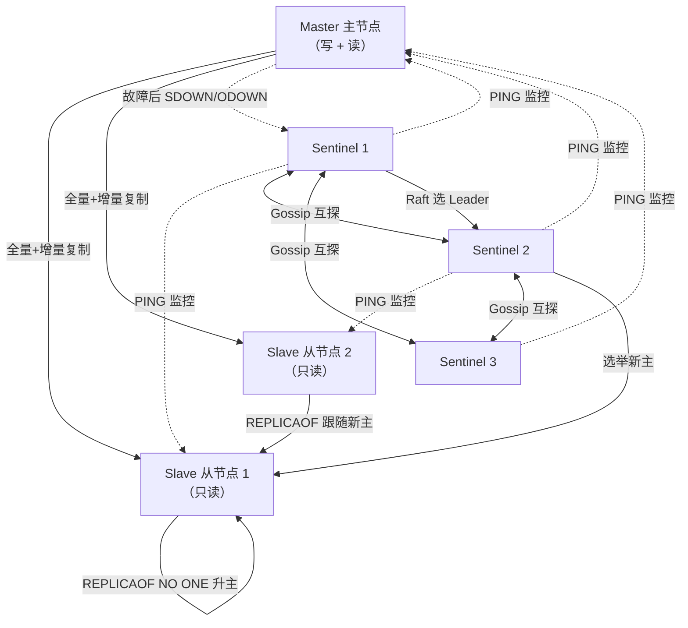
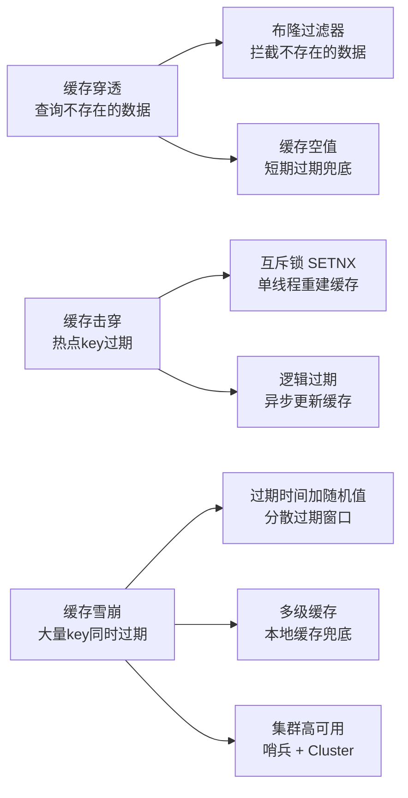

# Redis 高级特性与实战

> 学习路线对应：补充模块 -- Redis 专题
> 前置知识：Redis 数据结构基础
> 预计学习时间：2-3 天

---

## 本文目录

- [一、持久化](#一持久化)
- [二、主从复制与哨兵](#二主从复制与哨兵)
- [三、集群（Cluster）](#三集群cluster)
- [四、缓存策略（重点）](#四缓存策略重点)
- [五、内存淘汰策略](#五内存淘汰策略)
- [六、分布式锁](#六分布式锁)
- [七、常见面试题](#七常见面试题)
- [八、避坑指南](#八避坑指南)

## 一、持久化

Redis 是内存数据库，数据存储在内存中，一旦进程退出或服务器断电，所有数据将丢失。因此 Redis 提供了两种持久化机制将内存数据保存到磁盘。

### 1.1 RDB（快照持久化）

#### 核心概念

RDB（Redis Database）是将某一时刻内存中的**全量数据快照**写入磁盘的二进制文件。默认文件名为 `dump.rdb`。

#### 触发方式

**（1）手动触发**

- **SAVE**：在主线程中执行，阻塞所有客户端请求，直到 RDB 文件生成完毕。**生产环境严禁使用**。
- **BGSAVE**：Redis 调用 `fork()` 创建子进程，由子进程负责生成 RDB 文件，主进程继续处理请求。利用了 **Copy-On-Write（写时复制）**机制。

```
SAVE   → 阻塞主线程，同步生成 RDB
BGSAVE → fork 子进程，异步生成 RDB，主线程不阻塞
```

**（2）自动触发（配置文件）**

```conf
save 900 1    # 900 秒内至少 1 次修改则触发 BGSAVE
save 300 10   # 300 秒内至少 10 次修改则触发 BGSAVE
save 60 10000 # 60 秒内至少 10000 次修改则触发 BGSAVE
```

**（3）其他触发场景**

- 执行 `SHUTDOWN` 或 `FLUSHALL` 命令前会自动执行 BGSAVE
- 主从复制时，主节点执行 BGSAVE 生成 RDB 发送给从节点

#### 底层原理：Copy-On-Write

`fork()` 创建子进程时，父子进程共享同一块物理内存。只有当父进程或子进程尝试修改某页内存时，操作系统才会复制该页，保证父子进程各自拥有一份独立副本。这样既避免了全量内存复制，又保证子进程读到的数据是 `fork()` 那一刻的快照。

#### 优缺点

| 维度 | 说明 |
|------|------|
| 优点 | 文件紧凑（二进制压缩，体积小）；恢复速度快（直接加载到内存）；适合冷备份和灾难恢复 |
| 缺点 | 可能丢失最后一次快照后的数据；`fork()` 时内存占用翻倍风险（Copy-On-Write 触发的内存复制）；大数据量下 `fork()` 耗时可能阻塞主线程 |

### 1.2 AOF（追加文件持久化）

#### 核心概念

AOF（Append Only File）以**日志形式**记录每一个写操作命令，重启时通过回放 AOF 文件中的命令来恢复数据。默认文件名为 `appendonly.aof`。

#### 三种写入策略

AOF 写入分为两步：`write()` 写入内核缓冲区 → `fsync()` 刷盘。三种策略的差异在于 `fsync()` 的调用时机：

| 策略 | 行为 | 安全性 | 性能 |
|------|------|--------|------|
| **always** | 每次写命令都 `fsync` 刷盘 | 最高，最多丢一条命令 | 最低，磁盘 IO 压力大 |
| **everysec** | 每秒 `fsync` 一次（默认推荐） | 较高，最多丢 1 秒数据 | 较好，平衡之选 |
| **no** | 由操作系统决定刷盘时机 | 不可控，可能丢 30 秒数据 | 最高，但没意义 |

#### AOF 重写机制（BGREWRITEAOF）

随着时间推移，AOF 文件会越来越大，包含大量冗余命令（如多次 `SET` 同一个 key）。AOF 重写通过读取当前内存数据，生成**最小命令集**来重建 AOF 文件。

```
重写前 AOF（冗余）：
SET key "a"
SET key "b"
SET key "c"
INCR counter
INCR counter
INCR counter

重写后 AOF（精简）：
SET key "c"
SET counter 3
```

**重写流程**：
1. Redis 调用 `fork()` 创建子进程
2. 子进程遍历内存数据，生成新 AOF 文件
3. 主进程在此期间将新的写命令同时写入「AOF 重写缓冲区」
4. 子进程完成后，主进程将重写缓冲区的增量命令追加到新 AOF 文件末尾
5. 原子替换旧的 AOF 文件

#### 混合持久化（Redis 4.0+）

Redis 4.0 引入了混合持久化：AOF 文件前半部分是 RDB 格式的全量数据，后半部分是 AOF 格式的增量命令。

```conf
aof-use-rdb-preamble yes
```

**优势**：RDB 部分恢复快，AOF 部分保证数据完整性，兼顾了恢复速度和数据安全。

#### AOF 文件修复

当 AOF 文件损坏导致 Redis 无法启动时，可使用修复工具：

```bash
redis-check-aof --fix appendonly.aof
```

该命令会删除 AOF 文件中不完整的命令，使得 Redis 能够正常启动。

### 1.3 RDB vs AOF 对比选型

| 对比维度 | RDB | AOF |
|----------|-----|-----|
| 文件大小 | 小（二进制压缩） | 大（文本命令） |
| 恢复速度 | 快（直接加载到内存） | 慢（需逐条回放命令） |
| 数据安全性 | 较低（可能丢失最后一次快照后数据） | 较高（everysec 最多丢 1 秒） |
| 性能影响 | `fork()` 时可能阻塞 | 取决于写入策略，always 影响最大 |
| 可读性 | 二进制，不可读 | 文本格式，可读可编辑 |
| 运维复杂度 | 简单 | 需要管理 AOF 重写和文件大小 |

**最佳实践**：生产环境开启 **RDB + AOF 混合持久化**，既保证恢复速度，又保证数据安全性。

> **生活化类比：持久化 = 银行金库 vs 移动保险箱** —— RDB 像"定期把全部现金拍照存进银行金库"：拍照那一刻的资产是确定的（快照），但两次拍照之间收进的零钱可能丢（最后一次快照后的数据丢失）；好处是金库清单小（文件紧凑）、对账快（恢复快）。AOF 像"每收一笔钱都记进随身移动保险箱的流水账本"：账本越记越厚（文件大），但丢的钱最多一笔（everysec 最多丢 1 秒）；定期把流水账重新誊抄精简一遍（AOF 重写）。混合持久化则是"金库存全量快照 + 流水账记增量"，既快又全。生产环境用混合持久化，相当于金库 + 流水账双保险。

> 📖 **参考链接**：
> - [Redis 官方文档 - Persistence](https://redis.io/docs/management/persistence/) -- RDB/AOF/混合持久化官方完整说明
> - [Redis 官方文档 - BGSAVE](https://redis.io/commands/bgsave/) -- 后台异步生成 RDB 快照命令
> - [Redis 配置 - appendfsync](https://redis.io/docs/management/persistence/) -- AOF 刷盘策略（always/everysec/no）配置说明

---

## 二、主从复制与哨兵

### 2.1 主从复制

#### 核心概念

主从复制（Master-Slave Replication，现官方改为 Master-Replica）是指将一台 Redis 主节点的数据同步到多台从节点，实现**读写分离**和**数据冗余**。

**配置方式**：

```conf
# 方式一：配置文件
replicaof <master-ip> <master-port>

# 方式二：运行时命令
REPLICAOF <master-ip> <master-port>
```

> **生活化类比：主从复制 = 总公司向分公司汇报** —— 主节点像总公司（掌握全部经营数据），从节点像分公司（定期从总公司拷贝数据保持同步）。新分公司刚成立时，总公司把整套账本复印一份快递过去（全量复制，RDB 快照）；之后日常经营中每天的新单据，总公司通过专线实时传真给分公司（增量复制，命令传播）。如果传真线路短暂断了一下，分公司重连后只要总公司那边的"传真缓冲区"（复制积压缓冲区）还留着断线期间的单据，就只补发这部分（部分复制）；断太久缓冲区装不下，就只能重新复印整套账本（再次全量复制）。

> 📖 **参考链接**：
> - [Redis 官方文档 - Replication](https://redis.io/docs/management/replication/) -- 主从复制官方完整说明与配置
> - [Redis 官方文档 - REPLICAOF](https://redis.io/commands/replicaof/) -- REPLICAOF 命令动态设置主从关系
> - [Redis 配置 - repl-backlog-size](https://redis.io/docs/management/replication/) -- 复制积压缓冲区大小配置（影响部分复制窗口）

#### 全量复制

当从节点首次连接主节点，或主从断开时间过长导致复制积压缓冲区数据不足时，触发全量复制。

**流程**：
1. 从节点发送 `PSYNC ? -1`（表示请求全量同步）
2. 主节点收到后执行 `BGSAVE`，生成 RDB 快照
3. 主节点将 RDB 文件发送给从节点
4. 主节点将生成 RDB 期间的新写命令写入「复制积压缓冲区」
5. 从节点加载 RDB 文件后，主节点发送积压缓冲区中的增量命令
6. 从节点执行增量命令，完成同步

#### 部分复制（Redis 2.8+）

当主从短暂断开后重连，如果积压缓冲区中仍保留着断开期间的命令，则进行部分复制，避免全量复制。

**核心机制**：
- **replication offset**（复制偏移量）：标记主从数据同步的进度
- **run_id**（运行 ID）：标识主节点身份，主节点重启后 run_id 变化，从节点需全量同步
- **复制积压缓冲区**（replication backlog）：固定大小的环形缓冲区，默认 1MB

**流程**：
1. 从节点重连后发送 `PSYNC <run_id> <offset>`
2. 主节点校验 run_id 一致，且 offset 在积压缓冲区范围内
3. 主节点从 offset 位置开始发送增量命令

#### 复制风暴

**问题**：一台主节点挂载多个从节点，当主节点重启或网络波动导致所有从节点同时发起全量复制时，主节点会 fork 多个子进程生成 RDB，造成 CPU 飙高、内存占用翻倍、网络带宽打满。

**解决方案**：
- 使用**树状复制**结构：主节点 → 从节点 A → 从节点 B（从节点 A 作为中间层）
- 主节点适量配置，避免单节点挂载过多从节点
- 使用**无盘复制**（`repl-diskless-sync`）：主节点不写 RDB 文件，直接将数据流通过网络发送给从节点

```conf
repl-diskless-sync yes
```

### 2.2 哨兵（Sentinel）

#### 核心概念

哨兵是 Redis 的高可用解决方案，由一个或多个 Sentinel 节点组成，负责**监控**、**通知**和**自动故障转移**。

> **生活化类比：哨兵 = 夜间保安巡逻** —— 哨兵集群像一组夜间巡逻保安：每隔一段时间去主节点"敲门"（PING 探活）。一个保安敲门没人应，只能算他觉得这户"可能出事"（主观下线 SDOWN）；为防误判，他得叫上其他保安一起确认，当超过法定人数（quorum）的保安都敲不开门，才正式认定"出事了"（客观下线 ODOWN）。出事后保安们开紧急会议投票选出一个队长（Leader 选举，Raft），队长负责从后备人选里挑一个最能干的接班（选新主：优先级 > 偏移量 > run_id），通知其他从节点改认新主，再广播告诉所有客户"换地址了"。

#### 核心功能

| 功能 | 说明 |
|------|------|
| 监控 | 定期 PING 所有节点，检测节点是否存活 |
| 通知 | 通过 Pub/Sub 通知客户端节点状态变化 |
| 自动故障转移 | 主节点故障时，选举新主节点并完成切换 |

#### 主观下线（SDOWN）

单个 Sentinel 节点在 `down-after-milliseconds` 时间内未收到目标节点的 PONG 回复，则将该节点标记为**主观下线**（Subjectively Down）。

```conf
sentinel down-after-milliseconds mymaster 30000
```

#### 客观下线（ODOWN）

当**超过 `quorum` 个** Sentinel 都认为主节点主观下线时，该主节点被标记为**客观下线**（Objectively Down），触发故障转移。

```conf
sentinel monitor mymaster 192.168.1.100 6379 2
# quorum = 2，表示至少需要 2 个 Sentinel 同意
```

#### Leader 选举

主节点被标记为客观下线后，Sentinel 之间通过 **Raft 协议**选举一个 Leader 来执行故障转移。

**选举规则**：
1. 每个 Sentinel 投票给自己
2. 其他 Sentinel 按照「先到先得」原则投票
3. 获得半数以上（`N/2 + 1`）选票的 Sentinel 成为 Leader
4. 如果一轮未选出，超时后重新选举

#### 故障转移流程

1. **选出新主节点**：从所有健康的从节点中，按以下优先级选出新主节点：
   - 优先级最高（`replica-priority` 值最小）
   - 复制偏移量最大（数据最新）
   - run_id 最小（字典序，作为平局裁决）
2. **通知从节点**：向新主节点发送 `REPLICAOF NO ONE`，使其升级为主节点；通知其他从节点 `REPLICAOF <新主IP> <新主端口>`
3. **通知客户端**：通过 Pub/Sub 通道通知客户端更新主节点连接地址

> **主从复制 + 哨兵架构图**：下图展示了一主多从 + 哨兵集群的完整拓扑与故障转移流程，是 Redis 高可用架构的高频考点。



> 哨兵集群自身需至少 3 节点（奇数）以完成过半选举；主节点故障后哨兵判定 ODOWN → Raft 选 Leader → 挑新主 → 通知从节点与客户端，整个故障转移通常在数秒内完成。

> 📖 **参考链接**：
> - [Redis 官方文档 - Sentinel](https://redis.io/docs/management/sentinel/) -- 哨兵高可用官方完整文档
> - [Redis 官方文档 - SENTINEL monitor](https://redis.io/commands/sentinel-monitor/) -- 哨兵监控配置命令与 quorum 参数说明
> - [Redis 官方文档 - High Availability](https://redis.io/docs/management/replication/) -- Redis 高可用（主从 + 哨兵 + 集群）整体方案对比

---

## 三、集群（Cluster）

### 3.1 集群架构

#### 核心概念

Redis Cluster 是 Redis 的**分布式解决方案**，支持数据分片（Sharding）、自动故障转移和水平扩展。

#### 哈希槽（Hash Slot）

Redis Cluster 将整个键空间划分为 **16384 个哈希槽**，每个主节点负责一部分槽。

```
槽分配示例：
主节点 A：槽 0 - 5460
主节点 B：槽 5461 - 10922
主节点 C：槽 10923 - 16383
```

**槽定位算法**：

```
HASH_SLOT = CRC16(key) % 16384
```

**Hash Tag**：如果 key 中包含 `{}`，则只计算 `{}` 内的部分，确保相关 key 落在同一槽：

```
user:{1001}:name   → 计算 CRC16("1001") % 16384
user:{1001}:age    → 计算 CRC16("1001") % 16384  （同一槽）
```

#### 为什么是 16384 个槽？

1. 16384 个槽的心跳包大小约为 2KB（`16384 / 8 / 1024`），如果使用 65536 个槽，心跳包会膨胀到 8KB，增加网络开销
2. Redis 作者认为集群节点数不会超过 1000 个，16384 个槽足够均匀分布
3. 16384 是 2 的幂，位运算效率高

#### 去中心化架构（Gossip 协议）

Redis Cluster 采用**去中心化**架构，节点之间通过 **Gossip 协议**交换状态信息，无需中心节点或代理。

**Gossip 消息类型**：

| 消息 | 说明 |
|------|------|
| MEET | 邀请新节点加入集群 |
| PING | 心跳检测，携带自身和已知节点的状态 |
| PONG | 响应 PING/MEET，确认存活 |
| FAIL | 广播某个节点已故障 |

#### 客户端重定向

当客户端请求的 key 不在当前节点时，节点返回 **MOVED** 或 **ASK** 重定向。

| 重定向 | 含义 | 客户端行为 |
|--------|------|------------|
| MOVED | 槽已永久迁移到其他节点 | 更新本地槽映射缓存，请求新节点 |
| ASK | 槽正在迁移中，当前 key 已迁移 | 仅本次请求转发到新节点，不更新缓存 |

#### 集群最小节点数

集群最少需要 **3 个主节点**，因为：
- 故障检测需要半数以上主节点同意
- 只有 1 个主节点时，无法进行选举和故障转移
- 只有 2 个主节点时，任一节点故障都无法满足半数以上条件

> 📖 **参考链接**：
> - [Redis 官方文档 - Cluster](https://redis.io/docs/management/scaling/) -- Redis Cluster 集群规范与哈希槽分片官方说明
> - [Redis 官方文档 - CLUSTER MEET](https://redis.io/commands/cluster-meet/) -- 集群节点加入命令
> - [Redis 官方文档 - MOVED/ASK](https://redis.io/docs/management/scaling/) -- 客户端重定向机制说明

### 3.2 集群扩缩容

#### 新增节点

**步骤一**：将新节点加入集群

```bash
redis-cli --cluster add-node <新节点IP:端口> <任一已有节点IP:端口>
```

底层执行 `CLUSTER MEET` 命令，通过 Gossip 协议传播到所有节点。

**步骤二**：迁移槽到新节点

```bash
redis-cli --cluster reshard <目标节点IP:端口>
```

交互式指定迁移的槽数量和目标节点。

#### 下线节点

**步骤一**：迁出所有槽

```bash
redis-cli --cluster reshard <已有节点IP:端口> --cluster-from <下线节点ID> --cluster-to <接收节点ID> --cluster-slots <槽数量>
```

**步骤二**：从集群中移除节点

```bash
redis-cli --cluster del-node <任一已有节点IP:端口> <下线节点ID>
```

底层执行 `CLUSTER FORGET` 命令。

#### 在线迁移槽（MIGRATE）

单个 key 的迁移使用 `MIGRATE` 命令，这是一个**原子操作**：在源节点删除 key 的同时，在目标节点创建 key。

```bash
MIGRATE <target-ip> <target-port> <key> 0 <timeout>
```

---

## 四、缓存策略（重点）

### 4.1 缓存穿透

#### 问题描述

查询一个**数据库中不存在的数据**，由于缓存也不会存储该 key，每次请求都会穿透缓存直接打到数据库。恶意攻击者可以通过构造大量不存在的 key 来击垮数据库。

```
请求 → 缓存（miss） → 数据库（查不到） → 返回 null
      ↑________________________________________↓
              下一次请求仍然重复上述流程
```

#### 解决方案

**（1）布隆过滤器（Bloom Filter）**

布隆过滤器是一个很长的二进制位数组和一系列哈希函数，用于判断一个元素**是否可能存在**于集合中。

- **特性**：不存在的一定不存在，存在的可能误判（假阳性）
- **误判率**：与位数组大小和哈希函数数量有关，通常可控制在 1% 以内

```java
// 使用 Redisson 的布隆过滤器
RBloomFilter<String> bloomFilter = redisson.getBloomFilter("userFilter");
// 初始化：预计元素数量 100000，误判率 0.01
bloomFilter.tryInit(100000L, 0.01);
bloomFilter.add("user:1001");

// 查询前先判断
if (!bloomFilter.contains("user:9999")) {
    return null; // 一定不存在，直接返回
}
```

**（2）缓存空值**

当查询数据库返回 null 时，将空值也缓存起来，设置**较短的过期时间**（如 5 分钟）。

```java
String value = redis.get(key);
if (value != null) {
    return "null".equals(value) ? null : value;
}
value = db.query(key);
if (value == null) {
    redis.setex(key, 300, "null"); // 缓存空值，5 分钟过期
} else {
    redis.set(key, value);
}
```

**风险**：恶意攻击者构造大量不同 key 时，缓存中会堆积大量空值，占用内存。需配合参数校验和布隆过滤器使用。

### 4.2 缓存击穿

#### 问题描述

某个**热点 key** 过期瞬间，大量并发请求同时查询该 key，由于缓存失效，所有请求直接打到数据库，可能压垮数据库。

```
热点 key 过期
  → 请求 1 查缓存 miss → 查数据库
  → 请求 2 查缓存 miss → 查数据库
  → 请求 3 查缓存 miss → 查数据库
  → ...（全部打到数据库）
```

#### 解决方案

**（1）互斥锁（SETNX）**

第一个请求获取锁去重建缓存，其他请求等待后重试读缓存。

```java
public String getWithLock(String key) {
    String value = redis.get(key);
    if (value != null) return value;

    // 尝试获取锁
    String lockKey = "lock:" + key;
    boolean locked = redis.setnx(lockKey, "1", 10); // 10 秒过期
    if (locked) {
        try {
            // 双重检查
            value = redis.get(key);
            if (value != null) return value;

            value = db.query(key);
            redis.setex(key, 3600, value);
        } finally {
            redis.del(lockKey);
        }
    } else {
        // 未获取到锁，休眠后重试
        Thread.sleep(50);
        return getWithLock(key); // 递归重试
    }
    return value;
}
```

**（2）逻辑过期（永不过期）**

缓存 key 不设置过期时间，在 value 中存储逻辑过期时间。读取时判断是否过期，若过期则先返回旧值，再异步更新缓存。

```java
@Data
class CacheData {
    private Object data;
    private long expireAt; // 逻辑过期时间戳
}

public Object getWithLogicalExpire(String key) {
    CacheData cacheData = redis.get(key);
    if (cacheData == null) return null;

    // 未过期，直接返回
    if (System.currentTimeMillis() < cacheData.getExpireAt()) {
        return cacheData.getData();
    }

    // 已过期，尝试获取锁进行异步更新
    String lockKey = "lock:" + key;
    if (redis.setnx(lockKey, "1", 10)) {
        // 提交异步任务更新缓存
        threadPool.execute(() -> {
            Object newData = db.query(key);
            CacheData newCacheData = new CacheData(newData,
                System.currentTimeMillis() + 3600 * 1000);
            redis.set(key, newCacheData);
            redis.del(lockKey);
        });
    }
    // 返回旧值（兜底）
    return cacheData.getData();
}
```

### 4.3 缓存雪崩

#### 问题描述

**大量 key 同时过期**或 **Redis 集群宕机**，导致所有请求直接打到数据库，造成数据库瞬间压力过大，严重时导致数据库宕机。

#### 解决方案

**（1）过期时间加随机值**

在基础过期时间上增加随机偏移，避免大量 key 同时过期。

```java
int baseExpire = 3600; // 基础 1 小时
int randomExpire = new Random().nextInt(600); // 随机 0-10 分钟
redis.setex(key, baseExpire + randomExpire, value);
```

**（2）Redis 集群高可用**

- 主从复制 + 哨兵：单节点故障时自动切换，避免单点故障
- Redis Cluster：数据分片，单个节点故障只影响部分数据

**（3）服务限流降级**

当缓存不可用时，对数据库请求进行限流，返回默认值或友好提示。

```java
// 使用 Sentinel 限流
if (!rateLimiter.tryAcquire()) {
    return "系统繁忙，请稍后再试";
}
```

### 4.4 缓存一致性

#### Cache Aside 模式（最常用）

**读流程**：先查缓存，miss 则查数据库并写入缓存。
**写流程**：先更新数据库，再**删除缓存**（而非更新缓存）。

```
读：缓存命中 → 返回
    缓存 miss → 查数据库 → 写入缓存 → 返回

写：更新数据库 → 删除缓存
```

#### 为什么是删除缓存而不是更新缓存？

- 并发写时，两个写操作可能以错误的顺序更新缓存（ABA 问题），导致缓存中存储的是旧值
- 删除缓存后，下次读请求会重新加载最新数据，天然避免了并发问题
- 很多缓存值可能由多个表的数据聚合而成，直接更新缓存成本高

#### 延迟双删

解决并发读写导致的脏数据问题：

```
删除缓存 → 更新数据库 → 延迟 N 毫秒 → 再次删除缓存
```

第二次删除是为了清除在「更新数据库」期间，其他线程读到旧数据并写入缓存的脏数据。

```java
public void updateWithDoubleDelete(String key, Object newValue) {
    redis.del(key);                    // 第一次删除
    db.update(key, newValue);          // 更新数据库
    Thread.sleep(100);                 // 延迟（根据业务评估）
    redis.del(key);                    // 第二次删除
}
```

#### 订阅 MySQL Binlog（最终一致性）

通过 Canal 等工具订阅 MySQL 的 binlog，解析出数据变更事件，异步更新或删除缓存，实现最终一致性。

```
MySQL 数据变更 → binlog → Canal 解析 → 消息队列 → 缓存更新服务
```

**优势**：业务代码无侵入，缓存更新逻辑与业务逻辑解耦。
**劣势**：存在延迟，属于最终一致性，不适用于强一致性场景。

---

> **缓存三大问题对比解决方案**：下图清晰展示了缓存穿透、击穿、雪崩三种问题的区别及对应的核心解决方案，是面试和实际架构设计中的高频知识点。



> 缓存穿透本质是过滤无效请求，缓存击穿核心是保护热点数据重建过程，缓存雪崩关键是将集中失效风险分散化。三者需要组合使用才能构建健壮的缓存体系。

---

## 五、内存淘汰策略

当 Redis 内存使用达到 `maxmemory` 限制时，根据配置的淘汰策略决定如何处理新写入请求。

### 八种淘汰策略详解

| 策略 | 行为 | 适用场景 |
|------|------|----------|
| **noeviction**（默认） | 不淘汰任何 key，写入时返回错误 | 不允许数据丢失的严格场景 |
| **allkeys-lru** | 从所有 key 中淘汰最近最少使用的 | 通用缓存场景，最常用 |
| **volatile-lru** | 从设置了过期时间的 key 中淘汰最近最少使用的 | 部分 key 需持久化，部分可淘汰 |
| **allkeys-lfu**（4.0+） | 从所有 key 中淘汰访问频率最低的 | 需要避免偶发性访问干扰的场景 |
| **volatile-lfu**（4.0+） | 从设置了过期时间的 key 中淘汰访问频率最低的 | 同上 + 部分 key 需持久化 |
| **allkeys-random** | 从所有 key 中随机淘汰 | 数据访问模式均匀的场景 |
| **volatile-random** | 从设置了过期时间的 key 中随机淘汰 | 同上 + 部分 key 需持久化 |
| **volatile-ttl** | 从设置了过期时间的 key 中淘汰最接近过期的 | 希望优先淘汰即将过期的 key |

### LRU（Least Recently Used）

**Redis 近似 LRU**：不是精确 LRU（需要维护链表，内存开销大），而是随机抽样 N 个 key（默认 5 个），淘汰其中最久未使用的。

```conf
maxmemory-policy allkeys-lru
maxmemory-samples 5  # 抽样数量，越大越接近精确 LRU，但 CPU 开销越大
```

### LFU（Least Frequently Used，Redis 4.0+）

LFU 根据 key 的**访问频率**淘汰，解决 LRU 的「偶发性访问」问题。例如，一个 key 只在昨天被访问 1000 次，今天没被访问过，LRU 可能保留它，而 LFU 会淘汰它。

LFU 使用 Redis 对象头中的 24 位来记录访问频率：
- 高 16 位：上次访问时间（分钟级）
- 低 8 位：对数计数器（访问频率），随时间衰减

```conf
maxmemory-policy allkeys-lfu
lfu-log-factor 10    # 计数器增长因子，越大增长越慢
lfu-decay-time 1     # 衰减周期（分钟），越大衰减越慢
```

---

## 六、分布式锁

> **生活化类比：** 分布式锁就像公共厕所的门锁。你进去后把门锁上（`SET NX`，只有没人用时才能锁上），别人看到门锁着就在外面排队等候。但万一你在里面晕倒了怎么办？所以门锁设计了自动超时机制（`EX 30`，30秒后自动解锁），防止你"永远"不出来（死锁）。出来时你得确认是自己锁的门（解锁时用 UUID 校验），不能把别人的门锁给开了。Redisson 的看门狗机制就像管理员每隔一段时间过来敲敲门："你还在里面吗？"（续期），确保你不会因为超时被"破门而入"。

### 6.1 单机 Redis 分布式锁

#### 加锁

使用 `SET key value NX EX 30` 原子操作加锁：

```bash
SET lock:order:1001 <uuid> NX EX 30
```

- `NX`：仅当 key 不存在时设置（Not eXists）
- `EX 30`：30 秒后自动过期（防止死锁）
- `value`：使用 UUID 作为唯一标识，防止误删别人的锁

#### 解锁

解锁必须使用 **Lua 脚本**保证原子性：先判断 value 是否是自己加的锁，再删除。

```lua
-- 先 GET 判断，再 DEL，原子操作
if redis.call("GET", KEYS[1]) == ARGV[1] then
    return redis.call("DEL", KEYS[1])
else
    return 0
end
```

**为什么不能直接用 DEL？** 如果锁已过期被其他线程获取，直接 DEL 会误删别人的锁。

#### 锁续期（Redisson Watchdog 看门狗）

如果业务执行时间超过锁的过期时间，锁会自动释放，导致并发安全问题。Redisson 的 **Watchdog** 机制会定期检查并续期。

**工作原理**：
1. 加锁时默认过期时间 30 秒
2. 每 10 秒（`过期时间 / 3`）检查一次
3. 如果锁仍被当前线程持有，将过期时间续期到 30 秒
4. 业务完成后显式解锁，取消续期任务

```java
RLock lock = redisson.getLock("lock:order:1001");
lock.lock(); // 默认 30 秒过期，Watchdog 自动续期
try {
    // 业务逻辑
} finally {
    lock.unlock();
}
```

#### 可重入锁

Redisson 的 RLock 基于 Redis **Hash 结构**实现可重入：

```
key   = lock:order:1001
field = 线程 ID（或 UUID）
value = 重入次数
```

加锁时 `HINCRBY` 递增，解锁时 `HINCRBY -1`，当 value 为 0 时删除 key。

```java
lock.lock();
lock.lock(); // 同一线程再次加锁，重入计数 +1
lock.unlock();
lock.unlock(); // 计数归零，释放锁
```

### 6.2 Redlock 算法（多节点分布式锁）

#### 原理

在 N 个独立 Redis 节点上依次获取锁，半数以上成功且总耗时小于锁有效期，即获取成功。

**加锁流程**：
1. 获取当前时间戳
2. 依次向 N 个 Redis 节点获取锁（SET NX EX），每个节点超时时间远小于锁有效期
3. 计算获取锁的总耗时 = 当前时间 - 步骤 1 的时间
4. 如果获取成功的节点数 >= N/2 + 1，且总耗时 < 锁有效期，则获取成功
5. 如果获取失败，向所有节点发送解锁请求

#### 争议

Martin Kleppmann 指出 Redlock 在极端情况下存在安全性问题：
- **时钟跳跃**：如果某个 Redis 节点时钟向前跳跃，会导致锁提前过期
- **GC 停顿**：客户端 GC 停顿可能超过锁有效期，导致锁在不知情的情况下过期

#### 实践建议

大部分场景下，**单机 Redis + 哨兵高可用**已足够满足分布式锁需求。只有在需要极高安全性且能接受复杂性的场景下，才考虑 Redlock。

---

## 七、常见面试题

### 1. RDB 和 AOF 的区别？如何选择持久化策略？

**RDB**：定时快照持久化，生成二进制文件。优点是文件小、恢复快，缺点是可能丢失最后一次快照后的数据，大数据量时 `fork()` 耗时长。

**AOF**：追加写命令日志，支持三种写入策略（always/everysec/no）。优点是数据安全性高，缺点是文件大、恢复慢。

**选择策略**：生产环境推荐 **RDB + AOF 混合持久化**（Redis 4.0+）。RDB 部分保证恢复速度，AOF 部分保证数据完整性。如果对数据丢失容忍度较高，可只用 RDB；如果数据不能丢失，建议 AOF 配合 everysec。

### 2. 哨兵模式的故障转移流程是怎样的？

1. **SDOWN**：单个 Sentinel 在 `down-after-milliseconds` 时间内未收到主节点 PONG 回复，标记主观下线
2. **ODOWN**：超过 `quorum` 个 Sentinel 都认为主节点主观下线，标记客观下线
3. **Leader 选举**：Sentinel 之间通过 Raft 协议选举 Leader 执行故障转移
4. **选出新主节点**：从健康的从节点中选出优先级最高、复制偏移最大、run_id 最小的节点作为新主节点
5. **通知从节点**：其他从节点执行 `REPLICAOF` 指向新主节点
6. **通知客户端**：通过 Pub/Sub 通知客户端更新主节点连接地址

### 3. 缓存穿透、缓存击穿、缓存雪崩分别是什么？如何解决？

| 问题 | 定义 | 核心解决方案 |
|------|------|-------------|
| 缓存穿透 | 查询不存在的数据，缓存和数据库都查不到 | 布隆过滤器 + 缓存空值 |
| 缓存击穿 | 热点 key 过期瞬间，大量并发打到数据库 | 互斥锁（SETNX）+ 逻辑过期 |
| 缓存雪崩 | 大量 key 同时过期或 Redis 宕机 | 过期时间加随机值 + 集群高可用 + 限流降级 |

### 4. Redis 分布式锁如何实现？Redisson 的看门狗机制是什么？

**加锁**：`SET key UUID NX EX 30`，原子操作，value 为唯一标识防止误删。

**解锁**：Lua 脚本先 GET 判断 value 再 DEL，保证原子性。

**看门狗**：Redisson 默认锁过期时间 30 秒，每 10 秒自动检查并续期到 30 秒，防止业务执行时间过长导致锁提前释放。业务完成后显式解锁时取消续期。

**可重入**：基于 Redis Hash，field 为线程 ID，value 为重入次数，HINCRBY 递增，减到 0 时删除。

### 5. Redis 集群的哈希槽是什么？为什么是 16384 个？

**哈希槽**：Redis Cluster 将键空间划分为 16384 个槽，每个主节点负责一部分槽。通过 `CRC16(key) % 16384` 定位 key 所属槽。

**为什么是 16384**：
1. 心跳包大小适中（约 2KB），65536 个槽会导致心跳包膨胀到 8KB
2. Redis 作者认为集群节点数不会超过 1000 个，16384 足够均匀分布
3. 16384 是 2 的幂，位运算效率高

---

## 八、避坑指南

| 常见错误 | 现象 | 原因 | 解决方案 |
|---------|------|------|---------|
| 用 Redis 做消息队列 | 消费者宕机后消息丢失 | Redis List/Pub/Sub 缺少 ACK 机制 | 简单场景使用 Redis Stream（5.0+）；复杂场景使用 Kafka/RabbitMQ |
| 生产环境使用 KEYS/FLUSHALL/FLUSHDB | 服务长时间不可用 | KEYS 遍历所有 key 阻塞主线程；FLUSHALL 后果不可逆 | 使用 SCAN 渐进式遍历；通过 rename-command 禁用危险命令 |
| 所有从节点挂到一个主节点 | 主节点输出缓冲区压力大，复制风暴 | 单个主节点挂载过多从节点 | 使用树状复制结构分散压力 |
| 集群模式下跨槽批量操作 | 报错 CROSSSLOT Keys in request don't hash to the same slot | MGET/MSET/DEL 等要求所有 key 在同一槽 | 使用 Hash Tag：`order:{1001}:status` 确保同一槽 |
| 误以为 Redis 事务支持回滚 | 运行时错误不触发回滚，其他命令继续执行 | Redis 事务不支持回滚，运行时错误不影响其他命令 | 在开发阶段充分测试，避免运行时错误 |
| 大 Key 和热 Key 未处理 | 网络阻塞、DEL 阻塞、主从复制延迟；单节点 CPU 过载 | 大 Key（value > 10KB 或集合 > 10000 元素）；热 Key（QPS 过高） | 拆分大 Key、UNLINK 异步删除；本地缓存 + 多副本分散热 Key |
| 未配置 maxmemory 和淘汰策略 | Redis 耗尽服务器内存，触发 OOM Killer | 未设置内存上限和淘汰策略 | 设置 `maxmemory 4gb` 和 `maxmemory-policy allkeys-lru` |

---

> 下一篇预告：[03-Redis笔面试题集](./03-Redis笔面试题集.md) -- 精选 20 道选择题 + 10 道简答题 + 5 道场景设计题，覆盖国企/互联网常见笔面试考点。

---

> **学习导航**：
> - 返回 [学习路线总览](../../README.md)
> - 本模块其他文件：[03-Redis笔面试题集](./03-Redis笔面试题集.md)
> - 实战应用：[电商订单实时统计分析平台](../../extensions/project/01-电商订单实时统计分析平台.md)


