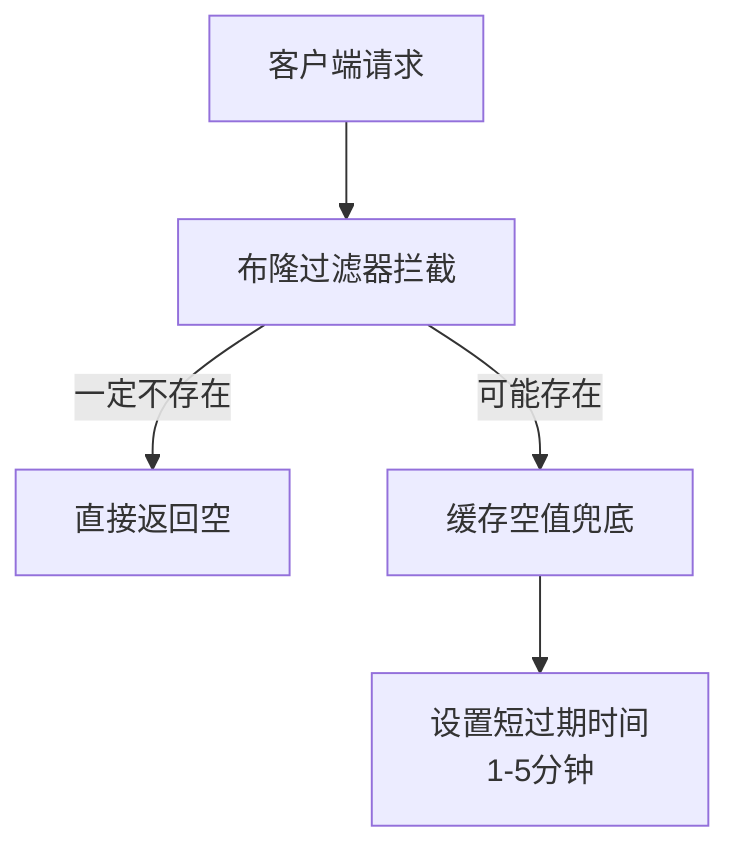
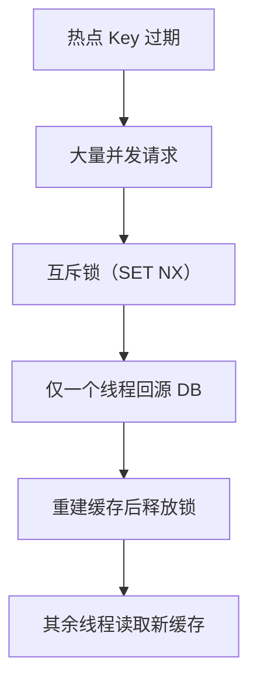
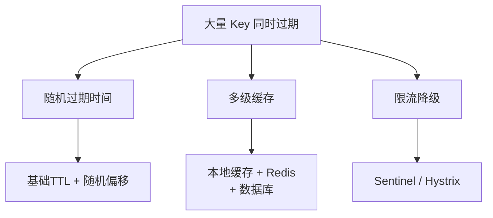

# Redis - 综合场景串联

---

## 场景一：用 Redis 实现秒杀系统

### 场景描述
电商秒杀活动中，大量用户同时抢购限量商品。系统需要在极高并发下保证库存扣减不超卖、下单流程异步解耦、防止恶意刷单，同时提供兜底降级方案。

### 涉及知识点
- [Redis 核心数据结构与底层原理](./01-Redis核心数据结构与底层原理.md)：String 类型的 SET/GET/DECR 原子操作、Lua 脚本原子性
- [Redis 高级特性与实战](./02-Redis高级特性与实战.md)：分布式锁、缓存预热、Pipeline 批量操作
- [Redis 笔面试题集](./03-Redis笔面试题集.md)：Lua 原子扣减库存、消息队列异步下单、限流防刷

### 协作流程
1. 缓存预热：秒杀开始前，将商品库存加载到 Redis（`SET stock:productId <totalStock>`），避免秒杀开始时缓存未命中。
2. 原子扣减库存：使用 Lua 脚本封装 GET 判断库存 > 0 后 DECR 扣减，保证"判断+扣减"的原子性，杜绝超卖。
3. 消息队列异步下单：扣减库存成功后，将下单请求写入 Kafka/RabbitMQ 消息队列，异步处理订单创建、支付等后续流程，实现削峰填谷。
4. 限流防刷：在网关层或业务层对单用户 QPS 进行限流，配合前端按钮防重复点击和验证码校验，防止脚本刷单。
5. 兜底降级：Redis 故障时降级为数据库直接扣减库存，虽然性能下降但能保证系统可用性。

### 关键要点
- 库存扣减必须用 Lua 脚本保证原子性，不能分两步执行 GET 和 DECR
- 异步下单借助消息队列解耦，避免秒杀请求直接冲击数据库
- 限流在网关层实现，保护后端服务不被突发流量打垮
- 兜底方案是保障高可用的最后防线

---

## 场景二：用 Redis 实现分布式锁

### 场景描述
在分布式系统中，多个服务实例需要互斥地访问共享资源（如订单状态更新、库存扣减）。需要使用分布式锁保证同一时刻只有一个实例执行关键操作，同时要防止死锁、误删锁和锁过期问题。

### 涉及知识点
- [Redis 核心数据结构与底层原理](./01-Redis核心数据结构与底层原理.md)：String 类型的 SET NX EX 原子操作
- [Redis 高级特性与实战](./02-Redis高级特性与实战.md)：分布式锁实现、Redisson Watchdog 看门狗、可重入锁、Redlock 算法
- [Redis 笔面试题集](./03-Redis笔面试题集.md)：Lua 脚本解锁、锁续期机制

### 协作流程
1. 加锁：使用 `SET key UUID NX EX 30` 原子操作，NX 保证互斥，EX 设置 30 秒过期防止死锁，value 用 UUID 标识持有者。
2. 执行业务逻辑：获取锁后执行关键代码，业务执行时间应尽量短。
3. 解锁：使用 Lua 脚本先 GET 判断 value 是否为自己设置的 UUID，确认后再 DEL 删除，保证"判断+删除"的原子性，防止误删他人持有的锁。
4. 锁续期：Redisson 的 Watchdog 看门狗默认每 10 秒（过期时间 / 3）检查一次，如果锁仍被当前线程持有则续期到 30 秒，防止业务执行超时导致锁提前释放。
5. 可重入支持：基于 Redis Hash 结构实现，field 为线程 ID，value 为重入次数，加锁时 HINCRBY 递增，解锁时递减到 0 删除 key。

### 关键要点
- 加锁 value 必须用唯一标识（UUID），防止误删他人的锁
- 解锁必须用 Lua 脚本保证原子性，不能直接 DEL
- 锁过期时间要合理设置，既要防止死锁，又要给业务足够的执行时间
- Watchdog 续期机制是解决业务超时导致锁提前释放的关键
- 大部分场景单机 Redis + 哨兵高可用已足够，Redlock 仅在极高安全性要求时考虑

---

## 场景三：缓存穿透、缓存击穿、缓存雪崩解决方案

### 场景描述
在高并发场景下，缓存层面临三大经典问题：缓存穿透（查询不存在的数据穿透到数据库）、缓存击穿（热点数据过期瞬间大量请求打到数据库）、缓存雪崩（大量缓存同时过期导致数据库压力骤增）。需要针对每种问题设计对应的解决方案，保障系统稳定运行。

### 涉及知识点
- [Redis 核心数据结构与底层原理](./01-Redis核心数据结构与底层原理.md)：String/Hash 类型操作、SET NX EX 原子操作、过期策略
- [Redis 高级特性与实战](./02-Redis高级特性与实战.md)：布隆过滤器（Bloom Filter）、互斥锁（Mutex Lock）、缓存预热、Pipeline 批量操作
- [Redis 笔面试题集](./03-Redis笔面试题集.md)：缓存三大问题、Lua 脚本、分布式锁

### 协作流程
1. 缓存穿透：使用布隆过滤器在缓存层之前拦截不存在的数据查询，配合缓存空值（短过期时间）作为兜底
2. 缓存击穿：使用互斥锁（SET NX）保证同一时刻只有一个线程去数据库加载热点数据，其余线程等待
3. 缓存雪崩：设置随机过期时间（基础过期时间 + 随机偏移），避免大量缓存同时过期；配合缓存预热、多级缓存、限流降级

### 关键要点
- 布隆过滤器存在误判率（不存在的一定不存在，存在的可能不存在），需根据业务容忍度调整参数
- 互斥锁务必设置过期时间并实现锁续期，防止死锁
- 随机过期时间不能完全避免雪崩，还需要配合限流降级和多级缓存
- 缓存空值需设置短过期时间（1-5分钟），避免占用过多内存

**方案一：缓存穿透**

缓存穿透是指查询不存在的数据，请求穿透缓存层直接打到数据库。解决方案：布隆过滤器前置拦截 + 缓存空值兜底。



**方案二：缓存击穿**

缓存击穿是指热点 Key 过期瞬间，大量并发请求直接打到数据库。解决方案：互斥锁保证单线程回源。



**方案三：缓存雪崩**

缓存雪崩是指大量 Key 同时过期，导致数据库压力骤增。解决方案：随机过期时间 + 多级缓存 + 限流降级。



> 上图对比展示了缓存穿透、缓存击穿和缓存雪崩三种问题的解决方案：穿透通过布隆过滤器前置拦截、击穿通过互斥锁保证单线程回源、雪崩通过随机过期时间和多级缓存分散压力。三种方案可组合使用，构建健壮的缓存防护体系。

### 完整示例代码

#### 步骤一：布隆过滤器工具类（Guava 实现）

```java
package com.example.demo.cache;

import com.google.common.hash.BloomFilter;
import com.google.common.hash.Funnels;
import lombok.extern.slf4j.Slf4j;
import org.springframework.stereotype.Component;

import jakarta.annotation.PostConstruct;
import java.nio.charset.StandardCharsets;

/**
 * 布隆过滤器 — 用于缓存穿透防护
 * 在查询缓存前先判断 key 是否可能存在，拦截不存在的 key
 */
@Slf4j
@Component
public class BloomFilterHelper {

    /**
     * 预期插入数量：1000 万
     * 误判率：0.01（1%）
     * 预估内存：约 120MB
     */
    private static final int EXPECTED_INSERTIONS = 10_000_000;
    private static final double FPP = 0.01;

    private BloomFilter<String> bloomFilter;

    @PostConstruct
    public void init() {
        bloomFilter = BloomFilter.create(
                Funnels.stringFunnel(StandardCharsets.UTF_8),
                EXPECTED_INSERTIONS,
                FPP
        );
        log.info("布隆过滤器初始化完成，预期容量: {}, 误判率: {}", EXPECTED_INSERTIONS, FPP);
    }

    /**
     * 将 key 添加到布隆过滤器（数据写入数据库时调用）
     */
    public void add(String key) {
        bloomFilter.put(key);
    }

    /**
     * 批量添加（缓存预热时使用）
     */
    public void addAll(Iterable<String> keys) {
        keys.forEach(bloomFilter::put);
    }

    /**
     * 判断 key 是否可能存在
     * @return true = 可能存在，false = 一定不存在
     */
    public boolean mightContain(String key) {
        return bloomFilter.mightContain(key);
    }
}
```

#### 步骤二：缓存穿透解决方案（布隆过滤器 + 缓存空值）

```java
package com.example.demo.service;

import com.example.demo.cache.BloomFilterHelper;
import com.example.demo.entity.Product;
import com.example.demo.mapper.ProductMapper;
import com.fasterxml.jackson.core.JsonProcessingException;
import com.fasterxml.jackson.databind.ObjectMapper;
import lombok.RequiredArgsConstructor;
import lombok.extern.slf4j.Slf4j;
import org.springframework.data.redis.core.StringRedisTemplate;
import org.springframework.stereotype.Service;

import java.util.concurrent.TimeUnit;

/**
 * 商品查询 Service — 缓存穿透防护
 * 策略：布隆过滤器（前置拦截） + 缓存空值（兜底）
 */
@Slf4j
@Service
@RequiredArgsConstructor
public class ProductCacheService {

    private final StringRedisTemplate redisTemplate;
    private final ProductMapper productMapper;
    private final BloomFilterHelper bloomFilterHelper;
    private final ObjectMapper objectMapper;

    private static final String CACHE_PREFIX = "product:";
    private static final long CACHE_TTL = 30;              // 正常缓存 30 分钟
    private static final long EMPTY_CACHE_TTL = 3;         // 空值缓存 3 分钟

    /**
     * 根据 ID 查询商品（带缓存穿透防护）
     */
    public Product getProductById(Long productId) {
        String cacheKey = CACHE_PREFIX + productId;

        // ========== 第一层：布隆过滤器拦截 ==========
        if (!bloomFilterHelper.mightContain(cacheKey)) {
            log.info("布隆过滤器拦截: productId={}", productId);
            return null; // 直接返回，不查询缓存和数据库
        }

        // ========== 第二层：查询 Redis 缓存 ==========
        String cachedJson = redisTemplate.opsForValue().get(cacheKey);
        if (cachedJson != null) {
            // 命中空值标记（说明之前查过但不存在）
            if ("__NULL__".equals(cachedJson)) {
                log.info("命中空值缓存: productId={}", productId);
                return null;
            }
            // 命中正常缓存
            try {
                log.info("命中缓存: productId={}", productId);
                return objectMapper.readValue(cachedJson, Product.class);
            } catch (JsonProcessingException e) {
                log.error("缓存反序列化失败: productId={}", productId, e);
                // 删除脏缓存
                redisTemplate.delete(cacheKey);
            }
        }

        // ========== 第三层：查询数据库 ==========
        log.info("缓存未命中，查询数据库: productId={}", productId);
        Product product = productMapper.selectById(productId);

        if (product != null) {
            // 数据库有数据 — 写入缓存 + 更新布隆过滤器
            try {
                redisTemplate.opsForValue().set(
                        cacheKey,
                        objectMapper.writeValueAsString(product),
                        CACHE_TTL,
                        TimeUnit.MINUTES
                );
            } catch (JsonProcessingException e) {
                log.error("缓存序列化失败: productId={}", productId, e);
            }
        } else {
            // 数据库无数据 — 写入空值缓存（防止穿透）
            redisTemplate.opsForValue().set(
                    cacheKey,
                    "__NULL__",
                    EMPTY_CACHE_TTL,
                    TimeUnit.MINUTES
            );
            log.info("写入空值缓存: productId={}, TTL={}分钟", productId, EMPTY_CACHE_TTL);
        }

        return product;
    }
}
```

#### 步骤三：缓存击穿解决方案（互斥锁 + 逻辑过期）

```java
package com.example.demo.service;

import com.example.demo.entity.Product;
import com.example.demo.mapper.ProductMapper;
import com.fasterxml.jackson.databind.ObjectMapper;
import lombok.RequiredArgsConstructor;
import lombok.extern.slf4j.Slf4j;
import org.springframework.data.redis.core.StringRedisTemplate;
import org.springframework.data.redis.core.script.DefaultRedisScript;
import org.springframework.stereotype.Service;

import java.util.Collections;
import java.util.concurrent.TimeUnit;

/**
 * 热点商品查询 Service — 缓存击穿防护
 * 策略：互斥锁（SET NX）+ 逻辑过期（不设物理过期，用逻辑过期时间判断）
 */
@Slf4j
@Service
@RequiredArgsConstructor
public class HotProductService {

    private final StringRedisTemplate redisTemplate;
    private final ProductMapper productMapper;
    private final ObjectMapper objectMapper;

    private static final String CACHE_PREFIX = "hot:product:";
    private static final String LOCK_PREFIX = "lock:product:";
    private static final long LOCK_TTL = 10;    // 锁过期时间 10 秒
    private static final long RETRY_INTERVAL = 100; // 重试间隔 100ms

    /**
     * 互斥锁方案：查询热点商品
     * 同一时刻只有一个线程去数据库加载数据，其余线程等待或返回旧值
     */
    public Product getHotProduct(Long productId) {
        String cacheKey = CACHE_PREFIX + productId;
        String lockKey = LOCK_PREFIX + productId;

        // ========== 1. 先查缓存 ==========
        String cachedJson = redisTemplate.opsForValue().get(cacheKey);
        if (cachedJson != null) {
            try {
                return objectMapper.readValue(cachedJson, Product.class);
            } catch (Exception e) {
                log.error("缓存反序列化失败: productId={}", productId, e);
            }
        }

        // ========== 2. 缓存未命中，尝试获取互斥锁 ==========
        String lockValue = String.valueOf(Thread.currentThread().getId());
        boolean locked = tryLock(lockKey, lockValue, LOCK_TTL);

        if (locked) {
            // ========== 3. 获取锁成功 — 加载数据库 ==========
            try {
                // 双重检查：再次查询缓存（可能其他线程已加载）
                cachedJson = redisTemplate.opsForValue().get(cacheKey);
                if (cachedJson != null) {
                    try {
                        return objectMapper.readValue(cachedJson, Product.class);
                    } catch (Exception e) {
                        log.error("二次缓存检查反序列化失败", e);
                    }
                }

                // 查询数据库
                Product product = productMapper.selectById(productId);
                if (product != null) {
                    // 写入缓存，设置过期时间（随机偏移防止雪崩）
                    long ttl = 30 + (long) (Math.random() * 10); // 30~40分钟
                    redisTemplate.opsForValue().set(
                            cacheKey,
                            objectMapper.writeValueAsString(product),
                            ttl,
                            TimeUnit.MINUTES
                    );
                    log.info("热点数据已加载到缓存: productId={}, TTL={}分钟", productId, ttl);
                }
                return product;
            } catch (Exception e) {
                log.error("加载热点数据失败: productId={}", productId, e);
                return null;
            } finally {
                // 释放锁（使用 Lua 脚本保证原子性）
                unlock(lockKey, lockValue);
            }
        } else {
            // ========== 4. 获取锁失败 — 等待重试 ==========
            log.info("获取锁失败，等待重试: productId={}", productId);
            try {
                Thread.sleep(RETRY_INTERVAL);
            } catch (InterruptedException e) {
                Thread.currentThread().interrupt();
            }
            // 递归重试（生产环境建议限制重试次数）
            return getHotProduct(productId);
        }
    }

    /**
     * 尝试获取分布式锁
     */
    private boolean tryLock(String key, String value, long expireSeconds) {
        Boolean result = redisTemplate.opsForValue()
                .setIfAbsent(key, value, expireSeconds, TimeUnit.SECONDS);
        return Boolean.TRUE.equals(result);
    }

    /**
     * 释放分布式锁（Lua 脚本保证原子性）
     */
    private void unlock(String key, String value) {
        String luaScript =
                "if redis.call('get', KEYS[1]) == ARGV[1] then " +
                "   return redis.call('del', KEYS[1]) " +
                "else " +
                "   return 0 " +
                "end";
        DefaultRedisScript<Long> script = new DefaultRedisScript<>(luaScript, Long.class);
        redisTemplate.execute(script, Collections.singletonList(key), value);
    }
}
```

#### 步骤四：缓存雪崩解决方案（随机过期时间 + 缓存预热 + 多级缓存）

```java
package com.example.demo.service;

import com.example.demo.entity.Product;
import com.example.demo.mapper.ProductMapper;
import com.fasterxml.jackson.core.JsonProcessingException;
import com.fasterxml.jackson.databind.ObjectMapper;
import lombok.RequiredArgsConstructor;
import lombok.extern.slf4j.Slf4j;
import org.springframework.data.redis.core.StringRedisTemplate;
import org.springframework.stereotype.Service;

import jakarta.annotation.PostConstruct;
import java.util.List;
import java.util.concurrent.TimeUnit;

/**
 * 缓存雪崩防护 Service
 * 策略：
 * 1. 随机过期时间 — 避免大量缓存同时过期
 * 2. 缓存预热 — 系统启动时预加载热点数据
 * 3. 限流降级 — 配合 Sentinel/Resilience4j 实现
 */
@Slf4j
@Service
@RequiredArgsConstructor
public class CacheAvalancheService {

    private final StringRedisTemplate redisTemplate;
    private final ProductMapper productMapper;
    private final ObjectMapper objectMapper;

    private static final String CACHE_PREFIX = "product:";
    private static final long BASE_TTL_MINUTES = 30;    // 基础过期时间 30 分钟
    private static final long RANDOM_OFFSET_MINUTES = 10; // 随机偏移 ±10 分钟

    /**
     * 计算带随机偏移的过期时间
     * 每个 key 的过期时间 = 基础时间 + 随机偏移（0~RANDOM_OFFSET）
     * 避免所有 key 在同一时刻过期
     */
    private long getRandomizedTTL() {
        return BASE_TTL_MINUTES + (long) (Math.random() * RANDOM_OFFSET_MINUTES);
    }

    /**
     * 写入缓存（带随机过期时间）
     */
    public void cacheProduct(Product product) {
        String cacheKey = CACHE_PREFIX + product.getId();
        long ttl = getRandomizedTTL();
        try {
            redisTemplate.opsForValue().set(
                    cacheKey,
                    objectMapper.writeValueAsString(product),
                    ttl,
                    TimeUnit.MINUTES
            );
            log.debug("缓存写入: key={}, TTL={}分钟", cacheKey, ttl);
        } catch (JsonProcessingException e) {
            log.error("缓存序列化失败", e);
        }
    }

    /**
     * 批量缓存预热（系统启动时调用）
     * 将热点数据提前加载到 Redis，避免冷启动时缓存击穿
     */
    @PostConstruct
    public void warmUpCache() {
        log.info("开始缓存预热...");
        long start = System.currentTimeMillis();

        try {
            // 查询热点商品（按销量排序，取前 1000）
            List<Product> hotProducts = productMapper.selectHotProducts(1000);

            for (Product product : hotProducts) {
                cacheProduct(product);
            }

            long elapsed = System.currentTimeMillis() - start;
            log.info("缓存预热完成，加载 {} 条热点数据，耗时 {}ms", hotProducts.size(), elapsed);
        } catch (Exception e) {
            log.error("缓存预热失败", e);
            // 预热失败不影响应用启动
        }
    }

    /**
     * 主动刷新缓存（定时任务，每 5 分钟执行）
     */
    // @Scheduled(fixedDelay = 5 * 60 * 1000)
    public void refreshHotCache() {
        log.info("定时刷新热点缓存...");
        List<Product> hotProducts = productMapper.selectHotProducts(500);
        for (Product product : hotProducts) {
            String cacheKey = CACHE_PREFIX + product.getId();
            // 检查缓存是否存在，只刷新已存在的 key
            if (Boolean.TRUE.equals(redisTemplate.hasKey(cacheKey))) {
                cacheProduct(product);
            }
        }
    }
}
```

#### 步骤五：综合缓存服务（三种问题统一处理）

```java
package com.example.demo.service;

import com.example.demo.cache.BloomFilterHelper;
import com.example.demo.entity.Product;
import com.example.demo.mapper.ProductMapper;
import com.fasterxml.jackson.databind.ObjectMapper;
import lombok.RequiredArgsConstructor;
import lombok.extern.slf4j.Slf4j;
import org.springframework.data.redis.core.StringRedisTemplate;
import org.springframework.data.redis.core.script.DefaultRedisScript;
import org.springframework.stereotype.Service;

import java.util.Collections;
import java.util.concurrent.TimeUnit;

/**
 * 综合缓存服务
 * 同时处理缓存穿透、缓存击穿、缓存雪崩
 */
@Slf4j
@Service
@RequiredArgsConstructor
public class UnifiedCacheService {

    private final StringRedisTemplate redisTemplate;
    private final ProductMapper productMapper;
    private final BloomFilterHelper bloomFilterHelper;
    private final ObjectMapper objectMapper;

    private static final String CACHE_PREFIX = "product:";
    private static final String LOCK_PREFIX = "lock:product:";
    private static final long BASE_TTL = 30;
    private static final long RANDOM_OFFSET = 10;
    private static final long EMPTY_TTL = 3;
    private static final long LOCK_TTL = 10;
    private static final int MAX_RETRY = 3;

    /**
     * 统一查询入口
     */
    public Product queryProduct(Long productId) {
        String cacheKey = CACHE_PREFIX + productId;

        // ====== 穿透防护：布隆过滤器 ======
        if (!bloomFilterHelper.mightContain(cacheKey)) {
            log.info("布隆过滤器拦截: {}", productId);
            return null;
        }

        // ====== 查询缓存 ======
        String cached = redisTemplate.opsForValue().get(cacheKey);
        if ("__NULL__".equals(cached)) return null;
        if (cached != null) {
            try {
                return objectMapper.readValue(cached, Product.class);
            } catch (Exception e) {
                redisTemplate.delete(cacheKey);
            }
        }

        // ====== 击穿防护：互斥锁查询 DB ======
        return queryWithMutexLock(cacheKey, productId);
    }

    private Product queryWithMutexLock(String cacheKey, Long productId) {
        String lockKey = LOCK_PREFIX + productId;
        String lockValue = String.valueOf(Thread.currentThread().getId());

        // 尝试获取锁
        Boolean locked = redisTemplate.opsForValue()
                .setIfAbsent(lockKey, lockValue, LOCK_TTL, TimeUnit.SECONDS);

        if (Boolean.TRUE.equals(locked)) {
            try {
                // 双重检查
                String cached = redisTemplate.opsForValue().get(cacheKey);
                if (cached != null) {
                    if ("__NULL__".equals(cached)) return null;
                    try { return objectMapper.readValue(cached, Product.class); }
                    catch (Exception e) { redisTemplate.delete(cacheKey); }
                }

                // 查询数据库
                Product product = productMapper.selectById(productId);
                if (product != null) {
                    // ====== 雪崩防护：随机过期时间 ======
                    long ttl = BASE_TTL + (long) (Math.random() * RANDOM_OFFSET);
                    redisTemplate.opsForValue().set(
                            cacheKey, objectMapper.writeValueAsString(product),
                            ttl, TimeUnit.MINUTES);
                } else {
                    // 空值缓存
                    redisTemplate.opsForValue().set(
                            cacheKey, "__NULL__", EMPTY_TTL, TimeUnit.MINUTES);
                }
                return product;
            } catch (Exception e) {
                log.error("加载数据失败: {}", productId, e);
                return null;
            } finally {
                unlock(lockKey, lockValue);
            }
        } else {
            // 未获取锁，重试
            try {
                Thread.sleep(100);
                return queryProduct(productId); // 递归重试
            } catch (InterruptedException e) {
                Thread.currentThread().interrupt();
                return null;
            }
        }
    }

    private void unlock(String key, String value) {
        String script = "if redis.call('get',KEYS[1])==ARGV[1] then return redis.call('del',KEYS[1]) else return 0 end";
        redisTemplate.execute(new DefaultRedisScript<>(script, Long.class),
                Collections.singletonList(key), value);
    }
}
```

---

> [返回模块目录](../../README.md) | [返回知识导览](../../知识导览.md)