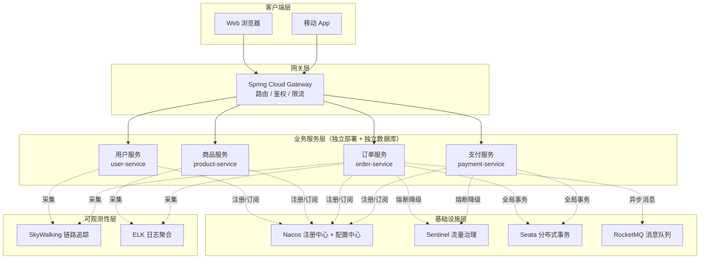

# Spring Cloud Alibaba 深度

> 学习路线对应：第5周 -- 微服务与 Spring Cloud
> 前置知识：Spring Boot、REST API
> 对比 Node.js：微服务拆分 约等于 前端模块拆分，服务注册 约等于 路由表

---

## 一、核心概念

### 1.1 单体架构到微服务架构演进

| 架构阶段 | 特点 | 优点 | 缺点 |
|----------|------|------|------|
| **单体架构** | 所有功能打包在一个应用中 | 开发简单、部署方便、调试容易 | 代码耦合、扩展困难、技术栈单一 |
| **SOA（面向服务架构）** | 按业务拆分服务，通过 ESB 集成 | 服务复用、松散耦合 | ESB 成为瓶颈、协议复杂 |
| **微服务架构** | 按业务领域拆分，独立部署，轻量级通信 | 独立部署、技术栈灵活、高可扩展 | 分布式复杂性、运维成本高 |

**微服务架构的核心原则：**

1. **单一职责**：每个服务只负责一个业务领域
2. **自治性**：服务拥有自己的数据存储，独立部署和扩展
3. **去中心化**：每个服务可以选择最适合的技术栈
4. **容错设计**：服务故障时不影响整体系统（熔断、降级、限流）

> **生活化类比：** 微服务架构就像大公司的部门制。单体架构是一家"夫妻店"，老板一个人管进货、收银、炒菜、打扫，所有事情都在一起，生意好了忙不过来也只能整体扩张。微服务架构是把公司拆成独立的部门：销售部（订单服务）、仓储部（商品服务）、财务部（支付服务）、人力资源部（用户服务）。每个部门有自己的办公室（独立数据库）、自己的团队（独立部署），部门之间通过内部邮件或工单系统（REST API / RPC）沟通协作。某个部门请假了（服务宕机），其他部门还能继续运转（故障隔离），不会整个公司停摆。

**微服务架构总览图（以电商系统为例）：**



> 上图展示了 Spring Cloud Alibaba 微服务体系的核心分层：客户端请求经 **Gateway 统一入口**路由到各业务服务，业务服务通过 **Nacos** 完成注册与配置发现，借助 **Sentinel** 实现熔断限流，跨服务一致性由 **Seata** 保证，异步解耦依赖 **RocketMQ**，整体运行状态由 **SkyWalking + ELK** 实现可观测。每一层都可独立演进、独立扩缩容，体现了微服务"自治、去中心化、容错"的核心原则。

### 1.2 Spring Cloud Alibaba vs Spring Cloud Netflix

| 组件 | Spring Cloud Netflix | Spring Cloud Alibaba | 当前状态 |
|------|---------------------|----------------------|----------|
| 注册中心 | Eureka 1.x（已停更） | Nacos | Nacos 推荐 |
| 配置中心 | Archaius（已停更） | Nacos Config | Nacos 推荐 |
| 负载均衡 | Ribbon（已停更） | Spring Cloud LoadBalancer | LoadBalancer 推荐 |
| 限流熔断 | Hystrix（已停更） | Sentinel | Sentinel 推荐 |
| 网关 | Zuul 1.x（已停更） | Spring Cloud Gateway | Gateway 推荐 |
| 分布式事务 | 无 | Seata | Seata 推荐 |

> 关键结论：Spring Cloud Netflix 核心组件已全部进入维护/停止维护状态，Spring Cloud Alibaba 是当前主流选择。

### 1.3 核心组件全景

| 组件 | 定位 | 核心能力 | 替代方案 |
|------|------|----------|----------|
| **Nacos** | 注册中心 + 配置中心 | 服务发现、健康检查、配置管理、动态刷新 | Eureka + Apollo |
| **Sentinel** | 流量治理 | 流量控制、熔断降级、系统保护、热点限流 | Hystrix |
| **Seata** | 分布式事务 | AT 模式、TCC 模式、Saga 模式 | 自研 |
| **Gateway** | API 网关 | 路由转发、鉴权、限流、跨域 | Zuul、Kong |
| **RocketMQ** | 消息队列 | 事务消息、顺序消息、延迟消息 | Kafka、RabbitMQ |
| **Dubbo** | RPC 框架 | 高性能 RPC 调用、服务治理 | gRPC、Feign |

> **生活化类比：Nacos = 大型商场的物业管理中心** —— Nacos 同时扮演"注册中心"和"配置中心"两个角色，就像商场的物业管理中心。在商场里，每家店铺（微服务实例）开门营业前必须先到物业登记注册（服务注册），登记内容包括店铺名称、楼层位置、营业时间等元数据（IP + Port + 元数据）。当顾客（服务消费者）想找某类店铺时，不需要满商场乱逛，直接咨询前台就能拿到最新店铺名录（服务发现）。物业还会定期巡查（健康检查），店铺没开门或已撤店的会被从名录中剔除。另一方面，物业还负责发布统一通知（配置中心），如"今日空调温度统一调到 26 度"或"周末促销规则更新"（配置变更），所有店铺收到通知后立即执行，无需挨家挨户通知（动态刷新）。

> **生活化类比：Spring Cloud Alibaba 各组件 = 大型商场的各部门** —— 一个大型购物中心要正常运转，需要多个部门协同：门口的保安岗（Gateway 网关）负责引导客流、检查证件、限流；物业中心（Nacos）负责登记商铺信息和发布商场公告；消防中控（Sentinel）在出现火情（服务异常）时及时拉闸断电（熔断降级），防止火势蔓延；财务结算中心（Seata）负责跨店铺的联合促销对账，确保要么全部成交要么全部退款（分布式事务）；内部传菜/快递通道（RocketMQ）负责异步传递信息（消息队列）；商场运营监控大屏（SkyWalking + ELK）实时展示每个店铺的客流和经营状态（可观测性）。每个组件各司其职，缺一不可，共同支撑商场的稳定运营。

---

## 二、底层原理

### 2.1 服务注册发现原理

**核心流程：**

```
服务提供者启动 -> 向注册中心注册（IP + Port + 元数据）
  -> 注册中心存储服务实例信息
  -> 服务消费者订阅服务 -> 拉取实例列表
  -> 注册中心推送变更通知（实例上下线）
  -> 消费者负载均衡选择实例发起调用
```

**Nacos 临时实例健康检查机制：**

| 参数 | 默认值 | 说明 |
|------|--------|------|
| 心跳间隔 | 5s | 客户端向服务端发送心跳 |
| 不健康阈值 | 15s | 15s 未收到心跳标记为不健康 |
| 剔除阈值 | 30s | 30s 未收到心跳剔除实例 |

**注册中心对比：**

| 维度 | Nacos | Eureka | Consul | ZooKeeper |
|------|-------|--------|--------|-----------|
| CAP 模型 | AP/CP 可切换 | AP | CP | CP |
| 一致性协议 | Distro/Raft | 无 Leader 设计 | Raft | ZAB |
| 健康检查 | 客户端心跳 + 服务端探测 | 客户端心跳 | 服务端探测 | 心跳 + Session |
| 配置中心 | 内置 | 无 | 内置 KV | 可做配置中心 |
| 多数据中心 | 支持 | 支持 | 支持 | 不支持 |

### 2.2 Nacos AP vs CP 模式

| 对比维度 | AP 模式（Distro 协议） | CP 模式（Raft 协议） |
|----------|------------------------|----------------------|
| **一致性协议** | 阿里自研 Distro 协议 | Raft 一致性算法 |
| **数据一致性** | 最终一致性 | 强一致性 |
| **可用性** | 高可用，任意节点故障不影响 | 需要 Leader 选举，故障期间短暂不可用 |
| **适用场景** | 临时实例的服务发现 | 永久实例、配置变更 |
| **实例类型** | ephemeral=true（临时实例） | ephemeral=false（永久实例） |
| **数据同步** | 异步同步，对等节点间互相同步 | 通过 Leader 同步，写入必须经过 Leader |

**Distro 协议核心设计：**
- 对等节点设计：每个节点平等，独立处理读写请求
- 数据分片：每个节点负责一部分数据，变更先写本地再异步同步
- 最终一致性：通过心跳同步和校验机制保证

### 2.3 Sentinel 滑动窗口限流算法

Sentinel 默认使用**滑动窗口算法**（LeapArray）进行流量统计。

**三种算法对比：**

| 算法 | 核心思想 | 突发流量 | Sentinel 实现 |
|------|----------|----------|---------------|
| **滑动窗口** | 将时间窗口切分为多个小窗口，滑动时丢弃过期数据 | 严格限制 | `LeapArray`（默认） |
| **令牌桶** | 以固定速率向桶中放入令牌，请求需获取令牌 | 允许突发 | `WarmUpController`（预热） |
| **漏桶** | 请求进入漏桶，以固定速率流出 | 严格限制速率 | `RateLimiterController`（匀速排队） |

**滑动窗口参数：** `sampleCount`（样本数，默认 2）+ `intervalInMs`（窗口长度，默认 1000ms），即 1 秒内分 2 个 500ms 窗口。

**熔断器三态转换：**

```
CLOSED（正常） -> 触发熔断条件 -> OPEN（拒绝所有请求）
  -> 熔断时间窗口结束 -> HALF_OPEN（放行探测请求）
  -> 探测成功 -> CLOSED / 探测失败 -> OPEN
```

### 2.4 Seata AT 模式两阶段提交

AT（Auto Transaction）模式是 Seata 最常用的分布式事务模式，基于改进的两阶段提交协议。

**第一阶段（执行 + 记录 undo_log）：**

1. TM 向 TC 开启全局事务，获得 XID（全局事务 ID）
2. RM 执行原始业务 SQL
3. RM 生成 undo_log（记录回滚 SQL），与业务 SQL 在同一本地事务中提交
4. RM 向 TC 注册分支事务并报告成功

**第二阶段（提交/回滚）：**

- **提交**：TC 通知各 RM 提交，RM 异步删除 undo_log
- **回滚**：TC 通知各 RM 回滚，RM 读取 undo_log 执行反向 SQL，删除 undo_log

**undo_log 表结构：**

```sql
CREATE TABLE `undo_log` (
    `id`            BIGINT NOT NULL AUTO_INCREMENT,
    `branch_id`     BIGINT NOT NULL COMMENT '分支事务 ID',
    `xid`           VARCHAR(100) NOT NULL COMMENT '全局事务 ID',
    `rollback_info` LONGBLOB NOT NULL COMMENT '回滚 SQL 信息',
    `log_status`    INT NOT NULL COMMENT '0:正常 1:已全局完成',
    PRIMARY KEY (`id`),
    UNIQUE KEY `ux_undo_log` (`xid`, `branch_id`)
) ENGINE=InnoDB;
```

---

## 三、实战应用

### 3.1 微服务拆分原则

1. **按业务领域拆分**：以业务边界划分服务，而不是技术层面
2. **服务粒度适中**：太细增加运维成本，太粗失去微服务优势
3. **数据独立**：每个服务拥有自己的数据库，不共享数据库
4. **接口明确**：定义清晰的 API 契约，通过 API 通信
5. **逐步拆分**：从单体逐步拆分，优先拆分变化频繁的模块

**拆分示例（电商系统）：**

```
单体电商 -> 微服务拆分：
  - 用户服务（user-service）
  - 商品服务（product-service）
  - 订单服务（order-service）
  - 支付服务（payment-service）
  - 物流服务（logistics-service）
```

### 3.2 Nacos 配置中心动态刷新

```java
// 方式一：@RefreshScope + @Value
@RestController
@RefreshScope  // 必须添加此注解
@RequestMapping("/api")
public class ConfigController {

    @Value("${app.name:default}")
    private String appName;

    @GetMapping("/name")
    public String getAppName() {
        return appName;  // 配置变更后，下次访问即生效
    }
}

// 方式二：@ConfigurationProperties（天然支持动态刷新）
@Component
@ConfigurationProperties(prefix = "app")
public class AppProperties {
    private String name;
    private String version;
    // getter/setter
}
```

**配置刷新原理：**
1. Nacos 长轮询检测到配置变更
2. 触发 `RefreshEvent` 事件
3. `ContextRefresher.refresh()` 清除 refresh 作用域缓存
4. 下次访问时重新创建 Bean（使用新配置）

### 3.3 Gateway 统一鉴权

```java
@Component
public class AuthGlobalFilter implements GlobalFilter, Ordered {

    @Override
    public Mono<Void> filter(ServerWebExchange exchange, GatewayFilterChain chain) {
        // 1. 获取请求路径
        String path = exchange.getRequest().getURI().getPath();

        // 2. 跳过白名单路径（如登录接口）
        if (isWhitePath(path)) {
            return chain.filter(exchange);
        }

        // 3. 获取 Token
        String token = exchange.getRequest().getHeaders().getFirst("Authorization");
        if (StringUtils.isEmpty(token)) {
            return unauthorized(exchange, "缺少 Token");
        }

        // 4. 校验 Token
        try {
            Claims claims = JwtUtil.parseToken(token);
            // 5. 将用户信息传递到下游服务
            exchange.getRequest().mutate()
                .header("X-User-Id", claims.get("userId").toString())
                .header("X-User-Name", claims.get("userName").toString());
        } catch (Exception e) {
            return unauthorized(exchange, "Token 无效");
        }

        return chain.filter(exchange);
    }

    @Override
    public int getOrder() {
        return -100; // 高优先级
    }
}
```

### 3.4 Sentinel 降级规则配置

```java
// 慢调用比例熔断
@PostConstruct
public void initDegradeRule() {
    List<DegradeRule> rules = new ArrayList<>();
    DegradeRule rule = new DegradeRule();
    rule.setResource("getOrder");
    rule.setGrade(CircuitBreakerStrategy.SLOW_REQUEST_RATIO.getType());
    rule.setCount(200);                      // 最大 RT 200ms
    rule.setSlowRatioThreshold(0.5);         // 慢调用比例阈值 50%
    rule.setMinRequestAmount(10);            // 最小请求数 10
    rule.setStatIntervalMs(10000);           // 统计窗口 10s
    rule.setTimeWindow(30);                  // 熔断时长 30s
    rules.add(rule);
    DegradeRuleManager.loadRules(rules);
}
```

**三种熔断策略：**

| 策略 | 触发条件 | 适用场景 |
|------|----------|----------|
| 慢调用比例 | 响应时间 > maxAllowedRt 的请求比例超过阈值 | 服务响应变慢 |
| 异常比例 | 异常调用比例超过阈值 | 服务开始出现异常 |
| 异常数 | 异常数（分钟级）超过阈值 | 异常数量达到绝对值 |

---

## 四、常见面试题

### 1. 微服务架构的优缺点？

**优点：**
1. 独立部署：每个服务可以独立构建、测试、部署
2. 技术栈灵活：不同服务可以使用不同技术栈
3. 高可扩展：可以针对热点服务单独扩容
4. 故障隔离：一个服务故障不影响其他服务
5. 团队自治：小团队独立负责一个服务

**缺点：**
1. 分布式复杂性：网络通信、数据一致性、分布式事务
2. 运维成本高：需要服务发现、配置中心、监控、链路追踪等基础设施
3. 调试困难：跨服务调用链路长，排查问题复杂
4. 数据一致性挑战：分布式事务处理复杂

### 2. Nacos 和 Eureka 的区别？

| 维度 | Nacos | Eureka |
|------|-------|--------|
| CAP 模型 | AP/CP 可切换 | AP |
| 健康检查 | 客户端心跳 + 服务端主动探测 | 客户端心跳 |
| 配置中心 | 内置 | 无 |
| 服务下线 | 主动通知 + 自动剔除 | 多级缓存，更新慢 |
| 维护状态 | 持续维护 | 已停更 |
| 一致性协议 | Distro/Raft | 无 Leader 设计 |

### 3. Sentinel 和 Hystrix 的区别？

| 维度 | Sentinel | Hystrix |
|------|----------|---------|
| 隔离策略 | 信号量隔离 | 线程池隔离/信号量隔离 |
| 熔断降级 | 慢调用比例/异常比例/异常数 | 异常比例 |
| 流量控制 | 丰富的流控策略（QPS/线程数/热点） | 不支持 |
| 实时监控 | 控制台 Dashboard | Hystrix Dashboard |
| 规则配置 | 控制台实时下发 | 代码硬编码 |
| 维护状态 | 持续维护 | 已停更 |

### 4. Seata AT 模式和 TCC 模式的区别？

| 维度 | AT 模式 | TCC 模式 |
|------|---------|----------|
| 侵入性 | 无侵入（自动生成回滚日志） | 有侵入（需实现 Try/Confirm/Cancel） |
| 实现难度 | 简单 | 复杂 |
| 性能 | 有全局锁，性能一般 | 无锁，性能好 |
| 适用场景 | 大多数场景 | 高性能要求、需要自定义资源 |
| 回滚方式 | 自动（undo_log） | 手动（Cancel 方法） |
| 数据一致性 | 最终一致 | 最终一致 |

---

## 五、避坑指南

| 常见错误 | 现象 | 原因 | 解决方案 |
|---------|------|------|---------|
| 过度拆分微服务 | 运维复杂度激增（部署、监控、链路追踪），跨服务调用延迟增加 | 服务粒度太细 | 团队规模 5-8 人维护一个服务，服务数量控制在 10-20 个以内 |
| 配置中心明文存储敏感信息 | 数据库密码、API Key 等泄露 | 敏感信息未加密存储 | 使用 Jasypt 加密：`password: ENC(加密后的密文)` |
| Nacos 集群少于 3 个节点 | 单点故障，集群不可用 | 不满足 Raft 半数以上存活要求 | 生产环境至少 3 个节点，使用外部 MySQL 做持久化 |
| Sentinel 规则未持久化 | 重启后限流/熔断规则丢失 | Sentinel 默认规则存储在内存中 | 配置规则持久化到 Nacos 配置中心 |
| Gateway 做复杂业务逻辑 | 网关性能下降，成为瓶颈 | 网关应专注于横切关注点 | 复杂业务逻辑放在后端服务中，网关仅做路由、鉴权、限流 |

## 本章学习自检

完成本章学习后，应该能够：
- [ ] 用自己的话解释微服务架构演进、Nacos 注册发现原理（AP/CP 模式）、Sentinel 滑动窗口限流算法、Seata AT 模式两阶段提交
- [ ] 手写 Nacos 配置中心动态刷新、Gateway 统一鉴权过滤器、Sentinel 降级规则配置
- [ ] 回答常见面试题（微服务架构优缺点、Nacos vs Eureka、Sentinel vs Hystrix、Seata AT vs TCC 等）
- [ ] 在实战项目中应用 Spring Cloud Alibaba 搭建完整的微服务架构
- [ ] 识别并避免常见错误（过度拆分微服务、Nacos 集群少于 3 节点、Sentinel 规则未持久化、Gateway 做复杂业务逻辑等）

---

> 📖 **参考链接**：
> - [Spring Cloud Alibaba 官方文档](https://sca.aliyun.com/docs/2023/user-guide/overview/) -- Spring Cloud Alibaba 项目首页与组件总览，包含 Nacos / Sentinel / Seata / RocketMQ 等所有组件
> - [Spring Cloud 官方文档](https://docs.spring.io/spring-cloud/docs/) -- Spring Cloud 各版本参考手册索引（Hoxton / 2020.0 / 2021.0 / 2022.0 / 2023.0）
> - [Sentinel 快速开始](https://sca.aliyun.com/docs/2023/user-guide/sentinel/quick-start/) -- Sentinel 接入 Spring Cloud Alibaba 的快速入门
> - [Seata 官方文档](https://seata.io/zh-cn/docs/overview/what-is-seata.html) -- Seata 架构总览与 AT / TCC / SAGA / XA 模式说明
> - [Nacos 官方文档](https://nacos.io/zh-cn/docs/v2/quickstart.html) -- Nacos 2.x 快速开始与架构介绍
> - [Spring Cloud Gateway 参考手册](https://docs.spring.io/spring-cloud/docs/current/reference/html/) -- Spring Cloud 全家桶参考手册，含 Gateway / OpenFeign / LoadBalancer 章节

---

> **学习导航**：
> - 返回 [学习路线总览](../../README.md)
> - 本模块其他文件：[05-微服务笔面试题集](./05-微服务笔面试题集.md)
> - 实战应用：[电商订单实时统计分析平台](../../extensions/project/01-电商订单实时统计分析平台.md)


