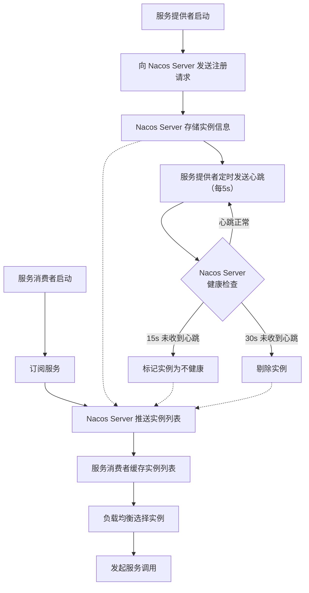

# Nacos 服务注册与配置中心

> 学习路线对应：第5周 -- 微服务与 Spring Cloud > Nacos
> 前置知识：Spring Boot、服务发现基础概念

---

## 一、Nacos 整体架构

### 1.1 定位与角色

Nacos（**Na**ming and **Co**nfiguration **S**ervice）是阿里巴巴开源的一个更易于构建云原生应用的动态服务发现、配置管理和服务管理平台。在 Spring Cloud Alibaba 生态中扮演**注册中心**和**配置中心**双重角色。

**三层架构：**

| 层级 | 组件 | 说明 |
|------|------|------|
| **Server 层** | Nacos Server | 核心服务端，提供注册中心 + 配置中心能力，支持集群部署 |
| **Client 层** | Nacos Client SDK | 嵌入业务应用的 SDK，负责服务注册、心跳上报、配置拉取与监听 |
| **OpenAPI 层** | HTTP REST / gRPC | 对外暴露的标准 API，非 Java 语言可通过 OpenAPI 接入 |

### 1.2 Nacos 1.x vs 2.x

| 对比维度 | Nacos 1.x | Nacos 2.x |
|----------|-----------|-----------|
| **通信协议** | HTTP REST | gRPC（基于 HTTP/2） |
| **连接方式** | 短连接 + 心跳 HTTP 请求 | gRPC 长连接 + 双向流 |
| **心跳机制** | 客户端定时发 HTTP 心跳（5s） | gRPC 双向流，服务端可主动推送 |
| **服务发现** | 客户端轮询 + UDP 推送 | gRPC 双向流实时推送 |
| **配置监听** | HTTP 长轮询（30s 超时） | gRPC 双向流 |
| **端口** | 8848（主端口） | 8848（HTTP）、9848（gRPC客户端）、9849（gRPC集群）、7848（Jraft 协议） |
| **性能** | 基准 | 注册性能提升 2x，配置查询提升 3x |

> 核心变化：Nacos 2.x 通信层从 HTTP 升级为 gRPC 长连接，实现双向流推送，大幅提升性能。

> **生活化类比：注册中心 = 114 查号台** —— 在没有查号台的年代，想找某家公司必须挨家挨户敲门询问（手动配置 IP 地址）。有了 114 查号台（Nacos 注册中心），每家公司开业时主动向查号台登记自己的地址和联系方式（服务注册 + 心跳上报），顾客拨打 114 报出公司名称（服务名）即可立即查到最新联系方式（服务发现）。如果公司搬迁或倒闭没有及时通知查号台，查号台定期巡查发现电话无人接听后（健康检查失败）会从号码簿中剔除（实例剔除），避免给顾客提供错误信息。整个流程无需人工维护号码簿，查号台和商家协作即可保证号码簿的实时准确。

---

## 二、服务注册与发现

### 2.1 两种实例类型

| 实例类型 | 心跳机制 | 健康检查方式 | 适用场景 |
|----------|----------|--------------|----------|
| **临时实例**（ephemeral=true） | 客户端主动上报心跳，间隔 5s | 服务端 15s 未收到心跳标记不健康，30s 剔除 | 大部分业务场景 |
| **永久实例**（ephemeral=false） | 无心跳，服务端主动探测 | 服务端定期调用健康检查接口 | 基础设施服务（数据库、缓存） |

### 2.2 服务注册流程

```
1. 注册：Client 启动时向 Nacos Server 发送注册请求
2. 心跳：Client 内部 BeatReactor 线程池每隔 5s 发送心跳
3. 健康检查：Server 端 ClientBeatCheckTask 每 5s 检查一次
   - 15s 内未收到心跳 -> 标记不健康
   - 30s 内未收到心跳 -> 剔除实例
4. 服务发现：Consumer 订阅服务后，Server 推送变更通知
```

### 2.3 AP 模式 vs CP 模式

Nacos 通过在实例注册时指定 `ephemeral` 属性来区分使用哪种一致性协议：

| 对比维度 | AP 模式（Distro 协议） | CP 模式（Raft 协议） |
|----------|------------------------|----------------------|
| **一致性协议** | 阿里自研 Distro 协议 | Raft 一致性算法 |
| **数据一致性** | 最终一致性 | 强一致性 |
| **可用性** | 高可用，任意节点故障不影响 | 需要 Leader 选举，故障期间短暂不可用 |
| **实例类型** | ephemeral=true（临时实例） | ephemeral=false（永久实例） |
| **数据同步** | 异步同步，对等节点间互相同步 | 通过 Leader 同步 |
| **适用场景** | 普通微服务实例注册 | 数据库实例、配置变更 |

**Distro 协议核心设计：**
- 对等节点设计：每个节点平等，独立处理读写请求
- 数据分片：每个节点负责一部分数据，变更先写本地再异步同步
- 最终一致性：通过心跳同步和校验机制保证

```yaml
# 临时实例（AP）- 默认
spring:
  cloud:
    nacos:
      discovery:
        ephemeral: true

# 永久实例（CP）
spring:
  cloud:
    nacos:
      discovery:
        ephemeral: false
```

**服务注册发现完整流程图**：



> Nacos 的服务注册与发现以**心跳机制**为核心，通过临时实例的主动上报和永久实例的被动探测，实现了服务的动态注册与自动下线。消费者通过**订阅-推送**模式实时感知实例变化，结合负载均衡策略完成服务调用，整个过程无需人工干预。

> **生活化类比：健康检查 = 公司考勤打卡** —— Nacos 对临时实例的健康检查机制就像公司的考勤制度。员工（服务实例）每天到岗后必须每 5 秒打一次卡（心跳上报），考勤系统（Nacos Server）每 5 秒统计一次。如果某员工 15 秒没打卡（15s 未收到心跳），HR 标记为"旷工"（不健康状态）；如果 30 秒仍未打卡（30s 未收到心跳），HR 直接从员工花名册中除名（剔除实例）。而永久实例（如数据库、Redis 等基础设施）则像公司高管，不需要打卡（无心跳），HR 会定期打电话确认是否在岗（服务端主动探测）。这种"主动打卡 + 被动探测"结合的方式，既覆盖了容易宕机的业务服务，也兼顾了相对稳定的基础设施服务。

---

## 三、配置中心
### 3.1 三层配置隔离

> **生活化类比：配置中心 = 公司公告栏 + 部门文件夹** —— Nacos 配置中心就像公司的公告体系。**Namespace** 对应公司的不同办公地点（北京总部、上海分公司、广州分公司），完全隔离互不影响；**Group** 对应公司内部的不同部门（研发部、市场部、财务部），各部门管理自己的配置；**Data ID** 对应具体的公告文件（员工守则.yaml、报销流程.yml）。每个员工（微服务）根据自己的办公地点和所属部门，订阅对应的公告文件。当公告变更时（配置修改），公告栏会通过企业微信推送通知（长轮询/gRPC 推送），所有订阅者立即看到最新版本并执行（动态刷新），无需 IT 部门逐台电脑修改。

Nacos 提供三层配置隔离机制：

| 隔离层级 | 标识符 | 粒度 | 典型用途 |
|----------|--------|------|----------|
| **Namespace** | namespace | 租户级 | 环境隔离（dev / test / prod） |
| **Group** | group | 应用级 | 按业务模块分组（ORDER_GROUP / USER_GROUP） |
| **Data ID** | dataId | 配置级 | 具体配置文件（application.yml） |

> 注意：namespace 配置填写的是命名空间 **ID**（UUID），不是名称。

**Data ID 命名规则：**

```
${spring.application.name}-${spring.profiles.active}.${file-extension}
# 示例：order-service-dev.yaml
```

### 3.2 长轮询机制

Nacos 使用长轮询（Long Polling）实现配置变更的实时推送：

| 对比维度 | 短轮询 | 长轮询 |
|----------|--------|--------|
| **工作原理** | 客户端定时发起请求查询配置 | 客户端发起请求，服务端挂起直到有变更或超时 |
| **实时性** | 取决于轮询间隔，延迟高 | 配置变更后立即返回，实时性高 |
| **资源消耗** | 大量无效请求 | 挂起期间不占用额外资源 |
| **超时设置** | 无 | 默认 30s |

**长轮询流程：**

```
1. Client 发起配置查询，携带当前配置的 MD5 值
2. Server 比较 MD5：
   - 一致（未变更）-> 挂起请求，等待 30s
   - 不一致（已变更）-> 立即返回新配置
3. 30s 超时 -> 返回 304 Not Modified
4. Client 收到响应后立即发起下一轮长轮询
```

### 3.3 配置动态刷新

```java
// @RefreshScope：底层是代理模式
// 配置变更后，清除 refresh 作用域缓存，下次访问时重新创建 Bean
@RestController
@RefreshScope
@RequestMapping("/api")
public class ConfigController {
    @Value("${app.name:default}")
    private String appName;
}

// @ConfigurationProperties：天然支持动态刷新
@Component
@ConfigurationProperties(prefix = "app")
public class AppProperties {
    private String name;
    private String version;
}
```

**刷新流程：** Nacos 配置变更 -> RefreshEvent -> ContextRefresher.refresh() -> 清除缓存 -> 重建 Bean

---

## 四、集群部署

### 4.1 生产环境要求

- 至少 **3 个节点**（满足 Raft 半数以上存活要求）
- 使用外部 **MySQL** 做持久化存储（不能使用嵌入式 Derby）
- 前端通过 **Nginx/SLB** 做负载均衡
- `cluster.conf` 中配置所有节点的 IP 和端口

### 4.2 接入配置

```yaml
spring:
  cloud:
    nacos:
      discovery:
        server-addr: nacos.example.com:8848  # 指向 Nginx VIP
        namespace: prod-namespace-id
      config:
        server-addr: nacos.example.com:8848
        namespace: prod-namespace-id
        file-extension: yaml
        group: DEFAULT_GROUP
        # 共享配置
        shared-configs:
          - data-id: common-config.yaml
            group: DEFAULT_GROUP
            refresh: true
```

### 4.3 集群部署深度解析

**集群拓扑（3 节点典型部署）：**

```
                    ┌──────────────┐
                    │  Nginx / SLB │
                    │  (VIP 入口)   │
                    └──────┬───────┘
            ┌──────────────┼──────────────┐
            ▼              ▼              ▼
      ┌──────────┐   ┌──────────┐   ┌──────────┐
      │ Nacos-1  │◄─►│ Nacos-2  │◄─►│ Nacos-3  │
      │ 8848/9848│   │ 8848/9848│   │ 8848/9848│
      └────┬─────┘   └────┬─────┘   └────┬─────┘
           │              │              │
           └──────────────┼──────────────┘
                          ▼
                  ┌─────────────────┐
                  │  外部 MySQL 主从  │
                  │  (config_info)   │
                  └─────────────────┘
```

**cluster.conf 配置示例：**

```
# cluster.conf (三节点 IP:port 列表)
192.168.1.101:8848
192.168.1.102:8848
192.168.1.103:8848
```

**持久化关键表（MySQL）：**

| 表名 | 作用 |
|------|------|
| `config_info` | 存储所有配置内容（Data ID + Group + content） |
| `config_info_beta` | Beta 发布配置 |
| `config_info_tag` | 标签灰度配置 |
| `his_config_info` | 配置变更历史（用于审计和回滚） |
| `tenant_info` | 命名空间（Namespace）元数据 |

**Raft 选举要点（CP 模式相关）：**

1. 集群启动后，节点间通过 Raft 协议选举 Leader
2. 所有写操作必须经过 Leader，Follower 转发请求到 Leader
3. Leader 将数据同步到半数以上 Follower 后返回成功
4. Leader 故障后，剩余节点重新选举（通常 150-300ms 选举超时）
5. 配置中心数据使用 CP 模式，确保所有节点配置强一致

**Distro 协议要点（AP 模式相关）：**

1. 每个节点负责一部分服务的注册数据（按 hash 分片）
2. 节点间异步同步各自负责的数据
3. 客户端可从任意节点读取服务列表（最终一致）
4. 节点故障时，客户端自动切换到其他节点，不影响服务发现

### 4.4 Nacos 注册中心原理深度解析

**服务注册源码链路（2.x gRPC 版本）：**

```
1. Spring 启动 -> NacosServiceManager.init()
2. NamingService.registerInstance(serviceName, ip, port)
3. 通过 gRPC 双向流发送注册请求到 Server
4. Server 处理注册：
   a. 写入本地注册表（ConcurrentHashMap<serviceName, List<Instance>>）
   b. 如果是临时实例 -> Distro 异步同步到其他节点
   c. 如果是永久实例 -> Raft 强一致写入
5. 推送变更通知给所有订阅该服务的 Consumer
```

**注册表数据结构（服务端内存）：**

```java
// 简化版 Nacos 注册表结构
public class ServiceManager {
    // serviceName -> Service
    private final Map<String, Service> serviceMap = new ConcurrentHashMap<>();

    // Service 内部维护集群和实例
    // Cluster -> ephemeralInstances(临时) + persistentInstances(永久)
}

// 实例变更通知机制
public class PushService {
    // 客户端订阅关系：serviceName -> Set<Client>
    private final Map<String, Set<Client>> clientMap = new ConcurrentHashMap<>();

    // 通过 gRPC 双向流主动推送变更
    public void serviceChanged(Service service) {
        // 异步推送至所有订阅者
    }
}
```

**客户端缓存与本地容错：**

| 机制 | 作用 | 触发条件 |
|------|------|----------|
| 本地快照 | 客户端缓存服务列表到磁盘 | 每次从 Server 拉取成功后 |
| 失败回退 | Server 不可用时使用本地快照 | gRPC 连接失败 |
| 推送 + 定时拉取 | 双保险保证数据新鲜 | 推送为主，定时拉取（默认 30s）兜底 |

### 4.5 配置动态推送原理

**Nacos 1.x 长轮询流程：**

```
1. Client 调用 Server /listener 接口，携带配置 MD5
2. Server 检查 MD5 是否变化：
   - 未变化 -> 将请求挂起到 LongPollingService 队列
   - 已变化 -> 立即返回变更的 Data ID
3. 30s 内有配置变更 -> 唤醒挂起请求，返回变更 Data ID
4. 30s 超时 -> 返回空（无变更）
5. Client 收到响应后，立即拉取新配置内容
6. 立即发起下一轮长轮询
```

**Nacos 2.x gRPC 推送流程：**

```
1. Client 启动时建立 gRPC 双向流长连接
2. Client 发送订阅请求（监听特定 Data ID）
3. Server 维护 ConfigChangePublisher 关系
4. 配置变更时：
   a. Server 写入 MySQL（持久化）
   b. 发布 ConfigDataChangeEvent
   c. gRPC 主动推送变更通知给所有订阅者
5. Client 收到通知后拉取新配置内容
6. 触发 RefreshEvent -> ContextRefresher -> 重建 Bean
```

**配置动态刷新原理（Spring Cloud 集成）：**

```java
// NacosContextRefresher 监听配置变更
public class NacosContextRefresher implements ApplicationListener<ApplicationReadyEvent> {
    
    // 注册 Nacos Listener
    @Override
    public void onApplicationEvent(ApplicationReadyEvent event) {
        this.registerNacosListener();
    }
    
    private void registerNacosListener() {
        Listener listener = configService -> {
            // 配置变更时触发
            applicationContext.publishEvent(new RefreshEvent(this, null, "Nacos config changed"));
        };
        configService.addListener(dataId, group, listener);
    }
}

// RefreshEventListener 处理 RefreshEvent
public class RefreshEventListener implements ApplicationListener<RefreshEvent> {
    @Override
    public void onApplicationEvent(RefreshEvent event) {
        ContextRefresher refresher = context.getBean(ContextRefresher.class);
        // 刷新 Environment + 销毁 @RefreshScope Bean
        refresher.refresh();
    }
}
```

**@RefreshScope 原理：**

```java
// @RefreshScope 标注的 Bean 被代理
@Target({ElementType.TYPE, ElementType.METHOD})
@Retention(RetentionPolicy.RUNTIME)
@Scope("refresh")
public @interface RefreshScope {
}

// RefreshScope 是 GenericScope 的子类
// 配置变更时调用 RefreshScope.refreshAll()
// -> 销毁所有缓存的 Bean 实例
// -> 下次访问时重新创建 Bean（使用最新配置）
```

### 4.6 集群选型与部署建议

| 部署模式 | 节点数 | 一致性 | 适用场景 | 风险 |
|----------|--------|--------|----------|------|
| 单机模式 | 1 | - | 开发测试 | 单点故障 |
| 集群模式（3 节点） | 3 | AP+CP | 生产环境 | 推荐 |
| 集群模式（5 节点） | 5 | AP+CP | 高可用生产 | 容忍 2 节点故障 |
| 多数据中心 | 6+ | AP+CP | 跨地域部署 | 运维复杂 |

**生产环境部署 checklist：**

- [ ] 至少 3 个节点，分布在不同的物理机/可用区
- [ ] 使用外部 MySQL（主从高可用），不能使用嵌入式 Derby
- [ ] 前置 Nginx/SLB 做负载均衡，客户端通过 VIP 访问
- [ ] 开启 Nacos 鉴权（nacos.core.auth.enabled=true）
- [ ] 配置 JVM 参数：`-Xms2g -Xmx2g -XX:MetaspaceSize=128m`
- [ ] 监控关键指标：集群健康状态、注册实例数、配置变更次数
- [ ] 定期备份 MySQL 数据（config_info 等核心表）

---

## 五、常见面试题

### 1. Nacos 如何同时支持 AP 和 CP 两种模式？

通过实例类型区分：临时实例（ephemeral=true）走 AP 模式（Distro 协议），永久实例（ephemeral=false）走 CP 模式（Raft 协议）。配置管理和服务发现可以在同一集群中分别使用不同模式。

### 2. Nacos 心跳机制是怎样的？

临时实例：客户端每隔 5s 发送心跳，服务端 15s 未收到心跳标记不健康，30s 未收到心跳剔除实例。服务端可通过 `clientBeatInterval` 动态调整客户端心跳间隔。

### 3. Nacos 配置中心长轮询超时时间是多少？

默认 30 秒。客户端携带当前配置 MD5 值发起请求，服务端比较 MD5，未变更则挂起请求等待 30s。30s 内配置变更则立即返回，超时则返回 304。

### 4. Nacos 2.x 相比 1.x 的核心变化是什么？

通信层从 HTTP 短连接升级为 gRPC 长连接，实现双向流推送。心跳机制从 HTTP 定时请求改为 gRPC 双向流，服务端可主动推送。新增 gRPC 端口 9848（主端口 + 1000）。性能提升 2-3 倍。

---

## 六、避坑指南

| 常见错误 | 现象 | 原因 | 解决方案 |
|---------|------|------|---------|
| 生产环境使用嵌入式 Derby | 无法支持集群，数据丢失风险 | 嵌入式 Derby 只能用于单机开发测试 | 生产环境必须使用外部 MySQL |
| namespace 填名称而非 ID | 配置不生效 | namespace 配置项填写的是命名空间的 UUID，不是名称 | 从 Nacos 控制台复制命名空间的 UUID |
| Nacos 集群少于 3 个节点 | 集群不可用 | 2 个节点无法满足 Raft 半数以上存活要求 | 生产环境 Nacos 集群至少 3 个节点 |
| @Value 未配合 @RefreshScope | 配置修改后不生效 | @Value 不会自动刷新 | 添加 @RefreshScope 注解；或使用 @ConfigurationProperties（天然支持动态刷新） |
| 配置中心存放超大文件 | 配置加载慢，网络传输大 | 单个配置过大 | 单个配置内容建议不超过 100KB |

---

> 📖 **参考链接**：
> - [Nacos 官方文档（中文）](https://nacos.io/zh-cn/docs/v2/quickstart.html) -- Nacos 2.x 快速开始，含安装、启动、集群部署
> - [Nacos 架构设计](https://nacos.io/zh-cn/docs/v2/architecture.html) -- Nacos 整体架构、注册中心与配置中心设计原理
> - [Spring Cloud Alibaba Nacos Discovery](https://sca.aliyun.com/docs/2023/user-guide/nacos/quick-start/) -- Spring Cloud Alibaba 集成 Nacos 服务发现的官方指南
> - [Spring Cloud Alibaba Nacos Config](https://sca.aliyun.com/docs/2023/user-guide/nacos-config/quick-start/) -- Spring Cloud Alibaba 集成 Nacos 配置中心的官方指南
> - [Spring Cloud 参考手册](https://docs.spring.io/spring-cloud/docs/current/reference/html/) -- Spring Cloud 通用参考，含 @RefreshScope、ConfigDataContext 等原理
> - [Nacos GitHub 源码](https://github.com/alibaba/nacos) -- Nacos 源码仓库，可深入学习 Distro / Raft 协议实现

---

> **学习导航**：
> - 返回 [学习路线总览](../../README.md)
> - 本模块其他文件：[05-微服务笔面试题集](./05-微服务笔面试题集.md)
> - 实战应用：[电商订单实时统计分析平台](../../extensions/project/01-电商订单实时统计分析平台.md)


