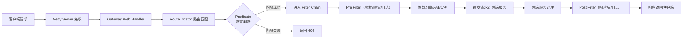
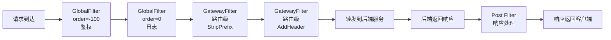

# Gateway 网关与负载均衡

> 学习路线对应：第5周 -- 微服务与 Spring Cloud > Gateway
> 前置知识：Spring WebFlux、Nginx 反向代理基础

---

## 一、Gateway 架构

### 1.1 核心定位

Spring Cloud Gateway 是基于 Spring WebFlux 框架构建的 API 网关，采用**非阻塞 I/O 模型**（Netty + Reactor），是 Zuul 1.x 的替代方案。

> **生活化类比：Gateway = 小区大门保安** —— 一个高档小区（微服务集群）有多个楼栋（多个业务服务），所有访客（客户端请求）不能直接冲进楼栋，必须先经过小区大门的保安岗（Gateway 网关）。保安岗承担多项职责：① **登记来访**（路由）：根据访客要找的楼栋号（请求路径）决定放行到哪栋楼；② **证件查验**（鉴权）：检查访客是否持有有效的访客证（JWT Token），无证人员直接拒之门外；③ **限流管控**（限流）：高峰时段限制每分钟进入小区的人数，防止小区过载；④ **记录日志**（日志）：登记每个访客的到访时间和访问目标，便于事后追溯。保安岗本身不提供住宿服务（不做业务逻辑），只负责"准入控制 + 流量调度"，让每栋楼（业务服务）专注于自己的核心职责。

### 1.2 Gateway vs Zuul 1.x

| 对比维度 | Spring Cloud Gateway | Zuul 1.x |
|----------|---------------------|----------|
| **底层框架** | Spring WebFlux（Spring 5） | Servlet 2.5 |
| **I/O 模型** | 非阻塞 I/O（Netty + Reactor） | 阻塞 I/O（Servlet） |
| **线程模型** | 少量线程处理大量请求（Event Loop） | 一个请求一个线程 |
| **并发能力** | 高（支持万级并发） | 低（受线程池大小限制） |
| **长连接支持** | 天然支持（WebFlux 非阻塞） | 不支持 |
| **维护状态** | 持续维护 | 已停止维护 |

### 1.3 请求处理流程

```
客户端 -> Netty Server -> Gateway Web Handler -> RouteLocator 路由匹配
  -> Predicate 断言（匹配路由条件）-> Filter Chain 过滤器链
    -> Pre Filter（鉴权、限流、添加请求头）
    -> 转发请求到后端服务
    -> Post Filter（添加响应头、记录日志）
  -> 响应返回客户端
```

**Gateway 请求处理完整流程图**：



> Gateway 的请求处理采用**链式过滤**模型，请求首先经过路由断言匹配目标服务，随后依次通过 Pre Filter 和 Post Filter 完成鉴权、限流、日志等横切关注点处理。这种设计将业务逻辑与基础设施彻底解耦，是微服务网关的核心价值所在。

---

## 二、三大核心组件
### 2.1 Route（路由）

路由是网关的基本构建块，包含：

| 属性 | 说明 |
|------|------|
| **id** | 路由唯一标识 |
| **uri** | 目标服务地址（支持 `lb://` 负载均衡） |
| **predicates** | 断言集合，匹配请求条件 |
| **filters** | 过滤器集合，修改请求/响应 |
| **order** | 路由优先级（越小越优先） |

> **生活化类比：路由 = 快递分拣中心** —— Gateway 的路由系统就像大型快递分拣中心。每个包裹（HTTP 请求）到达分拣中心后，分拣员会根据包裹上的标签（Predicate 断言：地址、收件人姓名、邮编等）决定将包裹投递到哪个目的地（uri：某栋楼 / 某个城市）。比如"收件地址以 /order/ 开头的包裹送到订单服务楼（lb://order-service）"、"标记为 POST 方法的快递走加急通道（特定路由）"。如果包裹标签匹配多个路由，按 order 优先级决定走哪条线（数字越小优先级越高）。每个包裹从进到出，都要经过传送带上的多个加工站点（Filter：安检、贴标签、加固包装），最终被准确投递到目的地。

### 2.2 Predicate（断言）

用于匹配 HTTP 请求的条件，决定请求是否匹配该路由：

| 谓词 | 说明 | 示例 |
|------|------|------|
| Path | 路径匹配 | `Path=/order/**` |
| Host | 主机名匹配 | `Host=**.example.com` |
| Method | 请求方法匹配 | `Method=GET,POST` |
| Header | 请求头匹配 | `Header=X-Request-Id, \\d+` |
| Query | 查询参数匹配 | `Query=version, v1` |
| Cookie | Cookie 匹配 | `Cookie=sessionId, .+` |
| After/Before/Between | 时间匹配 | `After=2024-01-01T00:00:00+08:00` |

### 2.3 Filter（过滤器）

| 类型 | 作用范围 | 说明 |
|------|----------|------|
| **GatewayFilter** | 作用于特定路由 | 由 `filters` 配置指定 |
| **GlobalFilter** | 作用于所有路由 | 全局生效，无需配置 |

**过滤器执行顺序：** Pre 阶段（请求转发前）-> 转发请求 -> Post 阶段（响应返回后）

> **生活化类比：Filter 链 = 机场安检通道** —— Gateway 的过滤器链就像机场的安检通道，旅客（请求）从值机柜台到登机口要经过多个检查站点：① **Pre Filter**（出发前检查）：查验身份证件（鉴权 Filter）、检查行李是否超重（限流 Filter）、给行李贴标签（添加请求头 Filter）；② **转发请求**（乘坐摆渡车）：请求被实际转发到后端服务；③ **Post Filter**（到达后处理）：记录到达时间（日志 Filter）、给行李贴到达标签（添加响应头 Filter）。每个站点由不同岗位的工作人员负责（不同的 GlobalFilter / GatewayFilter），按 `getOrder()` 返回值决定执行顺序（值越小越先执行，就像安检流程的先后顺序）。某个站点未通过（如鉴权失败），整个流程立即中止，旅客被请出机场（返回 401）。

---

## 三、负载均衡

### 3.1 LoadBalancerClientFilter

Gateway 内置 `LoadBalancerClientFilter`，通过 `lb://` 前缀自动实现负载均衡：

```yaml
spring:
  cloud:
    gateway:
      routes:
        - id: order-service
          uri: lb://order-service  # lb:// 表示启用负载均衡
          predicates:
            - Path=/order/**
```

### 3.2 负载均衡策略

Spring Cloud LoadBalancer 支持两种策略：

| 策略 | 说明 | 适用场景 |
|------|------|----------|
| **RoundRobinLoadBalancer**（默认） | 轮询 | 服务实例性能相近 |
| **RandomLoadBalancer** | 随机 | 需要简单随机分配 |

```java
// 自定义负载均衡策略
@Bean
public ReactorLoadBalancer<ServiceInstance> customLoadBalancer(
        ObjectProvider<ServiceInstanceListSupplier> supplierProvider) {
    return new RandomLoadBalancer(supplierProvider, "order-service");
}
```

---

## 四、实战应用

### 4.1 基础路由配置

```yaml
spring:
  cloud:
    gateway:
      routes:
        - id: order-service
          uri: lb://order-service
          predicates:
            - Path=/order/**
          filters:
            - StripPrefix=1
        - id: user-service
          uri: lb://user-service
          predicates:
            - Path=/user/**
          filters:
            - StripPrefix=1
```

### 4.2 统一鉴权（JWT Token 校验）

```java
@Component
public class AuthGlobalFilter implements GlobalFilter, Ordered {

    @Override
    public Mono<Void> filter(ServerWebExchange exchange, GatewayFilterChain chain) {
        String path = exchange.getRequest().getURI().getPath();

        // 白名单跳过
        if (path.startsWith("/auth/login") || path.startsWith("/public/")) {
            return chain.filter(exchange);
        }

        // 获取 Token
        String token = exchange.getRequest().getHeaders().getFirst("Authorization");
        if (token == null || !token.startsWith("Bearer ")) {
            exchange.getResponse().setStatusCode(HttpStatus.UNAUTHORIZED);
            return exchange.getResponse().setComplete();
        }

        try {
            // 校验 Token 并传递用户信息
            Claims claims = JwtUtil.parseToken(token.replace("Bearer ", ""));
            exchange.getRequest().mutate()
                .header("X-User-Id", claims.get("userId").toString())
                .header("X-User-Name", claims.get("userName").toString());
            return chain.filter(exchange);
        } catch (Exception e) {
            exchange.getResponse().setStatusCode(HttpStatus.UNAUTHORIZED);
            return exchange.getResponse().setComplete();
        }
    }

    @Override
    public int getOrder() {
        return -100; // 高优先级，先执行鉴权
    }
}
```

### 4.3 限流配置

```yaml
spring:
  cloud:
    gateway:
      routes:
        - id: order-service
          uri: lb://order-service
          predicates:
            - Path=/order/**
          filters:
            - name: RequestRateLimiter
              args:
                redis-rate-limiter.replenishRate: 10   # 每秒填充令牌数
                redis-rate-limiter.burstCapacity: 20    # 令牌桶容量
                key-resolver: "#{@ipKeyResolver}"       # 限流 Key 解析器
```

```java
@Bean
public KeyResolver ipKeyResolver() {
    return exchange -> Mono.just(
        exchange.getRequest().getRemoteAddress().getAddress().getHostAddress()
    );
}
```

### 4.4 跨域 CORS 配置

```yaml
spring:
  cloud:
    gateway:
      globalcors:
        cors-configurations:
          '[/**]':
            allowedOriginPatterns: "*.example.com"
            allowedMethods: "*"
            allowedHeaders: "*"
            allowCredentials: true
            maxAge: 3600
```

### 4.5 路由配置进阶

**动态路由（从 Nacos 加载）：**

```java
// 动态路由监听器：监听 Nacos 中的路由配置变更
@Component
public class NacosDynamicRouteListener {

    @NacosConfigListener(dataId = "gateway-routes.json", group = "GATEWAY_GROUP")
    public void onRouteChange(String config) {
        List<RouteDefinition> routes = JSON.parseArray(config, RouteDefinition.class);
        // 清除旧路由
        routeDefinitionWriter.deleteAll();
        // 写入新路由
        routes.forEach(route -> routeDefinitionWriter.save(Mono.just(route)));
        // 通知路由刷新
        applicationContext.publishEvent(new RefreshRoutesEvent(this));
    }
}
```

**路由匹配优先级规则：**

| 规则 | 说明 | 示例 |
|------|------|------|
| order 越小越优先 | 多路由匹配时，order 小的优先 | order=0 比 order=1 优先 |
| 精确路径优先于通配 | /order/get 优先于 /order/** | 建议精确路由 order 设置更小 |
| 同 order 时按声明顺序 | 配置文件中先声明的优先 | yaml 中靠前的路由优先 |

**StripPrefix 用法详解：**

```yaml
spring:
  cloud:
    gateway:
      routes:
        - id: order-service
          uri: lb://order-service
          predicates:
            - Path=/api/order/**   # 客户端请求 /api/order/list
          filters:
            - StripPrefix=2         # 去掉前 2 级路径，转发 /list 到后端
```

| 配置 | 客户端请求 | StripPrefix | 后端收到 |
|------|-----------|-------------|---------|
| StripPrefix=1 | /api/order/list | 去掉 1 级 | /order/list |
| StripPrefix=2 | /api/order/list | 去掉 2 级 | /list |
| StripPrefix=0 | /api/order/list | 不剥离 | /api/order/list |

### 4.6 过滤器链深度解析

**内置 GatewayFilter 常用清单：**

| Filter | 作用 | 示例 |
|--------|------|------|
| `AddRequestHeader` | 添加请求头 | `AddRequestHeader=X-Request-Id, 12345` |
| `AddRequestParameter` | 添加请求参数 | `AddRequestParameter=foo, bar` |
| `RewritePath` | 重写路径 | `RewritePath=/api/(?<segment>.*), /$\{segment}` |
| `SetPath` | 设置路径 | `SetPath=/api/{segment}` |
| `PrefixPath` | 加前缀 | `PrefixPath=/api` |
| `StripPrefix` | 去前缀 | `StripPrefix=1` |
| `RequestRateLimiter` | 限流 | 依赖 Redis 令牌桶 |
| `Retry` | 重试 | `Retry=3` 重试 3 次 |
| `Hystrix` / `CircuitBreaker` | 熔断 | 配合 Resilience4j 使用 |
| `RequestSize` | 请求体大小限制 | `RequestSize=10MB` |

**自定义 GatewayFilter 示例：**

```java
// 自定义路由级 Filter（工厂模式）
@Component
public class AuthGatewayFilterFactory extends AbstractGatewayFilterFactory<AuthGatewayFilterFactory.Config> {

    public AuthGatewayFilterFactory() {
        super(Config.class);
    }

    @Override
    public GatewayFilter apply(Config config) {
        return (exchange, chain) -> {
            ServerHttpRequest request = exchange.getRequest();
            String token = request.getHeaders().getFirst("Authorization");
            if (!StringUtils.hasText(token) && config.isRequired()) {
                exchange.getResponse().setStatusCode(HttpStatus.UNAUTHORIZED);
                return exchange.getResponse().setComplete();
            }
            // 解析 Token，添加用户信息
            Claims claims = JwtUtil.parseToken(token);
            exchange.getRequest().mutate()
                .header("X-User-Id", claims.get("userId").toString())
                .build();
            return chain.filter(exchange);
        };
    }

    public static class Config {
        private boolean required = true;
        // getter/setter
    }
}

// 使用：filters: - Auth=required,true
```

**过滤器执行顺序详解：**



> 过滤器执行顺序由 `getOrder()` 决定，值越小越先执行。**Pre 阶段按 order 升序执行**（鉴权 order=-100 最先），**Post 阶段按 order 降序执行**（最后执行的 Post 是最先执行的 Pre 的镜像）。

### 4.7 限流策略进阶

**Redis 令牌桶限流原理：**

```
1. 每秒生成 replenishRate 个令牌放入桶中
2. 桶的最大容量为 burstCapacity
3. 请求到达时：
   a. 从桶中取 1 个令牌
   b. 有令牌 -> 放行，令牌数 -1
   c. 无令牌 -> 返回 429 Too Many Requests
4. 令牌数 = min(当前令牌数 + 经过时间 * replenishRate, burstCapacity)
```

**多种 KeyResolver 限流维度：**

| 维度 | KeyResolver 实现 | 适用场景 |
|------|------------------|----------|
| IP 限流 | `exchange -> Mono.just(remoteAddress)` | 防止单 IP 滥用 |
| 用户限流 | `exchange -> Mono.just(userId)` | 防止单用户高频访问 |
| 接口限流 | `exchange -> Mono.just(path)` | 保护高负载接口 |
| 组合限流 | `exchange -> Mono.just(ip + ":" + path)` | IP + 接口双维度 |

```java
// 用户 ID 限流
@Bean
public KeyResolver userKeyResolver() {
    return exchange -> {
        String userId = exchange.getRequest().getHeaders().getFirst("X-User-Id");
        return Mono.just(userId != null ? userId : "anonymous");
    };
}

// 接口路径限流
@Bean
public KeyResolver apiKeyResolver() {
    return exchange -> Mono.just(exchange.getRequest().getURI().getPath());
}

// 组合限流（IP + 用户 ID）
@Bean
public KeyResolver compositeKeyResolver() {
    return exchange -> {
        String ip = exchange.getRequest().getRemoteAddress().getAddress().getHostAddress();
        String userId = exchange.getRequest().getHeaders().getFirst("X-User-Id");
        return Mono.just(ip + ":" + (userId != null ? userId : "anonymous"));
    };
}
```

**Sentinel 网关限流（替代 Redis 限流）：**

```yaml
spring:
  cloud:
    sentinel:
      transport:
        dashboard: localhost:8858  # Sentinel 控制台
      filter:
        enabled: false             # 关闭普通 URL 限流，启用网关限流规则
    gateway:
      routes:
        - id: order-service
          uri: lb://order-service
          predicates:
            - Path=/order/**
```

```java
// Sentinel 网关分组限流配置
@PostConstruct
public void initGatewayFlowRules() {
    Set<GatewayFlowRule> rules = new HashSet<>();
    // 按 routeId 限流
    rules.add(new GatewayFlowRule("order-service")
        .setCount(100)                    // QPS 阈值
        .setIntervalSec(1)                // 统计窗口 1s
        .setGrade(RuleConstant.FLOW_GRADE_QPS));
    // 按参数限流（如按 userId）
    rules.add(new GatewayFlowRule("order-service")
        .setCount(10)
        .setParamItem(new GatewayParamFlowItem()
            .setParseStrategy(SentinelGatewayConstants.PARAM_PARSE_STRATEGY_URL_PARAM)
            .setFieldName("userId")));
    GatewayRuleManager.loadRules(rules);
}
```

### 4.8 熔断降级集成

```java
// 集成 Resilience4j 熔断
@Bean
public RouteLocator customRouteLocator(RouteLocatorBuilder builder) {
    return builder.routes()
        .route("order-service", r -> r
            .path("/order/**")
            .filters(f -> f
                .circuitBreaker(c -> c
                    .setName("orderCircuitBreaker")
                    .setFallbackUri("forward:/fallback/order")))
            .uri("lb://order-service"))
        .build();
}

// 降级接口
@RestController
@RequestMapping("/fallback")
public class FallbackController {

    @GetMapping("/order")
    public Result<String> orderFallback() {
        return Result.fail("订单服务暂时不可用，请稍后重试");
    }
}
```

---

## 五、常见面试题

### 1. Gateway 和 Zuul 的核心区别？

Gateway 基于 WebFlux（Netty + Reactor），非阻塞 I/O，少量线程处理大量请求，并发能力强。Zuul 1.x 基于 Servlet，阻塞 I/O，一个请求一个线程，并发能力有限。Zuul 1.x 已停止维护，Gateway 是当前推荐方案。

### 2. Gateway 的三大核心组件是什么？

Route（路由）：ID + URI + Predicate 集合 + Filter 集合。Predicate（断言）：匹配 HTTP 请求条件（Path、Header、Method 等）。Filter（过滤器）：在请求转发前后执行逻辑（鉴权、限流、日志等）。

### 3. Gateway 如何实现负载均衡？

通过 `lb://` 前缀声明路由目标，内置 `LoadBalancerClientFilter` 自动从注册中心获取服务实例列表，使用负载均衡策略（默认轮询）选择实例转发请求。

### 4. GlobalFilter 和 GatewayFilter 的区别？

GatewayFilter 作用于特定路由（在 `filters` 中配置），GlobalFilter 作用于所有路由（全局生效）。GlobalFilter 通过 `getOrder()` 方法控制执行顺序，值越小优先级越高。

---

## 六、避坑指南

| 常见错误 | 现象 | 原因 | 解决方案 |
|---------|------|------|---------|
| Gateway 做复杂业务逻辑 | 网关性能下降，成为瓶颈 | 网关应专注于横切关注点 | 复杂业务逻辑放在后端服务中，网关仅做路由、鉴权、限流 |
| Filter 执行顺序错误 | 鉴权在路由之后执行 | 未通过 getOrder() 控制优先级 | 鉴权 Filter 设置高优先级（值越小越先执行） |
| 引入 spring-boot-starter-web | 应用启动失败 | Gateway 依赖 WebFlux，与 spring-boot-starter-web 冲突 | 使用 spring-boot-starter-webflux，不引入 web 依赖 |
| 限流未配置 Redis | 限流不生效 | RequestRateLimiter 依赖 Redis | 配置 Redis 连接信息 |
| 生产环境未配置熔断降级 | 后端服务故障拖垮网关 | 网关未集成熔断降级机制 | 集成 Sentinel 或 Resilience4j 防止故障扩散 |

---

> 📖 **参考链接**：
> - [Spring Cloud Gateway 官方文档](https://docs.spring.io/spring-cloud/docs/current/reference/html/) -- Spring Cloud 参考手册中 Gateway 章节，含 Route / Predicate / Filter 完整说明
> - [Spring Cloud Gateway GitHub](https://github.com/spring-cloud/spring-cloud-gateway) -- 源码仓库，可深入学习 Filter Chain、RouteLocator 实现
> - [Spring WebFlux 文档](https://docs.spring.io/spring-framework/reference/) -- Gateway 基于 WebFlux 构建，理解非阻塞 I/O 模型的基础
> - [Spring Cloud Alibaba Sentinel Gateway](https://sca.aliyun.com/docs/2023/user-guide/sentinel/quick-start/) -- Sentinel 集成 Spring Cloud Gateway 的限流方案
> - [Resilience4j 官方文档](https://resilience4j.readme.io/) -- Gateway 熔断降级集成的备选方案，CircuitBreaker 模块
> - [Redis 令牌桶限流算法](https://redis.io/docs/) -- Gateway RequestRateLimiter 的底层依赖，理解 Lua 脚本实现令牌桶

---

> **学习导航**：
> - 返回 [学习路线总览](../../README.md)
> - 本模块其他文件：[05-微服务笔面试题集](./05-微服务笔面试题集.md)
> - 实战应用：[电商订单实时统计分析平台](../../extensions/project/01-电商订单实时统计分析平台.md)


