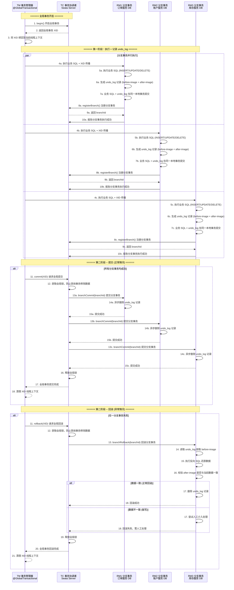
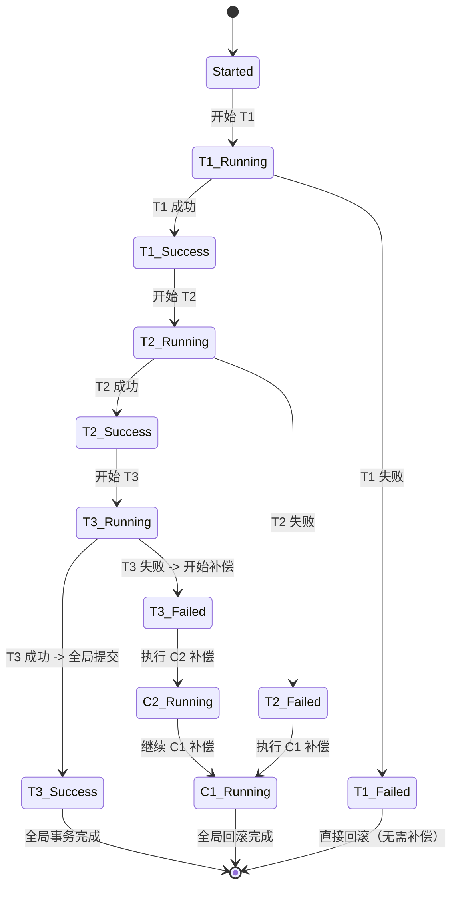
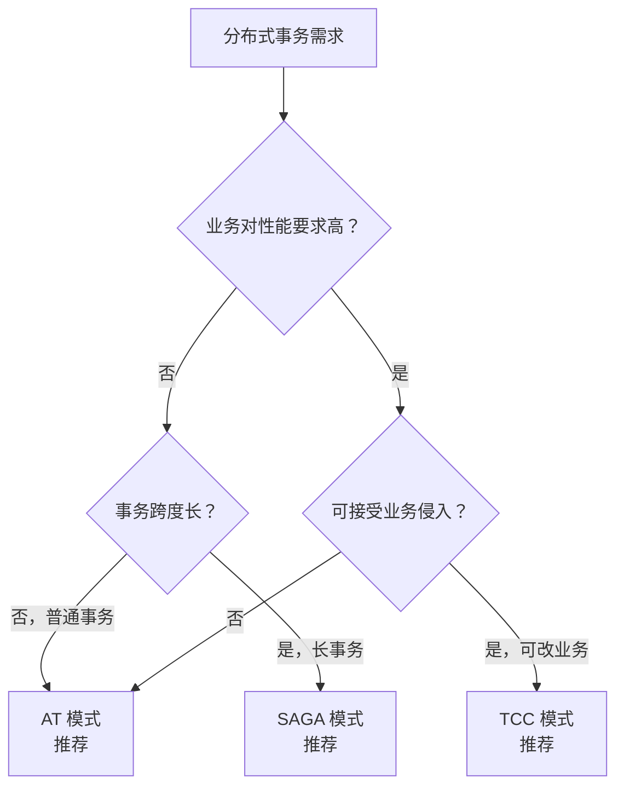

# 分布式事务与 Seata

> 学习路线对应：第5周 -- 微服务与 Spring Cloud > Seata
> 前置知识：数据库事务 ACID、Spring 事务管理

---

## 一、分布式事务概述

### 1.1 为什么需要分布式事务

微服务架构中，一个业务操作可能跨越多个服务和数据库：

```
下单流程：订单服务(写订单表) -> 账户服务(扣余额) -> 库存服务(减库存)
问题：如果库存服务扣减失败，订单和账户操作需要回滚
```

> **生活化类比：** 分布式事务就像跨国银行转账。你要从中国银行转100万到美国银行，这个过程涉及中国银行系统（订单服务）、外汇管理局（账户服务）和美国银行系统（库存服务）。如果美国银行系统接收失败，中国银行那边已经扣了钱怎么办？分布式事务就是要保证要么全部成功（钱扣了、外汇换了、美国收到了），要么全部回滚（钱退回、外汇撤销），不能出现"钱扣了但对方没收到"的尴尬局面。

> **生活化类比：分布式事务 = 跨国公司财务对账** —— 想象一家跨国集团（业务系统），其中国区公司（订单服务）、美国区公司（账户服务）、欧洲区公司（库存服务）各自维护独立账本（独立数据库）。年底集团要合并财报，必须保证三地账本数据完全一致：要么三地都计入"成交 100 万"，要么三地都记"未成交"。如果中国区记了成交但美国区记未成交，财报就会出错。分布式事务的本质就是让分散在多地的独立账本，在一次业务操作中要么"集体记账"要么"集体不记账"，避免出现"半成交"的中间状态。

### 1.2 分布式事务方案对比

| 方案 | 一致性 | 性能 | 复杂度 | 适用场景 |
|------|--------|------|--------|----------|
| **2PC（两阶段提交）** | 强一致 | 低 | 中 | 传统分布式事务 |
| **TCC（Try-Confirm-Cancel）** | 最终一致 | 高 | 高 | 高性能场景 |
| **可靠消息最终一致** | 最终一致 | 高 | 中 | 异步场景 |
| **Seata AT 模式** | 最终一致 | 中 | 低 | 通用场景 |
| **Saga 模式** | 最终一致 | 高 | 中 | 长事务 |

> **生活化类比：2PC（两阶段提交）= 公司重大决策的签字确认流程** —— 2PC 就像公司发布重大决策（如宣布收购另一家公司）的两阶段签字流程。**第一阶段（Prepare 准备阶段）**：CEO（协调者 TC）向各部门主管（参与者 RM）发起征询："收购方案如下，请各部门准备签字并暂停其他操作"。各部门主管确认方案可行后签字表示"准备好"（执行 SQL 但不最终提交，记录 undo_log）。如果任何部门主管拒绝或失联，CEO 立即中止决策。**第二阶段（Commit 提交阶段）**：所有部门主管都签字确认后，CEO 下达"正式生效"指令，各部门同时公开宣布决策生效（提交事务，删除 undo_log）；只要有一个人没签，CEO 下达"取消"指令，所有主管销毁准备好的签字材料（回滚事务）。关键约束：第一阶段签字后必须保持锁定状态等待最终指令，期间不能撤回或反悔。

---

## 二、Seata 核心架构

### 2.1 三大角色

Seata 定义了三大核心角色：

| 角色 | 全称 | 职责 |
|------|------|------|
| **TC** | Transaction Coordinator | 事务协调者（Seata Server），维护全局事务和分支事务状态 |
| **TM** | Transaction Manager | 事务管理器，定义全局事务范围（开启/提交/回滚） |
| **RM** | Resource Manager | 资源管理器，管理分支事务（注册/报告状态/提交/回滚） |

**角色对应关系：**
- TC = 独立部署的 Seata Server
- TM = `@GlobalTransactional` 注解标注的方法所在的 Service
- RM = 每个参与分布式事务的数据库操作对应的 Service

> **生活化类比：** Seata 的 TC（事务协调者）就像国际清算中心。跨国转账时，不同国家的银行之间不直接互相信任，需要一个中立的第三方来协调。中国银行（RM1）告诉清算中心（TC）："我这边钱已经扣了"，美国银行（RM2）告诉清算中心："我这边也准备好了"，转账发起方（TM）向清算中心请求："确认提交吧"。清算中心（TC）统一指挥所有银行：要么全部确认提交，要么全部退回。没有这个中间协调者，各国的银行系统各管各的，出了问题根本不知道找谁。

### 2.2 角色交互流程

```
TM 向 TC 开启全局事务（获得 XID）
  -> RM 执行分支事务（携带 XID）
  -> RM 向 TC 注册分支事务
  -> RM 报告分支事务状态
  -> TM 向 TC 请求提交/回滚
  -> TC 驱动各 RM 提交/回滚
```

---

## 三、AT 模式深度解析

### 3.1 AT 模式原理

AT（Auto Transaction）模式是 Seata 最常用的模式，基于改进的两阶段提交协议，通过**自动生成回滚日志（undo_log）**实现自动回滚，业务代码零侵入。

### 3.2 两阶段流程

**第一阶段（执行 + 记录 undo_log）：**

1. TM 向 TC 开启全局事务，获得 XID
2. RM 执行原始业务 SQL（INSERT/UPDATE/DELETE）
3. RM 自动生成 undo_log（记录回滚 SQL），与业务 SQL 在同一本地事务提交
4. RM 向 TC 注册分支事务并报告成功

**第二阶段 -- 提交：**

1. TC 通知各 RM 提交分支事务
2. RM 异步删除 undo_log 记录

**第二阶段 -- 回滚：**

1. TC 通知各 RM 回滚分支事务
2. RM 读取 undo_log，执行反向 SQL（如 INSERT 对应 DELETE）
3. RM 删除 undo_log 记录

**Seata AT 模式两阶段提交完整时序图：**



> AT 模式的核心在于通过 undo_log 记录数据变更前后镜像，第一阶段同步执行业务 SQL 和 undo_log 并提交本地事务，第二阶段根据全局决议异步删除 undo_log（提交）或执行反向 SQL 回滚（回滚），实现零业务侵入的自动补偿。

### 3.3 undo_log 表结构

```sql
CREATE TABLE `undo_log` (
    `id`            BIGINT(20) NOT NULL AUTO_INCREMENT,
    `branch_id`     BIGINT(20) NOT NULL COMMENT '分支事务 ID',
    `xid`           VARCHAR(100) NOT NULL COMMENT '全局事务 ID',
    `context`       VARCHAR(128) NOT NULL COMMENT '上下文',
    `rollback_info` LONGBLOB NOT NULL COMMENT '回滚信息（序列化的回滚日志）',
    `log_status`    INT(11) NOT NULL COMMENT '0:正常 1:已全局完成',
    `log_created`   DATETIME NOT NULL,
    `log_modified`  DATETIME NOT NULL,
    PRIMARY KEY (`id`),
    UNIQUE KEY `ux_undo_log` (`xid`, `branch_id`)
) ENGINE=InnoDB DEFAULT CHARSET=utf8mb4;
```

### 3.4 AT 模式全局锁

AT 模式在第二阶段提交前，TC 会对涉及的数据行加全局锁，防止其他事务修改：

- 全局锁在 TC 内存中维护
- 锁的粒度是行级（基于主键）
- 事务提交后释放全局锁
- 如果获取全局锁失败，会重试（默认重试 30 次，间隔 10ms）

---

## 四、TCC 模式

### 4.1 TCC 模式原理

TCC（Try-Confirm-Cancel）模式需要业务代码实现三个方法：

| 阶段 | 方法 | 职责 |
|------|------|------|
| **Try** | 资源预留 | 检查资源可用性，预留业务资源 |
| **Confirm** | 确认提交 | 使用 Try 阶段预留的资源，完成业务操作 |
| **Cancel** | 取消回滚 | 释放 Try 阶段预留的资源 |

> **生活化类比：TCC = 预付款机制** —— TCC 模式就像购房时的"诚意金 + 正式签约 + 退款"三步流程。**Try 阶段（付诚意金）**：买家（业务系统）在签合同前先付 10 万诚意金冻结在第三方账户（资源预留：把可用余额扣减，记入冻结金额），表明购房意向但未正式成交。如果买家临时反悔，诚意金可退回（Cancel 阶段：解冻资金，余额恢复）。**Confirm 阶段（正式签约）**：买卖双方都同意后，正式签合同，诚意金自动转为首付的一部分（确认提交：把冻结资金真正扣减，交易完成）。**Cancel 阶段（退款）**：如果任一方反悔，第三方账户立即解冻诚意金（取消回滚：把冻结资金退回到可用余额）。TCC 的核心价值：先冻结资源再确认成交，避免了"钱扣了但交易没成"的尴尬，但需要业务系统额外维护"冻结资金"字段（侵入性强）。

### 4.2 TCC 实现示例

```java
@Service
public class AccountTccService {

    /**
     * Try：冻结资金
     */
    public boolean prepareMinus(Long accountId, BigDecimal amount) {
        // UPDATE account SET frozen = frozen + ?, available = available - ?
        // WHERE available >= ?
        return accountMapper.freeze(accountId, amount);
    }

    /**
     * Confirm：扣减冻结资金
     */
    public boolean commitMinus(Long accountId, BigDecimal amount) {
        // UPDATE account SET frozen = frozen - ?
        return accountMapper.confirmFreeze(accountId, amount);
    }

    /**
     * Cancel：解冻资金
     */
    public boolean rollbackMinus(Long accountId, BigDecimal amount) {
        // UPDATE account SET frozen = frozen - ?, available = available + ?
        return accountMapper.unfreeze(accountId, amount);
    }
}
```

### 4.3 AT 模式 vs TCC 模式

| 维度 | AT 模式 | TCC 模式 |
|------|---------|----------|
| **侵入性** | 无侵入（自动生成回滚日志） | 有侵入（需实现 Try/Confirm/Cancel） |
| **实现难度** | 简单，只需引入依赖 | 复杂，需要自定义资源预留和回滚逻辑 |
| **性能** | 有全局锁，性能一般 | 无锁，性能好 |
| **适用场景** | 大多数场景 | 高性能要求、需要自定义资源 |
| **回滚方式** | 自动（undo_log） | 手动（Cancel 方法） |

### 4.4 SAGA 模式

SAGA 模式是一种长事务解决方案，将一个全局事务拆分为多个本地事务，每个本地事务都有对应的补偿动作。当某个本地事务失败时，反向执行已完成事务的补偿动作，最终达到最终一致。

**SAGA 模式状态机原理：**

```
正向执行：        T1（订单创建）  -> T2（账户扣款）  -> T3（库存扣减）
补偿回滚：C1（订单删除） <- C2（账户退款） <- C3（库存回补）
```

**SAGA 模式状态机流程图：**



**SAGA 模式 JSON 状态机定义示例：**

```json
{
  "Name": "createOrderSaga",
  "Comment": "创建订单 SAGA 事务",
  "StartState": "CreateOrder",
  "States": {
    "CreateOrder": {
      "Type": "ServiceTask",
      "ServiceName": "orderService",
      "ServiceMethod": "create",
      "CompensateState": "CompensateCreateOrder",
      "Next": "DebitAccount"
    },
    "DebitAccount": {
      "Type": "ServiceTask",
      "ServiceName": "accountService",
      "ServiceMethod": "debit",
      "CompensateState": "CompensateDebitAccount",
      "Next": "ReduceInventory"
    },
    "ReduceInventory": {
      "Type": "ServiceTask",
      "ServiceName": "inventoryService",
      "ServiceMethod": "reduce",
      "CompensateState": "CompensateReduceInventory",
      "Next": "Succeed"
    },
    "CompensateCreateOrder": {
      "Type": "ServiceTask",
      "ServiceName": "orderService",
      "ServiceMethod": "delete"
    },
    "CompensateDebitAccount": {
      "Type": "ServiceTask",
      "ServiceName": "accountService",
      "ServiceMethod": "refund"
    },
    "CompensateReduceInventory": {
      "Type": "ServiceTask",
      "ServiceName": "inventoryService",
      "ServiceMethod": "add"
    },
    "Succeed": {
      "Type": "Succeed"
    }
  }
}
```

**SAGA 实现示例：**

```java
@SagaOrchestrator(name = "createOrderSaga")
public class OrderSagaOrchestrator {

    @Autowired
    private OrderService orderService;

    @Autowired
    private AccountService accountService;

    @Autowired
    private InventoryService inventoryService;

    public void execute(Order order) {
        // 状态机自动按 JSON 定义编排
        // T1: 创建订单（补偿：删除订单）
        orderService.create(order);
        // T2: 扣减余额（补偿：退回余额）
        accountService.debit(order.getUserId(), order.getAmount());
        // T3: 扣减库存（补偿：回补库存）
        inventoryService.reduce(order.getProductId(), order.getQuantity());
    }
}
```

### 4.5 AT / TCC / SAGA 模式全面对比

| 维度 | AT 模式 | TCC 模式 | SAGA 模式 |
|------|---------|----------|-----------|
| **侵入性** | 无侵入（自动生成 undo_log） | 高侵入（实现 Try/Confirm/Cancel） | 中等侵入（实现正向 + 补偿方法） |
| **一致性** | 最终一致 | 最终一致 | 最终一致 |
| **性能** | 中（有全局锁） | 高（无锁） | 高（无锁，长事务友好） |
| **隔离性** | 全局锁保证读已提交 | 业务层隔离（资源预留） | 无隔离（需业务容忍脏读） |
| **复杂度** | 低（开箱即用） | 高（业务实现三方法） | 中（定义状态机 + 补偿） |
| **回滚机制** | 自动反向 SQL | 手动 Cancel | 手动补偿动作 |
| **适用场景** | 通用场景、对性能要求不高 | 高性能要求、需自定义资源 | 长事务、跨多业务流程 |
| **业务侵入** | 仅需建表 + 加注解 | 实现接口 + 维护状态 | 定义状态机 JSON |
| **典型业务** | 电商订单、支付 | 账户扣款、库存扣减 | 旅行预订、流程审批 |
| **数据一致性** | 强（自动回滚） | 强（业务保证） | 最终一致（补偿链路长时可能脏读） |

**模式选型决策树：**



> 选型决策树的核心逻辑：先判断业务对性能的要求，再结合事务跨度和业务侵入容忍度选择模式。AT 模式适用于通用场景，TCC 适用于高性能要求且可改业务的场景，SAGA 适用于长事务和多业务流程编排。

### 4.6 Seata Server 集群部署

**生产环境部署架构：**

```
                ┌──────────────┐
                │ Nginx / SLB  │
                │  (VIP 入口)   │
                └──────┬───────┘
        ┌──────────────┼──────────────┐
        ▼              ▼              ▼
   ┌──────────┐   ┌──────────┐   ┌──────────┐
   │ Seata-1  │◄─►│ Seata-2  │◄─►│ Seata-3  │
   │ 8091     │   │ 8091     │   │ 8091     │
   └────┬─────┘   └────┬─────┘   └────┬─────┘
        │              │              │
        └──────────────┼──────────────┘
                       ▼
              ┌─────────────────┐
              │ 存储后端          │
              │ MySQL / Redis   │
              └─────────────────┘
```

**Seata Server 四大核心表（存储模式 = db）：**

| 表名 | 作用 |
|------|------|
| `global_table` | 全局事务表：存储 XID、超时时间、状态（Begin/Commit/Rollback） |
| `branch_table` | 分支事务表：存储分支事务 ID、资源 ID、状态 |
| `lock_table` | 全局锁表：行级锁信息（资源 ID + 主键值） |
| `distributed_lock` | 分布式锁表：Seata Server 主备切换用 |

**集群高可用配置：**

```yaml
seata:
  registry:
    type: nacos                    # 通过 Nacos 注册 Seata Server
    nacos:
      server-addr: 127.0.0.1:8848
      namespace: seata-namespace
      group: SEATA_GROUP
      cluster: default             # 集群名
  config:
    type: nacos                    # 配置中心也使用 Nacos
    nacos:
      server-addr: 127.0.0.1:8848
      namespace: seata-namespace
      group: SEATA_GROUP
```

**注册到 Nacos 后，业务应用通过 Nacos 拉取 Seata Server 列表，自动实现负载均衡和故障转移。**

### 4.7 XA 模式简介

Seata 还支持 XA 模式，基于数据库 XA 协议实现的强一致分布式事务：

| 维度 | XA 模式 | AT 模式 |
|------|---------|---------|
| **一致性** | 强一致 | 最终一致 |
| **隔离性** | 完整（依赖数据库 XA 锁） | 全局锁保证（隔离性较弱） |
| **性能** | 低（长时间持锁） | 中（短时持锁） |
| **侵入性** | 无（依赖数据库） | 无（自动 undo_log） |
| **依赖** | 数据库需支持 XA 协议（MySQL、Oracle） | 仅需 undo_log 表 |
| **适用场景** | 对一致性要求极高的金融场景 | 通用业务场景 |

---

## 五、实战集成

### 5.1 依赖配置

```xml
<dependency>
    <groupId>com.alibaba.cloud</groupId>
    <artifactId>spring-cloud-starter-alibaba-seata</artifactId>
</dependency>
```

### 5.2 配置

```yaml
seata:
  tx-service-group: my_tx_group
  service:
    vgroup-mapping:
      my_tx_group: default
    grouplist:
      default: 127.0.0.1:8091
  registry:
    type: nacos
    nacos:
      server-addr: 127.0.0.1:8848
      namespace: seata-namespace
      group: SEATA_GROUP
```

### 5.3 使用示例

```java
@Service
public class OrderService {

    @Autowired
    private AccountFeignClient accountClient;

    @Autowired
    private InventoryFeignClient inventoryClient;

    @GlobalTransactional(name = "create-order", timeoutMills = 300000)
    public void createOrder(Order order) {
        // TM：开启全局事务
        orderMapper.insert(order);                    // 分支事务 1
        accountClient.debit(order.getAmount());       // 分支事务 2
        inventoryClient.reduce(order.getProductId());  // 分支事务 3
        // 任一分支事务失败，整个全局事务回滚
    }
}
```

---

## 六、常见面试题

### 1. Seata 的三大角色分别是什么？

TC（Transaction Coordinator）：事务协调者，独立部署的 Seata Server，维护全局事务和分支事务状态。TM（Transaction Manager）：事务管理器，`@GlobalTransactional` 标注的方法，定义全局事务范围。RM（Resource Manager）：资源管理器，管理分支事务资源，注册/报告状态/提交/回滚。

### 2. Seata AT 模式的两阶段流程是怎样的？

第一阶段：执行原始 SQL + 生成 undo_log，在同一本地事务中提交。第二阶段：提交时异步删除 undo_log；回滚时读取 undo_log 执行反向 SQL。

### 3. AT 模式和 TCC 模式的核心区别？

AT 模式无侵入（自动生成回滚日志），有全局锁；TCC 模式有侵入（需实现 Try/Confirm/Cancel），无锁，性能更好。AT 模式适合大多数场景，TCC 适合高性能要求场景。

### 4. Seata AT 模式的全局锁有什么作用？

防止在分布式事务提交前，其他事务修改同一数据行。全局锁在 TC 内存中维护，行级粒度，事务提交后释放。获取全局锁失败会重试（默认 30 次，间隔 10ms）。

---

## 七、避坑指南

| 常见错误 | 现象 | 原因 | 解决方案 |
|---------|------|------|---------|
| 未创建 undo_log 表 | AT 模式分布式事务失败 | 每个参与分布式事务的数据库都需要 undo_log 表 | 在每个业务数据库创建 undo_log 表 |
| Seata Server 嵌入业务应用 | 部署耦合，难以独立扩展 | Seata Server 需要独立部署 | Seata Server 必须独立部署，不能嵌入业务应用 |
| 非关系型数据库使用 AT 模式 | 事务回滚失败 | AT 模式依赖数据库事务（ACID） | 非关系型数据库使用 TCC 或 Saga 模式 |
| 全局事务时间过长 | 并发性能下降 | 长时间持有锁影响其他事务 | 避免长事务，缩短全局事务持有锁的时间 |
| Seata Server 单节点部署 | 单点故障，全局事务无法协调 | 单节点故障无备选 | 生产环境配置 Seata Server 集群 |

---

> 📖 **参考链接**：
> - [Seata 官方文档（中文）](https://seata.io/zh-cn/docs/overview/what-is-seata.html) -- Seata 项目总览，含 AT / TCC / SAGA / XA 四种模式介绍
> - [Seata 快速开始](https://seata.io/zh-cn/docs/user/quickstart/) -- Seata Server 下载、启动、业务接入完整流程
> - [Seata AT 模式原理](https://seata.io/zh-cn/docs/dev/mode/at-mode) -- AT 模式两阶段提交、undo_log、全局锁机制详解
> - [Seata TCC 模式原理](https://seata.io/zh-cn/docs/dev/mode/tcc-mode) -- TCC 模式 Try/Confirm/Cancel 设计要点与防悬挂
> - [Seata SAGA 模式原理](https://seata.io/zh-cn/docs/dev/mode/saga-mode) -- SAGA 状态机引擎与 JSON 定义规范
> - [Seata GitHub 源码](https://github.com/apache/incubator-seata) -- Apache Seata 源码仓库
> - [Spring Cloud Alibaba Seata 集成](https://sca.aliyun.com/docs/2023/user-guide/seata/quick-start/) -- Spring Cloud Alibaba 集成 Seata 官方指南

---

> **学习导航**：
> - 返回 [学习路线总览](../../README.md)
> - 本模块其他文件：[05-微服务笔面试题集](./05-微服务笔面试题集.md)
> - 实战应用：[电商订单实时统计分析平台](../../extensions/project/01-电商订单实时统计分析平台.md)


