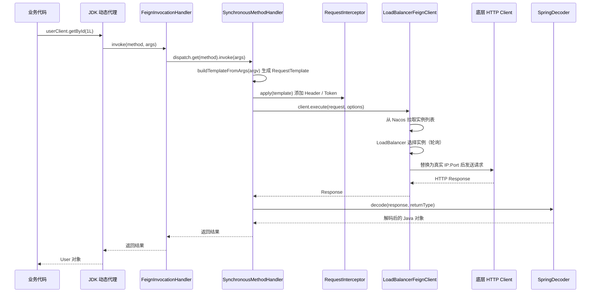

# OpenFeign 声明式调用

> 学习路线对应：第5周 -- 微服务与 Spring Cloud > OpenFeign
> 前置知识：HTTP 协议、Spring Boot、Nacos 服务注册发现
> 对比 Node.js：OpenFeign 约等于 axios 封装，将 HTTP 调用伪装成接口方法调用

---

## 一、核心概念

### 1.1 Feign 是什么

Feign 是一个声明式 HTTP 客户端，灵感来源于 Retrofit、JAXRS-2.0 和 WebSocket。它的核心思想是：定义一个 Java 接口并加上注解，框架自动生成 HTTP 调用逻辑，开发者调用接口方法等同于发起一次 HTTP 请求。

> **生活化类比：Feign = 代驾服务平台** —— 想象你喝完酒需要回家，传统方式（RestTemplate）相当于自己叫车：拿出手机打开 App，手动输入目的地，选车型，确认下单，接到司机电话后还要再确认位置和路线——每一步都要自己操作，每个 HTTP 调用细节都要手写代码。OpenFeign 就像代驾服务平台：你只需要告诉平台"我要回家"（声明一个接口方法 `goHome()`），平台自动帮你完成叫车、确认路线、联系司机、结算费用等所有细节（动态代理生成 HTTP 调用代码）。你只关心"目的地"（业务接口），不关心"怎么到达"（HTTP 细节）。从"命令式"到"声明式"的转变，让代码量大幅减少，可读性显著提升。

> **生活化类比：声明式调用 = 点外卖不用管怎么做** —— RestTemplate 是"自己下厨房"：你要去市场买菜（拼装 URL）、洗菜切菜（构造请求参数）、开火炒菜（执行 HTTP 调用）、装盘上桌（解析响应），每一步都亲自操作。OpenFeign 是"点外卖"：你只需在菜单上勾选"宫保鸡丁"（定义接口方法 `getKungPao()`），后厨自动完成买菜、切配、烹饪、装盒、配送全流程（框架动态生成 HTTP 请求并执行）。你拿到的就是一份完整的菜（解码后的 Java 对象），中间过程完全透明。声明式的核心价值：**"做什么"由你定义，"怎么做"由框架实现**。代码从"指令式食谱"变成"菜单点单"，开发者专注于业务契约，HTTP 调用细节由框架自动处理。

与传统 HTTP 客户端（RestTemplate、HttpClient）相比：

| 维度 | RestTemplate | OpenFeign |
|------|-------------|-----------|
| 调用方式 | 手动拼接 URL、构造请求 | 声明式接口，注解描述请求 |
| 代码可读性 | URL 分散在代码各处 | 接口即契约，集中管理 |
| 负载均衡 | 需配合 @LoadBalanced | 自动集成 |
| 熔断降级 | 需手动处理 | fallback 原生支持 |
| 维护成本 | URL 变更需改代码 | 改注解即可 |

### 1.2 OpenFeign 演进历程

| 阶段 | 维护方 | 状态 | 说明 |
|------|--------|------|------|
| Netflix Feign | Netflix | 停止维护 | 2016 年 Netflix 宣布停更 |
| OpenFeign | 社区 | 活跃 | 从 Netflix Feign 分叉，社区维护 |
| Spring Cloud OpenFeign | Spring 社区 | 活跃 | 整合 OpenFeign + Spring MVC 注解 + LoadBalancer |

Spring Cloud OpenFeign 在原生 OpenFeign 基础上做了三件关键扩展：支持 Spring MVC 注解（@RequestMapping、@PathVariable）、集成 Spring Cloud LoadBalancer 实现服务发现与负载均衡、集成 Sentinel 或 Resilience4j 实现熔断降级。

### 1.3 @FeignClient 注解详解

| 属性 | 作用 | 说明 |
|------|------|------|
| name / value | 服务名 | 用于服务发现，对应注册中心中的服务名 |
| contextId | Bean 标识 | 同一服务多个 FeignClient 接口时，用于区分 Bean，避免名称冲突 |
| url | 直连地址 | 配置后绕过服务发现直接调用，用于调试或调用外部 API |
| path | 路径前缀 | 所有请求统一加前缀，如 path = "/api" |
| configuration | 配置类 | 指定自定义配置类，覆盖全局配置 |
| fallback | 降级类 | 实现该接口的降级类，必须注册为 Spring Bean |
| fallbackFactory | 降级工厂 | 工厂模式创建降级实例，可获取触发降级的异常原因 |
| decode404 | 404 处理 | true 时 404 不抛异常而走 Decoder 解码 |

---

## 二、底层原理

### 2.1 动态代理机制

@FeignClient 标注的接口本身无法实例化，Spring 通过 JDK 动态代理为其创建代理对象。整个链路如下：

```
@FeignClient 接口
  -> FeignClientRegistrar 扫描注册 BeanDefinition
  -> FeignClientFactoryBean.getObject() 创建代理对象
  -> Feign.builder().target() 生成 JDK 动态代理
  -> FeignInvocationHandler（实现 InvocationHandler）
  -> 分发到 MethodHandler（默认 SynchronousMethodHandler）
  -> SynchronousMethodHandler.execute() 真正发起 HTTP 调用
```

FeignInvocationHandler 内部维护一个 Method 到 MethodHandler 的 Map。每次方法调用，InvocationHandler 根据方法签名找到对应的 MethodHandler，由 SynchronousMethodHandler 拼装 HTTP 请求并调用底层 Client（默认使用 JDK HttpURLConnection，生产环境通常替换为 Apache HttpClient 或 OkHttp）执行。

### 2.2 编码解码流程

OpenFeign 处理一次调用的核心组件协作：

| 组件 | 职责 | Spring Cloud OpenFeign 默认实现 |
|------|------|-------------------------------|
| Contract | 解析接口注解，生成 MethodMetadata（请求模板） | SpringMvcContract |
| Encoder | 将方法参数对象编码为 HTTP 请求体 | SpringEncoder |
| Decoder | 将 HTTP 响应体解码为返回类型对象 | SpringDecoder |
| RequestInterceptor | 请求发送前拦截，修改 Header 等 | 无默认，需自定义 |
| Client | 执行实际 HTTP 请求 | Default（JDK HttpURLConnection） |

Contract 在应用启动阶段解析所有 @FeignClient 接口方法上的 Spring MVC 注解（@GetMapping、@PostMapping、@PathVariable、@RequestParam、@RequestBody 等），生成 MethodMetadata。MethodMetadata 包含请求模板（RequestTemplate）、参数索引映射等信息，运行时只需填充参数即可生成完整请求。

### 2.3 负载均衡集成

Spring Cloud 2020.0 版本移除了 Ribbon，OpenFeign 转而集成 Spring Cloud LoadBalancer 实现服务实例选择。

```
Feign 调用 http://user-service/api/users
  -> LoadBalancerFeignClient 拦截
  -> 从注册中心拉取 user-service 实例列表
  -> LoadBalancer 选择策略（默认 RoundRobin 轮询）
  -> 替换为真实 IP:Port，如 http://192.168.1.10:8081/api/users
  -> 底层 Client 发送请求
```

当 @FeignClient 的 url 属性为空时走负载均衡流程；配置了 url 则直接调用该地址，跳过服务发现。

> **生活化类比：负载均衡 = 多个代驾轮流接单** —— OpenFeign + LoadBalancer 的协作就像代驾平台的多司机调度机制。当你（消费者）通过平台叫代驾（调用 user-service）时，平台不会每次都派同一个司机，而是按策略从可用司机列表（服务实例列表）中选择：① **轮询策略（RoundRobin，默认）**：今天派张三、明天李四、后天王五，依次循环，让每个司机工作量均衡；② **随机策略（Random）**：随机派单，概率上长期均衡；③ **最少连接策略（BestAvailable）**：谁手里订单最少就派谁，避免某些司机过载；④ **响应时间加权策略（WeightedResponseTime）**：响应快的司机优先派单，整体效率最高。每次叫代驾前，平台会先查"在岗司机列表"（从 Nacos 拉取实例），剔除请假/罢工的（不健康实例），然后按策略派单。如果某个司机临时失联（实例宕机），平台立即从列表中剔除，下次派单不会再选他（故障转移）。

### 2.4 超时与重试机制

OpenFeign 原生的 Retryer.Default 默认重试 5 次（首次调用 + 4 次重试），采用指数退避策略：初始间隔 100ms，退避倍数 1.5，最大间隔 1s。但 Spring Cloud OpenFeign 将默认 Retryer 改为 NEVER_RETRY，即默认不重试。

| 参数 | 配置项 | 默认值 | 说明 |
|------|--------|--------|------|
| 连接超时 | connect-timeout | 10s | 建立 TCP 连接的超时时间 |
| 读取超时 | read-timeout | 60s | 等待响应数据的超时时间 |
| 重试次数 | Retryer | NEVER_RETRY | Spring Cloud 默认不重试 |

重试有一个重要限制：只有 GET 请求和 IOException 会触发 Retryer 重试，业务异常（如 HTTP 500）默认不重试。这意味着对非幂等的 POST/PUT 接口启用重试需格外谨慎。

### 2.5 日志级别

| 级别 | 输出内容 |
|------|----------|
| NONE | 不输出任何日志（默认） |
| BASIC | 请求方法、URL、响应状态码、耗时 |
| HEADERS | BASIC + 请求/响应头信息 |
| FULL | HEADERS + 请求/响应体及元数据 |

日志生效需要两步配置：设置 Feign 客户端的 Logger.Level，同时将对应包的日志级别设为 DEBUG（因为 Feign 日志走 slf4j，只在 DEBUG 级别输出）。少配置任何一步都不会有日志产生。

### 2.6 拦截器机制

RequestInterceptor 在请求发送前被调用，可用于统一添加 Header、Token、链路追踪 ID 等信息。实现 RequestInterceptor 接口并注册为 Spring Bean 后，所有 Feign 客户端自动生效。如需针对特定客户端，可通过 @FeignClient 的 configuration 属性指定，该配置类中的拦截器只对当前客户端生效。

### 2.7 降级 fallback vs fallbackFactory

| 维度 | fallback | fallbackFactory |
|------|----------|------------------|
| 实现方式 | 直接实现接口 | 实现 FallbackFactory<T> 工厂接口 |
| 异常原因 | 无法获取 | 可通过工厂方法参数 cause 获取 |
| 适用场景 | 简单降级，返回默认值 | 需记录降级原因、区分异常类型 |
| 代码侵入 | 低 | 中 |

fallbackFactory 的核心优势在于：fallback 方法被调用时，能拿到触发降级的原始异常对象，便于记录日志、触发告警和区分错误类型采取不同降级策略。

---

## 三、实战应用

### 3.1 完整 OpenFeign 使用示例

依赖配置：

```xml
<dependency>
    <groupId>org.springframework.cloud</groupId>
    <artifactId>spring-cloud-starter-openfeign</artifactId>
</dependency>
<dependency>
    <groupId>org.springframework.cloud</groupId>
    <artifactId>spring-cloud-starter-loadbalancer</artifactId>
</dependency>
<!-- 降级功能依赖（Spring Cloud 2020.0+ 需引入熔断器） -->
<dependency>
    <groupId>com.alibaba.cloud</groupId>
    <artifactId>spring-cloud-starter-alibaba-sentinel</artifactId>
</dependency>
```

启动类开启 Feign：

```java
@SpringBootApplication
@EnableFeignClients
public class OrderApplication {
    public static void main(String[] args) {
        SpringApplication.run(OrderApplication.class, args);
    }
}
```

定义 Feign 客户端接口：

```java
@FeignClient(
    name = "user-service",
    path = "/api/users",
    fallbackFactory = UserClientFallbackFactory.class
)
public interface UserClient {

    @GetMapping("/{id}")
    Result<User> getById(@PathVariable("id") Long id);

    @PostMapping
    Result<User> create(@RequestBody UserDTO dto);

    @GetMapping
    Result<List<User>> list(@RequestParam("page") int page,
                            @RequestParam("size") int size);
}
```

### 3.2 超时重试配置

```yaml
spring:
  cloud:
    openfeign:
      client:
        config:
          default:                # 全局配置
            connect-timeout: 3000  # 连接超时 3s
            read-timeout: 5000     # 读取超时 5s
            logger-level: BASIC
          user-service:            # 针对特定服务覆盖全局配置
            read-timeout: 10000    # user-service 读取超时 10s
```

启用重试需通过自定义 Retryer Bean（Spring Cloud 默认 NEVER_RETRY）：

```java
@Configuration
public class FeignRetryConfig {

    @Bean
    public Retryer feignRetryer() {
        // 参数：初始间隔 1s，最大间隔 5s，最大尝试次数 5（含首次）
        return new Retryer.Default(1000, 5000, 5);
    }
}
```

### 3.3 日志级别配置

```yaml
# 第一步：设置 Feign 日志级别
spring:
  cloud:
    openfeign:
      client:
        config:
          default:
            logger-level: FULL

# 第二步：设置接口包的日志级别为 DEBUG
logging:
  level:
    com.example.order.feign: debug
```

两步缺一不可。logger-level 控制输出内容的详细程度，logging.level 控制 slf4j 是否输出该包的 DEBUG 日志。生产环境建议使用 BASIC 级别，避免 FULL 级别输出请求体导致的性能问题和敏感信息泄露。

### 3.4 自定义拦截器传递 JWT Token

微服务间调用需要透传用户身份信息，通过 RequestInterceptor 统一添加 JWT Header：

```java
@Component
public class AuthRequestInterceptor implements RequestInterceptor {

    @Override
    public void apply(RequestTemplate template) {
        // 从当前请求上下文获取 Token
        HttpServletRequest request = ((ServletRequestAttributes)
            RequestContextHolder.getRequestAttributes()).getRequest();

        String token = request.getHeader("Authorization");
        if (StringUtils.hasText(token)) {
            template.header("Authorization", token);
        }

        // 同时透传 traceId，便于链路追踪关联
        String traceId = request.getHeader("X-Trace-Id");
        if (StringUtils.hasText(traceId)) {
            template.header("X-Trace-Id", traceId);
        }
    }
}
```

RequestInterceptor 实现类注册为 Spring Bean 后，所有 Feign 客户端自动生效。如需针对特定客户端，可通过 @FeignClient 的 configuration 属性指定。

### 3.5 fallbackFactory 实战

```java
@Component
@Slf4j
public class UserClientFallbackFactory implements FallbackFactory<UserClient> {

    @Override
    public UserClient create(Throwable cause) {
        // 记录降级原因，便于排查问题
        log.error("调用 user-service 触发降级，原因：{}", cause.getMessage());

        return new UserClient() {
            @Override
            public Result<User> getById(Long id) {
                // 根据异常类型区分处理
                if (cause instanceof SocketTimeoutException) {
                    log.warn("user-service 响应超时，返回降级用户");
                }
                return Result.fail("用户服务不可用，降级返回默认用户");
            }

            @Override
            public Result<User> create(UserDTO dto) {
                return Result.fail("用户服务不可用，创建失败");
            }

            @Override
            public Result<List<User>> list(int page, int size) {
                // 返回空列表作为降级值，保证调用方不报错
                return Result.ok(Collections.emptyList());
            }
        };
    }
}
```

cause 参数携带了触发降级的原始异常（如 SocketTimeoutException、FeignException），可根据异常类型返回不同的降级策略，例如超时返回缓存数据、服务不可用返回空值。

### 3.6 Feign 调用链深度剖析

**从接口方法到 HTTP 请求的完整源码链路：**

```java
// 1. 用户调用接口方法
User user = userClient.getById(1L);

// 2. JDK 动态代理拦截，进入 FeignInvocationHandler
public class FeignInvocationHandler implements InvocationHandler {
    private final Map<Method, MethodHandler> dispatch;
    
    @Override
    public Object invoke(Object proxy, Method method, Object[] args) {
        // 根据 Method 找到对应的 MethodHandler
        return dispatch.get(method).invoke(args);
    }
}

// 3. SynchronousMethodHandler 拼装请求并执行
public class SynchronousMethodHandler implements MethodHandler {
    
    @Override
    public Object invoke(Object[] argv) {
        // 3.1 根据 MethodMetadata 模板 + 参数生成 RequestTemplate
        RequestTemplate template = buildTemplateFromArgs.create(argv);
        
        // 3.2 克隆请求选项（超时、重试）
        Options options = findOptions(argv);
        
        // 3.3 执行重试逻辑
        Retryer retryer = this.retryer.clone();
        while (true) {
            try {
                return executeAndDecode(template, options);
            } catch (RetryableException e) {
                // 重试判断
                retryer.continueOrPropagate(e);
            }
        }
    }
    
    Object executeAndDecode(RequestTemplate template, Options options) {
        // 3.4 应用所有 RequestInterceptor
        Request request = targetRequest(template);
        
        // 3.5 通过 Client 发送请求（默认 JDK HttpURLConnection）
        Response response = client.execute(request, options);
        
        // 3.6 解码响应
        return decoder.decode(response, metadata.returnType());
    }
}
```

**关键组件协作时序：**



> OpenFeign 的调用链路从 JDK 动态代理入口出发，经过 FeignInvocationHandler 分发到 SynchronousMethodHandler，由 RequestInterceptor 增强 Header，LoadBalancerFeignClient 完成服务发现与实例选择，最终由底层 HTTP Client 发起请求并经 Decoder 解码返回 Java 对象，全程对业务代码透明。

### 3.7 超时与重试进阶配置

**多层级超时体系：**

| 层级 | 配置项 | 默认值 | 说明 |
|------|--------|--------|------|
| **Feign 层** | connect-timeout | 10s | 建立 TCP 连接超时 |
| **Feign 层** | read-timeout | 60s | 等待响应数据超时 |
| **底层 Client** | HttpClient 连接池 | 系统默认 | 连接获取超时 |
| **LoadBalancer** | 实例选择超时 | 5s | 从注册中心获取实例超时 |

**不同业务场景的超时配置建议：**

```yaml
spring:
  cloud:
    openfeign:
      client:
        config:
          default:                  # 全局默认配置
            connect-timeout: 3000    # 连接 3s
            read-timeout: 5000       # 读取 5s
          user-service:              # 普通查询服务
            read-timeout: 3000       # 快速查询 3s
          report-service:            # 报表生成服务
            read-timeout: 60000      # 复杂计算 60s
          file-service:              # 文件上传下载
            read-timeout: 120000     # 大文件 120s
```

**自定义重试策略（区分异常类型）：**

```java
@Configuration
public class FeignRetryConfig {

    @Bean
    public Retryer feignRetryer() {
        // 重试 3 次（含首次），初始间隔 200ms，最大间隔 1s
        return new Retryer.Default(200, 1000, 3);
    }

    @Bean
    public ErrorDecoder errorDecoder() {
        // 自定义错误解码器：将 HTTP 500 转为可重试异常
        return (methodKey, response) -> {
            if (response.status() >= 500) {
                return new RetryableException(
                    response.status(),
                    "Server error, retryable",
                    response.request().httpMethod(),
                    (Long) null,
                    response.request());
            }
            // 4xx 错误不重试
            return new Default().decode(methodKey, response);
        };
    }
}
```

**重试注意事项：**

| 场景 | 是否重试 | 原因 |
|------|----------|------|
| GET 请求 + IOException | 重试 | 幂等，网络抖动可恢复 |
| GET 请求 + HTTP 500 | 默认不重试 | 服务端错误，重试无意义（自定义 ErrorDecoder 可启用） |
| POST/PUT 请求 + IOException | 默认不重试 | 非幂等，重试可能重复操作 |
| 业务异常（4xx） | 不重试 | 客户端错误，重试无意义 |

### 3.8 性能优化最佳实践

**1. 替换默认 HTTP Client 为 Apache HttpClient / OkHttp：**

```xml
<!-- 替换 JDK HttpURLConnection，启用连接池 -->
<dependency>
    <groupId>io.github.openfeign</groupId>
    <artifactId>feign-httpclient</artifactId>
</dependency>
```

```yaml
spring:
  cloud:
    openfeign:
      httpclient:
        enabled: true              # 启用 Apache HttpClient
        max-connections: 200       # 连接池最大连接数
        max-connections-per-route: 50  # 每个路由最大连接数
        connection-timeout: 3000   # 连接超时
        connection-timer-repeat: 3000  # 连接池清理周期
```

**2. 开启 Gzip 压缩：**

```yaml
spring:
  cloud:
    openfeign:
      compression:
        request:
          enabled: true
          mime-types: application/json  # 压缩请求
          min-request-size: 2048       # 最小压缩阈值 2KB
        response:
          enabled: true                # 压缩响应
```

**3. 异步化调用（Feign + CompletableFuture）：**

```java
@FeignClient(name = "user-service")
public interface UserClient {
    // 异步调用，返回 CompletableFuture
    @GetMapping("/{id}")
    CompletableFuture<Result<User>> getByIdAsync(@PathVariable("id") Long id);
}

// 业务层并行调用多个服务
public UserOrderDTO getUserAndOrder(Long userId) {
    CompletableFuture<Result<User>> userFuture = userClient.getByIdAsync(userId);
    CompletableFuture<Result<Order>> orderFuture = orderClient.getByUserAsync(userId);
    
    // 等待两个调用都完成
    CompletableFuture.allOf(userFuture, orderFuture).join();
    
    return new UserOrderDTO(userFuture.get().getData(), orderFuture.get().getData());
}
```

**4. 连接池调优建议：**

| 配置项 | 推荐值 | 说明 |
|--------|--------|------|
| max-connections | 200-500 | 总连接数，根据并发量调整 |
| max-connections-per-route | 50-100 | 单服务连接数，避免某服务占用全部连接 |
| connection-timeout | 3000ms | 连接超时不宜过长 |
| keep-alive-time | 60s | 连接保持时间，过短频繁建连 |
| enable-connection-pool | true | 必须启用连接池，避免每次新建 TCP 连接 |

**5. Feign 与 RestTemplate 性能对比：**

| 维度 | OpenFeign | RestTemplate |
|------|-----------|--------------|
| 调用方式 | 动态代理 | 直接调用 |
| 连接池 | 默认无，需配置 | 需手动配置 |
| 重试机制 | 框架内置 | 需自己实现 |
| 负载均衡 | 自动集成 | 需 @LoadBalanced |
| 熔断降级 | 原生支持 | 需 Hystrix/Sentinel |
| 性能（同等配置） | 接近 | 接近 |
| 开发效率 | 高 | 中 |
| 推荐场景 | 微服务间调用 | 简单 HTTP 调用、外部 API |

---

## 四、常见面试题

### 1. OpenFeign 的动态代理原理是什么？

启动时 FeignClientRegistrar 扫描 @FeignClient 注解的接口，注册 FeignClientFactoryBean。调用 getObject() 时，Feign.builder() 使用 JDK 动态代理为目标接口创建代理对象，代理逻辑由 FeignInvocationHandler 处理。每次方法调用，InvocationHandler 根据方法签名找到对应的 SynchronousMethodHandler，由它拼装 HTTP 请求并通过底层 Client 发送。Contract 在启动阶段已完成注解解析生成 MethodMetadata，运行时只需填充参数。

### 2. fallback 和 fallbackFactory 的区别？

fallback 直接指定降级类，实现简单但无法获取触发降级的异常信息。fallbackFactory 通过 FallbackFactory 接口创建降级实例，create(Throwable cause) 方法的 cause 参数携带原始异常，可记录日志、区分异常类型并采取不同降级策略。生产环境推荐使用 fallbackFactory，便于问题排查。

### 3. Spring Cloud OpenFeign 默认会重试吗？

不会。OpenFeign 原生的 Retryer.Default 默认重试 5 次，但 Spring Cloud OpenFeign 将默认 Retryer 改为 NEVER_RETRY，避免在不知情的情况下产生重复请求。需手动定义 Retryer Bean 才能启用。此外重试只针对 GET 请求和 IOException，业务异常默认不重试。

### 4. OpenFeign 日志配置不生效的原因？

Feign 日志输出需要同时满足两个条件：设置 Feign 客户端的 Logger.Level（控制输出详细度），并将 Feign 接口所在包的 logging.level 设为 DEBUG（因为 Feign 日志走 slf4j 且只在 DEBUG 级别输出）。只配置其中一个都不会有日志输出。这是最常见的 OpenFeign 配置陷阱。

### 5. OpenFeign 如何集成负载均衡？

当 @FeignClient 的 url 属性为空时，请求经过 LoadBalancerFeignClient 拦截，从注册中心拉取目标服务的实例列表，通过 Spring Cloud LoadBalancer（默认轮询策略）选择一个实例，将服务名替换为真实 IP:Port 后发送请求。配置 url 属性则直接调用该地址，跳过负载均衡。

---

## 五、避坑指南

| 常见错误 | 现象 | 原因 | 解决方案 |
|---------|------|------|---------|
| 日志不输出 | 配置了 logger-level 但看不到日志 | 未将接口包 logging.level 设为 DEBUG | 同时配置 feign logger-level 和 logging.level.package=debug |
| fallback 不生效 | 服务异常时未触发降级 | 降级类未注册为 Spring Bean，或未引入熔断器依赖 | 降级类加 @Component；Spring Cloud 2020.0+ 需引入 spring-cloud-starter-circuitbreaker-sentinel |
| GET 请求传对象参数报错 | 参数丢失或返回 400 错误 | Feign 对 GET 请求的对象参数默认不展开为 query 参数 | 使用 @RequestParam 逐个标注参数，或配置 queryMapEncoder |
| contextId 缺失导致冲突 | 同一服务多个 FeignClient 启动报 BeanDefinitionStoreException | 多个接口 name 相同，Bean 名称冲突 | 为不同接口设置不同 contextId |
| 连接超时和读取超时混淆 | 调用偶发超时但未触发降级 | read-timeout 设置过大，请求长时间阻塞线程 | 区分 connect-timeout（建立连接）和 read-timeout（读取数据），按业务场景分别设置 |
| 超时后默认不重试 | 偶发网络抖动导致调用失败 | Spring Cloud 默认 NEVER_RETRY | 评估后手动配置 Retryer Bean，注意只对幂等接口启用重试 |
| 生产环境使用 FULL 日志 | 性能下降，敏感信息泄露 | FULL 级别输出请求/响应完整内容 | 生产环境使用 BASIC 级别，调试时临时开启 FULL |

---

> 📖 **参考链接**：
> - [Spring Cloud OpenFeign 官方文档](https://docs.spring.io/spring-cloud-openfeign/docs/current/reference/html/) -- Spring Cloud OpenFeign 完整参考手册，含 @FeignClient、动态代理、负载均衡、熔断降级
> - [OpenFeign GitHub](https://github.com/OpenFeign/feign) -- OpenFeign 原生项目源码，含 FeignInvocationHandler / SynchronousMethodHandler 实现
> - [Spring Cloud LoadBalancer](https://docs.spring.io/spring-cloud/docs/current/reference/html/) -- Spring Cloud 替代 Ribbon 的负载均衡器，OpenFeign 默认集成
> - [Spring Cloud Circuit Breaker](https://docs.spring.io/spring-cloud/docs/current/reference/html/) -- Spring Cloud 抽象的熔断器接口，配合 Feign fallback 使用
> - [Apache HttpClient 连接池](https://hc.apache.org/httpcomponents-client-5.4.x/) -- Feign 替换 JDK HttpURLConnection 的高性能 HTTP Client
> - [Spring Cloud Alibaba Sentinel 集成](https://sca.aliyun.com/docs/2023/user-guide/sentinel/quick-start/) -- Sentinel 与 OpenFeign 集成实现熔断降级

---

> **学习导航**：
> - 返回 [学习路线总览](../../README.md)
> - 本模块其他文件：[05-微服务笔面试题集](./05-微服务笔面试题集.md)
> - 实战应用：[电商订单实时统计分析平台](../../extensions/project/01-电商订单实时统计分析平台.md)

