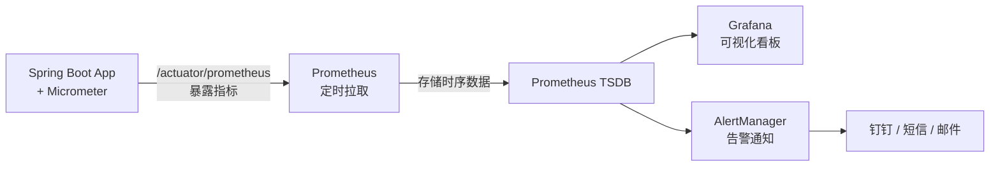
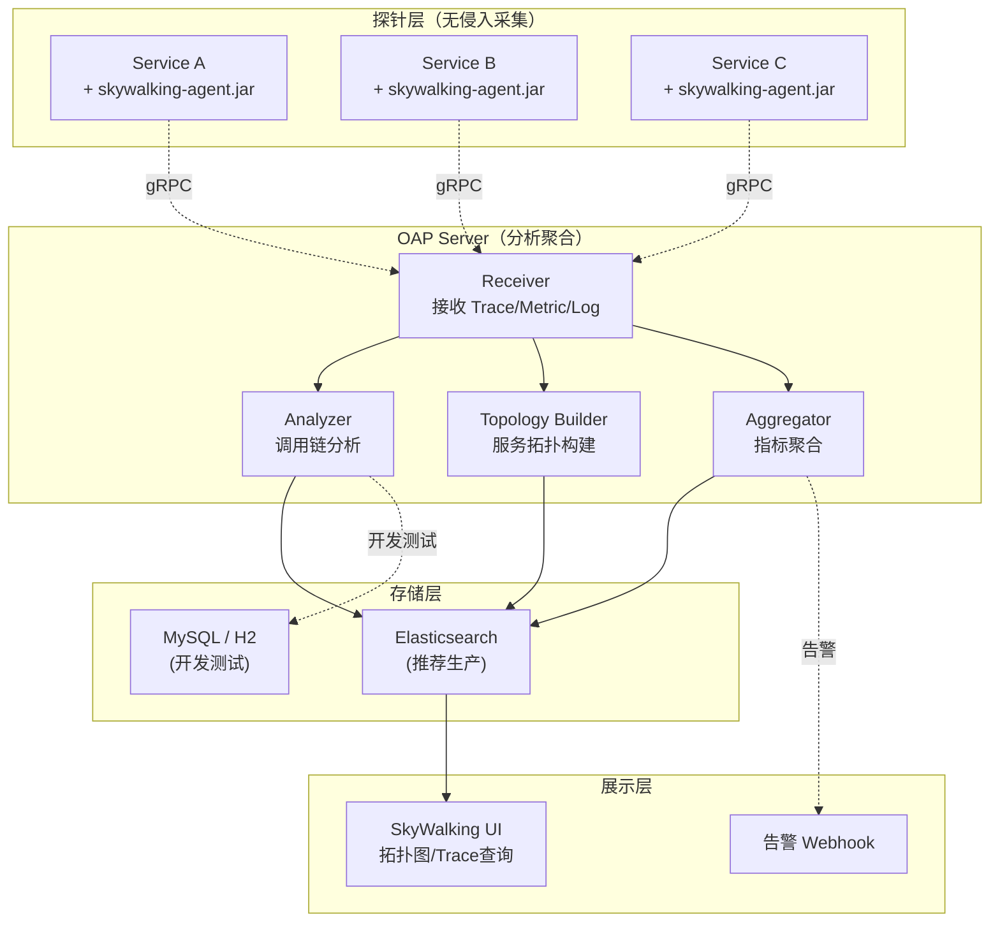
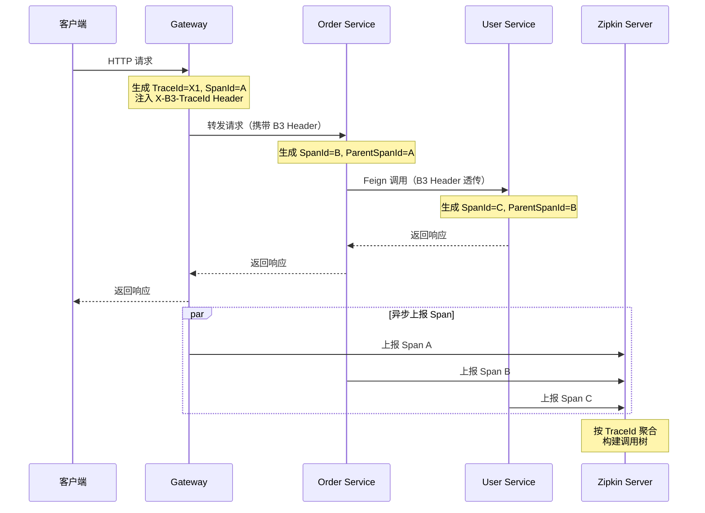
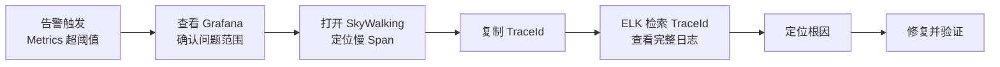

# 链路追踪与可观测性

> 学习路线对应：第5周 -- 微服务与 Spring Cloud > 可观测性
> 前置知识：微服务架构、日志框架（Logback/SLF4J）
> 对比 Node.js：链路追踪约等于前端性能埋点 + 全链路日志关联

---

## 一、核心概念

### 1.1 可观测性三大支柱

可观测性（Observability）指通过外部输出推断系统内部状态的能力，由三大支柱构成：

| 支柱 | 英文 | 核心作用 | 特征 | 典型工具 |
|------|------|----------|------|----------|
| 指标 | Metrics | 量化系统运行状态 | 聚合数据、低存储成本、适合告警 | Prometheus、Micrometer |
| 链路追踪 | Tracing | 还原请求在分布式系统中的完整路径 | 跨服务关联、因果链路 | SkyWalking、Zipkin、Jaeger |
| 日志 | Logging | 记录离散事件细节 | 上下文丰富、存储成本高 | ELK、Loki |

三者互补：Metrics 回答"出没出问题"，Tracing 回答"问题在哪一段"，Logging 回答"具体出了什么错"。

### 1.2 为什么需要链路追踪

单体架构中，一次请求在一个进程内完成，通过日志即可定位问题。微服务架构下一次请求可能经过多个服务：

```
用户下单请求
  -> Gateway（网关鉴权）
  -> Order Service（创建订单）
    -> User Service（查询用户信息）
    -> Product Service（查询商品、扣库存）
    -> Payment Service（调用支付）
      -> 第三方支付网关（外部调用）
  -> 返回结果
```

当请求变慢或报错时，没有链路追踪，几乎无法判断是哪个环节出了问题。链路追踪通过唯一的 TraceId 将跨服务的调用串联起来，形成完整的调用树，让问题定位从"猜测"变成"看图"。

> **生活化类比：链路追踪 = 快递物流追踪系统** —— 想象你在淘宝下单（一次用户请求），包裹从杭州仓库发出，途经上海分拣中心、北京转运站、最后到你家门口。每个中转站点都会扫描包裹条码（生成 Span），记录到达时间、离开时间、操作人等信息。**TraceId** 就是快递单号，贯穿整个物流链路；**Span** 就是每个中转站的扫描记录，记录"这一段"的耗时和状态；**ParentSpanId** 是上一站的扫描记录，串成"杭州仓库 -> 上海分拣 -> 北京转运 -> 家门口"的完整链路。如果包裹延误（请求变慢），你打开物流详情（Trace 详情页）一眼就能看到"上海分拣中心停留了 5 小时"（User Service 耗时 5s），而不是打电话给每个站点逐一询问（翻看每个服务的日志）。**TraceId 让"分布式黑盒"变成"可视化物流图"**。

### 1.3 主流方案对比

| 维度 | SkyWalking | Zipkin | Jaeger | Pinpoint |
|------|-----------|--------|--------|----------|
| 出品方 | Apache | Twitter | CNCF/Uber | Naver |
| 侵入性 | 无侵入（Java Agent） | 中（需引入 Brave 库） | 低（OpenTelemetry SDK） | 无侵入（Java Agent） |
| 协议标准 | OpenTelemetry | B3 / W3C | Jaeger / W3C | 自有协议 |
| 存储 | ES / H2 / MySQL | ES / MySQL / Cassandra | ES / Cassandra | HBase |
| APM 能力 | 强（指标+链路+拓扑图） | 弱（仅链路） | 中 | 强 |
| UI 功能 | 服务拓扑图、慢调用分析 | 链路查询、依赖图 | 链路查询、依赖图 | 服务拓扑、调用树 |
| 社区活跃度 | 高（Apache 顶级项目） | 中 | 高（CNCF 毕业项目） | 低 |

SkyWalking 和 Pinpoint 通过 Java Agent 实现无侵入采集，适合不想改业务代码的团队。Zipkin 和 Jaeger 轻量、生态成熟，适合云原生场景。

---

## 二、底层原理

### 2.1 Trace/Span 模型

链路追踪的数据模型由 Trace 和 Span 两层结构构成：

```
Trace（完整调用链，全局唯一 TraceId）
├── Span A（Gateway 接收请求，根 Span）
│   ├── Span B（Order Service 处理订单）
│   │   ├── Span C（User Service 查询用户）
│   │   ├── Span D（Product Service 扣库存）
│   │   └── Span E（Payment Service 调用支付）
│   │       └── Span F（第三方支付网关调用）
```

| 概念 | 说明 |
|------|------|
| Trace | 一次完整请求的调用链，由全局唯一的 TraceId 标识 |
| Span | 一次操作（RPC 调用、数据库查询等），包含操作名、起止时间、标签、日志 |
| Parent Span | 当前 Span 的调用者，通过 parentSpanId 构成父子关系 |
| SpanContext | 跨进程传播的上下文，包含 traceId、spanId、采样标志 |

Span 的核心属性包括：

| 属性 | 说明 | 示例 |
|------|------|------|
| operationName | 操作名称 | GET /api/users |
| startTime / endTime | 起止时间戳 | 用于计算耗时 |
| tags | 键值对标签 | http.status_code=200, db.statement=SELECT |
| logs | 事件日志 | 记录异常堆栈、业务事件 |
| spanType | Span 类型 | Entry / Local / Exit |

Span 类型区分了三种角色：Entry Span 对应服务接收请求（如 Tomcat 入口），Local Span 对应服务内部操作（如业务逻辑处理），Exit Span 对应服务发起外部调用（如 Feign 调用、数据库访问）。通过类型可快速在调用树中定位是入口、内部还是出口环节出了问题。

Span 之间的父子关系构成有向无环树（DAG），根 Span 通常对应入口请求（如网关接收 HTTP 请求）。

### 2.2 上下文传播

链路追踪的核心难题是：TraceId 如何在跨服务调用时传递。答案是通过 HTTP Header 注入和提取上下文。

**W3C TraceContext 标准（traceparent Header）：**

```
traceparent: 00-<traceId>-<spanId>-<traceFlags>
示例: traceparent: 00-0af7651916cd43dd8448eb211c80319c-b7ad6b7169203331-01

格式拆解：
  00                              版本号
  0af7651916cd43dd8448eb211c80319c  TraceId（32 位十六进制）
  b7ad6b7169203331                SpanId / ParentId（16 位十六进制）
  01                              采样标志（01=采样，00=不采样）
```

**B3 Header（Zipkin 原生协议）：**

| Header | 说明 |
|--------|------|
| X-B3-TraceId | 全局 TraceId（16 或 32 位十六进制） |
| X-B3-SpanId | 当前 SpanId（16 位十六进制） |
| X-B3-ParentSpanId | 父级 SpanId |
| X-B3-Sampled | 采样标志（1=采样，0=不采样） |

传播流程：服务 A 调用服务 B 时，A 的 Tracer 将 SpanContext 注入 HTTP Header；服务 B 收到请求后，Tracer 从 Header 提取 SpanContext，创建子 Span 并继续向下游传播。Header 丢失会导致链路断裂。

### 2.3 采样策略

全量采样在生产环境中会产生巨大的数据量和性能开销，采样策略控制"记录多少比例的链路"：

| 策略 | 原理 | 适用场景 | 默认值 |
|------|------|----------|--------|
| 全量采样 | 100% 记录所有请求 | 开发测试环境、低流量服务 | - |
| 概率采样 | 按比例随机采样 | 生产环境通用场景 | 0.1（10%） |
| 限流采样 | 限制每秒采样数 | 保护后端存储 | - |
| 自适应采样 | 根据错误率/延迟动态调整 | 高级场景 | - |

Sleuth 默认采样率为 0.1（每 10 个请求采样 1 个）。生产环境通常设为 0.1 到 0.5 之间，排障期临时调高到 1.0。

采样决策在链路入口（根 Span）做出后，通过 Sampled 标志位随 SpanContext 向下游传播。下游服务收到已采样的请求会继续创建 Span 并上报，收到未采样的请求则跳过上报。这保证了同一条链路要么完整记录要么完全不记录，不会出现链路断裂。

### 2.4 SkyWalking 原理

SkyWalking 采用 Java Agent 字节码增强技术，实现零代码侵入的链路采集：

```
JVM 启动加载 skywalking-agent.jar（通过 -javaagent 参数）
  -> premain 方法拦截关键类（Tomcat、SpringMVC、MySQL Driver、Feign 等）
  -> 方法执行前后插入埋点逻辑（创建 Span、记录耗时）
  -> 通过 gRPC 上报到 OAP Server
  -> OAP Server 分析聚合（构建服务拓扑、计算指标）
  -> 存储到 Elasticsearch / H2 / MySQL
  -> UI 展示拓扑图、链路详情、慢调用分析
```

Java Agent 在类加载阶段修改字节码（ByteBuddy），在目标方法前后插入探针逻辑。业务代码完全无感知，无需引入任何依赖或修改任何代码。

### 2.5 Zipkin 原理

Zipkin 的数据采集依赖应用内嵌的 Tracer 库（Java 中是 Brave）：

```
应用内嵌 Brave 库
  -> Tracer 创建 Span（通过拦截器自动埋点）
  -> Span 数据异步上报到 Zipkin Server（HTTP 或 MQ）
  -> Zipkin Server 存储到 ES / MySQL / Cassandra
  -> Zipkin UI 查询展示链路树、依赖图
```

相比 SkyWalking 的 Agent 方式，Zipkin 需要在应用中引入 Brave 依赖并配置，侵入性中等。Spring Cloud Sleuth 封装了 Brave，简化了集成。

Brave 通过 Tracing 类管理 Span 生命周期，通过 Tracing.currentTracer() 获取当前 Tracer。自动埋点依赖各组件的拦截器（如 HttpTracing 包装 Servlet Filter、HttpClientHandler 包装 HTTP 客户端），在请求进出时自动创建和关闭 Span。Span 数据先在内存中异步累积，批量上报到 Zipkin Server，避免每次请求同步网络开销。

---

## 三、实战应用

### 3.1 Spring Cloud 集成 SkyWalking（Agent 挂载方式）

无需修改业务代码和引入依赖，仅通过 JVM 启动参数挂载 Agent：

```bash
java \
  -javaagent:/path/to/skywalking-agent.jar \
  -Dskywalking.agent.service_name=order-service \
  -Dskywalking.collector.backend_service=127.0.0.1:11800 \
  -Dskywalking.agent.instance_name=order-01 \
  -jar order-service.jar
```

| 参数 | 说明 |
|------|------|
| -javaagent | 指定 Agent jar 路径，JVM 启动时加载 |
| service_name | 服务名称，用于标识链路归属 |
| backend_service | OAP Server 地址（gRPC 端口默认 11800） |
| instance_name | 实例名称，区分同一服务的多个实例 |

在 Docker/K8s 环境中，通常通过 sidecar 或 init-container 将 Agent jar 挂载到容器中，实现与应用镜像解耦。Agent 版本与 OAP Server 版本需保持一致，否则可能出现协议不兼容。

Docker 部署示例：

```dockerfile
FROM eclipse-temurin:17-jdk-jammy
COPY target/order-service.jar /app/order-service.jar
COPY skywalking-agent.jar /app/skywalking-agent.jar
ENV JAVA_OPTS="-javaagent:/app/skywalking-agent.jar \
  -Dskywalking.agent.service_name=order-service \
  -Dskywalking.collector.backend_service=oap:11800"
ENTRYPOINT java $JAVA_OPTS -jar /app/order-service.jar
```

OAP Server 通常通过 Docker Compose 部署，搭配 Elasticsearch 作为存储后端。Agent 通过 gRPC（端口 11800）上报数据，UI 通过 HTTP（端口 8080）访问。完整部署链路：Agent -> OAP Server -> Elasticsearch -> UI。

### 3.2 Spring Cloud Sleuth + Zipkin 集成

依赖配置：

```xml
<dependency>
    <groupId>org.springframework.cloud</groupId>
    <artifactId>spring-cloud-starter-sleuth</artifactId>
</dependency>
<dependency>
    <groupId>org.springframework.cloud</groupId>
    <artifactId>spring-cloud-sleuth-zipkin</artifactId>
</dependency>
```

> 注意：Spring Cloud 2022.0.0 起 Sleuth 已废弃，迁移至 Micrometer Tracing。新项目建议直接使用基于 Micrometer Tracing 的 spring-cloud-starter-zipkin，配置方式基本一致。

应用配置：

```yaml
spring:
  zipkin:
    base-url: http://127.0.0.1:9411    # Zipkin Server 地址
    sender:
      type: web                         # 上报方式：web(HTTP) 或 rabbit/kafka
  sleuth:
    sampler:
      probability: 1.0                  # 采样率 100%（生产环境建议 0.1）
    propagation:
      type: B3                          # 上下文传播协议：B3 或 W3C
```

Sleuth 自动为以下组件注入链路追踪：Spring MVC 请求入口、OpenFeign 调用、RestTemplate 调用、数据库访问、消息队列收发。开发者无需手动埋点。

### 3.3 日志关联 TraceId

链路追踪的价值之一是将分散的日志通过 TraceId 关联。Sleuth 将 TraceId 和 SpanId 注入 MDC（Mapped Diagnostic Context），日志框架可直接引用：

```xml
<!-- logback-spring.xml -->
<configuration>
    <appender name="CONSOLE" class="ch.qos.logback.core.ConsoleAppender">
        <encoder>
            <pattern>%d{yyyy-MM-dd HH:mm:ss.SSS} [%thread] %-5level
                     [%X{traceId},%X{spanId}] %logger{36} - %msg%n</pattern>
        </encoder>
    </appender>
</configuration>
```

日志输出效果：

```
2024-01-15 14:30:22.456 [http-nio-8080-exec-1] INFO
 [a1b2c3d4e5f67890,1234567890abcdef] c.example.order.OrderService - 创建订单 orderId=1001
```

traceId 和 spanId 出现在每行日志中。当发现某次请求异常时，从 Zipkin UI 拿到 TraceId，再到 ELK 中用该 TraceId 检索，即可还原完整的日志链。

> **生活化类比：日志聚合（ELK）= 公司公告汇总系统** —— 想象一家大公司有 20 个部门（20 个微服务），每个部门每天产生大量内部记录（本地日志）。如果发生跨部门协作事故（请求异常），你要逐一拜访每个部门翻看他们的记录本（SSH 登录每台服务器看日志），效率极低。**ELK 日志聚合**就像公司的"公告汇总系统"：① **Filebeat/Logstash**（部门秘书）：每天定时把各部门的记录本内容复制一份，统一汇总到总部档案室；② **Elasticsearch**（档案室检索系统）：把汇总来的记录按"项目编号"（TraceId）建好索引，方便快速检索；③ **Kibana**（总部查询终端）：你输入"项目编号 a1b2c3d4"（TraceId），一秒钟就能看到 20 个部门关于这个项目的所有记录（跨服务日志聚合）。**核心价值**：从"分布式翻日志"变成"集中式搜索日志"，配合 TraceId 让跨服务的日志关联检索成为可能。

### 3.4 慢调用分析实战

通过链路追踪的调用树图定位性能瓶颈：

```
Trace: a1b2c3d4  总耗时 2.3s

┌─ Gateway (10ms)
└─ Order Service (2280ms)
   ├─ User Service (15ms)        正常
   ├─ Product Service (2200ms)   瓶颈所在
   │   ├─ Redis 查询 (5ms)        正常
   │   └─ MySQL 查询 (2180ms)     真正瓶颈
   └─ Payment Service (50ms)      正常
```

在 SkyWalking 或 Zipkin UI 中打开 Trace 详情，瀑布图直观展示每个 Span 的耗时和层级关系。上例中 Product Service 的 MySQL 查询耗时 2.18s，占总耗时的 95%，是整个请求变慢的根因。在 SkyWalking 中点击该 Span，可查看具体 SQL 语句、标签和标签值，进一步定位是慢查询还是锁等待。

慢调用分析的实际操作步骤：

1. 从告警或用户反馈获知某接口响应慢，记录请求时间和大致耗时
2. 在追踪 UI 中按时间范围和接口名筛选 Trace 列表
3. 选择总耗时最长的 Trace，进入详情查看瀑布图
4. 找到耗时最长的 Span，查看其 operationName 和 tags
5. 若是数据库 Span，查看 db.statement 标签确认具体 SQL
6. 若是 RPC Span，查看下游服务名和调用参数
7. 结合日志（用 TraceId 检索 ELK）查看该环节的详细日志，确认根因

SkyWalking 还提供服务级慢调用统计，在 Trace 页面可直接筛选慢于阈值的 Trace，按耗时降序排列，快速定位最慢的请求。配合服务拓扑图可同时发现服务间的调用关系和依赖瓶颈。

### 3.5 SkyWalking 与 Zipkin 选型建议

| 考量维度 | 选 SkyWalking | 选 Zipkin |
|----------|--------------|-----------|
| 代码侵入 | 不想改业务代码 | 可接受引入依赖 |
| APM 需求 | 需要指标+拓扑+链路 | 只需链路追踪 |
| 运维复杂度 | 需维护 OAP Server + 存储 | 只需 Zipkin Server + 存储 |
| 云原生兼容 | 已支持 OpenTelemetry | 生态成熟，Sleuth 集成简单 |
| 团队规模 | 中大型团队 | 小型团队 |

SkyWalking 因无侵入和完整 APM 能力，在国内企业中采用率更高。Zipkin 适合已有 Sleuth 基础或偏好轻量方案的团队。两者都支持 OpenTelemetry 协议，未来可平滑切换到统一的可观测性标准。

### 3.6 Metrics 监控集成（Prometheus + Micrometer）

Metrics 指标是可观测性三大支柱之一，通过聚合数据反映系统运行状态，适合触发告警。Spring Boot Actuator + Micrometer + Prometheus 是 Java 生态最主流的 Metrics 方案。

> **生活化类比：Metrics = 汽车仪表盘** —— Metrics 指标就像汽车仪表盘。**仪表盘**实时显示车速、转速、油量、水温等聚合数据（QPS、响应时间、错误率、CPU 使用率），驾驶员一眼就能判断"车况是否正常"。**告警灯**在某个指标超阈值时亮起（如水温过高 -> 触发告警），提醒驾驶员立即处理。**仪表盘不记录历史**（Metrics 是聚合数据，不保留每条请求细节），只看"当前和趋势"。要定位"为什么水温高"（问题根因），需要查维修记录（Logging 日志）；要追溯"过去 100 公里哪些路段慢了"（调用链路），需要看导航轨迹（Tracing）。三者互补：**仪表盘发现问题，导航追溯过程，维修记录定位根因**。

**Spring Boot 集成 Prometheus 流程：**



**1. 引入依赖：**

```xml
<dependency>
    <groupId>org.springframework.boot</groupId>
    <artifactId>spring-boot-starter-actuator</artifactId>
</dependency>
<dependency>
    <groupId>io.micrometer</groupId>
    <artifactId>micrometer-registry-prometheus</artifactId>
</dependency>
```

**2. 配置暴露指标：**

```yaml
management:
  endpoints:
    web:
      exposure:
        include: prometheus,health,info,metrics
  metrics:
    tags:
      application: order-service    # 所有指标都打上应用标签
    export:
      prometheus:
        enabled: true
        step: 30s                  # 采集间隔
```

**3. 自定义业务指标：**

```java
@Component
public class OrderMetrics {

    private final Counter orderCreateCounter;
    private final Timer orderCreateTimer;
    private final Gauge orderPendingGauge;

    public OrderMetrics(MeterRegistry registry) {
        // 计数器：累计下单次数
        this.orderCreateCounter = Counter.builder("order.create.count")
            .tag("type", "default")
            .register(registry);

        // 计时器：下单接口响应时间
        this.orderCreateTimer = Timer.builder("order.create.duration")
            .publishPercentiles(0.5, 0.95, 0.99)  // P50/P95/P99
            .register(registry);

        // 仪表：当前待处理订单数
        this.orderPendingGauge = Gauge.builder("order.pending.count",
            () -> getOrderPendingCount())
            .register(registry);
    }

    public void recordOrderCreate(long durationMs) {
        orderCreateCounter.increment();
        orderCreateTimer.record(durationMs, TimeUnit.MILLISECONDS);
    }
}
```

**4. Prometheus 告警规则：**

```yaml
# prometheus-rules.yml
groups:
  - name: order-service-alerts
    rules:
      # 错误率告警
      - alert: HighErrorRate
        expr: |
          rate(http_server_requests_seconds_count{application="order-service",status=~"5.."}[1m])
          / rate(http_server_requests_seconds_count{application="order-service"}[1m])
          > 0.05
        for: 1m
        labels:
          severity: warning
        annotations:
          summary: "订单服务错误率超过 5%"

      # P99 响应时间告警
      - alert: HighLatencyP99
        expr: |
          histogram_quantile(0.99,
            rate(http_server_requests_seconds_bucket{application="order-service"}[5m]))
          > 1
        for: 5m
        labels:
          severity: warning
        annotations:
          summary: "订单服务 P99 响应时间超过 1s"

      # 服务不可用告警
      - alert: ServiceDown
        expr: up{application="order-service"} == 0
        for: 30s
        labels:
          severity: critical
        annotations:
          summary: "订单服务已不可达"
```

### 3.7 SkyWalking 深度集成

**SkyWalking 架构与组件：**



**Java Agent 启动参数配置：**

```bash
# 启动命令附加 Agent
java -javaagent:/path/to/skywalking-agent.jar \
     -Dskywalking.agent.service_name=order-service \
     -Dskywalking.collector.backend_service=oap-server:11800 \
     -Dskywalking.agent.instance_name=node-1 \
     -jar order-service.jar
```

**agent.config 关键配置：**

```yaml
# skywalking-agent/config/agent.config
agent.service_name=${SW_AGENT_NAME:order-service}
collector.backend_service=${SW_AGENT_COLLECTOR_BACKEND_SERVICES:oap-server:11800}

# 采样率（生产环境建议 1000 采样 1 次，开发环境全采样）
agent.sample_n_per_3_secs=${SW_AGENT_SAMPLE:3}

# 忽略指定路径（健康检查、静态资源）
agent.ignore_suffix=${SW_AGENT_IGNORE_SUFFIX:.jpg,.png,.css,.js}

# 插件启用控制
plugin.mount=${SW_PLUGIN_MOUNT:org.apache.skywalking.apm.plugin.spring.mvc}
```

### 3.8 Zipkin 集成深度

**Spring Cloud Sleuth + Zipkin 集成流程：**



**Spring Cloud Sleuth 配置：**

```yaml
spring:
  application:
    name: order-service
  sleuth:
    sampler:
      probability: 1.0          # 采样率 100%（生产建议 0.1）
      rate: 10                   # 或固定 QPS 采样
    propagation:
      type: B3                   # 使用 B3 传播协议（兼容 Zipkin）
    baggage:
      remote-fields:
        - x-user-id             # 业务自定义上下文透传
      local-fields:
        - x-trace-debug
  zipkin:
    base-url: http://zipkin-server:9411
    sender:
      type: web                  # 通过 HTTP 上报（生产建议 Kafka）
```

**自定义 Span（业务埋点）：**

```java
@Service
public class OrderService {

    @Autowired
    private Tracer tracer;

    public Order createOrder(OrderDTO dto) {
        // 自定义 Span，记录业务关键操作
        Span span = tracer.nextSpan().name("createOrder").start();
        try (Tracer.SpanInScope scope = tracer.withSpan(span)) {
            span.tag("order.userId", String.valueOf(dto.getUserId()));
            span.tag("order.amount", dto.getAmount().toString());
            span.event("开始创建订单");

            Order order = doCreateOrder(dto);

            span.event("订单创建成功");
            span.tag("order.id", order.getId().toString());
            return order;
        } catch (Exception e) {
            span.tag("error", true);
            span.tag("error.message", e.getMessage());
            throw e;
        } finally {
            span.end();
        }
    }
}
```

### 3.9 三大支柱协同作战

**问题定位完整流程：**



| 步骤 | 工具 | 数据维度 | 回答的问题 |
|------|------|----------|-----------|
| 1 | Prometheus + AlertManager | 聚合指标 | 出没出问题？ |
| 2 | Grafana 看板 | 趋势图 | 问题影响范围多大？ |
| 3 | SkyWalking / Zipkin | 调用链 | 问题在哪一段？ |
| 4 | ELK + TraceId | 原始日志 | 具体出了什么错？ |
| 5 | 业务代码 | 源码逻辑 | 为什么出错？ |

---

## 四、常见面试题

### 1. 可观测性三大支柱是什么，它们之间有什么关系？

Metrics（指标）、Tracing（链路追踪）、Logging（日志）。Metrics 回答"系统出没出问题"，是聚合数据，适合告警；Tracing 回答"问题出在哪一段"，跨服务关联完整调用链；Logging 回答"具体出了什么错"，提供最丰富的上下文细节。三者互补，通常结合使用：Metrics 触发告警，Tracing 定位服务，Logging 查看详情。

### 2. Trace 和 Span 的关系是什么？

Trace 是一次完整请求的调用链，由全局唯一的 TraceId 标识。Span 是一次具体操作（如一次 RPC 调用、一次数据库查询），包含操作名、起止时间、标签等。多个 Span 通过 parentSpanId 构成父子关系，形成有向无环树（DAG），根 Span 对应入口请求。一个 Trace 包含多个 Span。

### 3. SkyWalking 和 Zipkin 的核心区别？

SkyWalking 采用 Java Agent 字节码增强，业务代码零侵入，无需引入依赖或改代码；Zipkin 需要在应用中嵌入 Brave 库，侵入性中等。SkyWalking 提供完整的 APM 能力（指标+链路+服务拓扑图），Zipkin 专注链路追踪。SkyWalking 通过 OAP Server 分析聚合数据，Zipkin 直接存储原始 Span。SkyWalking 适合不想改业务代码的团队，Zipkin 更轻量。

### 4. 链路追踪的上下文是如何在服务间传播的？

通过 HTTP Header 注入和提取 SpanContext。上游服务调用下游时，Tracer 将 traceId、spanId、采样标志注入请求 Header（W3C 标准用 traceparent，Zipkin 用 X-B3-* 系列）。下游服务收到请求后，Tracer 从 Header 提取上下文，创建子 Span 并继续向下游传播。上下文传播是链路串联的基础，Header 丢失会导致链路断裂。

### 5. 采样策略有哪些，如何选择？

全量采样（100%）适合开发和测试环境；概率采样（默认 10%）适合生产环境通用场景；限流采样按每秒采样数控制，保护后端存储。生产环境通常设为 0.1 到 0.5，排障期临时调高到 1.0。采样率过低会遗漏偶发问题，过高会导致存储成本和性能开销增大。

---

## 五、避坑指南

| 常见错误 | 现象 | 原因 | 解决方案 |
|---------|------|------|---------|
| 采样率设置过高 | 后端存储暴增、应用性能下降 | 生产环境全量采样 | 生产环境采样率设为 0.1-0.5，仅排障期临时调高 |
| Agent 未正确挂载 | SkyWalking UI 无数据 | -javaagent 参数位置错误或路径不对 | -javaagent 必须在 -jar 之前，确认 jar 路径正确，查看 agent.log 确认启动 |
| TraceId 未在日志中输出 | 日志中 traceId 为空 | 未在 logback pattern 中配置 %X{traceId} | 在 logback-spring.xml 的 pattern 中添加 [%X{traceId},%X{spanId}] |
| 跨线程丢失上下文 | 异步线程中 traceId 消失 | Sleuth 默认只对 @Async 和线程池自动传播 | 使用 Sleuth 的 TraceableExecutorService 包装线程池，或手动传播 SpanContext |
| Feign 调用链路断裂 | Zipkin 中链路不连续 | Feign 未集成 Sleuth 或上下文 Header 未透传 | 确认引入 spring-cloud-starter-sleuth，Sleuth 自动通过 RequestInterceptor 传播上下文 |
| 第三方调用未追踪 | 外部 HTTP 调用不在链路中 | RestTemplate 未被 Sleuth 包装 | Sleuth 自动包装 RestTemplate 和 WebClient，确保正确创建 Bean 并注入使用 |

---

> 📖 **参考链接**：
> - [SkyWalking 官方文档](https://skywalking.apache.org/docs/) -- Apache SkyWalking 完整文档，含 Java Agent、OAP Server、UI 部署指南
> - [Zipkin 快速开始](https://zipkin.io/pages/quickstart.html) -- Zipkin Server 下载、启动与 Sleuth 集成
> - [Spring Cloud Sleuth 文档](https://docs.spring.io/spring-cloud/docs/current/reference/html/) -- Spring Cloud 链路追踪集成，含 TraceId 传播、采样、Baggage
> - [OpenTelemetry 官方文档](https://opentelemetry.io/docs/) -- 云原生可观测性标准，未来统一 Tracing/Metrics/Logs
> - [Prometheus 官方文档](https://prometheus.io/docs/introduction/overview/) -- Prometheus 指标采集、PromQL、告警规则
> - [Micrometer 官方文档](https://micrometer.io/docs) -- Spring Boot 默认指标门面，支持 Prometheus / Atlas / Datadog 等多注册中心
> - [Elastic 可观测性](https://www.elastic.co/guide/en/observability/8.19/index.html) -- ELK 日志聚合方案

---

> **学习导航**：
> - 返回 [学习路线总览](../../README.md)
> - 本模块其他文件：[05-微服务笔面试题集](./05-微服务笔面试题集.md)
> - 实战应用：[电商订单实时统计分析平台](../../extensions/project/01-电商订单实时统计分析平台.md)

