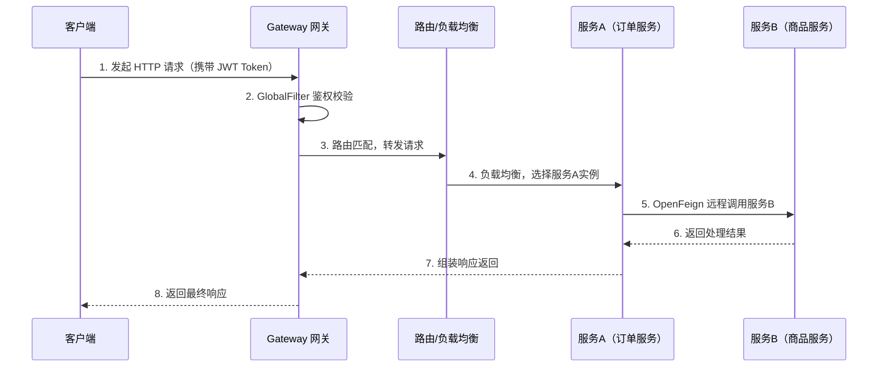

# Spring Cloud - 综合场景串联

---

## 场景一：基于Spring Cloud Alibaba构建微服务架构

### 场景描述

某电商平台从单体架构迁移到微服务架构，需要基于Spring Cloud Alibaba构建完整的微服务体系。涉及服务注册发现、配置中心、API网关、服务间调用、限流熔断和链路追踪。

### 涉及知识点

- [Spring Cloud Alibaba深度](./01-Spring-Cloud-Alibaba深度.md)：微服务架构演进、核心组件全景、拆分原则
- [Nacos服务注册与配置中心](./02-Nacos服务注册与配置中心.md)：服务注册发现、配置中心三层隔离、动态刷新
- [Gateway网关与负载均衡](./03-Gateway网关与负载均衡.md)：路由转发、统一鉴权、限流、负载均衡
- [OpenFeign声明式调用](./06-OpenFeign声明式调用.md)：服务间声明式调用、负载均衡集成、降级熔断
- [链路追踪与可观测性](./07-链路追踪与可观测性.md)：SkyWalking链路追踪、日志关联TraceId

### 协作流程

**微服务完整调用链路时序图：**



> 微服务调用链路从客户端请求开始，经过 Gateway 网关鉴权与路由转发，通过负载均衡到达目标服务A，服务A通过 OpenFeign 声明式调用服务B，最终结果沿原路径返回。全程链路追踪通过 TraceId 关联。

1. **服务拆分**：将单体电商按业务领域拆分为用户服务、商品服务、订单服务、支付服务，每个服务拥有独立数据库。
2. **服务注册发现**：所有服务启动时向Nacos注册（临时实例+心跳），消费者通过Nacos订阅服务列表，OpenFeign配合负载均衡发起调用。
3. **配置管理**：在Nacos中按Namespace(dev/test/prod)、Group(ORDER_GROUP/USER_GROUP)、Data ID三层隔离管理配置。敏感信息使用Jasypt加密，@ConfigurationProperties实现动态刷新。
4. **API网关**：Gateway统一入口，GlobalFilter实现JWT鉴权（白名单放行+Token校验+用户信息透传），RequestRateLimiter实现按IP限流，集成Sentinel熔断降级防止后端故障扩散。
5. **服务间调用**：OpenFeign声明式接口，@FeignClient指定服务名和降级工厂，通过RequestInterceptor透传JWT Token和TraceId。配置合理的连接超时和读取超时，按需启用重试。
6. **链路追踪**：SkyWalking Agent无侵入采集，所有服务挂载Agent上报OAP Server，logback中配置%X{traceId}关联日志与链路。
7. **流量治理**：Sentinel对核心接口配置流控规则（QPS限流）和熔断规则（慢调用比例/异常比例），规则持久化到Nacos防止重启丢失。

### 关键要点

- Nacos集群至少3节点，使用外部MySQL，前端通过Nginx/SLB负载均衡
- namespace配置填写UUID而非名称
- Gateway不引入spring-boot-starter-web，避免与WebFlux冲突
- OpenFeign日志需同时配置logger-level和logging.level，生产环境用BASIC
- SkyWalking Agent的-javaagent必须在-jar之前，Agent版本与OAP Server一致
- 采样率生产环境设0.1-0.5，排障期临时调高

---

## 场景二：分布式事务Seata整合方案

### 场景描述

用户下单流程跨越订单服务（创建订单）、账户服务（扣余额）、库存服务（减库存）三个微服务，需要保证数据一致性。任一操作失败，所有操作必须回滚。

### 涉及知识点

- [分布式事务与Seata](./04-分布式事务与Seata.md)：AT模式两阶段提交、TC/TM/RM三角色、undo_log、全局锁
- [Nacos服务注册与配置中心](./02-Nacos服务注册与配置中心.md)：Seata Server注册到Nacos
- [OpenFeign声明式调用](./06-OpenFeign声明式调用.md)：Feign调用透传XID

### 协作流程

1. **环境准备**：独立部署Seata Server集群，注册到Nacos。每个业务数据库创建undo_log表。配置tx-service-group、vgroup-mapping和registry。
2. **全局事务开启**：订单服务OrderService.createOrder()方法标注@GlobalTransactional，TM角色向TC申请XID。
3. **分支事务执行**：三个分支事务相继执行——订单服务INSERT订单、账户服务UPDATE余额、库存服务UPDATE库存。每个RM自动生成undo_log（记录前后镜像），与业务SQL同本地事务提交，向TC注册分支事务。
4. **正常提交**：全部成功，TM请求TC全局提交，TC通知各RM异步删除undo_log。
5. **异常回滚**：任一分支失败（如库存不足抛异常），TM请求TC全局回滚，TC通知各RM读取undo_log执行反向SQL（INSERT对应DELETE），删除undo_log。
6. **XID传播**：OpenFeign调用时通过RequestInterceptor自动透传XID，确保分支事务归属同一全局事务。
7. **全局锁保护**：第二阶段提交前TC对涉及数据行加全局锁（行级，基于主键），防止其他事务修改。获取失败重试30次间隔10ms。

### 关键要点

- 每个参与事务的数据库必须创建undo_log表，遗漏导致事务失败
- Seata Server必须独立部署，不能嵌入业务应用
- 非关系型数据库不能使用AT模式，改用TCC或Saga
- 避免长事务，缩短全局事务持有锁的时间，防止并发性能下降
- Seata Server生产环境配置集群，避免单点故障
- Feign调用需确保XID正确透传，否则分支事务脱离全局事务控制

---

## 完整可运行示例代码

以下是一个基于 Spring Cloud Alibaba 的完整微服务示例，涵盖 Nacos 服务注册与配置中心、Gateway 网关、Sentinel 熔断降级以及 OpenFeign 服务间调用。

### 步骤一：父工程 pom.xml

```xml
<!-- pom.xml -->
<project xmlns="http://maven.apache.org/POM/4.0.0"
         xmlns:xsi="http://www.w3.org/2001/XMLSchema-instance"
         xsi:schemaLocation="http://maven.apache.org/POM/4.0.0
         http://maven.apache.org/xsd/maven-4.0.0.xsd">
    <modelVersion>4.0.0</modelVersion>

    <groupId>com.example</groupId>
    <artifactId>cloud-demo</artifactId>
    <version>1.0.0</version>
    <packaging>pom</packaging>

    <parent>
        <groupId>org.springframework.boot</groupId>
        <artifactId>spring-boot-starter-parent</artifactId>
        <version>3.2.12</version>
        <relativePath/>
    </parent>

    <properties>
        <java.version>17</java.version>
        <spring-cloud.version>2023.0.5</spring-cloud.version>
        <spring-cloud-alibaba.version>2023.0.3.2</spring-cloud-alibaba.version>
    </properties>

    <dependencyManagement>
        <dependencies>
            <dependency>
                <groupId>org.springframework.cloud</groupId>
                <artifactId>spring-cloud-dependencies</artifactId>
                <version>${spring-cloud.version}</version>
                <type>pom</type>
                <scope>import</scope>
            </dependency>
            <dependency>
                <groupId>com.alibaba.cloud</groupId>
                <artifactId>spring-cloud-alibaba-dependencies</artifactId>
                <version>${spring-cloud-alibaba.version}</version>
                <type>pom</type>
                <scope>import</scope>
            </dependency>
        </dependencies>
    </dependencyManagement>

    <modules>
        <module>order-service</module>
        <module>product-service</module>
        <module>gateway</module>
    </modules>
</project>
```

### 步骤二：订单服务 pom.xml

```xml
<!-- order-service/pom.xml -->
<project xmlns="http://maven.apache.org/POM/4.0.0"
         xmlns:xsi="http://www.w3.org/2001/XMLSchema-instance"
         xsi:schemaLocation="http://maven.apache.org/POM/4.0.0
         http://maven.apache.org/xsd/maven-4.0.0.xsd">
    <modelVersion>4.0.0</modelVersion>

    <parent>
        <groupId>com.example</groupId>
        <artifactId>cloud-demo</artifactId>
        <version>1.0.0</version>
    </parent>

    <artifactId>order-service</artifactId>

    <dependencies>
        <!-- Spring Boot Web -->
        <dependency>
            <groupId>org.springframework.boot</groupId>
            <artifactId>spring-boot-starter-web</artifactId>
        </dependency>
        <!-- Nacos 服务注册发现 -->
        <dependency>
            <groupId>com.alibaba.cloud</groupId>
            <artifactId>spring-cloud-starter-alibaba-nacos-discovery</artifactId>
        </dependency>
        <!-- Nacos 配置中心 -->
        <dependency>
            <groupId>com.alibaba.cloud</groupId>
            <artifactId>spring-cloud-starter-alibaba-nacos-config</artifactId>
        </dependency>
        <!-- Sentinel 熔断降级 -->
        <dependency>
            <groupId>com.alibaba.cloud</groupId>
            <artifactId>spring-cloud-starter-alibaba-sentinel</artifactId>
        </dependency>
        <!-- OpenFeign 声明式调用 -->
        <dependency>
            <groupId>org.springframework.cloud</groupId>
            <artifactId>spring-cloud-starter-openfeign</artifactId>
        </dependency>
        <!-- Spring Cloud LoadBalancer -->
        <dependency>
            <groupId>org.springframework.cloud</groupId>
            <artifactId>spring-cloud-starter-loadbalancer</artifactId>
        </dependency>
        <!-- Sentinel 数据源 Nacos 持久化 -->
        <dependency>
            <groupId>com.alibaba.csp</groupId>
            <artifactId>sentinel-datasource-nacos</artifactId>
        </dependency>
        <!-- Actuator 健康检查 -->
        <dependency>
            <groupId>org.springframework.boot</groupId>
            <artifactId>spring-boot-starter-actuator</artifactId>
        </dependency>
    </dependencies>
</project>
```

### 步骤三：订单服务 bootstrap.yml（Nacos 配置）

```yaml
# order-service/src/main/resources/bootstrap.yml
spring:
  application:
    name: order-service
  cloud:
    nacos:
      # Nacos 服务注册发现
      discovery:
        server-addr: 127.0.0.1:8848
        namespace: dev            # 命名空间 ID
        group: DEFAULT_GROUP
        # 临时实例，依赖心跳保活
        ephemeral: true
      # Nacos 配置中心
      config:
        server-addr: 127.0.0.1:8848
        namespace: dev
        group: ORDER_GROUP
        file-extension: yaml
        # 共享配置（所有服务通用的公共配置）
        shared-configs:
          - data-id: common-config.yaml
            group: DEFAULT_GROUP
            refresh: true
        # 扩展配置（按需引入）
        extension-configs:
          - data-id: datasource.yaml
            group: ORDER_GROUP
            refresh: true
        # 配置刷新超时时间
        timeout: 3000
```

### 步骤四：订单服务 application.yml

```yaml
# order-service/src/main/resources/application.yml
server:
  port: 8081

spring:
  profiles:
    active: dev
  # Sentinel 配置
  cloud:
    sentinel:
      transport:
        dashboard: 127.0.0.1:8080     # Sentinel 控制台地址
        port: 8719                     # 应用与 Sentinel 控制台通信端口
      # 规则持久化到 Nacos
      datasource:
        flow:
          nacos:
            server-addr: 127.0.0.1:8848
            namespace: dev
            group: SENTINEL_GROUP
            data-id: order-service-flow-rules.json
            rule-type: flow
        degrade:
          nacos:
            server-addr: 127.0.0.1:8848
            namespace: dev
            group: SENTINEL_GROUP
            data-id: order-service-degrade-rules.json
            rule-type: degrade
      # 开启 Sentinel 饥饿加载
      eager: true
      # 日志配置
      log:
        dir: ./logs/sentinel
        switch-pid: true

# 日志级别
logging:
  level:
    com.example.order: debug
    com.alibaba.nacos: warn

# Feign 配置
feign:
  sentinel:
    enabled: true                     # 启用 Sentinel 对 Feign 的支持
  client:
    config:
      default:
        connect-timeout: 5000
        read-timeout: 5000
      product-service:
        connect-timeout: 3000
        read-timeout: 3000
```

### 步骤五：订单服务启动类

```java
// order-service/src/main/java/com/example/order/OrderServiceApplication.java
package com.example.order;

import org.springframework.boot.SpringApplication;
import org.springframework.boot.autoconfigure.SpringBootApplication;
import org.springframework.cloud.client.discovery.EnableDiscoveryClient;
import org.springframework.cloud.openfeign.EnableFeignClients;

@SpringBootApplication
@EnableDiscoveryClient      // 启用服务注册发现
@EnableFeignClients         // 启用 OpenFeign
public class OrderServiceApplication {
    public static void main(String[] args) {
        SpringApplication.run(OrderServiceApplication.class, args);
    }
}
```

### 步骤六：订单服务 - Feign 客户端调用商品服务

```java
// order-service/src/main/java/com/example/order/client/ProductClient.java
package com.example.order.client;

import com.example.order.client.fallback.ProductClientFallbackFactory;
import com.example.order.dto.ProductDTO;
import com.example.order.dto.StockReduceDTO;
import org.springframework.cloud.openfeign.FeignClient;
import org.springframework.web.bind.annotation.GetMapping;
import org.springframework.web.bind.annotation.PathVariable;
import org.springframework.web.bind.annotation.PostMapping;
import org.springframework.web.bind.annotation.RequestBody;

/**
 * 商品服务 Feign 客户端
 * name: 远程服务名（Nacos 中注册的服务名）
 * fallbackFactory: 降级工厂类
 */
@FeignClient(
    name = "product-service",
    fallbackFactory = ProductClientFallbackFactory.class
)
public interface ProductClient {

    /**
     * 根据 ID 查询商品信息
     */
    @GetMapping("/products/{id}")
    ProductDTO getProductById(@PathVariable("id") Long id);

    /**
     * 扣减库存
     */
    @PostMapping("/products/stock/reduce")
    Boolean reduceStock(@RequestBody StockReduceDTO stockReduceDTO);
}
```

### 步骤七：订单服务 - Feign 降级工厂

```java
// order-service/src/main/java/com/example/order/client/fallback/ProductClientFallbackFactory.java
package com.example.order.client.fallback;

import com.example.order.client.ProductClient;
import com.example.order.dto.ProductDTO;
import com.example.order.dto.StockReduceDTO;
import lombok.extern.slf4j.Slf4j;
import org.springframework.cloud.openfeign.FallbackFactory;
import org.springframework.stereotype.Component;

/**
 * Feign 降级工厂：当商品服务不可用时触发降级逻辑
 */
@Slf4j
@Component
public class ProductClientFallbackFactory implements FallbackFactory<ProductClient> {

    @Override
    public ProductClient create(Throwable cause) {
        // 记录异常信息，便于排查问题
        log.error("商品服务调用异常，触发降级。原因: {}", cause.getMessage(), cause);

        return new ProductClient() {
            @Override
            public ProductDTO getProductById(Long id) {
                log.warn("商品服务降级：查询商品 id={} 返回 null", id);
                return null;
            }

            @Override
            public Boolean reduceStock(StockReduceDTO stockReduceDTO) {
                log.warn("商品服务降级：扣减库存失败，商品 id={}", stockReduceDTO.getProductId());
                return false;
            }
        };
    }
}
```

### 步骤八：订单服务 - Sentinel 资源保护

```java
// order-service/src/main/java/com/example/order/controller/OrderController.java
package com.example.order.controller;

import com.alibaba.csp.sentinel.annotation.SentinelResource;
import com.alibaba.csp.sentinel.slots.block.BlockException;
import com.example.order.client.ProductClient;
import com.example.order.dto.CreateOrderDTO;
import com.example.order.dto.OrderVO;
import com.example.order.dto.ProductDTO;
import com.example.order.service.OrderService;
import lombok.RequiredArgsConstructor;
import lombok.extern.slf4j.Slf4j;
import org.springframework.web.bind.annotation.*;

import java.util.HashMap;
import java.util.Map;

@Slf4j
@RestController
@RequestMapping("/orders")
@RequiredArgsConstructor
public class OrderController {

    private final OrderService orderService;
    private final ProductClient productClient;

    /**
     * 创建订单 - Sentinel 资源保护
     * value: 资源名称（Sentinel 控制台可见）
     * blockHandler: 限流 / 熔断后的降级方法
     * fallback: 业务异常后的降级方法
     */
    @PostMapping
    @SentinelResource(
        value = "createOrder",
        blockHandler = "createOrderBlockHandler",
        fallback = "createOrderFallback"
    )
    public OrderVO createOrder(@RequestBody CreateOrderDTO createOrderDTO) {
        // 1. 调用商品服务查询商品信息（Feign 远程调用）
        ProductDTO product = productClient.getProductById(createOrderDTO.getProductId());
        if (product == null) {
            throw new RuntimeException("商品不存在");
        }
        // 2. 创建订单
        OrderVO order = orderService.createOrder(createOrderDTO, product);
        log.info("订单创建成功：{}", order.getOrderId());
        return order;
    }

    /**
     * Sentinel 限流 / 熔断降级方法
     * 参数必须与原始方法一致，并额外接收 BlockException
     */
    public OrderVO createOrderBlockHandler(CreateOrderDTO createOrderDTO,
                                            BlockException ex) {
        log.warn("订单创建被限流或熔断，订单信息: {}", createOrderDTO);
        OrderVO fallback = new OrderVO();
        fallback.setMessage("系统繁忙，请稍后重试");
        return fallback;
    }

    /**
     * 业务异常降级方法
     */
    public OrderVO createOrderFallback(CreateOrderDTO createOrderDTO,
                                        Throwable throwable) {
        log.error("订单创建业务异常: {}", throwable.getMessage(), throwable);
        OrderVO fallback = new OrderVO();
        fallback.setMessage("下单失败，请稍后重试");
        return fallback;
    }

    /**
     * 查询订单详情 - Sentinel 热点参数限流
     */
    @GetMapping("/{orderId}")
    @SentinelResource(
        value = "getOrderDetail",
        blockHandler = "getOrderDetailBlockHandler"
    )
    public OrderVO getOrderDetail(@PathVariable Long orderId) {
        return orderService.getOrderById(orderId);
    }

    public OrderVO getOrderDetailBlockHandler(Long orderId, BlockException ex) {
        log.warn("查询订单详情被限流，订单ID: {}", orderId);
        OrderVO fallback = new OrderVO();
        fallback.setMessage("查询过于频繁，请稍后重试");
        return fallback;
    }
}
```

### 步骤九：Nacos 配置中心 - 动态刷新配置

```java
// order-service/src/main/java/com/example/order/config/OrderProperties.java
package com.example.order.config;

import lombok.Data;
import org.springframework.boot.context.properties.ConfigurationProperties;
import org.springframework.cloud.context.config.annotation.RefreshScope;
import org.springframework.stereotype.Component;

/**
 * 订单服务动态配置 - 支持通过 Nacos 实时刷新
 * @RefreshScope: 配置变更时自动刷新 Bean
 */
@Data
@Component
@RefreshScope
@ConfigurationProperties(prefix = "order")
public class OrderProperties {

    /**
     * 订单超时取消时间（分钟）
     */
    private Integer timeoutMinutes = 30;

    /**
     * 最大未支付订单数
     */
    private Integer maxUnpaidOrders = 5;

    /**
     * 是否启用库存预扣
     */
    private Boolean preStockDeduction = true;

    /**
     * 支付回调重试次数
     */
    private Integer payRetryTimes = 3;
}
```

### 步骤十：Nacos 配置中心 - 配置内容示例

```yaml
# 在 Nacos 控制台创建以下配置：
# Data ID: order-service.yaml
# Group: ORDER_GROUP
# Namespace: dev

order:
  timeout-minutes: 30
  max-unpaid-orders: 5
  pre-stock-deduction: true
  pay-retry-times: 3

# 数据库配置（敏感信息建议使用 Jasypt 加密）
spring:
  datasource:
    url: jdbc:mysql://127.0.0.1:3306/order_db?useSSL=false&serverTimezone=Asia/Shanghai
    username: root
    password: ENC(加密后的密码)
    driver-class-name: com.mysql.cj.jdbc.Driver
```

### 步骤十一：Gateway 网关 - pom.xml

```xml
<!-- gateway/pom.xml -->
<project xmlns="http://maven.apache.org/POM/4.0.0"
         xmlns:xsi="http://www.w3.org/2001/XMLSchema-instance"
         xsi:schemaLocation="http://maven.apache.org/POM/4.0.0
         http://maven.apache.org/xsd/maven-4.0.0.xsd">
    <modelVersion>4.0.0</modelVersion>

    <parent>
        <groupId>com.example</groupId>
        <artifactId>cloud-demo</artifactId>
        <version>1.0.0</version>
    </parent>

    <artifactId>gateway</artifactId>

    <dependencies>
        <!-- Gateway 网关（底层基于 WebFlux，不能引入 spring-boot-starter-web） -->
        <dependency>
            <groupId>org.springframework.cloud</groupId>
            <artifactId>spring-cloud-starter-gateway</artifactId>
        </dependency>
        <!-- Nacos 服务注册发现 -->
        <dependency>
            <groupId>com.alibaba.cloud</groupId>
            <artifactId>spring-cloud-starter-alibaba-nacos-discovery</artifactId>
        </dependency>
        <!-- Nacos 配置中心 -->
        <dependency>
            <groupId>com.alibaba.cloud</groupId>
            <artifactId>spring-cloud-starter-alibaba-nacos-config</artifactId>
        </dependency>
        <!-- Sentinel 网关限流 -->
        <dependency>
            <groupId>com.alibaba.cloud</groupId>
            <artifactId>spring-cloud-alibaba-sentinel-gateway</artifactId>
        </dependency>
        <!-- Sentinel 数据源持久化 -->
        <dependency>
            <groupId>com.alibaba.csp</groupId>
            <artifactId>sentinel-datasource-nacos</artifactId>
        </dependency>
        <!-- Spring Cloud LoadBalancer -->
        <dependency>
            <groupId>org.springframework.cloud</groupId>
            <artifactId>spring-cloud-starter-loadbalancer</artifactId>
        </dependency>
    </dependencies>
</project>
```

### 步骤十二：Gateway 网关 - 完整配置

```yaml
# gateway/src/main/resources/application.yml
server:
  port: 9000

spring:
  application:
    name: gateway
  cloud:
    nacos:
      discovery:
        server-addr: 127.0.0.1:8848
        namespace: dev
      config:
        server-addr: 127.0.0.1:8848
        namespace: dev
        file-extension: yaml
    gateway:
      # ===== 全局跨域配置 =====
      globalcors:
        cors-configurations:
          '[/**]':
            allowed-origins: "*"
            allowed-methods:
              - GET
              - POST
              - PUT
              - DELETE
            allowed-headers: "*"
            max-age: 3600
      # ===== 路由配置 =====
      routes:
        # 订单服务路由
        - id: order-service
          uri: lb://order-service           # lb:// 表示使用负载均衡
          predicates:
            - Path=/api/orders/**
          filters:
            - StripPrefix=1                 # 去掉第一层路径前缀 /api
            # 限流过滤器：每个 IP 每秒最多 5 个请求
            - name: RequestRateLimiter
              args:
                key-resolver: "#{@ipKeyResolver}"
                redis-rate-limiter.replenishRate: 5
                redis-rate-limiter.burstCapacity: 10

        # 商品服务路由
        - id: product-service
          uri: lb://product-service
          predicates:
            - Path=/api/products/**
          filters:
            - StripPrefix=1
            - name: RequestRateLimiter
              args:
                key-resolver: "#{@ipKeyResolver}"
                redis-rate-limiter.replenishRate: 10
                redis-rate-limiter.burstCapacity: 20

      # ===== 默认过滤器（所有路由生效） =====
      default-filters:
        # 添加请求 ID 用于链路追踪
        # 注意：$${uuid} 是 Spring Cloud Gateway 的 SpEL 表达式，$$ 是 YAML 中转义 $ 的写法
        # 实际运行时会被解析为 ${uuid}，由 Gateway 自动生成 UUID 作为请求 ID
        - AddRequestHeader=X-Request-Id, $${uuid}

    # ===== Sentinel 网关流控规则 =====
    sentinel:
      transport:
        dashboard: 127.0.0.1:8080
      # 网关流控规则持久化到 Nacos
      datasource:
        gw-flow:
          nacos:
            server-addr: 127.0.0.1:8848
            namespace: dev
            group: SENTINEL_GROUP
            data-id: gateway-flow-rules.json
            rule-type: gw-flow
        gw-api-group:
          nacos:
            server-addr: 127.0.0.1:8848
            namespace: dev
            group: SENTINEL_GROUP
            data-id: gateway-api-group-rules.json
            rule-type: gw-api-group
```

### 步骤十三：Gateway 网关 - JWT 鉴权过滤器

```java
// gateway/src/main/java/com/example/gateway/filter/AuthFilter.java
package com.example.gateway.filter;

import lombok.extern.slf4j.Slf4j;
import org.springframework.cloud.gateway.filter.GatewayFilterChain;
import org.springframework.cloud.gateway.filter.GlobalFilter;
import org.springframework.core.Ordered;
import org.springframework.http.HttpHeaders;
import org.springframework.http.HttpStatus;
import org.springframework.stereotype.Component;
import org.springframework.web.server.ServerWebExchange;
import reactor.core.publisher.Mono;

import java.util.Arrays;
import java.util.HashSet;
import java.util.Set;

/**
 * 全局 JWT 鉴权过滤器
 * 对所有经过网关的请求进行 Token 校验
 */
@Slf4j
@Component
public class AuthFilter implements GlobalFilter, Ordered {

    /**
     * 白名单路径（无需鉴权）
     * 使用 Set 精确匹配，避免 startsWith 误放行（如 /api/auth/login 会误放行 /api/auth/login-bypass）
     * 生产环境建议使用 AntPathMatcher 或 PathPattern 实现更灵活的路由匹配
     */
    private static final Set<String> WHITE_LIST = new HashSet<>(Arrays.asList(
            "/api/orders/health",
            "/api/products/health",
            "/api/auth/login",
            "/api/auth/register"
    ));

    @Override
    public Mono<Void> filter(ServerWebExchange exchange, GatewayFilterChain chain) {
        String path = exchange.getRequest().getURI().getPath();

        // 白名单直接放行（精确匹配，避免 startsWith 前缀匹配过宽导致误放行）
        if (WHITE_LIST.contains(path)) {
            return chain.filter(exchange);
        }

        // 获取 Token
        String token = exchange.getRequest().getHeaders().getFirst(HttpHeaders.AUTHORIZATION);
        if (token == null || token.isEmpty()) {
            log.warn("请求缺少 Token，路径: {}", path);
            exchange.getResponse().setStatusCode(HttpStatus.UNAUTHORIZED);
            return exchange.getResponse().setComplete();
        }

        // 校验 Token 格式（生产环境应使用 JWT 工具类完整校验）
        if (!token.startsWith("Bearer ")) {
            log.warn("Token 格式错误，路径: {}", path);
            exchange.getResponse().setStatusCode(HttpStatus.UNAUTHORIZED);
            return exchange.getResponse().setComplete();
        }

        // 解析 Token 获取用户信息，透传到下游服务
        String userId = extractUserId(token);
        exchange.getRequest().mutate()
                .header("X-User-Id", userId)
                .build();

        log.debug("鉴权通过，用户ID: {}, 路径: {}", userId, path);
        return chain.filter(exchange);
    }

    @Override
    public int getOrder() {
        // 优先级最高，确保鉴权过滤器最先执行
        return -100;
    }

    /**
     * 从 Token 中提取用户 ID（示例实现，生产环境需完整 JWT 解析）
     */
    private String extractUserId(String token) {
        // 示例：实际应使用 JWT 库解析
        return "user-001";
    }
}
```

### 步骤十四：Gateway 网关 - IP 限流解析器

```java
// gateway/src/main/java/com/example/gateway/config/RateLimiterConfig.java
package com.example.gateway.config;

import org.springframework.cloud.gateway.filter.ratelimit.KeyResolver;
import org.springframework.context.annotation.Bean;
import org.springframework.context.annotation.Configuration;
import reactor.core.publisher.Mono;

/**
 * 限流 Key 解析器配置
 */
@Configuration
public class RateLimiterConfig {

    /**
     * 基于 IP 的限流解析器
     * 每个不同的客户端 IP 独立计数
     */
    @Bean
    public KeyResolver ipKeyResolver() {
        return exchange -> {
            String ip = exchange.getRequest().getRemoteAddress()
                    .getAddress().getHostAddress();
            return Mono.just(ip);
        };
    }

    /**
     * 基于用户 ID 的限流解析器
     * 每个不同的用户独立计数
     */
    @Bean
    public KeyResolver userKeyResolver() {
        return exchange -> {
            String userId = exchange.getRequest().getHeaders()
                    .getFirst("X-User-Id");
            return Mono.just(userId != null ? userId : "anonymous");
        };
    }
}
```

### 步骤十五：Sentinel 规则持久化到 Nacos

```json
// 在 Nacos 控制台创建以下配置：
// Data ID: order-service-flow-rules.json
// Group: SENTINEL_GROUP
// Namespace: dev

[
    {
        "resource": "createOrder",
        "grade": 1,
        "count": 100,
        "controlBehavior": 0,
        "strategy": 0
    },
    {
        "resource": "getOrderDetail",
        "grade": 1,
        "count": 200,
        "controlBehavior": 0,
        "strategy": 0
    }
]
```

```json
// 在 Nacos 控制台创建以下配置：
// Data ID: order-service-degrade-rules.json
// Group: SENTINEL_GROUP
// Namespace: dev

[
    {
        "resource": "createOrder",
        "grade": 0,
        "count": 200,
        "timeWindow": 10,
        "minRequestAmount": 5,
        "statIntervalMs": 1000
    }
]
```

```json
// 在 Nacos 控制台创建以下配置：
// Data ID: gateway-flow-rules.json
// Group: SENTINEL_GROUP
// Namespace: dev

[
    {
        "resource": "order-service",
        "resourceMode": 0,
        "grade": 1,
        "count": 50,
        "intervalSec": 1,
        "controlBehavior": 0,
        "burst": 0
    }
]
```

### 步骤十六：启动与验证

```bash
# ===== 1. 启动 Nacos Server（单机模式） =====
# 下载 nacos-server-2.2.3.zip 解压后执行：
# Windows:
startup.cmd -m standalone
# Linux/Mac:
sh startup.sh -m standalone
# 访问 Nacos 控制台：http://127.0.0.1:8848/nacos （默认账号 nacos/nacos）

# ===== 2. 启动 Sentinel Dashboard =====
# 下载 sentinel-dashboard-1.8.7.jar 执行：
java -Dserver.port=8080 -Dcsp.sentinel.dashboard.server=127.0.0.1:8080 \
     -Dproject.name=sentinel-dashboard \
     -jar sentinel-dashboard-1.8.7.jar
# 访问 Sentinel 控制台：http://127.0.0.1:8080 （默认账号 sentinel/sentinel）

# ===== 3. 在 Nacos 中创建配置 =====
# 根据步骤十和步骤十五，在 Nacos 控制台创建对应的配置项

# ===== 4. 启动微服务 =====
# 启动商品服务
cd product-service && mvn spring-boot:run
# 启动订单服务
cd order-service && mvn spring-boot:run
# 启动网关
cd gateway && mvn spring-boot:run

# ===== 5. 验证服务注册 =====
# 访问 Nacos 控制台 -> 服务管理 -> 服务列表
# 应看到 order-service、product-service、gateway 三个服务已注册

# ===== 6. 测试网关路由 =====
# 通过网关访问订单服务
curl -X POST http://localhost:9000/api/orders \
  -H "Content-Type: application/json" \
  -H "Authorization: Bearer test-token" \
  -d '{"productId": 1, "quantity": 2}'

# ===== 7. 测试限流 =====
# 使用 Apache Bench 或 wrk 快速发送请求，验证限流生效
ab -n 200 -c 20 http://localhost:9000/api/orders/1

# ===== 8. 查看 Sentinel 控制台 =====
# 访问 http://127.0.0.1:8080，查看实时 QPS、熔断状态和限流日志
```

> [返回模块目录](../../README.md) | [返回知识导览](../../知识导览.md)