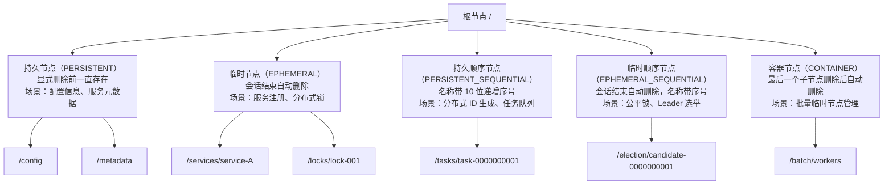
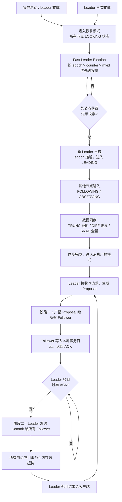

# ZooKeeper 核心原理

> 学习路线对应：分布式微服务模块 — ZooKeeper 专题
> 前置知识：Java 基础、分布式系统基本概念
> 对比 Nacos：ZooKeeper 采用 CP 架构保证强一致性，Nacos 支持 AP/CP 灵活切换

---

## 一、核心概念

### 1.1 ZooKeeper 概述与设计目标

ZooKeeper 是 Apache 开源的**分布式协调服务**，最早源于 Yahoo 内部项目，用于解决分布式系统中配置管理、命名服务、分布式锁、集群管理等协调问题。它通过简单的树形数据模型和原子化操作，向分布式应用提供高性能、高可用的协调原语。

**设计目标**：

1. **简单性**：提供类似文件系统的树形命名空间，客户端通过统一 API 操作 ZNode，屏蔽底层分布式复杂性。
2. **可靠性**：基于 Zab 共识协议保证数据一致性，集群过半节点存活即可对外提供服务。
3. **顺序性**：所有事务操作分配全局递增的 zxid（ZooKeeper Transaction ID），保证全局顺序。
4. **原子性**：每个更新操作要么在所有节点成功，要么全部失败，不存在部分写入。
5. **实时性**：客户端在指定时间内能读到最新数据（**顺序一致性**保证，通过 `sync()` 可实现线性一致读），通过 Watcher 机制实现准实时通知。

**核心特性**：

| 特性 | 说明 |
|------|------|
| 树形命名空间 | 数据以 ZNode 节点组织为层级树，路径以 `/` 分隔 |
| 会话机制 | 客户端与服务器建立 Session，通过心跳维持，超时后临时节点自动删除 |
| Watcher 通知 | 一次性触发器，客户端注册监听后收到一次通知，如需持续监听需重新注册 |
| 版本控制 | 每个 ZNode 维护 version（数据版本）、cversion（子节点版本）、aversion（ACL 版本） |
| ACL 权限 | 支持 scheme:id:permissions 格式的访问控制，粒度到 ZNode 级别 |

> **生活化类比：ZooKeeper = 分布式系统的户籍管理处** —— 一个城市有千万人口（分布式节点），如果没有户籍管理处，每家每户要自己记录"谁住哪、谁搬走了、谁还活着"，信息必然打架。户籍管理处（ZooKeeper）统一维护一本层级登记簿：省→市→区→街道→门牌号（ZNode 树形路径 `/app/config/db`），每个门牌号下登记着住户信息（ZNode 数据，≤1MB）。住户搬走（客户端会话结束）自动注销户籍（临时节点删除），新住户入住自动登记（服务注册）。任何户籍变更，管理处会通知所有订阅该门牌的社区工作者（Watcher 一次性通知）。所有变更按时间编号登记（zxid 全局递增），保证全市户籍信息一致（Zab 强一致性）。但户籍处只管登记元数据，不管你家存了多少粮食（业务数据请存 MySQL/Redis）。

> 📖 **参考链接**：
> - [ZooKeeper 官方文档 - Overview](https://zookeeper.apache.org/doc/current/zookeeperOver.html) -- ZooKeeper 设计目标与整体概述
> - [ZooKeeper 官方文档 - Getting Started](https://zookeeper.apache.org/doc/current/zookeeperStarted.html) -- ZooKeeper 快速上手与基本概念
> - [ZooKeeper 官方文档 - ZooKeeper Data Tree](https://zookeeper.apache.org/doc/current/zookeeperDataStructure.html) -- 数据模型与 ZNode 层级结构说明

### 1.2 数据模型：树形 ZNode

ZooKeeper 的数据模型类似 Unix 文件系统，是一个层级命名空间树。每个节点称为 ZNode，可存储数据并拥有子节点。

**五种 ZNode 类型**：

| ZNode 类型 | 创建命令 | 生命周期 | 典型场景 |
|-----------|---------|---------|---------|
| **持久节点（PERSISTENT）** | `create /path data` | 显式删除前一直存在 | 配置信息、服务元数据 |
| **持久有序节点（PERSISTENT_SEQUENTIAL）** | `create -s /path data` | 显式删除前一直存在，名称带 10 位递增序号 | 分布式 ID 生成、任务队列 |
| **临时节点（EPHEMERAL）** | `create -e /path data` | 会话结束自动删除 | 服务注册、分布式锁、成员发现 |
| **临时有序节点（EPHEMERAL_SEQUENTIAL）** | `create -s -e /path data` | 会话结束自动删除，名称带 10 位递增序号 | 分布式锁（公平锁）、Leader 选举 |
| **容器节点（CONTAINER）** | `create -c /path data` | 最后一个子节点被删除后自动删除 | 批量临时节点管理 |

**ZNode 数据结构**：

每个 ZNode 在内存中维护以下信息：

```
ZNode {
    data: byte[]          // 存储的数据（默认上限 1MB）
    stat: Stat            // 状态信息
    children: List<String> // 子节点列表
    acl: List<ACL>        // 访问控制列表
}
```

**数据存储限制**：
- 单个 ZNode 数据量默认上限 1MB（可配置 `jute.maxbuffer`），设计上 ZNode 用于存储协调元数据而非业务数据。
- 节点路径层次不宜过深，建议不超过 10 层。

**ZNode 节点类型层次结构图**：



> ZooKeeper 的五种 ZNode 类型是理解其分布式协调能力的基础。**持久节点**存储配置信息，**临时节点**的生命周期与会话绑定实现服务发现，**顺序节点**通过自增序号保证全局唯一性，**容器节点**则用于批量管理。每种类型的选择直接决定了分布式场景下的数据一致性和可用性策略。

> 📖 **参考链接**：
> - [ZooKeeper 官方文档 - ZNode Types](https://zookeeper.apache.org/doc/current/zookeeperProgrammers.html#sc_zkDataModel_znodes) -- 四种 ZNode 类型（持久/临时/顺序/容器）官方说明
> - [ZooKeeper 官方文档 - ACL & Permissions](https://zookeeper.apache.org/doc/current/zookeeperProgrammers.html#sc_ACLPermissions) -- ZNode ACL 权限控制详解
> - [ZooKeeper 官方文档 - ZooKeeper Commands](https://zookeeper.apache.org/doc/current/zookeeperCLI.html) -- create/get/set/ls 等客户端命令参考

### 1.3 Stat 结构体

每个 ZNode 的 Stat 结构体记录了节点的元数据信息，用于版本控制和状态监测。

| 字段 | 类型 | 说明 |
|------|------|------|
| `czxid` | long | 创建该节点的事务 zxid |
| `mzxid` | long | 最后修改该节点的事务 zxid |
| `ctime` | long | 创建时间（毫秒时间戳） |
| `mtime` | long | 最后修改时间（毫秒时间戳） |
| `version` | int | 数据版本号，每次修改递增 |
| `cversion` | int | 子节点版本号，子节点增删时递增 |
| `aversion` | int | ACL 版本号，ACL 修改时递增 |
| `ephemeralOwner` | long | 临时节点所属会话 ID（持久节点为 0） |
| `dataLength` | int | 数据长度（字节数） |
| `numChildren` | int | 子节点数量 |
| `pzxid` | long | 最后修改子节点列表的事务 zxid |

**版本号的乐观锁机制**：

```java
// 基于 version 的 CAS 更新
Stat stat = new Stat();
zk.getData("/config", false, stat);  // 读取当前数据和版本号
int currentVersion = stat.getVersion();

// 更新时传入当前版本号，如果版本号不匹配则更新失败
Stat newStat = zk.setData("/config", newData, currentVersion);
// 若 currentVersion != 实际版本号，抛出 BadVersionException
```

版本号保证并发更新时的数据一致性，类似于数据库乐观锁。每次更新操作必须传入期望的版本号，若不匹配说明已被其他客户端修改，操作失败。

> 📖 **参考链接**：
> - [ZooKeeper 官方文档 - Stat Structure](https://zookeeper.apache.org/doc/current/zookeeperProgrammers.html#sc_zkStatStructure) -- Stat 结构体各字段（czxid/version/cversion 等）官方说明
> - [ZooKeeper 官方文档 - Version & CAS](https://zookeeper.apache.org/doc/current/zookeeperProgrammers.html#zk) -- 基于 version 的乐观锁/CAS 更新机制

---

## 二、底层原理

### 2.1 Watcher 机制原理

Watcher 是 ZooKeeper 实现分布式协调的核心机制，允许客户端注册监听事件，当 ZNode 发生变化时服务端主动通知客户端。

**Watcher 工作流程**：

```
客户端                          服务端
  |                               |
  |--- getData(path, watcher) --->|  1. 注册 Watcher
  |                               |  2. 将 Watcher 存入 WatchManager
  |<-- 返回当前数据 + Stat -------|
  |                               |
  |                               |  3. 数据变更触发 NodeDataChanged 事件
  |<--- WatcherEvent 通知 --------|  4. 客户端收到通知
  |                               |  5. 服务端删除该 Watcher（一次性）
  |                               |
  |--- getData(path, watcher) --->|  6. 重新注册 Watcher 继续监听
```

> **生活化类比：Watcher = 快递签收通知** —— 你网购后盯着物流（客户端注册 Watcher 监听 ZNode），快递员不会一直给你打电话，只有包裹状态变化（节点数据变更）时才给你发一条短信（WatcherEvent 通知），告诉你"你的包裹状态变了"，但短信里不会写包裹里装了什么（轻量级通知只含事件类型和路径，不含数据），你得自己打开 App 查详情（客户端主动调 getData 拉取）。而且这条短信是一次性的——看完就失效了（一次性触发），下次状态变化想再收到短信，必须重新订阅物流提醒（重新注册 Watcher）。如果你同时订了好几个包裹，短信会按顺序一条条发（串行执行），不会一次性轰炸你。

**Watcher 特性**：

| 特性 | 说明 |
|------|------|
| 一次性触发 | 每个 Watcher 只触发一次，收到通知后自动失效，需重新注册 |
| 串行执行 | 同一客户端的 Watcher 事件按顺序串行处理，保证顺序性 |
| 轻量级通知 | 通知只包含事件类型和路径，不包含变更后的数据，客户端需主动拉取 |
| 先注册后触发 | 客户端先收到 Watcher 注册成功确认，再收到后续变更通知 |

**Watcher 事件类型**：

| 事件类型 | 触发条件 | 对应操作 |
|---------|---------|---------|
| `NodeCreated` | 被监听的节点被创建 | `exists()` 注册的 Watcher |
| `NodeDeleted` | 被监听的节点被删除 | `exists()` 或 `getData()` 注册的 Watcher |
| `NodeDataChanged` | 被监听的节点数据被修改 | `getData()` 注册的 Watcher |
| `NodeChildrenChanged` | 被监听的节点的子节点列表发生变化 | `getChildren()` 注册的 Watcher |

**Curator 框架对 Watcher 的优化**：

原生 Watcher 存在一次性、需反复注册、代码分散等问题。Apache Curator 提供了以下改进：

- **NodeCache**：监听指定节点的数据变化，自动反复注册。
- **PathChildrenCache**：监听指定节点的子节点变化（增删改），自动反复注册。
- **TreeCache**：组合 NodeCache 和 PathChildrenCache，监听节点及其所有子节点的变化。

```java
// Curator NodeCache 示例
CuratorFramework client = CuratorFrameworkFactory.newClient(zkAddress, retryPolicy);
client.start();

NodeCache nodeCache = new NodeCache(client, "/config/app");
nodeCache.getListenable().addListener(() -> {
    ChildData data = nodeCache.getCurrentData();
    if (data != null) {
        System.out.println("配置变更: " + new String(data.getData()));
    }
});
nodeCache.start();
```

> 📖 **参考链接**：
> - [ZooKeeper 官方文档 - Watcher Mechanism](https://zookeeper.apache.org/doc/current/zookeeperProgrammers.html#ch_zkWatches) -- Watcher 一次性触发、串行执行等核心特性官方说明
> - [ZooKeeper 官方文档 - Watcher Event Types](https://zookeeper.apache.org/doc/current/zookeeperProgrammers.html#sc_WatcherTypes) -- NodeCreated/NodeDeleted/NodeDataChanged 等事件类型
> - [Apache Curator 官方文档](https://curator.apache.org/docs/) -- Curator 框架 NodeCache/PathChildrenCache/TreeCache 用法

### 2.2 CAP 理论与 ZooKeeper 的 CP 选择

CAP 理论指出分布式系统无法同时满足一致性（Consistency）、可用性（Availability）、分区容错性（Partition Tolerance）三个特性，最多只能同时满足其中两个。

| 特性 | 定义 | ZooKeeper 的表现 |
|------|------|-----------------|
| **C（一致性）** | 所有节点在同一时刻看到相同数据 | 基于 Zab 协议保证强一致性，所有写操作由 Leader 执行，Follower 同步后才能读取 |
| **A（可用性）** | 每个请求都能获得非错误的响应 | 选举期间集群不可用（约 200ms），过半节点故障时集群不可用 |
| **P（分区容错性）** | 系统在部分节点间网络分区时仍能正常运作 | 网络分区时，少数派节点自动下线，多数派继续提供服务 |

**ZooKeeper 选择 CP 的原因**：

1. 协调服务对数据一致性要求极高，分布式锁、Leader 选举等场景必须保证数据准确。
2. 选举期间短暂不可用可接受，因为选举通常在 200ms 内完成，实际影响有限。
3. 通过过半机制保证分区容错，在多数派存活时系统仍可提供服务。

**ZooKeeper 与 Nacos 的 CAP 对比**：

| 维度 | ZooKeeper | Nacos |
|------|-----------|-------|
| CAP 选择 | CP（强一致性） | AP 或 CP 可切换 |
| 一致性协议 | Zab | 简化的 Raft（CP 模式）或 Distro（AP 模式） |
| 可用性 | 选举期间不可用 | AP 模式下优先保证可用性 |
| 适用场景 | 对一致性要求极严格的协调场景 | 服务发现等对可用性要求更高的场景 |

> **生活化类比：ZAB 协议 = 董事会投票选举董事长** —— 一家公司（ZooKeeper 集群）只能有一位董事长（Leader）对外签合同（处理写请求）。当董事长换届（Leader 故障/启动）时，全体董事（节点）进入"换届选举"状态（LOOKING 恢复模式）：每位董事先投自己一票，然后互相交换选票，谁的"任期编号 + 决议编号"最新（zxid = epoch + counter）谁就更资深，大家改投最资深的人，得票过半者当选新董事长（Leader 选举完成）。新董事长上任后，先和各位董事对齐历史决议（数据同步 TRUNC/DIFF/SNAP），然后进入正常办公模式（消息广播模式）：以后所有决议（Proposal）由董事长起草，发给所有董事签字（ACK），过半董事签完字董事长才盖章生效（Commit）。这套流程保证：董事长换了，已盖章的决议不丢（已提交事务保留），没盖完的决议作废（未提交事务丢弃）。

> **ZAB 协议两阶段流程图**：下图展示 ZAB 协议在"恢复模式（Leader 选举 + 数据同步）"与"消息广播模式（正常两阶段提交）"之间的完整流转。



> ZAB 协议通过"恢复模式（Leader 选举 + 数据同步）"和"消息广播模式（Proposal-ACK-Commit 两阶段）"两个阶段保证集群数据一致性。Leader 故障时自动触发重新选举，选举完成后通过 TRUNC/DIFF/SNAP 三种策略同步数据，确保新 Leader 和所有 Follower 状态一致后再进入广播模式。

### 2.3 本地文件存储

ZooKeeper 的数据存储分为内存层和磁盘层，内存数据树用于快速读写，磁盘文件用于持久化和恢复。

**存储架构**：

```
ZooKeeper 存储
├── 内存数据树（DataTree）
│   ├── 所有 ZNode 的完整数据
│   ├── Stat 元数据
│   ├── Watcher 注册表
│   └── ACL 列表
│
├── 事务日志（Transaction Log / TxnLog）
│   ├── 每次写操作的事务记录
│   ├── 预写日志（WAL），先写日志再修改内存
│   └── 文件命名：log.<zxid>
│
└── 快照（Snapshot）
    ├── 某一时刻内存数据树的完整序列化
    ├── 文件命名：snapshot.<zxid>
    └── 重启时加载最近的快照，再回放后续事务日志
```

**事务日志（TxnLog）**：

- 每次写操作（create/setData/delete）生成一条事务记录，包含操作类型、路径、数据、zxid 等。
- 采用预写日志（WAL）策略：事务先写入磁盘日志，确认落盘后才修改内存数据树。
- 日志文件定期滚动，默认每 64MB 生成新文件。
- 日志文件通过 `snapCount` 参数（默认 100000）控制快照间的事务数量。

**快照（Snapshot）**：

- 快照是内存数据树在某一时刻的完整序列化副本。
- 生成时机：事务日志累积超过 `snapCount` 条时自动触发。
- 快照与事务日志配合使用：重启时加载最新的快照文件，再按序回放快照之后的日志文件，恢复完整状态。
- 快照采用异步生成方式，不阻塞当前事务处理。

**数据写入流程**：

```
1. 客户端发起写请求 → Leader
2. Leader 将事务写入 TxnLog，fsync 落盘
3. Leader 修改内存数据树
4. Leader 将事务 Proposal 发送给所有 Follower
5. Follower 收到 Proposal 后写入自己的 TxnLog
6. 过半 Follower 返回 ACK 后，Leader 提交事务
7. Leader 和 Follower 将事务应用到内存数据树
8. 触发相关 Watcher 通知客户端
```

**磁盘清理**：

- ZooKeeper 自动清理旧快照和事务日志，保留最近 3 个快照及其对应日志（`autopurge.snapRetainCount=3`）。
- 清理周期由 `autopurge.purgeInterval` 控制（默认 0 即不自动清理，建议设为 1 小时）。
- 生产环境必须开启自动清理，否则日志文件会持续增长直至磁盘耗尽。

> 📖 **参考链接**：
> - [ZooKeeper 官方文档 - Data Storage](https://zookeeper.apache.org/doc/current/zookeeperAdmin.html#sc_storage) -- 事务日志与快照存储配置说明
> - [ZooKeeper 官方文档 - Autopurge](https://zookeeper.apache.org/doc/current/zookeeperAdmin.html#sc_maintenance) -- autopurge.snapRetainCount / purgeInterval 自动清理配置
> - [ZooKeeper 官方文档 - Zab Protocol](https://zookeeper.apache.org/doc/current/zookeeperInternals.html#sc_atomicBroadcast) -- ZAB 原子广播协议内部实现原理

---

## 三、实战应用

### 3.1 ZooKeeper 客户端使用

**原生客户端 API**：

```java
// 创建连接
ZooKeeper zk = new ZooKeeper("127.0.0.1:2181", 3000, new Watcher() {
    @Override
    public void process(WatchedEvent event) {
        System.out.println("收到事件: " + event);
    }
});

// 创建节点
zk.create("/app/config", "timeout=3000".getBytes(),
        ZooDefs.Ids.OPEN_ACL_UNSAFE, CreateMode.PERSISTENT);

// 读取节点
byte[] data = zk.getData("/app/config", false, null);
System.out.println(new String(data));

// 更新节点
zk.setData("/app/config", "timeout=5000".getBytes(), -1);  // -1 忽略版本检查

// 删除节点
zk.delete("/app/config", -1);

// 关闭连接
zk.close();
```

**Curator 框架（推荐）**：

Curator 是 Netflix 开源的 ZooKeeper 客户端框架，封装了连接管理、重试机制、分布式锁、Leader 选举等高级功能。

```java
// 创建客户端
CuratorFramework client = CuratorFrameworkFactory.builder()
    .connectString("127.0.0.1:2181")
    .sessionTimeoutMs(30000)
    .connectionTimeoutMs(15000)
    .retryPolicy(new ExponentialBackoffRetry(1000, 3))  // 重试策略
    .namespace("myapp")  // 命名空间，所有操作路径自动加 /myapp 前缀
    .build();

client.start();
client.blockUntilConnected();  // 阻塞直到连接成功

// 创建节点（递归创建父节点）
client.create()
    .creatingParentsIfNeeded()
    .withMode(CreateMode.PERSISTENT)
    .forPath("/config/db", "url=jdbc:mysql://...".getBytes());

// 读取节点
String value = new String(client.getData().forPath("/config/db"));

// 更新节点
client.setData().forPath("/config/db", "url=jdbc:mysql://new...".getBytes());

// 删除节点（递归删除）
client.delete().deletingChildrenIfNeeded().forPath("/config");

client.close();
```

### 3.2 Spring Boot 集成 ZooKeeper

**Maven 依赖**：

```xml
<dependency>
    <groupId>org.apache.curator</groupId>
    <artifactId>curator-recipes</artifactId>
    <version>5.5.0</version>
</dependency>
```

**配置类**：

```java
@Configuration
public class ZooKeeperConfig {
    @Value("${zookeeper.connect-string:127.0.0.1:2181}")
    private String connectString;

    @Value("${zookeeper.session-timeout:30000}")
    private int sessionTimeout;

    @Value("${zookeeper.connection-timeout:15000}")
    private int connectionTimeout;

    @Bean(initMethod = "start", destroyMethod = "close")
    public CuratorFramework curatorFramework() {
        return CuratorFrameworkFactory.builder()
            .connectString(connectString)
            .sessionTimeoutMs(sessionTimeout)
            .connectionTimeoutMs(connectionTimeout)
            .retryPolicy(new ExponentialBackoffRetry(1000, 3))
            .namespace("myapp")
            .build();
    }
}
```

**使用示例**：

```java
@Service
public class ConfigService {
    @Autowired
    private CuratorFramework client;

    public String getConfig(String path) throws Exception {
        byte[] data = client.getData().forPath("/config/" + path);
        return new String(data, StandardCharsets.UTF_8);
    }

    public void setConfig(String path, String value) throws Exception {
        client.setData().forPath("/config/" + path, value.getBytes(StandardCharsets.UTF_8));
    }
}
```

### 3.3 常用命令速查

| 命令 | 用途 | 示例 |
|------|------|------|
| `create [-s] [-e] [-c] path data` | 创建节点 | `create /app/config "timeout=3000"` |
| `create -s /path data` | 创建带序号的持久节点 | `create -s /tasks/task "data"` |
| `create -e /path data` | 创建临时节点 | `create -e /locks/lock "holder"` |
| `create -s -e /path data` | 创建临时有序节点 | `create -s -e /locks/seq "holder"` |
| `get [-s] [-w] path` | 获取节点数据（-s 显示 Stat，-w 注册 Watcher） | `get -s /app/config` |
| `set [-s] [-v version] path data` | 更新节点数据 | `set /app/config "timeout=5000"` |
| `ls [-s] [-w] [-R] path` | 列出子节点（-R 递归） | `ls -R /app` |
| `delete path [version]` | 删除节点 | `delete /app/config` |
| `deleteall path` | 递归删除节点及子节点 | `deleteall /app` |
| `stat [-w] path` | 查看节点状态 | `stat /app/config` |
| `quit` | 退出客户端 | `quit` |

---

## 四、常见面试题

### 1. 请描述 ZooKeeper 的 Watcher 机制及其特点。

**答**：Watcher 是 ZooKeeper 的事件监听机制，客户端可以在 ZNode 上注册 Watcher，当节点发生对应变化时，服务端主动向客户端发送事件通知。

**工作流程**：客户端调用 `getData(path, watcher)` 注册 Watcher，服务端将 Watcher 存入 WatchManager。当节点数据变更时，服务端向客户端发送 `NodeDataChanged` 事件，随后删除该 Watcher（一次性）。

**特点**：
1. **一次性触发**：每个 Watcher 只会触发一次，收到通知后自动失效，需重新注册。
2. **串行执行**：同一客户端的 Watcher 事件按顺序串行处理，保证顺序性。
3. **轻量级通知**：通知只包含事件类型和路径，不包含变更后的数据，客户端需主动调用 `getData` 拉取。
4. **先注册后触发**：客户端先收到 Watcher 注册成功的确认，再收到后续变更通知。

### 2. ZooKeeper 为什么选择 CP 而非 AP？

**答**：ZooKeeper 作为分布式协调服务，对数据一致性要求极高。在分布式锁、Leader 选举、配置管理等场景中，数据不一致可能导致严重问题（如两个客户端同时获取同一把锁）。因此 ZooKeeper 选择 CP 架构，基于 Zab 协议保证强一致性。

**CP 的代价**：Leader 选举期间（约 200ms）集群不可用，过半节点故障时集群拒绝服务。但 ZooKeeper 认为短暂不可用可接受，数据一致性的优先级高于可用性。相比之下，Nacos 等服务发现产品更看重可用性，支持 AP/CP 模式切换。

### 3. ZooKeeper 的本地文件存储包含哪些组件？它们如何协同工作？

**答**：ZooKeeper 的本地存储包含三个组件：

1. **内存数据树（DataTree）**：存储所有 ZNode 的完整数据、Stat 元数据、Watcher 注册表和 ACL 列表，提供极快的读写性能。所有读操作直接从内存返回。

2. **事务日志（TxnLog）**：每次写操作生成一条事务记录，采用预写日志（WAL）策略，先落盘再修改内存。日志文件以 `log.<zxid>` 命名，并定期滚动。

3. **快照（Snapshot）**：某一时刻内存数据树的完整序列化副本，以 `snapshot.<zxid>` 命名。当事务日志累积超过 `snapCount`（默认 100000）条时自动生成快照。

**协同工作**：重启时，ZooKeeper 加载最近的快照文件恢复基础状态，然后按序回放快照之后的所有事务日志，最终恢复完整状态。这种设计既保证了数据不丢失，又避免了每次启动都从头回放海量日志。

### 4. ZooKeeper 中 ZNode 有哪些类型？各自适用于什么场景？

**答**：

| 类型 | 生命周期 | 典型场景 |
|------|---------|---------|
| 持久节点（PERSISTENT） | 显式删除前一直存在 | 存储配置信息、服务元数据 |
| 持久有序节点（PERSISTENT_SEQUENTIAL） | 显式删除前一直存在，名称带自增序号 | 任务队列、分布式 ID 生成 |
| 临时节点（EPHEMERAL） | 会话结束自动删除 | 服务注册与发现、存活检测 |
| 临时有序节点（EPHEMERAL_SEQUENTIAL） | 会话结束自动删除，名称带自增序号 | 分布式锁（公平锁）、Leader 选举 |
| 容器节点（CONTAINER） | 最后一个子节点删除后自动删除 | 批量管理临时节点，避免孤立节点残留 |

### 5. ZooKeeper 的版本号机制有什么作用？如何实现乐观锁更新？

**答**：ZooKeeper 为每个 ZNode 维护三个版本号：`version`（数据版本）、`cversion`（子节点版本）、`aversion`（ACL 版本）。每次对应操作成功后版本号自动递增。

**乐观锁实现**：读取节点数据时同时获取当前版本号，更新时传入期望的版本号。如果版本号匹配，说明数据未被其他客户端修改，更新成功；如果不匹配，抛出 `BadVersionException`，客户端可重新读取并重试。

```java
Stat stat = new Stat();
byte[] data = zk.getData("/config", false, stat);
int version = stat.getVersion();
// 传入 version 进行 CAS 更新
zk.setData("/config", newData, version);
// 若 version 不匹配，抛出 BadVersionException
```

---

## 五、避坑指南

| 常见错误 | 现象 | 原因 | 解决方案 |
|---------|------|------|---------|
| ZNode 存储大量数据 | 集群性能下降，网络传输阻塞 | ZNode 设计用于存储协调元数据（默认上限 1MB），大量数据导致序列化开销大、网络传输慢 | 数据存外部存储（MySQL/Redis），ZNode 只存引用或路径；如需增大上限，调整 `jute.maxbuffer` 但要评估影响 |
| Watcher 未重新注册 | 后续变更无法收到通知 | 原生 Watcher 是一次性的，触发后自动失效 | 在回调中重新注册 Watcher；使用 Curator 的 NodeCache/PathChildrenCache/TreeCache 自动处理反复注册 |
| 临时节点泄漏 | 大量孤立临时节点残留，内存占用持续增长 | 客户端异常退出但未关闭会话，或会话超时时间设置过长 | 合理设置 sessionTimeout（建议 10-30 秒）；使用容器节点（CONTAINER）管理批量临时节点，最后一个子节点删除后自动清理 |
| 未开启磁盘自动清理 | 磁盘空间耗尽，ZooKeeper 进程崩溃 | 事务日志和快照文件持续增长，默认不自动清理 | 配置 `autopurge.snapRetainCount=3` 和 `autopurge.purgeInterval=1`（每小时清理一次） |
| 过多 Watcher 注册 | 服务端内存占用高，通知风暴导致性能下降 | 大量客户端在同一节点注册 Watcher，变更时广播通知造成瞬时压力 | 减少 Watcher 数量；使用 Curator 的 TreeCache 替代多个独立 Watcher；避免在高频变更节点上注册 Watcher |
| 会话超时设置不当 | 网络抖动导致频繁超时重连，或故障恢复过慢 | sessionTimeout 过小则网络抖动触发超时，过大则故障检测延迟长 | 根据网络环境设置合理的 sessionTimeout（建议 10-30 秒），结合 `minSessionTimeout` 和 `maxSessionTimeout` 服务端参数 |
| 连接字符串只配置单节点 | 该节点故障时客户端完全不可用 | 客户端只连接一个 ZooKeeper 节点，未利用集群高可用特性 | 连接字符串配置所有集群节点，用逗号分隔：`zk1:2181,zk2:2181,zk3:2181` |
| 未处理连接状态变化 | 应用逻辑在 ZooKeeper 断开时继续执行，产生错误结果 | 未监听连接状态变化事件，未区分 SESSION_LOST 和 SESSION_EXPIRED | 使用 Curator 的 ConnectionStateListener 监听连接状态，在 LOST/SUSPENDED 时暂停协调操作，在 RECONNECTED 时恢复 |

## 本章学习自检

完成本章学习后，应该能够：
- [ ] 用自己的话解释 ZooKeeper 的设计目标、数据模型（五种 ZNode 类型）、Stat 结构体各字段含义、Watcher 机制工作流程、CAP 理论中 ZooKeeper 的 CP 选择原因、本地文件存储三组件协同机制
- [ ] 手写 ZooKeeper 原生客户端和 Curator 框架的基本 CRUD 操作代码
- [ ] 回答常见面试题（Watcher 机制、CP 选择原因、本地存储架构、ZNode 类型与场景、版本号乐观锁机制）
- [ ] 在实战项目中应用 ZooKeeper 进行配置管理和服务协调
- [ ] 识别并避免常见错误（ZNode 存大文件、Watcher 未重新注册、临时节点泄漏、未开启磁盘清理、过多 Watcher、会话超时不当、单节点连接、未处理连接状态变化）

---

> **学习导航**：
> - 返回 [学习路线总览](../../README.md)
> - 本模块其他文件：[02-ZooKeeper集群与应用场景](./02-Zookeeper集群与应用场景.md) | [ZooKeeper笔面试题集](./Zookeeper笔面试题集.md)