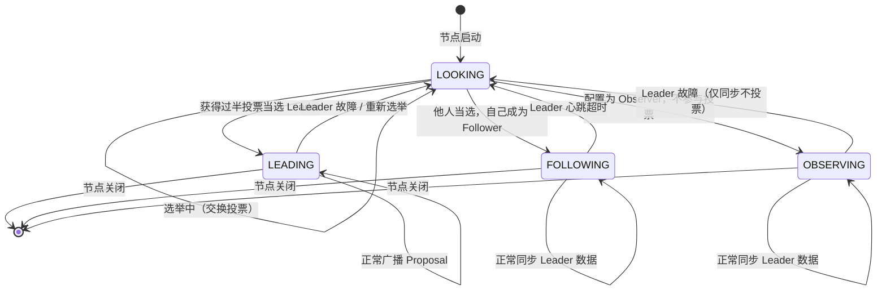
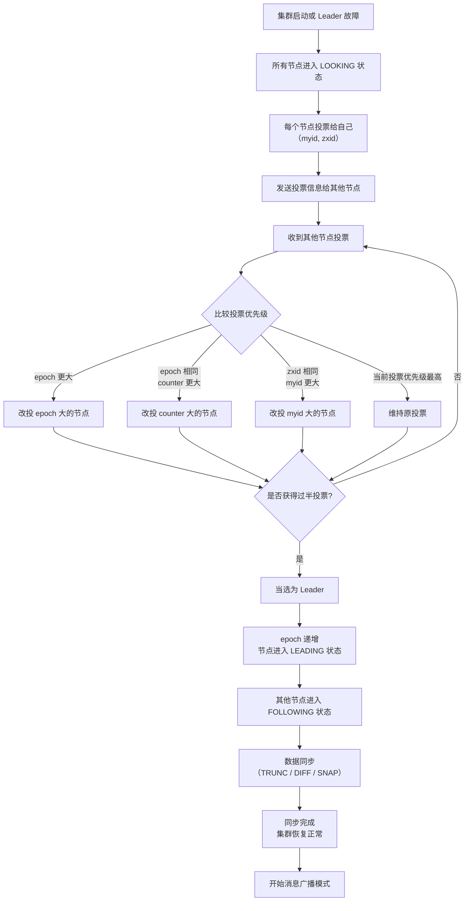

# ZooKeeper 集群与应用场景

> 学习路线对应：分布式微服务模块 — ZooKeeper 专题
> 前置知识：ZooKeeper 核心原理（ZNode、Watcher、CAP 理论）
> 对比 Nacos：ZooKeeper 集群基于 Zab 协议，Nacos 集群基于 Raft/Distro 协议

---

## 一、核心概念

### 1.1 ZAB 协议概述

ZAB（ZooKeeper Atomic Broadcast）协议是 ZooKeeper 专门设计的**原子广播协议**，用于保证分布式数据一致性。它定义了集群中 Leader 与 Follower 之间的通信规则，确保所有事务操作以原子方式按序广播到所有节点。

**ZAB 协议核心设计**：

| 设计要点 | 说明 |
|---------|------|
| 单一 Leader | 所有写请求由 Leader 处理，Follower 转发写请求给 Leader |
| 原子广播 | Leader 将事务 Proposal 广播给所有 Follower，过半 ACK 后提交 |
| 全局顺序 | 每个事务分配全局递增的 zxid，保证所有节点以相同顺序执行事务 |
| 崩溃恢复 | Leader 故障时自动选举新 Leader，保证已提交事务不丢失 |

**ZAB 协议的四种状态**：

| 状态 | 说明 |
|------|------|
| `LOOKING` | 选举状态，节点正在寻找 Leader，启动时或 Leader 故障后进入 |
| `LEADING` | 当前节点为 Leader，处理写请求并广播 Proposal |
| `FOLLOWING` | 当前节点为 Follower，同步 Leader 数据并响应读请求 |
| `OBSERVING` | 当前节点为 Observer，不参与投票但同步数据（类似于 Follower 但不参与选举和过半确认） |

> **集群节点状态流转图**：下图展示一个 ZooKeeper 节点在四种状态（LOOKING / LEADING / FOLLOWING / OBSERVING）之间的流转关系，以及触发状态切换的事件。



**zxid 结构**：

```
zxid（64 位）
├── 高 32 位：epoch（纪元号，每次 Leader 选举递增）
└── 低 32 位：counter（事务计数器，每次事务递增）
```

- epoch 用于区分不同 Leader 任期，防止旧 Leader 在脑裂恢复后造成数据混乱。
- counter 在同一个 epoch 内从 0 开始递增，每个事务分配一个唯一递增的 counter 值。

> 📖 **参考链接**：
> - [ZooKeeper 官方文档 - ZAB Protocol](https://zookeeper.apache.org/doc/current/zookeeperInternals.html#sc_atomicBroadcast) -- ZAB 原子广播协议与四种节点状态说明
> - [ZooKeeper 官方文档 - zxid & epoch](https://zookeeper.apache.org/doc/current/zookeeperInternals.html#sc_leaderElection) -- zxid 结构与 Leader 选举算法
> - [ZooKeeper 官方文档 - Cluster Configuration](https://zookeeper.apache.org/doc/current/zookeeperAdmin.html#sc_zkMulitserver) -- 集群部署与 server.{myid} 配置

### 1.2 领导者选举（Leader Election）

当集群启动或 Leader 故障时，所有节点进入 `LOOKING` 状态，通过投票选举产生新的 Leader。

**选举算法**：

ZooKeeper 采用 **Fast Leader Election** 算法，基于 zxid 的优先级规则：

1. 每个节点投票给自己，将投票信息（myid、zxid）发送给其他节点。
2. 收到其他节点的投票后，按以下优先级比较：
   - 优先比较 `epoch`（zxid 高 32 位），epoch 大的优先。
   - epoch 相同则比较 `counter`（zxid 低 32 位），counter 大的优先。
   - zxid 相同则比较 `myid`（服务器 ID），myid 大的优先。
3. 如果收到的投票优先级更高，则改投该节点。
4. 当某个节点获得超过半数投票时，该节点当选为 Leader。

**选举流程**：

```
节点 A（myid=1, zxid=100）  节点 B（myid=2, zxid=200）  节点 C（myid=3, zxid=150）

1. 初始投票：每个节点投自己
   A: 投 A(1, 100)          B: 投 B(2, 200)            C: 投 C(3, 150)

2. 交换投票，按优先级比较
   A 收到 B(2,200)：B 的 zxid 更大 → A 改投 B
   C 收到 B(2,200)：B 的 zxid 更大 → C 改投 B

3. 统计结果
   B 获得 3 票（过半数），B 当选 Leader，epoch 递增
```

**ZAB 协议 Leader 选举流程 Mermaid 图：**



**选举触发场景：**

| 场景 | 说明 |
|------|------|
| 集群启动 | 所有节点同时启动，进入 LOOKING 状态进行选举 |
| Leader 宕机 | 集群检测到 Leader 心跳超时，Follower 重新选举 |
| Follower 宕机 | 不影响集群正常运行（只要过半节点存活），宕机恢复后重新同步 |

### 1.3 消息广播（Message Broadcast）

消息广播是 ZAB 协议的正常工作模式，Leader 负责接收所有写请求并广播给 Follower。

**消息广播流程**：

```
客户端                Leader                     Follower 1              Follower 2
  |                     |                           |                       |
  |--- write(data) ---->|                           |                       |
  |                     |--- Proposal(zxid, data) -->|                       |
  |                     |--- Proposal(zxid, data) -------------------------->|
  |                     |                           |                       |
  |                     |                           |--- ACK(zxid) -------->|
  |                     |<-- ACK(zxid) -------------|                       |
  |                     |                           |                       |
  |                     |（收到 2 个 ACK，过半）     |                       |
  |                     |--- Commit(zxid) --------->|                       |
  |                     |--- Commit(zxid) -------------------------------->|
  |                     |                           |                       |
  |<--- response -------|                           |                       |
```

> **生活化类比：消息广播 = 班长发作业本** —— 老师（客户端）把一摞作业交给班长（Leader），班长不是自己批改完就完事，而是走一套"两步走"流程：第一步，班长给每位组员（Follower）发一份作业副本（Proposal），组员收到后在自己本子上记下来（写入本地事务日志），举手示意"收到了"（返回 ACK）；第二步，班长数人头，超过半数组员举手（过半 ACK）后，班长宣布"这份作业正式生效，大家记到成绩册上"（发送 Commit），所有组员把作业誊抄到正式成绩册（应用到内存数据树），班长才回复老师"作业收齐了"（返回响应给客户端）。这套流程保证：只要过半组员在场，作业就不会丢；少数组员请假（宕机）不影响整体进度。而且班长可以连续发多份作业（流水线化），不用等上一份全部誊抄完再发下一份。

**两阶段提交（简化版）**：

1. **阶段一（Proposal + ACK）**：Leader 生成 Proposal 并发送给所有 Follower，Follower 收到后写入本地事务日志，返回 ACK。
2. **阶段二（Commit）**：Leader 收到过半 Follower 的 ACK 后，向所有 Follower 发送 Commit 消息，Follower 将事务应用到内存数据树。

**与经典两阶段提交的区别**：

| 维度 | 经典 2PC | ZAB 协议 |
|------|---------|---------|
| 中断处理 | 协调者故障可能导致阻塞 | 自动选举新 Leader 继续服务 |
| 参与者故障 | 需等待超时 | 过半机制，少数节点故障不影响提交 |
| 性能 | 同步阻塞，性能较差 | 流水线化，可连续发送多个 Proposal |

### 1.4 崩溃恢复（Crash Recovery）

当 Leader 故障时，集群进入崩溃恢复模式，通过选举新 Leader 并同步数据来恢复一致性。

**崩溃恢复的核心问题**：

1. **已提交事务不能丢失**：已被 Leader 提交的事务（Proposal + Commit）必须在新 Leader 中保留。
2. **未提交事务必须丢弃**：Leader 已发送 Proposal 但未收到过半 ACK 的事务，可能只有部分节点写入，新 Leader 上任后应丢弃这些事务。

**崩溃恢复流程**：

```
1. Leader 故障，Follower 心跳超时
2. 所有节点进入 LOOKING 状态，启动选举
3. 选举产生新 Leader（拥有最大 zxid 的节点优先）
4. 新 Leader 将自己的 zxid 作为当前 epoch 的上限
5. Follower 与新 Leader 进行数据同步（TRUNC / DIFF / SNAP）
6. 同步完成后，新 Leader 开始消息广播，集群恢复正常
```

**数据同步策略**：

| 同步类型 | 触发条件 | 同步方式 |
|---------|---------|---------|
| `TRUNC` | Follower 的 zxid 大于 Leader 的 zxid | Follower 回退到 Leader 的 zxid 位置，截断多余事务 |
| `DIFF` | Follower 的 zxid 小于 Leader 的 zxid 且差距较小 | Leader 发送差异事务日志给 Follower 逐条同步 |
| `SNAP` | Follower 的 zxid 远小于 Leader 的 zxid | Leader 发送完整快照给 Follower 全量同步 |

> 📖 **参考链接**：
> - [ZooKeeper 官方文档 - Leader Election](https://zookeeper.apache.org/doc/current/zookeeperInternals.html#sc_leaderElection) -- Fast Leader Election 选举算法与崩溃恢复
> - [ZooKeeper 官方文档 - Data Sync](https://zookeeper.apache.org/doc/current/zookeeperInternals.html#sc_recovery) -- 崩溃恢复 TRUNC/DIFF/SNAP 同步策略
> - [ZooKeeper 官方文档 - Quorum & Broadcast](https://zookeeper.apache.org/doc/current/zookeeperInternals.html#sc_atomicBroadcast) -- 消息广播两阶段提交与过半机制

---

## 二、底层原理

### 2.1 过半机制（Quorum）

过半机制是 ZooKeeper 保证数据一致性和可用性的核心设计，要求事务提交和 Leader 选举都需要超过半数节点同意。

**过半机制的计算**：

```
集群节点数 N = 2F + 1（F 为可容忍的故障节点数）

N=3: F=1，容忍 1 个节点故障，过半 = 2
N=5: F=2，容忍 2 个节点故障，过半 = 3
N=7: F=3，容忍 3 个节点故障，过半 = 4
```

**为什么建议奇数节点**：

| 节点数 | 过半 | 容忍故障 | 冗余分析 |
|--------|------|---------|---------|
| 3 | 2 | 1 | 最佳起点，生产环境最小配置 |
| 4 | 3 | 1 | 容忍度与 3 节点相同，多浪费 1 个节点 |
| 5 | 3 | 2 | 比 4 节点多容忍 1 个故障，性价比高 |
| 6 | 4 | 2 | 容忍度与 5 节点相同，多浪费 1 个节点 |

结论：**奇数节点更经济**。偶数节点在容忍故障数上与 N-1 相同，浪费资源。

> **生活化类比：过半机制 = 股东大会决议** —— 一家公司要形成有效决议（事务提交 / Leader 选举），必须超过半数股东同意（过半 ACK / 过半投票），不能"少数服从多数"而是"多数才算数"。假设 5 位股东（5 节点），决议需要至少 3 票（过半 3），所以最多 2 位缺席（容忍 2 个故障）会议还能开。如果只有 4 位股东，决议仍需 3 票，最多也只能容忍 1 位缺席——和 3 位股东时一样，白白多养一位。这也是为什么公司股东数建议奇数（奇数节点更经济）：多一位股东就多一份工资（机器成本），但容忍缺席的能力没变。哪怕股东们分散在不同写字楼（网络分区），只要过半股东能凑齐开会，决议就有效；少数派那边凑不够过半，自动休会（LOOKING 拒绝服务），避免出现"两个董事会"（脑裂）。

**过半机制在两个场景的应用**：

| 场景 | 过半要求 | 不满足时的后果 |
|------|---------|--------------|
| Leader 选举 | 候选人获得超过半数投票 | 无法选出 Leader，集群不可用 |
| 事务提交 | 过半 Follower 返回 ACK | 事务提交失败，集群不可用 |
| 节点加入 | 新节点需要通过过半确认 | 无法加入集群 |

### 2.2 集群角色

ZooKeeper 集群中节点分为三种角色，各自承担不同的职责。

| 角色 | 职责 | 参与选举 | 参与过半确认 | 处理读请求 | 处理写请求 |
|------|------|---------|------------|-----------|-----------|
| **Leader** | 唯一写处理器，广播 Proposal，协调事务提交 | 被选举 | 无需（自己是 Leader） | 是 | 是 |
| **Follower** | 参与选举，参与过半确认，同步 Leader 数据，处理读请求 | 是 | 是 | 是 | 否（转发给 Leader） |
| **Observer** | 同步 Leader 数据，处理读请求，不参与选举和过半确认 | 否 | 否 | 是 | 否（转发给 Leader） |

**Observer 角色的引入原因**：

- 随着集群规模增大，参与过半确认的节点增多，事务提交延迟增大。
- Observer 不参与投票，可在不影响写性能的前提下扩展集群读能力。
- 适合跨数据中心部署：主数据中心部署 Leader+Follower，备数据中心部署 Observer。

**Observer 配置**：

```properties
# zoo.cfg - 在 Follower 节点配置基础上添加
peerType=observer
server.4=observer-host:2888:3888:observer
```

**集群部署建议**：

| 规模 | 节点配置 | 适用场景 |
|------|---------|---------|
| 3 节点 | 1 Leader + 2 Follower | 开发测试环境 |
| 5 节点 | 1 Leader + 4 Follower | 生产环境标准配置 |
| 7 节点 | 1 Leader + 4 Follower + 2 Observer | 大规模生产环境，跨机房部署 |

> 📖 **参考链接**：
> - [ZooKeeper 官方文档 - Observer Role](https://zookeeper.apache.org/doc/current/zookeeperObservers.html) -- Observer 角色引入原因与 peerType=observer 配置
> - [ZooKeeper 官方文档 - Quorum Mechanism](https://zookeeper.apache.org/doc/current/zookeeperInternals.html#sc_leaderElection) -- 过半机制与奇数节点选型建议
> - [ZooKeeper 官方文档 - Cluster Sizing](https://zookeeper.apache.org/doc/current/zookeeperAdmin.html#sc_clusterOptions) -- 集群规模与 initLimit/syncLimit 参数调优

### 2.3 脑裂问题

脑裂（Split-Brain）是指集群中部分节点之间网络不通，导致出现多个 Leader 同时提供服务，造成数据不一致。

**ZooKeeper 如何避免脑裂**：

1. **过半机制**：任何决策需要超过半数节点同意。网络分区后，少数派无法凑够过半票数，自动退化为 LOOKING 状态，拒绝服务。
2. **epoch 机制**：每个 Leader 任期有唯一的 epoch 号。旧 Leader 网络恢复后发现 epoch 已落后，自动降级为 Follower。
3. **Quorum 检查**：Follower 定期检查与 Leader 的连接，若超时则发起重新选举，确保集群中只有一个有效 Leader。

**脑裂场景分析**：

```
初始状态：5 节点集群，A 为 Leader，B/C/D/E 为 Follower

网络分区：A 和 B 在一组（少数派，2 个）
         C/D/E 在另一组（多数派，3 个）

少数派（A/B）：A 无法获得过半 ACK → 事务提交失败 → 集群不可用
多数派（C/D/E）：心跳超时 → 发起选举 → C 当选新 Leader → 继续服务

网络恢复：A 发现 epoch 落后 → 自动降级为 Follower → 同步 C 的数据
```

**脑裂 vs 网络分区**：

| 概念 | 定义 | ZooKeeper 应对 |
|------|------|---------------|
| 脑裂 | 同一集群出现多个 Leader | 过半机制 + epoch 机制防止 |
| 网络分区 | 节点间网络不通 | 少数派自动退位，多数派继续服务 |

### 2.4 集群配置文件

**zoo.cfg 核心配置**：

```properties
# 数据存储目录（快照文件）
dataDir=/data/zookeeper

# 事务日志目录（建议单独磁盘，与 dataDir 分开）
dataLogDir=/data/zookeeper/logs

# 客户端连接端口
clientPort=2181

# 心跳间隔（毫秒），Follower 与 Leader 之间的心跳周期
tickTime=2000

# 初始同步超时时间（tickTime 倍数），Follower 启动时同步 Leader 数据的最大等待时间
initLimit=10

# 消息同步超时时间（tickTime 倍数），Follower 与 Leader 之间消息同步的最大等待时间
syncLimit=5

# 集群节点配置：server.{myid}={host}:{peerPort}:{leaderElectionPort}
server.1=zk1:2888:3888
server.2=zk2:2888:3888
server.3=zk3:2888:3888

# 自动清理配置
autopurge.snapRetainCount=3
autopurge.purgeInterval=1

# 最大客户端连接数（默认 60）
maxClientCnxns=60
```

**myid 文件**：

每个节点在 `dataDir` 目录下需要有一个 `myid` 文件，包含该节点的唯一标识数字，与 `server.{myid}` 中的编号对应。

```bash
# 在 zk1 节点上
echo "1" > /data/zookeeper/myid

# 在 zk2 节点上
echo "2" > /data/zookeeper/myid
```

> 📖 **参考链接**：
> - [ZooKeeper 官方文档 - Cluster Setup](https://zookeeper.apache.org/doc/current/zookeeperAdmin.html#sc_zkMulitserver) -- 集群部署、zoo.cfg 与 myid 配置官方指南
> - [ZooKeeper 官方文档 - Configuration Parameters](https://zookeeper.apache.org/doc/current/zookeeperAdmin.html#sc_configuration) -- tickTime/initLimit/syncLimit 等核心参数说明
> - [ZooKeeper 官方文档 - Performance](https://zookeeper.apache.org/doc/current/zookeeperPerformance.html) -- 集群性能调优与磁盘分离建议

---

## 三、实战应用

### 3.1 分布式锁实现

分布式锁是 ZooKeeper 最经典的应用场景，用于在分布式环境中协调多个进程对共享资源的互斥访问。

**排他锁（Exclusive Lock）**：

所有客户端竞争同一个锁节点，成功创建的客户端获得锁，其他客户端注册 Watcher 等待。

```java
// Curator 排他锁实现
InterProcessMutex lock = new InterProcessMutex(client, "/locks/resource-a");

// 获取锁（阻塞等待）
lock.acquire();
try {
    // 执行临界区代码
    doSomething();
} finally {
    // 释放锁
    lock.release();
}
```

**排他锁底层原理**：

```
1. 客户端 A 调用 create /locks/resource-a，创建成功 → 获得锁
2. 客户端 B 调用 create /locks/resource-a，节点已存在 → 创建失败
3. 客户端 B 注册 Watcher 监听 /locks/resource-a 的删除事件
4. 客户端 A 释放锁（delete /locks/resource-a）
5. 客户端 B 收到 Watcher 通知 → 重试 create → 成功获得锁
```

**读写锁（ReadWriteLock）**：

```java
// Curator 读写锁实现
InterProcessReadWriteLock rwLock = new InterProcessReadWriteLock(client, "/locks/resource-a");

// 读锁（共享锁，多个客户端可同时持有）
InterProcessMutex readLock = rwLock.readLock();
readLock.acquire();
try {
    // 执行读操作
    readData();
} finally {
    readLock.release();
}

// 写锁（排他锁，只有一个客户端可持有）
InterProcessMutex writeLock = rwLock.writeLock();
writeLock.acquire();
try {
    // 执行写操作
    writeData();
} finally {
    writeLock.release();
}
```

**公平锁（基于临时有序节点）**：

```java
// Curator 公平锁实现（底层使用临时有序节点）
InterProcessSemaphoreMutex fairLock = new InterProcessSemaphoreMutex(client, "/locks/fair");

fairLock.acquire();
try {
    doSomething();
} finally {
    fairLock.release();
}
```

**公平锁原理**：

```
1. 所有客户端在 /locks/fair 下创建临时有序节点（如 /locks/fair/0000000001）
2. 客户端获取 /locks/fair 下的所有子节点，按序号排序
3. 序号最小的节点对应的客户端获得锁
4. 未获得锁的客户端注册 Watcher 监听序号比自己小一位的节点
5. 前一个节点释放（删除）后，下一个客户端收到通知，获取锁
```

**分布式锁方案对比**：

| 维度 | ZooKeeper 锁 | Redis 锁（Redisson） | 数据库锁 |
|------|-------------|---------------------|---------|
| 实现方式 | 临时节点 + Watcher | SETNX + Lua 脚本 | SELECT FOR UPDATE |
| 可靠性 | 高（CP 架构） | 中（AP 架构，主从切换可能丢锁） | 低（依赖数据库可用性） |
| 性能 | 中（比 Redis 低） | 高 | 低 |
| 公平锁 | 支持（临时有序节点） | 支持 | 需自行实现 |
| 自动释放 | 是（会话超时自动删除临时节点） | 是（看门狗续期 + TTL） | 否（依赖事务超时） |
| 适用场景 | 要求强一致性的锁场景 | 高并发、可容忍短暂不一致 | 已有数据库且并发低 |

### 3.2 配置中心实现

ZooKeeper 作为配置中心，利用其 Watcher 机制实现配置的动态更新和实时推送。

**配置中心架构**：

```
配置管理后台
    |
    v
ZooKeeper 集群
    |
    +-- /config/db/url          = "jdbc:mysql://localhost:3306/mydb"
    +-- /config/db/username     = "root"
    +-- /config/db/password     = "encrypted_password"
    +-- /config/redis/host      = "127.0.0.1"
    +-- /config/redis/port      = "6379"
    +-- /config/app/timeout     = "3000"
    |
    v
应用实例 A  应用实例 B  应用实例 C
（注册 Watcher，配置变更时自动刷新）
```

**配置管理核心代码**：

```java
@Component
public class ZkConfigCenter {
    @Autowired
    private CuratorFramework client;

    private final Map<String, String> configCache = new ConcurrentHashMap<>();
    private final Map<String, NodeCache> nodeCaches = new ConcurrentHashMap<>();

    // 初始化配置监听
    @PostConstruct
    public void init() throws Exception {
        // 确保配置根节点存在
        if (client.checkExists().forPath("/config") == null) {
            client.create().creatingParentsIfNeeded().forPath("/config");
        }
        // 监听所有子节点
        TreeCache treeCache = new TreeCache(client, "/config");
        treeCache.getListenable().addListener((curatorClient, event) -> {
            if (event.getData() != null) {
                String path = event.getData().getPath();
                String value = new String(event.getData().getData(), StandardCharsets.UTF_8);
                configCache.put(path, value);
                log.info("配置变更: {} = {}", path, value);
                onConfigChanged(path, value);
            }
        });
        treeCache.start();
    }

    // 获取配置
    public String getConfig(String path) {
        return configCache.get(path);
    }

    // 配置变更回调
    private void onConfigChanged(String path, String value) {
        // 根据路径触发对应的刷新逻辑
        if (path.contains("/db/")) {
            refreshDataSource();
        } else if (path.contains("/redis/")) {
            refreshRedisConnection();
        }
    }
}
```

**配置中心方案对比**：

| 维度 | ZooKeeper | Nacos | Apollo |
|------|-----------|-------|--------|
| 配置推送 | Watcher（实时） | 长轮询（实时） | 长轮询（实时） |
| 配置管理界面 | 无（需自行开发） | 内置 | 内置 |
| 灰度发布 | 需自行实现 | 支持 | 支持 |
| 配置版本管理 | 需自行实现 | 支持 | 支持 |
| 权限控制 | ACL 粒度到节点 | RBAC | RBAC |
| 适用场景 | 已有 ZooKeeper 集群的轻量场景 | 新项目首选 | 配置管理功能要求高的场景 |

### 3.3 服务注册与发现

ZooKeeper 通过临时节点实现服务注册，通过 Watcher 实现服务发现。

**服务注册**：

```java
@Component
public class ServiceRegistry {
    @Autowired
    private CuratorFramework client;

    @Value("${server.port}")
    private int port;

    private String servicePath;

    @PostConstruct
    public void register() throws Exception {
        String serviceName = "order-service";
        String ip = InetAddress.getLocalHost().getHostAddress();
        String instancePath = String.format("/services/%s/%s:%d", serviceName, ip, port);

        // 确保父节点存在
        client.create().creatingParentsIfNeeded()
                .forPath("/services/" + serviceName);

        // 创建临时节点注册服务实例
        this.servicePath = client.create()
                .withMode(CreateMode.EPHEMERAL)
                .forPath(instancePath, "{\"weight\":100}".getBytes());

        log.info("服务注册成功: {}", instancePath);
    }

    @PreDestroy
    public void unregister() {
        // 临时节点在会话关闭后自动删除，也可手动删除
        log.info("服务注销: {}", servicePath);
    }
}
```

**服务发现**：

```java
@Component
public class ServiceDiscovery {
    @Autowired
    private CuratorFramework client;

    private final Map<String, List<ServiceInstance>> serviceCache = new ConcurrentHashMap<>();

    @PostConstruct
    public void init() throws Exception {
        // 监听服务节点变化
        PathChildrenCache cache = new PathChildrenCache(client, "/services", true);
        cache.getListenable().addListener((curatorClient, event) -> {
            refreshServiceInstances();
        });
        cache.start();
        refreshServiceInstances();
    }

    private void refreshServiceInstances() {
        try {
            List<String> services = client.getChildren().forPath("/services");
            for (String serviceName : services) {
                List<String> instances = client.getChildren()
                        .forPath("/services/" + serviceName);
                List<ServiceInstance> list = instances.stream().map(instance -> {
                    String[] parts = instance.split(":");
                    return new ServiceInstance(serviceName, parts[0],
                            Integer.parseInt(parts[1]));
                }).collect(Collectors.toList());
                serviceCache.put(serviceName, list);
            }
        } catch (Exception e) {
            log.error("刷新服务实例失败", e);
        }
    }

    public List<ServiceInstance> getInstances(String serviceName) {
        return serviceCache.getOrDefault(serviceName, Collections.emptyList());
    }
}
```

### 3.4 Leader 选举

在分布式系统中，有时需要从多个工作节点中选出一个 Leader 来执行特定任务（如定时任务调度、数据分片协调）。

```java
@Component
public class LeaderElection {
    @Autowired
    private CuratorFramework client;

    private LeaderSelector leaderSelector;

    @PostConstruct
    public void init() {
        leaderSelector = new LeaderSelector(client, "/leader/scheduler",
                new LeaderSelectorListenerAdapter() {
                    @Override
                    public void takeLeadership(CuratorFramework client) throws Exception {
                        log.info("当前节点成为 Leader，开始执行调度任务");
                        try {
                            while (true) {
                                // 执行 Leader 专属任务
                                executeScheduledTask();
                                Thread.sleep(5000);
                            }
                        } finally {
                            log.info("释放 Leader 身份");
                        }
                    }
                });

        // 放弃 Leader 后自动重新参与选举
        leaderSelector.autoRequeue();
        leaderSelector.start();
    }

    private void executeScheduledTask() {
        // 定时任务逻辑
    }

    @PreDestroy
    public void destroy() {
        leaderSelector.close();
    }
}
```

**Leader 选举原理**：

```
1. 所有候选节点在 /leader/scheduler 下创建临时有序节点
2. 序号最小的节点当选为 Leader
3. 其他节点注册 Watcher 监听序号比自己小一位的节点
4. Leader 节点故障（会话超时），临时节点自动删除
5. 下一个序号最小的节点收到 Watcher 通知，当选为新 Leader
```

> 📖 **参考链接**：
> - [ZooKeeper 官方文档 - Recipes & Solutions](https://zookeeper.apache.org/doc/current/recipes.html) -- 分布式锁、Leader 选举、队列等经典场景官方实现方案
> - [ZooKeeper 官方文档 - Curator Recipes](https://curator.apache.org/curator-recipes/) -- Curator InterProcessMutex/LeaderSelector/NodeCache 等高级配方
> - [ZooKeeper 官方文档 - Service Discovery](https://zookeeper.apache.org/doc/current/recipes.html#sc_outOfBand) -- 基于临时节点的服务注册与发现实现

---

## 四、常见面试题

### 1. 请简述 ZAB 协议的工作流程。

**答**：ZAB 协议包含两种工作模式：

**消息广播模式**（正常模式）：
1. Leader 接收客户端写请求，生成 Proposal 并广播给所有 Follower。
2. Follower 收到 Proposal 后写入本地事务日志，返回 ACK。
3. Leader 收到过半 Follower 的 ACK 后，发送 Commit 消息给所有 Follower。
4. 所有节点将事务应用到内存数据树，Leader 返回结果给客户端。

**崩溃恢复模式**（异常模式）：
1. Leader 故障后，所有节点进入 LOOKING 状态，启动 Fast Leader Election。
2. 选举产生新 Leader（拥有最大 zxid 的节点优先）。
3. 新 Leader 与各 Follower 进行数据同步（TRUNC/DIFF/SNAP）。
4. 同步完成后，集群恢复正常，进入消息广播模式。

### 2. ZooKeeper 集群为什么建议使用奇数节点？

**答**：过半机制要求事务提交和 Leader 选举都需要超过半数节点同意。假设集群节点数为 N：

- 如果 N=3，过半为 2，可容忍 1 个节点故障。
- 如果 N=4，过半为 3，可容忍 1 个节点故障（与 3 节点容忍度相同）。
- 如果 N=5，过半为 3，可容忍 2 个节点故障。

偶数节点（如 4 节点）在容忍故障数上与 N-1（3 节点）相同，白白浪费 1 个节点资源。因此奇数节点更经济。生产环境建议至少 3 节点，5 节点为常用配置。

### 3. Observer 角色有什么作用？为什么需要 Observer？

**答**：Observer 是 ZooKeeper 3.3 引入的角色，与 Follower 类似但不参与 Leader 选举和事务过半确认。

**引入原因**：
1. **扩展读能力**：随着集群规模增大，参与过半确认的节点增多会导致事务提交延迟增大。Observer 不参与投票，可在不影响写性能的前提下水平扩展读能力。
2. **跨数据中心部署**：主数据中心部署 Leader 和 Follower，备数据中心部署 Observer，实现就近读取，同时避免跨数据中心延迟影响写性能。
3. **降低选举复杂度**：Observer 不参与选举，减少选举过程中的通信开销。

### 4. ZooKeeper 如何实现分布式锁？公平锁和非公平锁的区别是什么？

**答**：

**排他锁（非公平锁）**：所有客户端竞争创建同一个同名节点，创建成功的客户端获得锁，其他客户端注册 Watcher 等待节点删除。当锁释放时，所有等待的客户端同时唤醒竞争，无法保证先到先得。

**公平锁**：所有客户端在锁目录下创建临时有序节点，获取所有子节点并按序号排序，序号最小的客户端获得锁。其他客户端注册 Watcher 监听序号比自己小一位的节点。释放锁时，只有下一个客户端被唤醒，实现先到先得。

**Curator 实现**：
- 排他锁：`InterProcessMutex`（基于同名临时节点，非公平）
- 公平锁：`InterProcessSemaphoreMutex`（基于临时有序节点，公平）
- 读写锁：`InterProcessReadWriteLock`（读锁共享，写锁排他）

### 5. 什么是脑裂？ZooKeeper 如何避免脑裂？

**答**：脑裂是指集群中部分节点之间网络不通，导致出现多个 Leader 同时提供服务，造成数据不一致。

**ZooKeeper 的避免机制**：
1. **过半机制**：任何决策需要超过半数节点同意。网络分区后，少数派无法凑够过半票数，自动退化为 LOOKING 状态并拒绝服务。
2. **epoch 机制**：每个 Leader 任期有唯一的递增 epoch 号。旧 Leader 网络恢复后发现 epoch 已落后，自动降级为 Follower 并同步数据。
3. **Quorum 检查**：Follower 定期检查与 Leader 的连接，超时则发起重新选举。

### 6. ZooKeeper 的配置中心相比 Nacos/Apollo 有什么优缺点？

**答**：

| 维度 | ZooKeeper | Nacos/Apollo |
|------|-----------|-------------|
| 配置推送 | Watcher 实时推送 | 长轮询实时推送 |
| 管理界面 | 无（需自行开发） | 内置 Web 管理界面 |
| 灰度发布 | 需自行实现 | 原生支持 |
| 版本管理 | 需自行实现 | 原生支持 |
| 权限控制 | ACL 粒度到节点 | RBAC 角色权限 |
| 部署依赖 | 需独立部署 ZK 集群 | 需独立部署 Nacos/Apollo 服务 |

**适用场景**：如果已有 ZooKeeper 集群且配置数量较少，可直接使用；如果配置管理功能要求高（灰度发布、版本管理、审计等），建议使用 Nacos 或 Apollo 专用配置中心。

---

## 五、避坑指南

| 常见错误 | 现象 | 原因 | 解决方案 |
|---------|------|------|---------|
| 集群节点数为偶数 | 容忍故障数与奇数 N-1 相同，浪费资源 | 过半机制：4 节点需要 3 票，容忍 1 个故障，与 3 节点相同 | 使用奇数节点（3/5/7），生产环境推荐 5 节点 |
| 所有节点部署在同一物理机 | 物理机故障导致集群全部不可用 | 未考虑物理层面的容灾 | 节点分散部署在不同物理机或机架上，跨可用区部署 |
| 事务日志和快照共用同一磁盘 | 磁盘 IO 竞争，写性能下降 | 事务日志 fsync 和快照写入争抢同一磁盘 IO | 配置 `dataLogDir` 将事务日志分离到独立磁盘（建议 SSD） |
| 未配置 Observer 或配置位置不当 | 跨数据中心延迟大，写性能受影响 | 跨数据中心节点参与过半确认，网络延迟导致事务提交变慢 | 跨数据中心节点配置为 Observer，仅主数据中心节点参与投票 |
| 分布式锁未释放或锁路径残留 | 其他客户端永久阻塞或死锁 | 客户端异常退出未释放锁，或持久节点未清理 | 使用临时节点实现锁，会话超时自动删除；使用 Curator 框架保证 finally 释放 |
| 大量客户端同时注册 Watcher | 变更时通知风暴，ZooKeeper 服务端压力大 | 大量客户端监听了同一节点 | 控制 Watcher 数量；使用 Curator 的 TreeCache 缓存变更；避免在高频变更节点注册 Watcher |
| 未设置合理的 sessionTimeout | 频繁超时重建临时节点，或故障恢复慢 | sessionTimeout 过小则网络抖动导致频繁超时，过大则故障检测延迟 | 根据网络环境设置 10-30 秒，结合 `minSessionTimeout` 和 `maxSessionTimeout` 服务端参数 |
| 跨机房部署未考虑网络延迟 | 选举频繁，事务提交延迟高 | 跨机房网络延迟大，心跳超时导致频繁选举 | 单机房部署 Leader+Follower，跨机房部署 Observer；调大 `tickTime` 和 `syncLimit` 适应延迟 |

## 本章学习自检

完成本章学习后，应该能够：
- [ ] 用自己的话解释 ZAB 协议（领导者选举、消息广播、崩溃恢复）、过半机制、三种集群角色（Leader/Follower/Observer）的职责与区别、脑裂问题的成因与防范
- [ ] 手写 Curator 分布式锁（排他锁/读写锁）、配置中心、服务注册发现、Leader 选举的代码实现
- [ ] 回答常见面试题（ZAB 协议流程、奇数节点原因、Observer 作用、分布式锁实现、脑裂避免、配置中心对比）
- [ ] 在实战项目中搭建 ZooKeeper 集群，配置分布式锁和配置中心
- [ ] 识别并避免常见错误（偶数节点、单物理机部署、事务日志共享磁盘、Observer 配置不当、锁未释放、通知风暴、sessionTimeout 不当、跨机房延迟）

---

> **学习导航**：
> - 返回 [学习路线总览](../../README.md)
> - 本模块其他文件：[01-ZooKeeper核心原理](./01-Zookeeper核心原理.md) | [ZooKeeper笔面试题集](./Zookeeper笔面试题集.md)