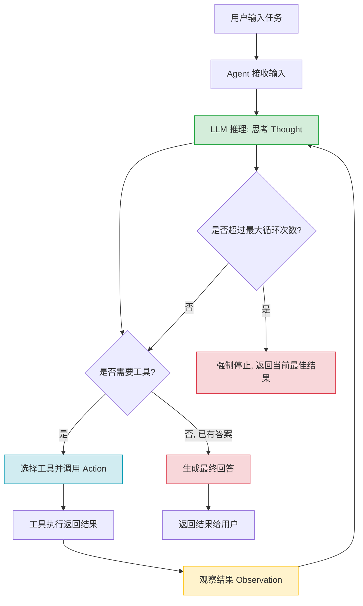

# LangChain与AI智能体核心

> AI智能体是大语言模型能力的延伸，LangChain生态提供了从基础组件到高阶编排的完整工具链。本文系统性梳理LangChain核心架构、核心组件与设计思想，帮助你快速掌握构建AI智能体的核心知识。

> 📖 **参考链接**：
> - [LangChain 官方文档](https://python.langchain.com/docs/) -- LangChain 框架完整文档，含组件、链、Agent、Memory 等模块说明
> - [LangChain 模块：Chains](https://python.langchain.com/docs/modules/chains/) -- Chain 组件编排的接口与用法
> - [LangChain 模块：Agents](https://python.langchain.com/docs/modules/agents/) -- Agent 工具调用与 ReAct 模式详解
> - [LangChain 模块：Memory](https://python.langchain.com/docs/modules/memory/) -- 对话记忆与上下文管理方案
> - [LangChain 模块：Tools](https://python.langchain.com/docs/modules/tools/) -- 内置工具与自定义工具集成方式

---

## 目录

- [一、AI Agent基础概念](#一ai-agent基础概念)
- [二、LangChain生态全景](#二langchain生态全景)
- [三、核心组件：ModelI/O](#三核心组件modelio)
- [四、核心组件：Chain](#四核心组件chain)
- [五、核心组件：Tool与Agent](#五核心组件tool与agent)
- [六、核心组件：Memory](#六核心组件memory)
- [七、LangGraph高阶编排](#七langgraph高阶编排)
- [学习导航](#学习导航)
- [自检清单](#自检清单)

---

## 一、AI Agent基础概念

### 1.1 什么是AI智能体

AI智能体（AI Agent）是一个能够**感知环境→做出决策→执行动作**的自主系统。在大语言模型时代，AI Agent以LLM为大脑，通过工具调用与外部世界交互，完成复杂任务。

**核心特性：**
- **自主性**：可以自主决策，不需要人类一步步指令
- **反应性**：能够感知环境变化并做出响应
- **目标导向**：围绕最终目标分解任务、逐步推进
- **可交互**：能够调用工具、访问外部系统、与人协同

### 1.2 感知-决策-执行循环

AI Agent运行的核心是一个循环过程：

```
感知 → 决策 → 执行 → 感知（更新）→ 决策 → 执行 → ... → 完成目标
```

| 阶段 | 说明 | 核心组件 |
|------|------|----------|
| **感知** | 接收用户输入、读取环境状态、记忆上下文 | Memory、Retriever |
| **决策** | 基于当前状态和目标，思考下一步做什么 | LLM、Planning |
| **执行** | 调用工具、执行动作、获取结果 | Tool、AgentExecutor |

### 1.3 为什么需要AI Agent

- **突破LLM上下文限制**：通过工具调用获取实时信息、访问外部知识库
- **完成复杂任务**：自动分解任务，分步执行，最终达成目标
- **与现有系统集成**：调用API、操作数据库、执行代码
- **人机协同**：在关键节点寻求人类帮助，处理不确定性

---

### 1.4 生活化类比：理解Agent、Chain与Memory

> 用日常生活中的场景来理解AI Agent的核心概念，让抽象的技术变得直观。

**Agent循环 = 餐厅服务员**

想象你走进一家餐厅，服务员迎上来问你："今天想吃什么？"你回答后，服务员转身走向厨房，把订单交给厨师（调用工具），厨师做好菜后，服务员端回来给你（观察结果）。如果你说"再帮我加点辣"，服务员会再次走向厨房（再次调用工具），直到你满意为止。

AI Agent的工作方式完全一样：接收用户输入（接单）→ 思考需要什么工具（决定去厨房）→ 调用工具获取结果（取菜）→ 返回结果给用户（上菜）→ 如果用户不满意，继续循环。这就是ReAct模式的核心思想。

**Chain = 工厂流水线**

在工厂流水线上，每个工位有固定的职责：工位A负责组装零件，工位B负责喷漆，工位C负责质检。每个工位接收上一步的输出，处理后传给下一个工位。流水线一旦设定好，顺序就固定了，不会中途改变。

LangChain的Chain正是如此：`PromptTemplate → LLM → OutputParser` 就是一个典型的流水线，数据从一端流入，经过每个环节处理，从另一端流出。Chain适合确定性的、步骤固定的任务流程。

**Memory = 记事本**

和朋友聊天时，你不会每句话都忘记之前说了什么——你会记住上下文。但如果聊天太长，你可能会在笔记本上记下关键信息，以免忘记。

AI Agent的Memory机制也是如此：`ConversationBufferMemory` 就像你用脑子记住所有对话（短对话没问题，长了就记不住）；`ConversationSummaryMemory` 就像你把对话要点记在笔记本上（节省空间但会丢失细节）；`VectorStoreRetrieverMemory` 就像你有一个超强的索引系统，能快速找到和当前话题相关的历史记录。

---

## 二、LangChain生态全景

### 2.1 三大核心组件

LangChain生态由三个核心项目组成：

| 项目 | 定位 | 主要用途 |
|------|------|----------|
| **LangChain** | 基础框架 | 提供LLM调用、Prompt管理、Chain组合、Tool集成、Agent执行器等基础组件 |
| **LangGraph** | 高阶编排 | 构建有状态、多节点、可循环的AI工作流，支持复杂Agent编排 |
| **LangSmith** | 开发平台 | 调试、评测、监控LangChain应用，可视化执行过程 |

### 2.2 LangChain核心设计思想

**模块化设计**：每个功能独立成组件，可以灵活组合
- Model I/O：与LLM交互
- Retrieval：接入外部数据
- Chains：组件编排
- Agents：工具调用决策
- Memory：状态管理

**可扩展**：所有组件都有抽象接口，支持自定义实现
**开箱即用**：提供大量内置整合（OpenAI、Anthropic、Google等）

### 2.3 LangChain vs LangGraph 选择指南

| 场景 | 推荐 |
|------|------|
| 简单线性流程 | LangChain Chain |
| 固定顺序调用 | SequentialChain |
| 根据条件分支 | RouterChain |
| 需要循环、多轮思考 | LangGraph |
| 复杂多智能体协作 | LangGraph |
| 人机协同、中断恢复 | LangGraph |

---

## 三、核心组件：ModelI/O

ModelI/O是LangChain与大语言模型交互的抽象层，包含三个核心部分：**Chat Model调用**、**PromptTemplate**、**OutputParser**。

### 3.1 Chat Model调用

LangChain统一了不同模型供应商的接口：

```python
from langchain_openai import ChatOpenAI
from langchain_anthropic import ChatAnthropic

# 统一接口，切换供应商只需要换一行
llm = ChatOpenAI(model="gpt-4o", temperature=0)
# llm = ChatAnthropic(model="claude-3-opus-20240229")

# 同步调用
response = llm.invoke("你好")

# 流式调用
for chunk in llm.stream("写一篇长文"):
    print(chunk.content, end="")
```

**核心特性**：
- 统一的`invoke`/`stream`/`batch`接口
- 支持同步/异步调用
- 统一的`BaseMessage`抽象（SystemMessage/HumanMessage/AIMessage）

### 3.2 PromptTemplate

PromptTemplate用于动态生成提示词：

```python
from langchain_core.prompts import ChatPromptTemplate

# 多消息模板
prompt = ChatPromptTemplate.from_messages([
    ("system", "你是一个{role}专家"),
    ("human", "请解释{question}"),
])

# 格式化
messages = prompt.format_messages(
    role="Python",
    question="什么是装饰器"
)
```

**常用变体**：
- `PromptTemplate`：纯文本模板
- `ChatPromptTemplate`：对话模板（支持多角色）
- `FewShotPromptTemplate`：少样本提示模板

### 3.3 OutputParser

OutputParser将LLM输出解析为结构化格式：

```python
# LangChain 0.2+ 推荐使用 langchain_core
from langchain_core.output_parsers import PydanticOutputParser
from pydantic import BaseModel, Field

class Answer(BaseModel):
    summary: str = Field(description="总结")
    points: list[str] = Field(description="要点列表")

parser = PydanticOutputParser(pydantic_object=Answer)
```

**常用解析器**：
| 解析器 | 用途 |
|--------|------|
| `PydanticOutputParser` | 解析为Pydantic模型 |
| `JsonOutputParser` | 解析为JSON |
| `CommaSeparatedListOutputParser` | 解析为列表 |
| `StructuredOutputParser` | 解析为多个字段 |
| `RetryOutputParser` | 解析失败自动重试 |

---

## 四、核心组件：Chain

Chain是LangChain的组件编排方式，将多个步骤组合成一个流水线。

> **生活化类比：Chain=流水线** —— Chain 就像工厂的流水线：原料（输入数据）从一头进，经过一道道工序（PromptTemplate → LLM → OutputParser），最后从另一头出成品（结构化结果）。每道工序只管把自己的活干好，不用关心上下游；LCEL 的 `|` 管道符就是流水线上的传送带，把上一道工序的输出自动送到下一道。SequentialChain 是单条流水线串联，RouterChain 则是流水线分叉——根据原料类型送到不同支线加工。流水线的好处是确定、可预测、易调试，适合步骤固定的任务。

### 4.1 LLMChain（已废弃，推荐使用 LCEL）

> LLMChain 在 LangChain 0.2+ 中已废弃，推荐使用 LCEL（LangChain Expression Language）的 `|` 管道语法。

最简单的组合：`PromptTemplate + LLM + OutputParser`

```python
from langchain.chains import LLMChain

# 传统写法
chain = LLMChain(llm=llm, prompt=prompt, output_parser=parser)
result = chain.run(question="什么是AI Agent")

# 新式写法（LangChain Expression Language）
chain = prompt | llm | parser
result = chain.invoke({"question": "什么是AI Agent"})
```

### 4.2 SequentialChain（顺序链）

按顺序执行多个链，前一个链的输出作为后一个链的输入：

```python
from langchain.chains import SequentialChain

chain1 = LLMChain(..., output_key=["outline"])
chain2 = LLMChain(..., output_key=["content"])

overall_chain = SequentialChain(
    chains=[chain1, chain2],
    input_variables=["topic"],
    output_variables=["content"]
)
```

适用场景：线性流程，比如先写大纲再写内容。

### 4.3 RouterChain（路由链）

根据输入内容选择不同的分支处理：

```python
from langchain.chains.router import MultiPromptChain
from langchain.chains.router.llm_router import LLMRouterChain

# 为不同领域创建不同prompt
physics_prompt = ...  # 物理问题
math_prompt = ...     # 数学问题
other_prompt = ...   # 其他问题

router_chain = LLMRouterChain.from_llm(llm, prompt_infos)
destination_chains = {
    "physics": physics_chain,
    "math": math_chain,
    "default": default_chain
}

chain = MultiPromptChain(
    router_chain=router_chain,
    destination_chains=destination_chains,
    default_chain=default_chain
)
```

适用场景：分类处理，不同类型输入走不同逻辑。

### 4.4 LCEL 现代写法

LangChain Expression Language（LCEL）是新一代组合方式，更简洁灵活：

```python
# 传统方式 vs LCEL
chain = (
    {"question": lambda x: x["question"]}
    | prompt
    | llm
    | parser
)

# 支持并行、分支、流式
result = chain.stream({"question": "..."})
```

---

## 五、核心组件：Tool与Agent

Agent = LLM大脑 + Tool调用能力。Agent根据目标决定什么时候调用什么工具，获得结果后继续推理。

### 5.1 Tool工具集成

Tool是Agent可以调用的外部功能。

#### 内置工具

LangChain提供大量开箱即用的工具：

```python
from langchain_community.tools import (
    WikipediaQueryRun,
    ArxivQueryRun,
    GoogleSearchResults,
    PythonREPL
)

# 维基百科搜索
wiki = WikipediaQueryRun()
# 执行Python代码
python_repl = PythonREPL()
```

**常用内置工具分类**：
- 搜索类：Google Search、Bing Search、Wikipedia
- 开发工具：Python REPL、Bash
- API类：各种第三方API封装
- 数据库：SQL查询工具

#### 自定义工具

使用`@tool`装饰器快速定义自定义工具：

```python
from langchain.tools import tool
from pydantic import BaseModel

class WeatherInput(BaseModel):
    city: str = Field(description="城市名称")

@tool
def get_weather(city: str) -> str:
    """查询指定城市的天气"""
    # 调用天气API
    return f"{city}今天晴，25度"
```

**要点**：
- 函数docstring会告诉LLM工具用途
- 类型注解帮助LLM理解参数
- 可以通过BaseModel更详细描述参数

> **生活化类比：Tool=工具箱** —— Tool 就像给 Agent 配发的工具箱：里面有螺丝刀（搜索）、扳手（计算器）、万用表（数据库查询）等各种工具。Agent 是会"看说明书"的工匠，它根据任务自己决定拿哪把工具、怎么用。工具箱里每把工具都有标签（docstring）和参数规格（类型注解），Agent 读懂标签就知道这把工具能干啥、要传什么参数。`@tool` 装饰器就是给一把普通工具贴上"标准标签"的过程，让 Agent 能识别和调用。工具越多，Agent 能干的活越多，但工具描述写不清楚，Agent 就会拿错工具——所以 docstring 的质量直接决定 Agent 的聪明程度。

### 5.2 Agent：ReAct模式

**ReAct**（Reasoning + Acting）是最经典的Agent提示模式：

```
问题：...
思考：我需要知道...
行动：调用工具[xxx]，参数是[yyy]
观察：工具返回...
思考：根据结果...
...
思考：我现在知道答案了
答案：...
```

ReAct让LLM显式输出思考过程，然后决定调用哪个工具。

### 5.3 AgentExecutor

AgentExecutor是ReAct Agent的执行器：

```python
from langchain.agents import AgentExecutor, create_react_agent
from langchain import hub

# 拉取ReAct提示模板
prompt = hub.pull("hwchase17/react")

# 创建Agent
agent = create_react_agent(llm, tools, prompt)

# 创建执行器
agent_executor = AgentExecutor(
    agent=agent,
    tools=tools,
    verbose=True,        # 打印思考过程
    max_iterations=10,   # 最大循环次数，防止死循环
    handle_parsing_errors=True  # 解析错误自动重试
)

# 执行
result = agent_executor.invoke({"input": "..."})
```

**核心参数**：
- `max_iterations`：限制最大步数，避免无限循环
- `early_stopping_method`：达到上限后如何处理
- `handle_parsing_errors`：LLM输出格式错了是否重试

> **生活化类比：Agent=智能管家** —— Agent 就像一位贴身的智能管家：你只交代一句"帮我查下明天北京天气并订一张去北京的机票"（高层目标），管家自己盘算需要哪些步骤——先查天气（调用天气工具），再查航班（调用机票工具），最后下单（调用订票工具）。每做完一步，管家会停下来看看结果（观察），再决定下一步（推理）。这就是 ReAct 模式的"思考-行动-观察"循环。和流水线（Chain）不同，管家是"看情况办事"的，遇到天气不好可能主动建议改签——这种自主决策能力正是 Agent 区别于 Chain 的本质。

**Agent ReAct 循环流程图**：



---

## 六、核心组件：Memory

Memory让Agent记住对话历史，维持上下文状态。

> **生活化类比：Memory=短期记忆** —— Memory 就像人的短期记忆：你和朋友聊天时，能记住前几句说过的话（BufferMemory），但聊太久前面的就忘了。于是你会本能地"总结要点"（SummaryMemory）——只记"我们刚才聊了去哪旅游"，不记原话，省脑力但丢细节。如果话题跨度大，你还会"联想回忆"（VectorStoreMemory）——聊到美食时，突然想起三天前聊过的一家餐厅。这三种记忆策略对应 LangChain 的三种 Memory 实现，本质都是"在有限的记忆容量下，如何保留最有价值的信息"。和数据库的"长期记忆"不同，Agent 的 Memory 是会话级的，新对话开始就"清空重置"。

### 6.1 ConversationBufferMemory

最简单的Memory：把所有对话历史完整保存下来。

```python
from langchain.memory import ConversationBufferMemory

memory = ConversationBufferMemory(
    memory_key="chat_history",
    return_messages=True  # 返回消息对象列表，方便对话模型使用
)

# 添加消息
memory.save_context({"input": "你好"}, {"output": "你好，有什么可以帮你？"})

# 获取历史
history = memory.load_memory_variables({})["chat_history"]
```

**适用场景**：对话不长，上下文都需要保留。

### 6.2 ConversationSummaryMemory

随着对话变长，自动对历史进行总结，节省token。

```python
from langchain.memory import ConversationSummaryMemory

memory = ConversationSummaryMemory.from_llm(
    llm,
    memory_key="chat_history",
    return_messages=True
)
```

**工作原理**：每新增一轮对话，调用LLM重新总结整个对话。
**优点**：token数稳定，不会无限增长
**缺点**：会丢失细节

### 6.3 VectorStoreRetrieverMemory

把对话历史存入向量数据库，只检索和当前问题相关的历史片段。

```python
from langchain.memory import VectorStoreRetrieverMemory
from langchain_community.vectorstores import FAISS
from langchain_openai import OpenAIEmbeddings

vectorstore = FAISS.from_texts([], OpenAIEmbeddings())
retriever = vectorstore.as_retriever()
memory = VectorStoreRetrieverMemory(retriever=retriever)
```

**适用场景**：非常长的对话，只需要检索相关上下文。

### 6.4 选择指南

| Memory类型 | 优点 | 缺点 | 适用场景 |
|-----------|------|------|----------|
| Buffer | 完整保留所有细节 | token随对话增长 | 短对话 |
| Summary | token占用稳定 | 丢失细节 | 长对话，需要全局上下文 |
| VectorStore | 只检索相关内容 | 需要存储和嵌入 | 非常长对话 |
| BufferWindow | 只保留最近N轮 | 丢失更早上下文 | 需要最近上下文 |

---

## 七、LangGraph高阶编排

LangGraph是基于图的Agent编排框架，支持有状态、多节点、循环、条件分支、人机协同。

### 7.1 核心概念

| 概念 | 说明 |
|------|------|
| **State** | 图的共享状态，所有节点都可以读写 |
| **Node** | 执行单元，接收状态，返回更新后的状态 |
| **Edge** | 节点之间的连接 |
| **Conditional Edge** | 根据状态动态选择下一个节点 |
| **Entry Point** | 入口节点 |

### 7.2 StateGraph 基础

```python
from langgraph.graph import StateGraph, END
from typing import TypedDict

# 定义状态
class AgentState(TypedDict):
    input: str
    plan: str
    output: str
    step: int

# 创建图
workflow = StateGraph(AgentState)

# 定义节点
def plan_node(state: AgentState):
    # 思考计划
    plan = llm.invoke(f"制定计划：{state['input']}")
    return {"plan": plan.content, "step": 1}

def execute_node(state: AgentState):
    # 执行计划
    output = llm.invoke(f"执行：{state['plan']}")
    return {"output": output.content, "step": 2}

# 添加节点
workflow.add_node("plan", plan_node)
workflow.add_node("execute", execute_node)

# 添加边
workflow.set_entry_point("plan")
workflow.add_edge("plan", "execute")
workflow.add_edge("execute", END)

# 编译
graph = workflow.compile()

# 运行
result = graph.invoke({"input": "帮我写一篇总结"})
```

### 7.3 条件路由

根据状态动态决定下一步：

```python
def should_continue(state: AgentState):
    if state["step"] < 5:
        return "continue"  # 返回节点名称
    else:
        return END

workflow.add_conditional_edges(
    "execute",
    should_continue,  # 判断函数
    {
        "continue": "plan",
        END: END
    }
)
```

这就是Agent循环的实现方式：判断是否需要继续调用工具。

### 7.4 人机协同

LangGraph支持中断执行，等待人类输入后再继续：

```python
from langgraph.checkpoint import MemorySaver
from langgraph.config import get_stream_writer

checkpointer = MemorySaver()

# 编译时保存检查点
graph = workflow.compile(checkpointer=checkpointer)

# 需要人类决策的节点
def human_approval_node(state: AgentState):
    # 这里会中断，等待人类输入
    # 人类可以批准、修改或拒绝
    return state

# 支持暂停后恢复
# 可以保存当前状态，之后从断点继续执行
```

**应用场景**：
- 关键步骤需要人工审核
- 信息不足时向用户提问
- 允许人类干预纠正Agent错误

### 7.5 多智能体协作

LangGraph可以轻松实现多个Agent协作：

- Supervisor模式：一个主Agent分工给工作Agent
- 顺序工作流：Agent1 → Agent2 → Agent3
- 自由协作：Agent之间可以互相通信

### 7.4 LangGraph Streaming流式输出

LangGraph支持多种流式输出模式，适用于实时展示Agent思考过程和中间结果。

**stream modes对比**：

| mode | 输出内容 | 适用场景 |
|------|---------|---------|
| `values` | 每步完成后输出完整状态 | 查看状态快照演进 |
| `updates` | 仅输出状态增量（变化部分） | 轻量级监控，减少传输量 |
| `messages` | 输出LLM的token流 | 实时打字机效果，用户体验好 |
| `debug` | 输出详细调试信息（含每步输入输出） | 开发调试 |

**同步流式输出**：

```python
from langgraph.graph import StateGraph
from typing import TypedDict, Annotated
from langchain_core.messages import HumanMessage

class State(TypedDict):
    messages: list

graph = builder.compile()

# values模式：输出完整状态
for chunk in graph.stream(
    {"messages": [HumanMessage("什么是RAG？")]},
    stream_mode="values"
):
    print(chunk)

# updates模式：仅输出增量
for chunk in graph.stream(
    {"messages": [HumanMessage("什么是RAG？")]},
    stream_mode="updates"
):
    print(chunk)  # 只打印变化的节点输出

# messages模式：流式token输出（打字机效果）
for msg, metadata in graph.stream(
    {"messages": [HumanMessage("解释Transformer")]},
    stream_mode="messages"
):
    print(msg.content, end="", flush=True)
```

**异步流式输出（适用于Web应用）**：

```python
import asyncio
from langgraph.graph import StateGraph

async def stream_agent():
    async for event in graph.astream_events(
        {"messages": [HumanMessage("写一首关于春天的诗")]},
        version="v2"
    ):
        kind = event["event"]
        if kind == "on_chat_model_stream":
            # LLM token流
            print(event["data"]["chunk"].content, end="", flush=True)
        elif kind == "on_tool_start":
            # 工具开始执行
            print(f"\n[调用工具: {event['name']}]")
        elif kind == "on_tool_end":
            # 工具执行完成
            print(f"[工具返回: {event['data'].get('output')}]")

asyncio.run(stream_agent())
```

### 7.5 LangGraph Memory与状态持久化

LangGraph的Checkpointer机制实现了会话记忆和断点恢复，支持多轮对话状态保持。

**Checkpointer类型对比**：

| Checkpointer | 存储 | 适用场景 | 持久性 |
|-------------|------|---------|--------|
| `MemorySaver` | 内存 | 开发调试、单进程 | 进程结束丢失 |
| `SqliteSaver` | SQLite文件 | 本地持久化、小型应用 | 持久 |
| `PostgresSaver` | PostgreSQL | 生产环境、分布式 | 持久 |

**状态持久化与会话隔离**：

```python
from langgraph.checkpoint.memory import MemorySaver
from langgraph.graph import StateGraph

# 使用MemorySaver（开发环境）
graph = builder.compile(checkpointer=MemorySaver())

# thread_id标识不同会话（类似Session ID）
config = {"configurable": {"thread_id": "user-001"}}

# 第一轮对话
graph.invoke({"messages": [HumanMessage("我叫张三")]}, config)

# 第二轮对话（同一thread_id，记忆延续）
result = graph.invoke(
    {"messages": [HumanMessage("我叫什么名字？")]},
    config
)
# Agent能回答"张三"，因为状态持久化
```

**断点恢复机制**：

```python
# interrupt_before：在指定节点前暂停，等待人工审批
graph = builder.compile(
    checkpointer=PostgresSaver.from_conn_string("postgresql://..."),
    interrupt_before=["send_email"]  # 发送邮件前暂停
)

# 执行到send_email前自动暂停
graph.invoke({"email": "hello@world.com"}, config)

# 人工审核后恢复执行
graph.invoke(None, config)  # 传None表示从断点继续
```

**Human-in-the-Loop完整示例**：

```python
from langgraph.graph import StateGraph, END
from typing import TypedDict

class State(TypedDict):
    query: str
    draft: str
    approved: bool

def generate_draft(state):
    return {"draft": f"草稿：关于{state['query']}的回答"}

def human_review(state):
    # 此节点会被interrupt_before暂停
    return {}

def publish(state):
    return {"approved": True}

workflow = StateGraph(State)
workflow.add_node("generate", generate_draft)
workflow.add_node("review", human_review)
workflow.add_node("publish", publish)
workflow.add_edge("generate", "review")
workflow.add_conditional_edges("review", lambda s: "publish" if s.get("approved") else END)
workflow.add_edge("publish", END)

# 编译时设置review节点前暂停
graph = workflow.compile(
    checkpointer=MemorySaver(),
    interrupt_before=["review"]
)

# 第一阶段：生成草稿
result = graph.invoke({"query": "什么是微服务"}, 
                       {"configurable": {"thread_id": "1"}})
print(result["draft"])  # 查看草稿

# 人工审核通过后，恢复执行
graph.invoke({"approved": True}, 
             {"configurable": {"thread_id": "1"}})
```

---

## 学习导航

### 📚 学习路径

| 学习阶段 | 重点内容 | 目标 |
|---------|---------|------|
| 基础入门 | LangChain核心组件、ModelI/O、Chain | 理解基础概念，能写简单Chain |
| Agent基础 | Tool定义、ReAct模式、AgentExecutor | 能构建可以调用工具的简单Agent |
| Memory | 各种Memory类型的优缺点和适用场景 | 为你的Agent选择合适的记忆策略 |
| 高阶编排 | LangGraph、StateGraph、条件路由 | 能构建复杂、多轮、有状态的Agent |
| 实战项目 | RAG + Agent、多智能体协作 | 解决真实问题 |

### 🔗 优质资源

- [LangChain官方文档](https://python.langchain.com/) - 权威文档
- [LangGraph文档](https://langchain-ai.github.io/langgraph/) - 官方指南
- [LangSmith](https://www.langchain.com/langsmith) - 调试评测平台
- [LangChain GitHub](https://github.com/langchain-ai/langchain) - 源码

---
## 常见面试题

> 以下面试题覆盖本章核心知识点，附详细答案解析。

### 1. LangChain有哪些核心组件？各自的作用是什么？（★★）

**答案：** LangChain的核心组件包括五大模块：

- **Model I/O**：与大语言模型交互的抽象层，包含Chat Model调用、PromptTemplate（提示词模板）、OutputParser（输出解析器）三部分。统一了不同模型供应商的接口，支持同步/异步/流式调用。
- **Chain**：组件编排方式，将多个步骤组合成流水线。常见类型包括SequentialChain（顺序执行）、RouterChain（条件路由）。现代推荐使用LCEL（`|`管道语法）替代传统的LLMChain。
- **Tool与Agent**：Tool是Agent可调用的外部功能（如搜索、计算、执行代码）；Agent以LLM为大脑，通过ReAct模式自主决定调用哪些工具来完成任务。
- **Memory**：让Agent记住对话历史，维持上下文。包括BufferMemory（完整保留）、SummaryMemory（自动总结）、VectorStoreMemory（向量检索）等。
- **Retrieval**：接入外部知识库，实现RAG（检索增强生成），包括文档加载、文本分割、向量嵌入、检索器等功能。

这五个组件协同工作，构成了LangChain的完整能力体系。面试中通常会追问各组件之间的协作关系。

### 2. 什么是Agent的ReAct模式？它如何工作？（★★★）

**答案：** ReAct（Reasoning + Acting）是Agent最经典的提示模式，让LLM在"思考"和"行动"之间交替进行，逐步解决问题。

工作流程为循环过程：**Thought（思考）→ Action（行动）→ Observation（观察）→ Thought（思考）→ ... → Final Answer（最终答案）**。

具体步骤：
1. 用户提出问题，Agent进入思考阶段，分析需要什么信息
2. Agent决定调用某个工具，并指定参数
3. 工具返回结果，Agent观察结果
4. Agent根据结果继续思考，判断是否需要调用更多工具
5. 当Agent认为信息足够时，给出最终答案

ReAct模式的优势在于让LLM显式输出思考过程，便于调试和验证。这是区别于简单"一问一答"模式的关键——Agent知道"自己不知道什么"，并主动获取信息。在LangChain中，通过`create_react_agent`和`AgentExecutor`实现ReAct模式，并通过`max_iterations`参数防止无限循环。

### 3. 什么是LCEL？它相比传统Chain有什么优势？（★★★）

**答案：** LCEL（LangChain Expression Language）是LangChain推出的新一代组件组合方式，使用`|`管道运算符将组件串联起来，形成声明式的处理流程。

基本语法：`chain = prompt | llm | parser`，数据从左到右流过每个组件。

LCEL相比传统Chain的优势：
- **更简洁**：一行代码替代多行配置，意图清晰
- **自动并行**：LCEL能自动识别可并行的步骤并同时执行，无需手动配置
- **原生流式支持**：从输入到输出全程支持stream，无需额外配置
- **自动重试与回退**：内置错误处理机制
- **可观测性**：与LangSmith深度集成，每一步都可追踪

```python
# 传统Chain写法
chain = LLMChain(llm=llm, prompt=prompt, output_parser=parser)

# LCEL写法
chain = prompt | llm | parser
```

面试中可能会让候选人现场用LCEL写一个简单的RAG流程，考察对声明式编程的理解。

### 4. LangGraph与LangChain Chain有什么区别？什么场景用哪个？（★★★）

**答案：** LangGraph和LangChain Chain是两种不同层次的编排方式，核心区别在于灵活性：

**LangChain Chain**：适合线性、确定性的流程。步骤顺序固定，执行路径在定义时就确定了。例如：`PromptTemplate → LLM → OutputParser`，数据按固定方向流动，不会循环或跳转。

**LangGraph**：基于图（Graph）的编排框架，支持有状态、多节点、循环、条件分支、人机协同。适用于需要多轮思考、动态决策、复杂Agent协作的场景。

选择指南：
- 简单线性流程（如先翻译再润色）→ LangChain Chain
- 固定顺序调用 → SequentialChain
- 根据条件分支（如不同类型问题走不同处理逻辑）→ RouterChain
- 需要Agent循环（思考→行动→观察→再思考）→ LangGraph
- 复杂多智能体协作 → LangGraph
- 人机协同、中断恢复 → LangGraph

简单来说，Chain是"流水线"，Graph是"流程图"。LangGraph可以完全替代Chain的功能，但Chain在简单场景下更轻量。

---
## 避坑指南

> 本章学习中常见的错误和陷阱，提前了解，少走弯路。

### 坑1：Agent无限循环不停止

**错误现象：** Agent不断调用工具，陷入死循环，消耗大量token和API费用。

**产生原因：** ①未设置`max_iterations`参数或设置过大；②LLM没有正确判断"任务已完成"，继续调用工具；③工具返回的信息格式不清晰，LLM无法理解。

**正确做法：** 始终设置合理的`max_iterations`（建议5-10），并配置`early_stopping_method`：

```python
agent_executor = AgentExecutor(
    agent=agent,
    tools=tools,
    max_iterations=5,       # 限制最大步数
    early_stopping_method="generate",  # 达到上限后强制生成答案
    handle_parsing_errors=True
)
```

### 坑2：混淆LangChain 0.1和0.2+的API

**错误现象：** 照着网上的教程写代码，发现`from langchain import ...`导入报错，或者`LLMChain`被标记为已废弃。

**产生原因：** LangChain在0.2版本进行了重大重构，许多API迁移到了`langchain_core`、`langchain_community`等子包中。`LLMChain`官方已废弃，推荐使用LCEL替代。网上的教程大多是旧版API。

**正确做法：** 优先查阅LangChain官方文档（https://python.langchain.com/），使用新版API：

```python
# 旧版（已废弃）
from langchain.chains import LLMChain
chain = LLMChain(llm=llm, prompt=prompt)

# 新版（推荐）
from langchain_core.prompts import ChatPromptTemplate
chain = prompt | llm | output_parser
```

### 坑3：Memory类型选错导致上下文丢失

**错误现象：** 使用`ConversationBufferMemory`处理长对话，token消耗巨大；或使用`ConversationSummaryMemory`处理需要精确细节的对话，关键信息丢失。

**产生原因：** 没有根据对话长度和精度需求选择正确的Memory类型。BufferMemory保留全部历史但token持续增长，SummaryMemory压缩历史但会丢失细节。

**正确做法：** 根据场景选择Memory：

| 场景 | 推荐Memory |
|------|-----------|
| 短对话（<10轮） | ConversationBufferMemory |
| 长对话，需要全局上下文 | ConversationSummaryMemory |
| 非常长对话，只需相关历史 | VectorStoreRetrieverMemory |
| 只需最近几轮上下文 | ConversationBufferWindowMemory |

### 坑4：Prompt模板中变量名拼写错误

**错误现象：** 调用`chain.invoke()`时抛出 `KeyError`，提示缺少某个变量。

**产生原因：** Prompt模板中使用的变量名（如`{question}`）与`invoke()`传入的字典key不一致（如传了`{"query": "..."}`），导致LangChain无法匹配变量。

**正确做法：** 确保Prompt模板中的变量名与invoke传入的key完全一致，建议使用常量管理变量名：

```python
# 错误
prompt = ChatPromptTemplate.from_template("请回答：{question}")
chain.invoke({"query": "什么是RAG"})  # KeyError: 'question'

# 正确
prompt = ChatPromptTemplate.from_template("请回答：{question}")
chain.invoke({"question": "什么是RAG"})  # 变量名一致
```

### 坑5：忽略LangGraph的Checkpointer导致状态丢失

**错误现象：** 在多轮对话中，Agent不记得上一轮说了什么，每次都像新对话一样。

**产生原因：** LangGraph默认不持久化状态，每次调用都是独立的。如果没有配置Checkpointer，状态在程序重启或新请求后就会丢失。

**正确做法：** 编译Graph时配置Checkpointer，并通过`thread_id`区分不同会话：

```python
from langgraph.checkpoint.memory import MemorySaver

graph = workflow.compile(checkpointer=MemorySaver())

# 同一thread_id共享状态
config = {"configurable": {"thread_id": "user-001"}}
graph.invoke({"input": "我叫张三"}, config)
graph.invoke({"input": "我叫什么?"}, config)  # 能回答"张三"
```

> **提示：** 更多常见错误与解决方案，请参考 [学习路线总览](../../README.md) 中的排错指南。

---
## 本章学习自检

> 学完本文，请对照以下清单检验学习效果，确保已掌握所有关键知识点：

### AI Agent概念 ✅

- [ ] 能解释什么是AI智能体
- [ ] 能说出感知-决策-执行循环的三个阶段
- [ ] 理解为什么需要AI Agent，它解决了LLM的哪些限制

### LangChain生态 ✅

- [ ] 能说出LangChain/LangGraph/LangSmith各自的定位
- [ ] 知道什么时候用LangChain Chain，什么时候用LangGraph

### ModelI/O ✅

- [ ] 会用ChatPromptTemplate创建动态提示词
- [ ] 会用PydanticOutputParser解析结构化输出
- [ ] 理解LangChain统一模型接口的好处

### Chain ✅

- [ ] 理解LLMChain/SequentialChain/RouterChain各自用途
- [ ] 会用LCEL组合多个组件
- [ ] 知道什么时候需要路由分支

### Tool与Agent ✅

- [ ] 会用`@tool`装饰器创建自定义工具
- [ ] 能解释ReAct模式的工作原理
- [ ] 会创建AgentExecutor并执行Agent
- [ ] 理解`max_iterations`参数为什么重要

### Memory ✅

- [ ] 能对比BufferMemory、SummaryMemory、VectorStoreMemory的差异
- [ ] 会根据场景选择合适的Memory类型

### LangGraph ✅

- [ ] 理解State、Node、Edge、Conditional Edge概念
- [ ] 会创建一个简单的StateGraph
- [ ] 会写条件路由判断下一步
- [ ] 理解LangGraph适合解决什么问题
- [ ] 知道LangGraph如何支持人机协同

---

> 恭喜你！你已经掌握了LangChain和AI智能体的核心概念。接下来就是动手实践，用这些组件构建真正有用的AI智能体！

---

*本文档系统性梳理LangChain核心架构与组件，从基础概念到高阶编排，帮助开发者快速掌握AI智能体开发核心技能。*

> - 返回 [学习路线总览](../../README.md)
