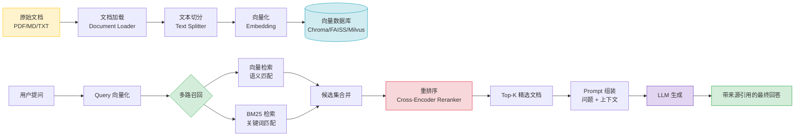

# 03 - RAG 检索增强生成实战

> **学习目标**：理解 RAG 架构原理，掌握文档加载、向量化存储、检索策略等核心技术，能够从零构建一个完整的知识库问答系统，并具备 RAG 系统评估能力。

> 📖 **参考链接**：
> - [LangChain 官方文档](https://python.langchain.com/docs/) -- LangChain 框架完整文档，RAG 各组件均基于此生态
> - [LangChain 模块：Retrieval](https://python.langchain.com/docs/modules/data_connection/) -- 文档加载、切分、向量化、检索的官方接口说明
> - [LangChain 文本切分器](https://python.langchain.com/docs/modules/data_connection/document_transformers/) -- RecursiveCharacterTextSplitter 等切分器用法
> - [LangChain 向量存储](https://python.langchain.com/docs/modules/data_connection/vectorstores/) -- Chroma/FAISS/Milvus 等向量数据库集成
> - [LangChain 检索器](https://python.langchain.com/docs/modules/data_connection/retrievers/) -- 多路召回、重排序、上下文压缩检索器

---

## 目录

1. [第一段：RAG 概念与架构](#第一段rag-概念与架构)
2. [第二段：文档加载与切分 & 向量化与存储](#第二段文档加载与切分--向量化与存储)
3. [第三段：检索策略](#第三段检索策略)
4. [第四段：RAG 实战——从零构建知识库问答系统](#第四段rag-实战从零构建知识库问答系统)
5. [第五段：RAG 评估体系](#第五段rag-评估体系)
6. [学习导航栏](#学习导航栏)
7. [自检清单](#自检清单)

---

## 第一段：RAG 概念与架构

### 1.1 什么是 RAG（检索增强生成）

**RAG（Retrieval-Augmented Generation，检索增强生成）** 是一种将信息检索与大型语言模型（LLM）相结合的技术架构。其核心思想是：在 LLM 生成回答之前，先从外部知识库中检索与用户问题相关的文档片段，然后将这些片段作为上下文注入到 Prompt 中，指导 LLM 生成更准确、更可靠的回答。

```
┌──────────────────────────────────────────────────────────────┐
│                     RAG 工作流程                              │
│                                                              │
│   用户提问 ──► 检索模块 ──► 相关文档片段 ──► 拼接到 Prompt     │
│                                      │                       │
│                                      ▼                       │
│              最终回答 ◄──────── LLM 生成（含上下文）           │
└──────────────────────────────────────────────────────────────┘
```

RAG 的核心价值在于**解决 LLM 的三大痛点**：

| 痛点 | 问题描述 | RAG 如何解决 |
|------|---------|-------------|
| **知识截止** | LLM 训练数据有截止日期，无法回答最新信息 | 实时检索外部知识库，获取最新文档 |
| **幻觉问题** | LLM 可能编造不存在的事实 | 答案基于检索到的真实文档，可追溯来源 |
| **领域知识** | 通用 LLM 缺乏垂直领域的专业知识 | 将企业/行业文档导入知识库，实现领域适配 |

### 1.2 RAG 与微调（Fine-tuning）的对比

这是面试中频率极高的问题。两种方案对比如下：

| 对比维度 | RAG | 微调（Fine-tuning） |
|---------|-----|-------------------|
| **原理** | 检索外部知识，注入 Prompt | 在特定数据上继续训练模型参数 |
| **知识更新** | 即时更新（增删文档即可） | 需要重新训练，周期长 |
| **可解释性** | 强（可追溯到具体文档来源） | 弱（知识融入模型权重，难以追溯） |
| **计算成本** | 低（无需 GPU 训练） | 高（需要大量 GPU 算力） |
| **幻觉控制** | 较好（答案基于检索文档） | 一般（可能学到训练数据中的噪声） |
| **适用场景** | 知识密集型、频繁更新、需溯源 | 风格定制、格式输出、领域术语适配 |
| **数据需求** | 少量高质量文档即可 | 需要大量标注或高质量数据 |

**面试回答模板**：

> "RAG 和微调是互补而非对立的技术。RAG 适合需要实时知识和可溯源的场景，如企业知识库问答、客服系统；微调适合需要模型内化特定风格或格式的场景，如代码补全、特定文体写作。实际项目中，往往采用 **RAG + 微调** 的混合方案，先用微调让模型理解领域术语，再用 RAG 注入最新知识。"

### 1.3 RAG 的经典架构

```
                    ┌──────────────┐
                    │   用户提问    │
                    └──────┬───────┘
                           │
              ┌────────────┼────────────┐
              │            │            │
              ▼            ▼            ▼
        ┌──────────┐ ┌──────────┐ ┌──────────┐
        │ 关键词检索 │ │ 向量检索  │ │ 混合检索  │  ◄── 多路召回
        └────┬─────┘ └────┬─────┘ └────┬─────┘
             │             │             │
             └─────────────┼─────────────┘
                           │
                           ▼
                    ┌──────────────┐
                    │   重排序      │  ◄── Reranker
                    └──────┬───────┘
                           │
                           ▼
                    ┌──────────────┐
                    │   Prompt 组装  │
                    └──────┬───────┘
                           │
                           ▼
                    ┌──────────────┐
                    │   LLM 生成    │
                    └──────┬───────┘
                           │
                           ▼
                    ┌──────────────┐
                    │   最终回答    │
                    └──────────────┘
```

> 💡 **生活化类比**：RAG 就像**开卷考试**——你带着参考书进考场，先翻书找到相关内容（检索），再结合书本内容作答（生成）。向量检索就像图书馆按相似度精准定位——不是走分类树，而是在一个连续空间中找最接近的书架；文档切分像**切蛋糕**，切太大块不好消化（超长上下文超出模型窗口），切太小又失去上下文连贯性（碎片化信息丢失语义）。

> **生活化类比：RAG=开卷考试** —— 更深入地看，纯 LLM 就像"闭卷考试"——模型只能凭训练时记住的知识答题，记不准就编（幻觉），没学过就说不知道（知识截止）。RAG 则是"开卷考试"——允许带参考书（知识库）进考场，答题前先翻到对应章节（检索），再抄着书上的内容组织答案（生成）。开卷考试的好处显而易见：答案有据可查（可溯源）、书本换了内容立即生效（知识即时更新）、不用把所有书背下来（无需重训模型）。但开卷考试也有挑战：得会快速翻书（检索质量）、得会挑重点抄（重排序）、抄太多书反而看花眼（上下文过长）。RAG 的所有优化（分块、向量化、多路召回、重排序）本质上都是在帮模型"更高效地翻书"。

**RAG 全流程 Mermaid 图**：



---

## 第二段：文档加载与切分 & 向量化与存储

### 2.1 文档加载（Document Loader）

文档加载是 RAG 的第一步，负责将不同格式的文档转换为统一的文本表示。LangChain 提供了丰富的 Document Loader。

#### 2.1.1 常用 Document Loader

```python
# ============================================
# 1. 加载 PDF 文档
# ============================================
from langchain_community.document_loaders import PyPDFLoader

loader = PyPDFLoader("docs/企业年报2024.pdf")
pages = loader.load()  # 返回 List[Document]
print(f"加载了 {len(pages)} 页")
print(f"第一页内容预览: {pages[0].page_content[:200]}")


# ============================================
# 2. 加载 Word 文档
# ============================================
from langchain_community.document_loaders import Docx2txtLoader

loader = Docx2txtLoader("docs/产品手册.docx")
documents = loader.load()


# ============================================
# 3. 加载 Markdown 文件
# ============================================
from langchain_community.document_loaders import UnstructuredMarkdownLoader

loader = UnstructuredMarkdownLoader("docs/技术文档.md")
documents = loader.load()


# ============================================
# 4. 加载网页内容
# ============================================
from langchain_community.document_loaders import WebBaseLoader

loader = WebBaseLoader("https://example.com/article")
documents = loader.load()


# ============================================
# 5. 加载 CSV / Excel 表格
# ============================================
from langchain_community.document_loaders import CSVLoader

loader = CSVLoader(
    file_path="data/产品数据.csv",
    csv_args={"delimiter": ",", "quotechar": '"'}
)
documents = loader.load()


# ============================================
# 6. 批量加载目录下所有文件
# ============================================
from langchain_community.document_loaders import DirectoryLoader
from langchain_community.document_loaders import TextLoader

loader = DirectoryLoader(
    path="./docs/",
    glob="**/*.md",           # 匹配所有 Markdown 文件
    loader_cls=TextLoader,
    show_progress=True,
)
documents = loader.load()
print(f"共加载 {len(documents)} 个文档")
```

#### 2.1.2 Document 对象结构

```python
from langchain_core.documents import Document

# Document 对象包含两个核心字段
doc = Document(
    page_content="这是文档的文本内容...",
    metadata={
        "source": "docs/企业年报2024.pdf",
        "page": 5,
        "author": "财务部",
        "date": "2024-03-15"
    }
)

print(doc.page_content)   # 文档文本内容
print(doc.metadata)       # 元数据信息（来源、页码等）
```

### 2.2 文本切分（Text Splitter）

文档通常很长，直接送入 LLM 会超出上下文窗口限制。因此需要将文档切分为合适的文本块（Chunk）。

#### 2.2.1 切分策略概述

```
原始文档（5000 字符）
        │
        ▼  TextSplitter
┌───────┬───────┬───────┬───────┬───────┐
│ Chunk1│ Chunk2│ Chunk3│ Chunk4│ Chunk5│  每个 Chunk 约 1000 字符
│ (0-1000)│(800-1800)│(1600-2600)│...  │  overlap = 200 字符
└───────┴───────┴───────┴───────┴───────┘
```

**关键参数**：
- `chunk_size`：每个文本块的最大长度
- `chunk_overlap`：相邻文本块之间的重叠长度（保持语义连贯性）

#### 2.2.2 常用 TextSplitter

```python
# ============================================
# 1. CharacterTextSplitter —— 按字符切分（最简单）
# ============================================
from langchain.text_splitter import CharacterTextSplitter

text_splitter = CharacterTextSplitter(
    separator="\n\n",       # 优先按段落分隔
    chunk_size=1000,        # 每块最大 1000 字符
    chunk_overlap=200,      # 块间重叠 200 字符
    length_function=len,
)
chunks = text_splitter.split_documents(documents)


# ============================================
# 2. RecursiveCharacterTextSplitter —— 递归字符切分（推荐）
#    按优先级尝试分隔符: "\n\n" → "\n" → " " → ""
# ============================================
from langchain.text_splitter import RecursiveCharacterTextSplitter

text_splitter = RecursiveCharacterTextSplitter(
    chunk_size=1000,
    chunk_overlap=200,
    separators=["\n\n", "\n", "。", "！", "？", "，", " ", ""],
    keep_separator=True,    # 保留分隔符在文本块中
)
chunks = text_splitter.split_documents(documents)
print(f"文档被切分为 {len(chunks)} 个文本块")


# ============================================
# 3. TokenTextSplitter —— 按 Token 数切分
#    更精确地控制送入 LLM 的 Token 数量
# ============================================
from langchain.text_splitter import TokenTextSplitter
import tiktoken

text_splitter = TokenTextSplitter(
    chunk_size=512,         # 每块最多 512 tokens
    chunk_overlap=50,       # 重叠 50 tokens
    encoding_name="cl100k_base",  # GPT-4 / GPT-3.5 的编码
)
chunks = text_splitter.split_documents(documents)


# ============================================
# 4. MarkdownHeaderTextSplitter —— 按 Markdown 标题切分
#    保留文档结构信息
# ============================================
from langchain.text_splitter import MarkdownHeaderTextSplitter

headers_to_split_on = [
    ("#", "h1"),
    ("##", "h2"),
    ("###", "h3"),
]

markdown_splitter = MarkdownHeaderTextSplitter(
    headers_to_split_on=headers_to_split_on,
    strip_headers=False,
)
chunks = markdown_splitter.split_text(markdown_content)
# 每个 chunk 的 metadata 会包含对应层级的标题信息
```

#### 2.2.3 语义切分（Semantic Chunking）

传统切分方式按固定长度切分，可能破坏语义完整性。**语义切分**根据文本的语义相似度变化来决定切分边界。

```python
# ============================================
# 语义切分 —— 基于 Embedding 相似度变化确定切分点
# ============================================
from langchain_experimental.text_splitter import SemanticChunker
from langchain_openai import OpenAIEmbeddings

# 原理：计算相邻句子的 Embedding 相似度
# 当相似度骤降时，说明话题发生了转换，在此处切分
semantic_splitter = SemanticChunker(
    embeddings=OpenAIEmbeddings(),
    breakpoint_threshold_type="percentile",  # 使用百分位阈值
    breakpoint_threshold_amount=90,          # 相似度低于 90 分位时切分
)

chunks = semantic_splitter.split_documents(documents)
print(f"语义切分后得到 {len(chunks)} 个文本块")


# ============================================
# 语义切分的三种阈值策略
# ============================================
# 策略1: 百分位阈值 —— 相似度低于第 N 百分位时切分
SemanticChunker(
    embeddings=OpenAIEmbeddings(),
    breakpoint_threshold_type="percentile",
    breakpoint_threshold_amount=90,
)

# 策略2: 标准差阈值 —— 相似度低于均值减去 N 个标准差时切分
SemanticChunker(
    embeddings=OpenAIEmbeddings(),
    breakpoint_threshold_type="standard_deviation",
    breakpoint_threshold_amount=2.0,
)

# 策略3: 四分位距阈值 —— 基于 IQR 方法检测异常低相似度
SemanticChunker(
    embeddings=OpenAIEmbeddings(),
    breakpoint_threshold_type="interquartile",
    breakpoint_threshold_amount=1.5,
)
```

> **面试要点**：切分策略需要根据文档类型和业务场景选择。对于法律合同等结构化文档，更适合按条款/章节切分；对于技术文档，Markdown 标题切分效果更好；对于叙事性长文，语义切分能更好保持上下文连贯性。

### 2.3 向量化（Embedding）

向量化是将文本转换为高维数值向量的过程，语义相近的文本在向量空间中距离更近。

#### 2.3.1 Embedding 模型选择

```python
# ============================================
# 1. OpenAI Embedding（云端，效果好）
# ============================================
from langchain_openai import OpenAIEmbeddings

embeddings = OpenAIEmbeddings(
    model="text-embedding-3-small",  # 维度: 1536, 性价比高
    # model="text-embedding-3-large",  # 维度: 3072, 效果更好
    dimensions=1024,  # 可指定输出维度（仅 text-embedding-3 系列支持）
)

# 单条文本向量化
vector = embeddings.embed_query("什么是RAG？")
print(f"向量维度: {len(vector)}")  # 1024

# 批量向量化
texts = ["文档A内容", "文档B内容", "文档C内容"]
vectors = embeddings.embed_documents(texts)
print(f"批量向量化: {len(vectors)} 条，每条维度 {len(vectors[0])}")


# ============================================
# 2. 本地开源 Embedding 模型（离线可用，数据安全）
# ============================================
# 方式一: HuggingFace Embedding
from langchain_huggingface import HuggingFaceEmbeddings

embeddings = HuggingFaceEmbeddings(
    model_name="BAAI/bge-large-zh-v1.5",  # 中文效果优秀的开源模型
    model_kwargs={"device": "cuda"},
    encode_kwargs={"normalize_embeddings": True},
)

# 方式二: Ollama 本地部署
from langchain_ollama import OllamaEmbeddings

embeddings = OllamaEmbeddings(
    model="nomic-embed-text",  # 轻量级本地模型
    base_url="http://localhost:11434",
)


# ============================================
# 3. 国产 Embedding 模型
# ============================================
# 智谱 Embedding
from langchain_community.embeddings import ZhipuAIEmbeddings

embeddings = ZhipuAIEmbeddings(
    model="embedding-2",
    api_key="your-api-key",
)

# 百度千帆 Embedding
from langchain_community.embeddings import QianfanEmbeddingsEndpoint

embeddings = QianfanEmbeddingsEndpoint(
    model="embedding-v1",
    qianfan_ak="your-ak",
    qianfan_sk="your-sk",
)
```

#### 2.3.2 Embedding 模型选型建议

| 场景 | 推荐模型 | 理由 |
|------|---------|------|
| 中文为主 | `BAAI/bge-large-zh-v1.5` | 中文语义理解优秀，开源免费 |
| 多语言混合 | `text-embedding-3-large` | 支持多语言，效果稳定 |
| 离线部署 / 数据安全 | `bge-large-zh-v1.5` + 本地推理 | 无需联网，数据不出域 |
| 成本敏感 | `text-embedding-3-small` | 性价比高，$0.02/1M tokens |
| 高精度需求 | `text-embedding-3-large` (3072维) | 维度高，语义区分能力强 |

### 2.4 向量数据库

向量数据库负责存储和高效检索向量化后的文档。

> **生活化类比：向量数据库=图书馆索引** —— 向量数据库就像图书馆的"语义索引系统"。传统图书馆按分类号（关键词检索）找书，你得知道书名或作者；向量数据库则是按"书的内容像不像"（语义相似度）找书——你说"讲时间旅行的科幻"，它能找到《三体》《星际穿越》哪怕书名里没有"时间旅行"四个字。每本书入库时，馆员会把内容浓缩成一串"语义坐标"（Embedding 向量），存进一个高维空间的"书架"上。检索时，你的问题也变成一个坐标，数据库算哪个书架离你最近，瞬间返回。Chroma 像社区小图书馆（轻量上手），FAISS 像专业检索引擎（高性能），Milvus 像国家图书馆（分布式企业级）——规模不同，原理一致。

#### 2.4.1 Chroma —— 轻量级入门首选

```python
# ============================================
# Chroma: 安装 pip install chromadb langchain-chroma
# 特点: 轻量、Python 原生、适合原型和小规模应用
# ============================================
from langchain_chroma import Chroma
from langchain_openai import OpenAIEmbeddings

embeddings = OpenAIEmbeddings(model="text-embedding-3-small")

# 方式一: 内存模式（临时存储，适合测试）
vectorstore = Chroma.from_documents(
    documents=chunks,
    embedding=embeddings,
    collection_name="my_knowledge_base",
    # persist_directory 不指定则为内存模式
)

# 方式二: 持久化模式（数据保存到磁盘）
vectorstore = Chroma.from_documents(
    documents=chunks,
    embedding=embeddings,
    collection_name="my_knowledge_base",
    persist_directory="./chroma_db",  # 数据持久化路径
)

# 加载已有的向量数据库
vectorstore = Chroma(
    embedding_function=embeddings,
    collection_name="my_knowledge_base",
    persist_directory="./chroma_db",
)

# 基本检索操作
results = vectorstore.similarity_search(
    query="公司的年度营收是多少？",
    k=4,  # 返回最相似的 4 个文档
)
for i, doc in enumerate(results):
    print(f"--- 检索结果 {i+1} ---")
    print(f"内容: {doc.page_content[:200]}")
    print(f"来源: {doc.metadata.get('source', 'unknown')}")
    print()
```

#### 2.4.2 FAISS —— Meta 开源的高性能向量检索库

```python
# ============================================
# FAISS: 安装 pip install faiss-cpu (或 faiss-gpu)
# 特点: 高性能、支持 GPU 加速、适合大规模检索
# ============================================
from langchain_community.vectorstores import FAISS
from langchain_openai import OpenAIEmbeddings

embeddings = OpenAIEmbeddings(model="text-embedding-3-small")

# 构建 FAISS 向量库
vectorstore = FAISS.from_documents(
    documents=chunks,
    embedding=embeddings,
)

# 持久化保存
vectorstore.save_local("./faiss_index")

# 加载已有索引
vectorstore = FAISS.load_local(
    folder_path="./faiss_index",
    embeddings=embeddings,
    allow_dangerous_deserialization=True,  # 安全提示：仅加载可信来源
)

# FAISS 支持多种索引类型
# IndexFlatL2:  精确 L2 距离检索（小数据集推荐）
# IndexIVFFlat: 倒排索引加速（中等数据集）
# IndexHNSWFlat: 分层可导航小世界图（大规模数据集）


# ============================================
# FAISS 高级：带分数的相似度检索
# ============================================
results_with_scores = vectorstore.similarity_search_with_score(
    query="什么是RAG？",
    k=5,
)
for doc, score in results_with_scores:
    # FAISS 默认返回 L2 距离，越小越相似
    print(f"L2距离: {score:.4f} | 内容: {doc.page_content[:100]}")
```

#### 2.4.3 Milvus —— 企业级分布式向量数据库

```python
# ============================================
# Milvus: 安装 pip install pymilvus langchain-milvus
# 特点: 分布式、十亿级向量、企业级可靠性
# 需要先启动 Milvus 服务（Docker 或 Milvus Cloud）
# ============================================
from langchain_milvus import Milvus
from langchain_openai import OpenAIEmbeddings

embeddings = OpenAIEmbeddings(model="text-embedding-3-small")

# 连接 Milvus
vectorstore = Milvus.from_documents(
    documents=chunks,
    embedding=embeddings,
    connection_args={
        "host": "localhost",
        "port": "19530",
    },
    collection_name="knowledge_base",
    index_params={
        "metric_type": "IP",       # 内积相似度
        "index_type": "IVF_FLAT",  # 索引类型
        "params": {"nlist": 1024},
    },
    search_params={
        "metric_type": "IP",
        "params": {"nprobe": 10},
    },
)

# 检索
results = vectorstore.similarity_search("什么是RAG？", k=5)
```

#### 2.4.4 向量数据库选型对比

| 维度 | Chroma | FAISS | Milvus |
|------|--------|-------|--------|
| **定位** | 轻量级，上手快 | 高性能检索库 | 企业级分布式 |
| **部署复杂度** | 极低（pip install） | 低 | 中高（需 Docker/K8s） |
| **数据规模** | 百万级 | 千万级 | 十亿级 |
| **持久化** | 支持 | 支持（手动保存） | 原生支持 |
| **分布式** | 不支持 | 不支持 | 原生支持 |
| **GPU 加速** | 不支持 | 支持 | 支持 |
| **适用场景** | 原型验证、小项目 | 中等规模生产 | 大规模企业应用 |
| **社区活跃度** | 高 | 极高 | 高 |

> **面试建议**：面试时可根据项目规模说明选型理由。原型阶段用 Chroma，中等规模用 FAISS，企业级大规模部署用 Milvus。

---

## 第三段：检索策略

检索策略决定了 RAG 系统能否高效、准确地召回相关文档。以下是四种核心检索策略。

### 3.1 相似度检索（Similarity Search）

最基本的检索方式，通过计算查询向量与文档向量之间的距离，返回最相似的文档。

```python
from langchain_chroma import Chroma
from langchain_openai import OpenAIEmbeddings

embeddings = OpenAIEmbeddings(model="text-embedding-3-small")
vectorstore = Chroma(persist_directory="./chroma_db", embedding_function=embeddings)

# ============================================
# 1. 基础相似度检索
# ============================================
results = vectorstore.similarity_search(
    query="今年公司的营收目标是多少？",
    k=4,                       # 返回 Top-K 个结果
)

# ============================================
# 2. 带分数的相似度检索
# ============================================
results_with_scores = vectorstore.similarity_search_with_score(
    query="今年公司的营收目标是多少？",
    k=4,
)
for doc, score in results_with_scores:
    print(f"相似度分数: {score:.4f}")
    print(f"文档内容: {doc.page_content[:150]}")
    print(f"来源: {doc.metadata.get('source')}\n")

# ============================================
# 3. 带元数据过滤的检索
# ============================================
results = vectorstore.similarity_search(
    query="营收目标",
    k=4,
    filter={"source": "docs/企业年报2024.pdf"},  # 仅检索特定来源
    # filter={"year": {"$gte": 2023}},            # 支持比较运算符
)
```

### 3.2 MMR（最大边际相关性检索）

MMR（Maximal Marginal Relevance）在相关性和多样性之间取得平衡，避免返回高度相似的重复结果。

```python
# ============================================
# MMR 检索原理
# ============================================
# 标准相似度检索：返回 Top-K 个最相似的文档
# 问题：如果文档库中有 5 段高度相似的内容，Top-5 都是同一话题
#
# MMR 检索：在保证相关性的前提下，最大化结果之间的差异性
# 公式：MMR = argmax[ λ * Sim(q, d) - (1-λ) * max Sim(d, d_j) ]
#        λ 越大越偏向相关性，λ 越小越偏向多样性

# ============================================
# MMR 检索实战
# ============================================
results = vectorstore.max_marginal_relevance_search(
    query="公司的发展战略是什么？",
    k=4,
    fetch_k=20,         # 先从候选池中取出 20 个，再从中选 4 个多样性最优的
    lambda_mult=0.7,    # 相关性权重 0.7，多样性权重 0.3
)

for i, doc in enumerate(results):
    print(f"--- MMR 结果 {i+1} ---")
    print(f"内容: {doc.page_content[:200]}\n")
```

**MMR 参数调优建议**：

| lambda_mult | 效果 | 适用场景 |
|-------------|------|---------|
| 0.9 - 1.0 | 高相关性，低多样性 | 精确事实查询 |
| 0.5 - 0.7 | 平衡 | 通用知识问答（推荐） |
| 0.2 - 0.4 | 低相关性，高多样性 | 探索性搜索、创意发散 |

### 3.3 自查询检索（Self-Query Retrieval）

自查询检索让 LLM 自动从用户自然语言问题中提取结构化查询条件（过滤条件 + 语义查询）。

```python
# ============================================
# 自查询检索
# 原理：LLM 将自然语言问题自动拆解为：
#    1. 语义查询（用于向量相似度检索）
#    2. 过滤条件（用于元数据过滤）
# ============================================
from langchain.chains.query_constructor.base import AttributeInfo
from langchain.retrievers.self_query.base import SelfQueryRetriever
from langchain_openai import ChatOpenAI

# 定义文档的元数据字段
metadata_field_info = [
    AttributeInfo(
        name="source",
        description="文档来源文件名",
        type="string",
    ),
    AttributeInfo(
        name="year",
        description="文档所属年份",
        type="integer",
    ),
    AttributeInfo(
        name="department",
        description="文档所属部门",
        type="string",
    ),
    AttributeInfo(
        name="category",
        description="文档分类，如：财务报告、技术文档、人事制度",
        type="string",
    ),
]

# 文档内容描述
document_content_description = "企业内部的各类文档"

# 创建自查询检索器
llm = ChatOpenAI(model="gpt-4o", temperature=0)
retriever = SelfQueryRetriever.from_llm(
    llm=llm,
    vectorstore=vectorstore,
    document_contents=document_content_description,
    metadata_field_info=metadata_field_info,
    verbose=True,  # 开启后可以看到 LLM 生成的查询结构
)

# 用户自然语言提问
# LLM 自动解析为：query="营收目标", filter={"year": 2024, "category": "财务报告"}
results = retriever.invoke("2024 年财务报告中关于营收目标的内容")

for doc in results:
    print(f"来源: {doc.metadata.get('source')} | 年份: {doc.metadata.get('year')}")
    print(f"内容: {doc.page_content[:150]}\n")
```

**LLM 自动生成的查询结构示例**：

```python
# 用户输入: "2024 年财务报告中关于营收目标的内容"
# LLM 自动解析为:
{
    "query": "营收目标",         # 语义查询部分
    "filter": "and(           # 结构化过滤条件
        eq('year', 2024),
        eq('category', '财务报告')
    )"
}
```

### 3.4 多路召回与重排序（Multi-Route Retrieval & Reranking）

单一检索方式可能遗漏重要结果。多路召回结合多种检索策略，再通过重排序模型精选最优结果。

```python
# ============================================
# 多路召回 + 重排序 完整实现
# ============================================
from langchain.retrievers import EnsembleRetriever
from langchain_community.retrievers import BM25Retriever
from langchain.retrievers import ContextualCompressionRetriever
from langchain.retrievers.document_compressors import CrossEncoderReranker
from langchain_community.cross_encoders import HuggingFaceCrossEncoder
from langchain_openai import ChatOpenAI

# ============================================
# 步骤1: 构建多路检索器
# ============================================
# 路线一: 向量检索（语义相似度）
vector_retriever = vectorstore.as_retriever(
    search_type="similarity",
    search_kwargs={"k": 10}
)

# 路线二: BM25 关键词检索（稀疏向量检索）
bm25_retriever = BM25Retriever.from_documents(documents)
bm25_retriever.k = 10

# 路线三: MMR 检索（多样性优先）
mmr_retriever = vectorstore.as_retriever(
    search_type="mmr",
    search_kwargs={"k": 10, "fetch_k": 30, "lambda_mult": 0.6}
)

# 集成多路检索器（加权融合）
ensemble_retriever = EnsembleRetriever(
    retrievers=[vector_retriever, bm25_retriever, mmr_retriever],
    weights=[0.5, 0.3, 0.2],  # 各路权重
)

# ============================================
# 步骤2: 重排序（Reranking）
# ============================================
# 使用 Cross-Encoder 模型进行精确重排序
# Cross-Encoder 将 query 和 document 同时输入模型，计算相关性分数
# 比 Bi-Encoder（向量相似度）更精确，但计算量更大

# 方式一: 使用 HuggingFace Cross-Encoder
model = HuggingFaceCrossEncoder(
    model_name="BAAI/bge-reranker-v2-m3"  # 中文重排序模型
)
compressor = CrossEncoderReranker(model=model, top_n=5)

compression_retriever = ContextualCompressionRetriever(
    base_compressor=compressor,
    base_retriever=ensemble_retriever,
)

# 检索 + 重排序
results = compression_retriever.invoke("公司的年度营收目标是多少？")

print("=== 重排序后的最终结果 ===")
for i, doc in enumerate(results):
    print(f"{i+1}. {doc.page_content[:150]}...")
    print(f"   来源: {doc.metadata.get('source')}\n")


# ============================================
# 方式二: 使用 Cohere Rerank API（商业方案）
# ============================================
from langchain_cohere import CohereRerank

compressor = CohereRerank(
    cohere_api_key="your-cohere-api-key",
    top_n=5,
    model="rerank-multilingual-v3.0",
)
```

**多路召回架构总结**：

```
用户查询: "2024年营收目标"
        │
        ├──► 向量检索 (语义匹配) ────► Top-10
        ├──► BM25 检索 (关键词匹配) ─► Top-10
        └──► MMR 检索 (多样性) ──────► Top-10
                    │
                    ▼
            EnsembleRetriever (RRF 融合)
                    │
                    ▼
               候选集 (约 20-30 条)
                    │
                    ▼
            Cross-Encoder Reranker
                    │
                    ▼
               最终 Top-5 结果
```

> **生活化类比：重排序=考试排名** —— 重排序（Reranking）就像考试后的"重新阅卷排名"。初检（向量检索/BM25）像快速阅卷老师，一天批几千份卷子，先粗筛出 30 份"看起来不错"的（候选集）；但粗筛会误判——有的卷子关键词写得多但答非所问。重排序则是"资深阅卷组长"（Cross-Encoder），把题目和每份卷子放一起逐字精读，重新打分排名，挑出真正最相关的 Top-5。Bi-Encoder（初检）是"题目和卷子分别打分再比对"，快但粗；Cross-Encoder（重排）是"题目和卷子一起读"，慢但准。这就是 RAG 里"先粗筛再精排"的两阶段策略——用速度换数量，用精度换质量。

---

## 第四段：RAG 实战——从零构建知识库问答系统

### 4.1 项目概述

本节将实现一个完整的 RAG 知识库问答系统，具备以下功能：

- 多格式文档加载（PDF、Markdown、TXT）
- 智能文本切分与语义分块
- 向量化存储与持久化
- 多路检索 + 重排序
- 带来源引用的问答生成
- 对话历史记忆

### 4.2 环境准备

```bash
# 安装依赖
pip install langchain langchain-openai langchain-chroma langchain-community
pip install pypdf docx2txt unstructured tiktoken
pip install sentence-transformers  # 本地 Embedding 模型
pip install chromadb
```

### 4.3 完整代码实现

```python
"""
============================================================
RAG 知识库问答系统 —— 完整实现
============================================================
功能：
  1. 多格式文档加载与智能切分
  2. 向量化存储（Chroma 持久化）
  3. 多路检索 + Cross-Encoder 重排序
  4. 带来源引用的问答生成
  5. 对话历史记忆
============================================================
"""

import os
import warnings
from typing import List, Optional, Dict, Any
from dataclasses import dataclass, field

warnings.filterwarnings("ignore")

# ============================================================
# 第一部分：配置管理
# ============================================================
@dataclass
class RAGConfig:
    """RAG 系统配置"""
    # Embedding 配置
    embedding_model: str = "text-embedding-3-small"
    embedding_dimensions: int = 1024

    # LLM 配置
    llm_model: str = "gpt-4o"
    llm_temperature: float = 0.1

    # 切分配置
    chunk_size: int = 1000
    chunk_overlap: int = 200

    # 检索配置
    retrieval_k: int = 10          # 初筛数量
    final_k: int = 5               # 最终返回数量
    fetch_k: int = 30              # MMR 候选池大小
    rerank_top_n: int = 5          # 重排序后保留数量

    # 向量库配置
    persist_directory: str = "./chroma_db"
    collection_name: str = "knowledge_base"

    # 文档目录
    docs_directory: str = "./docs"


# ============================================================
# 第二部分：文档加载模块
# ============================================================
class DocumentLoader:
    """多格式文档加载器"""

    SUPPORTED_FORMATS = {
        ".pdf": "pdf",
        ".md": "markdown",
        ".txt": "text",
        ".docx": "docx",
        ".csv": "csv",
    }

    def __init__(self, config: RAGConfig):
        self.config = config

    def load_directory(self, directory: str = None) -> List:
        """加载目录下所有支持的文档"""
        from langchain_community.document_loaders import (
            PyPDFLoader,
            TextLoader,
            UnstructuredMarkdownLoader,
            Docx2txtLoader,
            CSVLoader,
            DirectoryLoader,
        )

        directory = directory or self.config.docs_directory
        all_documents = []

        # 加载 PDF
        pdf_files = self._find_files(directory, ".pdf")
        for pdf_file in pdf_files:
            try:
                loader = PyPDFLoader(pdf_file)
                docs = loader.load()
                for doc in docs:
                    doc.metadata["file_type"] = "pdf"
                all_documents.extend(docs)
                print(f"[PDF] 已加载: {pdf_file} ({len(docs)} 页)")
            except Exception as e:
                print(f"[PDF] 加载失败: {pdf_file}, 错误: {e}")

        # 加载 Markdown
        md_files = self._find_files(directory, ".md")
        for md_file in md_files:
            try:
                loader = UnstructuredMarkdownLoader(md_file)
                docs = loader.load()
                for doc in docs:
                    doc.metadata["file_type"] = "markdown"
                all_documents.extend(docs)
                print(f"[MD] 已加载: {md_file}")
            except Exception as e:
                print(f"[MD] 加载失败: {md_file}, 错误: {e}")

        # 加载 TXT
        txt_files = self._find_files(directory, ".txt")
        for txt_file in txt_files:
            try:
                loader = TextLoader(txt_file, encoding="utf-8")
                docs = loader.load()
                for doc in docs:
                    doc.metadata["file_type"] = "text"
                all_documents.extend(docs)
                print(f"[TXT] 已加载: {txt_file}")
            except Exception as e:
                print(f"[TXT] 加载失败: {txt_file}, 错误: {e}")

        # 加载 DOCX
        docx_files = self._find_files(directory, ".docx")
        for docx_file in docx_files:
            try:
                loader = Docx2txtLoader(docx_file)
                docs = loader.load()
                for doc in docs:
                    doc.metadata["file_type"] = "docx"
                all_documents.extend(docs)
                print(f"[DOCX] 已加载: {docx_file}")
            except Exception as e:
                print(f"[DOCX] 加载失败: {docx_file}, 错误: {e}")

        print(f"\n总计加载 {len(all_documents)} 个文档")
        return all_documents

    def _find_files(self, directory: str, extension: str) -> List[str]:
        """递归查找指定扩展名的文件"""
        import glob
        pattern = os.path.join(directory, f"**/*{extension}")
        return glob.glob(pattern, recursive=True)


# ============================================================
# 第三部分：文档切分模块
# ============================================================
class DocumentSplitter:
    """智能文档切分器"""

    def __init__(self, config: RAGConfig):
        self.config = config

    def split(self, documents: List) -> List:
        """对文档进行递归字符切分"""
        from langchain.text_splitter import RecursiveCharacterTextSplitter

        text_splitter = RecursiveCharacterTextSplitter(
            chunk_size=self.config.chunk_size,
            chunk_overlap=self.config.chunk_overlap,
            separators=["\n\n", "\n", "。", "！", "？", "；", "，", " ", ""],
            keep_separator=True,
            length_function=len,
        )

        chunks = text_splitter.split_documents(documents)
        print(f"文档切分完成: {len(documents)} 个文档 → {len(chunks)} 个文本块")
        return chunks

    def split_semantic(self, documents: List) -> List:
        """语义切分（需要 Embedding 模型）"""
        from langchain_experimental.text_splitter import SemanticChunker
        from langchain_openai import OpenAIEmbeddings

        embeddings = OpenAIEmbeddings(
            model=self.config.embedding_model,
            dimensions=self.config.embedding_dimensions,
        )

        semantic_splitter = SemanticChunker(
            embeddings=embeddings,
            breakpoint_threshold_type="percentile",
            breakpoint_threshold_amount=90,
        )

        chunks = semantic_splitter.split_documents(documents)
        print(f"语义切分完成: {len(documents)} 个文档 → {len(chunks)} 个文本块")
        return chunks


# ============================================================
# 第四部分：向量化与存储模块
# ============================================================
class VectorStoreManager:
    """向量库管理器"""

    def __init__(self, config: RAGConfig):
        self.config = config
        self.embeddings = None
        self.vectorstore = None

    def _get_embeddings(self):
        """获取 Embedding 模型"""
        if self.embeddings is None:
            from langchain_openai import OpenAIEmbeddings
            self.embeddings = OpenAIEmbeddings(
                model=self.config.embedding_model,
                dimensions=self.config.embedding_dimensions,
            )
        return self.embeddings

    def build_from_documents(self, chunks: List):
        """从文档块构建向量库"""
        from langchain_chroma import Chroma

        embeddings = self._get_embeddings()

        self.vectorstore = Chroma.from_documents(
            documents=chunks,
            embedding=embeddings,
            collection_name=self.config.collection_name,
            persist_directory=self.config.persist_directory,
        )
        print(f"向量库构建完成: {len(chunks)} 条向量已存储")

    def load_existing(self):
        """加载已有向量库"""
        from langchain_chroma import Chroma

        embeddings = self._get_embeddings()

        self.vectorstore = Chroma(
            embedding_function=embeddings,
            collection_name=self.config.collection_name,
            persist_directory=self.config.persist_directory,
        )
        print(f"向量库加载完成: {self.vectorstore._collection.count()} 条记录")

    def is_index_exists(self) -> bool:
        """检查索引是否已存在"""
        return os.path.exists(self.config.persist_directory)


# ============================================================
# 第五部分：检索模块（多路召回 + 重排序）
# ============================================================
class RetrievalEngine:
    """检索引擎 —— 多路召回 + 重排序"""

    def __init__(self, config: RAGConfig, vectorstore_manager: VectorStoreManager):
        self.config = config
        self.vsm = vectorstore_manager
        self.ensemble_retriever = None
        self.reranker = None

    def build_ensemble_retriever(self, chunks: List):
        """构建多路检索器"""
        from langchain.retrievers import EnsembleRetriever
        from langchain_community.retrievers import BM25Retriever

        vectorstore = self.vsm.vectorstore

        # 路线一：语义相似度检索
        similarity_retriever = vectorstore.as_retriever(
            search_type="similarity",
            search_kwargs={"k": self.config.retrieval_k}
        )

        # 路线二：MMR 多样性检索
        mmr_retriever = vectorstore.as_retriever(
            search_type="mmr",
            search_kwargs={
                "k": self.config.retrieval_k,
                "fetch_k": self.config.fetch_k,
                "lambda_mult": 0.7,
            }
        )

        # 路线三：BM25 关键词检索
        bm25_retriever = BM25Retriever.from_documents(chunks)
        bm25_retriever.k = self.config.retrieval_k

        # 集成多路检索器
        self.ensemble_retriever = EnsembleRetriever(
            retrievers=[similarity_retriever, mmr_retriever, bm25_retriever],
            weights=[0.4, 0.3, 0.3],  # 向量检索权重最高
        )
        print("多路检索器构建完成: 语义检索 + MMR + BM25")

    def build_reranker(self):
        """构建重排序模型"""
        from langchain.retrievers import ContextualCompressionRetriever
        from langchain.retrievers.document_compressors import CrossEncoderReranker
        from langchain_community.cross_encoders import HuggingFaceCrossEncoder

        try:
            model = HuggingFaceCrossEncoder(
                model_name="BAAI/bge-reranker-v2-m3"
            )
            compressor = CrossEncoderReranker(
                model=model,
                top_n=self.config.rerank_top_n,
            )
            self.reranker = ContextualCompressionRetriever(
                base_compressor=compressor,
                base_retriever=self.ensemble_retriever,
            )
            print("重排序模型加载完成: BAAI/bge-reranker-v2-m3")
        except Exception as e:
            print(f"重排序模型加载失败，回退到无重排序模式: {e}")
            self.reranker = self.ensemble_retriever

    def retrieve(self, query: str) -> List:
        """执行检索"""
        if self.reranker is None:
            self.build_reranker()

        results = self.reranker.invoke(query)
        return results


# ============================================================
# 第六部分：问答生成模块
# ============================================================
class QAGenerator:
    """问答生成器"""

    SYSTEM_PROMPT = """你是一个专业的企业知识库问答助手。请严格依据以下规则回答：

1. **仅基于提供的文档内容**回答问题，不要使用外部知识。
2. 如果文档中没有相关信息，请明确回答"根据现有文档，无法回答此问题"。
3. 回答时需引用具体的文档来源，格式为 `[来源: 文件名]`。
4. 回答应结构清晰、准确简洁，必要时使用列表或分点说明。
5. 如果信息存在矛盾或不确定，请指出并说明原因。

以下是检索到的相关文档内容：
---
{context}
---"""

    def __init__(self, config: RAGConfig):
        self.config = config
        self.llm = None
        self.conversation_history: List[Dict[str, str]] = []

    def _get_llm(self):
        """获取 LLM 实例"""
        if self.llm is None:
            from langchain_openai import ChatOpenAI
            self.llm = ChatOpenAI(
                model=self.config.llm_model,
                temperature=self.config.llm_temperature,
            )
        return self.llm

    def generate(self, query: str, retrieved_docs: List) -> Dict[str, Any]:
        """生成回答"""
        from langchain_core.prompts import ChatPromptTemplate
        from langchain_core.output_parsers import StrOutputParser

        # 构建上下文
        context_parts = []
        for i, doc in enumerate(retrieved_docs, 1):
            source = doc.metadata.get("source", "未知来源")
            context_parts.append(
                f"[文档{i}] 来源: {source}\n{doc.page_content}"
            )
        context = "\n\n---\n\n".join(context_parts)

        # 构建 Prompt
        prompt = ChatPromptTemplate.from_messages([
            ("system", self.SYSTEM_PROMPT),
            ("human", "{question}"),
        ])

        # 构建链
        llm = self._get_llm()
        chain = prompt | llm | StrOutputParser()

        # 生成回答
        answer = chain.invoke({
            "context": context,
            "question": query,
        })

        # 提取来源信息
        sources = list(set(
            doc.metadata.get("source", "未知来源")
            for doc in retrieved_docs
        ))

        return {
            "query": query,
            "answer": answer,
            "sources": sources,
            "retrieved_count": len(retrieved_docs),
        }

    def chat(self, query: str, retrieved_docs: List) -> Dict[str, Any]:
        """带对话历史的问答"""
        from langchain_core.prompts import ChatPromptTemplate, MessagesPlaceholder
        from langchain_core.output_parsers import StrOutputParser
        from langchain_core.messages import HumanMessage, AIMessage

        # 构建上下文
        context_parts = []
        for i, doc in enumerate(retrieved_docs, 1):
            source = doc.metadata.get("source", "未知来源")
            context_parts.append(
                f"[文档{i}] 来源: {source}\n{doc.page_content}"
            )
        context = "\n\n---\n\n".join(context_parts)

        # 构建带历史的 Prompt
        prompt = ChatPromptTemplate.from_messages([
            ("system", self.SYSTEM_PROMPT),
            MessagesPlaceholder(variable_name="history"),
            ("human", "{question}"),
        ])

        llm = self._get_llm()
        chain = prompt | llm | StrOutputParser()

        # 构建历史消息
        history_messages = []
        for msg in self.conversation_history[-6:]:  # 保留最近 3 轮对话
            if msg["role"] == "user":
                history_messages.append(HumanMessage(content=msg["content"]))
            else:
                history_messages.append(AIMessage(content=msg["content"]))

        # 生成回答
        answer = chain.invoke({
            "context": context,
            "history": history_messages,
            "question": query,
        })

        # 更新对话历史
        self.conversation_history.append({"role": "user", "content": query})
        self.conversation_history.append({"role": "assistant", "content": answer})

        sources = list(set(
            doc.metadata.get("source", "未知来源")
            for doc in retrieved_docs
        ))

        return {
            "query": query,
            "answer": answer,
            "sources": sources,
            "retrieved_count": len(retrieved_docs),
        }


# ============================================================
# 第七部分：RAG 系统主类
# ============================================================
class RAGSystem:
    """RAG 知识库问答系统 —— 主控制器"""

    def __init__(self, config: RAGConfig = None):
        self.config = config or RAGConfig()
        self.loader = DocumentLoader(self.config)
        self.splitter = DocumentSplitter(self.config)
        self.vsm = VectorStoreManager(self.config)
        self.retrieval_engine = None
        self.qa_generator = QAGenerator(self.config)
        self._chunks = None

    def build_knowledge_base(self, docs_directory: str = None, force_rebuild: bool = False):
        """
        构建知识库
        步骤：加载文档 → 切分 → 向量化 → 存储
        """
        if docs_directory:
            self.config.docs_directory = docs_directory

        print("=" * 60)
        print("开始构建知识库...")
        print("=" * 60)

        # 步骤1: 加载文档
        print("\n[步骤 1/4] 加载文档...")
        documents = self.loader.load_directory()

        if not documents:
            print("错误: 未找到任何文档，请检查文档目录路径")
            return

        # 步骤2: 切分文档
        print("\n[步骤 2/4] 切分文档...")
        self._chunks = self.splitter.split(documents)

        # 步骤3: 向量化存储
        print("\n[步骤 3/4] 向量化与存储...")
        self.vsm.build_from_documents(self._chunks)

        # 步骤4: 构建检索引擎
        print("\n[步骤 4/4] 构建检索引擎...")
        self.retrieval_engine = RetrievalEngine(self.config, self.vsm)
        self.retrieval_engine.build_ensemble_retriever(self._chunks)
        self.retrieval_engine.build_reranker()

        print("\n" + "=" * 60)
        print("知识库构建完成！")
        print("=" * 60)

    def load_knowledge_base(self):
        """加载已有的知识库"""
        if not self.vsm.is_index_exists():
            print("知识库不存在，请先运行 build_knowledge_base()")
            return False

        print("加载已有知识库...")
        self.vsm.load_existing()

        # 重建 chunks（用于 BM25）
        # 从向量库中恢复所有文档
        self._chunks = self.vsm.vectorstore.get()["documents"]

        self.retrieval_engine = RetrievalEngine(self.config, self.vsm)
        # 重建 BM25 需要原始 Document 对象
        print("提示: 加载已有知识库时，BM25 检索器可能无法完全恢复，将使用语义检索 + MMR")

        return True

    def ask(self, query: str, use_history: bool = False) -> Dict[str, Any]:
        """提问接口"""
        if self.retrieval_engine is None:
            return {"error": "检索引擎未初始化，请先构建或加载知识库"}

        # 检索
        retrieved_docs = self.retrieval_engine.retrieve(query)

        if not retrieved_docs:
            return {
                "query": query,
                "answer": "未找到相关文档，请检查知识库内容。",
                "sources": [],
                "retrieved_count": 0,
            }

        # 生成回答
        if use_history:
            result = self.qa_generator.chat(query, retrieved_docs)
        else:
            result = self.qa_generator.generate(query, retrieved_docs)

        return result

    def clear_history(self):
        """清除对话历史"""
        self.qa_generator.conversation_history = []
        print("对话历史已清除")


# ============================================================
# 第八部分：使用示例
# ============================================================
if __name__ == "__main__":
    # 1. 初始化系统
    config = RAGConfig(
        embedding_model="text-embedding-3-small",
        llm_model="gpt-4o",
        chunk_size=1000,
        chunk_overlap=200,
        docs_directory="./docs",
    )
    rag = RAGSystem(config)

    # 2. 构建知识库（首次运行）
    rag.build_knowledge_base(force_rebuild=False)

    # 3. 提问
    print("\n" + "=" * 60)
    print("知识库问答系统已就绪，输入问题开始对话（输入 'quit' 退出）")
    print("=" * 60 + "\n")

    test_questions = [
        "公司的年度营收目标是多少？",
        "公司有哪些核心产品线？",
        "公司未来三年的发展战略是什么？",
    ]

    for question in test_questions:
        print(f"\n{'='*60}")
        print(f"用户: {question}")
        print(f"{'='*60}")

        result = rag.ask(question, use_history=True)

        print(f"\n回答:\n{result['answer']}")
        print(f"\n信息来源: {', '.join(result['sources'])}")
        print(f"检索文档数: {result['retrieved_count']}")
```

### 4.4 运行流程说明

```
┌─────────────────────────────────────────────────────────────┐
│                    知识库构建流程                              │
│                                                              │
│  1. DocumentLoader.load_directory()                         │
│     └── 遍历 docs/ 目录，加载 PDF/MD/TXT/DOCX               │
│                                                              │
│  2. DocumentSplitter.split()                                │
│     └── RecursiveCharacterTextSplitter 递归切分              │
│                                                              │
│  3. VectorStoreManager.build_from_documents()               │
│     └── OpenAI Embedding → Chroma 向量库持久化                │
│                                                              │
│  4. RetrievalEngine.build_ensemble_retriever()              │
│     └── 语义检索 + MMR + BM25 三路集成                       │
│                                                              │
│  5. RetrievalEngine.build_reranker()                        │
│     └── bge-reranker-v2-m3 Cross-Encoder 重排序              │
└─────────────────────────────────────────────────────────────┘

┌─────────────────────────────────────────────────────────────┐
│                    问答流程                                   │
│                                                              │
│  用户提问 → RetrievalEngine.retrieve()                       │
│          → 三路召回 + 重排序 → Top-5 文档                    │
│          → QAGenerator.generate()                            │
│          → Prompt 组装 + LLM 生成 → 带来源引用的回答          │
└─────────────────────────────────────────────────────────────┘
```

---

## 第五段：RAG 评估体系

RAG 系统上线前必须进行系统化评估。**RAGAS（RAG Assessment）** 是目前最主流的 RAG 评估框架。

### 5.1 RAGAS 框架概述

RAGAS 定义了 RAG 系统的核心评估维度：

```
┌──────────────────────────────────────────────────────┐
│                  RAGAS 评估维度                        │
│                                                      │
│  ┌─────────────────┐    ┌─────────────────┐          │
│  │   检索质量评估    │    │   生成质量评估    │          │
│  ├─────────────────┤    ├─────────────────┤          │
│  │ Context Recall  │    │ Faithfulness    │          │
│  │ Context Precision│   │ Answer Relevance│          │
│  │ Context Relevancy│   │                 │          │
│  └─────────────────┘    └─────────────────┘          │
└──────────────────────────────────────────────────────┘
```

### 5.2 核心评估指标详解

| 指标 | 英文名 | 衡量什么 | 计算公式 |
|------|--------|---------|---------|
| **忠实度** | Faithfulness | 回答是否完全基于检索到的文档，是否存在幻觉 | 回答中可追溯至文档的陈述数 / 回答总陈述数 |
| **答案相关性** | Answer Relevance | 回答是否直接回应了用户问题 | 基于 LLM 对回答与问题匹配度的评分 |
| **上下文召回率** | Context Recall | 检索到的文档是否覆盖了回答所需的所有信息 | 回答中可追溯至文档的信息 / 回答所需的总信息 |
| **上下文精确度** | Context Precision | 检索到的文档中相关文档的比例 | 相关文档数 / 检索文档总数 |
| **上下文相关性** | Context Relevancy | 检索到的文档内容是否与问题相关 | 相关句子数 / 总句子数 |

### 5.3 RAGAS 评估实战

```python
# ============================================
# 安装: pip install ragas datasets
# ============================================

from ragas import evaluate
from ragas.metrics import (
    faithfulness,
    answer_relevancy,
    context_recall,
    context_precision,
    context_relevancy,
)
from datasets import Dataset
from langchain_openai import ChatOpenAI, OpenAIEmbeddings

# ============================================
# 1. 准备评估数据
# ============================================
# 评估数据集需包含以下字段:
#   - question: 用户问题
#   - answer: 系统生成的回答
#   - contexts: 检索到的文档列表
#   - ground_truth: 标准答案（可选，用于 Context Recall）

eval_data = {
    "question": [
        "公司 2024 年的营收目标是多少？",
        "公司有哪些核心产品线？",
        "公司未来三年的发展战略是什么？",
    ],
    "answer": [
        "根据文档，公司 2024 年的营收目标为 50 亿元人民币。",
        "公司核心产品线包括：智能客服系统、数据分析平台和企业协同办公套件。",
        "公司未来三年将聚焦 AI 技术投入和海外市场拓展。",
    ],
    "contexts": [
        ["2024年营收目标为50亿元人民币，同比增长20%。"],
        ["智能客服系统是公司核心产品，数据分析平台服务超过1000家企业。",
         "企业协同办公套件已覆盖500万用户。"],
        ["公司将加大AI技术研发投入，重点拓展东南亚和欧洲市场。"],
    ],
    "ground_truth": [
        "2024年营收目标为50亿元人民币。",
        "智能客服系统、数据分析平台、企业协同办公套件。",
        "加大AI技术投入、拓展海外市场。",
    ],
}

dataset = Dataset.from_dict(eval_data)

# ============================================
# 2. 执行 RAGAS 评估
# ============================================
llm = ChatOpenAI(model="gpt-4o", temperature=0)
embeddings = OpenAIEmbeddings(model="text-embedding-3-small")

result = evaluate(
    dataset=dataset,
    metrics=[
        faithfulness,          # 忠实度
        answer_relevancy,      # 答案相关性
        context_recall,        # 上下文召回率
        context_precision,     # 上下文精确度
        context_relevancy,     # 上下文相关性
    ],
    llm=llm,
    embeddings=embeddings,
)

# ============================================
# 3. 查看评估结果
# ============================================
print("=" * 50)
print("RAGAS 评估结果")
print("=" * 50)

# 整体分数
print(f"\nFaithfulness (忠实度):       {result['faithfulness']:.4f}")
print(f"Answer Relevancy (答案相关性): {result['answer_relevancy']:.4f}")
print(f"Context Recall (上下文召回率):  {result['context_recall']:.4f}")
print(f"Context Precision (上下文精确度): {result['context_precision']:.4f}")
print(f"Context Relevancy (上下文相关性): {result['context_relevancy']:.4f}")

# 转换为 DataFrame 查看逐条结果
df = result.to_pandas()
print("\n逐条评估结果:")
print(df)


# ============================================
# 4. 自定义评估指标 —— 延迟与吞吐量
# ============================================
import time

def evaluate_latency(rag_system, questions: list, n_runs: int = 3):
    """评估检索和生成的延迟"""
    retrieval_times = []
    generation_times = []

    for question in questions:
        for _ in range(n_runs):
            # 检索延迟
            t0 = time.time()
            docs = rag_system.retrieval_engine.retrieve(question)
            t1 = time.time()
            retrieval_times.append(t1 - t0)

    avg_retrieval = sum(retrieval_times) / len(retrieval_times)
    print(f"\n平均检索延迟: {avg_retrieval*1000:.2f} ms")
    print(f"P95 检索延迟: {sorted(retrieval_times)[int(len(retrieval_times)*0.95)]*1000:.2f} ms")
```

### 5.4 Faithfulness（忠实度）深度解析

忠实度是 RAG 评估中最重要的指标，它衡量回答是否**严格基于检索到的文档**。

```python
# ============================================
# Faithfulness 评估原理
# ============================================
# 步骤1: 将回答拆解为原子陈述（Claims）
#   回答: "公司2024年营收目标为50亿元，同比增长20%。"
#   拆解为:
#     Claim 1: "公司2024年营收目标为50亿元"
#     Claim 2: "同比增长20%"
#
# 步骤2: 对每个 Claim，检查是否能在检索到的文档中找到支撑
#   Claim 1 → 文档中有 "2024年营收目标为50亿元人民币" → 可验证 ✓
#   Claim 2 → 文档中无相关信息 → 不可验证 ✗
#
# 步骤3: 计算 Faithfulness
#   Faithfulness = 可验证的 Claim 数 / 总 Claim 数 = 1/2 = 0.5

# ============================================
# 手动实现 Faithfulness 检查（简化版）
# ============================================
def check_faithfulness(answer: str, contexts: List[str], llm) -> float:
    """
    检查回答的忠实度
    """
    from langchain_core.prompts import ChatPromptTemplate

    # 步骤1: 拆解陈述
    decompose_prompt = ChatPromptTemplate.from_messages([
        ("system", "将以下回答拆解为原子陈述列表，每行一条陈述。"),
        ("human", "{answer}"),
    ])
    claims_text = (decompose_prompt | llm).invoke({"answer": answer})
    claims = [c.strip() for c in claims_text.content.split("\n") if c.strip()]

    # 步骤2: 逐条验证
    context_text = "\n".join(contexts)
    verifiable_count = 0

    verify_prompt = ChatPromptTemplate.from_messages([
        ("system", "根据提供的文档内容，判断以下陈述是否可以得到支持。"
                   "仅回答 YES 或 NO。"),
        ("human", "文档内容:\n{context}\n\n陈述: {claim}"),
    ])

    for claim in claims:
        response = (verify_prompt | llm).invoke({
            "context": context_text,
            "claim": claim,
        })
        if "YES" in response.content.upper():
            verifiable_count += 1

    return verifiable_count / len(claims) if claims else 0.0
```

### 5.5 Answer Relevance（答案相关性）深度解析

答案相关性衡量回答是否直接回应了用户的问题，避免答非所问。

```python
# ============================================
# Answer Relevance 评估原理
# ============================================
# 步骤1: 基于回答，让 LLM 反向生成可能的问题
#   回答: "公司2024年营收目标为50亿元"
#   反向生成问题: ["公司2024年营收目标是多少？",
#                  "公司今年的营收目标是什么？",
#                  "公司2024年计划营收多少？"]
#
# 步骤2: 计算反向生成问题与原始问题之间的余弦相似度
#   原始问题: "公司2024年的营收目标是多少？"
#   反向问题1: "公司2024年营收目标是多少？" → 相似度 0.95
#   反向问题2: "公司今年的营收目标是什么？" → 相似度 0.88
#   反向问题3: "公司2024年计划营收多少？" → 相似度 0.82
#
# 步骤3: Answer Relevance = mean(相似度) = (0.95+0.88+0.82)/3 = 0.883
```

### 5.6 RAG 评估最佳实践

```
┌─────────────────────────────────────────────────────────────┐
│                  RAG 评估最佳实践                             │
│                                                              │
│  1. 构建高质量评估数据集                                      │
│     ├── 覆盖不同难度级别的问题                                 │
│     ├── 包含边界情况和对抗性样本                               │
│     └── 人工标注标准答案                                      │
│                                                              │
│  2. 多维度评估                                               │
│     ├── 检索质量（Recall / Precision / MRR）                 │
│     ├── 生成质量（Faithfulness / Relevance）                 │
│     └── 系统性能（延迟 / 吞吐量 / 成本）                      │
│                                                              │
│  3. 持续监控与迭代                                           │
│     ├── 建立评估基线（Baseline）                              │
│     ├── 每次架构变更后重新评估                                 │
│     └── 收集用户反馈，补充评估数据集                           │
│                                                              │
│  4. 评估指标阈值参考                                          │
│     ├── Faithfulness >= 0.85（生产环境最低要求）              │
│     ├── Answer Relevance >= 0.80                             │
│     ├── Context Recall >= 0.80                               │
│     └── Context Precision >= 0.75                            │
└─────────────────────────────────────────────────────────────┘
```

---

## 学习导航栏

| 序号 | 文档 | 核心内容 | 状态 |
|------|------|---------|------|
| 01 | [Python 核心语法速通](../python-core/01-Python核心语法速通.md) | 类型系统、函数、装饰器、面向对象 | 已完成 |
| 02 | LangChain 与 LLM 应用开发 | Prompt 工程、Chain 构建、Agent 框架 | 规划中 |
| **03** | **RAG 检索增强生成实战** | **文档加载、向量化、检索策略、RAGAS 评估** | **当前** |
| 04 | [Python 与 AI 智能体笔面试题集](../langchain-rag/04-Python与AI智能体笔面试题集.md) | 高频面试题与详细解答 | 已完成 |
| 05 | Agent 智能体开发实战 | ReAct、Tool Calling、多 Agent 协作 | 规划中 |
| 06 | 大模型微调实战 | LoRA、QLoRA、SFT 全流程 | 规划中 |

---
## 常见面试题

> 以下面试题覆盖本章核心知识点，附详细答案解析。

### 1. 请简述 RAG 的完整工作流程和核心原理（★★）

**答案：** RAG（Retrieval-Augmented Generation，检索增强生成）的工作流程分为五步：1）离线阶段：将知识库文档加载、切分、向量化后存储到向量数据库；2）在线阶段：接收到用户问题后，对问题进行向量化；3）检索：从向量数据库中检索出与问题语义最相似的若干文档片段；4）Prompt 拼接：将检索到的文档片段和用户问题一起拼接成完整的 Prompt；5）生成：将拼接后的 Prompt 发送给大语言模型，模型基于检索到的上下文生成回答。核心原理是通过检索外部知识库获取最新/领域知识，增强大模型回答的准确性、可溯源性，缓解幻觉问题。

### 2. chunk_size 和 chunk_overlap 应该如何选择？太大或太小有什么问题？（★★★）

**答案：** chunk_size 是文档切分后每段的大小，chunk_overlap 是相邻片段之间的重叠大小。选择策略需要结合场景：
- **chunk_size 太大**：优点是保留更多上下文信息，缺点是引入过多无关信息，稀释问题相关性，同时可能超出模型上下文窗口，增加计算成本；
- **chunk_size 太小**：优点是检索精准度高，缺点是语义碎片化，单个 chunk 无法提供足够的上下文信息；
- **chunk_overlap 太小**：可能导致句子被从中间切开，破坏语义完整性；
- **chunk_overlap 太大**：增加存储和计算成本，检索结果冗余。

**经验值**：通用场景推荐 chunk_size=512-1024 tokens，chunk_overlap=10%-20% chunk_size。对于长文档问答、技术文档，可以适当增大 chunk_size；对于新闻摘要、问答配对，可以适当减小 chunk_size。

### 3. 向量检索相比传统关键词检索有什么优势？（★★）

**答案：** 向量检索和关键词检索的核心区别在于匹配方式：
- **关键词检索**：基于词项的精确匹配，只返回包含查询关键词的文档，无法理解语义。优点是速度快、实现简单，缺点是无法捕捉同义词、一词多义，容易漏检语义相关但用词不同的文档；
- **向量检索（语义检索）**：将文本映射到高维向量空间，通过余弦相似度计算语义相似度，能理解词句的语义含义。优点是能返回语义相关但字面不匹配的文档，符合人类提问习惯，检索质量更高。

实际生产中常用"混合检索"（向量检索 + 关键词检索）结合二者优势，兼顾语义理解和关键词精确匹配。

### 4. 什么是 MMR 算法？它解决了什么问题？（★★★）

**答案：** MMR（Maximal Marginal Relevance，最大边际相关性）是一种检索后重排序算法，旨在解决"检索结果多样性不足"的问题。

当我们直接按相似度排序返回结果时，往往会出现多个结果语义高度重叠、重复覆盖同一信息的情况。MMR 在选择候选文档时，不仅考虑文档与查询的相似度，还考虑文档与已选文档的冗余度。其计算公式为：
```
MMR = λ * Sim(doc, query) - (1-λ) * max_{di∈Dselected} Sim(doc, di)
```
其中 λ 是平衡参数，λ 越大越偏向相关性，λ 越小越偏向多样性。

MMR 的优势是能保证返回结果在相关性的前提下，尽可能覆盖不同角度的信息，避免信息冗余，提升最终回答的全面性。LangChain 中已原生支持 MMR 检索。

### 5. RAGAS 评估框架包含哪些核心指标？各指标衡量什么？（★★★）

**答案：** RAGAS 是专门用于评估 RAG 系统的自动评估框架，包含五个核心指标：

1. **Faithfulness（忠实度）**：衡量生成回答是否忠实于检索到的上下文，即回答中的每一条信息是否都能在检索上下文找到依据。越高说明幻觉越少。

2. **Answer Relevance（回答相关性）**：衡量生成回答与用户问题的相关程度，即回答是否直接对应用户问题，答非所问会得分低。

3. **Context Precision（上下文精确率）**：衡量检索到的上下文是否都与问题相关，越高说明检索精准，噪声越少。

4. **Context Recall（上下文召回率）**：衡量回答需要的所有信息是否都被检索出来，越高说明没有遗漏关键信息。

5. **Context Entity Recall（实体召回率）**：衡量问题涉及的实体是否被正确检索到，用于评估在知识密集型任务中的召回能力。

---
## 避坑指南

> 本章学习中常见的错误和陷阱，提前了解，少走弯路。

### 坑1：chunk_size 设置得越大越好
**错误现象：** 盲目追求更大的 chunk_size，认为上下文越完整效果越好，结果检索性能和生成质量反而下降。
**产生原因：** chunk_size 过大时，每个 chunk 会包含大量与问题无关的内容，导致向量表示被噪声稀释，降低检索准确性；同时会增加计算量和 token 消耗，可能超出模型上下文限制。
**正确做法：** 根据文档类型和任务选择合适 chunk_size，技术文档推荐 512-1024，通用场景 256-512，通过小范围实验确定最优值，并非越大越好。

### 坑2：直接使用大模型 Embedding 替代专用 Embedding 模型
**错误现象：** 为了节省步骤，直接用 GPT-4/LLM 的 token  embedding 做向量检索，结果效果很差。
**产生原因：** LLM 的 token embedding 是为生成任务优化的，不是为语义检索优化的，向量空间分布不符合检索需求，相似度区分度差。专用 Embedding 模型（如 text-embedding-ada-002、BGE、Jina）是专门训练来做语义相似度匹配的，效果显著更好。
**正确做法：** 使用专门的 Embedding 模型生成向量，不要复用 LLM 的输出层 embedding。开源场景推荐 BGE-m3 系列，闭源场景推荐 OpenAI text-embedding-3 系列。

### 坑3：忽略文档元数据，不使用元数据过滤
**错误现象：** 只对文档内容做向量化，完全丢弃了标题、日期、章节、来源等元数据，检索时无法按条件过滤。
**产生原因：** 没有意识到元数据对于精准检索的价值。当知识库很大、包含多来源/多时间跨度文档时，元数据过滤能有效缩小检索范围，排除不相关结果。
**正确做法：** 加载文档时保留关键元数据，并在检索时结合元数据过滤，比如"只检索最近一年的文档"、"只检索某产品手册章节"，能大幅提升检索准确率。

### 坑4：向量数据库用了精确搜索，不使用近似最近邻搜索
**错误现象：** 知识库文档不多时跑一遍全量余弦相似度计算速度还行，文档量上来后检索越来越慢，CPU 占满无法响应。
**产生原因：** 精确搜索需要计算查询向量与全库所有向量的相似度，时间复杂度是 O(N)，百万级向量下完全无法用。近似最近邻（ANN）搜索通过索引预处理，能在 O(logN) 时间返回近似结果，速度提升几个数量级，损失的精度在可接受范围。
**正确做法：** 使用支持 ANN 搜索的向量数据库（Chroma、FAISS、Milvus），索引构建后靠 ANN 加速检索，生产环境不要用暴力搜索。

---
## 本章学习自检

请在学习完本章后逐项检查，确保掌握以下核心知识点：

### 基础概念

- [ ] 能用自己的话解释 RAG 的工作原理和核心价值
- [ ] 能说出 RAG 和微调各自的优缺点和适用场景
- [ ] 理解 RAG 经典架构中每个模块的职责

### 文档加载与切分

- [ ] 能使用至少 3 种 DocumentLoader 加载不同格式的文档
- [ ] 理解 chunk_size 和 chunk_overlap 的含义，能根据场景选择合适的参数
- [ ] 了解语义切分的原理，知道何时使用语义切分替代固定长度切分
- [ ] 能解释 Document 对象中 page_content 和 metadata 的作用

### 向量化与存储

- [ ] 能使用 OpenAI Embedding 或本地模型进行文本向量化
- [ ] 理解 Embedding 向量维度的含义，能根据场景选择模型
- [ ] 能使用 Chroma 构建和持久化向量数据库
- [ ] 了解 FAISS 和 Milvus 的特点及适用场景
- [ ] 能说出 Chroma、FAISS、Milvus 三者的选型依据

### 检索策略

- [ ] 能实现基本的相似度检索和带分数的检索
- [ ] 理解 MMR 的原理，能解释 lambda_mult 参数的作用
- [ ] 理解自查询检索的原理，能配置元数据字段信息
- [ ] 理解多路召回的必要性，能实现 EnsembleRetriever
- [ ] 理解 Cross-Encoder 重排序与 Bi-Encoder 检索的区别

### RAG 实战

- [ ] 能从零搭建一个完整的 RAG 知识库问答系统
- [ ] 能实现知识库的构建流程（加载 → 切分 → 向量化 → 存储）
- [ ] 能实现带来源引用的问答生成
- [ ] 能实现对话历史记忆功能

### RAG 评估

- [ ] 能说出 RAGAS 框架的 5 个核心评估指标
- [ ] 理解 Faithfulness 的计算原理，能解释其重要性
- [ ] 理解 Answer Relevance 的评估方法
- [ ] 能使用 RAGAS 对 RAG 系统进行量化评估
- [ ] 了解 RAG 系统在生产环境中的评估基线要求

---

> **学习建议**：本章内容实操性极强，建议在阅读过程中同步运行代码。先从 Chroma + 基础相似度检索开始，逐步添加 MMR、多路召回、重排序等高级功能，最后使用 RAGAS 对系统进行完整评估。整个流程走通后，RAG 相关的面试题将不再有难度。

---

*文档版本: v1.0 | 最后更新: 2026-06-30*

> - 返回 [学习路线总览](../../README.md)