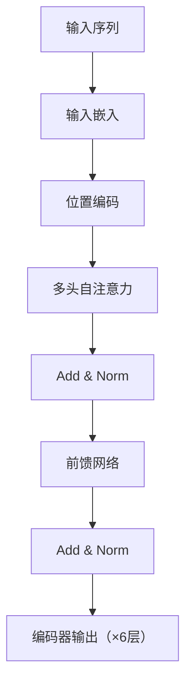
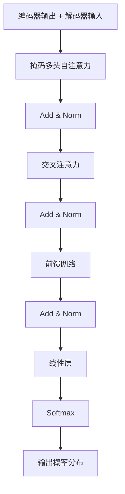
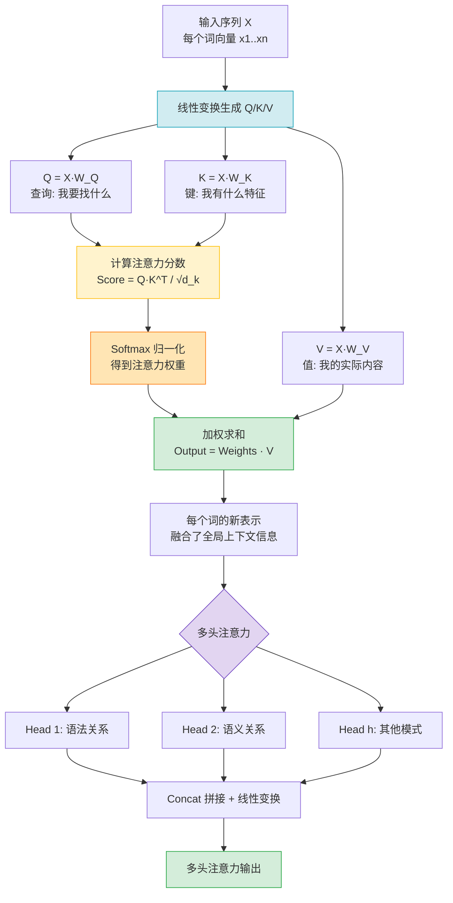

# 大模型基础与Transformer架构

> 大语言模型（LLM）是当前AI领域最核心的技术突破。本文从发展脉络、底层架构、模型对比、GPT系列演进、LLaMA与Qwen开源模型、分词技术七个维度，系统梳理大模型基础知识，帮助你建立完整的技术认知框架。

> 📖 **参考链接**：
> - [HuggingFace 官方文档](https://huggingface.co/docs/) -- HuggingFace 全栈文档，含 Transformers/PEFT/TRL 等库
> - [HuggingFace Transformers 文档](https://huggingface.co/docs/transformers/index) -- Transformer 模型架构与预训练模型的完整 API 参考
> - [HuggingFace 课程：Transformer 模型](https://huggingface.co/learn/nlp-course/zh-CN/chapter1/4) -- 系统讲解 Transformer 架构与注意力机制
> - [HuggingFace 模型库](https://huggingface.co/models) -- BERT/GPT/LLaMA/Qwen 等开源模型权重与模型卡
> - [Attention Is All You Need（原论文）](https://arxiv.org/abs/1706.03762) -- Transformer 架构的奠基论文

---

## 目录

- [一、大模型发展脉络](#一大模型发展脉络)
  - [1.1 从传统NLP到大语言模型](#11-从传统nlp到大语言模型)
  - [1.2 GPT-1：生成式预训练的起点](#12-gpt-1生成式预训练的起点)
  - [1.3 GPT-2：Zero-Shot与规模扩展](#13-gpt-2zero-shot与规模扩展)
  - [1.4 GPT-3：In-Context Learning与涌现能力](#14-gpt-3in-context-learning与涌现能力)
  - [1.5 GPT-4：多模态与安全对齐](#15-gpt-4多模态与安全对齐)
  - [1.6 Scaling Law：规模定律](#16-scaling-law规模定律)
  - [1.7 涌现能力：量变引起质变](#17-涌现能力量变引起质变)
- [二、Transformer架构](#二transformer架构)
  - [2.1 为什么需要Transformer](#21-为什么需要transformer)
  - [2.2 Self-Attention：自注意力机制](#22-self-attention自注意力机制)
  - [2.3 Q/K/V矩阵详解](#23-qkv矩阵详解)
  - [2.4 Multi-Head Attention：多头注意力](#24-multi-head-attention多头注意力)
  - [2.5 Position Encoding：位置编码](#25-position-encoding位置编码)
  - [2.6 LayerNorm与残差连接](#26-layernorm与残差连接)
  - [2.7 Feed-Forward Network](#27-feed-forward-network)
  - [2.8 Transformer完整计算流程](#28-transformer完整计算流程)
- [三、Encoder-Decoder架构对比](#三encoder-decoder架构对比)
  - [3.1 三种架构总览](#31-三种架构总览)
  - [3.2 BERT类：Encoder-Only](#32-bert类encoder-only)
  - [3.3 GPT类：Decoder-Only](#33-gpt类decoder-only)
  - [3.4 T5类：Encoder-Decoder](#34-t5类encoder-decoder)
  - [3.5 架构选择指南](#35-架构选择指南)
- [四、GPT系列详解](#四gpt系列详解)
  - [4.1 GPT-1：预训练+微调范式](#41-gpt-1预训练微调范式)
  - [4.2 GPT-2：Zero-Shot能力](#42-gpt-2zero-shot能力)
  - [4.3 GPT-3：In-Context Learning](#43-gpt-3in-context-learning)
  - [4.4 InstructGPT：RLHF对齐](#44-instructgptrlhf对齐)
  - [4.5 GPT-4：多模态突破](#45-gpt-4多模态突破)
  - [4.6 GPT系列技术演进总结](#46-gpt系列技术演进总结)
- [五、LLaMA系列模型](#五llama系列模型)
  - [5.1 LLaMA-1：开源首发与Chinchilla定律](#51-llama-1开源首发与chinchilla定律)
  - [5.2 LLaMA-2：GQA与商用许可](#52-llama-2gqa与商用许可)
  - [5.3 LLaMA-3：规模与上下文突破](#53-llama-3规模与上下文突破)
  - [5.4 GQA原理详解：MHA vs MQA vs GQA](#54-gqa原理详解mha-vs-mqa-vs-gqa)
  - [5.5 训练数据策略：数据量、数据质量与Scaling Law](#55-训练数据策略数据量数据质量与scaling-law)
  - [5.6 开源生态影响](#56-开源生态影响)
- [六、Qwen系列模型](#六qwen系列模型)
  - [6.1 Qwen架构特点](#61-qwen架构特点)
  - [6.2 Qwen-1.5与Qwen-2演进](#62-qwen-15与qwen-2演进)
  - [6.3 Chat/Code/Math/Coder变体](#63-chatcodemathcoder变体)
  - [6.4 Qwen与LLaMA对比](#64-qwen与llama对比)
- [七、Tokenization分词技术](#七tokenization分词技术)
  - [7.1 为什么需要分词](#71-为什么需要分词)
  - [7.2 BPE（Byte Pair Encoding）](#72-bpebyte-pair-encoding)
  - [7.3 WordPiece](#73-wordpiece)
  - [7.4 SentencePiece](#74-sentencepiece)
  - [7.5 三种分词方法对比](#75-三种分词方法对比)
  - [7.6 分词对模型性能的影响](#76-分词对模型性能的影响)
- [学习导航](#学习导航)
- [自检清单](#自检清单)

---

## 一、大模型发展脉络

### 1.1 从传统NLP到大语言模型

在深度学习时代之前，NLP主要依赖基于规则和统计的方法。2013年Word2Vec提出后，词向量成为NLP的基础设施。2017年Transformer架构的提出彻底改变了NLP方向，随后进入预训练语言模型（PLM）和大语言模型（LLM）时代。

| 阶段 | 时间 | 代表模型 | 核心特点 |
|------|------|---------|---------|
| 统计NLP | 2000-2012 | n-gram、HMM、CRF | 基于统计，特征工程为主 |
| 词向量时代 | 2013-2017 | Word2Vec、GloVe | 分布式表示，静态词向量 |
| 预训练PLM | 2018-2019 | ELMo、BERT、GPT-1 | 预训练+微调范式 |
| 大语言模型 | 2020至今 | GPT-3/4、LLaMA、Claude | 规模扩展、涌现能力 |

**关键转折点**：2017年Google发表《Attention Is All You Need》，提出Transformer架构，取代了RNN/LSTM成为NLP主流架构。2018年BERT和GPT相继问世，开启了"预训练+微调"的时代。

### 1.2 GPT-1：生成式预训练的起点

2018年6月，OpenAI发布GPT-1（《Improving Language Understanding by Generative Pre-Training》），核心思想是**生成式预训练+判别式微调**。

**模型架构**：
- 12层Transformer Decoder（仅使用Decoder部分）
- 768维隐藏层，12个注意力头
- 参数量：1.17亿（117M）
- 训练数据：BooksCorpus（约7,000本书，5GB文本）

**训练范式**：

```
第一阶段：无监督预训练（Unsupervised Pre-training）
  目标：语言模型任务，预测下一个词
  数据：大规模无标注文本

第二阶段：有监督微调（Supervised Fine-tuning）
  目标：具体下游任务（分类、蕴含、相似度等）
  数据：带标注的任务数据
```

**意义**：GPT-1证明了"先在大量无标注文本上预训练，再在少量标注数据上微调"这一范式的有效性，为后续GPT系列奠定了方法论基础。

### 1.3 GPT-2：Zero-Shot与规模扩展

2019年2月，GPT-2发布（《Language Models are Unsupervised Multitask Learners》），核心主张是**语言模型本身就可以作为多任务学习器**，不需要显式的微调。

**规模升级**：

| 版本 | 参数量 | 层数 | 隐藏维度 |
|------|--------|------|---------|
| GPT-1 | 117M | 12 | 768 |
| GPT-2 Small | 124M | 12 | 768 |
| GPT-2 Medium | 355M | 24 | 1024 |
| GPT-2 Large | 774M | 36 | 1280 |
| GPT-2 XL | 1.5B | 48 | 1600 |

**核心创新**：
- **Zero-Shot Learning**：不给任何示例，直接让模型在测试任务上推理
- **数据质量**：构建了WebText数据集（4500万链接，经Reddit高赞过滤），强调数据质量的重要性
- **架构微调**：LayerNorm移到Attention和FFN之前（Pre-Norm结构），改进了训练稳定性

**关键发现**：GPT-2在多项任务上展现了Zero-Shot能力，且随着模型规模增大，Zero-Shot性能持续提升 -- 这直接启发了后续的Scaling Law研究。

### 1.4 GPT-3：In-Context Learning与涌现能力

2020年6月，GPT-3（《Language Models are Few-Shot Learners》）以1750亿参数震惊业界，展示了令人惊叹的涌现能力。

**规模对比**：

```
GPT-1:  1.17亿参数
GPT-2:  15亿参数
GPT-3:  1750亿参数  ← 100倍于GPT-2
```

**核心创新 - In-Context Learning（上下文学习）**：

GPT-3不需要微调，只需在Prompt中提供几个示例（Few-Shot），模型就能理解任务并生成正确回答。这标志着从"微调适应任务"到"提示词引导任务"的范式转变。

```
Zero-Shot:   "将以下句子翻译成法语：Hello → "  （无示例）
One-Shot:    "将以下句子翻译成法语：Good morning → Bonjour
              Hello → "                          （1个示例）
Few-Shot:    "将以下句子翻译成法语：Good morning → Bonjour
              How are you → Comment allez-vous
              Hello → "                          （多个示例）
```

**涌现能力**：GPT-3展示了在较小模型上不存在的能力，包括：
- 算术推理（加减乘除）
- 翻译（多语言互译）
- 代码生成
- 文章摘要
- 常识推理

### 1.5 GPT-4：多模态与安全对齐

2023年3月，GPT-4发布，实现了从纯文本到多模态的跨越。

**核心升级**：

| 维度 | GPT-3.5 | GPT-4 |
|------|---------|-------|
| 模态 | 纯文本 | 文本+图像输入 |
| 上下文窗口 | 4K/16K tokens | 8K/32K tokens |
| 推理能力 | 基础 | 显著增强 |
| 安全对齐 | 基础RLHF | 强化RLHF+规则 |
| 考试表现 | 中上 | 律师资格考试前10% |

**关键创新**：
- **多模态输入**：支持图像理解，可以分析图表、截图、手写内容
- **更强的推理能力**：在数学、逻辑、编程等需要复杂推理的任务上大幅提升
- **安全对齐**：通过RLHF（人类反馈强化学习）和规则约束，大幅降低有害输出
- **可操控性**：通过System Prompt精确控制模型行为和风格

### 1.6 Scaling Law：规模定律

2020年，OpenAI在《Scaling Laws for Neural Language Models》论文中系统研究了模型性能与规模的关系，提出了著名的Scaling Law。

**核心公式**：

```
L(N, D) = (Nc/N)^αN + (Dc/D)^αD + L∞
```

其中：
- `L`：损失函数值（越小越好）
- `N`：模型参数量
- `D`：训练数据量
- `Nc, Dc`：临界参数
- `αN ≈ 0.076, αD ≈ 0.095`：幂律指数
- `L∞`：不可约损失

**三大核心发现**：

1. **模型规模与性能呈幂律关系**：参数量每增加10倍，损失呈幂律下降
2. **数据规模同样重要**：训练数据量也需要随模型规模同步增长
3. **计算预算最优分配**：给定计算预算，存在最优的模型大小和训练数据量配比

**Chinchilla定律（DeepMind修正）**：
2022年DeepMind提出Chinchilla缩放定律，指出之前的模型普遍"训练不足"（参数过多而数据不够）。最优配置是：**每1个参数配约20个训练token**。例如，70B模型应使用约1.4T tokens训练。

```
GPT-3 (175B) 训练数据: 300B tokens  → 训练不足
Chinchilla (70B) 训练数据: 1.4T tokens → 同等计算预算下性能更优
LLaMA (65B) 训练数据: 1.4T tokens   → 验证了Chinchilla定律
```

### 1.7 涌现能力：量变引起质变

**涌现能力（Emergent Abilities）**是指模型在规模达到某个阈值后突然展现的能力，这些能力在小模型上完全不存在。

**涌现的特征**：

```
小模型: 能力 ≈ 随机水平
临界点: 参数量达到某个阈值
大模型: 能力突然跃升，远超随机水平
```

**典型的涌现能力**：

| 能力 | 涌现阈值（约） | 说明 |
|------|-------------|------|
| 算术推理 | ~10B参数 | 多步加减乘除 |
| 多语言翻译 | ~10B参数 | 非英语语言的翻译 |
| 代码生成 | ~10B参数 | 从自然语言生成代码 |
| Chain-of-Thought | ~50B参数 | 逐步推理能力 |
| 指令遵循 | ~50B参数 | 理解并执行复杂指令 |
| 角色扮演 | ~50B参数 | 保持角色一致性 |

**为什么会出现涌现能力**：
- 复杂任务可以被分解为多个子任务，大模型能同时学习所有子任务
- 模型容量足够大时，可以记忆更多模式并建立更丰富的关联
- 平滑的损失函数下降可能对应着阶梯式的任务性能提升

> 💡 **生活化类比**：**Self-Attention** 就像会议室里每个人同时听到所有人的发言，并根据相关性选择性地关注最重要的信息——不是轮流发言，而是同时处理。**多头注意力**好比多个专家从不同角度分析同一问题：一个专家关注语法结构，一个关注语义含义，一个关注情感色彩，最终综合各方意见得出全面结论。（注意：这些分工并非预先指定，而是训练过程中自然涌现的——模型自己学会了从不同角度关注信息）**位置编码**则是座位号——告诉模型每个词在句子中的位置，因为注意力机制本身并不知道词的先后顺序，就像没有座位号的会议室，你无法知道谁坐在哪个位置。

---

## 二、Transformer架构

### 2.1 为什么需要Transformer

在Transformer出现之前，序列建模主流方案是RNN/LSTM/GRU。它们存在三个根本性问题：

| 问题 | RNN/LSTM | Transformer |
|------|---------|------------|
| 并行计算 | 必须串行计算，无法并行 | 完全并行计算 |
| 长距离依赖 | 梯度消失/爆炸，信息衰减 | 自注意力直接连接任意位置 |
| 训练效率 | O(n) 时间步，慢 | O(1) 时间步，快 |

**Transformer的核心思想**：抛弃循环结构，完全依赖**自注意力机制（Self-Attention）**来建模序列中任意两个位置之间的关系。

> **生活化类比：Transformer=翻译团队** —— Transformer 就像一个高效的翻译团队。RNN 像一个翻译员逐句翻，听到第一句才能翻第二句，前面听漏了后面就翻不对（长距离依赖差），而且一个人翻完全场很慢（无法并行）。Transformer 则是一个团队同时开工：每个译员负责一个词（并行计算），但他们会互相沟通（自注意力）——翻"it"的译员会问"刚才谁提到了 animal？"，确保代词指代正确。团队还有位置编号牌（位置编码），保证"我爱你"和"你爱我"不会被搞混。6 层 Encoder 像翻译的 6 道校对工序，越校对越精准。这就是 Transformer 比 RNN 快且准的根本原因。

**整体架构图**：

```
                    ┌──────────────────┐
                    │     Output       │
                    │  Probabilities   │
                    └────────┬─────────┘
                             │
                    ┌────────┴─────────┐
                    │    Softmax       │
                    └────────┬─────────┘
                             │
                    ┌────────┴─────────┐
                    │     Linear       │
                    └────────┬─────────┘
                             │
              ┌──────────────┴──────────────┐
              │    Add & Norm (LayerNorm)   │
              └──────────────┬──────────────┘
                             │
              ┌──────────────┴──────────────┐
              │   Feed-Forward Network      │
              └──────────────┬──────────────┘
                             │
              ┌──────────────┴──────────────┐
              │    Add & Norm (LayerNorm)   │
              └──────────────┬──────────────┘
                             │
              ┌──────────────┴──────────────┐
              │   Multi-Head Attention      │
              └──────────────┬──────────────┘
                             │
              ┌──────────────┴──────────────┐
              │ Positional Encoding + Input │
              └─────────────────────────────┘
```

**Transformer 整体架构**：输入序列经过 Embedding 和位置编码后，依次通过 6 层 Encoder 和 6 层 Decoder，最终经 Linear 和 Softmax 输出概率分布。

**编码器（Encoder）**：每层 Encoder 由多头自注意力 + 前馈网络组成，中间使用 Add & Norm 残差连接和层归一化，共堆叠 6 层。


> Encoder 的核心是自注意力机制，让每个词都能关注到序列中的所有其他词，从而捕获全局上下文依赖关系。

**解码器（Decoder）**：每层 Decoder 比 Encoder 多一个交叉注意力层，用于关注编码器输出。第一个自注意力使用掩码防止看到未来词。同样堆叠 6 层。


> Decoder 通过掩码自注意力保证自回归生成（只能看到已生成的词），通过交叉注意力融合编码器输出的语义信息，最终逐词生成目标序列。

> Transformer 的完整架构由**编码器-解码器**对称堆叠而成。输入经过 Embedding 和位置编码后，进入 6 层 Encoder 提取语义特征，再通过 6 层 Decoder 逐词生成输出。Encoder 的核心是**自注意力 + 前馈网络**，Decoder 额外增加了**掩码自注意力**和**交叉注意力**以利用编码器输出，最终经 Linear 和 Softmax 得到概率分布。

### 2.2 Self-Attention：自注意力机制

**核心思想**：对于序列中的每个词，让它"关注"序列中的所有词（包括自己），学习每个词对其他词的依赖关系。

> **生活化类比：** Self-Attention 自注意力机制就像开会讨论。会议室里有一群人（每个词是一个参会者），每个人发言时都会看向所有人（"关注"所有词）。如果讨论到某个词（"it"）需要指代前面提到过的"animal"，参会者（"it"）会转过头盯着"animal"看（高注意力分数），对其他人只是扫一眼（低注意力分数）。你说一句话，每个人都会看看这句话里哪些词最重要、谁和谁有关系，这就是自注意力在做的事情——让每个词都知道上下文里谁和它相关。每个人（每个词）听完讨论后，都得到了一个包含了所有人意见的新认知（加权输出）。

**直观理解**：

```
句子: "The animal didn't cross the street because it was too tired"

在Self-Attention中，"it"会学习到：
- 与 "animal" 有强关联（因为"it"指代"animal"）
- 与 "street" 有弱关联（因为"it"在"street"附近）
```

**计算过程**：

```
输入序列: X = [x1, x2, ..., xn]    每个xi是d维向量

Step 1: 计算Q、K、V
  Q = X * W_Q    (Query矩阵)
  K = X * W_K    (Key矩阵)
  V = X * W_V    (Value矩阵)

Step 2: 计算注意力分数
  Score = Q * K^T / √d_k    (缩放点积，防止梯度消失)

Step 3: Softmax归一化
  Attention_Weights = Softmax(Score)

Step 4: 加权求和
  Output = Attention_Weights * V
```

**Transformer 注意力机制流程图**：



### 2.3 Q/K/V矩阵详解

**Query（查询）、Key（键）、Value（值）**是Self-Attention的三个核心矩阵，它们都来自同一个输入X，通过不同的线性变换得到。

**直觉理解（类比数据库检索）**：

```
数据库检索:  Query → 查找 → 匹配Key → 返回Value
Self-Attention:  Q → 计算相似度 → 匹配K → 加权聚合V

当你搜索"苹果"时：
  - Q: 你的搜索意图（"苹果"这个词在当前上下文中的含义）
  - K: 所有文档的标题/标签（每个词的特征表示）
  - V: 所有文档的内容（每个词的实际内容表示）
```

（注意：与数据库不同，这里的 K 和 V 都来自同一个输入，只是通过不同的线性变换从键和值两个角度来描述每个词）

**Q/K/V的维度**：

```
假设: 输入维度 d_model = 512, 头数 h = 8

每个头的维度: d_k = d_v = d_model / h = 64

W_Q: 形状 (512, 64)   → Q = X × W_Q, 形状 (n, 64)
W_K: 形状 (512, 64)   → K = X × W_K, 形状 (n, 64)
W_V: 形状 (512, 64)   → V = X × W_V, 形状 (n, 64)
```

**为什么需要除以√d_k**：

当d_k较大时，点积Q·K^T的值会很大，经过Softmax后会进入梯度极小区（饱和区），导致梯度消失。除以√d_k使方差保持在1，避免这个问题。

```
无缩放: Softmax(Q·K^T)   → 当d_k很大时，值分布极端（接近0或1）
有缩放: Softmax(Q·K^T / √d_k) → 值分布合理，梯度正常
```

### 2.4 Multi-Head Attention：多头注意力

**为什么需要多头**：单个注意力头只能捕获一种关系模式。多头注意力允许模型**同时关注不同子空间**中的信息，从多个角度理解序列。

> **生活化类比：注意力机制=开会时关注不同发言人** —— 多头注意力就像开会时同时关注不同发言人的不同侧面。单头注意力是一个"只听一种维度"的参会者——比如只关注谁在说话（语法关系），可能漏掉说话内容的重要性（语义关系）。多头注意力则是"分身术"——你派出 8 个分身（8 个头）同时开会，一个专门听语法（谁主语谁谓语），一个专门听语义（谁和谁意思相近），一个专门听情感（褒义还是贬义）……会后 8 个分身汇总笔记（Concat），你就获得了全方位的理解。这就是为什么 Multi-Head 比 Single-Head 强——同一个词，在不同头的眼里有不同的重要性，最后综合起来判断更全面。

**多头注意力计算**：

```
MultiHead(Q, K, V) = Concat(head_1, head_2, ..., head_h) × W_O

其中:
  head_i = Attention(Q × W_Qi, K × W_Ki, V × W_Vi)
```

**直观理解**：

```
句子: "The cat sat on the mat"

Head 1 (语法关系): "cat" ← sat → "sat" (主谓关系)
Head 2 (位置关系): "sat" ← close → "on" (邻近词)
Head 3 (语义关系): "cat" ← related → "mat" (猫和垫子关联)
Head 4 (指代关系): "the" ← same → "the" (冠词-名词)
...
Head 8 (其他模式): 学习其他有用的模式
```

**维度变化**：

```
Transformer-Base: d_model=512, h=8

输入: (n, 512)
每个头: (n, 64)         ← 8个并行计算
拼接: (n, 512)          ← 8 × 64 = 512
输出: (n, 512)          ← 经过W_O线性变换
```

### 2.5 Position Encoding：位置编码

**问题**：Self-Attention是**置换不变**的，即改变输入序列中词的位置，注意力权重不变。例如"我爱你"和"你爱我"对Self-Attention来说是一样的。

> **生活化类比：位置编码=座位号** —— 位置编码就像给会议室里每个人发一个"座位号牌"。自注意力本身是个"脸盲"——它只看脸（词向量）不看座位，所以"我爱你"和"你爱我"在它眼里长得一样（同样的词、同样的关注权重）。发了座位号牌（位置编码）后，每个人胸前多了一串独特的编号（位置向量），模型就能区分"第 1 个位置的我"和"第 3 个位置的我"了。正弦位置编码像是按规律编排的座位号（sin/cos 函数生成，无需学习），可学习位置编码像是让参会者自己挑最顺手的号码（训练学习），RoPE 旋转位置编码则是不挂牌子，而是让每个人按座位号旋转一定角度（旋转矩阵），互动时自然体现远近关系。

**解决方案**：为每个位置添加位置编码，使模型能够感知词的顺序。

**正弦位置编码（Sinusoidal Position Encoding）**：

```
PE(pos, 2i)   = sin(pos / 10000^(2i/d_model))
PE(pos, 2i+1) = cos(pos / 10000^(2i/d_model))

其中:
  pos: 位置索引 (0, 1, 2, ..., n-1)
  i: 维度索引 (0, 1, 2, ..., d_model/2 - 1)
```

**为什么使用正弦函数**：
- 值域在[-1, 1]之间，不会过大
- 相对位置关系可以通过线性变换表达：`PE(pos+k)` 可以由 `PE(pos)` 线性表示
- 不需要训练参数，可以外推到比训练时更长的序列

**可学习位置编码**：

GPT系列使用**可学习的位置嵌入（Learned Position Embedding）**，将位置编码作为可训练参数：

```
Position Embedding: 形状 (max_seq_len, d_model)
通过训练自动学习最优的位置表示
```

**RoPE（旋转位置编码）**：

LLaMA等现代模型使用RoPE，通过旋转矩阵将位置信息编码到注意力计算中：

```
RoPE的核心思想：
  对Q和K分别乘以旋转矩阵，使得它们的点积自然地包含相对位置信息
  
  Q_rot = R(θ, pos) × Q
  K_rot = R(θ, pos) × K
  Attention = Q_rot × K_rot^T  ← 自动包含相对位置信息
```

### 2.6 LayerNorm与残差连接

**残差连接（Residual Connection）**：

```
输出 = LayerNorm(x + Sublayer(x))
```

其中`Sublayer(x)`可以是Multi-Head Attention或Feed-Forward Network。

**作用**：
- 解决深层网络的梯度消失问题
- 使信息可以绕过子层直接传递
- 允许训练更深的网络（Transformer-Base有12层，Transformer-Large有24层）

**LayerNorm（层归一化）**：

与BatchNorm不同，LayerNorm在**特征维度**上做归一化，不依赖batch size。

```
LayerNorm(x) = γ × (x - μ) / √(σ² + ε) + β

其中:
  μ = mean(x)      ← 在最后一个维度上计算均值
  σ² = var(x)      ← 在最后一个维度上计算方差
  γ, β: 可学习的缩放和偏移参数
```

**Post-Norm vs Pre-Norm**：

```
Post-Norm（原始Transformer）:
  x → Sublayer(x) → x + Sublayer(x) → LayerNorm → 输出

Pre-Norm（GPT-2及之后）:
  x → LayerNorm → Sublayer(LN(x)) → x + Sublayer(LN(x)) → 输出
```

| 对比 | Post-Norm | Pre-Norm |
|------|-----------|----------|
| 训练稳定性 | 需要warmup | 更稳定，可以不用warmup |
| 梯度流动 | 可能有梯度爆炸 | 梯度更平滑 |
| 使用模型 | 原始Transformer、BERT | GPT-2/3/4、LLaMA |

### 2.7 Feed-Forward Network

每个Transformer层在Multi-Head Attention之后有一个**位置独立的前馈网络**：

```
FFN(x) = ReLU(x × W1 + b1) × W2 + b2
```

现代架构（GPT系列）多使用GELU或SwiGLU激活函数：

```
标准FFN:  FFN(x) = GELU(x × W1) × W2
SwiGLU:   FFN(x) = (Swish(x × W1) ⊙ (x × W2)) × W3
```

**维度变化**：

```
输入: (n, 512)
扩展: (n, 2048)    ← FFN中间层通常是输入维度的4倍
压缩: (n, 512)     ← 恢复原始维度
```

**FFN的作用**：存储知识。研究表明，Transformer中FFN层存储了大量事实性知识，而Attention层负责检索和聚合信息。

### 2.8 Transformer完整计算流程

以**Encoder**为例，单个Token的完整前向传播：

```
输入Token: "The"  → Token Embedding: [0.1, 0.3, ..., 0.5] (512维)
                   → 加上Position Encoding

Encoder Layer 1:
  1. LayerNorm: 归一化
  2. Multi-Head Attention: Q, K, V 计算 → 注意力输出
  3. Residual: 输入 + 注意力输出
  4. LayerNorm: 归一化
  5. FFN: 两层全连接
  6. Residual: 输入 + FFN输出

Encoder Layer 2 ~ N: 重复上述过程

最终输出: 融合了全文上下文的表示向量
```

**计算复杂度**：

| 操作 | 复杂度 | 说明 |
|------|--------|------|
| Self-Attention | O(n² × d) | n为序列长度，d为隐藏维度 |
| FFN | O(n × d²) | 通常是计算瓶颈 |
| 总复杂度 | O(n² × d + n × d²) | 长序列时Self-Attention主导 |

---

## 三、Encoder-Decoder架构对比

### 3.1 三种架构总览

Transformer架构可以根据使用的子模块不同，分为三种主流变体：

```
┌──────────────────────────────────────────────────────────────┐
│                   Transformer 三大架构                        │
├───────────────┬──────────────────┬───────────────────────────┤
│  Encoder-Only │  Decoder-Only    │  Encoder-Decoder           │
│  (BERT类)     │  (GPT类)         │  (T5类)                    │
├───────────────┼──────────────────┼───────────────────────────┤
│               │                  │                            │
│  [Encoder]    │  [Decoder]       │  [Encoder] → [Decoder]     │
│  [Encoder]    │  [Decoder]       │  [Encoder] → [Decoder]     │
│  [Encoder]    │  [Decoder]       │  [Encoder] → [Decoder]     │
│  [Encoder]    │  [Decoder]       │  [Encoder] → [Decoder]     │
│     ...       │     ...          │     ...    →    ...        │
│               │                  │                            │
│ 双向注意力     │ 单向注意力        │ 编码器双向 + 解码器单向     │
│ 适合理解任务   │ 适合生成任务       │ 适合序列到序列任务          │
└───────────────┴──────────────────┴───────────────────────────┘
```

### 3.2 BERT类：Encoder-Only

**BERT（Bidirectional Encoder Representations from Transformers）**由Google于2018年发布，只使用Transformer的Encoder部分。

**核心特点**：

| 特性 | 说明 |
|------|------|
| 注意力方式 | **双向注意力**，每个词可以看到左右所有词 |
| 预训练任务 | **MLM（Masked Language Model）** + **NSP（Next Sentence Prediction）** |
| 代表模型 | BERT、RoBERTa、ALBERT、DeBERTa、ELECTRA |
| 适用场景 | 文本分类、命名实体识别、问答、语义相似度等理解任务 |

**MLM预训练**：

```
原始句子: "The cat sat on the mat"
Mask后:   "The [MASK] sat on the [MASK]"
模型预测:  [MASK] → cat, [MASK] → mat
```

**注意力掩码特点**：

```
BERT的注意力矩阵（能看到所有词）:
      The  cat  sat  on   the  mat
The   ✓    ✓    ✓    ✓    ✓    ✓
cat   ✓    ✓    ✓    ✓    ✓    ✓
sat   ✓    ✓    ✓    ✓    ✓    ✓
on    ✓    ✓    ✓    ✓    ✓    ✓
the   ✓    ✓    ✓    ✓    ✓    ✓
mat   ✓    ✓    ✓    ✓    ✓    ✓
```

**优点**：对文本的深层理解能力强，适合各种NLU（自然语言理解）任务。
**缺点**：不能直接用于文本生成，需要额外的解码器。

### 3.3 GPT类：Decoder-Only

**GPT（Generative Pre-trained Transformer）**只使用Transformer的Decoder部分，是目前最主流的LLM架构。

**核心特点**：

| 特性 | 说明 |
|------|------|
| 注意力方式 | **单向注意力（因果注意力）**，每个词只能看到它左边的词 |
| 预训练任务 | **自回归语言模型（Next Token Prediction）** |
| 代表模型 | GPT-1/2/3/4、LLaMA、Claude、Gemma、Qwen、DeepSeek |
| 适用场景 | 文本生成、对话、代码生成、翻译、推理等通用任务 |

**因果注意力掩码**：

```
GPT的注意力矩阵（只能看到左边和当前位置）:
      The  cat  sat  on   the  mat
The   ✓    ✗    ✗    ✗    ✗    ✗
cat   ✓    ✓    ✗    ✗    ✗    ✗
sat   ✓    ✓    ✓    ✗    ✗    ✗
on    ✓    ✓    ✓    ✓    ✗    ✗
the   ✓    ✓    ✓    ✓    ✓    ✗
mat   ✓    ✓    ✓    ✓    ✓    ✓
```

**为什么Decoder-Only成为主流**：

1. **统一的生成能力**：自回归生成天然适合语言建模和文本生成
2. **In-Context Learning**：GPT-3证明了Decoder-Only模型具有强大的上下文学习能力
3. **训练效率**：一次前向传播可以并行预测所有位置的下一个词
4. **扩展性好**：随着规模增大，Decoder-Only模型展现出更好的涌现能力

### 3.4 T5类：Encoder-Decoder

**T5（Text-to-Text Transfer Transformer）**由Google于2019年发布，使用完整的Encoder-Decoder架构。

**核心特点**：

| 特性 | 说明 |
|------|------|
| 注意力方式 | Encoder双向 + Decoder单向（交叉注意力） |
| 预训练任务 | **Span Corruption（文本到文本）** |
| 代表模型 | T5、BART、mT5、Flan-T5 |
| 适用场景 | 翻译、摘要、问答等seq2seq任务 |

**Text-to-Text框架**：

T5将所有NLP任务统一为"文本到文本"的格式：

```
翻译:      "translate English to German: Hello → Hallo"
摘要:      "summarize: [长文本] → [摘要]"
问答:      "question: What is AI? context: [文档] → [答案]"
分类:      "sentiment: This movie is great → positive"
```

**交叉注意力机制**：

Decoder除了Self-Attention外，还有一层**Cross-Attention**，其中Q来自Decoder，K和V来自Encoder输出：

```
Decoder Self-Attention:  Q、K、V 都来自Decoder前面层的输出
Decoder Cross-Attention: Q来自Decoder，K、V来自Encoder最终输出
```

### 3.5 架构选择指南

| 任务类型 | 推荐架构 | 代表模型 | 理由 |
|---------|---------|---------|------|
| 文本分类、NER | Encoder-Only | BERT、RoBERTa | 双向理解，效率高 |
| 文本生成、对话 | Decoder-Only | GPT-4、LLaMA | 自回归生成，效果好 |
| 翻译、摘要 | Encoder-Decoder | T5、BART | 专门设计，性能上限高 |
| 通用LLM | Decoder-Only | GPT-4、Claude | 通用性强，扩展性好 |

**当前趋势**：Decoder-Only架构已成为大语言模型的主流选择，几乎所有前沿模型（GPT-4、Claude、LLaMA、Gemini）都采用此架构。Encoder-Only和Encoder-Decoder架构更多用于特定领域的专用模型。

---

## 四、GPT系列详解

### 4.1 GPT-1：预训练+微调范式

**发布时间**：2018年6月
**论文**：《Improving Language Understanding by Generative Pre-Training》

**架构细节**：

```
GPT-1 架构:
├── Token Embedding (vocab_size × 768)
├── Position Embedding (512 × 768)
├── Transformer Decoder × 12
│   ├── Masked Multi-Head Self-Attention (12 heads)
│   ├── LayerNorm (Post-Norm)
│   └── Feed-Forward Network (768 → 3072 → 768)
└── Linear + Softmax (768 → vocab_size)

参数量: 117M
训练数据: BooksCorpus (约 5GB)
优化器: Adam
学习率: 最大 2.5e-4, warmup 2000 步
```

**训练流程**：

```
阶段一：无监督预训练
  目标函数: L1 = Σ log P(ui | ui-k, ..., ui-1; Θ)
  即：给定前k个词，预测下一个词的概率

阶段二：有监督微调
  目标函数: L2 = Σ log P(y | x1, ..., xm)
  即：给定输入序列，预测分类标签

最终目标: L = L2 + λ × L1
  加入语言模型辅助目标，帮助微调
```

**在下游任务上的表现**：GPT-1在12个NLP任务中的9个上取得了当时最佳结果，证明了预训练+微调范式的有效性。

### 4.2 GPT-2：Zero-Shot能力

**发布时间**：2019年2月
**论文**：《Language Models are Unsupervised Multitask Learners》

**核心主张**：如果一个语言模型足够强大，它应该能够**不经微调**就完成各种任务，因为所有任务都可以表示为"基于上下文预测下一个词"。

**关键改进**：

1. **更大的模型和数据**：最大1.5B参数，WebText数据集40GB
2. **Pre-Norm**：LayerNorm移到子层之前，训练更稳定
3. **修改初始化**：残差层权重按 1/√N 缩放（N为层数）
4. **扩大词汇表**：从40,000扩展到50,257

**Zero-Shot实验**：

```
任务: 机器翻译
输入: "translate English to French: Hello"
预期: 模型直接输出 "Bonjour"（无需任何翻译示例）

任务: 阅读理解
输入: "文章内容 + Q: 问题? A:"
预期: 模型直接输出答案
```

**局限**：GPT-2的Zero-Shot能力在简单任务上不错，但在复杂任务上仍然有限。真正的突破需要等待GPT-3。

### 4.3 GPT-3：In-Context Learning

**发布时间**：2020年6月
**论文**：《Language Models are Few-Shot Learners》

**GPT-3的规模**：

```
GPT-3 175B:
├── 96层 Transformer Decoder
├── 12288维隐藏层
├── 96个注意力头
├── 每个头128维 (12288/96)
├── 上下文窗口: 2048 tokens
└── 训练数据: ~300B tokens (Common Crawl + WebText2 + Books + Wikipedia)
```

**In-Context Learning的核心机制**：

```
传统微调:
  训练数据 → 更新模型参数 → 测试

In-Context Learning:
  在Prompt中放入几个示例 → 不做任何参数更新 → 直接推理

示例:
  Prompt:
  "以下是一些中文到英文的翻译：
   你好 → Hello
   谢谢 → Thank you
   再见 → "
  
  模型输出: "Goodbye"  ← 仅通过上下文学习，无需微调
```

**三种推理模式对比**：

| 模式 | 示例数量 | 参数更新 | 适用场景 |
|------|---------|---------|---------|
| Zero-Shot | 0 | 无 | 简单任务 |
| One-Shot | 1 | 无 | 中等任务 |
| Few-Shot | 2-64 | 无 | 复杂任务 |
| Fine-Tuning | 全量数据 | 有 | 需要极致性能 |

### 4.4 InstructGPT：RLHF对齐

**发布时间**：2022年1月
**论文**：《Training Language Models to Follow Instructions with Human Feedback》

**核心问题**：GPT-3虽然强大，但生成的内容可能不符合用户意图，存在有害、偏见、不准确等问题。

**InstructGPT的RLHF三阶段**：

```
阶段一：监督微调（SFT - Supervised Fine-Tuning）
  ┌─────────────────────────────────────────────────┐
  │ 人类标注者: 编写高质量Prompt + 理想回答           │
  │ 训练: 在标注数据上微调GPT-3                      │
  │ 产出: SFT模型                                    │
  └─────────────────────────────────────────────────┘

阶段二：奖励模型训练（RM - Reward Model）
  ┌─────────────────────────────────────────────────┐
  │ 对同一个Prompt，SFT模型生成多个回答               │
  │ 人类标注者: 对回答进行排序（A > B > C > D）       │
  │ 训练: 奖励模型学习预测人类偏好                    │
  │ 产出: RM模型 (能对任意回答打分)                   │
  └─────────────────────────────────────────────────┘

阶段三：强化学习（PPO - Proximal Policy Optimization）
  ┌─────────────────────────────────────────────────┐
  │ RM模型作为奖励信号                                │
  │ PPO算法优化SFT模型，最大化奖励                    │
  │ KL惩罚: 防止模型偏离原始SFT模型太远               │
  │ 产出: InstructGPT（即GPT-3.5）                   │
  └─────────────────────────────────────────────────┘
```

**RLHF效果**：

| 对比维度 | GPT-3 | InstructGPT |
|---------|-------|------------|
| 指令遵循 | 弱 | 强 |
| 真实性 | 较多幻觉 | 显著减少 |
| 有害性 | 较高 | 大幅降低 |
| 用户偏好 | 基准 | 显著优于GPT-3 |

**关键发现**：1.3B参数的InstructGPT在用户偏好上优于175B参数的GPT-3，证明了**对齐训练比单纯扩大模型更有效**。

### 4.5 GPT-4：多模态突破

**发布时间**：2023年3月
**技术报告**：《GPT-4 Technical Report》

**GPT-4的核心能力**：

| 能力维度 | 说明 |
|---------|------|
| 多模态输入 | 文本 + 图像（图表、照片、截图、手写） |
| 长上下文 | 8K和32K tokens版本 |
| 推理能力 | 数学、逻辑、编程显著增强 |
| 多语言 | 大幅提升非英语语言能力 |
| 安全对齐 | 多层安全机制，拒绝率大幅提升 |
| 指令遵循 | 更精确理解和执行复杂指令 |

**GPT-4的关键技术（推测）**：

1. **MoE（混合专家模型）**：传闻GPT-4使用MoE架构，约1.76万亿参数，每次推理只激活部分专家
2. **可预测扩展**：通过小模型准确预测大模型性能，减少训练成本
3. **多阶段训练**：预训练 → SFT → RLHF → 安全训练
4. **System Prompt**：通过系统提示词精确控制模型行为

**GPT-4o（2024年5月）**：

GPT-4o（"o"代表"omni"）进一步实现了**原生多模态**：
- 文本、图像、音频统一处理
- 端到端训练，不再需要独立的语音识别模块
- 响应速度大幅提升（平均320ms，接近人类对话速度）

### 4.6 GPT系列技术演进总结

```
GPT-1 (2018)  ──→  GPT-2 (2019)  ──→  GPT-3 (2020)  ──→  InstructGPT (2022)  ──→  GPT-4 (2023)
    │                  │                  │                    │                      │
    ▼                  ▼                  ▼                    ▼                      ▼
预训练+微调        Zero-Shot         In-Context           RLHF对齐              多模态
117M参数          1.5B参数           Learning             遵循指令              推理增强
                                     175B参数              1.3B~175B             MoE架构
```

| 模型 | 时间 | 参数量 | 核心创新 | 关键突破 |
|------|------|--------|---------|---------|
| GPT-1 | 2018.06 | 117M | 预训练+微调 | 证明生成式预训练有效性 |
| GPT-2 | 2019.02 | 1.5B | Zero-Shot | 规模越大能力越强 |
| GPT-3 | 2020.06 | 175B | In-Context Learning | 涌现能力，无需微调 |
| InstructGPT | 2022.01 | 1.3B~175B | RLHF | 对齐人类偏好 |
| GPT-4 | 2023.03 | 未公开 | 多模态+推理 | 图像理解，复杂推理 |
| GPT-4o | 2024.05 | 未公开 | 原生多模态 | 实时多模态交互 |

---

## 五、LLaMA系列模型

LLaMA（Large Language Model Meta AI）是Meta于2023年起开源的大语言模型系列，它以更小的参数规模达到了与闭源大模型相当的性能，彻底改变了开源LLM生态的格局。LLaMA的核心理念是：**在给定计算预算下，用更多数据训练较小模型，比用较少数据训练更大模型更有效**。

### 5.1 LLaMA-1：开源首发与Chinchilla定律

**发布时间**：2023年2月
**论文**：《LLaMA: Open and Efficient Foundation Language Models》

**模型规模**：

| 版本 | 参数量 | 层数 | 隐藏维度 | 注意力头数 | 训练数据量 |
|------|--------|------|---------|-----------|-----------|
| LLaMA-7B | 7B | 32 | 4096 | 32 | 1.0T tokens |
| LLaMA-13B | 13B | 40 | 5120 | 40 | 1.0T tokens |
| LLaMA-33B | 33B | 60 | 6656 | 52 | 1.4T tokens |
| LLaMA-65B | 65B | 80 | 8192 | 64 | 1.4T tokens |

**核心创新**：

1. **严格遵循Chinchilla定律**：LLaMA-65B使用1.4T tokens训练，接近Chinchilla最优配比（65B参数 × 20 tokens/参数 = 1.3T tokens）。相比之下，GPT-3的175B参数仅用300B tokens训练，存在严重训练不足。

2. **架构优化**（相比原始Transformer）：

```
LLaMA-1 架构改进:
├── Pre-Norm 结构（GPT-2 起沿用）
├── RMSNorm 替代标准 LayerNorm（减少计算量，无需均值中心化）
├── RoPE 旋转位置编码（替代绝对位置编码，天然支持相对位置）
├── SwiGLU 激活函数（替代 ReLU/GELU，提升性能）
└── 使用 AdamW 优化器 + Cosine 学习率调度
```

3. **训练数据多样性**：

```
LLaMA-1 训练数据组成:
├── CommonCrawl (67%)    - 网页爬取数据
├── C4 (15%)             - 清洗后的CommonCrawl
├── GitHub (4.5%)        - 代码数据
├── Wikipedia (4.5%)     - 百科知识
├── Books (4.5%)         - 书籍
├── ArXiv (2.5%)         - 学术论文
└── StackExchange (2%)   - 问答数据
```

**RMSNorm 原理**：

标准LayerNorm的计算为 $\text{LN}(x) = \gamma \cdot \frac{x - \mu}{\sqrt{\sigma^2 + \epsilon}} + \beta$，需要计算均值和方差。RMSNorm去掉了均值中心化步骤，仅用RMS（均方根）进行归一化：

$$
\text{RMSNorm}(x) = \gamma \cdot \frac{x}{\sqrt{\frac{1}{d}\sum_{i=1}^{d} x_i^2 + \epsilon}}
$$

RMSNorm的计算量比LayerNorm减少约7%~64%，且在实验中性能几乎无损。

**SwiGLU 激活函数**：

标准FFN使用 $\text{FFN}(x) = \text{ReLU}(x W_1) W_2$，而SwiGLU引入了门控机制：

$$
\text{SwiGLU}(x) = \text{Swish}(x W_1) \odot (x W_2) \cdot W_3
$$

其中 $\text{Swish}(x) = x \cdot \sigma(x)$，$\odot$ 表示逐元素乘法。SwiGLU通过门控机制让模型自适应地选择信息，在多项基准上优于ReLU和GELU。

**性能表现**：LLaMA-13B在大多数基准上超过了GPT-3（175B），LLaMA-65B与PaLM-540B和Chinchilla-70B相当。这证明了**数据质量比单纯扩大参数更关键**。

### 5.2 LLaMA-2：GQA与商用许可

**发布时间**：2023年7月
**论文**：《Llama 2: Open Foundation and Fine-Tuned Chat Models》

**核心改进**：

| 维度 | LLaMA-1 | LLaMA-2 |
|------|---------|---------|
| 参数规模 | 7B/13B/33B/65B | 7B/13B/70B |
| 注意力机制 | MHA（全部） | GQA（70B）/ MHA（7B/13B） |
| 上下文窗口 | 2048 tokens | 4096 tokens |
| 训练数据 | 1.4T tokens | 2.0T tokens |
| 对齐训练 | 无 | RLHF + 安全微调 |
| 许可证 | 仅研究使用 | **商用许可** |
| 聊天版本 | 无 | LLaMA-2 Chat |

**三大核心创新**：

1. **GQA（Grouped Query Attention）分组查询注意力**：LLaMA-2 70B首次在开源模型中采用GQA，大幅降低KV Cache显存占用，提升推理效率（详见5.4节）。

2. **RLHF对齐**：LLaMA-2 Chat版本经历了完整的对齐训练流程：

```
LLaMA-2 Chat 训练流程:
├── 阶段一: 预训练（2T tokens）
├── 阶段二: SFT 监督微调（27,540 条高质量对话数据）
├── 阶段三: 拒绝采样微调（Rejection Sampling Fine-tuning，迭代多轮）
│   ├── 对每个 prompt 采样 K 个回答
│   ├── 用 RM 选择最佳回答
│   └── 在最佳回答上做 SFT
├── 阶段四: PPO 强化学习
│   ├── RM 使用 Safety RM 和 Helpfulness RM 两个模型
│   └── 加入 Ghost Attention（多轮对话指令遵循）
└── 安全分类器集成
```

3. **商用许可**：LLaMA-2采用自定义许可证，允许商业使用（月活用户超过7亿需单独申请），这直接催生了庞大的开源微调生态。

**安全对齐的工程实践**：

```
LLaMA-2 的安全策略:
├── 训练数据安全过滤: 移除有害内容、个人信息
├── 安全专用 RM: 专门训练一个 Safety Reward Model
├── 红队测试（Red Teaming）: 超过350人参与对抗测试
├── 安全分类器: 输入输出双重安全过滤
└── 透明度报告: 公布安全评估结果和已知限制
```

### 5.3 LLaMA-3：规模与上下文突破

**发布时间**：2024年4月（8B/70B），2024年7月（405B）

**模型规模**：

| 版本 | 参数量 | 层数 | 隐藏维度 | 注意力头数 | KV头数(GQA) | 上下文窗口 |
|------|--------|------|---------|-----------|-------------|-----------|
| LLaMA-3 8B | 8B | 32 | 4096 | 32 | 8 | 8K |
| LLaMA-3 70B | 70B | 80 | 8192 | 64 | 8 | 8K |
| LLaMA-3 405B | 405B | 126 | 16384 | 128 | 8 | 128K |
| LLaMA-3.1 8B | 8B | 32 | 4096 | 32 | 8 | **128K** |
| LLaMA-3.1 70B | 70B | 80 | 8192 | 64 | 8 | **128K** |
| LLaMA-3.1 405B | 405B | 126 | 16384 | 128 | 8 | **128K** |

**核心突破**：

1. **训练数据量飞跃**：从LLaMA-2的2T tokens增长到15T tokens（LLaMA-3），数据量提升7.5倍。这些数据来自更严格清洗的网络爬取、代码仓库和学术文献。

2. **TikToken分词器**：LLaMA-3放弃了SentencePiece，改用类似GPT-4的TikToken分词器，词表大小从32K扩展到128K：

```
分词器对比:
├── LLaMA-1/2: SentencePiece BPE, 词表 32,000
│   └── 中文压缩率低（1个汉字 ≈ 2-3 tokens）
├── LLaMA-3: TikToken BPE, 词表 128,000
│   ├── 更好的多语言支持（中文压缩率提升约2倍）
│   ├── 更高效的代码处理
│   └── 更大的词表 = 更少的tokens = 更长的有效上下文
└── 效果: 同样文本，LLaMA-3 比 LLaMA-2 少用约30%的tokens
```

3. **128K超长上下文**：LLaMA-3.1通过渐进式上下文扩展训练，将上下文窗口从8K扩展到128K：

```
上下文扩展策略:
├── 最后阶段训练: 从8K逐步扩展到128K
├── 采用 RoPE 基础旋转 + 位置插值（Position Interpolation）
├── 长文本数据混合: 确保长上下文能力不退化
└── 效果: Needle In A Haystack 检索准确率 > 95%
```

4. **多轮后训练（Post-Training）**：LLaMA-3采用了比LLaMA-2更复杂的多轮后训练流程：

```
LLaMA-3 后训练流程:
├── 第一轮:
│   ├── SFT（监督微调）
│   ├── 拒绝采样（采样K个，选最佳做SFT）
│   └── DPO（直接偏好优化）
├── 第二轮:
│   ├── 在新一轮数据上重复 SFT + DPO
│   └── 加入能力特定的数据（代码、数学、推理）
└── 安全微调: 单独训练安全能力
```

### 5.4 GQA原理详解：MHA vs MQA vs GQA

**背景问题**：在推理阶段，LLM需要缓存每个Token的Key和Value向量（KV Cache），用于后续Token的生成。随着上下文长度增加，KV Cache的显存占用成为推理瓶颈。

```
KV Cache 显存计算公式:
  Memory = 2 (K+V) × n_layers × n_kv_heads × d_head × seq_len × 2 bytes (FP16)

以 LLaMA-2 70B 为例:
  n_layers=80, n_heads=64, d_head=128, seq_len=4096
  
  MHA (n_kv_heads=64):
    KV Cache = 2 × 80 × 64 × 128 × 4096 × 2 = 80 GB
  
  GQA (n_kv_heads=8):
    KV Cache = 2 × 80 × 8 × 128 × 4096 × 2 = 10 GB  ← 节省87.5%
```

**三种注意力机制对比**：

```
MHA (Multi-Head Attention) — 标准多头注意力:
┌─────────────────────────────────────────────┐
│  Q: [head_1] [head_2] [head_3] ... [head_n] │
│  K: [head_1] [head_2] [head_3] ... [head_n] │  ← 每个头有独立的K和V
│  V: [head_1] [head_2] [head_3] ... [head_n] │
│  KV头数 = Q头数 = n                          │
└─────────────────────────────────────────────┘

MQA (Multi-Query Attention) — 多查询注意力:
┌─────────────────────────────────────────────┐
│  Q: [head_1] [head_2] [head_3] ... [head_n] │
│  K: [          shared_K          ]          │  ← 所有头共享1组K和V
│  V: [          shared_V          ]          │
│  KV头数 = 1                                   │
└─────────────────────────────────────────────┘

GQA (Grouped Query Attention) — 分组查询注意力:
┌─────────────────────────────────────────────┐
│  Q: [head_1] [head_2] [head_3] ... [head_n] │
│  K: [grp_1   ] [grp_2   ] ... [grp_m   ]   │  ← 将Q头分组，每组共享1组K和V
│  V: [grp_1   ] [grp_2   ] ... [grp_m   ]   │
│  KV头数 = m (1 < m < n)                       │
└─────────────────────────────────────────────┘
```

**性能与显存对比**：

| 注意力机制 | KV头数 | KV Cache显存 | 推理速度 | 模型质量 | 代表模型 |
|-----------|--------|-------------|---------|---------|---------|
| MHA | = Q头数 | 最高 | 基准 | 最好 | GPT-3、LLaMA-1 |
| MQA | 1 | 最低（1/n） | 最快 | 下降明显 | PaLM、Falcon |
| GQA | 1~n之间 | 中等 | 较快 | 接近MHA | LLaMA-2/3、Mistral |

**GQA的计算过程**：

```python
# GQA 实现伪代码（简化版）
def grouped_query_attention(Q, K, V, n_q_heads, n_kv_heads):
    """
    Q: (batch, seq_len, n_q_heads, d_head)
    K: (batch, seq_len, n_kv_heads, d_head)
    V: (batch, seq_len, n_kv_heads, d_head)
    """
    # 将 Q 头分组，每组对应一个 KV 头
    group_size = n_q_heads // n_kv_heads  # 例如 64/8 = 8
    
    # 复制 KV 头以匹配 Q 头数
    # 每组 group_size 个 Q 头共享同一个 KV 头
    K_expanded = K.repeat_interleave(group_size, dim=2)  # (batch, seq, n_q_heads, d_head)
    V_expanded = V.repeat_interleave(group_size, dim=2)
    
    # 后续计算与标准 MHA 相同
    scores = torch.matmul(Q, K_expanded.transpose(-2, -1)) / math.sqrt(d_head)
    attention = F.softmax(scores, dim=-1)
    output = torch.matmul(attention, V_expanded)
    return output
```

**为什么GQA是最佳折中**：

- MQA虽然显存最优，但所有头共享同一组K/V，表达能力受损，模型质量下降明显
- GQA在MHA和MQA之间取得平衡，当KV头数足够时（如8个），模型质量接近MHA，但显存和推理速度大幅改善
- 实验表明，GQA-8（8个KV头）的性能接近MHA-64（64个KV头），但KV Cache显存仅为1/8

### 5.5 训练数据策略：数据量、数据质量与Scaling Law

LLaMA系列的成功很大程度上归功于精心设计的训练数据策略，它验证了"**数据为王**"的核心理念。

**数据量策略**：

```
模型规模与数据量的演进:
├── GPT-3 (175B):    300B tokens  ← 训练不足（Chinchilla定律指出需要3.5T）
├── LLaMA-1 (65B):   1.4T tokens  ← 接近Chinchilla最优
├── LLaMA-2 (70B):   2.0T tokens  ← 超过Chinchilla最优，继续提升
├── LLaMA-3 (70B):   15T tokens   ← 远超Chinchilla最优（约10倍）
└── 趋势: 数据量增长远快于参数增长
    └── "过度训练"(Over-training) 策略: 用远超Chinchilla比例的数据训练
        以换取更好的推理效率和更低的部署成本
```

**过度训练的理论依据**：

Chinchilla定律给出的是**计算最优**（compute-optimal）配置，即在给定训练计算量下使损失最低的配置。但在实际部署中，训练是一次性成本，推理是持续成本。过度训练一个较小的模型可以在推理阶段节省大量计算：

```
假设目标: 70B级别的性能

方案A: 训练 70B 模型，1.4T tokens（Chinchilla最优）
  - 训练成本: ~1.4 × 70 = 98 (参数×tokens, 相对单位)
  - 推理成本: 70B (每token)

方案B: 训练 8B 模型，15T tokens（过度训练）
  - 训练成本: ~15 × 8 = 120 (略高于A)
  - 推理成本: 8B (仅为A的1/9)
  - 性能: 接近方案A的80-90%

结论: LLaMA-3 8B 的推理效率远高于70B，适合大规模部署
```

**数据质量策略**：

```
LLaMA-3 数据清洗流程:
├── 1. 原始数据收集
│   ├── 网页爬取 (CommonCrawl)
│   ├── 代码仓库 (GitHub)
│   └── 学术文献 (ArXiv, PubMed)
├── 2. 质量过滤
│   ├── 启发式规则: 语言检测、长度过滤、重复率过滤
│   ├── 模型打分: 用小模型对数据质量打分，保留高质量数据
│   └── 安全过滤: 移除有害、色情、暴力内容
├── 3. 去重
│   ├── 精确去重 (Exact Dedup): MD5哈希去重
│   ├── 模糊去重 (Fuzzy Dedup): MinHash + LSH 近似去重
│   └── 跨文档去重: 移除高度相似的文档
├── 4. 数据混合
│   ├── 按领域比例混合（网页、代码、学术等）
│   └── 动态调整比例: 根据验证集表现调整
└── 5. 课程学习
    └── 训练后期增加高质量数据（如学术论文、教材）的比例
```

**Scaling Law的修正与扩展**：

LLaMA系列的实验结果对原始Scaling Law提出了修正：

```
原始 Scaling Law (OpenAI):
  最优配置 = 每参数约20个tokens (Chinchilla定律)

修正后的实践 (LLaMA-3经验):
  1. 数据质量 > 数据数量 > 模型规模
  2. 过度训练小模型在推理阶段更高效
  3. 数据混合策略对特定能力影响巨大
     (如增加代码数据比例可提升推理能力)
  4. "Chinchilla最优"是训练阶段最优，
     不是部署阶段最优
```

### 5.6 开源生态影响

LLaMA系列的开源对整个AI行业产生了深远影响，它直接催生了一个庞大的开源LLM生态。

```
LLaMA 开源生态影响:
├── 微调生态
│   ├── Alpaca (Stanford): LLaMA-1 + Self-Instruct 数据
│   ├── Vicuna: LLaMA-1 + ShareGPT 对话数据
│   ├── WizardLM: Evol-Instruct 数据 + LLaMA
│   └── Chinese-LLaMA: 中文词表扩展 + 中文数据微调
├── 架构衍生
│   ├── Mistral/Mixtral: LLaMA架构 + 滑动窗口注意力/MoE
│   ├── CodeLlama: LLaMA + 代码数据继续训练
│   └── DeepSeek: LLaMA架构改进 + MLA注意力
├── 工具链成熟
│   ├── vLLM: 高效推理引擎（支持LLaMA系列）
│   ├── llama.cpp: CPU/边缘部署
│   ├── Ollama: 一键本地部署
│   └── TGI (Text Generation Inference): HuggingFace推理服务
└── 商业影响
    ├── 降低大模型门槛: 企业可基于LLaMA构建私有模型
    ├── 数据隐私: 本地部署满足合规要求
    └── 成本控制: 开源模型推理成本远低于API调用
```

**开源 vs 闭源的格局**：

| 维度 | 开源模型 (LLaMA系列) | 闭源模型 (GPT-4/Claude) |
|------|---------------------|------------------------|
| 模型性能 | 接近但略低于SOTA | 最强 |
| 定制能力 | 完全可控（微调/量化/部署） | 受限（仅API调用） |
| 数据隐私 | 本地部署，数据不出域 | 数据需发送到API |
| 成本 | 一次性训练/推理硬件成本 | 按token计费 |
| 迭代速度 | 依赖社区和原团队更新 | 持续快速迭代 |
| 适合场景 | 私有部署、垂直领域、成本敏感 | 追求极致性能、快速验证 |

**趋势判断**：开源模型与闭源模型的差距正在缩小。LLaMA-3.1 405B在多项基准上已接近GPT-4，而开源带来的可定制性和数据隐私优势是闭源模型无法提供的。

---

## 六、Qwen系列模型

Qwen（通义千问）是阿里巴巴开源的大语言模型系列，在中文理解和多语言能力上表现突出，是目前最具代表性的中国开源大模型之一。Qwen系列在架构上融合了LLaMA的优点，并针对中文和多语言场景进行了深度优化。

### 6.1 Qwen架构特点

Qwen的整体架构基于LLaMA（Decoder-Only + Pre-Norm + RoPE + SwiGLU + RMSNorm），但在多个关键组件上进行了针对性优化。

```
Qwen 架构概览:
├── 基础架构: Decoder-Only Transformer（与LLaMA一致）
│   ├── Pre-Norm + RMSNorm
│   ├── RoPE 旋转位置编码
│   ├── SwiGLU 激活函数
│   └── GQA 分组查询注意力（Qwen-2起）
├── 核心改进:
│   ├── 大词表设计 (151,936 tokens)
│   ├── YaRN 长度外推
│   ├── 多模态原生支持 (CLIP视觉编码器)
│   └── tie_word_embeddings (小模型权重共享)
└── 训练:
    ├── 预训练: 多语言数据（中文占比高）
    ├── SFT: 指令微调
    └── RLHF/DPO: 对齐训练
```

**大词表设计（151,936 tokens）**：

Qwen使用了远大于LLaMA的词表，这是其中文能力出色的关键技术原因：

```
词表大小对比:
├── LLaMA-1/2:   32,000 tokens    ← 中文覆盖率低
├── LLaMA-3:     128,000 tokens   ← 改善多语言支持
├── Qwen-1:      151,852 tokens    ← 针对中文优化
├── Qwen-2:      151,936 tokens    ← 微调词表
└── GPT-4o:      ~200,000 tokens   ← 最大词表

大词表对中文的影响:
  句子: "人工智能正在深刻改变人类社会"
  
  LLaMA-2 (32K词表):
    → 人工▁智能▁正在▁深刻▁改变▁人类▁社会 → 约15 tokens
    ← 中文被拆成字节级碎片，效率极低
    
  Qwen (152K词表):
    → 人工 智能 正在 深刻 改变 人类 社会 → 约7 tokens
    ← 中文常用词完整保留，效率高2倍+
```

**大词表的代价**：词表越大，Embedding层参数越多。对于152K词表 × 4096维 = 约6.2亿参数仅用于Embedding，这在8B模型中占比约7.8%。但中文编码效率的提升带来的长上下文有效利用率提升，远超参数增加的代价。

**YaRN长度外推**：

YaRN（Yet another RoPE extensioN）是Qwen用于扩展上下文窗口的关键技术。当模型训练时的上下文长度为L_train，需要推理时支持更长的L_target，YaRN通过调整RoPE的旋转基频来实现外推：

```
标准 RoPE:
  θ_i = 10000^(-2i/d)     ← 固定基频10000
  位置编码: pos × θ_i

YaRN 扩展:
  s = L_target / L_train    ← 扩展比例
  θ_i' = 10000^(-2i/d) / s  ← 基频缩放
  
  分段处理:
  ├── 低频维度 (i 小): 使用插值，平滑过渡
  ├── 高频维度 (i 大): 保持原始RoPE不变
  └── 中频维度: 线性混合插值和原始
  
  效果: 从 4K 训练长度外推到 32K+，性能损失极小
```

**CLIP多模态支持**：

Qwen-VL（视觉语言版本）集成了CLIP的视觉编码器，实现原生多模态：

```
Qwen-VL 架构:
├── 视觉编码器: CLIP ViT-Large（冻结）
│   ├── 输入: 图像
│   └── 输出: 视觉特征序列 (N × d_vision)
├── 视觉-语言适配器 (Adapter)
│   ├── 单层 Cross-Attention
│   └── 将视觉特征映射到语言空间
├── 语言模型: Qwen (可训练)
│   ├── 接收: 文本token + 视觉token（统一表示）
│   └── 输出: 文本/图像描述/视觉问答
└── 位置编码: 支持图像的2D位置（高度、宽度）
```

### 6.2 Qwen-1.5与Qwen-2演进

**Qwen-1.5（2024年2月）**：

Qwen-1.5是Qwen系列的第一次重大升级，覆盖了从0.5B到110B的全尺寸模型：

| 模型 | 参数量 | 上下文窗口 | 注意力机制 | 特点 |
|------|--------|-----------|-----------|------|
| Qwen-1.5 0.5B | 0.5B | 32K | MHA | 端侧部署 |
| Qwen-1.5 1.8B | 1.8B | 32K | MHA | 移动设备 |
| Qwen-1.5 4B | 4B | 32K | MHA | 边缘推理 |
| Qwen-1.5 7B | 7B | 32K | GQA | 通用场景 |
| Qwen-1.5 14B | 14B | 32K | GQA | 通用场景 |
| Qwen-1.5 72B | 72B | 32K | GQA | 高性能场景 |
| Qwen-1.5 110B | 110B | 32K | GQA | 最大开源版本 |
| Qwen-1.5 MoE-A2.7B | 14B(激活2.7B) | 32K | GQA | MoE高效推理 |

**Qwen-2（2024年6月）**：

Qwen-2进一步在多语言和长上下文方向突破：

```
Qwen-2 核心改进:
├── 多语言能力: 覆盖29种语言（除中英文外，还包括日韩、阿拉伯、欧洲多语言）
│   └── 训练数据中非中英文比例大幅提升
├── 上下文窗口: 最大支持 128K tokens (Qwen-2 72B-Instruct)
│   └── 使用 YaRN + Dual Chunk Attention 实现长上下文
├── 代码能力: 训练数据中加入大量高质量代码
│   └── HumanEval pass@1 达到 72.0%（7B版本）
├── 数学能力: 加入大量数学推理数据
│   └── GSM8K 准确率达到 79.7%（7B版本）
└── GQA 全面采用: 所有7B以上模型均使用GQA
```

**Qwen-2 性能对比**：

| 基准 | Qwen-2 7B | LLaMA-3 8B | Qwen-2 72B | LLaMA-3 70B |
|------|-----------|------------|------------|-------------|
| MMLU | 72.3 | 66.7 | 82.1 | 79.5 |
| HumanEval | 72.0 | 68.2 | 86.0 | 80.5 |
| GSM8K | 79.7 | 75.2 | 85.8 | 83.5 |
| C-Eval（中文） | 78.4 | 60.1 | 86.1 | 72.3 |
| 多语言平均 | 65.2 | 48.9 | 78.8 | 62.4 |

### 6.3 Chat/Code/Math/Coder变体

Qwen系列提供了丰富的任务专用变体，满足不同场景需求：

```
Qwen 模型变体矩阵:
├── Qwen (基座模型)
│   └── 预训练模型，用于继续预训练或微调
├── Qwen-Chat
│   ├── 对话微调版本
│   ├── 支持多轮对话、角色扮演
│   └── 经过RLHF/DPO对齐训练
├── Qwen-Coder
│   ├── 代码专用版本
│   ├── 训练数据: 92种编程语言
│   ├── 支持: 代码补全、代码修复、代码解释
│   └── 上下文: 支持64K代码上下文
├── Qwen-Math
│   ├── 数学推理专用版本
│   ├── 训练数据: 大量数学竞赛题和推理过程
│   └── GSM8K 准确率: 85.4%（7B版本）
├── Qwen-VL
│   ├── 视觉语言多模态版本
│   ├── 支持: 图像理解、OCR、图表分析、视频理解
│   └── 视觉编码器: CLIP ViT + Adapter
├── Qwen-Audio
│   ├── 语音多模态版本
│   ├── 支持: 语音识别、语音理解、音频分析
│   └── 音频编码器: Whisper Encoder
└── Qwen-MoE
    ├── 混合专家模型版本
    ├── 总参数14B，激活参数2.7B
    └── 推理速度接近2.7B模型，性能接近14B模型
```

**变体训练策略**：

```python
# Qwen-Coder 的训练阶段（伪代码说明）
# 阶段一: 代码数据继续预训练
code_pretrain_data = load_code_data(languages=92, size="500B tokens")
model.continue_pretrain(code_pretrain_data)

# 阶段二: 代码指令微调
code_sft_data = load_code_instruction_data(
    tasks=["completion", "repair", "explanation", "generation"]
)
model.sft(code_sft_data)

# 阶段三: 代码偏好对齐
# 使用代码执行结果作为奖励信号
def code_reward(prompt, response):
    test_cases = extract_tests(prompt)
    results = execute_code(response, test_cases)
    return sum(results) / len(results)  # 通过率作为奖励
```

### 6.4 Qwen与LLaMA对比

Qwen与LLaMA是当前最重要的两个开源大模型系列，它们在架构理念上既有共性也有显著差异。

**架构层面对比**：

| 维度 | LLaMA系列 | Qwen系列 |
|------|-----------|---------|
| 基础架构 | Decoder-Only Transformer | Decoder-Only Transformer |
| 位置编码 | RoPE | RoPE + YaRN外推 |
| 归一化 | RMSNorm (Pre-Norm) | RMSNorm (Pre-Norm) |
| 激活函数 | SwiGLU | SwiGLU |
| 注意力机制 | GQA (LLaMA-2/3) | GQA (Qwen-1.5/2) |
| 词表大小 | 32K (LLaMA-1/2) / 128K (LLaMA-3) | 152K (全系列) |
| 上下文窗口 | 4K → 128K (LLaMA-3.1) | 32K → 128K (Qwen-2) |
| Embedding共享 | 否（大模型） | 是（小模型 tie_word_embeddings） |
| 多模态 | 无原生支持 | CLIP视觉编码器原生集成 |

**能力层面对比**：

```
各维度能力对比 (基于公开基准):

英文能力 (MMLU):
  LLaMA-3 70B:  79.5  ← 略优
  Qwen-2 72B:   82.1  ← 实际更强（得益于更多训练数据）

中文能力 (C-Eval):
  LLaMA-3 70B:  72.3
  Qwen-2 72B:   86.1  ← 显著优势（大词表 + 中文训练数据）

代码能力 (HumanEval):
  LLaMA-3 70B:  80.5
  Qwen-2 72B:   86.0  ← 略优

数学能力 (GSM8K):
  LLaMA-3 70B:  83.5
  Qwen-2 72B:   85.8  ← 略优

多语言能力:
  LLaMA-3 70B:  62.4 (平均)
  Qwen-2 72B:   78.8 (平均)  ← 显著优势（覆盖29种语言）
```

**设计哲学差异**：

```
LLaMA 设计哲学:
├── 追求简洁高效的架构
├── 数据驱动的扩展（Scaling Law）
├── 英文优先，多语言后续支持
├── 开源生态建设（许可证、文档、工具链）
└── 与Meta的闭源产品（Llama系列API）形成互补

Qwen 设计哲学:
├── 中文和多语言优先
├── 大词表换取编码效率（牺牲少量参数效率）
├── 原生多模态集成（VL/Audio变体）
├── 全尺寸覆盖（0.5B到110B+）
└── 任务专用变体丰富（Coder/Math/VL等）
```

**选型建议**：

| 场景 | 推荐模型 | 理由 |
|------|---------|------|
| 中文为主的场景 | Qwen-2 | 中文编码效率高，中文基准最优 |
| 多语言场景 | Qwen-2 | 覆盖29种语言，多语言基准最优 |
| 英文为主的场景 | LLaMA-3 | 英文性能略优，社区生态更成熟 |
| 代码生成 | Qwen-Coder / CodeLlama | 均可，Qwen-Coder基准略优 |
| 数学推理 | Qwen-Math | 专用数学模型，GSM8K最优 |
| 多模态 | Qwen-VL | 原生视觉语言支持 |
| 端侧部署 | Qwen-2 0.5B/1.5B | 全尺寸覆盖，小模型质量好 |
| 商用合规 | LLaMA-2/3 / Qwen-2 | 均支持商用许可 |

---

## 七、Tokenization分词技术

### 7.1 为什么需要分词

大语言模型不能直接处理原始文本，需要将文本转换为数字序列。分词（Tokenization）就是将文本切分为Token并映射为ID的过程。

**三种分词粒度**：

| 方法 | 示例 ("unfortunately") | 优点 | 缺点 |
|------|----------------------|------|------|
| 字符级 | u, n, f, o, r, t, u, n, a, t, e, l, y | 词汇表极小 | 序列太长，丢失语义 |
| 词级 | unfortunately | 语义完整 | 词汇表巨大，OOV问题 |
| 子词级 | un, fortun, ately | 平衡粒度 | 需要训练分词器 |

**现代LLM统一使用子词级分词**，在词汇表大小和序列长度之间取得最优平衡。

### 7.2 BPE（Byte Pair Encoding）

**BPE**是最广泛使用的子词分词算法，由Sennrich等人在2016年提出，被GPT系列、LLaMA等模型采用。

**BPE训练过程**：

```
给定语料: "low lower lowest"

Step 0: 初始词汇表 = 所有字符
  {"l", "o", "w", "e", "r", "s", "t", " "}

Step 1: 统计所有相邻字符对频率
  ("l", "o"): 3次, ("o", "w"): 3次, ("w", " "): 1次, ...

Step 2: 合并频率最高的字符对
  最高频: ("l", "o") → "lo"
  新词汇表: {"lo", "w", "e", "r", "s", "t", " "}

Step 3: 重复统计和合并
  ("lo", "w"): 3次 → 合并为 "low"
  ("e", "r"): 2次 → 合并为 "er"
  ...

Step N: 达到预定的词汇表大小（如50,000）后停止
```

**BPE编码示例**：

```
词汇表: {"low", "er", "est", " "}
文本: "lower"
编码: "low" + "er" → [token_id_low, token_id_er]
```

**BPE的特点**：
- 基于频率统计，高频词保持完整，低频词被拆分
- 可以有效处理OOV（未登录词）问题
- 训练简单，不需要语言模型

### 7.3 WordPiece

**WordPiece**由Google在BERT中提出，与BPE类似但合并策略不同。

**BPE vs WordPiece 合并策略**：

```
BPE: 选择频率最高的字符对
WordPiece: 选择能使训练数据似然度最大化的字符对

WordPiece评分公式:
  Score(A, B) = count(A, B) / (count(A) × count(B))
  
  选择Score最大的字符对进行合并
```

**WordPiece的特点**：

```
BPE: "un" + "fortunately" → 可能合并
WordPiece: 如果 "un" 和 "fortunately" 都是常见前缀/后缀，分开更合理

BERT词汇表: 约30,000个token
特殊标记: [CLS], [SEP], [MASK], [UNK], [PAD]
```

**BERT的WordPiece处理**：

```
输入: "The transformer is powerful"
WordPiece: ["The", "trans", "##former", "is", "power", "##ful"]

其中 "##" 表示该token是前一个词的延续
```

### 7.4 SentencePiece

**SentencePiece**由Google开发，被T5、LLaMA、Mistral等模型采用。它的核心特点是**直接处理原始文本，不依赖预分词**。

**SentencePiece vs BPE/WordPiece**：

```
传统方法:
  文本 → 空格分词 → 对每个词应用BPE/WordPiece
  "Hello world!" → ["Hello", "world!"] → BPE

SentencePiece:
  文本 → 直接当作字符流 → 应用BPE/Unigram
  "Hello world!" → "▁Hello ▁world !" → 学习子词
```

**SentencePiece的两种算法**：

1. **BPE模式**（如LLaMA使用）：与标准BPE相同，但不预分词
2. **Unigram模式**（如T5、XLNet使用）：从大词汇表开始，逐步删除低概率的token

**Unigram LM训练过程**：

```
Step 1: 初始化一个很大的词汇表（如所有字符+常见子串）
Step 2: 对语料中的每个词，计算所有可能的分词路径的概率
Step 3: 根据概率，选择最可能的分词
Step 4: 删除概率最低的x% token
Step 5: 重复Step 2-4，直到词汇表缩小到目标大小
```

**SentencePiece的关键特性**：

| 特性 | 说明 |
|------|------|
| 空格处理 | 用特殊字符 "▁"（U+2581）替代空格 |
| 数字处理 | 每个数字作为独立token，避免数字组合爆炸 |
| 字节回退 | 遇到未知字符时，回退到字节级编码 |
| 规范化 | 内置NFKC Unicode规范化 |

### 7.5 三种分词方法对比

| 维度 | BPE | WordPiece | SentencePiece |
|------|-----|-----------|---------------|
| 合并策略 | 频率最高 | 似然度最大 | BPE或Unigram |
| 预分词 | 需要 | 需要 | **不需要** |
| 空格处理 | 依赖预分词 | 依赖预分词 | **内置处理** |
| 使用模型 | GPT-2/3/4、LLaMA | BERT、ALBERT | T5、LLaMA、Mistral |
| 词汇表大小 | 50K-100K | 30K | 32K-100K |
| 多语言 | 一般 | 一般 | 优秀 |

### 7.6 分词对模型性能的影响

**分词质量直接影响模型能力**：

1. **编码效率**：好的分词器能用更少的token表示相同语义，意味着更长的有效上下文

```
英文: "The cat sat on the mat"
  BPE (GPT-2): 7 tokens   → 高效
  Char-level:  22 tokens   → 低效

中文: "人工智能正在改变世界"
  BPE (GPT-2): 12 tokens  → 较低效
  专用分词: 6 tokens       → 高效
```

2. **多语言支持**：分词器对非英语语言的覆盖直接影响模型的多语言能力

3. **数字和代码处理**：按数字/字符拆分可以更好地处理数字和代码，但会降低效率

4. **词汇表平衡**：词汇表太大会增加嵌入层参数量，太小会降低编码效率

**主流模型的分词器选择**：

| 模型 | 分词器 | 词汇表大小 | 特点 |
|------|--------|-----------|------|
| GPT-2 | BPE | 50,257 | 基础BPE |
| GPT-3/4 | BPE (改进) | 100,000+ | 更大词汇表 |
| BERT | WordPiece | 30,522 | 似然度最大化 |
| T5 | SentencePiece (Unigram) | 32,128 | 无预分词 |
| LLaMA | SentencePiece (BPE) | 32,000 | 字节级回退 |
| Mistral | SentencePiece (BPE) | 32,000 | 与LLaMA类似 |

---

## 学习导航

### 学习路径

| 学习阶段 | 重点内容 | 目标 |
|---------|---------|------|
| 基础入门 | 大模型发展脉络、GPT系列演进 | 理解LLM的发展历史和关键里程碑 |
| 核心架构 | Transformer、Self-Attention、Q/K/V | 掌握Transformer的每一个组件细节 |
| 架构对比 | BERT/GPT/T5三类架构的差异 | 能根据任务选择合适的模型架构 |
| 深入理解 | Scaling Law、涌现能力、RLHF | 理解大模型训练的核心规律 |
| 开源模型 | LLaMA系列、Qwen系列、GQA原理 | 掌握主流开源模型的架构差异和选型策略 |
| 工程实践 | Tokenization、分词器选择 | 能正确处理多语言和代码分词 |

### 关联学习资料

| 序号 | 文档 | 核心内容 | 状态 |
|------|------|---------|------|
| **01** | **大模型基础与Transformer架构** | GPT演进、LLaMA/Qwen架构、注意力机制、分词技术 | **当前** |
| 02 | 大模型微调技术 | LoRA、QLoRA、全量微调、指令微调 | 规划中 |
| 03 | Prompt Engineering | Few-Shot、CoT、Self-Consistency | 规划中 |
| 04 | LangChain与LLM应用开发 | Chain、Agent、Tool Calling | 已完成 |
| 05 | RAG检索增强生成实战 | 文档加载、向量化、检索策略 | 已完成 |
| 06 | 大模型部署与推理优化 | vLLM、量化、TensorRT-LLM | 规划中 |

### 推荐资源

- [Attention Is All You Need (原论文)](https://arxiv.org/abs/1706.03762) - Transformer原始论文
- [The Illustrated Transformer](https://jalammar.github.io/illustrated-transformer/) - 可视化理解Transformer
- [GPT-3 Paper](https://arxiv.org/abs/2005.14165) - GPT-3原论文
- [Scaling Laws Paper](https://arxiv.org/abs/2001.08361) - 规模定律研究
- [InstructGPT Paper](https://arxiv.org/abs/2203.02155) - RLHF对齐技术
- [HuggingFace NLP Course](https://huggingface.co/learn/nlp-course) - 动手学Transformer
- [Andrej Karpathy - Let's Build GPT from Scratch](https://www.youtube.com/watch?v=kCc8FmEb1nY) - 从零实现GPT
- [LLaMA 论文](https://arxiv.org/abs/2302.13971) - LLaMA-1 原始论文
- [LLaMA-2 论文](https://arxiv.org/abs/2307.09288) - LLaMA-2 技术报告
- [GQA 论文](https://arxiv.org/abs/2305.13245) - 分组查询注意力原理
- [Qwen 技术报告](https://arxiv.org/abs/2309.16609) - Qwen 系列技术报告
- [Qwen2 技术报告](https://arxiv.org/abs/2407.10671) - Qwen2 架构与能力
- [YaRN 论文](https://arxiv.org/abs/2309.00071) - RoPE 长度外推方法

---
## 常见面试题

> 以下面试题覆盖本章核心知识点，附详细答案解析。

### 1. 请描述 Self-Attention 的完整计算过程（★★★）

**答案：** Self-Attention（自注意力）的计算分为四个主要步骤：

1. **生成 Q/K/V 向量**：对于输入序列中每个位置的词向量，分别通过三个可学习矩阵 W_q、W_k、W_v 做线性变换，得到查询向量 Q（Query）、键向量 K（Key）、值向量 V（Value）。

2. **计算注意力分数**：计算 Q 与所有位置 K 的点积，得到每个位置与当前位置的相似度分数，然后除以 √d_k（d_k 是 K 的维度）做缩放，目的是防止点积过大导致 softmax 梯度消失。

3. **softmax 归一化**：对注意力分数做 softmax，得到 0-1 之间的注意力权重，所有权重之和为 1，权重越大表示越关注该位置。

4. **加权求和输出**：用注意力权重对所有位置的 V 进行加权求和，得到当前位置的输出向量。这个输出向量融合了整个序列的信息，权重高的位置贡献更大。

数学公式：Attention(Q, K, V) = softmax( (QK^T) / √d_k ) V

### 2. Multi-Head Attention（多头注意力）为什么能提升效果？它的原理是什么？（★★★）

**答案：** Multi-Head Attention 是将 Q/K/V 分别投影到多个不同的子空间，每个子空间叫做一个"头"，每个头独立计算注意力，最后将多个头的输出拼接起来再做一次线性变换得到最终结果。

多头注意力的优势在于：
- 每个头可以学习关注不同位置的依赖关系，比如一个头关注句法依存，另一个头关注指代关系，还有一个头关注长距离语义；
- 捕捉不同层次的特征表示，单一注意力头只能关注一种模式，多头能够同时建模多种模式；
- 拓展了模型的容量，增加了表达能力，能够捕捉更丰富的语义信息。

类比：就像一个专家团队分析问题，每个专家从不同角度看问题，最后汇总所有人的意见，结论会比单一专家更全面准确。

### 3. BERT 和 GPT 在架构上有什么核心差异？（★★）

**答案：** BERT 和 GPT 都基于 Transformer，但架构设计有本质区别：

| 对比维度 | BERT | GPT |
|---------|------|-----|
| **架构类型** | Encoder-Only（仅编码器） | Decoder-Only（仅解码器） |
| **注意力机制** | 双向注意力（每个位置可以看到所有位置） | 掩码自注意力（只能看到当前位置及之前的位置，看不到未来） |
| **预训练任务** | MLM（掩码语言模型）+ NSP（下一句预测） | 自回归语言建模（预测下一个词） |
| **适用场景** | 理解类任务（分类、抽取、问答） | 生成类任务（文本生成、对话） |
| **双向信息** | 完全双向，能同时利用左右上下文 | 只能单向（从左到右） |

核心差异总结：BERT 是双向编码，擅长理解；GPT 是自回归解码，擅长生成。当前大语言模型主流都采用 GPT 式的 Decoder-Only 架构。

### 4. 为什么 Transformer 需要位置编码？位置编码有哪些常见方式？（★★）

**答案：** 因为 Self-Attention 机制本身是"位置无关"的——它只计算词与词之间的相似度，不考虑词的顺序信息，交换两个词的位置，Attention 输出结果不会变化。但语言是有序的，"我吃苹果"和"苹果吃我"语义完全不同，所以必须给模型注入位置信息。

常见的位置编码方式：
1. **正弦位置编码（固定编码）**：使用不同频率的正弦余弦函数生成，无需训练，能处理比训练时更长的序列；
2. **可学习位置编码**：每个位置学习一个嵌入向量，简单直接，效果不错；
3. **旋转位置编码（RoPE）**：通过旋转 Q/K 注入位置信息，能更好地外推到更长序列，现在开源模型（LLaMA、Qwen）普遍使用；
4. **ALiBi（可训练线性偏置）**：不直接编码位置，而是给 attention 分数加上与距离相关的偏置，外推能力强。

### 5. LayerNorm 和 BatchNorm 有什么区别？Transformer 为什么用 LayerNorm 而不是 BatchNorm？（★★）

**答案：** LayerNorm 和 BatchNorm 都是归一化方法，但归一化的维度不同：

- **BatchNorm**：对**批次维度**做归一化，即对同批次同特征的不同样本做归一化，计算每个特征在 batch 上的均值和方差；
- **LayerNorm**：对**特征维度**做归一化，即对同一个样本的所有特征做归一化，计算每个样本在特征上的均值和方差。

Transformer 用 LayerNorm 而不是 BatchNorm 的原因：
1. Transformer 处理的序列长度变化大，batch 内不同样本长度可能不同，BatchNorm 在可变长度场景下效果不好；
2. NLP 任务中 batch size 通常比图像小，BatchNorm 统计的均值方差不准确，效果不稳定；
3. LayerNorm 对每个样本独立归一化，不受 batch size 和序列长度影响，更适合 Transformer 和 NLP 场景。

---
## 避坑指南

> 本章学习中常见的错误和陷阱，提前了解，少走弯路。

### 坑1：误以为 Self-Attention 的 Q/K/V 是三个不同的词向量
**错误现象：** 初学者常混淆，以为输入序列变成三份，Q 一份、K一份、V一份，理解不了为什么需要三个。
**产生原因：** 对 Q/K/V 的角色分工理解不到位。Q/K/V 是同一个输入向量通过不同矩阵变换得到的，不是三个不同输入。
**正确做法：** 记住分工：Q 负责"查询"（我要找什么信息），K 负责"被查找"（我这里有什么信息），V 负责"提供内容"（这就是信息本身）。匹配是 Q 和 K 做的，内容来自 V。

### 坑2：混淆 Multi-Head Attention 的输出拼接维度
**错误现象：** 误以为多头就是多个独立的 Attention 结果简单相加，或者拼接后忘记最后的投影。
**产生原因：** 对整个计算流程理解不完整，多头的输出需要再投影回原始维度。
**正确做法：** 正确流程是：输入 → 分头投影得到多个 Q/K/V → 每个头算 Attention → 拼接多个头的输出 → 用一个 Wo 矩阵做线性投影 → 得到最终输出。拼接后的维度 = 头数 × 每个头的维度，投影后回到模型隐藏维度。

### 坑3：认为位置编码必须加在输入层，只能加一次
**错误现象：** 以为位置编码只在第一层输入加一次就完事了，这就是全部。
**产生原因：** 对位置信息的传递理解不够。其实 Transformer 的深层也会需要位置信息，只是原始设计只加在输入层，靠层间传播。
**正确做法：** 原始 Transformer 确实只在输入层加位置编码，但这不是唯一方案。现在一些改进架构（如 ALiBi、Rotary Position Embedding）会在每一层 Attention 都注入位置信息，外推性能更好。理解位置编码本质是注入顺序信息，注入位置可以灵活变化。

### 坑4：做编码器-解码器注意力（Cross-Attention）时搞不清 Q/K/V 分别来自哪里
**错误现象：** 总是记混 Q/K/V 来源，搞不清哪部分来自编码器哪部分来自解码器。
**产生原因：** 对 Cross-Attention 的作用理解不深。
**正确做法：** 记住一句话：Q 来自解码器（上一步输出），K 和 V 来自编码器（编码后的源序列）。因为解码器在生成第 i 个词时，需要根据当前生成状态（Q）去编码器那边查找（K/V）源文本的相关信息。

### 坑5：混淆 Pre-LN 和 Post-LN，不理解为什么现在都用 Pre-LN
**错误现象：** 以为 LayerNorm 位置随便放，不影响结果。看到一些代码先做 Norm 再做 Attention 觉得奇怪。
**产生原因：** 对训练稳定性理解不够。原始 Transformer 用的是 Post-LN（Attention/FFN之后加 Norm），深层训练不稳定。
**正确做法：** Pre-LN 是先做 LayerNorm，再做 Attention/FFN，然后接残差。Pre-LN 训练更稳定，梯度不容易爆炸或消失，现在 GPT、LLaMA 都用 Pre-LN。Post-LN 是原始论文做法，训练深层容易出问题。

---
## 本章学习自检

> 学完本文，请逐项检查你是否掌握了以下核心知识点：

### 大模型发展脉络

- [ ] 能说出GPT-1到GPT-4每个版本的核心创新和时间线
- [ ] 能解释预训练+微调范式和In-Context Learning范式的区别
- [ ] 能用自己的话解释Scaling Law的核心结论
- [ ] 能举例说明什么是涌现能力，并举出至少3个涌现能力的例子
- [ ] 理解Chinchilla定律对模型训练的指导意义

### Transformer架构

- [ ] 能手绘Transformer的Encoder和Decoder结构图
- [ ] 能用自己的话解释Self-Attention的计算过程（Q/K/V的含义和计算）
- [ ] 能解释为什么Self-Attention中要除以√d_k
- [ ] 能说明Multi-Head Attention为什么比单头更好
- [ ] 理解位置编码的必要性，能区分正弦编码和可学习编码
- [ ] 理解残差连接和LayerNorm在Transformer中的作用
- [ ] 能区分Post-Norm和Pre-Norm的差异和各自优劣

### Encoder-Decoder架构对比

- [ ] 能画出BERT/GPT/T5三类架构的注意力掩码矩阵
- [ ] 能说出BERT的MLM预训练任务和GPT的自回归任务的区别
- [ ] 能解释为什么Decoder-Only架构成为LLM的主流选择
- [ ] 知道Encoder-Decoder架构中Cross-Attention的Q/K/V分别来自哪里
- [ ] 能根据具体任务场景推荐合适的模型架构

### GPT系列详解

- [ ] 能对比GPT-1/2/3/4在规模、训练方式、核心能力上的差异
- [ ] 理解In-Context Learning的工作原理，能区分Zero-Shot/One-Shot/Few-Shot
- [ ] 能画出RLHF三阶段流程图（SFT → RM → PPO）
- [ ] 理解为什么1.3B的InstructGPT能优于175B的GPT-3
- [ ] 了解GPT-4的多模态能力和MoE架构

### LLaMA系列模型

- [ ] 能说出LLaMA-1/2/3各自的核心创新和时间线
- [ ] 理解LLaMA为什么遵循Chinchilla定律（每参数20个tokens）
- [ ] 能解释RMSNorm与标准LayerNorm的区别
- [ ] 能说明SwiGLU激活函数的门控机制
- [ ] 能画出MHA、MQA、GQA三种注意力机制的结构对比图
- [ ] 理解GQA如何在显存和性能之间取得平衡
- [ ] 能计算给定模型配置下MHA和GQA的KV Cache显存占用
- [ ] 理解LLaMA-3的过度训练策略及其工程意义
- [ ] 能说出LLaMA系列开源对AI生态的影响

### Qwen系列模型

- [ ] 能说出Qwen架构与LLaMA架构的相同点和不同点
- [ ] 理解大词表（152K）对中文编码效率的影响
- [ ] 能解释YaRN长度外推的基本原理
- [ ] 了解Qwen-VL如何集成CLIP视觉编码器
- [ ] 能对比LLaMA和Qwen在中文、多语言、代码、数学等维度上的性能差异
- [ ] 能根据具体场景在LLaMA和Qwen之间做出合理选型

### Tokenization

- [ ] 能解释为什么需要子词级分词（字符级和词级的优缺点）
- [ ] 能描述BPE的训练过程（合并策略）
- [ ] 能区分BPE和WordPiece的合并策略差异
- [ ] 理解SentencePiece的"不依赖预分词"特性
- [ ] 知道GPT系列和BERT系列分别使用什么分词器
- [ ] 理解分词质量对模型性能的影响

---

> 恭喜你！你已经系统掌握了大语言模型的基础架构和核心技术。Transformer是当代AI的基石，深入理解其原理将帮助你更好地理解后续的微调、推理优化和Agent开发等高级主题。

---

*本文档系统性梳理大模型发展脉络、Transformer架构、Encoder-Decoder对比、GPT系列演进和Tokenization技术，帮助开发者建立完整的大模型技术认知框架。*

> - 返回 [学习路线总览](../../README.md)