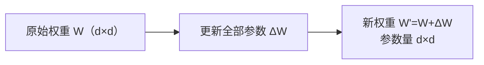
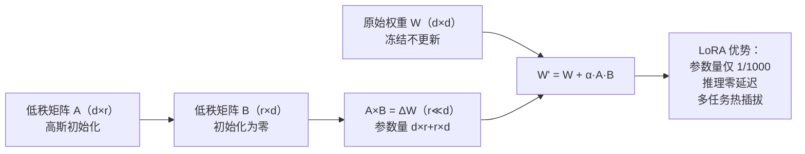
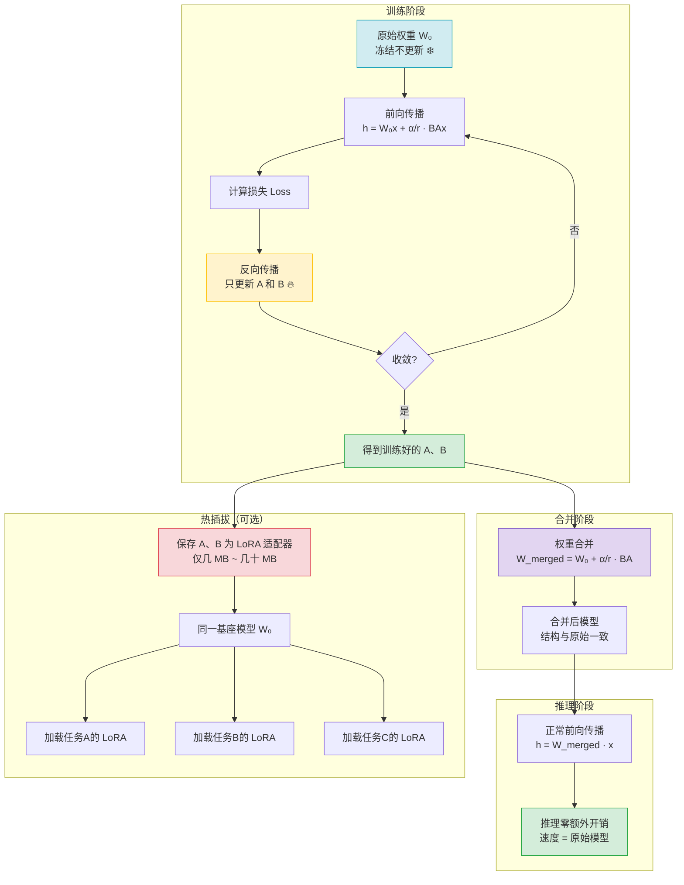

# 02 - 微调技术与 LoRA 原理

> **学习目标**：理解大语言模型微调的核心概念，掌握 LoRA 低秩自适应原理，了解 QLoRA 和其他 PEFT 方法，掌握 DeepSpeed 分布式训练和大模型评估方法，能够使用 HuggingFace 生态系统完成完整微调实战，并掌握多种部署推理方案。

> 📖 **参考链接**：
> - [HuggingFace PEFT 文档](https://huggingface.co/docs/peft/index) -- 参数高效微调（LoRA/QLoRA/Adapter/Prefix Tuning）的官方库文档
> - [HuggingFace Transformers 文档](https://huggingface.co/docs/transformers/index) -- Trainer/TrainingArguments 等微调训练接口
> - [HuggingFace PEFT 教程](https://huggingface.co/docs/peft/main/zh/quicktour) -- LoRA 微调快速上手指南
> - [LoRA 原论文（arXiv）](https://arxiv.org/abs/2106.09685) -- LoRA: Low-Rank Adaptation of Large Language Models
> - [QLoRA 原论文（arXiv）](https://arxiv.org/abs/2305.14314) -- QLoRA: 4-bit 量化 + LoRA 的高效微调方案

---

## 目录

1. [第一段：微调基础](#第一段微调基础)
2. [第二段：LoRA 原理](#第二段lora原理)
3. [第三段：QLoRA 进阶](#第三段qlora进阶)
4. [第四段：其他 PEFT 方法对比](#第四段其他-peft-方法对比)
5. [第五段：DeepSpeed 分布式训练](#第五段deepspeed-分布式训练)
6. [第六段：大模型评估方法](#第六段大模型评估方法)
7. [第七段：微调实战与部署推理](#第七段微调实战与部署推理)
8. [学习导航栏](#学习导航栏)
9. [自检清单](#自检清单)

---

## 第一段：微调基础

> **生活化类比：**
> - **全量微调** → 重新装修整栋房子：相当于对整栋房子进行全方位改造，每个房间都动工，材料成本高（显存需求大）、工期长（训练时间长），每个任务都需要保存一套完整的装修方案（完整权重）。但如果预算充足，效果也最彻底。
> - **LoRA（低秩自适应）** → 戴配饰：你不需要整容改变原本的五官（冻结原始权重），只需要戴上合适的帽子、项链、耳环这些小配饰（只训练少量额外参数），就能立刻改变整体风格，而且不同场合换不同配饰，取下配饰你还是原来的你。这就是LoRA的核心优势：参数少、成本低、可热插拔。
> - **QLoRA** → 压缩背包：出去旅行带很多东西（大模型权重），背包很沉。把衣服卷起来压缩、用真空袋抽真空（4-bit量化压缩），虽然占空间变小了，但需要的东西一件没少，背起来轻便很多（显存占用大幅降低），使用体验和原来差不多（精度损失可忽略）。

### 1.1 什么是大模型微调

大模型**微调（Fine-tuning）** 是指在已经预训练好的大语言模型基础上，使用特定领域或任务的数据继续训练模型，让模型学习到新的知识、风格或格式，同时保留预训练阶段学到的通用能力。

**微调的核心价值：**

| 价值 | 说明 |
|------|------|
| **领域适配** | 将通用大模型适配到垂直领域（医疗、法律、金融等） |
| **风格对齐** | 让模型输出符合特定格式或风格（如对话、JSON、代码） |
| **能力提升** | 注入新知识，提升特定任务上的性能 |
| **对齐人类偏好** | 通过 RLHF/DPO 让模型输出更符合人类期望 |

> **生活化类比：微调=新员工培训** —— 微调就像给一位名校毕业的新员工做"岗前培训"。预训练是他在学校读了十几年书（海量通用语料），知识面广但不够专；微调是入职后针对岗位做专项培训——医疗行业的就学医学术语，客服岗位的就学话术规范，代码岗位的就学编程规范。培训不会让他忘掉学校学的通识（保留预训练能力），而是叠加专业技能（领域适配）。培训几天就能上岗（少量数据、少量训练），比从幼儿园重新培养一个新人（从头预训练）成本低几个数量级。这就是微调的本质——在已有能力基础上"叠加"而非"重学"。

### 1.2 全量微调 vs 参数高效微调（PEFT）

**全量微调（Full Fine-tuning）**：更新模型所有参数。

| 优点 | 缺点 |
|------|------|
| 性能上限高 | 显存占用极大（7B模型需要上百GB显存） |
| 所有参数都能优化 | 训练成本高、速度慢 |
| - | 每个下游任务都需要保存完整权重（7B ≈ 13GB） |

**参数高效微调（PEFT，Parameter-Efficient Fine-Tuning）**：只微调一小部分额外参数，冻结大部分原始模型参数。

| 优点 | 缺点 |
|------|------|
| 显存占用极低 | 性能略低于全量微调（但差距很小） |
| 训练速度快 | - |
| 只需要存储少量增量参数 | - |
| 可叠加多个适配器到同一个基座模型 | - |

**PEFT 已成为业界主流方案**：在绝大多数场景下，PEFT 性能接近全量微调，但成本降低一个数量级以上。

> **生活化类比：全参微调=重新上学** —— 全参微调就像让一个已经工作的成年人"重新从小学上到大学"——每个知识点（每个参数）都要重新学一遍，时间漫长（训练慢）、学费高昂（显存大），而且换一个岗位就得重上一次学（每个任务存一套完整权重）。效果当然最彻底，但性价比很低。相比之下，PEFT/LoRA 是"只上短期培训班"——只学岗位需要的增量知识（只训练少量参数），原有知识全部保留（冻结原始权重），几天就能结业上岗。对于绝大多数场景，短期班的效果和重新上学的差距微乎其微，但成本低了十倍以上。

### 1.3 指令微调（Instruction Tuning）

指令微调是使用**指令-回答**格式的数据对模型进行微调，让模型学会理解人类指令并遵循要求生成。

**为什么需要指令微调？**

- 预训练模型只学会了预测下一个 token，不知道如何遵循指令
- 指令微调让模型学会"理解指令 → 完成任务"的模式
- 大幅提升模型在零样本/少样本场景下的泛化能力

**指令数据格式示例：**

```json
[
  {
    "instruction": "请将以下中文翻译成英文",
    "input": "人工智能正在改变世界",
    "output": "Artificial intelligence is changing the world"
  },
  {
    "instruction": "分析以下句子的情感倾向",
    "input": "这款手机电池续航真不错，拍照也很清晰",
    "output": "正面情感"
  }
]
```

### 1.4 Prompt Tuning

**Prompt Tuning** 是一种非常轻量的 PEFT 方法，只优化**连续的 soft prompt**嵌入，冻结模型其余所有参数。

**工作原理：**

```
原始输入:  [CLS] 请回答以下问题 ...
加入soft prompt:  [P1][P2]...[Pk] [CLS] 请回答以下问题 ...

其中 P1...Pk 是可训练参数，其余参数全部冻结
```

**特点：**

- 参数极少：通常只添加几十到几百个 token 的嵌入
- 理论优雅，但需要大模型（>10B）才能发挥效果
- 小模型上性能不如 LoRA
- 目前工业界较少使用

---

## 第二段：LoRA 原理

### 2.1 LoRA 核心思想：低秩分解

**LoRA（Low-Rank Adaptation，低秩自适应）** 由微软在论文《LoRA: Low-Rank Adaptation of Large Language Models》中提出。

LoRA 的核心洞察：**大模型权重的更新具有较低的秩，因此可以用低秩矩阵近似权重更新。**

> **生活化类比：** LoRA 低秩适配就像给汽车加外挂配件。全量微调相当于把整辆车拆了重新改装——发动机、变速箱、底盘全部换掉，成本高、耗时长，而且每换一种改装风格（每个下游任务）都要重新拆一遍。LoRA 则是给原装车加外挂配件：你不需要动发动机（冻结原始权重），只需要在车顶加个行李架、在车尾装个拖车钩（插入低秩矩阵 BA），就能让车具备新的能力。而且这些配件可以随时拆卸更换（热插拔），不同任务换不同的配件组合就行，原车完全不受影响。

### 2.2 数学推导

原始的权重更新：

$$
W = W_0 + \Delta W
$$

其中 $W_0 \in \mathbb{R}^{d \times k}$ 是原始权重，$\Delta W$ 是更新量。

LoRA 不对 $\Delta W$ 直接参数化，而是使用低秩分解：

$$
\Delta W = BA
$$

其中 $B \in \mathbb{R}^{d \times r}$, $A \in \mathbb{R}^{r \times k}$，$r$ 是秩（rank），通常 $r \ll \min(d, k)$。

**前向传播：**

$$
h = W_0 x + \Delta W x = W_0 x + \frac{\alpha}{r} BA x
$$

其中：

- $A$ 初始化为高斯分布
- $B$ 初始化为零矩阵
- 因此训练开始时 $\Delta W = 0$
- $\alpha$ 是缩放因子（scaling factor）

### 2.3 rank 参数选择

rank ($r$) 决定了低秩矩阵的维度，直接影响参数量和性能。

| r | 参数量（相对于 $W_0$） | 适用场景 |
|---|----------------------|---------|
| 1-4 | 极小 | 风格适配、数据量少 |
| 8-16 | 小 | 大部分场景推荐 |
| 32-64 | 中等 | 数据量大、复杂任务 |
| 64+ | 较大 | 接近全量微调 |

**经验法则：**

- 对于 7B/13B 模型，`r=8` 通常足够
- 对于 70B+ 模型，可以考虑 `r=16` 或 `r=32`
- 增大 r 一定会增加参数量，但不一定提升性能
- 在验证集上选择最小的满足性能要求的 r

### 2.4 alpha 缩放因子

alpha ($\alpha$) 用于缩放 $\Delta W$ 的输出：

$$
\text{scaling} = \frac{\alpha}{r}
$$

**为什么需要 alpha？**

- 平衡原有权重和增量权重的贡献
- 防止增量权重过大或过小
- alpha 越大，LoRA 模块的影响越大

**最佳实践：**

- 通常设置 `alpha = r`，此时 `scaling = 1`
- 或者设置 `alpha = 2 * r`，增大 LoRA 的影响
- 不建议 alpha 远小于 r，会让 LoRA 几乎不起作用

### 2.5 target_modules（目标模块）

LoRA 不是对所有层都插入低秩矩阵，而是只针对指定模块（通常是注意力层的投影矩阵）。

**常见配置：**

```python
# LLaMA 模型结构
target_modules = [
    "q_proj",  # Query 投影
    "v_proj",  # Value 投影
    # 可选：如果显存允许，可以加上 k_proj, o_proj, mlp 等
]
```

**不同选择对比：**

| 目标模块 | 参数量 | 性能 | 显存 |
|---------|-------|------|------|
| 只 q_proj + v_proj | 最小 | 足够好（论文推荐） | 最低 |
| q_proj + k_proj + v_proj + o_proj | 约 2x | 略有提升 | 略高 |
| 所有线性层（含MLP） | 约 4-8x | 提升有限 | 高很多 |

**结论：** 除非数据集非常大，否则只关注注意力的 q_proj 和 v_proj 就足够了。

### 2.6 LoRA 为什么有效？

| 原因 | 说明 |
|------|------|
| **参数效率极高** | 7B 模型通常只需要几十万到几百万可训练参数 |
| **不影响推理速度** | 推理时可以将 LoRA 权重合并到原始权重中，零延迟开销 |
| **可热插拔** | 同一个基座模型可以插多个不同任务的 LoRA 权重 |
| **梯度更稳定** | 原始模型参数冻结，减少了梯度方差 |

> **生活化类比：LoRA=只学增量知识** —— LoRA 就像一个经验丰富的专家"只学增量知识"。全参微调是把专家脑子里的所有知识重新改写一遍（更新全部参数），而 LoRA 的洞察是：新任务和旧知识之间的差异其实"信息量很低"（低秩），不需要改那么多。所以 LoRA 只让专家学一本薄薄的"增量笔记"（低秩矩阵 A×B），原有知识原封不动（冻结 W₀），用到新知识时就把笔记翻出来叠加（W₀+BA）。这本笔记很薄（参数量 1/1000），但足以覆盖新任务的需要。更妙的是，换任务只需换一本笔记（热插拔），专家的底子始终不变。这就是"低秩近似"的生活哲学——抓住主要矛盾，用最小代价获取最大改变。

### 2.7 LoRA 权重合并

训练完成后，可以将 LoRA 权重合并回原始权重，推理时不需要任何额外修改：

$$
W_{merged} = W_0 + \frac{\alpha}{r} BA
$$

合并后，模型结构不变，推理速度与原始模型完全相同。

**LoRA 与 Full Fine-tuning 对比图：**

**Full Fine-tuning（全量微调）：**



> 全量微调更新模型所有参数，参数量为 d×d，显存开销极大。

**LoRA（低秩自适应）：**



> LoRA 冻结原始权重，仅训练低秩矩阵 A 和 B（r << d），参数量极少且推理时可合并。

> LoRA 通过**冻结原始权重 + 插入低秩矩阵**的方式，将可训练参数量从 d×d 降至 d×r + r×d（r << d）。推理时将 A×B 合并到 W 中，模型结构不变，推理速度与原始模型完全一致。这种"即插即用"的设计使得同一个基座模型可以快速切换不同任务的 LoRA 权重，大幅降低了微调的存储和计算成本。

**LoRA 低秩分解全生命周期流程图（W = W₀ + BA）**：



---

## 第三段：QLoRA 进阶

### 3.1 QLoRA 是什么

**QLoRA（Quantized LoRA）** 是由华盛顿大学提出的高效微调技术，它将 4-bit 量化和 LoRA 结合，可以在单块消费级 GPU 上微调大模型。

**核心创新：**

1. **4-bit NormalFloat (NF4) 量化**：针对正态分布权重优化的量化方案
2. **双重量化（Double Quantization）**：对量化常数进一步量化，减少显存
3. **Paged Optimizers**：分页优化器，处理峰值显存峰值

### 3.2 4-bit NormalFloat (NF4) 量化

预训练模型权重通常近似服从标准正态分布 $W \sim N(0, 1)$。传统的均匀量化对正态分布不是最优的。

**NF4 的量化方案：**

- 分位数与正态分布的分位数对齐
- 在权重值密集的地方（靠近零点）量化粒度更细
- 在权重值稀疏的地方（远离零点）量化粒度更粗
- 理论上比均匀量化对正态分布权重更优

**量化效果对比：**

| 量化方式 | 4-bit 精度损失 |
|---------|---------------|
| 均匀量化 | 约 1-2% |
| NF4 | 约 0.5-1% |

### 3.3 双重量化（Double Quantization）

第一次量化：将原始 16/32-bit 权重量化为 4-bit，每个输出通道需要一个缩放因子（scale）。
第二次量化：对这些缩放因子本身再进行量化，进一步节省显存。

**显存节省：**

- 对于 7B 模型，大约节省 0.5GB 显存
- 几乎没有精度损失
- 默认开启，建议始终开启

### 3.4 显存对比

以 LLaMA-2 7B 模型为例：

| 方案 | 训练时显存占用 | 硬件要求 |
|------|---------------|---------|
| 全量微调（FP16） | ~140GB | A100 80GB × 2 |
| LoRA（FP16） | ~30GB | RTX 3090/4090 |
| QLoRA（4-bit NF4） | ~5-8GB | RTX 3060 12GB / 4060 8GB |

**QLoRA 惊人结论：** 在 4-bit 量化基础上微调，性能与 FP16 全量微调几乎相同！

### 3.5 QLoRA 工作流程

```
┌─────────────────────────────────────────────────────────┐
│                  QLoRA 微调流程                           │
│                                                         │
│  1. 将原始模型权重量化为 4-bit NF4                        │
│  2. 冻结量化后的权重                                    │
│  3. 只插入并训练 LoRA 低秩矩阵（依然是 FP32/BF16）        │
│  4. 反向传播时，通过 Paged Optimizers 管理显存            │
└─────────────────────────────────────────────────────────┘
```

---

## 第四段：其他 PEFT 方法对比

### 4.1 Adapter 方法

**Adapter（适配器）** 是最早的 PEFT 方法之一，在每层之间插入小型瓶颈结构。

**工作原理：**

```
原始层输出: x
Adapter:  x → 降维 (down projection) → 非线性 → 升维 (up projection) + 残差
输出: x + adapter(x)
```

**特点：**

- 参数量：通常每层几百到几千
- 缺点：引入额外推理延迟（需要额外前向计算）
- 推理时不能像 LoRA 一样合并权重
- 目前逐渐被 LoRA 取代

### 4.2 Prefix Tuning

**Prefix Tuning** 思想类似 Prompt Tuning，但优化的是 Key/Value 缓存中的前缀，而不是输入 embedding。

**特点：**

- 只优化前缀的 Key/Value，冻结其余参数
- 参数量比 Prompt Tuning 略多
- 对Transformer结构侵入更小
- 实际应用不如 LoRA 广泛

### 4.3 P-Tuning v2

P-Tuning v2 在 Prefix Tuning 基础上改进，对每一层都加入可训练的前缀嵌入。

**改进点：**

- 原始 P-Tuning 只在输入层加 prompt
- P-Tuning v2 在每一层都加 prefix
- 对更深的模型效果更好
- 仍然不如 LoRA 普及

### 4.4 IA³

**IA³（Infused Adapter by Inhibiting and Amplifying Inner Activations）** 通过缩放激活值来适配模型。

**原理：** 只学习一组缩放向量：

$$
k = s_k \odot k_0, \quad v = s_v \odot v_0
$$

其中 $s_k, s_v$ 是可训练向量，初始化为 1。

**特点：**

- 参数量极少：每个注意力层只有 d 个参数
- 可以合并到原始权重，不增加推理延迟
- 简单优雅，但性能在复杂任务上不如 LoRA

### 4.5 各种 PEFT 方法对比总结

| 方法 | 参数量（7B模型） | 推理延迟 | 性能 | 工业界流行度 |
|------|----------------|----------|------|-------------|
| **LoRA** | ~0.5-5M | 可合并，零延迟 | 很好 | ⭐⭐⭐⭐⭐ |
| **QLoRA** | 同 LoRA | 同 LoRA | 很好，显存更低 | ⭐⭐⭐⭐⭐ |
| IA³ | ~0.1-1M | 零延迟 | 良好 | ⭐⭐⭐ |
| Adapter | ~1-10M | 有额外延迟 | 良好 | ⭐⭐⭐ |
| Prefix Tuning | ~0.1-1M | 无 | 一般 | ⭐⭐ |
| P-Tuning v2 | ~1-5M | 无 | 良好 | ⭐⭐ |
| Prompt Tuning | ~0.01-0.1M | 无 | 仅大模型有效 | ⭐ |

**结论**：LoRA/QLoRA 综合最优，是目前工业界首选。

---

## 第五段：DeepSpeed 分布式训练

随着模型规模增长到数十甚至数百亿参数，单卡训练已不可行。DeepSpeed 是微软开源的分布式训练优化库，其核心 ZeRO（Zero Redundancy Optimizer）技术通过分片消除数据并行中的冗余，让大模型训练在有限的 GPU 资源上成为可能。

### 5.1 为什么需要 ZeRO

**标准数据并行（DP）的显存瓶颈**：

在标准数据并行中，每张 GPU 都保存模型的完整副本，包括参数、梯度和优化器状态。以 Adam 优化器为例，一个 $\Psi$ 参数的模型（FP16/BF16 混合精度训练）的显存占用为：

```
标准数据并行的显存组成:
├── 模型参数 (FP16):     2Ψ 字节
├── 梯度 (FP16):         2Ψ 字节
├── 优化器状态 (FP32):
│   ├── Adam 一阶矩 m:   4Ψ 字节
│   ├── Adam 二阶矩 v:   4Ψ 字节
│   └── 主权重 (FP32):   4Ψ 字节
└── 总计:                16Ψ 字节

以 7B 模型为例:
  16 × 7 × 10^9 = 112 GB
  → 即使是 A100 80GB 单卡也无法容纳
  → 多卡 DP 只是复制，不减少单卡显存
```

**ZeRO 的核心思想**：数据并行中每张 GPU 保存了相同的模型副本，存在大量冗余。ZeRO 通过将这些状态在 GPU 之间分片（partition），消除冗余，每张 GPU 只保存一部分状态。

### 5.2 ZeRO 三阶段原理

ZeRO 分为三个递进阶段，逐步消除更多冗余：

```
┌─────────────────────────────────────────────────────────────────┐
│                    ZeRO 三阶段分片策略                            │
│                                                                 │
│  标准 DP (无分片):                                               │
│    GPU 0: [参数 完整] [梯度 完整] [优化器状态 完整]               │
│    GPU 1: [参数 完整] [梯度 完整] [优化器状态 完整]  ← 全部冗余  │
│    GPU 2: [参数 完整] [梯度 完整] [优化器状态 完整]              │
│                                                                 │
│  ZeRO Stage 1 (优化器状态分片):                                  │
│    GPU 0: [参数 完整] [梯度 完整] [优化器状态 1/N]               │
│    GPU 1: [参数 完整] [梯度 完整] [优化器状态 1/N]  ← 仅分片OS  │
│    GPU 2: [参数 完整] [梯度 完整] [优化器状态 1/N]               │
│                                                                 │
│  ZeRO Stage 2 (优化器状态 + 梯度分片):                           │
│    GPU 0: [参数 完整] [梯度 1/N] [优化器状态 1/N]                │
│    GPU 1: [参数 完整] [梯度 1/N] [优化器状态 1/N]  ← 分片OS+G  │
│    GPU 2: [参数 完整] [梯度 1/N] [优化器状态 1/N]                │
│                                                                 │
│  ZeRO Stage 3 (优化器状态 + 梯度 + 参数全分片):                   │
│    GPU 0: [参数 1/N] [梯度 1/N] [优化器状态 1/N]                │
│    GPU 1: [参数 1/N] [梯度 1/N] [优化器状态 1/N]  ← 全部分片    │
│    GPU 2: [参数 1/N] [梯度 1/N] [优化器状态 1/N]                │
└─────────────────────────────────────────────────────────────────┘
```

**显存计算公式**：

设 GPU 数量为 $N_d$，模型参数量为 $\Psi$，以 FP16 混合精度 + Adam 优化器为例：

$$
\text{Memory}_{\text{Stage1}} = 2\Psi + 2\Psi + \frac{12\Psi}{N_d} = 4\Psi + \frac{12\Psi}{N_d}
$$

$$
\text{Memory}_{\text{Stage2}} = 2\Psi + \frac{2\Psi}{N_d} + \frac{12\Psi}{N_d} = 2\Psi + \frac{14\Psi}{N_d}
$$

$$
\text{Memory}_{\text{Stage3}} = \frac{2\Psi}{N_d} + \frac{2\Psi}{N_d} + \frac{12\Psi}{N_d} = \frac{16\Psi}{N_d}
$$

**7B 模型显存对比**（$N_d = 8$，$\Psi = 7 \times 10^9$）：

| 方案 | 公式 | 显存占用（8卡） | 单卡可容纳 |
|------|------|----------------|-----------|
| 标准 DP | $16\Psi$ | 112 GB/卡 | 否 |
| ZeRO-1 | $4\Psi + 12\Psi/N_d$ | $4\times7 + 12\times7/8 = 38.5$ GB/卡 | A100 80GB |
| ZeRO-2 | $2\Psi + 14\Psi/N_d$ | $2\times7 + 14\times7/8 = 26.25$ GB/卡 | A100 80GB |
| ZeRO-3 | $16\Psi/N_d$ | $16\times7/8 = 14$ GB/卡 | RTX 4090 24GB |

**70B 模型显存对比**（$N_d = 8$，$\Psi = 70 \times 10^9$）：

| 方案 | 显存占用（8卡） | 说明 |
|------|----------------|------|
| 标准 DP | 1120 GB/卡 | 完全不可行 |
| ZeRO-1 | 385 GB/卡 | 仍需多卡 |
| ZeRO-2 | 262.5 GB/卡 | 接近可行 |
| ZeRO-3 | 140 GB/卡 | 需 A100 80GB × 2/卡 |

**通信开销权衡**：

```
ZeRO 各阶段的代价:
├── ZeRO-1: 额外的优化器状态 all-reduce 通信
│   └── 通信量与标准 DP 相同（梯度 all-reduce）
│   └── 几乎不影响训练速度 ← 推荐默认使用
├── ZeRO-2: 梯度分片后 reduce-scatter 通信
│   └── 通信量与标准 DP 相同
│   └── 轻微影响训练速度 ← 显存不够时使用
└── ZeRO-3: 参数分片需要前向/反向时 all-gather 参数
    └── 通信量增加约 50%
    └── 训练速度降低 20-40% ← 显存严重不足时使用
```

### 5.3 ZeRO-Offload：CPU 卸载

ZeRO-Offload 在 ZeRO-2 的基础上，将部分计算和存储卸载到 CPU 内存：

```
ZeRO-Offload 工作原理:
┌──────────────────────────────────────────────────┐
│  GPU 显存                                        │
│  ├── 模型参数 (FP16)                              │
│  ├── 梯度 (FP16)                                 │
│  └── 前向/反向计算                                │
│                         ↕ (PCIe 传输)             │
│  CPU 内存                                        │
│  ├── 优化器状态 (FP32): m, v, master weights     │
│  └── 参数更新计算 (在 CPU 上执行 Adam)            │
└──────────────────────────────────────────────────┘

优势: 利用 CPU 大内存（通常 256GB-1TB）扩展可用存储
代价: GPU-CPU 之间的 PCIe 传输增加延迟
适合: 显存不足以容纳优化器状态的场景
```

**ZeRO-Offload 的显存节省**：

```
以 10B 模型为例（N_d=1，单卡）:
├── 标准 DP:     160 GB（无法单卡运行）
├── ZeRO-2:     160 GB（单卡无分片效果）
├── ZeRO-Offload: 
│   ├── GPU 显存: 2Ψ (参数) + 2Ψ (梯度) = 40 GB
│   └── CPU 内存: 12Ψ (优化器) = 120 GB
│   → 单卡 A100 40GB 勉强可运行 10B 模型
└── 实际效果: 10B 模型在单卡 V100 32GB 上完成训练
```

### 5.4 ZeRO-Infinity：NVMe 卸载

ZeRO-Infinity 进一步将卸载扩展到 NVMe SSD，突破 CPU 内存限制：

```
ZeRO-Infinity 存储层级:
┌──────────────────────────────────────────────────┐
│  GPU 显存 (HBM)     ~40-80 GB    ← 最快，最贵     │
│  ├── 当前计算所需的参数分片                        │
│  └── 当前 batch 的激活值                           │
│                         ↕ (NVLink, ~900 GB/s)     │
│  CPU 内存 (DRAM)    ~256-2000 GB ← 中速，中价     │
│  ├── 部分参数和梯度                                │
│  └── 部分优化器状态                                │
│                         ↕ (PCIe Gen4, ~32 GB/s)   │
│  NVMe SSD           ~4-16 TB     ← 慢速，便宜     │
│  ├── 完整的优化器状态                              │
│  ├── 完整的参数分片                                │
│  └── 完整的梯度分片                                │
└──────────────────────────────────────────────────┘

效果: 可在 32 张 A100 40GB 上训练 1 万亿参数模型
关键创新: 智能预取 + 异步更新，掩盖存储延迟
```

**ZeRO-Infinity 的创新**：

1. **无限卸载引擎**：在 GPU、CPU 和 NVMe 之间智能调度数据，最大化重叠计算和传输
2. **带宽中心化映射**：将参数布局与带宽层级匹配，高频访问的数据放在快速存储
3. **内存中心化划分**：按显存、CPU内存、NVMe 的带宽比例分配工作负载

### 5.5 DeepSpeed 与 PyTorch FSDP 对比

PyTorch FSDP（Fully Sharded Data Parallel）是 PyTorch 原生提供的分布式训练方案，功能与 ZeRO-3 类似。

| 维度 | DeepSpeed ZeRO | PyTorch FSDP |
|------|---------------|--------------|
| 分片策略 | ZeRO-1/2/3 三级可选 | 仅 ZeRO-3 级别 |
| CPU 卸载 | 支持（ZeRO-Offload） | 支持（有限） |
| NVMe 卸载 | 支持（ZeRO-Infinity） | 不支持 |
| 混合精度 | 内置支持 | 依赖 PyTorch AMP |
| 配置方式 | JSON 配置文件 | Python 代码配置 |
| 生态集成 | HuggingFace Accelerate | PyTorch 原生 |
| 灵活性 | 高（多种组合） | 中（固定策略） |
| 调试难度 | 较高（配置复杂） | 较低（原生支持） |
| Pipeline 并行 | 支持（DeepSpeed Pipeline） | 不支持 |
| 张量并行 | 支持（通过 Megatron 集成） | 不支持 |

**选型建议**：

```
选择 DeepSpeed 的场景:
├── 需要 ZeRO-1 或 ZeRO-2（不需要全分片）
├── 需要 CPU/NVMe 卸载
├── 需要 Pipeline 并行
├── 超大规模模型（100B+ 参数）
└── 需要精细控制分片策略

选择 FSDP 的场景:
├── 纯 PyTorch 生态，不想引入额外依赖
├── 模型规模适中（7B-70B）
├── 不需要 CPU/NVMe 卸载
├── 追求代码简洁和可维护性
└── 使用 PyTorch 2.0+ 的 FSDP + activation checkpointing
```

### 5.6 DeepSpeed 配置示例

DeepSpeed 使用 JSON 配置文件定义训练参数，以下是一个典型的 ZeRO-2 配置：

```json
{
  "bf16": {
    "enabled": true
  },
  "zero_optimization": {
    "stage": 2,
    "offload_optimizer": {
      "device": "cpu",
      "pin_memory": true
    },
    "allgather_partitions": true,
    "allgather_bucket_size": 5e8,
    "overlap_comm": true,
    "reduce_scatter": true,
    "reduce_bucket_size": 5e8,
    "contiguous_gradients": true
  },
  "gradient_accumulation_steps": "auto",
  "gradient_clipping": "auto",
  "train_batch_size": "auto",
  "train_micro_batch_size_per_gpu": "auto",
  "steps_per_print": 2000,
  "optimizer": {
    "type": "AdamW",
    "params": {
      "lr": "auto",
      "betas": "auto",
      "eps": "auto",
      "weight_decay": "auto"
    }
  },
  "scheduler": {
    "type": "WarmupLR",
    "params": {
      "warmup_min_lr": "auto",
      "warmup_max_lr": "auto",
      "warmup_num_steps": "auto",
      "warmup_type": "linear"
    }
  },
  "activation_checkpointing": {
    "partition_activations": true,
    "cpu_checkpointing": true,
    "contiguous_memory_optimization": true,
    "number_checkpoints": false,
    "synchronize_checkpoint_boundary": false,
    "profile": false
  }
}
```

**在 HuggingFace Trainer 中使用 DeepSpeed**：

```python
from transformers import TrainingArguments, Trainer

training_args = TrainingArguments(
    output_dir="./output",
    per_device_train_batch_size=4,
    gradient_accumulation_steps=4,
    learning_rate=2e-5,
    num_train_epochs=3,
    bf16=True,
    deepspeed="deepspeed_config.json",  # 指定 DeepSpeed 配置文件
)

trainer = Trainer(
    model=model,
    args=training_args,
    train_dataset=dataset,
)
trainer.train()
```

**ZeRO-3 配置（全分片，适合超大模型）**：

```json
{
  "bf16": {
    "enabled": true
  },
  "zero_optimization": {
    "stage": 3,
    "offload_optimizer": {
      "device": "cpu",
      "pin_memory": true
    },
    "offload_param": {
      "device": "cpu",
      "pin_memory": true
    },
    "overlap_comm": true,
    "contiguous_gradients": true,
    "sub_group_size": 1e9,
    "reduce_bucket_size": "auto",
    "stage3_prefetch_bucket_size": "auto",
    "stage3_param_persistence_threshold": "auto",
    "stage3_max_live_parameters": 1e9,
    "stage3_max_reuse_distance": 1e9,
    "stage3_gather_16bit_weights_on_model_save": true
  },
  "gradient_accumulation_steps": "auto",
  "gradient_clipping": "auto",
  "train_batch_size": "auto",
  "train_micro_batch_size_per_gpu": "auto",
  "optimizer": {
    "type": "AdamW",
    "params": {
      "lr": "auto",
      "betas": "auto",
      "eps": "auto",
      "weight_decay": "auto"
    }
  }
}
```

**关键配置参数说明**：

| 参数 | 作用 | 推荐值 |
|------|------|--------|
| `stage` | ZeRO 阶段（1/2/3） | 2（显存足够时）/ 3（显存不足时） |
| `offload_optimizer.device` | 优化器卸载目标 | "cpu"（节省显存）/ "none" |
| `offload_param.device` | 参数卸载目标（仅 Stage 3） | "cpu" / "none" |
| `overlap_comm` | 重叠通信和计算 | true（几乎总是开启） |
| `reduce_bucket_size` | 梯度聚合桶大小 | 5e8（500M） |
| `activation_checkpointing` | 激活检查点 | true（节省显存，增加计算） |

---

## 第六段：大模型评估方法

模型训练完成后，评估是衡量模型能力、指导优化方向的关键环节。大模型评估与传统 NLP 评估有显著差异：生成式任务的评估更复杂，且需要覆盖语言理解、代码生成、数学推理等多个维度。

### 6.1 生成式评估指标

**困惑度（Perplexity, PPL）**：

困惑度衡量语言模型对文本的"困惑程度"，是衡量语言模型基础能力的核心指标。

$$
\text{PPL}(W) = \exp\left(-\frac{1}{N}\sum_{i=1}^{N} \log P(w_i | w_{<i})\right)
$$

其中 $W = (w_1, w_2, ..., w_N)$ 是文本序列，$P(w_i | w_{<i})$ 是模型预测第 $i$ 个词的概率。

```
困惑度的直观理解:
  PPL = 1:  模型完美预测每个词（不可能达到）
  PPL = 10: 模型在每个位置平均在10个候选词中犹豫
  PPL = 100: 模型非常困惑，预测能力差

不同模型在 WikiText-103 上的 PPL:
  GPT-2 (1.5B):   ~17.5
  GPT-3 (175B):   ~11.4
  LLaMA-2 (70B):  ~3.5  ← 更低的 PPL = 更好的语言建模能力
```

**PPL 的局限性**：困惑度只衡量"预测下一个词"的能力，不能直接反映指令遵循、推理、对话等高级能力。一个 PPL 低的模型可能完全不会回答问题。

**BLEU（Bilingual Evaluation Understudy）**：

BLEU 主要用于机器翻译评估，衡量生成文本与参考文本的 n-gram 重叠程度。

$$
\text{BLEU} = \text{BP} \times \exp\left(\sum_{n=1}^{N} w_n \log p_n\right)
$$

其中 $p_n$ 是 n-gram 精确度，$w_n$ 是权重（通常均匀 $1/N$），BP 是长度惩罚：

$$
\text{BP} = \begin{cases} 1 & \text{if } c > r \\ \exp(1 - r/c) & \text{if } c \leq r \end{cases}
$$

其中 $c$ 是生成文本长度，$r$ 是参考文本长度。

```
BLEU 计算示例:
  参考: "The cat is on the mat"
  生成: "The cat is on the mat"  → BLEU = 1.0 (完美)
  生成: "A cat is on the mat"    → BLEU ≈ 0.65
  生成: "The dog is in the house" → BLEU ≈ 0.15

BLEU-4: 使用 1-gram 到 4-gram 的几何平均
  BLEU-4 对词序和短语级匹配更敏感
```

**BLEU 的局限性**：完全依赖 n-gram 匹配，无法捕获语义等价性。同义但用词不同的回答会被严重低估。

**ROUGE-L（Recall-Oriented Understudy for Gisting Evaluation）**：

ROUGE 主要用于文本摘要评估，关注召回率。ROUGE-L 基于最长公共子序列（LCS）：

$$
\text{ROUGE-L} = F_{\text{LCS}} = \frac{(1 + \beta^2) \cdot R_{\text{LCS}} \cdot P_{\text{LCS}}}{R_{\text{LCS}} + \beta^2 \cdot P_{\text{LCS}}}
$$

其中 $R_{\text{LCS}} = \frac{\text{LCS}(X, Y)}{m}$，$P_{\text{LCS}} = \frac{\text{LCS}(X, Y)}{n}$，$m$ 和 $n$ 分别是参考和生成文本的长度。

```
ROUGE-L 计算示例:
  参考: "The cat sat on the mat"
  生成: "The cat is on the mat"
  LCS: "The cat on the mat" (长度6)
  R = 6/6 = 1.0, P = 6/6 = 1.0
  ROUGE-L = 1.0 (近似，忽略词序差异)

BLEU vs ROUGE:
  BLEU: 侧重精确率（生成中有多少在参考中出现）
  ROUGE: 侧重召回率（参考中有多少在生成中出现）
```

**BERTScore**：

BERTScore 使用预训练 BERT 模型的嵌入来计算语义相似度，克服了 n-gram 方法的局限：

```
BERTScore 计算流程:
  1. 用 BERT 编码参考文本和生成文本
     参考 tokens: r_1, r_2, ..., r_m → 嵌入 R = {r_1, ..., r_m}
     生成 tokens: g_1, g_2, ..., g_n → 嵌入 G = {g_1, ..., g_n}

  2. 计算每个 token 的最佳匹配
     对 g_i: 找 R 中余弦相似度最高的 r_j
     recall = (1/n) Σ max_j cos(g_i, r_j)
     precision = (1/m) Σ max_i cos(r_j, g_i)

  3. F1 = 2 × P × R / (P + R)

优势: 捕获语义相似性，同义替换不会扣分
      "快乐" 和 "高兴" 的 BERTScore 接近 1.0
      而 BLEU/ROUGE 会因用词不同而扣分
```

### 6.2 能力评估基准

大模型评估需要覆盖多个能力维度，以下是业界公认的核心基准：

| 基准 | 评估能力 | 任务格式 | 评估方法 | 代表性 |
|------|---------|---------|---------|--------|
| **MMLU** | 多任务语言理解 | 多选题（57个学科） | 准确率 | 最广泛 |
| **HumanEval** | 代码生成 | 函数补全 + 测试用例 | pass@1/pass@10 | 代码评估标准 |
| **GSM8K** | 数学推理 | 小学数学应用题 | 准确率 | 数学推理标准 |
| **BBH** | 复杂推理 | Big-Bench Hard 子集 | 准确率 | 推理能力上限 |
| **CEval** | 中文综合能力 | 中文多选题 | 准确率 | 中文评估标准 |
| **MT-Bench** | 多轮对话 | 开放式问答 | LLM-as-Judge | 对话能力 |
| **HellaSwag** | 常识推理 | 选择题 | 准确率 | 常识评估 |
| **TruthfulQA** | 真实性 | 问答 | 准确率 | 幻觉评估 |

**MMLU（Massive Multitask Language Understanding）**：

MMLU 覆盖 57 个学科的多选题，涵盖 STEM、人文学科、社会科学等：

```python
# MMLU 评估示例
# 格式: 给定问题和4个选项，选择正确答案

question = "In a chemical reaction, which of the following does NOT affect the rate?"
choices = [
    "A. Temperature",
    "B. Concentration of reactants", 
    "C. Color of the reactants",    # 正确答案
    "D. Surface area of reactants"
]

# 评估方法: 让模型生成 A/B/C/D，或计算每个选项的 log-prob
# 选取 log-prob 最高的选项作为预测

# 评估代码示例（使用 lm-eval-harness）
# lm_eval --model hf --model_args pretrained=meta-llama/Llama-3-8B \
#   --tasks mmlu --num_fewshot 5
```

**HumanEval（代码生成评估）**：

HumanEval 由 164 个编程问题组成，每个问题包含函数签名、文档字符串和测试用例：

```python
# HumanEval 任务示例
def has_close_elements(numbers: list, threshold: float) -> bool:
    """Check if any two numbers in the list are closer than threshold."""
    # 模型需要补全函数实现
    for i in range(len(numbers)):
        for j in range(i + 1, len(numbers)):
            if abs(numbers[i] - numbers[j]) < threshold:
                return True
    return False

# 评估指标: pass@k
# pass@1: 采样1次，至少1次通过测试的比例
# pass@10: 采样10次，至少1次通过测试的比例

# pass@k 公式:
# pass@k = 1 - C(n-c, k) / C(n, k)
# 其中 n 是总采样次数，c 是通过次数
```

**GSM8K（小学数学推理）**：

GSM8K 包含 8500 道高质量小学数学应用题，要求模型逐步推理得到数值答案：

```python
# GSM8K 评估示例
question = """
Janet's ducks lay 16 eggs per day. She eats three for breakfast every 
morning and bakes muffins for her friends every day with four. She sells 
the remainder at the ducks' eggs at the farmers' market daily for $2 per 
fresh duck egg. How much in dollars does she make every day at the 
farmers' market?
"""

# 评估方式: 提取最终数字答案，与标准答案比较
# 标准 Chain-of-Thought 评估:
# 1. 让模型生成推理过程
# 2. 提取最终答案（通常是最后一个数字）
# 3. 与标准答案比较

# 链式推理示例:
# "16 - 3 - 4 = 9 eggs remaining.
#  9 × $2 = $18 per day."
# 答案: 18 ← 正确
```

**BBH（Big-Bench Hard）**：

BBH 是 Big-Bench 中 23 个最困难的任务子集，用于评估模型的复杂推理能力上限：

```
BBH 任务类型:
├── 逻辑推理: 因果关系判断、三段论
├── 数学推理: 高难度数学问题
├── 符号推理: 形式化逻辑、符号操作
├── 语言理解: 语义歧义、语用推理
└── 常识推理: 反直觉的常识判断

特点: 小模型（< 50B）在 BBH 上接近随机水平
      只有 GPT-4 级别模型才能取得 > 60% 的准确率
```

### 6.3 LLM-as-Judge：使用大模型评估大模型

**LLM-as-Judge** 是利用强大的 LLM（如 GPT-4）作为评判者来评估其他模型输出的方法，特别适合开放式生成任务的评估。

```
LLM-as-Judge 工作流程:
┌──────────────────────────────────────────────────────────┐
│  1. 准备评估数据                                          │
│     ├── 输入: prompt                                      │
│     ├── 候选回答: model_A 的回答                          │
│     └── (可选) 参考回答                                   │
│                                                          │
│  2. 构建评估 prompt                                       │
│     ├── 任务描述: "请评估以下回答的质量"                   │
│     ├── 评分标准: 准确性、有用性、无害性、简洁性          │
│     ├── 待评估内容: prompt + 候选回答                     │
│     └── 输出格式: "请给出 1-10 分的评分和理由"            │
│                                                          │
│  3. 调用 Judge 模型 (GPT-4)                              │
│     └── 获取评分和理由                                    │
│                                                          │
│  4. 解析评分                                              │
│     └── 从输出中提取数值评分                             │
└──────────────────────────────────────────────────────────┘
```

**MT-Bench 评估示例**：

```python
# MT-Bench: 多轮对话评估
# 使用 GPT-4 作为 Judge，对模型的多轮对话能力评分

judge_prompt = """
你是一个评估专家。请根据以下标准对AI助手的回答进行评分。

评分标准（1-10分）：
- 有用性: 回答是否直接解决了用户的问题
- 准确性: 回答中的信息是否正确
- 深度: 回答是否提供了足够的细节和推理
- 相关性: 回答是否紧扣主题

用户问题: {question}
AI回答: {answer}
参考回答: {reference}  # 可选

请给出 1-10 的评分，并简要说明理由。
评分:
"""

# 评估结果
# GPT-4 (Judge) 对不同模型的评分:
#   GPT-4:        9.2 分
#   Claude-3:     8.8 分
#   LLaMA-3 70B:  8.1 分
#   LLaMA-3 8B:   7.2 分
```

**LLM-as-Judge 的偏差与缓解**：

| 偏差类型 | 表现 | 缓解策略 |
|---------|------|---------|
| 位置偏差 | 偏好先出现的回答 | 随机打乱回答顺序，取平均 |
| 长度偏差 | 偏好更长的回答 | 加入长度惩罚提示词 |
| 自我偏好 | GPT-4 偏好 GPT 系列输出 | 使用多个 Judge 模型取平均 |
| 一致性偏差 | 多次评估结果不一致 | 多次采样取平均 |

### 6.4 评估框架

**lm-eval-harness（EleutherAI）**：

lm-eval-harness 是最广泛使用的 LLM 评估框架，支持数百个评估任务：

```bash
# 安装
pip install lm-eval

# 评估本地模型
lm_eval --model hf \
    --model_args pretrained=meta-llama/Llama-3-8B-Instruct,trust_remote_code=True \
    --tasks mmlu,hellaswag,gsm8k,humaneval \
    --num_fewshot 5 \
    --batch_size 8 \
    --output_path ./eval_results

# 评估 vLLM 部署的模型
lm_eval --model local-completions \
    --model_args model=qwen-2-7b,base_url=http://localhost:8000/v1/completions \
    --tasks mmlu,gsm8k \
    --apply_chat_template
```

**OpenCompass（上海AI实验室）**：

OpenCompass 是一个面向中文场景的综合评估框架，支持更丰富的中文基准：

```python
# OpenCompass 配置示例
from mmengine.config import Config

config = Config.fromfile('eval_configs/qwen2_7b_eval.py')

# 评估配置
config = dict(
    model=dict(
        type='HuggingFaceLM',
        path='Qwen/Qwen2-7B-Instruct',
        tokenizer_path='Qwen/Qwen2-7B-Instruct',
        model_kwargs=dict(device_map='auto', trust_remote_code=True),
    ),
    datasets=[
        dict(type='mmlu', few_shot=5),
        dict(type='ceval', few_shot=5),
        dict(type='gsm8k', few_shot=5),
        dict(type='humaneval', few_shot=0),
    ],
    eval=dict(
        type='eval',
        batchSize=8,
    ),
)
```

**框架对比**：

| 维度 | lm-eval-harness | OpenCompass |
|------|----------------|-------------|
| 开发者 | EleutherAI | 上海AI实验室 |
| 任务数量 | 200+ | 100+ |
| 中文支持 | 一般 | 优秀 |
| 评估方式 | 生成式 + log-prob | 生成式 + log-prob |
| 模型支持 | HuggingFace, vLLM, API | HuggingFace, vLLM, API |
| 可视化 | 基础 | 内置仪表盘 |
| 适合场景 | 国际通用基准 | 中文+国际基准 |

### 6.5 评估指标选择策略

```
评估指标选择决策树:

任务类型?
├── 语言建模 / 困惑度
│   └── 使用 PPL（仅在模型基座评估时使用）
├── 生成式任务（翻译/摘要）
│   ├── 翻译 → BLEU
│   ├── 摘要 → ROUGE-L
│   └── 语义等价 → BERTScore
├── 选择题 / 分类
│   └── 使用准确率（Accuracy）
├── 代码生成
│   └── 使用 pass@k（执行测试用例）
├── 数学推理
│   └── 使用准确率（提取最终数字答案比较）
├── 开放式问答 / 对话
│   ├── 有人工标注 → 使用人工评分
│   └── 无人工标注 → 使用 LLM-as-Judge
└── 综合能力评估
    └── 使用 MMLU + HumanEval + GSM8K 组合基准
```

**综合评估的最佳实践**：

```
推荐的综合评估方案:
├── 基座模型能力: PPL + MMLU（zero-shot 和 few-shot）
├── 指令遵循能力: MT-Bench / AlpacaEval（LLM-as-Judge）
├── 代码能力: HumanEval (pass@1) + MBPP
├── 数学推理: GSM8K + MATH
├── 中文能力: C-Eval + CMMLU
├── 安全性: TruthfulQA + ToxiGen
├── 长上下文: Needle In A Haystack + LongBench
└── 实际应用评估: 自建业务评估集 + 人工抽检

注意:
├── 不要只看单一指标（MMLU 高不等于对话好）
├── 评估集可能泄露到训练数据中（数据污染）
├── few-shot 数量影响结果（0-shot vs 5-shot 差异大）
└── 最终应以实际业务场景的人工评估为准
```

---

## 第七段：微调实战与部署推理

### 7.1 HuggingFace 生态

微调大模型离不开 HuggingFace 生态系统，核心库：

| 库 | 作用 |
|----|------|
| `transformers` | 加载预训练模型、分词器 |
| `peft` | PEFT 方法集成（LoRA、IA³、Adapter 等） |
| `datasets` | 数据集加载与处理 |
| `trl` | Transformer Reinforcement Learning，支持 SFT、DPO、PPO |
| `bitsandbytes` | 4-bit/8-bit 量化支持 |
| `accelerate` | 多GPU分布式训练 |

**环境安装：**

```bash
pip install transformers peft datasets trl bitsandbytes accelerate
```

### 7.2 数据集准备

指令微调数据集通常是 JSON/JSONL 格式，示例：

```json
[
  {
    "messages": [
      {"role": "system", "content": "你是一个专业的AI助手。"},
      {"role": "user", "content": "什么是LoRA？"},
      {"role": "assistant", "content": "LoRA是低秩自适应，一种参数高效的微调方法..."}
    ]
  }
]
```

**数据处理示例：**

```python
from datasets import load_dataset

# 加载数据集
dataset = load_dataset("json", data_files="my_data.json")

# 对话模板格式化
def format_conversation(example):
    # 根据你的模型选择正确的对话模板
    # 比如 Llama-3 聊天模板
    return {"text": tokenizer.apply_chat_template(
        example["messages"], tokenize=False
    )}

dataset = dataset.map(format_conversation)
```

**高质量数据要点：**

- 数据质量 > 数据数量，1k 高质量数据 >> 100k 低质量数据
- 覆盖多样化的指令和场景
- 清洗去重，移除错误和重复样本
- 控制样本长度，避免过长样本占显存

### 7.3 完整训练脚本（QLoRA + SFT）

```python
# ============================================
# QLoRA 微调 LLaMA-3 示例
# ============================================
import torch
from datasets import load_dataset
from transformers import (
    AutoModelForCausalLM,
    AutoTokenizer,
    BitsAndBytesConfig,
    TrainingArguments,
    pipeline,
)
from peft import LoraConfig, get_peft_model, prepare_model_for_kbit_training
from trl import SFTTrainer

# ============================================
# 1. 配置参数
# ============================================
model_name = "meta-llama/Llama-3-8B-Instruct"
dataset_path = "train_data.jsonl"
output_dir = "./lora-llama3-8b-output"

# LoRA 配置
lora_config = LoraConfig(
    r=8,                      # 秩
    lora_alpha=16,            # alpha = 2 * r
    target_modules=["q_proj", "v_proj"],  # 目标模块
    lora_dropout=0.05,
    bias="none",
    task_type="CAUSAL_LM",
)

# 4-bit 量化配置
bnb_config = BitsAndBytesConfig(
    load_in_4bit=True,
    bnb_4bit_use_double_quant=True,
    bnb_4bit_quant_type="nf4",
    bnb_4bit_compute_dtype=torch.bfloat16
)

# 训练参数
training_args = TrainingArguments(
    output_dir=output_dir,
    per_device_train_batch_size=4,
    gradient_accumulation_steps=4,
    learning_rate=2e-4,
    num_train_epochs=3,
    max_steps=-1,
    logging_steps=10,
    save_strategy="epoch",
    fp16=True,
    optim="paged_adamw_8bit",
    report_to="none",
    warmup_ratio=0.03,
    weight_decay=0.01,
)

# ============================================
# 2. 加载模型和分词器
# ============================================
tokenizer = AutoTokenizer.from_pretrained(model_name)
tokenizer.pad_token = tokenizer.eos_token
tokenizer.padding_side = "right"  # 避免警告

model = AutoModelForCausalLM.from_pretrained(
    model_name,
    quantization_config=bnb_config,
    device_map="auto",
    trust_remote_code=True,
)
model = prepare_model_for_kbit_training(model)
model = get_peft_model(model, lora_config)

# 打印可训练参数
model.print_trainable_parameters()
# 输出示例: trainable params: 41,943,040 || all params: 7,052,837,888 || trainable: 0.5947%

# ============================================
# 3. 加载数据集
# ============================================
dataset = load_dataset("json", data_files=dataset_path, split="train")

def format_func(example):
    return tokenizer.apply_chat_template(example["messages"], tokenize=False)

# ============================================
# 4. 开始训练
# ============================================
trainer = SFTTrainer(
    model=model,
    train_dataset=dataset,
    args=training_args,
    tokenizer=tokenizer,
    peft_config=lora_config,
    formatting_func=format_func,
    max_seq_length=1024,
    packing=False,
)

trainer.train()

# 保存 LoRA 权重
trainer.model.save_pretrained(output_dir)
print(f"LoRA 权重已保存到: {output_dir}")
```

### 7.4 参数调优指南

**学习率：**

- LoRA 推荐 `1e-4` 到 `5e-4`
- QLoRA 可以适当高一点 `2e-4` 到 `5e-4`
- 太小收敛慢，太大容易发散

**Batch Size 与梯度累积：**

- 根据显存调整 batch size
- 如果显存不够，减小 batch size 增大梯度累积
- 例如：batch_size=1 + gradient_accumulation_steps=16 ≈ batch_size=16

**Rank r：**

- 数据量小：`r=1-4`
- 数据量中等：`r=8-16` （推荐起点）
- 数据量大：`r=32-64`

**训练轮数：**

- 一般 2-5 轮足够
- 观察验证损失，提前停止（early stopping）
- 避免过拟合

### 7.5 合并 LoRA 权重

```python
from peft import PeftModel
from transformers import AutoModelForCausalLM

base_model = AutoModelForCausalLM.from_pretrained(
    "meta-llama/Llama-3-8B-Instruct",
    torch_dtype=torch.float16,
    device_map="auto",
)
model = PeftModel.from_pretrained(base_model, "./lora-llama3-8b-output")
model = model.merge_and_unload()

# 保存合并后的完整模型
model.save_pretrained("./merged-llama3-8b-finetuned")
tokenizer.save_pretrained("./merged-llama3-8b-finetuned")
```

### 7.6 部署推理：vLLM

vLLM 是目前最快的开源 LLM 推理引擎，支持 PagedAttention，高吞吐量。

**启动服务：**

```bash
pip install vllm
python -m vllm.entrypoints.openai.api_server \
    --model ./merged-llama3-8b-finetuned \
    --port 8000 \
    --gpu-memory-utilization 0.9
```

**API 调用：**

```python
from openai import OpenAI
client = OpenAI(base_url="http://localhost:8000/v1", api_key="token-xxx")

response = client.chat.completions.create(
    model="./merged-llama3-8b-finetuned",
    messages=[{"role": "user", "content": "你好，请介绍一下你自己"}]
)
print(response.choices[0].message.content)
```

### 7.7 量化部署：GGUF / AWQ / GPTQ

**GGUF（llama.cpp 格式）：**

```bash
# 使用 llama.cpp 转换
python convert.py ./merged-llama3-8b-finetuned \
    --outtype f16 \
    --outfile model-f16.gguf

# 量化为 4-bit
./quantize model-f16.gguf model-q4_0.gguf q4_0
```

- 优点：跨平台，支持 CPU 推理
- 适合端侧部署

**AWQ：**

```python
# 使用 autoawq 量化
from awq import AutoAWQForCausalLM
from transformers import AutoTokenizer

model = AutoAWQForCausalLM.from_pretrained(
    "./merged-llama3-8b-finetuned"
)
tokenizer = AutoTokenizer.from_pretrained(
    "./merged-llama3-8b-finetuned"
)
model.quantize(tokenizer, quant_path="./llama3-8b-awq")
```

- 速度比 GPTQ 更快
- NVIDIA GPU 推荐

**GPTQ：**

- 成熟的 4-bit 量化方案
- 支持 ExLlamaV2 加速
- 广泛支持

### 7.8 Ollama 本地部署

```dockerfile
# 创建 Modelfile
FROM ./merged-llama3-8b-finetuned
PARAMETER temperature 0.7
SYSTEM "你是一个专业的助手..."
```

```bash
# 创建并运行
ollama create my-model -f Modelfile
ollama run my-model
```

Ollama 是最简单的本地部署方案，一键运行，适合演示和开发。

---

## 学习导航栏

| 序号 | 文档 | 核心内容 | 状态 |
|------|------|---------|------|
| 01 | [Python 核心语法速通](../python-core/01-Python核心语法速通.md) | 类型系统、函数、装饰器、面向对象 | 已完成 |
| 02 | [LangChain 与 AI 智能体核心](../langchain-rag/02-LangChain与AI智能体核心.md) | LangChain、核心组件、Agent | 已完成 |
| 03 | [RAG 检索增强生成实战](../langchain-rag/03-RAG检索增强生成实战.md) | 文档加载、向量化、检索、RAGAS | 已完成 |
| 04 | [Python 与 AI 智能体笔面试题集](../langchain-rag/04-Python与AI智能体笔面试题集.md) | 高频面试题与详细解答 | 已完成 |
| **05** | **微调技术与 LoRA 原理** | **微调基础、LoRA推导、QLoRA、PEFT对比、DeepSpeed、评估方法、实战部署** | **当前** |
| 06 | 大模型微调完整项目实战 | 数据准备、环境配置、训练、评估、部署 | 规划中 |
| 07 | LLM 笔面试题集（微调与推理） | LoRA、QLoRA、PEFT、量化高频题 | 规划中 |

---
## 常见面试题

> 以下面试题覆盖本章核心知识点，附详细答案解析。

### 1. 请解释 LoRA 的低秩分解原理，为什么能用远少于原始参数的矩阵实现有效的微调？（★★★）

**答案：** LoRA 的核心洞察是：大模型微调时权重更新量 $\Delta W$ 的"有效自由度"很低，可以用低秩分解近似。具体来说，原始权重矩阵 $W_0 \in \mathbb{R}^{d \times k}$ 的更新量 $\Delta W$ 被分解为两个小矩阵的乘积：$\Delta W = BA$，其中 $B \in \mathbb{R}^{d \times r}$，$A \in \mathbb{R}^{r \times k}$，且秩 $r \ll \min(d, k)$。这样参数量从 $d \times k$ 降到了 $d \times r + r \times k$，通常可减少 1000 倍以上。LoRA 能有效的原因是：预训练模型已经学到了丰富的通用特征，微调只需要在低维子空间内进行适配，不需要重新学习所有参数组合。训练时 A 用高斯初始化、B 初始化为零，确保训练开始时 $\Delta W = 0$，不影响模型原始输出。推理时可将 BA 合并到 W 中，零额外开销。

### 2. QLoRA 中的 NF4 量化与普通均匀量化有什么区别？为什么它对大模型权重更有效？（★★）

**答案：** 普通均匀量化在数值范围内等间距划分量化区间，这对正态分布的数据不是最优的。NF4（4-bit NormalFloat）是专门为正态分布设计的量化方案：它的量化区间边界与正态分布的分位数对齐，在权重值密集的地方（靠近零点）量化粒度更细，在权重值稀疏的地方（远离零点）量化粒度更粗。大模型预训练权重近似服从 $N(0,1)$ 正态分布，因此 NF4 的信息损失比均匀量化更小。实验表明，NF4 的 4-bit 精度损失约为 0.5-1%，而均匀量化约为 1-2%。此外，QLoRA 还引入了双重量化（对量化常数再量化）进一步节省约 0.5GB 显存。

### 3. 请对比 LoRA、Adapter、Prefix Tuning 和 IA³ 等 PEFT 方法，并说明各自的优缺点和适用场景。（★★）

**答案：** 四种 PEFT 方法的核心区别如下：**LoRA** 通过低秩分解插入旁路矩阵，推理时可将权重合并实现零延迟，参数约 0.5-5M，是目前工业界首选。**Adapter** 在每层之间插入小型瓶颈结构（降维→非线性→升维），但推理时有额外延迟，无法合并权重，逐渐被 LoRA 取代。**Prefix Tuning** 优化的是 Key/Value 缓存中的前缀，参数量极低但性能一般，且对 Transformer 结构有侵入性。**IA³** 只学习缩放向量来调节激活值，每个注意力层仅 d 个参数，可合并到权重，但复杂任务上不如 LoRA。综合来看，LoRA/QLoRA 在参数量、推理延迟、性能三者间取得了最佳平衡，是当前工业界的主流选择。

### 4. 请解释 DeepSpeed ZeRO 的三个阶段分别分片了哪些内容，以及各自的显存节省效果。（★★★）

**答案：** ZeRO 通过消除数据并行中的冗余来降低单卡显存。**ZeRO-1** 只分片优化器状态（Adam 的 m、v 和 master weights），单卡显存从 $16\Psi$ 降至 $4\Psi + 12\Psi/N_d$，通信开销几乎为零。**ZeRO-2** 同时分片优化器状态和梯度，降至 $2\Psi + 14\Psi/N_d$，通信量与标准 DP 相同。**ZeRO-3** 将优化器状态、梯度和参数全部分片，降至 $16\Psi/N_d$，但通信量增加约 50%，训练速度降低 20-40%。以 7B 模型 8 卡为例：ZeRO-1 约 38.5GB/卡，ZeRO-2 约 26.25GB/卡，ZeRO-3 约 14GB/卡。此外，ZeRO-Offload 可将优化器状态卸载到 CPU，ZeRO-Infinity 进一步扩展到 NVMe SSD，使得在有限硬件上训练超大规模模型成为可能。

### 5. vLLM 的 PagedAttention 技术是如何解决 KV Cache 显存碎片化问题的？（★★）

**答案：** 传统 KV Cache 管理方式为每个请求预分配连续显存，存在三个问题：显存碎片化（不同请求用完释放造成碎片）、过度预留（预分配过多浪费显存）、无法共享（相同 prompt 前缀的 KV Cache 无法复用）。PagedAttention 借鉴操作系统的虚拟内存分页机制，将 KV Cache 切分为固定大小的 block（类似内存页），每个 block 可以非连续存储，通过页表映射实现逻辑上的连续访问。这使得：显存零浪费（按需分配 block）、灵活共享（同一 prompt 的 KV Cache block 可被多个请求共享）、高吞吐量（显存利用率提升 2-4 倍，batch size 可增大）。vLLM 因此成为目前最快的开源 LLM 推理引擎。

---
## 避坑指南

> 本章学习中常见的错误和陷阱，提前了解，少走弯路。

### 坑1：LoRA rank 越大越好
**错误现象：** 面试或实际项目中盲目设置 r=64 甚至 r=128，认为参数量越大性能越好。
**产生原因：** 误以为"更多可训练参数 = 更好的模型性能"，混淆了全量微调和 PEFT 的优化逻辑。
**正确做法：** 对于 7B/13B 模型，r=8 通常足够；对于 70B+ 模型，r=16 或 r=32 即可。增大 r 会增加参数量，但不一定提升性能。应在验证集上选择满足性能要求的最小 r，避免过度参数化。

### 坑2：混淆 alpha 和 learning rate 的作用
**错误现象：** 将 LoRA 的 alpha 缩放因子当作学习率来调，或者认为 alpha 越大模型"学得越多"。
**产生原因：** alpha 名字容易让人联想到学习率，且实际缩放公式为 $\alpha/r$，看起来像是一个可调增益。
**正确做法：** alpha 控制的是 LoRA 模块输出对最终结果的影响权重，与学习率是完全不同的概念。通常设置 alpha = r（缩放为 1）或 alpha = 2r。真正的学习率应通过 lr 参数单独设置，LoRA 推荐 1e-4 到 5e-4。

### 坑3：忘记在推理前合并 LoRA 权重而直接部署
**错误现象：** 训练完成后直接使用 PeftModel 进行推理，发现推理速度明显变慢。
**产生原因：** PeftModel 在推理时每次前向传播都需要额外计算 BA 矩阵乘法，增加了计算开销。
**正确做法：** 使用 `model.merge_and_unload()` 将 LoRA 权重合并到基座模型权重中，然后保存合并后的完整模型。合并后模型结构不变，推理速度与原始模型完全一致。

### 坑4：认为 QLoRA 的 4-bit 量化会大幅降低模型精度
**错误现象：** 担心 4-bit 量化精度损失太大，不敢使用 QLoRA，坚持用全精度 LoRA，导致显存不足。
**产生原因：** 直觉上认为"4-bit 只有 16 个值，怎么可能不损失精度"，忽略了 NF4 对正态分布权重的优化设计。
**正确做法：** QLoRA 论文已证明，在 4-bit NF4 量化基础上微调，性能与 FP16 全量微调几乎相同。NF4 的精度损失约 0.5-1%，在绝大多数场景下可以忽略。如果显存紧张，应优先使用 QLoRA 而非降级模型规模。

### 坑5：混淆 ZeRO 阶段的选择，以为阶段越高越好
**错误现象：** 不管模型大小和集群规模，一律使用 ZeRO-3，导致训练速度慢且调试困难。
**产生原因：** 误以为 ZeRO-3 是"最高级"配置所以最优，忽视了通信开销的代价。
**正确做法：** ZeRO 阶段选择应遵循"最低满足原则"：显存足够时优先用 ZeRO-1（几乎无通信开销），显存紧张时用 ZeRO-2，只有显存严重不足时才用 ZeRO-3（通信量增加 50%，训练速度降低 20-40%）。不要为了"高级"而牺牲训练效率。

---
## 本章学习自检

请在学习完本章后逐项检查，确保掌握以下核心知识点：

### 基础概念

- [ ] 能解释什么是全量微调，什么是 PEFT
- [ ] 能说出全量微调和 PEFT 各自的优缺点和适用场景
- [ ] 理解什么是指令微调，指令微调解决什么问题
- [ ] 能解释 Prompt Tuning 的原理和优缺点

### LoRA 原理

- [ ] 能写出 LoRA 的数学公式，解释低秩分解思想
- [ ] 理解 rank 参数如何选择，不同 rank 对性能和参数量的影响
- [ ] 理解 alpha 缩放因子的作用，知道如何设置 alpha
- [ ] 能解释 target_modules 通常选哪些层，为什么
- [ ] 理解 LoRA 权重合并原理，为什么推理零开销
- [ ] 能说出 LoRA 的优点

### QLoRA

- [ ] 能解释 NF4 量化和传统均匀量化的区别
- [ ] 理解双重量化的作用和显存节省效果
- [ ] 能对比全量微调、LoRA、QLoRA 的显存占用
- [ ] 理解 QLoRA 的完整工作流程

### PEFT 方法对比

- [ ] 能解释 Adapter 的原理，为什么现在不如 LoRA 流行
- [ ] 能说出 Prefix Tuning 和 Prompt Tuning 的区别
- [ ] 理解 IA³ 的原理，对比 IA³ 和 LoRA 的参数量
- [ ] 能根据场景选择合适的 PEFT 方法

### DeepSpeed 分布式训练

- [ ] 能解释标准数据并行中显存冗余的问题
- [ ] 能写出 ZeRO 三阶段的显存计算公式
- [ ] 理解 ZeRO-1/2/3 各自分片的内容和显存节省效果
- [ ] 能计算给定模型参数量和 GPU 数量下的 ZeRO 各阶段显存占用
- [ ] 理解 ZeRO-Offload 和 ZeRO-Infinity 的卸载策略
- [ ] 能对比 DeepSpeed 和 PyTorch FSDP 的差异和适用场景
- [ ] 能编写基本的 DeepSpeed JSON 配置文件

### 大模型评估方法

- [ ] 能解释困惑度（PPL）的计算公式和局限性
- [ ] 能区分 BLEU 和 ROUGE-L 的评估侧重点
- [ ] 理解 BERTScore 相比 n-gram 方法的优势
- [ ] 能说出 MMLU、HumanEval、GSM8K 各自评估什么能力
- [ ] 理解 pass@k 评估指标的计算方法
- [ ] 能描述 LLM-as-Judge 的工作流程和常见偏差
- [ ] 能使用 lm-eval-harness 或 OpenCompass 进行模型评估
- [ ] 能根据任务类型选择合适的评估指标

### 微调实战

- [ ] 能说出 HuggingFace 微调生态中各个库的作用
- [ ] 能够准备符合格式的指令微调数据集
- [ * ] 能写出完整的 QLoRA 微调训练脚本（动手实践）
- [ ] 知道如何选择学习率、rank、batch size 等超参数
- [ ] 能完成 LoRA 权重合并得到完整模型

### 部署推理

- [ ] 理解 vLLM 的优势，能启动 vLLM API 服务
- [ ] 了解 GGUF、AWQ、GPTQ 三种量化格式的区别
- [ ] 知道什么场景用哪种量化格式
- [ ] 能使用 Ollama 本地部署微调后的模型

---

> **学习建议**：LoRA/QLoRA 是目前工业界微调大模型的标准方案，理论不难但实操性很强。建议阅读完本文后，找一块有 GPU 的机器，实际跑一遍完整的微调流程。从数据集准备到训练，再到合并权重、vLLM 部署，整个流程走一遍，你就真正掌握了。

---

*文档版本: v1.0 | 最后更新: 2026-06-30*

> - 返回 [学习路线总览](../../README.md)