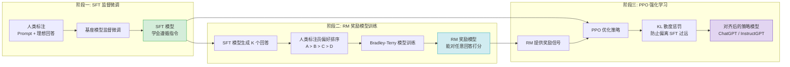

# 03 - 强化学习与 RLHF 对齐技术

> **学习目标**：系统掌握 RLHF（基于人类反馈的强化学习）三阶段流程，建立强化学习理论基础（MDP、价值函数、策略梯度），深入理解 SFT、Reward Model、PPO 的核心原理，对比 DPO、GRPO 等新兴对齐方法的优劣，并通过 TRL 库完成 DPO 微调实战，建立完整的 LLM 对齐技术认知体系。

> 📖 **参考链接**：
> - [HuggingFace TRL 文档](https://huggingface.co/docs/trl/index) -- Transformer Reinforcement Learning 库，SFT/RM/PPO/DPO 全流程训练框架
> - [HuggingFace Transformers 文档](https://huggingface.co/docs/transformers/index) -- 模型加载与训练基础接口
> - [HuggingFace TRL：PPO Trainer](https://huggingface.co/docs/trl/main/ppo_trainer) -- PPO 强化学习训练器的官方用法
> - [HuggingFace TRL：DPO Trainer](https://huggingface.co/docs/trl/main/dpo_trainer) -- DPO 直接偏好优化的官方用法
> - [InstructGPT 论文（arXiv）](https://arxiv.org/abs/2203.02155) -- RLHF 三阶段流程的标准化论文
> - [DPO 论文（arXiv）](https://arxiv.org/abs/2305.18290) -- Direct Preference Optimization 原论文

---

## 目录

1. [第一段：RLHF 总览与三阶段框架](#第一段rlhf-总览与三阶段框架)
2. [第二段：RL 基础理论](#第二段rl-基础理论)
3. [第三段：策略梯度方法](#第三段策略梯度方法)
4. [第四段：SFT 监督微调](#第四段sft-监督微调)
5. [第五段：Reward Model 与 Bradley-Terry 模型](#第五段reward-model-与-bradley-terry-模型)
6. [第六段：PPO 近端策略优化](#第六段ppo-近端策略优化)
7. [第七段：DPO 与新兴对齐技术](#第七段dpo-与新兴对齐技术)
8. [第八段：GRPO 算法](#第八段grpo-算法)
9. [第九段：DPO 微调实战](#第九段dpo-微调实战)
10. [学习导航栏](#学习导航栏)
11. [自检清单](#自检清单)

---

## 第一段：RLHF 总览与三阶段框架

### 1.1 为什么需要 RLHF

预训练语言模型的目标是预测下一个 token，而不是"遵循人类意图"。一个强大的预训练模型（如 GPT-3）虽然能生成流畅的文本，但存在以下问题：

| 问题 | 表现 | 根因 |
|------|------|------|
| **意图不对齐** | 生成的内容与用户期望不一致 | 预训练目标只是语言建模 |
| **有害输出** | 生成偏见、歧视、暴力内容 | 训练数据包含不良内容 |
| **幻觉严重** | 编造不存在的事实 | 模型追求流畅而非准确 |
| **指令遵循弱** | 不理解复杂指令格式 | 缺少指令理解训练 |

**RLHF 的核心目标**：将人类偏好注入模型训练过程，让模型输出"人类觉得好"的内容，而不仅仅是"概率高"的内容。

> **生活化类比：RLHF=家长纠正孩子说话方式** —— RLHF 就像家长纠正孩子说话的方式。孩子（预训练模型）刚学会说话时，能流利表达但常常"童言无忌"——不分场合、可能说脏话、可能撒谎（幻觉）、可能答非所问（意图不对齐）。家长不会重新教孩子从"啊哦呃"开始学说话（不重新预训练），而是通过三步引导：先示范"应该这样说"（SFT 监督微调），再告诉孩子"这样说好、那样说不好"并打分（RM 奖励模型），最后让孩子在家长的评分反馈下自己练习越说越好（PPO 强化学习）。经过一段时间，孩子就学会了"什么场合说什么话"（对齐人类偏好）。这就是 RLHF 的精髓——不推翻重来，而是在已有能力上"纠偏引导"。

### 1.2 RLHF 的起源与演进

RLHF 并非全新概念，其思想可追溯到 2017 年：

```
2017: Christiano et al. 提出从人类偏好中学习奖励函数
       ↓
2020: Stiennon et al. 将 RLHF 应用于文本摘要任务
       ↓
2022: OpenAI 发布 InstructGPT，首次大规模应用 RLHF 到 LLM
       ↓
2023: Anthropic 发布 Constitutional AI，RLHF 延伸为 RLAIF
       ↓
2023: Stanford 提出 DPO，绕过显式奖励模型直接优化偏好
       ↓
2024-2025: KTO、ORPO、SPIN 等新方法涌现
```

**里程碑论文**：

| 论文 | 年份 | 核心贡献 |
|------|------|---------|
| Deep Reinforcement Learning from Human Preferences | 2017 | 首次提出从人类偏好中学习奖励 |
| Learning to Summarize with Human Feedback | 2020 | 在文本摘要中应用 RLHF |
| Training Language Models to Follow Instructions (InstructGPT) | 2022 | RLHF 三阶段流程标准化 |
| Direct Preference Optimization (DPO) | 2023 | 绕过奖励模型的直接偏好优化 |
| Constitutional AI (Anthropic) | 2023 | 用 AI 反馈替代人类反馈 |

### 1.3 RLHF 三阶段全景

RLHF 训练流程分为三个紧密衔接的阶段：

```
┌─────────────────────────────────────────────────────────────────────┐
│                      RLHF 三阶段训练流程                              │
│                                                                     │
│  阶段一: SFT（监督微调）                                              │
│  ┌───────────────────────────────────────────────────────────────┐  │
│  │ 人类标注员编写高质量 Prompt + 理想回答                           │  │
│  │                      ↓                                         │  │
│  │ 在 GPT-3 基座模型上做监督微调                                    │  │
│  │                      ↓                                         │  │
│  │ 产出: SFT 模型（初步学会遵循指令）                                │  │
│  └───────────────────────────────────────────────────────────────┘  │
│                              ↓                                      │
│  阶段二: RM（奖励模型训练）                                           │
│  ┌───────────────────────────────────────────────────────────────┐  │
│  │ SFT 模型对每个 Prompt 生成 K 个不同回答（K=4~9）                  │  │
│  │                      ↓                                         │  │
│  │ 人类标注员对 K 个回答进行偏好排序（A > B > C > D）                │  │
│  │                      ↓                                         │  │
│  │ 用 Bradley-Terry 模型训练奖励模型 r(x, y)                         │  │
│  │                      ↓                                         │  │
│  │ 产出: RM 模型（能对任意 (prompt, response) 打分）                 │  │
│  └───────────────────────────────────────────────────────────────┘  │
│                              ↓                                      │
│  阶段三: PPO（近端策略优化）                                          │
│  ┌───────────────────────────────────────────────────────────────┐  │
│  │ RM 模型作为奖励信号，PPO 算法优化 SFT 策略                        │  │
│  │                      ↓                                         │  │
│  │ 加入 KL 散度惩罚，防止策略偏离原始 SFT 过远                       │  │
│  │                      ↓                                         │  │
│  │ 产出: 对齐后的策略模型（如 InstructGPT / ChatGPT）                │  │
│  └───────────────────────────────────────────────────────────────┘  │
└─────────────────────────────────────────────────────────────────────┘
```

**RLHF 三阶段流程 Mermaid 图**：



> 上图展示了 RLHF 的三阶段对齐流程：阶段一通过 SFT 监督微调让模型学会遵循指令；阶段二基于人类偏好排序训练奖励模型 RM，使其能够对任意回答打分；阶段三通过 PPO 强化学习以 RM 的奖励信号优化策略，并使用 KL 散度惩罚防止策略偏离 SFT 模型过远，最终得到与人类偏好对齐的策略模型。阶段一的 SFT 模型同时作为阶段三 PPO 的初始策略和 KL 散度的参考，是整个流程的基石。

### 1.4 三阶段的数据流与信息流

```
阶段一 SFT:
  输入: (prompt, human_demo) 对
  输出: π_sft  ← 学会模仿人类回答

阶段二 RM:
  输入: (prompt, [response_1, ..., response_K], human_ranking)
  输出: r_θ(x, y)  ← 学会预测人类偏好

阶段三 PPO:
  输入: 无标注 prompt（可来自用户或自动生成）
  奖励: r_θ(x, y) 来自 RM
  输出: π_rlhf  ← 在 RM 引导下进一步优化
```

**关键洞察**：三个阶段对数据的需求递减：
- SFT 需要高质量人工标注（最昂贵）
- RM 需要人类偏好排序（次昂贵，但比写完整回答容易）
- PPO 只需要 prompt（最便宜，可自动生成）

> **生活化类比：**
> - **RLHF 三阶段** → 教练训练运动员：**阶段一（SFT）** 相当于教练先给运动员示范标准动作，让运动员模仿——"这样投篮姿势最标准，照着学"。**阶段二（RM）** 相当于教练在一旁观察并打分，告诉运动员哪些动作好哪些不好——"这个动作 8 分，那个动作 6 分"。**阶段三（PPO）** 相当于运动员在教练的评分体系下自主练习，教练不断给出反馈，强化正确的动作、抑制错误的动作，最终让运动员形成肌肉记忆，在比赛中表现稳定。
> - **SFT 监督微调** → 教练示范标准动作，运动员照着反复练习：教练给出标准答案（标注数据），运动员照着模仿（有监督学习），通过大量重复练习学会基本动作模式。
> - **PPO 近端策略优化** → 保守的试错学习：就像学骑自行车，你不会一下子猛拐车头尝试 90 度大转弯（高风险），而是小幅度调整方向（clip 机制限制更新幅度），在安全范围内逐步摸索最佳平衡点。PPO 也是这个道理——每次只做小步更新，确保新策略不会偏离旧策略太远，避免"一次冒险就翻车"。
> - **DPO 直接偏好优化** → 选秀节目评委打分：不需要先训练一个复杂的评分系统（奖励模型），而是直接把两个选手的表演放在一起比较——"A 比 B 唱得好"，直接从这个偏好对中学习。就像《中国好声音》的评委，不需要给每个选手打具体分数，只需要说"我选 A"，模型就能从这些对比中学会什么是"更好的回答"。

---

## 第二段：RL 基础理论

在深入 RLHF 的具体技术之前，需要先建立强化学习的理论基础。RLHF 本质上是将 RL 应用于语言模型对齐，理解 RL 的核心概念对于掌握后续的 PPO、DPO、GRPO 等算法至关重要。

### 2.1 马尔可夫决策过程（MDP）

强化学习问题的数学建模框架是**马尔可夫决策过程（Markov Decision Process, MDP）**，它由五元组 $(S, A, P, R, \gamma)$ 定义：

| 符号 | 含义 | 在 RLHF 中的对应 |
|------|------|-----------------|
| $S$ | 状态空间（State Space） | 已生成的 token 序列（prompt + 已生成部分） |
| $A$ | 动作空间（Action Space） | 词表中的所有 token |
| $P(s'\|s,a)$ | 状态转移概率 | 由语言模型决定：生成 token $a$ 后状态变为 $s'$ |
| $R(s,a)$ | 奖励函数 | 奖励模型 $r_\theta(x, y)$ 的打分 |
| $\gamma$ | 折扣因子（Discount Factor） | 通常设为 1（无折扣）或接近 1 |

**马尔可夫性质**：当前状态包含了所有历史信息，未来只取决于当前状态和接下来的动作：

$$
P(s_{t+1} | s_t, a_t, s_{t-1}, a_{t-1}, ...) = P(s_{t+1} | s_t, a_t)
$$

**MDP 的交互过程**：

```
Agent (策略 π)          Environment (环境)
    │                          │
    │──── action a_t ─────────→│
    │                          │  状态转移: s_t → s_{t+1}
    │                          │  计算奖励: R(s_t, a_t)
    │←── state s_{t+1}, reward r_t ──│
    │                          │
    │──── action a_{t+1} ─────→│
    │                          │
    ...

在 RLHF 中:
  Agent = 语言模型 (π_θ)
  Environment = 语言生成环境
  Action = 下一个 token
  State = (prompt, 已生成的 token 序列)
  Reward = 生成完整回答后 RM 的打分
```

### 2.2 价值函数

价值函数是 RL 中评估"某个状态有多好"的核心工具。

**状态价值函数 $V^\pi(s)$**：在策略 $\pi$ 下，从状态 $s$ 出发，未来能获得的期望累积奖励：

$$
V^\pi(s) = \mathbb{E}_\pi \left[ \sum_{t=0}^{\infty} \gamma^t R(s_t, a_t) \bigg| s_0 = s \right]
$$

**动作价值函数 $Q^\pi(s, a)$**：在策略 $\pi$ 下，从状态 $s$ 执行动作 $a$ 后，未来能获得的期望累积奖励：

$$
Q^\pi(s, a) = \mathbb{E}_\pi \left[ \sum_{t=0}^{\infty} \gamma^t R(s_t, a_t) \bigg| s_0 = s, a_0 = a \right]
$$

**两者的关系**：

$$
V^\pi(s) = \sum_a \pi(a|s) \cdot Q^\pi(s, a)
$$

即状态价值是所有可能动作价值的期望（按策略 $\pi$ 加权）。

```
直观理解:
  V(s): "如果我在状态 s，按照策略 π 行动，平均能拿多少分？"
  Q(s,a): "如果我在状态 s，先做动作 a，之后按策略 π 行动，平均能拿多少分？"
  
  例: 下棋
    V(当前棋局): 按当前策略下，赢棋的概率
    Q(当前棋局, 某步棋): 走这步棋后，按当前策略下，赢棋的概率
```

### 2.3 贝尔曼方程

贝尔曼方程是 RL 的核心递推关系，将价值函数分解为**即时奖励 + 下一状态的价值**。

**状态价值的贝尔曼方程**：

$$
V^\pi(s) = \sum_a \pi(a|s) \sum_{s'} P(s'|s,a) \left[ R(s,a,s') + \gamma V^\pi(s') \right]
$$

**动作价值的贝尔曼方程**：

$$
Q^\pi(s, a) = \sum_{s'} P(s'|s,a) \left[ R(s,a,s') + \gamma \sum_{a'} \pi(a'|s') Q^\pi(s', a') \right]
$$

**贝尔曼方程的直观理解**：

```
V(s) = E[即时奖励 + γ × V(下一状态)]

即: 当前状态的价值 = 即时奖励 + 折扣后的下一状态价值

这构成了 RL 的递推基础:
  ┌──────────────────────────────────────────────┐
  │  V(s_t) = R_t + γ·V(s_{t+1})               │
  │                                              │
  │  展开: V(s_0) = R_0 + γR_1 + γ²R_2 + ...   │
  │  即: 当前价值 = 未来所有奖励的折扣和          │
  └──────────────────────────────────────────────┘
```

### 2.4 时序差分学习（TD Learning）

时序差分（Temporal-Difference, TD）是 RL 中最核心的学习方法之一，它利用**自举（bootstrapping）**思想：用估计值来更新估计值。

**TD(0) 更新规则**：

$$
V(s_t) \leftarrow V(s_t) + \alpha \left[ R_{t+1} + \gamma V(s_{t+1}) - V(s_t) \right]
$$

其中 $\alpha$ 是学习率，方括号内的项称为 **TD 误差（TD Error）**：

$$
\delta_t = R_{t+1} + \gamma V(s_{t+1}) - V(s_t)
$$

```
TD(0) 算法流程:
┌──────────────────────────────────────────────┐
│  初始化: V(s) 任意值，对所有 s               │
│  循环（每条轨迹）:                            │
│    初始化起始状态 s                           │
│    循环（每一步）:                            │
│      执行动作 a ~ π(·|s)                      │
│      观察奖励 r 和下一状态 s'                 │
│      计算 TD 误差: δ = r + γV(s') - V(s)     │
│      更新价值: V(s) ← V(s) + α·δ             │
│      s ← s'                                   │
│    直到终止                                   │
└──────────────────────────────────────────────┘

关键: TD 不需要等轨迹结束就能更新（online learning）
      利用 V(s') 的估计值来更新 V(s)（bootstrapping）
```

### 2.5 蒙特卡洛 vs 时序差分

蒙特卡洛（Monte Carlo, MC）和 TD 是两种不同的价值估计方法，它们各有优劣。

| 维度 | 蒙特卡洛（MC） | 时序差分（TD） |
|------|---------------|---------------|
| 更新时机 | 轨迹结束后 | 每一步之后 |
| 更新方式 | 用实际回报 $G_t$ 更新 | 用 $R + \gamma V(s')$ 估计更新 |
| 偏差 | 无偏估计 | 有偏（依赖 V(s') 的估计） |
| 方差 | 高（受整条轨迹影响） | 低（只受一步影响） |
| 收敛速度 | 慢 | 快 |
| 连续任务 | 不适用（需要终止状态） | 适用 |

```
MC 更新: V(s_t) ← V(s_t) + α [G_t - V(s_t)]
  其中 G_t = R_{t+1} + γR_{t+2} + γ²R_{t+3} + ...（实际回报）

TD(0) 更新: V(s_t) ← V(s_t) + α [R_{t+1} + γV(s_{t+1}) - V(s_t)]
  其中 R + γV(s') 是一步预测回报

对比:
  MC: 等整条轨迹结束后，用"真实"的累积奖励更新
      → 无偏，但方差大（整条轨迹的随机性都累计进来）
      
  TD: 每走一步就更新，用"预测"的未来价值更新
      → 有偏（V(s') 本身也是估计），但方差小
      → 能利用不完整轨迹，适合在线学习
```

**在 RLHF 中的关联**：

PPO 等 RLHF 算法使用的是 TD 的变体（如 GAE，Generalized Advantage Estimation），它在 MC 和 TD 之间取平衡：用多步预测来减少偏差，同时控制方差。

---

## 第三段：策略梯度方法

策略梯度方法是 RLHF 中 PPO 算法的直接理论基础。与基于价值函数的方法不同，策略梯度直接对策略本身进行参数化并优化。

### 3.1 策略梯度定理

**策略参数化**：将策略表示为参数为 $\theta$ 的函数 $\pi_\theta(a|s)$，对于 LLM 而言，策略就是语言模型本身，$\pi_\theta(a|s)$ 表示在给定已生成文本 $s$ 的情况下，生成下一个 token $a$ 的概率。

**目标函数**：最大化期望累积奖励：

$$
J(\theta) = \mathbb{E}_{\tau \sim \pi_\theta} \left[ \sum_{t=0}^{T} \gamma^t R(s_t, a_t) \right]
$$

其中 $\tau = (s_0, a_0, r_0, s_1, a_1, r_1, ...)$ 是一条轨迹。

**策略梯度定理**：目标函数的梯度可以表示为：

$$
\nabla_\theta J(\theta) = \mathbb{E}_{\tau \sim \pi_\theta} \left[ \sum_{t=0}^{T} \nabla_\theta \log \pi_\theta(a_t|s_t) \cdot G_t \right]
$$

其中 $G_t = \sum_{t'=t}^{T} \gamma^{t'-t} R_{t'}$ 是从时刻 $t$ 开始的累积回报。

**推导过程**：

```
Step 1: 轨迹概率
  一条轨迹 τ = (s_0, a_0, ..., s_T, a_T) 的概率:
  P(τ; θ) = P(s_0) ∏_{t=0}^{T} π_θ(a_t|s_t) · P(s_{t+1}|s_t, a_t)

Step 2: 取对数
  log P(τ; θ) = log P(s_0) + Σ log π_θ(a_t|s_t) + Σ log P(s_{t+1}|s_t, a_t)
                           ↑ 只有这项依赖于 θ          ↑ 环境转移不依赖 θ

Step 3: 对 θ 求梯度
  ∇_θ log P(τ; θ) = Σ ∇_θ log π_θ(a_t|s_t)
                   ↑ 环境项和初始状态项的梯度为零

Step 4: 利用 log-梯度技巧
  ∇_θ J(θ) = ∇_θ E_τ[P(τ;θ)·R(τ)]
            = E_τ[R(τ)·∇_θ log P(τ;θ)]
            = E_τ[Σ_t ∇_θ log π_θ(a_t|s_t) · G_t]
```

**策略梯度定理的直观理解**：

```
∇_θ J(θ) = E[∇_θ log π_θ(a|s) × G]

含义:
  ∇_θ log π_θ(a|s): 增加 a 出现概率的方向
  G: 这一步动作的回报

  如果 G > 0（好动作）: 沿 ∇log π 的方向更新 → 增加该动作概率
  如果 G < 0（坏动作）: 沿 -∇log π 的方向更新 → 减少该动作概率

  本质: "强化"好的动作，"抑制"坏的动作
```

### 3.2 REINFORCE 算法

REINFORCE 是最基础的策略梯度算法，直接使用策略梯度定理进行更新。

```
REINFORCE 算法:
┌──────────────────────────────────────────────────┐
│  1. 用当前策略 π_θ 采样一条完整轨迹 τ             │
│     τ = (s_0, a_0, r_0, s_1, a_1, r_1, ..., s_T) │
│                                                  │
│  2. 计算每一步的累积回报 G_t                       │
│     G_t = Σ_{t'=t}^{T} γ^{t'-t} · r_{t'}        │
│                                                  │
│  3. 计算策略梯度并更新参数                          │
│     θ ← θ + α · Σ_t ∇_θ log π_θ(a_t|s_t) · G_t  │
└──────────────────────────────────────────────────┘
```

**引入基线（Baseline）**：

直接使用 $G_t$ 会导致梯度方差极大。引入基线 $b(s_t)$ 可以在不改变梯度期望的情况下降低方差：

$$
\nabla_\theta J(\theta) = \mathbb{E} \left[ \sum_t \nabla_\theta \log \pi_\theta(a_t|s_t) \cdot (G_t - b(s_t)) \right]
$$

**为什么基线不改变期望**：

$$
\mathbb{E} \left[ \nabla_\theta \log \pi_\theta(a_t|s_t) \cdot b(s_t) \right] = b(s_t) \sum_a \nabla_\theta \pi_\theta(a|s_t) = b(s_t) \nabla_\theta \sum_a \pi_\theta(a|s_t) = b(s_t) \nabla_\theta 1 = 0
$$

因为 $\sum_a \pi_\theta(a|s_t) = 1$（概率和为 1），其梯度为 0。

**带基线的 REINFORCE**：

```
REINFORCE with Baseline:
  θ ← θ + α · Σ_t ∇_θ log π_θ(a_t|s_t) · (G_t - b(s_t))

  最常用的基线: b(s_t) = V(s_t)  ← 状态价值函数
  此时 G_t - V(s_t) 就是优势函数 A(s_t, a_t)

  效果: 方差大幅降低，训练更稳定
  代价: 需要额外训练一个 V(s) 的估计网络
```

### 3.3 Actor-Critic 架构

**Actor-Critic** 是策略梯度方法的核心架构，它结合了策略方法和价值方法：

```
Actor-Critic 架构:
┌──────────────────────────────────────────────────────────┐
│                                                          │
│   Actor (策略网络 π_θ)          Critic (价值网络 V_φ)    │
│   ┌─────────────────┐          ┌─────────────────┐      │
│   │  输入: 状态 s    │          │  输入: 状态 s    │      │
│   │  输出: 动作分布  │          │  输出: V(s) 估值 │      │
│   │  π_θ(a|s)       │          │  V_φ(s)         │      │
│   └────────┬────────┘          └────────┬────────┘      │
│            │                            │                │
│            │    ┌─────────────────┐     │                │
│            │    │   TD 误差 δ     │←────┘                │
│            │    │  δ = r + γV(s') │                     │
│            │    │      - V(s)     │                     │
│            │    └───────┬─────────┘                     │
│            │            │                                 │
│            ▼            ▼                                 │
│   更新 Actor:        更新 Critic:                        │
│   θ ← θ + α·δ·∇logπ  φ ← φ + β·δ·∇V                    │
│   (沿 TD 误差方向     (减小价值估计                      │
│    更新策略)           的误差)                            │
│                                                          │
└──────────────────────────────────────────────────────────┘
```

**优势函数（Advantage Function）**：

$$
A^\pi(s, a) = Q^\pi(s, a) - V^\pi(s)
$$

优势函数衡量动作 $a$ 相对于平均水平的好坏：$A > 0$ 表示该动作优于平均，应增加其概率；$A < 0$ 表示该动作劣于平均，应减少其概率。

**Actor-Critic 的更新规则**：

```
Actor 更新: θ ← θ + α_actor · A(s,a) · ∇_θ log π_θ(a|s)
Critic 更新: φ ← φ + α_critic · δ · ∇_φ V_φ(s)

其中:
  δ = r + γV_φ(s') - V_φ(s)     ← TD 误差
  A(s,a) = δ                     ← 用 TD 误差近似优势函数

Actor 的目标: 最大化优势（选择比平均更好的动作）
Critic 的目标: 最小化 TD 误差（准确估计状态价值）
```

### 3.4 A2C 与 A3C：同步与异步

**A2C（Advantage Actor-Critic）** 和 **A3C（Asynchronous Advantage Actor-Critic）** 是 Actor-Critic 的两种并行实现方式。

```
A3C (异步):
┌─────────────────────────────────────────────────────┐
│  全局共享参数 (θ_global, φ_global)                   │
│                                                     │
│  Worker 1  ←→ Environment 1    (独立采样和更新)      │
│  Worker 2  ←→ Environment 2    (独立采样和更新)      │
│  Worker 3  ←→ Environment 3    (独立采样和更新)      │
│  ...                                                │
│  Worker N  ←→ Environment N    (独立采样和更新)      │
│                                                     │
│  每个 Worker 异步地从全局参数读取，                    │
│  计算梯度后异步写回全局参数                            │
│  → 不需要锁，无需等待其他 Worker                      │
│  → 探索更充分（不同 Worker 有不同策略）               │
└─────────────────────────────────────────────────────┘

A2C (同步):
┌─────────────────────────────────────────────────────┐
│  全局共享参数 (θ_global, φ_global)                   │
│                                                     │
│  Worker 1  ←→ Environment 1    ┐                     │
│  Worker 2  ←→ Environment 2    │ 同时采样            │
│  Worker 3  ←→ Environment 3    │                    │
│  ...                          │ 汇总梯度             │
│  Worker N  ←→ Environment N    ┘                     │
│                                                     │
│  所有 Worker 同步采样，汇总梯度后统一更新               │
│  → 需要 GPU 同步                                    │
│  → GPU 利用率更高（批量计算）                         │
│  → 训练更稳定                                        │
└─────────────────────────────────────────────────────┘
```

**A2C vs A3C 对比**：

| 维度 | A2C（同步） | A3C（异步） |
|------|-----------|-----------|
| 计算方式 | 批量同步计算 | 各 Worker 独立异步 |
| GPU 利用率 | 高（批量运算） | 低（频繁小更新） |
| 训练稳定性 | 高 | 中（梯度可能过期） |
| 实现复杂度 | 低 | 高（需要异步管理） |
| 探索能力 | 中 | 高（策略多样性） |
| 现代趋势 | 更常用 | 逐渐被 A2C 取代 |

**与 RLHF 的关系**：

RLHF 中的 PPO 算法本质上是一种改进的 Actor-Critic 方法，其中：
- Actor = 语言模型 $\pi_\theta$
- Critic = 价值网络 $V_\phi$
- 使用 PPO-Clip 机制限制策略更新幅度
- 加入 KL 散度惩罚保持与 SFT 模型的距离

---

## 第四段：SFT 监督微调

### 4.1 SFT 在 RLHF 中的角色

SFT（Supervised Fine-Tuning）是 RLHF 的**基石**。在 RLHF 流程中，SFT 的作用是：

1. **将基座模型转化为"指令遵循"模型**：GPT-3 只会续写文本，SFT 后它学会"理解问题并回答"
2. **为后续阶段提供稳定的起点**：RM 需要 SFT 模型生成候选回答，PPO 需要 SFT 模型作为初始化策略
3. **降低 RL 探索空间**：SFT 先让模型进入"合理回答"的区域，RL 再在该区域内精细优化

**为什么不能跳过 SFT 直接做 RL？**

```
跳过 SFT 直接做 RL 的问题:
  - 基座模型输出空间巨大，RL 探索效率极低
  - 基座模型可能连"回答问题"这个基本模式都不会
  - RM 对基座模型的随机输出打分毫无意义
  - 训练不稳定，容易坍塌

SFT 先做的好处:
  - 缩小输出空间到"合理回答"范围
  - 让模型学会基本的指令遵循格式
  - RM 打分更有意义（区分好回答 vs 更好回答，而非随机文本 vs 回答）
  - PPO 训练更稳定
```

### 4.2 高质量指令数据构建

SFT 的核心瓶颈在于数据质量。InstructGPT 使用了约 13K 条高质量人工标注数据。

**数据格式**：

```
每条数据包含三个部分:
  - instruction: 指令描述（做什么）
  - input: 可选输入（处理的素材）
  - output: 期望输出（人类标注的理想回答）

示例:
{
  "instruction": "将以下句子翻译成英文",
  "input": "人工智能正在深刻改变人类社会",
  "output": "Artificial intelligence is profoundly transforming human society."
}

{
  "instruction": "解释黑洞是如何形成的",
  "input": "",
  "output": "黑洞是恒星演化末期的产物。当一颗大质量恒星（超过太阳质量的20倍以上）..."
}
```

**高质量指令数据的构建原则**：

| 维度 | 说明 | 实践建议 |
|------|------|---------|
| **多样性** | 覆盖多类任务和场景 | 分类、生成、推理、摘要、翻译、代码、对话等 |
| **真实性** | 模拟真实用户的使用方式 | 使用真实用户 query 而非人工编造 |
| **难度梯度** | 包含简单到复杂的指令 | 简单任务（分类）→ 中等任务（改写）→ 复杂任务（多步推理） |
| **一致性** | 同一类指令的回答风格一致 | 统一格式、语气、详细程度 |
| **无害性** | 拒绝有害请求，生成安全内容 | 标注拒绝回答的模板和边界 |

**InstructGPT 的数据分布**：

```
数据来源分布:
├── 普通用户提交到 OpenAI API 的 Prompt: ~60%
│   （真实用户场景，最具代表性）
├── 标注员编写的 Prompt: ~30%
│   （覆盖长尾和边缘场景）
└── 少量特定任务数据: ~10%
    （确保覆盖特定能力维度）
```

### 4.3 Self-Instruct：自动生成指令数据

人工标注 13K 条数据成本极高（OpenAI 雇佣了约 40 名标注员）。**Self-Instruct** 是一种通过模型自动生成指令数据的方法，大幅降低数据成本。

**Self-Instruct 流程**：

```
┌─────────────────────────────────────────────────────────────┐
│                 Self-Instruct 数据生成流程                    │
│                                                             │
│  1. 种子任务池初始化                                          │
│     人工编写 175 个种子任务（每个任务包含 instruction +       │
│     input + output）                                         │
│                          ↓                                   │
│  2. 指令生成                                                 │
│     从种子池随机抽取 8 个任务作为 few-shot 示例               │
│     让模型生成新的 instruction（可能带 input）                │
│                          ↓                                   │
│  3. 分类判断                                                 │
│     判断新任务是否属于已有任务类别                            │
│     如果是新类别 → 添加到任务池，否则丢弃                    │
│                          ↓                                   │
│  4. 实例生成                                                 │
│     对每条 instruction，让模型生成 output                     │
│     可选: 先生成 input 再生成 output（input-first 模式）      │
│                          ↓                                   │
│  5. 质量过滤                                                 │
│     过滤低质量样本（过短/过长/重复/ROUGE-L 过低）            │
│     过滤与已有样本高度相似的样本                              │
│                          ↓                                   │
│  6. 重复 2-5 直到收集足够数据                                 │
│     最终产出: 52K 条指令 + 82K 条实例                        │
└─────────────────────────────────────────────────────────────┘
```

**Self-Instruct 的质量控制**：

```python
# 伪代码: Self-Instruct 过滤规则
def filter_instance(instruction, input_text, output):
    # 1. 长度过滤
    if len(output) < 10 or len(output) > 2000:
        return False
    
    # 2. 关键词过滤（排除含特定词汇的样本）
    blacklist = ["图片", "视频", "音频", "文件"]
    if any(w in instruction for w in blacklist):
        return False
    
    # 3. 与已有样本的 ROUGE-L 相似度
    max_similarity = max(rouge_l(output, existing) for existing in outputs)
    if max_similarity > 0.7:
        return False
    
    # 4. 格式检查
    if output.startswith("I'm sorry") or output.startswith("抱歉"):
        # 拒绝类回答，通常质量不高
        return False
    
    return True
```

**Self-Instruct 的效果**：

| 指标 | 人工标注数据 | Self-Instruct 数据 |
|------|-------------|-------------------|
| 数据量 | 13K（InstructGPT） | 52K 指令 + 82K 实例 |
| 成本 | 极高（~$20/条） | 极低（仅 API 调用费） |
| 多样性 | 受限于标注员 | 覆盖更广的任务类型 |
| 质量 | 高但可能不一致 | 中等但有噪声 |
| 扩展性 | 差 | 好 |

**进阶方法**：Evol-Instruct（WizardLM 提出）通过让模型"进化"简单指令为复杂指令，进一步提升了数据难度和多样性。

### 4.4 SFT 训练细节

**训练目标**：标准语言模型损失

$$
\mathcal{L}_{SFT} = -\mathbb{E}_{(x, y) \sim D_{SFT}} \left[ \sum_{t=1}^{T} \log \pi_\theta(y_t | x, y_{<t}) \right]
$$

其中 $x$ 是 prompt，$y$ 是目标回答，$\pi_\theta$ 是策略模型。

**训练配置**：
- 学习率：通常 1e-5 到 5e-5
- Epochs：通常 1-3 个 epoch（避免过拟合，SFT 数据量小）
- Batch size：根据显存调整
- 通常冻结 embedding 层

**SFT 的局限性**：

```
SFT 只能让模型"模仿"人类回答，但无法教会模型:
  - 哪个回答比另一个更好（缺乏比较信号）
  - 如何平衡多个维度的质量（准确性、有用性、无害性、简洁性...）
  - 在不确定的情况下应该怎么做（拒绝回答 vs 猜测）

这就是为什么需要后续的 RM 和 PPO 阶段。
```

---

## 第五段：Reward Model 与 Bradley-Terry 模型

### 5.1 奖励模型的核心任务

奖励模型（Reward Model，RM）是 RLHF 流程中的"裁判"，它的核心任务是：**给定 prompt x 和 response y，输出一个标量奖励 r(x, y)，表示这个回答有多好。**

```
RM 训练目标:
  输入: (prompt, response_a, response_b, human_preference: a > b)
  输出: r(x, a) > r(x, b)  ← 即 RM 的打分排序与人类偏好一致
```

> **生活化类比：奖励模型=评分老师** —— 奖励模型就像一位阅卷老师。学生（SFT 模型）对同一道题（prompt）交了多份不同答卷（K 个回答），老师不需要逐字批改，只需要把答卷排个名次（人类偏好排序 A>B>C>D）。然后老师自己"悟"出一套评分标准（训练 RM 模型）：什么样的回答得高分、什么样的得低分。学成之后，老师就能对任何新答卷自动打分（r(x,y)），不再需要人类每次都来排序。这位"老师"的厉害之处在于——它学的是人类的"品味"而非标准答案，所以能评判开放式问题。PPO 阶段，这位老师就站在学生旁边，每写一句就打一次分，引导学生越写越好。

### 5.2 偏好数据收集

**数据收集流程**：

```
对于每个 prompt x:
  1. SFT 模型生成 K 个不同回答（K 通常为 4~9）
     通过调整 temperature 和采样策略实现多样性
  
  2. 人类标注员对 K 个回答进行排序
     从最好到最差: y_1 > y_2 > ... > y_K
  
  3. 从排序中提取两两比较对
     例如 K=4 时，产生 C(4,2) = 6 个比较对:
     (y_1 > y_2), (y_1 > y_3), (y_1 > y_4),
     (y_2 > y_3), (y_2 > y_4), (y_3 > y_4)
```

**为什么用排序而不是直接打分？**

| 方式 | 优点 | 缺点 |
|------|------|------|
| 直接打分（1-5分） | 信息量大 | 标注员之间标准不一致，难以校准 |
| 排序 | 标注一致性好，更可靠 | 信息量相对较少 |

**InstructGPT 的偏好数据规模**：约 33K 条 prompt，每个 prompt 产生 K=4~9 个回答，得到约 33K 个排序数据，从中提取出大量比较对。

**标注员一致性**：多个标注员对同一组回答排序，计算一致性分数（如 Kendall's tau），确保标注质量。

### 5.3 Bradley-Terry 偏好模型

Bradley-Terry 模型是 RLHF 中建模人类偏好的标准框架。

**模型假设**：每个回答 y 有一个潜在"质量分" r(y)，人类偏好 y_a 胜过 y_b 的概率为：

$$
P(y_a \succ y_b | x) = \frac{\exp(r(x, y_a))}{\exp(r(x, y_a)) + \exp(r(x, y_b))} = \sigma(r(x, y_a) - r(x, y_b))
$$

其中 $\sigma$ 是 sigmoid 函数，$r(x, y)$ 是奖励模型对回答 y 的打分。

**直觉理解**：如果 $r(x, y_a)$ 远大于 $r(x, y_b)$，那么 $y_a$ 被偏好的概率接近 1；如果两者相近，概率接近 0.5（随机选择）。

**奖励模型的损失函数**：

$$
\mathcal{L}_{RM} = -\mathbb{E}_{(x, y_w, y_l) \sim D} \left[ \log \sigma(r_\theta(x, y_w) - r_\theta(x, y_l)) \right]
$$

其中 $y_w$ 是人类偏好的"胜出"回答（winner），$y_l$ 是"失败"回答（loser）。

**损失函数推导**：

```
给定偏好数据 (x, y_w, y_l)，其中 y_w > y_l:

我们希望最大化: P(y_w > y_l | x) = σ(r(x, y_w) - r(x, y_l))

取负对数似然:
  L = -log σ(r(x, y_w) - r(x, y_l))

当 r(x, y_w) >> r(x, y_l) 时，σ → 1, L → 0 （完美预测，损失小）
当 r(x, y_w) << r(x, y_l) 时，σ → 0, L → +∞ （预测错误，损失大）
当 r(x, y_w) ≈ r(x, y_l) 时，σ → 0.5, L → log 2 ≈ 0.693 （不区分，损失中等）
```

### 5.4 奖励模型架构

**InstructGPT 的 RM 架构**：

```
基座模型: SFT 模型（GPT-3 175B 的 SFT 版本）
修改: 去掉最后的 unembedding 层，接一个线性层输出标量
参数量: 175B（但实际用 6B 就足够）

模型结构:
  Input: (prompt, response) → [SEP] token 分隔
  Transformer Decoder: 处理整个序列
  Pooling: 取最后一个 token 的隐藏状态
  Linear Head: h → 1（标量奖励值）
```

**为什么 RM 可以用较小的模型？**

| 模型大小 | 奖励模型准确率 | 说明 |
|---------|--------------|------|
| 6B | 与 175B 接近 | 打分任务比生成任务简单 |
| 175B | 略高但训练不稳定 | 大模型训练 RM 容易过拟合 |

**RM 训练的注意事项**：

1. **过拟合风险**：偏好数据量有限（~33K 条 prompt），大 RM 容易过拟合
2. **奖励分布校准**：RM 的打分需要归一化，使不同 prompt 的奖励可比
3. **验证策略**：用验证集上的排序准确率评估 RM 质量

### 5.5 奖励攻击与 RM 的局限性

**奖励攻击（Reward Hacking）**：PPO 阶段可能找到 RM 的漏洞，生成 RM 打分高但实际质量差的回答。

```
奖励攻击示例:
  - RM 偏好长回答 → PPO 生成冗长但空洞的回答
  - RM 偏好礼貌用语 → PPO 过度使用"请""谢谢"等词汇
  - RM 偏好确定语气 → PPO 在不确定时也给出非常确定的回答

对策:
  - 在 RM 训练中加入长度惩罚
  - 在 PPO 阶段加入 KL 散度惩罚（防止偏离 SFT 太远）
  - 使用集成 RM（多个 RM 取平均，降低被攻击风险）
```

---

## 第六段：PPO 近端策略优化

### 6.1 PPO 在 RLHF 中的角色

PPO（Proximal Policy Optimization）是 RLHF 第三阶段的核心算法，它使用 RM 提供的奖励信号来优化策略模型（即 SFT 模型），使其生成更符合人类偏好的回答。

**PPO 的核心思想**：在最大化奖励的同时，**限制策略更新的幅度**，防止模型"一步到位"偏离太远导致训练崩溃。

> **生活化类比：PPO=试错学习** —— PPO 就像在教练监督下的"试错学习"。运动员（策略模型）不断尝试各种动作（生成回答），教练（奖励模型）对每个动作打分（奖励信号）。但 PPO 的精妙之处在于"保守"——它不会因为一次高分就彻底改变动作风格（clip 机制限制更新步长），而是小步快跑地调整，确保每次改变都在可控范围内。就像学游泳，你不会第一次就尝试蝶泳（太激进容易呛水），而是先在浅水区微调姿势，每次只改一个小细节，稳定了再继续。这种"信任域"策略让训练既有效率又不会崩溃——既鼓励探索新策略（试错），又防止偏离太远翻车（clip 保护）。相比之下，早期的策略梯度方法像"蒙头猛冲"，容易一步走错全盘皆输；PPO 则是"小心翼翼地试错"。

### 6.2 Actor-Critic 架构

RLHF 中的 PPO 采用 Actor-Critic 架构：

```
Actor（策略网络 π_θ）:
  - 初始化为 SFT 模型
  - 负责生成回答（动作）
  - 目标: 最大化累积奖励

Critic（价值网络 V_φ）:
  - 初始化为 RM 模型（或从头训练）
  - 负责估计状态价值
  - 目标: 准确预测未来奖励

Actor 和 Critic 交替更新:
  Actor 使用 Critic 的估计来优化策略
  Critic 使用 Actor 产生的轨迹来改进价值估计
```

**Actor-Critic 的交互流程**：

```
对于每个 prompt x:
  1. Actor 生成回答 y ~ π_θ(·|x)
  2. RM 对回答打分: r = r_ψ(x, y)
  3. Critic 估计状态价值: V(x) 
  4. 计算优势函数: A(x, y) = r(x, y) - V(x)
     （优势 = 实际奖励 - 预期奖励，表示"这个回答比平均水平好多少"）
  5. 更新 Actor: 增加产生高优势回答的概率
  6. 更新 Critic: 减小价值估计误差
```

### 6.3 PPO 的核心机制：Clip 与 KL 惩罚

**1. PPO-Clip（裁剪目标）**

PPO 的核心是限制策略更新幅度，防止策略变化过大：

$$
\mathcal{L}^{CLIP}(\theta) = \mathbb{E}_t \left[ \min\left( \rho_t(\theta) A_t, \ \text{clip}(\rho_t(\theta), 1-\epsilon, 1+\epsilon) A_t \right) \right]
$$

其中 $\rho_t(\theta) = \frac{\pi_\theta(a_t|s_t)}{\pi_{\theta_{old}}(a_t|s_t)}$ 是新旧策略的概率比，$A_t$ 是优势函数，$\epsilon$ 是裁剪范围（通常 0.2）。

**Clip 机制的作用**：

```
当 A_t > 0（好动作，应增加概率）:
  如果 ρ > 1+ε → 裁剪到 1+ε，防止概率增加过多
  如果 ρ < 1+ε → 不裁剪，正常增加

当 A_t < 0（坏动作，应减少概率）:
  如果 ρ < 1-ε → 裁剪到 1-ε，防止概率减少过多
  如果 ρ > 1-ε → 不裁剪，正常减少

效果: 策略更新被限制在 (1-ε, 1+ε) 范围内，保证训练稳定
```

**2. KL 散度惩罚（InstructGPT 的核心创新）**

除了 PPO 的 Clip 机制，RLHF 还额外加入 KL 散度惩罚，防止策略偏离初始 SFT 模型太远：

$$
R_{total}(x, y) = r_{RM}(x, y) - \beta \cdot D_{KL}(\pi_\theta(\cdot|x) \ || \ \pi_{SFT}(\cdot|x))
$$

其中 $\beta$ 是 KL 惩罚系数，控制惩罚强度。

**KL 惩罚的作用**：

| 效果 | 说明 |
|------|------|
| **防止奖励攻击** | 即使 RM 有漏洞，KL 惩罚防止模型过度利用 |
| **保持语言能力** | 防止模型在追求高奖励时丧失语言流畅性 |
| **防止灾难性遗忘** | 保持 SFT 阶段学到的知识和能力 |
| **稳定训练** | 减小策略更新步长，防止训练崩溃 |

**KL 散度的自适应调整**：

```
InstructGPT 使用自适应 KL 系数:

设定目标 KL 值 (target KL)
如果实际 KL > target KL × 1.5:
  增大 β（加强惩罚，减小偏离）
如果实际 KL < target KL / 1.5:
  减小 β（放松惩罚，允许更大偏离）

这样可以在"保持能力"和"对齐偏好"之间取得动态平衡
```

### 6.4 PPO-ptx：混合训练目标

InstructGPT 还引入了 **PPO-ptx**（Pretraining Mix），在 PPO 目标中混合预训练损失：

$$
\mathcal{L}_{PPO-ptx} = \mathcal{L}_{PPO} + \gamma \cdot \mathcal{L}_{PTX}
$$

其中 $\mathcal{L}_{PTX}$ 是标准语言模型损失（在预训练数据上），$\gamma$ 是混合系数。

**PPO-ptx 的意义**：

```
问题: 纯 PPO 训练可能降低模型在预训练任务上的能力
       （又称"对齐税" Alignment Tax）

解决: 在 PPO 优化时，同时在预训练数据上计算语言模型损失
      这样模型既在对齐（遵循人类偏好），又保持通用能力

效果:
  - 减少对齐税: 在公共 NLP 基准上的性能下降减少了约 50%
  - 不影响对齐效果: 人类偏好评估上性能几乎不变
  - 被后续工作广泛采用（如 GPT-4、Claude 的训练）
```

### 6.5 PPO 训练的完整目标函数

综合以上所有组件，InstructGPT 的 PPO 训练目标为：

$$
\mathcal{L}_{total} = \mathbb{E}_{(x,y)\sim D_{\pi_\theta}} \left[ r_{RM}(x, y) - \beta \cdot D_{KL}(\pi_\theta \ || \ \pi_{SFT}) \right] + \gamma \cdot \mathbb{E}_{x \sim D_{pretrain}} \left[ \log \pi_\theta(x) \right]
$$

**三部分解读**：

| 组件 | 公式 | 作用 |
|------|------|------|
| RM 奖励 | $r_{RM}(x, y)$ | 鼓励生成人类偏好的回答 |
| KL 惩罚 | $-\beta \cdot D_{KL}$ | 防止偏离 SFT 太远，保持能力 |
| 预训练混合 | $\gamma \cdot \mathcal{L}_{PTX}$ | 减少对齐税，保持通用能力 |

### 6.6 PPO 训练的工程挑战

```python
# PPO 训练的伪代码（简化版）
def ppo_training_step(prompts, sft_model, rm_model, critic_model):
    # 1. 采样阶段
    responses = []
    rewards = []
    for prompt in prompts:
        # Actor 生成回答
        response = actor.generate(prompt)
        responses.append(response)
        
        # RM 打分
        reward = rm_model(prompt, response)
        rewards.append(reward)
    
    # 2. 计算 KL 惩罚
    with torch.no_grad():
        log_probs_sft = sft_model.log_prob(prompts, responses)
        log_probs_actor = actor.log_prob(prompts, responses)
    
    kl_penalty = (log_probs_actor - log_probs_sft).mean()
    
    # 3. Critic 估计价值
    values = critic_model(prompts, responses)
    advantages = rewards - values  # 简化的优势计算
    
    # 4. 计算 PPO 损失
    log_probs_new = actor.log_prob(prompts, responses)
    ratio = torch.exp(log_probs_new - log_probs_actor)
    
    # PPO-Clip
    clip_ratio = torch.clamp(ratio, 1 - epsilon, 1 + epsilon)
    ppo_loss = -torch.min(ratio * advantages, clip_ratio * advantages).mean()
    
    # KL 惩罚
    total_actor_loss = ppo_loss + beta * kl_penalty
    
    # 5. 更新 Critic
    critic_loss = F.mse_loss(values, rewards)
    
    # 6. 如果有预训练混合
    if use_ptx:
        ptx_loss = -sft_model.log_prob(pretrain_batch).mean()
        total_actor_loss += gamma * ptx_loss
    
    return total_actor_loss, critic_loss
```

**PPO 训练的四大挑战**：

| 挑战 | 说明 | 解决策略 |
|------|------|---------|
| **显存占用** | 同时加载 Actor、Critic、RM、SFT 四个模型 | 使用 LoRA 微调，量化模型 |
| **训练不稳定** | 奖励信号噪声大，策略更新容易震荡 | 小学习率、大 batch size、KL 惩罚 |
| **奖励攻击** | 模型学会利用 RM 漏洞获取高分 | 多 RM 集成、KL 惩罚、长度归一化 |
| **对齐税** | RL 训练后通用能力下降 | PPO-ptx 混合预训练目标 |

---

## 第七段：DPO 与新兴对齐技术

### 7.1 DPO 的核心动机：绕过 Reward Model

PPO 流程存在一个根本性问题：**需要训练一个单独的奖励模型，而这个 RM 又作为 PPO 的奖励信号**。这个间接路径带来了诸多问题：

```
PPO 流程的问题:
  ┌───────┐     ┌───────┐     ┌──────────────────┐
  │ 偏好  │ ──→ │  RM   │ ──→ │  PPO 优化策略     │
  │ 数据  │     │ 训练  │     │（间接使用偏好）    │
  └───────┘     └───────┘     └──────────────────┘
  
  问题:
  1. 需要训练和维护一个额外的 RM 模型
  2. RM 是偏好的"有损压缩"，可能丢失信息
  3. PPO 训练复杂，需要 Actor-Critic 架构
  4. 训练不稳定，超参数敏感
```

**DPO（Direct Preference Optimization）** 由 Stanford 在 2023 年提出，核心思想是：**直接从偏好数据中优化策略，绕过显式的奖励模型和强化学习**。

```
DPO 流程:
  ┌───────┐     ┌──────────────────┐
  │ 偏好  │ ──→ │  直接优化策略     │
  │ 数据  │     │（直接使用偏好）    │
  └───────┘     └──────────────────┘
  
  优势:
  1. 不需要训练 RM
  2. 不需要强化学习（PPO）
  3. 训练简单稳定，类似 SFT
  4. 直接使用偏好数据，信息无损
```

### 7.2 DPO 损失函数推导

DPO 的核心推导基于 Bradley-Terry 模型和 RL 最优策略的闭式解。

**推导步骤**：

**Step 1: RL 最优策略的闭式解**

在 KL 约束下的 RL 问题：
$$
\max_\pi \mathbb{E}_{y \sim \pi(\cdot|x)} [r(x, y)] - \beta \cdot D_{KL}(\pi \ || \ \pi_{ref})
$$

其最优解有闭式形式：
$$
\pi^*(y|x) = \frac{1}{Z(x)} \pi_{ref}(y|x) \exp\left(\frac{1}{\beta} r(x, y)\right)
$$

其中 $Z(x)$ 是配分函数（归一化常数）。

**Step 2: 从闭式解中反解出奖励函数**

对上述闭式解两边取对数并整理：
$$
r(x, y) = \beta \log \frac{\pi^*(y|x)}{\pi_{ref}(y|x)} + \beta \log Z(x)
$$

**Step 3: 代入 Bradley-Terry 偏好模型**

将上述 $r(x, y)$ 代入 Bradley-Terry 公式：
$$
P(y_w \succ y_l | x) = \sigma\left( \beta \log \frac{\pi^*(y_w|x)}{\pi_{ref}(y_w|x)} - \beta \log \frac{\pi^*(y_l|x)}{\pi_{ref}(y_l|x)} \right)
$$

注意 $\beta \log Z(x)$ 项在减法中抵消了！

**Step 4: DPO 损失函数**

取负对数似然，得到 DPO 损失函数：
$$
\mathcal{L}_{DPO}(\pi_\theta; \pi_{ref}) = -\mathbb{E}_{(x, y_w, y_l) \sim D} \left[ \log \sigma\left( \beta \log \frac{\pi_\theta(y_w|x)}{\pi_{ref}(y_w|x)} - \beta \log \frac{\pi_\theta(y_l|x)}{\pi_{ref}(y_l|x)} \right) \right]
$$

**DPO 损失的直观理解**：

```
DPO 损失 = -log σ(β × (winner_log_ratio - loser_log_ratio))

其中:
  winner_log_ratio = log(π_θ(y_w|x) / π_ref(y_w|x))
  loser_log_ratio  = log(π_θ(y_l|x) / π_ref(y_l|x))

当模型对 winner 的概率相对 ref 增加，且对 loser 的概率相对 ref 减少时:
  winner_log_ratio - loser_log_ratio > 0
  → σ → 1
  → 损失 → 0

当模型对 loser 的概率反而增加时:
  winner_log_ratio - loser_log_ratio < 0
  → σ → 0
  → 损失 → +∞
```

**DPO 的梯度分析**：

DPO 损失的梯度可以写成：
$$
\nabla_\theta \mathcal{L}_{DPO} = -\beta \cdot \mathbb{E} \left[ w(x, y_w, y_l) \cdot \left( \nabla_\theta \log \pi_\theta(y_w|x) - \nabla_\theta \log \pi_\theta(y_l|x) \right) \right]
$$

其中 $w(x, y_w, y_l) = \sigma(\beta \log \frac{\pi_\theta(y_l|x)}{\pi_{ref}(y_l|x)} - \beta \log \frac{\pi_\theta(y_w|x)}{\pi_{ref}(y_w|x)})$ 是隐式权重。

**解读**：梯度在"增加 winner 概率"和"减少 loser 概率"两个方向上更新，更新的幅度由隐式权重 $w$ 控制。当模型预测错误时，$w$ 较大，更新力度强。

### 7.3 DPO vs RLHF 全面对比

| 维度 | RLHF (PPO) | DPO |
|------|-----------|-----|
| **需要 RM** | 是，需单独训练 | 否 |
| **需要 RL** | 是，需要 PPO 训练 | 否，直接优化 |
| **训练复杂度** | 高（Actor-Critic 双模型） | 低（类似 SFT，单模型） |
| **训练稳定性** | 不稳定，超参数敏感 | 稳定，类似标准微调 |
| **显存占用** | 高（4 个模型） | 低（2 个模型：π_θ 和 π_ref） |
| **在线/离线** | 通常在线（需采样） | 离线（只用偏好数据） |
| **数据效率** | 高（在线采样可探索） | 中（仅用已有偏好数据） |
| **性能** | 略优（在线探索） | 接近或相当 |
| **可扩展性** | 差（工程复杂） | 好（类似 SFT 扩展） |

**DPO 的局限性**：

1. **离线学习**：DPO 只能利用已有的偏好数据，不能像 PPO 那样在线探索新的回答
2. **分布偏移**：偏好数据来自 SFT 模型的输出，与优化后的策略输出分布不同
3. **对偏好数据质量敏感**：偏好数据质量直接影响 DPO 效果
4. **迭代能力弱**：无法像 PPO 那样进行多轮在线迭代优化

**实践建议**：

```
场景选择:
  数据量充足、追求简单 → DPO
  数据量有限、追求极致性能 → RLHF (PPO)
  资源受限（单 GPU） → DPO
  需要多轮迭代优化 → RLHF (PPO)

趋势: DPO 及其变体（如 IPO、KTO）正在逐渐取代 RLHF
      成为工业界对齐训练的主流方案
```

### 7.4 RLAIF：用 AI 反馈替代人类反馈

**RLAIF（Reinforcement Learning from AI Feedback）** 解决的核心问题：人类反馈成本高、速度慢、难以规模化的瓶颈。

**核心思想**：用 AI（通常是更强的 LLM）来替代人类给出偏好判断。

```
传统 RLHF:
  人类标注员 → 偏好数据 → RM → PPO → 对齐模型

RLAIF:
  强 LLM（如 GPT-4）→ 偏好数据 → RM → PPO → 对齐模型
                    （或直接用 LLM 作为 RM）
```

**RLAIF 的工作流程**：

```
1. 对每个 prompt，生成多个候选回答
2. 用强 LLM 对候选回答进行排序或打分
   - 提供评分标准作为 prompt 的一部分
   - 可以加上 Chain-of-Thought 推理过程
3. 用 AI 生成的偏好数据训练 RM 或直接做 DPO
```

**RLAIF 的效果**：

| 评估维度 | 人类反馈 | AI 反馈 |
|---------|---------|--------|
| 无害性 | 基准 | 相当或略优 |
| 有用性 | 基准 | 相当 |
| 成本 | 极高 | 低 |
| 速度 | 慢（天/周） | 快（分钟/小时） |
| 可扩展性 | 差 | 好 |

### 7.5 Constitutional AI：宪法式 AI 对齐

**Constitutional AI（CAI）** 由 Anthropic 提出，是 RLAIF 的一种具体实现。

**核心概念**：定义一套"宪法"（Constitution），即一组原则和规则，让 AI 根据这些原则来自我改进。

**CAI 两阶段流程**：

```
阶段一: 监督学习阶段（SL-CAI）
  1. 用有害 prompt 让模型生成回答
  2. 让模型根据宪法原则批评自己的回答
  3. 让模型根据批评修正回答
  4. 在修正后的数据上微调模型

阶段二: 强化学习阶段（RL-CAI）
  1. 用无害 prompt 让模型生成回答
  2. 让模型根据宪法原则对回答进行偏好排序
  3. 用 AI 偏好数据训练 RM
  4. 用 PPO 优化模型
```

**宪法示例（Anthropic 使用的部分原则）**：

```
1. 请选择最无害、最不冒犯、最不有毒的回答
2. 请选择不包含种族主义、性别歧视或其他歧视性内容的回答
3. 请选择不鼓励非法、暴力或不道德行为的回答
4. 请选择在事实准确性和有用性之间取得最佳平衡的回答
5. 请选择最尊重用户隐私和自主权的回答
...
```

**CAI 的优势**：

- 完全不需要人类标注，成本极低
- 宪法原则可灵活调整，快速适应新的安全需求
- 透明可解释：对齐的目标明确写在宪法中

### 7.6 SPIN：自我博弈微调

**SPIN（Self-Play Fine-Tuning）** 由 UCLA 在 2024 年提出，是一种无需人类偏好数据的对齐方法。

**核心思想**：让模型与自己"博弈"，生成的数据既是训练数据也是对手数据。

```
SPIN 流程:
  1. 初始模型: SFT 模型 π_θ
  2. 迭代:
     a. 用当前模型生成回答
     b. 构造偏好对: 人类回答 (winner) vs 模型生成回答 (loser)
     c. 用 DPO 损失更新模型
     d. 模型变得更强 → 生成更好的回答 → 新一轮迭代

关键: 偏好数据中的 winner 始终是人类回答
       loser 是当前模型生成的回答
       → 模型不断向人类回答靠拢
```

**SPIN 的优势**：不需要额外的人类偏好数据，只需要已有的 SFT 数据（人类回答部分）。

### 7.7 KTO：从 Kahneman-Tversky 展望理论出发

**KTO（Kahneman-Tversky Optimization）** 由 Contextual AI 在 2024 年提出，从行为经济学展望理论出发设计对齐算法。

**核心洞察**：DPO 需要成对偏好数据（winner vs loser），但实际中很多数据只有单边反馈（这个回答好/不好，没有对比）。

**KTO 的损失函数**：

$$
\mathcal{L}_{KTO} = \mathbb{E}_{(x,y) \sim D} \left[ \lambda_D \cdot \max(0, \sigma(z_{ref} - z_\theta)) + \lambda_U \cdot \max(0, \sigma(z_\theta - z_{ref})) \right]
$$

其中 $z_\theta = \beta \log \frac{\pi_\theta(y|x)}{\pi_{ref}(y|x)}$ 是隐式奖励。

**KTO 的关键特性**：

| 特性 | DPO | KTO |
|------|-----|-----|
| 数据类型 | 成对偏好（winner, loser） | 单边反馈（好/坏） |
| 数据获取 | 需要比较 | 只需要二元标签 |
| 理论基础 | Bradley-Terry | Kahneman-Tversky 展望理论 |
| 适用场景 | 偏好数据充足 | 偏好数据稀缺或只有评分 |

### 7.8 ORPO：无需参考模型的单阶段对齐

**ORPO（Odds Ratio Preference Optimization）** 在 2024 年提出，最大的创新是**不需要参考模型**。

**核心思想**：将 SFT 损失和偏好优化损失合并为一个目标，一轮训练同时完成指令微调和对齐。

**ORPO 损失函数**：

$$
\mathcal{L}_{ORPO} = \mathcal{L}_{SFT} + \lambda \cdot \mathcal{L}_{OR}
$$

其中 $\mathcal{L}_{OR}$ 是赔率比损失（Odds Ratio Loss）：

$$
\mathcal{L}_{OR} = -\log \sigma\left( \log \frac{odds_\theta(y_w|x)}{odds_\theta(y_l|x)} \right), \quad odds_\theta(y|x) = \frac{\pi_\theta(y|x)}{1 - \pi_\theta(y|x)}
$$

**ORPO 的优势**：

```
传统流程:
  预训练 → SFT → DPO/RLHF（需要加载参考模型）
  
ORPO 流程:
  预训练 → ORPO（SFT + 对齐一步完成，无需参考模型）

优势:
  - 减少一个训练阶段，节省 50% 训练时间
  - 不需要加载和存储参考模型，节省显存
  - 性能与 SFT + DPO 两阶段方法相当
```

### 7.9 对齐技术全景对比

| 方法 | 年份 | 需要 RM | 需要 RL | 偏好数据 | 参考模型 | 核心创新 |
|------|------|---------|---------|---------|---------|---------|
| **RLHF (PPO)** | 2022 | 是 | 是 | 成对 | 需要 | 三阶段流程标准化 |
| **DPO** | 2023 | 否 | 否 | 成对 | 需要 | 绕过 RM 和 RL |
| **RLAIF** | 2023 | 可选 | 可选 | AI 生成 | 可选 | AI 替代人类反馈 |
| **Constitutional AI** | 2023 | 是 | 是 | AI 生成 | 需要 | 宪法原则引导 |
| **SPIN** | 2024 | 否 | 否 | 自动生成 | 需要 | 自我博弈 |
| **KTO** | 2024 | 否 | 否 | 单边 | 需要 | 不需要成对数据 |
| **ORPO** | 2024 | 否 | 否 | 成对 | **不需要** | 单阶段训练 |

**技术演进趋势**：

```
2022: RLHF（复杂，需要 RM + RL）
         ↓
2023: DPO（简化，去掉 RM 和 RL）
         ↓
2024: KTO（进一步简化，不需要成对偏好数据）
         ↓
2024: ORPO（极简，不需要参考模型，SFT + 对齐一步完成）
```

---

## 第八段：GRPO 算法

GRPO（Group Relative Policy Optimization，组相对策略优化）是 DeepSeek 在 DeepSeek-Math 和 DeepSeek-R1 中提出的强化学习算法。它是对 PPO 的重要改进，核心创新在于**无需训练 Critic 价值网络**，通过组内采样统计来估计优势函数，大幅降低了训练成本和复杂度。

### 8.1 GRPO 的核心动机

**PPO 的痛点**：在标准 PPO 中，需要训练一个 Critic 价值网络 $V_\phi(s)$ 来计算优势函数 $A(s,a) = Q(s,a) - V(s)$。对于大语言模型而言，Critic 网络通常与 Actor 模型规模相当，这意味着：

```
PPO 的资源开销:
├── Actor 模型 (π_θ):      ~7B 参数 → 需要存储和计算
├── Critic 模型 (V_φ):     ~7B 参数 → 同样大小的额外开销
├── 参考模型 (π_ref):      ~7B 参数 → 冻结，用于 KL 惩罚
├── 奖励模型 (r_ψ):        ~7B 参数 → 提供奖励信号
└── 总计: 4 个 7B 模型同时在显存中 → 至少 4 × 14GB = 56GB (FP16)

GRPO 的优化:
├── Actor 模型 (π_θ):      ~7B 参数
├── 参考模型 (π_ref):      ~7B 参数 → 冻结
├── 奖励模型 (r_ψ):        ~7B 参数（或规则奖励，无需模型）
├── Critic 模型:           不需要！← 核心改进
└── 总计: 3 个模型 → 节省 25% 显存
    如果使用规则奖励（如 R1-Zero）: 仅需 2 个模型
```

### 8.2 GRPO 目标函数

GRPO 对同一 prompt 采样 $G$ 个回答，使用组内统计量作为基线来计算优势函数。

**GRPO 目标函数**：

$$
\mathcal{J}_{GRPO}(\theta) = \mathbb{E}_{q \sim P(Q), \{o_i\}_{i=1}^{G} \sim \pi_{\theta_{old}}(O|q)} \left[ \frac{1}{G} \sum_{i=1}^{G} \frac{1}{|o_i|} \sum_{t=1}^{|o_i|} \left\{ \min\left[\frac{\pi_\theta(o_{i,t} | q, o_{i,<t})}{\pi_{\theta_{old}}(o_{i,t} | q, o_{i,<t})} \hat{A}_{i,t}, \text{clip}\left(\frac{\pi_\theta(o_{i,t} | q, o_{i,<t})}{\pi_{\theta_{old}}(o_{i,t} | q, o_{i,<t})}, 1-\epsilon, 1+\epsilon\right) \hat{A}_{i,t}\right] - \beta D_{KL}\left[\pi_\theta || \pi_{ref}\right] \right\} \right]
$$

**优势函数的计算**（核心创新）：

$$
\hat{A}_i = \tilde{r}_i = \frac{r_i - \text{mean}(r_1, r_2, ..., r_G)}{\text{std}(r_1, r_2, ..., r_G)}
$$

其中 $r_i$ 是第 $i$ 个回答的奖励值，$\text{mean}$ 和 $\text{std}$ 分别是 $G$ 个回答奖励的均值和标准差。

```
GRPO 与 PPO 的优势函数对比:

PPO:
  A(s_t, a_t) = Q(s_t, a_t) - V_φ(s_t)
               ↑ 需要 Critic 网络估计 V(s)

GRPO:
  A_i = (r_i - mean(r)) / std(r)
       ↑ 同一 prompt 的 G 个回答的组内统计
       ↑ 不需要 Critic 网络！

为什么可行:
  - 同一 prompt 的不同回答质量有高低之分
  - 用组内均值作为基线，相当于"相对评分"
  - 好于平均的回答获得正优势，差于平均的获得负优势
  - 标准化使优势值分布更稳定，训练更平滑
```

### 8.3 GRPO 采样与训练流程

```
GRPO 训练流程:
┌──────────────────────────────────────────────────────────────┐
│                                                              │
│  Step 1: 采样 prompt                                          │
│    q ~ P(Q)  ← 从训练数据中采样一个 prompt                     │
│                                                              │
│  Step 2: 对同一 prompt 采样 G 个回答                          │
│    o_1, o_2, ..., o_G ~ π_θ_old(·|q)                        │
│    (使用当前策略采样 G 个不同的回答)                            │
│                                                              │
│  Step 3: 计算每个回答的奖励                                    │
│    r_1 = R(q, o_1)  ← 奖励模型或规则奖励                       │
│    r_2 = R(q, o_2)                                            │
│    ...                                                        │
│    r_G = R(q, o_G)                                            │
│                                                              │
│  Step 4: 组内归一化计算优势                                    │
│    mean_r = (r_1 + r_2 + ... + r_G) / G                      │
│    std_r = std(r_1, r_2, ..., r_G)                            │
│    A_i = (r_i - mean_r) / std_r  (对每个 i)                  │
│                                                              │
│  Step 5: 策略更新（PPO-Clip 风格）                             │
│    ratio = π_θ(o_{i,t}|q,o_{i,<t}) / π_θ_old(o_{i,t}|q,o_{i,<t})│
│    L = min(ratio × A_i, clip(ratio, 1-ε, 1+ε) × A_i)       │
│    - β × KL(π_θ || π_ref)                                    │
│    θ ← θ + α × ∇L                                            │
│                                                              │
│  Step 6: 更新旧策略                                           │
│    π_θ_old ← π_θ                                             │
│                                                              │
│  重复 Step 1-6                                               │
└──────────────────────────────────────────────────────────────┘
```

**PPO 与 GRPO 对比**：

| 维度 | PPO | GRPO |
|------|-----|------|
| 优势函数 | $A = Q(s,a) - V_\phi(s)$ | $A_i = (r_i - \bar{r}) / \sigma_r$ |
| 需要 Critic | 是（价值网络 $V_\phi$） | **否** |
| 基线来源 | Critic 网络的估计值 | 组内采样奖励的统计量 |
| 采样数 | 每次采样 1 个回答 | 每个 prompt 采样 $G$ 个回答 |
| 显存占用 | 4 个模型（Actor + Critic + Ref + RM） | 2-3 个模型（Actor + Ref + 可选RM） |
| 训练稳定性 | 依赖 Critic 质量 | 组内归一化更稳定 |
| 计算开销 | Critic 前向/反向传播 | 多次采样（但无 Critic 计算） |
| 适合场景 | 通用 RLHF | 规则奖励可验证的任务（数学、代码） |

### 8.4 DeepSeek-R1 应用案例

DeepSeek-R1 是 GRPO 最具影响力的应用，它验证了纯强化学习（无需 SFT）也能让模型发展出复杂推理能力。

**R1-Zero：纯 RL 训练**：

```
DeepSeek-R1-Zero 训练方案:
┌──────────────────────────────────────────────────────────────┐
│                                                              │
│  基座模型: DeepSeek-V3-Base（未经 SFT 的预训练模型）          │
│  训练方法: 纯 GRPO 强化学习（跳过 SFT 阶段）                   │
│                                                              │
│  奖励函数（规则奖励，无需奖励模型）:                            │
│    r = r_accuracy + r_format                                 │
│    ├── r_accuracy: 答案正确性（与标准答案比较）                 │
│    └── r_format: 格式规范性（是否使用 think/end-think 标签）     │
│                                                              │
│  训练过程:                                                    │
│    1. 采样数学/代码 prompt                                     │
│    2. 用 GRPO 对每个 prompt 采样 G=8 个回答                    │
│    3. 用规则计算每个回答的奖励                                  │
│    4. 组内归一化 -> 策略更新                                   │
│                                                              │
│  涌现能力（关键发现）:                                         │
│    -- 模型自发学会反思（self-reflection）                      │
│    -- 模型自发学会 "Aha moment"（意识到错误并纠正）            │
│    -- 模型自发延长推理链来处理更难的问题                       │
│    -- 这些行为完全是通过 RL 涌现，非人工设计                   │
│                                                              │
│  问题:                                                        │
│    -- 语言混杂（中英文夹杂）                                  │
│    -- 可读性差（推理过程不够清晰）                             │
│    -- 需要 R1 来解决这些问题                                   │
│                                                              │
└──────────────────────────────────────────────────────────────┘
```

**R1：SFT + RL 多阶段训练**：

```
DeepSeek-R1 训练方案（完整四阶段）:
┌──────────────────────────────────────────────────────────────┐
│                                                              │
│  阶段一: Cold-Start SFT（冷启动微调）                          │
│    -- 使用少量高质量的 CoT（Chain-of-Thought）数据微调          │
│    -- 数据量: ~数千条精心标注的推理数据                         │
│    -- 目的: 建立良好的推理格式和语言风格                        │
│                                                              │
│  阶段二: 推理导向 RL（GRPO）                                   │
│    -- 与 R1-Zero 类似的 GRPO 训练                              │
│    -- 但从 Cold-Start 模型开始（而非基座模型）                  │
│    -- 加入语言一致性奖励（惩罚中英混杂）                        │
│    -- 目的: 强化推理能力，同时保持输出质量                       │
│                                                              │
│  阶段三: 拒绝采样 + SFT（数据生成与微调）                       │
│    -- 用阶段二的模型生成大量推理数据                            │
│    -- 通过拒绝采样保留高质量回答                                │
│    -- 生成约 600K 条推理数据 + 200K 条非推理数据               │
│    -- 在这些数据上对 DeepSeek-V3-Base 做 SFT                  │
│    -- 目的: 将 RL 学到的能力蒸馏回通用模型                     │
│                                                              │
│  阶段四: 全场景 RL（GRPO）                                     │
│    -- 在阶段三的 SFT 模型上做第二轮 GRPO                      │
│    -- 不仅包含推理任务，还加入安全、有用性等场景                 │
│    -- 目的: 最终对齐，平衡推理能力和通用能力                    │
│                                                              │
│  效果:                                                        │
│    R1 在数学、代码、推理基准上达到 OpenAI o1 级别               │
│    且开源可商用，推动开源社区推理模型发展                        │
│                                                              │
└──────────────────────────────────────────────────────────────┘
```

**GRPO 在 R1 中的奖励设计**：

```python
# R1-Zero 的规则奖励（无需训练奖励模型）
def compute_reward_r1_zero(prompt, response, ground_truth):
    """
    R1-Zero 使用两种规则奖励:
    1. 准确性奖励: 检查最终答案是否正确
    2. 格式奖励: 检查是否使用 think/end-think 标签包裹推理
    """
    reward = 0.0
    
    # 准确性奖励
    predicted_answer = extract_answer(response)
    if predicted_answer == ground_truth:
        reward += 1.0  # 正确
    
    # 格式奖励: 检查推理标签是否成对出现
    has_open_tag = "< think >" in response or response.count("<") >= 2
    has_close_tag = "< /think >" in response or response.count(">") >= 2
    if has_open_tag and has_close_tag:
        reward += 0.1  # 格式正确
    
    return reward

# R1（阶段四）增加了更多奖励维度
def compute_reward_r1_final(prompt, response, ground_truth=None):
    """R1 最终阶段的奖励设计"""
    reward = 0.0
    
    if ground_truth is not None:
        # 推理任务: 规则奖励
        predicted = extract_answer(response)
        if predicted == ground_truth:
            reward += 1.0
    else:
        # 通用任务: 使用奖励模型
        reward += rm_score(prompt, response)
    
    # 语言一致性奖励（惩罚中英混杂）
    language_consistency = check_language_consistency(response)
    reward += 0.1 * language_consistency
    
    return reward
```

**GRPO 的深远影响**：

```
GRPO / DeepSeek-R1 的影响:
├── 验证了纯 RL 可以激发推理能力
│   └── R1-Zero 证明不需要 SFT 也能涌现推理行为
├── 降低了 RLHF 的工程门槛
│   └── 去掉 Critic 网络，RLHF 训练更简单
├── 推动了规则奖励的应用
│   └── 数学/代码等可验证任务可直接用规则奖励
├── 开源推理模型浪潮
│   └── R1 开源后，Qwen、阿里、百度等纷纷跟进
└── 改变了对 RL 的认知
    └── RL 不仅是"对齐"工具，还能激发新能力
```

---

## 第九段：DPO 微调实战

理论需要实践验证。本段展示如何使用 HuggingFace TRL（Transformer Reinforcement Learning）库进行 DPO 微调的完整流程，包括数据准备、模型配置、训练和评估。

### 9.1 环境准备与数据格式

**安装依赖**：

```bash
# 安装 TRL 和相关依赖
pip install trl transformers datasets accelerate peft bitsandbytes

# 验证安装
python -c "from trl import DPOTrainer; print('TRL installed successfully')"
```

**DPO 数据格式**：

DPO 需要偏好对数据，每条数据包含 prompt、chosen（偏好回答）和 rejected（不偏好回答）：

```python
# DPO 数据格式示例
# 每条数据必须包含三个字段: prompt, chosen, rejected

dpo_data_example = {
    "prompt": "解释什么是梯度下降算法",
    "chosen": "梯度下降是一种优化算法，通过沿损失函数的负梯度方向迭代更新参数，逐步找到损失最小值。具体来说，在每一步计算损失函数对参数的梯度，然后按学习率乘以负梯度更新参数。这个过程反复进行，直到收敛到最小值附近。",
    "rejected": "梯度下降就是往下面走。"
}

# 数据集加载和预处理
from datasets import Dataset

# 示例: 从 JSONL 文件加载
# data.jsonl 格式:
# {"prompt": "...", "chosen": "...", "rejected": "..."}
# {"prompt": "...", "chosen": "...", "rejected": "..."}

dataset = Dataset.from_json("dpo_training_data.jsonl")

# 数据清洗和验证
def validate_dpo_dataset(dataset):
    """验证 DPO 数据集格式"""
    required_fields = ["prompt", "chosen", "rejected"]
    for field in required_fields:
        assert field in dataset.column_names, f"缺少必需字段: {field}"
    
    # 检查数据有效性
    for i, example in enumerate(dataset):
        assert len(example["prompt"]) > 0, f"第 {i} 条 prompt 为空"
        assert len(example["chosen"]) > 0, f"第 {i} 条 chosen 为空"
        assert len(example["rejected"]) > 0, f"第 {i} 条 rejected 为空"
        assert example["chosen"] != example["rejected"], f"第 {i} 条 chosen 和 rejected 相同"
    
    print(f"数据集验证通过，共 {len(dataset)} 条偏好对")

validate_dpo_dataset(dataset)
```

### 9.2 完整 DPO 训练代码

以下是一个完整的 DPO 训练脚本，使用 QLoRA 进行高效微调：

```python
import torch
from transformers import (
    AutoModelForCausalLM,
    AutoTokenizer,
    BitsAndBytesConfig,
    TrainingArguments,
)
from peft import LoraConfig, get_peft_model, prepare_model_for_kbit_training
from trl import DPOTrainer, DPOConfig
from datasets import Dataset

# ============ 1. 模型配置 ============
model_name = "Qwen/Qwen2-7B-Instruct"  # 基座模型

# QLoRA 4-bit 量化配置
bnb_config = BitsAndBytesConfig(
    load_in_4bit=True,
    bnb_4bit_quant_type="nf4",
    bnb_4bit_compute_dtype=torch.bfloat16,
    bnb_4bit_use_double_quant=True,
)

# 加载策略模型（要训练的模型）
model = AutoModelForCausalLM.from_pretrained(
    model_name,
    quantization_config=bnb_config,
    device_map="auto",
    trust_remote_code=True,
)

# 加载参考模型（冻结，用于 KL 计算）
# DPO 需要参考模型来计算 π_ref 的概率
ref_model = AutoModelForCausalLM.from_pretrained(
    model_name,
    quantization_config=bnb_config,
    device_map="auto",
    trust_remote_code=True,
)

# 加载分词器
tokenizer = AutoTokenizer.from_pretrained(model_name, trust_remote_code=True)
if tokenizer.pad_token is None:
    tokenizer.pad_token = tokenizer.eos_token

# 准备模型进行 k-bit 训练
model = prepare_model_for_kbit_training(model)

# ============ 2. LoRA 配置 ============
lora_config = LoraConfig(
    r=64,                              # LoRA 秩
    lora_alpha=16,                     # 缩放因子
    target_modules=[
        "q_proj", "k_proj", "v_proj", "o_proj",
        "gate_proj", "up_proj", "down_proj",
    ],
    lora_dropout=0.05,
    bias="none",
    task_type="CAUSAL_LM",
)

model = get_peft_model(model, lora_config)

# ============ 3. 加载数据 ============
# 训练集
train_dataset = Dataset.from_json("dpo_train.jsonl")
# 验证集
eval_dataset = Dataset.from_json("dpo_eval.jsonl")

print(f"训练集: {len(train_dataset)} 条")
print(f"验证集: {len(eval_dataset)} 条")

# ============ 4. DPO 训练配置 ============
dpo_config = DPOConfig(
    output_dir="./dpo_output",
    
    # DPO 特有参数
    beta=0.1,                          # KL 惩罚系数 β
                                      # β 越大 → 越保守（更接近参考模型）
                                      # β 越小 → 越激进（偏离参考模型更多）
    loss_type="sigmoid",               # 损失类型: sigmoid (标准DPO) / hinge / ipo
    
    # 训练参数
    num_train_epochs=3,
    per_device_train_batch_size=4,
    per_device_eval_batch_size=4,
    gradient_accumulation_steps=4,     # 有效 batch size = 4 × 4 = 16
    learning_rate=5e-6,                # DPO 通常用较小的学习率
    lr_scheduler_type="cosine",
    warmup_ratio=0.1,
    
    # 评估和保存
    eval_strategy="steps",
    eval_steps=200,
    save_strategy="steps",
    save_steps=200,
    save_total_limit=3,
    
    # 日志
    logging_steps=20,
    report_to="tensorboard",
    
    # 精度
    bf16=True,
    
    # 最大序列长度
    max_length=2048,                   # prompt + chosen/rejected 的最大长度
    max_prompt_length=1024,            # prompt 的最大长度
    
    # 其他
    remove_unused_columns=False,
    gradient_checkpointing=True,       # 节省显存
)

# ============ 5. 创建 Trainer 并训练 ============
trainer = DPOTrainer(
    model=model,
    ref_model=ref_model,
    args=dpo_config,
    train_dataset=train_dataset,
    eval_dataset=eval_dataset,
    tokenizer=tokenizer,
)

# 开始训练
trainer.train()

# 保存模型
trainer.save_model("./dpo_output/final_model")
tokenizer.save_pretrained("./dpo_output/final_model")

print("DPO 训练完成！")
```

### 9.3 关键参数调优

DPO 训练中最关键的参数是 $\beta$（beta），它控制模型偏离参考模型的程度：

```
β 参数调优指南:

β = 0.01 ~ 0.05:
  ── 模型激进偏离参考模型
  ── 偏好对数据影响大
  ── 风险: 可能过拟合偏好数据，通用能力下降
  ── 适合: 数据量充足、质量极高时

β = 0.1 (默认推荐):
  ── 平衡偏好学习和通用能力
  ── 适合大多数场景
  ── 最安全的起始值

β = 0.3 ~ 0.5:
  ── 模型保守，轻微偏离参考模型
  ── 偏好对数据影响较小
  ── 适合: 数据量少或质量不确定时
  ── 风险: 对齐效果可能不明显

调优策略:
  1. 从 β=0.1 开始
  2. 观察验证集的 DPO loss 和奖励准确率
  3. 如果 loss 下降但生成质量变差 → 增大 β
  4. 如果 loss 下降太慢 → 减小 β
  5. 最终通过人工评估确认效果
```

**DPO 训练监控指标**：

```python
# DPO 训练过程中需要关注的指标

# 1. DPO Loss: 应该稳步下降
#    loss = -log σ(β · (log π_θ(y_w|x) - log π_θ(y_l|x) 
#                        - log π_ref(y_w|x) + log π_ref(y_l|x)))

# 2. 奖励准确率（Reward Accuracy）: chosen 被偏好的比例
#    应该逐步上升到 0.6-0.8
#    过高（>0.95）可能过拟合

# 3. 奖励边际（Reward Margin）: chosen 和 rejected 的奖励差
#    应该逐步增大，表示模型越来越能区分好坏回答

# 4. KL 散度: 模型与参考模型的差异
#    应该缓慢增长，不应过快
#    过快增长表示模型偏离太多

# TensorBoard 可视化
# tensorboard --logdir ./dpo_output/logs
```

### 9.4 训练后评估

```python
# DPO 训练后的评估流程

import json
from transformers import pipeline

# 加载训练后的模型
generator = pipeline(
    "text-generation",
    model="./dpo_output/final_model",
    tokenizer=tokenizer,
    device_map="auto",
    torch_dtype=torch.bfloat16,
)

# 自动评估: 奖励准确率
def evaluate_reward_accuracy(model, ref_model, tokenizer, eval_dataset):
    """计算模型在验证集上的偏好准确率"""
    correct = 0
    total = len(eval_dataset)
    
    for example in eval_dataset:
        prompt = example["prompt"]
        chosen = example["chosen"]
        rejected = example["rejected"]
        
        # 计算模型对 chosen 和 rejected 的对数概率
        chosen_logprob = compute_logprob(model, tokenizer, prompt, chosen)
        rejected_logprob = compute_logprob(model, tokenizer, prompt, rejected)
        
        ref_chosen_logprob = compute_logprob(ref_model, tokenizer, prompt, chosen)
        ref_rejected_logprob = compute_logprob(ref_model, tokenizer, prompt, rejected)
        
        # 计算 DPO 隐式奖励
        chosen_reward = chosen_logprob - ref_chosen_logprob
        rejected_reward = rejected_logprob - ref_rejected_logprob
        
        # 检查模型是否正确偏好 chosen
        if chosen_reward > rejected_reward:
            correct += 1
    
    accuracy = correct / total
    print(f"奖励准确率: {accuracy:.2%}")
    return accuracy

# 人工评估: 生成质量对比
def generate_comparison(model_path, prompts):
    """对比 DPO 前后的生成质量"""
    results = []
    for prompt in prompts:
        response = generator(
            prompt,
            max_new_tokens=512,
            temperature=0.7,
            do_sample=True,
        )
        results.append({
            "prompt": prompt,
            "response": response[0]["generated_text"],
        })
    return results

# 评估脚本
print("=" * 50)
print("DPO 训练后评估")
print("=" * 50)

# 1. 偏好准确率
accuracy = evaluate_reward_accuracy(
    model, ref_model, tokenizer, eval_dataset
)

# 2. 生成质量对比
test_prompts = [
    "解释量子计算的基本原理",
    "写一个 Python 函数实现快速排序",
    "分析全球气候变暖的主要原因",
]

print("\n生成质量对比:")
results = generate_comparison("./dpo_output/final_model", test_prompts)
for r in results:
    print(f"\nPrompt: {r['prompt']}")
    print(f"Response: {r['response'][:200]}...")
```

**DPO vs PPO 实践选择**：

```
何时选择 DPO:
├── 偏好数据充足且质量高
├── 不需要在线探索（offline 即可）
├── 计算资源有限（无需 Critic 和 RM）
├── 追求训练简单和可复现
└── 基座模型已经经过 SFT

何时选择 PPO / GRPO:
├── 需要在线探索（模型可以尝试新策略）
├── 有明确的奖励函数（如代码执行结果）
├── 希望模型发展出新的能力（如 R1 的推理涌现）
├── 计算资源充足
└── 希望最大化模型性能上限
```

---

## 学习导航栏

### 本系列文档导航

| 序号 | 文档 | 核心内容 | 状态 |
|------|------|---------|------|
| 01 | [大模型基础与Transformer架构](./01-大模型基础与Transformer架构.md) | GPT演进、注意力机制、分词技术 | 已完成 |
| 02 | [微调技术与LoRA原理](./02-微调技术与LoRA原理.md) | 微调基础、LoRA推导、QLoRA、PEFT对比、实战部署 | 已完成 |
| **03** | **强化学习与RLHF对齐技术** | **RL基础、策略梯度、SFT、RM、PPO、DPO、GRPO、DPO实战** | **当前** |
| 04 | 大模型微调笔面试题集 | 微调、RLHF、DPO高频面试题详解 | 已完成 |

### 学习路径建议

| 学习阶段 | 重点内容 | 目标 |
|---------|---------|------|
| 基础入门 | RLHF 三阶段框架、RL 基础（MDP、价值函数、贝尔曼方程） | 理解对齐问题的本质和 RL 的数学基础 |
| 核心理解 | 策略梯度定理、Actor-Critic 架构、SFT 数据构建、Bradley-Terry 模型 | 掌握 RL 理论和 RLHF 每个阶段的核心技术 |
| 进阶对比 | PPO-Clip 机制、DPO 推导、DPO vs RLHF 对比 | 能解释 PPO 和 DPO 的数学原理及差异 |
| 前沿追踪 | GRPO 算法、DeepSeek-R1、RLAIF、CAI、SPIN、KTO、ORPO | 了解 GRPO 等前沿对齐技术和发展方向 |
| 工程实践 | TRL 库 DPO 微调实战、训练参数调优、评估方法 | 能动手完成 DPO 微调并进行效果评估 |
| 面试准备 | 各方法的核心公式、优缺点、适用场景 | 能清晰回答面试中的对齐技术相关问题 |

### 推荐资源

- [InstructGPT 论文](https://arxiv.org/abs/2203.02155) - RLHF 三阶段流程的原始论文
- [DPO 论文](https://arxiv.org/abs/2305.18290) - Direct Preference Optimization 原始论文
- [Constitutional AI 论文](https://arxiv.org/abs/2212.08073) - Anthropic 的宪法 AI 论文
- [RLAIF 论文](https://arxiv.org/abs/2309.00267) - AI 反馈替代人类反馈
- [SPIN 论文](https://arxiv.org/abs/2401.01335) - Self-Play Fine-Tuning
- [KTO 论文](https://arxiv.org/abs/2402.01306) - Kahneman-Tversky Optimization
- [ORPO 论文](https://arxiv.org/abs/2403.07691) - 单阶段无参考模型对齐
- [HuggingFace TRL 文档](https://huggingface.co/docs/trl/index) - SFT、DPO、PPO 训练工具
- [OpenAI Alignment 博客](https://openai.com/blog/our-approach-to-alignment-research) - 对齐研究概述
- [DeepSeek-R1 论文](https://arxiv.org/abs/2501.12948) - DeepSeek-R1 技术报告，GRPO 应用
- [DeepSeek-Math 论文](https://arxiv.org/abs/2402.03300) - GRPO 算法的原始提出
- [Sutton & Barto RL 教科书](http://incompleteideas.net/book/RLbook2020.pdf) - 强化学习理论基础
- [PPO 论文](https://arxiv.org/abs/1707.06347) - Proximal Policy Optimization 原始论文
- [TRL DPO 文档](https://huggingface.co/docs/trl/dpo_trainer) - DPO 训练器使用指南

---
## 常见面试题

> 以下面试题覆盖本章核心知识点，附详细答案解析。

### 1. 请详细描述 RLHF 的三个阶段，每个阶段的输入输出、训练目标和数据需求分别是什么？（★★★）

**答案：** RLHF 分为三个紧密衔接的阶段：**阶段一 SFT（监督微调）**——输入是人类标注员编写的高质量 (prompt, 理想回答) 对，输出是 SFT 模型 $\pi_{\text{sft}}$，训练目标是让模型模仿人类的高质量回答，数据需求最昂贵（需要专家编写完整回答）。**阶段二 RM（奖励模型训练）**——输入是 SFT 模型对每个 prompt 生成的 K 个回答（K=4~9）以及人类标注员的偏好排序，输出是奖励模型 $r_\theta(x, y)$，训练目标是使用 Bradley-Terry 模型学习人类偏好，数据需求次昂贵（排序比写完整回答容易）。**阶段三 PPO（近端策略优化）**——输入是无标注的 prompt，RM 作为奖励信号，PPO 算法优化策略，同时加入 KL 散度惩罚防止策略偏离 SFT 过远，输出是对齐后的策略模型 $\pi_{\text{rlhf}}$，数据需求最便宜（只需 prompt，可自动生成）。三个阶段的数据依赖递减，这是 RLHF 设计上的巧妙之处。

### 2. 请解释 PPO-Clip 机制的核心思想，为什么需要 clip 操作？（★★★）

**答案：** PPO-Clip 是 PPO 算法的一种变体，核心思想是通过裁剪概率比来限制策略更新的幅度。设 $r_t(\theta) = \frac{\pi_\theta(a_t|s_t)}{\pi_{\theta_{\text{old}}}(a_t|s_t)}$ 为新旧策略的概率比，PPO-Clip 的目标函数为 $L^{\text{CLIP}}(\theta) = \mathbb{E}_t[\min(r_t(\theta) A_t, \text{clip}(r_t(\theta), 1-\epsilon, 1+\epsilon) A_t)]$。当优势 $A_t > 0$（好动作），概率比被裁剪到 $1+\epsilon$，防止过度增加该动作的概率；当 $A_t < 0$（坏动作），概率比被裁剪到 $1-\epsilon$，防止过度减少该动作的概率。clip 操作的必要性在于：RLHF 中 RM 是学习得到的代理奖励函数，可能不完美，如果策略更新过大，可能利用 RM 的漏洞（reward hacking）而不是真正提升回答质量。Clip 机制确保每步更新都在安全范围内，是 PPO 相比 TRPO 更简洁高效的关键设计。

### 3. DPO 与 RLHF 的核心区别是什么？DPO 如何绕过奖励模型直接优化偏好？（★★★）

**答案：** **核心区别**在于：RLHF 需要显式训练一个奖励模型作为中间步骤，然后用 PPO 优化；DPO 则通过数学推导，将偏好概率直接表达为策略的函数，从而绕过奖励模型。DPO 的推导起点是 Bradley-Terry 偏好模型 $p(y_w \succ y_l) = \frac{\exp(r(y_w))}{\exp(r(y_w)) + \exp(r(y_l))}$，结合 RLHF 的最优策略解析解 $r(x,y) = \beta \log\frac{\pi(y|x)}{\pi_{\text{ref}}(y|x)} + \beta \log Z(x)$，代入后得到 DPO 损失函数 $L_{\text{DPO}} = -\mathbb{E}[\log\sigma(\beta\log\frac{\pi_\theta(y_w|x)}{\pi_{\text{ref}}(y_w|x)} - \beta\log\frac{\pi_\theta(y_l|x)}{\pi_{\text{ref}}(y_l|x)})]$。DPO 的优势：流程简化（无需训练 RM）、训练稳定（直接监督学习而非 RL）、计算效率高。劣势：无法在线探索（只能利用已有偏好数据）、对偏好数据质量更敏感。

### 4. 请解释 Bradley-Terry 模型在 RLHF 奖励模型训练中的作用，并写出其数学表达式。（★★）

**答案：** Bradley-Terry 模型用于将人类偏好排序转化为可优化的打分函数。给定两个回答 $y_w$（更好的）和 $y_l$（更差的），模型假设人类偏好概率满足 $p(y_w \succ y_l) = \frac{\exp(r(y_w))}{\exp(r(y_w)) + \exp(r(y_l))} = \sigma(r(y_w) - r(y_l))$，其中 $r(\cdot)$ 是待学习的奖励函数，$\sigma$ 是 sigmoid 函数。直观理解：奖励值越高的回答越容易被偏好。训练时，奖励模型的损失函数为负对数似然 $L = -\mathbb{E}[\log\sigma(r(y_w) - r(y_l))]$，即最大化 $r(y_w) - r(y_l)$ 的 sigmoid 概率。Bradley-Terry 模型的价值在于：它将人类偏好这个"排序"信号转化为可微分的损失函数，使得奖励模型可以通过梯度下降高效训练。它也是 DPO 推导的数学起点。

### 5. GRPO（Group Relative Policy Optimization）相比 PPO 的核心创新是什么？它如何降低计算开销？（★★）

**答案：** GRPO 的核心创新是**组内相对优势估计**，主要有两点：**第一，去掉 Value 网络（Critic）**——PPO 需要额外训练一个与策略模型同等规模的 Value 网络来估计优势函数，GRPO 直接对同一 prompt 采样一组 K 个回答，用组内奖励的均值和标准差做标准化 $A_i = \frac{r_i - \text{mean}(r)}{\text{std}(r)}$，作为优势估计。这节省了约一半的显存和计算开销。**第二，组内标准化代替基线**——组内相对比较天然消除了奖励尺度漂移问题，不需要 PPO 中的 GAE 和 Value 网络来估计基线。GRPO 的目标函数仍使用 clip 机制限制策略更新幅度，但只需维护策略网络一个模型。GRPO 在 DeepSeek-R1 中成功应用，证明了去 Critic 的强化学习在 LLM 对齐中同样有效，极大降低了大规模 RL 训练的资源门槛。

---
## 避坑指南

> 本章学习中常见的错误和陷阱，提前了解，少走弯路。

### 坑1：混淆 RLHF 三个阶段的数据依赖关系
**错误现象：** 面试时错误地认为"RLHF 三个阶段都需要大量人工标注"，或者认为"PPO 阶段也需要标注数据"。
**产生原因：** 没有理解三阶段数据流的设计思想——数据需求是递减的，PPO 阶段只需要无标注 prompt。
**正确做法：** 牢记三阶段的数据需求：SFT 需要 (prompt, 理想回答) 对（最昂贵），RM 需要偏好排序（次昂贵），PPO 只需要 prompt（最便宜，可自动生成）。这是 RLHF 设计上的关键亮点——用少量昂贵数据 + 大量廉价数据实现有效对齐。

### 坑2：认为 PPO 中的 KL 散度惩罚可有可无
**错误现象：** 训练时关闭 KL 散度惩罚或设置过小的 KL 系数，导致模型输出质量严重下降甚至产生无意义文本。
**产生原因：** 低估了 RL 训练中策略漂移的严重性——没有 KL 约束，模型可能通过 reward hacking 获得高奖励而实际输出质量变差。
**正确做法：** KL 散度惩罚是 RLHF 成功的关键组件，它确保优化后的策略不会偏离 SFT 模型过远。实践中通常设置 KL 系数 $\beta$ 在 0.01-0.1 之间，并根据训练过程中的 KL 散度动态调整。如果 KL 散度过大（>10），说明策略偏离严重，应增大 $\beta$ 或降低学习率。

### 坑3：DPO 训练时偏好数据对的质量问题
**错误现象：** 使用低质量或噪声偏好数据训练 DPO，导致模型性能反而下降。
**产生原因：** DPO 直接依赖偏好数据对的准确性，如果 "chosen" 和 "rejected" 的差异不明显或标注错误，模型会学到错误的偏好信号。
**正确做法：** 确保偏好数据对中 chosen 和 rejected 有明确的质量差异；chosen 和 rejected 应针对同一 prompt 的不同回答；避免使用长度差异过大的偏好对（DPO 对长度有偏差）；数据量建议至少 1k-10k 对高质量偏好数据。

### 坑4：混淆策略梯度定理中的各种符号
**错误现象：** 无法区分状态价值函数 $V(s)$、动作价值函数 $Q(s,a)$ 和优势函数 $A(s,a)$，在推导时混淆使用。
**产生原因：** RL 理论符号较多，初学者容易混淆，尤其是 $V$ 和 $Q$ 的关系。
**正确做法：** 建立清晰的符号体系：$V(s)$ 是"在状态 s 下遵循策略的期望累积奖励"，$Q(s,a)$ 是"在状态 s 下采取动作 a 后遵循策略的期望累积奖励"，$A(s,a) = Q(s,a) - V(s)$ 是"动作 a 比平均好多少"。在 RLHF 中，状态 s 是 prompt 和已生成的部分文本，动作 a 是选择下一个 token，奖励来自 RM。

### 坑5：误以为 GRPO 去掉 Critic 一定比 PPO 更好
**错误现象：** 面试或项目中宣称"GRPO 全面优于 PPO，所以应该用 GRPO 替代 PPO"。
**产生原因：** 被 GRPO 的简洁性和 DeepSeek-R1 的成功所吸引，忽略了方法的适用场景差异。
**正确做法：** GRPO 的核心优势是节省 Critic 的显存和计算，但它的组内相对优势估计依赖同一 prompt 的多个采样，在需要精确奖励估计的场景（如奖励信号稀疏）可能不如 PPO 稳定。GRPO 在数学推理等奖励明确的任务中表现优异，但在开放域对话等主观奖励场景中，PPO 的经验更丰富。选择方法应基于任务特征和资源约束，而非简单认为"新的更好"。

---
## 本章学习自检

> 学完本文，请逐项检查你是否掌握了以下核心知识点：

### RLHF 三阶段框架

- [ ] 能画出 RLHF 三阶段的完整流程图（SFT → RM → PPO）
- [ ] 能解释每个阶段的数据需求、输入输出和训练目标
- [ ] 理解为什么不能跳过 SFT 直接做 RL
- [ ] 能说出 RLHF 各阶段对数据量的依赖关系

### RL 基础理论

- [ ] 能写出 MDP 五元组 $(S, A, P, R, \gamma)$ 的定义
- [ ] 理解马尔可夫性质及其在 RLHF 中的对应
- [ ] 能区分状态价值函数 $V(s)$ 和动作价值函数 $Q(s,a)$
- [ ] 能写出贝尔曼方程的递推形式
- [ ] 理解 TD(0) 更新规则和 TD 误差的含义
- [ ] 能对比蒙特卡洛和时序差分方法的优缺点

### 策略梯度方法

- [ ] 能推导策略梯度定理（从目标函数到梯度表达式）
- [ ] 理解 log-梯度技巧的数学原理
- [ ] 能描述 REINFORCE 算法的完整流程
- [ ] 理解基线（Baseline）降低方差的原理和数学证明
- [ ] 能画出 Actor-Critic 架构的示意图
- [ ] 理解优势函数 $A(s,a) = Q(s,a) - V(s)$ 的直观含义
- [ ] 能对比 A2C 和 A3C 的同步与异步机制

### SFT 监督微调

- [ ] 能解释 SFT 在 RLHF 流程中的角色和价值
- [ ] 理解高质量指令数据构建的原则（多样性、真实性、难度梯度）
- [ ] 能描述 Self-Instruct 的完整流程和关键步骤
- [ ] 理解 SFT 训练目标的数学形式

### Reward Model 与 Bradley-Terry

- [ ] 能解释偏好数据如何收集（K 个回答 + 排序 + 提取比较对）
- [ ] 能写出 Bradley-Terry 模型的核心公式
- [ ] 能推导 RM 的损失函数（负对数似然形式）
- [ ] 理解奖励攻击（Reward Hacking）的概念和应对策略
- [ ] 知道为什么 RM 可以用较小的模型

### PPO 近端策略优化

- [ ] 能解释 Actor-Critic 架构在 RLHF 中的作用
- [ ] 理解 PPO-Clip 的核心机制（概率比裁剪）
- [ ] 能说明 KL 散度惩罚的作用和自适应调整机制
- [ ] 理解 PPO-ptx 混合训练目标的意义
- [ ] 能写出 PPO 的完整目标函数并解释各组件
- [ ] 了解 PPO 训练的四大工程挑战

### DPO 直接偏好优化

- [ ] 能说出 DPO 的核心动机（绕过 RM 和 RL）
- [ ] 理解 DPO 损失函数的推导过程（闭式解 → Bradley-Terry → 损失函数）
- [ ] 能对比 DPO 和 RLHF 在训练复杂度、稳定性、性能上的差异
- [ ] 知道 DPO 的局限性（离线学习、分布偏移）

### 新兴对齐技术

- [ ] 理解 RLAIF 的核心思想（AI 替代人类反馈）
- [ ] 能描述 Constitutional AI 的两阶段流程
- [ ] 理解 SPIN 的自我博弈机制
- [ ] 知道 KTO 与 DPO 的关键区别（单边反馈 vs 成对偏好）
- [ ] 理解 ORPO 的核心创新（无需参考模型、单阶段训练）
- [ ] 能说出对齐技术的整体演进趋势

### GRPO 算法

- [ ] 能说出 GRPO 相比 PPO 的核心创新（无需 Critic 网络）
- [ ] 理解组内归一化优势函数 $\hat{A}_i = (r_i - \bar{r}) / \sigma_r$ 的计算方式
- [ ] 能写出 GRPO 目标函数并指出与 PPO 的差异
- [ ] 能描述 GRPO 的采样流程（同一 prompt 采样 G 个回答）
- [ ] 理解 R1-Zero 纯 RL 训练的涌现能力
- [ ] 能描述 DeepSeek-R1 的四阶段训练流程
- [ ] 理解规则奖励在推理任务中的优势

### DPO 微调实战

- [ ] 能使用 TRL 库的 DPOTrainer 进行 DPO 训练
- [ ] 理解 DPO 数据格式（prompt / chosen / rejected 三字段）
- [ ] 能配置 DPO 训练参数（beta、loss_type、max_length 等）
- [ ] 理解 beta 参数对训练的影响和调优策略
- [ ] 能监控 DPO 训练的关键指标（loss、奖励准确率、KL 散度）
- [ ] 能根据场景在 DPO 和 PPO/GRPO 之间做出合理选择

---

> **学习建议**：RLHF 和 DPO 是当前大模型对齐的核心技术，也是面试中的高频考点。建议重点掌握：(1) RLHF 三阶段流程的完整理解，(2) DPO 的推导逻辑和与 RLHF 的对比，(3) 各方法的优缺点和适用场景。如果条件允许，用 HuggingFace TRL 库跑一遍 SFT + DPO 的完整流程，对理解会有质的提升。

---

*文档版本: v1.0 | 最后更新: 2026-06-30*

> - 返回 [学习路线总览](../../README.md)