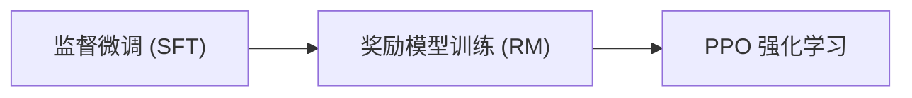

# 大模型微调笔面试题集

> **适用场景**：大模型算法岗 / NLP工程师 / 模型训练与部署岗位笔面试准备  
> **覆盖范围**：Transformer架构 | LoRA原理 | RLHF流程 | DPO对比 | 部署优化  
> **难度标注**：★ 基础 | ★★ 进阶 | ★★★ 高阶  
> **建议用时**：选择题 30 分钟 | 简答题 60 分钟 | 场景设计题 45 分钟

> 📖 **参考链接**：
> - [HuggingFace 官方文档](https://huggingface.co/docs/) -- HuggingFace 全栈文档入口
> - [HuggingFace Transformers 文档](https://huggingface.co/docs/transformers/index) -- Transformer 模型架构与训练接口
> - [HuggingFace PEFT 文档](https://huggingface.co/docs/peft/index) -- LoRA/QLoRA 等参数高效微调方法
> - [HuggingFace TRL 文档](https://huggingface.co/docs/trl/index) -- SFT/PPO/DPO 强化学习对齐训练
> - [HuggingFace Optimum 文档](https://huggingface.co/docs/optimum/index) -- 模型量化与推理加速部署

---

## 第一部分：选择题（共 15 题，每题 4 分，共 60 分）

---

### 1. Transformer 架构中，Multi-Head Attention 的"多头"机制的核心目的是什么？ ★

A. 增加模型参数量，提升拟合能力  
B. 让模型在不同的表示子空间中联合关注不同位置的信息  
C. 减少计算量，提高推理速度  
D. 替代残差连接，防止梯度消失  

**正确答案：B**

**解析**：Multi-Head Attention 将输入线性投影到多个不同的低维子空间（头），每个头独立计算 Scaled Dot-Product Attention，最后将各头输出拼接。这样做的核心目的是让模型能同时从不同"角度"（语义、语法、位置等）关注序列中不同位置的信息，而非简单增加参数量。选项 A 是副作用而非目的；选项 C 错误，多头反而增加计算量；选项 D 错误，残差连接是独立机制。

---

### 2. 在 Transformer 中，Positional Encoding 的必要性是什么？ ★

A. 加速模型训练收敛  
B. 为自注意力机制提供序列中 token 的位置信息  
C. 防止模型过拟合  
D. 替代 Layer Normalization  

**正确答案：B**

**解析**：Self-Attention 机制本身是置换等变的——即打乱输入序列顺序，输出也会相应打乱，模型无法感知 token 之间的顺序关系。Positional Encoding（正弦/余弦编码或可学习位置嵌入）通过将位置信息注入输入表示，使 Transformer 能够捕捉序列的顺序结构。原始论文使用固定正弦函数编码，因其能够外推到训练时未见过的序列长度。

---

### 3. 关于 Layer Normalization 在 Transformer 中的位置，Post-LN 和 Pre-LN 的区别是什么？ ★★

A. Post-LN 将 LN 放在残差连接之后，Pre-LN 放在残差连接之前  
B. Post-LN 训练更稳定，Pre-LN 效果更好  
C. 两者没有本质区别，只是实现方式不同  
D. Pre-LN 将 LN 放在残差连接之后，Post-LN 放在残差连接之前  

**正确答案：A**

**解析**：原始 Transformer 论文使用 Post-LN（LayerNorm 在残差加法之后，即 `LayerNorm(x + Sublayer(x))`）。后续研究发现 Pre-LN（`x + Sublayer(LayerNorm(x))`）训练更稳定，梯度流动更顺畅，尤其是在深层网络中。这也是为什么 GPT 系列等现代大模型普遍采用 Pre-LN 架构。选项 B 说反了——Pre-LN 训练更稳定；选项 C 忽略了本质区别。

---

### 4. LoRA（Low-Rank Adaptation）的核心思想是什么？ ★★

A. 直接修改预训练模型的所有参数  
B. 通过低秩矩阵分解来近似权重更新，仅训练低秩矩阵  
C. 使用知识蒸馏压缩模型  
D. 通过剪枝减少模型参数  

**正确答案：B**

**解析**：LoRA 假设模型在微调时的权重更新矩阵 ΔW 具有低"内在秩"（intrinsic rank），因此可以将 ΔW 分解为两个小矩阵的乘积：ΔW = BA，其中 B ∈ R^(d×r)，A ∈ R^(r×k)，r << min(d, k)。微调时冻结原始权重 W，只训练 A 和 B。推理时可将 BA 合并到 W 中，不增加额外推理延迟。这是当前最流行的参数高效微调（PEFT）方法之一。

---

### 5. LoRA 中秩 r 的选择对微调效果有什么影响？ ★★

A. r 越大，微调效果一定越好  
B. r 越小，微调效果一定越好  
C. r 在合理范围内增大通常能提升效果，但边际收益递减，且会增加参数量  
D. r 的取值对效果完全没有影响  

**正确答案：C**

**解析**：LoRA 论文实验表明，r 从 1 增加到 4、8 时效果提升明显，但继续增大到 16、32、64 时收益递减甚至趋于饱和。过小的 r（如 1）可能表达能力不足，过大的 r 接近全参数微调，失去了参数效率优势。实际应用中 r=8 或 r=16 是常见的平衡选择。此外，对不同类型的权重矩阵（如 attention 的 q、k、v、o）应用 LoRA 的效果也不同。

---

**RLHF 三阶段对齐技术整体框架图：**



> 上图展示了 RLHF 对齐训练的三个阶段，从监督微调建立指令遵循能力，到训练奖励模型捕捉人类偏好，最终通过 PPO 强化学习优化策略。

### 6. 在 RLHF（Reinforcement Learning from Human Feedback）流程中，Reward Model 的训练数据格式是什么？ ★★

A. (prompt, response, label) 二分类标签  
B. (prompt, chosen_response, rejected_response) 偏好对  
C. (prompt, response, reward_score) 连续分数  
D. (prompt, multiple_responses, ranking) 完整排序  

**正确答案：B**

**解析**：RLHF 中的 Reward Model 通常使用人类标注的偏好对进行训练。标注人员对同一个 prompt 的多个 response 进行比较，选择更偏好的那个，形成 (prompt, chosen, rejected) 三元组。训练时使用 Bradley-Terry 模型或类似的排序损失函数，让模型学习给 chosen 更高的分数，给 rejected 更低的分数。选项 C 虽理论上可行，但人类难以给出精确的连续分数，偏好比较更可靠。

---

### 7. RLHF 流程中，PPO（Proximal Policy Optimization）阶段的主要挑战是什么？ ★★★

A. 计算量过小，训练太快  
B. 需要同时维护 4 个模型（Policy、Reference、Reward、Value），显存开销大，训练不稳定  
C. 不需要 Reward Model  
D. 只需要一个模型即可完成训练  

**正确答案：B**

**解析**：RLHF 的 PPO 阶段是工程上最具挑战性的环节。需要同时加载：Actor Model（待优化的策略模型）、Reference Model（用于计算 KL 散度约束）、Reward Model（提供奖励信号）、Critic/Value Model（估计状态价值用于优势计算）。四个模型的内存开销巨大，且 RL 训练本身的不稳定性（奖励 hacking、策略崩溃等）需要精细的超参数调优。这也是 DPO 等方法被提出的重要动机。

---

### 8. DPO（Direct Preference Optimization）相比 RLHF 的核心优势是什么？ ★★★

A. 不需要预训练模型  
B. 不需要 Reward Model 和 RL 训练，直接将偏好对转化为分类损失优化策略模型  
C. 训练速度比 RLHF 慢  
D. 只能用于文本生成任务  

**正确答案：B**

**解析**：DPO 通过数学推导将 RLHF 的偏好优化目标重新参数化，直接从偏好数据中优化策略模型，省去了显式训练 Reward Model 和 PPO 强化学习两个阶段。它将问题转化为一个简单的二元交叉熵分类损失，训练更稳定、计算开销更小。DPO 的理论基础是：最优策略和 Reward 函数之间存在一一映射关系，因此可以直接从偏好数据中提取最优策略。

---

### 9. DPO 损失函数中，隐含的 KL 散度约束是通过什么方式体现的？ ★★★

A. 显式在损失函数中加上 KL 散度项  
B. 通过 Reference Model 的概率比值隐式控制策略偏离程度  
C. 完全不需要控制策略偏离  
D. 使用 L2 正则化替代 KL 散度  

**正确答案：B**

**解析**：DPO 损失函数的核心形式为：

```
L_DPO = -E[log σ(β * (log(π_θ(y_w|x)/π_ref(y_w|x)) - log(π_θ(y_l|x)/π_ref(y_l|x))))]
```

其中 π_θ 是当前策略，π_ref 是参考策略（通常是 SFT 模型），β 控制偏离程度。通过比较 chosen 和 rejected 响应在策略模型和参考模型下的对数概率比值差，隐式地约束了 KL 散度。β 越大，对偏离的惩罚越强。

---

### 10. 以下关于模型量化的描述，哪个是正确的？ ★

A. 量化只会减少模型大小，不会影响推理速度  
B. INT8 量化可以在基本不损失精度的情况下将模型大小减少约 4 倍  
C. 量化后的模型无法进行推理，只能用于训练  
D. 量化必须从头训练模型  

**正确答案：B**

**解析**：INT8 量化将 FP32（32 位浮点）权重映射到 INT8（8 位整数），模型大小理论上减少约 4 倍。对于大模型推理，常用的量化方案包括：GPTQ（基于近似二阶信息的一次性权重量化）、AWQ（激活感知权重量化）、GGUF/GGML（CPU 友好格式）等。现代量化技术（尤其是带校准的量化）通常能在基本不损失精度的情况下实现显著压缩和加速。

---

### 11. FlashAttention 的核心优化原理是什么？ ★★

A. 使用更大的 GPU 显存  
B. 通过分块计算和重计算策略减少 HBM 读写，将 Attention 从 IO-bound 变为 Compute-bound  
C. 减少 Attention 头的数量  
D. 使用更小的模型  

**正确答案：B**

**解析**：FlashAttention 的核心洞察是：标准 Attention 计算中，QK^T 矩阵和 softmax 后的 attention weights 矩阵需要完整写入 HBM（高带宽显存），成为 IO 瓶颈。FlashAttention 通过 Tiling（将输入分块）和 Recomputation（在反向传播时重新计算 softmax 而非存储中间结果），大幅减少 HBM 读写次数，将标准 Attention 的 O(N^2) 内存访问优化为近似 O(N) 的分块访问模式，实现 2-4 倍加速。

---

### 12. vLLM 中 PagedAttention 的核心思想是什么？ ★★

A. 将所有 KV cache 存储在一整块连续内存中  
B. 借鉴操作系统虚拟内存的分页机制，将 KV cache 划分为固定大小的 block，按需分配和回收  
C. 完全不使用 KV cache  
D. 将所有 KV cache 存储在 CPU 内存中  

**正确答案：B**

**解析**：PagedAttention 是 vLLM 推理框架的核心创新。它借鉴操作系统的虚拟内存分页思想，将每个序列的 KV cache 划分为固定大小的 block（类似于内存页），这些 block 不需要连续存储。好处包括：近乎零的显存浪费（传统方案中 KV cache 预分配会导致大量碎片）、支持物理上非连续的 KV cache 存储、实现高效的显存共享（如并行采样的序列可以共享相同的 prompt KV cache）。

---

### 13. 关于 Speculative Decoding（投机解码），以下描述正确的是？ ★★

A. 它是一种模型压缩方法  
B. 它使用一个小模型（draft model）快速生成候选 token，再由大模型（target model）并行验证，从而加速推理  
C. 它会降低生成文本的质量  
D. 它需要修改大模型的架构  

**正确答案：B**

**解析**：Speculative Decoding 是一种无损的推理加速技术。其核心流程是：使用轻量级的 draft model 自回归生成 K 个候选 token，然后 target model 一次性并行验证这些候选 token。根据 target model 的概率分布，接受或拒绝每个候选 token，被拒绝的 token 用 target model 的分布重新采样。由于验证阶段是并行的，且理论上保证输出分布与 target model 完全相同，这是一种无损加速方案。

---

### 14. 在模型部署中，Continuous Batching（连续批处理）相比 Static Batching 的优势是什么？ ★★

A. 处理速度更慢但更稳定  
B. 可以在序列完成时动态替换新请求，提高 GPU 利用率  
C. 只能处理固定长度的序列  
D. 不需要 GPU 即可运行  

**正确答案：B**

**解析**：Static Batching 要求一个 batch 中的所有序列同时开始、同时结束，导致"木桶效应"——短序列完成后 GPU 空闲等待长序列。Continuous Batching（又称 In-flight Batching 或 Dynamic Batching）允许在迭代级别动态管理 batch：当一个序列生成 EOS token 后立即从 batch 中移除，同时可以插入新请求。这大幅提升了 GPU 利用率和系统吞吐量，是 vLLM、TGI 等现代推理框架的标准特性。

---

### 15. GPTQ 量化算法中，使用二阶信息（Hessian 矩阵）的目的是什么？ ★★★

A. 加速模型训练  
B. 补偿量化误差——通过逐列量化并更新剩余权重，最小化量化引起的输出误差  
C. 增加模型参数量  
D. 替换模型中的激活函数  

**正确答案：B**

**解析**：GPTQ（GPT Post-Training Quantization）是一种基于近似二阶信息的一次性权重量化方法。其核心思想是：逐列量化权重矩阵，每次量化一列后，使用 Hessian 矩阵的逆来更新剩余未量化的权重，以补偿当前列的量化误差。这样可以将量化误差传播到后续权重中，最小化整体的输出扰动。相比直接量化，GPTQ 能在更低的位宽（如 4-bit）下保持更好的精度。

---

## 第二部分：简答题（共 10 题，每题 10 分，共 100 分）

---

### 1. 简述 Transformer 的 Encoder-Decoder 架构与 Decoder-Only 架构的区别，并说明各自适用场景。 ★

**参考答案**：

**Encoder-Decoder 架构（如 T5、BART）**：
- Encoder 使用双向自注意力，可以同时看到整个输入序列的所有 token
- Decoder 使用带因果掩码的自注意力，逐 token 生成输出
- Decoder 通过 Cross-Attention 层关注 Encoder 的输出
- 适用场景：翻译、摘要、问答等需要理解完整输入后再生成的任务

**Decoder-Only 架构（如 GPT 系列、LLaMA）**：
- 仅使用 Decoder 部分，只包含自注意力（带因果掩码）
- 将输入和输出拼接在同一个序列中处理
- 训练目标为下一个 token 预测（Next Token Prediction）
- 适用场景：对话、文本补全、代码生成等开放式生成任务

**关键区别**：Encoder-Decoder 在 Encoder 阶段有双向上下文，适合需要深度理解输入的任务；Decoder-Only 更统一简洁，适合大规模预训练和通用生成，且更容易扩展到多轮对话场景。

---

### 2. 什么是自注意力机制中的缩放因子 √d_k？为什么需要它？ ★

**参考答案**：

缩放因子 1/√d_k 出现在 Scaled Dot-Product Attention 的计算中：

```
Attention(Q, K, V) = softmax(QK^T / √d_k) × V
```

**需要缩放的原因**：
- 当 d_k（每个头的维度）较大时，Q 和 K 的点积值会很大
- 大值经过 softmax 后会落入梯度极小的饱和区域（概率分布接近 one-hot），导致梯度消失
- 除以 √d_k 可以将点积的方差控制在 1 左右，使 softmax 输出更平滑，梯度更稳定

**数学解释**：假设 Q 和 K 的各分量独立且均值为 0、方差为 1，则 QK^T 的每个元素方差为 d_k。除以 √d_k 后方差变为 1，有效避免了 softmax 饱和问题。

---

### 3. 请详细说明 LoRA 的数学原理，并解释为什么它能在极少参数的情况下实现有效微调。 ★★

**参考答案**：

**数学原理**：
- 对于预训练权重矩阵 W₀ ∈ R^(d×k)，LoRA 将微调时的更新 ΔW 约束为低秩分解：ΔW = BA
- 其中 B ∈ R^(d×r)，A ∈ R^(r×k)，r << min(d, k)
- 前向传播时：h = W₀x + ΔWx = W₀x + BAx
- 初始化：A 使用随机高斯初始化，B 初始化为零矩阵（确保训练开始时 ΔW = 0）
- 通常对 α/r 进行缩放，其中 α 是常数缩放因子

**为什么有效**：
1. **低秩假设**：预训练模型已经学到了丰富的通用特征，下游任务适配只需要在低秩子空间中调整即可，完整权重矩阵的更新矩阵确实具有低秩性质
2. **隐式正则化**：低秩约束天然限制了模型容量，防止在小数据集上过拟合
3. **多任务友好**：不同任务可以训练不同的 LoRA 权重，共享同一个基础模型，切换任务只需替换 LoRA 矩阵
4. **推理零开销**：推理时可将 BA 合并到 W₀ 中，W = W₀ + BA，计算量不变

> 📖 **参考链接**：
> - [HuggingFace PEFT：LoRA 配置](https://huggingface.co/docs/peft/main/zh/package_reference/lora) -- LoraConfig 参数（r、alpha、target_modules）官方说明
> - [LoRA 原论文（arXiv）](https://arxiv.org/abs/2106.09685) -- 低秩自适应的数学推导与实验

> **生活化类比：LoRA低秩分解=照片压缩** —— LoRA 的低秩分解就像把一张高清照片压缩成 JPEG。原始照片有千万像素（d×d 参数），但其实信息量没那么大——天空是大片蓝色、皮肤是渐变色，这些都可以用很少的"基底"（低秩 r）来近似还原。LoRA 发现：微调时权重的变化量 ΔW 就像照片的"差异信息"，内在秩很低，用两个小矩阵 A×B（r 远小于 d）就能很好地近似。就像 JPEG 用几十个频率分量就能还原千万像素的照片，LoRA 用几千分之一的参数就能还原全参微调的效果。r 越大就像压缩率越低——画质更好但文件更大；r 太小就像压得太狠——细节丢失。面试中答到"低秩假设 + 参数效率 + 推理可合并"这三个点就稳了。

---

### 4. 请描述 RLHF 的完整三阶段流程，并说明每个阶段的目的和关键技术细节。 ★★

**参考答案**：

**阶段一：Supervised Fine-Tuning（SFT）**
- 目的：让预训练模型学会遵循指令和对话格式
- 数据：高质量的（prompt, response）指令对
- 技术：标准的监督学习，使用交叉熵损失训练
- 输出：SFT 模型（后续阶段的初始策略）

**阶段二：Reward Model 训练**
- 目的：训练一个能模拟人类偏好的奖励模型
- 数据：人工标注的偏好对 (prompt, chosen, rejected)
- 损失函数：Bradley-Terry 模型的负对数似然
  ```
  L = -E[log(σ(r(x, y_w) - r(x, y_l)))]
  ```
- 关键：标注质量至关重要，需要明确标注标准（有用性、安全性、真实性等）

**阶段三：PPO 强化学习优化**
- 目的：使用 Reward Model 的奖励信号优化策略模型
- 组件：Actor、Reference、Reward、Critic 四个模型
- 目标函数：
  ```
  max E[r(x,y) - β·KL(π_θ(y|x) || π_ref(y|x))]
  ```
- KL 散度约束：防止策略偏离 SFT 模型太远，避免 Reward Hacking
- 挑战：训练不稳定、显存开销大、超参数敏感

> 📖 **参考链接**：
> - [HuggingFace TRL：PPO Trainer](https://huggingface.co/docs/trl/main/ppo_trainer) -- RLHF PPO 阶段的官方训练器用法
> - [InstructGPT 论文（arXiv）](https://arxiv.org/abs/2203.02155) -- RLHF 三阶段流程的标准定义论文

> **生活化类比：PPO调参=走钢丝** —— RLHF 的 PPO 阶段就像走钢丝。左边是"奖励最大化"（往前走，追求高分），右边是"KL 约束"（不能偏离 SFT 太远，防止 Reward Hacking）。走太快（学习率大）容易摔下去（训练崩溃），走太慢（学习率小）又到不了终点（收敛太慢）。β 参数就是平衡杆——β 太大，模型不敢动（过度保守）；β 太小，模型乱来（Reward Hacking，钻奖励模型空子）。同时还要维护 4 个模型（Actor/Critic/Reward/Reference）在显存里"叠罗汉"，资源紧张。这就是为什么 PPO 调参被称为"炼丹"——没有银弹，全靠经验。DPO 的出现正是为了绕过这根钢丝——直接用偏好数据训练，不用走 RL 这条险路。

---

### 5. 请对比 DPO 和 RLHF 的异同，包括数学原理、工程实现和适用场景。 ★★★

**参考答案**：

| 维度 | RLHF（PPO） | DPO |
|------|------------|-----|
| **核心思想** | 先训练 Reward Model，再用 RL 优化策略 | 直接从偏好数据优化策略，跳过 Reward Model |
| **训练阶段** | 三阶段：SFT → RM → PPO | 两阶段：SFT → DPO |
| **模型数量** | PPO 阶段需 4 个模型 | 2 个模型（策略 + 参考） |
| **数学基础** | Bradley-Terry 模型 + PPO 策略梯度 | 闭式解推导，将 RL 目标转化为分类损失 |
| **训练稳定性** | 不稳定，需大量调参 | 稳定，标准监督学习范式 |
| **计算开销** | 大（多模型、多步采样） | 小（单次前向传播） |
| **数据需求** | 偏好对 + 在线采样 | 离线偏好对 |
| **适用场景** | 大规模、高质量标注、在线迭代 | 有限资源、快速迭代、离线数据 |

**DPO 局限性**：
- 完全离线，无法利用在线探索的收益
- 当偏好数据分布与策略分布差异较大时效果可能下降
- 迭代 DPO 可部分缓解这些问题

---

### 6. 什么是 KV Cache？它在推理加速中的作用是什么？有哪些限制？ ★★

**参考答案**：

**KV Cache 原理**：
- 在自回归推理时，每个新 token 需要与所有历史 token 进行 Attention 计算
- KV Cache 缓存已生成 token 的 Key 和 Value 向量，避免重复计算
- 生成第 t 个 token 时只需计算当前 token 的 Q、K、V，然后与缓存的 K、V 进行 Attention

**加速效果**：
- 将每次推理的计算复杂度从 O(n^2) 降低到 O(n)（n 为当前序列长度）
- 对于长序列生成，加速效果显著

**限制**：
1. **显存占用**：KV Cache 随序列长度和 batch size 线性增长，成为长序列推理的主要显存瓶颈
2. **预分配浪费**：传统方案需预分配最大长度的 KV Cache，造成大量显存碎片
3. **无法跨请求共享**：不同请求的 KV Cache 相互独立
4. **长上下文挑战**：对于超长上下文（如 128K），KV Cache 可能超过 GPU 显存容量

---

### 7. 请解释模型量化中的对称量化与非对称量化的区别，并说明各自的优缺点。 ★★

**参考答案**：

**对称量化**：
- 映射公式：q = round(r / scale)，其中 scale = max(|r|) / (2^(b-1) - 1)
- 零点固定为 0，量化范围对称分布（如 INT8 的 [-127, 127]）
- 优点：实现简单，计算效率高（无需处理零点偏移）
- 缺点：当数据分布不对称时，量化范围利用率低，精度损失大

**非对称量化**：
- 映射公式：q = round((r - zero_point) / scale)
- 零点根据数据实际分布计算，量化范围可完整覆盖数据区间
- 优点：量化范围利用率更高，对非对称分布数据精度更好
- 缺点：计算时需要处理零点偏移，略微增加计算开销

**选择建议**：
- 权重通常使用对称量化（分布近似对称），计算效率高
- 激活值通常使用非对称量化（ReLU 等激活函数输出非负，分布不对称）
- 现代方案如 AWQ 会根据每通道的分布特性自适应选择

> 📖 **参考链接**：
> - [HuggingFace Optimum：量化](https://huggingface.co/docs/optimum/index) -- GPTQ/AWQ/BNB 等量化方案的官方集成
> - [HuggingFace Transformers：模型量化](https://huggingface.co/docs/transformers/main/zh/main_classes/quantization) -- bitsandbytes/GPTQ/AWQ 量化加载接口

> **生活化类比：量化=高清图压缩成缩略图** —— 模型量化就像把一张 32 位高清图（FP32 权重）压缩成 8 位甚至 4 位缩略图（INT8/INT4）。高清图每个像素有几十亿种颜色（浮点数精度高），缩略图每个像素只有 256 种或 16 种颜色（整数精度低），文件体积大幅缩小（显存占用降低 4-8 倍），但远看画质差不多（精度损失可接受）。对称量化是"以 0 为中心均匀切分颜色"——适合分布对称的权重（正负值差不多）；非对称量化是"按实际颜色范围切分"——适合分布偏一边的激活值（比如 ReLU 后全是正数）。量化越狠（4-bit）文件越小但画质损失越大，GGUF/Q4_K_M 这类方案就是在"体积"和"画质"之间找最佳平衡点。

---

### 8. 在大模型部署中，有哪些常见的推理加速技术？请至少列举四种并简要说明其原理。 ★★

**参考答案**：

1. **量化（Quantization）**：将 FP32/FP16 权重转换为 INT8/INT4，减少模型大小和显存带宽需求。代表方法：GPTQ、AWQ、GGUF。

2. **FlashAttention**：通过分块计算和 IO 优化减少 Attention 的 HBM 访问，将 Attention 从 IO-bound 变为 Compute-bound。FlashAttention-2 进一步优化了并行策略。

3. **Speculative Decoding（投机解码）**：使用小模型快速生成候选 token，大模型并行验证，保持输出质量的同时实现 2-3 倍加速。

4. **Continuous Batching**：动态管理推理 batch，序列完成后立即替换新请求，消除静态批处理的 GPU 空闲时间。

5. **KV Cache 量化**：对 KV Cache 进行低精度量化（如 INT8/FP8），减少显存占用，支持更大 batch size 和更长序列。

6. **Tensor Parallelism & Pipeline Parallelism**：将模型切分到多张 GPU 上，突破单卡显存限制，同时通过并行计算加速推理。

---

### 9. 什么是 Catastrophic Forgetting（灾难性遗忘）？在微调过程中如何缓解？ ★★

**参考答案**：

**定义**：
灾难性遗忘是指模型在微调下游任务时，过度适应新任务的数据分布，导致在原始预训练任务上的能力显著下降的现象。

**缓解策略**：

1. **参数高效微调（PEFT）**：如 LoRA、Adapter 等，只微调少量参数，保持大部分预训练权重不变，天然具有抗遗忘能力。

2. **混合训练（Mix Training）**：在微调数据中混入一定比例的预训练数据，保持模型的通用能力。

3. **正则化约束**：
   - EWC（Elastic Weight Consolidation）：对重要参数施加更大的变化惩罚
   - KL 散度约束：如 RLHF 中限制策略模型与 SFT 模型的 KL 散度

4. **渐进式微调（Progressive Fine-tuning）**：先微调顶层，再逐步解冻更多层，实现温和的领域适应。

5. **多任务学习（Multi-Task Learning）**：同时训练多个相关任务，增强模型的泛化能力。

---

### 10. 请说明 SFT（Supervised Fine-Tuning）与 Instruction Tuning 的关系与区别。 ★

**参考答案**：

**关系**：
Instruction Tuning 是 SFT 的一种特殊形式。两者的训练范式相同（监督学习），区别在于数据的构造方式和目标。

**区别**：

| 维度 | 通用 SFT | Instruction Tuning |
|------|---------|-------------------|
| **数据格式** | 任务特定的输入-输出对 | 统一的指令格式（instruction + input → output） |
| **任务多样性** | 通常单一任务或少数任务 | 大量多样化任务混合 |
| **目标** | 在特定任务上达到最优性能 | 提升模型的指令遵循能力和零样本泛化能力 |
| **代表工作** | 传统 NLP 微调 | FLAN、T0、Alpaca |

**本质**：Instruction Tuning 通过大量多样化指令数据的 SFT 训练，让模型学会"理解并执行指令"这一元能力，而非仅掌握特定任务。这也是 ChatGPT 等模型具备强大泛化能力的关键步骤之一。

---

## 第三部分：场景设计题（共 3 题，每题 20 分，共 60 分）

---

### 场景一：金融领域智能客服的模型微调方案设计 ★★★

**背景**：某银行需要基于开源大模型（如 LLaMA-3-8B）构建一个金融领域智能客服系统。要求：准确回答金融产品咨询、理解专业术语、遵循合规要求、不能编造虚假信息。可用资源：8 张 A100-80G GPU，约 10 万条经过审核的金融客服对话数据。

**问题**：请设计完整的微调和部署方案，包括数据准备、训练策略、评估方法和部署优化。

**参考答案**：

**一、数据准备**

1. **数据清洗与增强**：
   - 对 10 万条对话数据进行去重、脱敏处理
   - 识别并标注可能包含误导信息的回复，进行修正或剔除
   - 构建负样本：包含常见的错误回答案例，用于训练模型识别边界

2. **数据格式构造**：
   - 使用 ChatML 或 ShareGPT 格式统一表示多轮对话
   - 添加 system prompt 明确角色定义："你是 XX 银行的智能客服，回答需准确、合规、简洁..."
   - 按 8:1:1 划分训练集、验证集和测试集

3. **数据增强策略**：
   - 使用 Self-Instruct 生成更多变体
   - 构建 RAG 检索增强数据：将知识库文档与对话结合

**二、训练策略**

1. **第一阶段：SFT（全参数或 LoRA 微调）**
   - 使用 LoRA（r=16, alpha=32）对全部线性层进行微调
   - 学习率：2e-5，warmup 比例 0.03，cosine 衰减
   - 使用 DeepSpeed ZeRO-3 或 FSDP 进行分布式训练
   - 训练 3-5 个 epoch，监控验证集 loss 防止过拟合

2. **第二阶段：偏好对齐（可选）**
   - 从验证集中采样对比对，标注偏好
   - 使用 DPO 进行偏好优化，进一步提升回答质量和安全性
   - β 参数设为 0.1，使用较小的学习率 5e-7

**三、评估方法**

1. **自动化评估**：
   - 使用 ROUGE-L、BERTScore 评估与参考答案的相似度
   - 构建金融领域专用测试集，包含合规性、准确性、完整性等维度
   - 使用 GPT-4 作为评判器进行 LLM-as-Judge 评估

2. **人工评估**：
   - 邀请金融专家对 200+ 条回复进行盲评
   - 评估维度：准确性（1-5）、合规性（1-5）、有用性（1-5）、安全性（1-5）
   - 计算胜率（Win Rate）和平均分

3. **红队测试**：
   - 设计对抗性 prompt，测试模型的边界行为
   - 验证模型在金融欺诈、非法建议等场景下的拒绝能力

**四、部署优化**

1. **模型量化**：使用 AWQ 4-bit 量化，将显存占用从约 16GB 降至约 5GB
2. **推理框架**：使用 vLLM 部署，开启 Continuous Batching 和 PagedAttention
3. **RAG 集成**：结合金融知识库进行检索增强生成，实时获取最新产品信息
4. **安全防护**：部署输入/输出内容安全过滤模块，防止敏感信息泄露
5. **监控体系**：建立在线评估指标（延迟、吞吐量、拒绝率、用户满意度）

---

### 场景二：多语言代码生成模型的 LoRA 微调方案 ★★

**背景**：团队需要在 CodeLlama-13B 基础上，使用 LoRA 微调使其支持 Python、Java、Go 三种语言的代码生成，并使用 DPO 提升代码质量。可用数据：每种语言约 5000 条高质量（instruction, code）对，以及 2000 条偏好对比数据。硬件：4 张 A100-40G GPU。

**问题**：请设计 LoRA 配置方案和 DPO 训练策略，并说明多语言能力的平衡方法。

**参考答案**：

**一、LoRA 配置方案**

1. **目标模块选择**：
   ```
   target_modules = ["q_proj", "k_proj", "v_proj", "o_proj",
                     "gate_proj", "up_proj", "down_proj"]
   ```
   - 覆盖 Attention 和 FFN 的全部线性层，最大化微调效果
   - 根据实验，同时微调 Attention 和 FFN 层的效果优于仅微调 Attention

2. **超参数配置**：
   - r = 8（对 13B 模型，r=8 已足够，避免过拟合）
   - lora_alpha = 16（alpha/r = 2，适中的缩放强度）
   - lora_dropout = 0.05（轻微的正则化）
   - 学习率：1e-4（LoRA 可使用比全参数微调更高的学习率）

3. **训练策略**：
   - 使用 bf16 混合精度训练
   - batch_size = 128（通过梯度累积实现）
   - 使用 DeepSpeed ZeRO-2 进行分布式训练

**二、多语言能力平衡策略**

1. **数据混合策略**：
   - 采用温度采样（Temperature Sampling）平衡各语言数据量
   - 对小样本语言（如 Go）可适当提高采样概率
   - 建议比例：Python:Java:Go = 1:1:1.2（给 Go 更高权重）

2. **分阶段训练**：
   - 第一阶段：三种语言混合训练（3 epochs）
   - 第二阶段：对效果较差的单一语言进行少量额外微调（1 epoch）

3. **能力监控**：
   - 每种语言维护独立的验证集
   - 使用 Pass@k 指标（k=1, 10）评估代码生成正确率
   - 在训练过程中监控各语言的指标变化，及时调整

**三、DPO 训练策略**

1. **偏好数据构造**：
   - 基于 CodeLlama 的 SFT 模型生成多个候选代码
   - 使用测试用例执行结果作为自动化偏好信号（通过测试 > 未通过测试）
   - 结合人工评审，确保偏好的代码不仅正确，且风格良好、效率高

2. **DPO 训练配置**：
   - 参考模型：第一阶段 SFT 完成后的 LoRA 模型
   - β = 0.1（适中的 KL 约束）
   - 学习率：5e-7
   - 训练 1-2 epochs

3. **DPO 数据分语言处理**：
   - 每种语言独立进行 DPO 训练
   - 或混合训练但确保每种语言占比均衡
   - 监控各语言 Pass@k 指标，确保 DPO 不会损害某些语言的能力

**四、评估与迭代**

1. 使用 HumanEval、MBPP 等标准基准评估
2. 构建内部多语言代码测试集
3. 基于评估结果迭代调整 LoRA 配置和训练策略

---

### 场景三：大模型推理服务的性能优化方案 ★★★

**背景**：某 SaaS 平台部署了 LLaMA-3-70B 模型提供在线对话服务。当前遇到的瓶颈：单请求平均延迟 3.5 秒，P99 延迟 8 秒，峰值 QPS 仅 5。目标：将 P50 延迟降至 1 秒以内，QPS 提升至 20 以上。硬件：8 张 A100-80G GPU。

**问题**：请设计完整的推理优化方案，包括模型优化、服务架构和调度策略。

**参考答案**：

**一、模型层面的优化**

1. **权重量化**：
   - 使用 AWQ 4-bit 量化，将 70B 模型从约 140GB 降至约 35GB
   - 关键：使用校准数据集进行激活感知量化，保持精度
   - 可选：使用 GPTQ 作为备选方案，对比精度和速度

2. **KV Cache 量化**：
   - 对 KV Cache 进行 FP8 或 INT8 量化
   - 减少 KV Cache 显存占用约 50%，支持更大 batch size

3. **FlashAttention-2 集成**：
   - 替换标准 Attention 实现，减少显存读写
   - 对于长序列场景效果尤为显著

**二、分布式部署架构**

1. **Tensor Parallelism（张量并行）**：
   - 将 70B 模型切分到 4 张 GPU 上（TP=4）
   - 每张 GPU 显存占用约 9GB（4-bit 量化后）
   - 剩余 4 张 GPU 用于第二个推理实例（TP=4）

2. **多实例部署**：
   - 部署 2 个独立的推理实例，每个使用 4 张 GPU
   - 通过负载均衡分发请求，实现横向扩展

**三、推理框架优化**

1. **使用 vLLM 作为推理引擎**：
   - 开启 PagedAttention：消除 KV Cache 显存碎片
   - 开启 Continuous Batching：动态管理 batch，最大化 GPU 利用率
   - 配置 max_num_batched_tokens：平衡吞吐量和延迟

2. **关键参数调优**：
   ```yaml
   max_num_seqs: 64          # 最大并发序列数
   max_model_len: 8192       # 最大序列长度
   max_num_batched_tokens: 8192  # 每 batch 最大 token 数
   gpu_memory_utilization: 0.92  # GPU 显存利用率
   ```

**四、请求调度策略**

1. **优先级队列**：
   - 短请求优先调度，减少 Head-of-Line Blocking
   - 为不同 SLA 级别的请求设置不同优先级

2. **请求合并（Batching）策略**：
   - 设置最大等待时间（如 50ms），在此时间内收集请求
   - 使用动态 batch 大小，在延迟和吞吐量之间平衡

3. **预填充与解码分离（Disaggregated Prefill）**：
   - 将 Prefill 阶段和 Decode 阶段部署到不同 GPU 组
   - Prefill 是 Compute-bound，Decode 是 Memory-bound，分离后可独立优化

**五、预期效果与监控**

| 指标 | 优化前 | 优化后（预期） |
|------|--------|--------------|
| P50 延迟 | 3.5s | <1s |
| P99 延迟 | 8s | <3s |
| 峰值 QPS | 5 | 20-30 |
| 单卡显存 | ~35GB | ~20GB |

**六、渐进式上线策略**

1. 灰度发布：逐步将 10% → 50% → 100% 流量切换到优化后的服务
2. A/B 测试：对比优化前后的输出质量（量化可能导致轻微质量下降）
3. 回滚预案：保持原始 FP16 模型服务可用，出问题时快速切换
4. 持续监控：延迟、吞吐量、错误率、输出质量、用户满意度

---

## 学习导航栏

### 推荐学习路径

```
第一阶段：基础夯实
├── 《Attention Is All You Need》论文精读
├── 《The Illustrated Transformer》图解教程
├── Andrei Karpathy 的 "Let's build GPT from scratch" 视频
└── HuggingFace Transformers 官方文档

第二阶段：微调技术
├── LoRA 论文：《LoRA: Low-Rank Adaptation of Large Language Models》
├── QLoRA 论文：《QLoRA: Efficient Finetuning of Quantized LLMs》
├── HuggingFace PEFT 库实践
├── 实战：使用 LLaMA-Factory 进行 SFT 微调
└── 实战：使用 Axolotl 或 Unsloth 进行高效微调

第三阶段：对齐技术
├── InstructGPT 论文：《Training language models to follow instructions》
├── RLHF 详解：OpenAI 的 RLHF 技术博客
├── DPO 论文：《Direct Preference Optimization》
├── ORPO / SimPO / KTO 等 DPO 变体论文
└── 实战：使用 TRL 库进行 DPO 训练

第四阶段：部署优化
├── vLLM 官方文档及 PagedAttention 论文
├── FlashAttention 论文（v1, v2, v3）
├── GPTQ / AWQ 量化论文
├── 《Efficient Large Language Model Serving》综述
└── 实战：使用 vLLM + AWQ 部署生产级服务
```

### 推荐资源

| 类别 | 资源名称 | 说明 |
|------|---------|------|
| **论文** | Attention Is All You Need | Transformer 原论文，必读 |
| **论文** | LoRA: Low-Rank Adaptation | 参数高效微调里程碑工作 |
| **论文** | Direct Preference Optimization | DPO 原论文，改变了 RLHF 范式 |
| **论文** | Training language models to follow instructions | InstructGPT / RLHF 经典论文 |
| **课程** | Stanford CS224N | NLP 与深度学习经典课程 |
| **课程** | Stanford CS336 | 大语言模型原理与实践 |
| **课程** | DeepLearning.AI: LangChain & LLMs | 吴恩达的 LLM 应用课程 |
| **工具** | HuggingFace Transformers | 模型训练与推理基础库 |
| **工具** | HuggingFace PEFT | LoRA/Adapter 等 PEFT 方法实现 |
| **工具** | HuggingFace TRL | RLHF/DPO 训练工具库 |
| **工具** | vLLM | 高性能 LLM 推理引擎 |
| **工具** | LLaMA-Factory | 一站式 LLM 微调框架 |
| **工具** | Unsloth | 2-5x 加速的微调工具 |
| **工具** | DeepSpeed | 微软分布式训练框架 |
| **博客** | Lilian Weng's Blog | 高质量的 LLM 技术博客 |
| **博客** | Jay Alammar's Blog | 图解 Transformer 等可视化教程 |
| **论坛** | r/LocalLLaMA | 开源 LLM 社区讨论 |
| **论坛** | HuggingFace Discord | 实时技术讨论社区 |

### 面试准备建议

1. **理论深度**：不仅要能回答"是什么"，还要能解释"为什么"和"怎么来的"。面试官通常关注你对原理的理解深度而非记忆准确度。

2. **动手实践**：至少完整跑通一次 SFT + DPO 微调流程，能从数据准备、训练配置到评估部署完整复述。

3. **前沿追踪**：关注最近 6 个月内的顶会论文（NeurIPS、ICML、ICLR、ACL、EMNLP），了解最新进展。

4. **工程能力**：能独立搭建训练环境、处理 OOM、调试分布式训练问题、优化推理性能。

5. **系统思维**：能从数据、训练、评估、部署、监控的全链路角度思考问题，而不是仅关注模型本身。

---

> **文档版本**：v1.0  
> **最后更新**：2026-06-30  
> **适用岗位**：大模型算法工程师 / NLP 研究员 / 模型训练与推理工程师  
> **总计**：15 道选择题 + 10 道简答题 + 3 道场景设计题，满分 220 分

> - 返回 [学习路线总览](../../README.md)