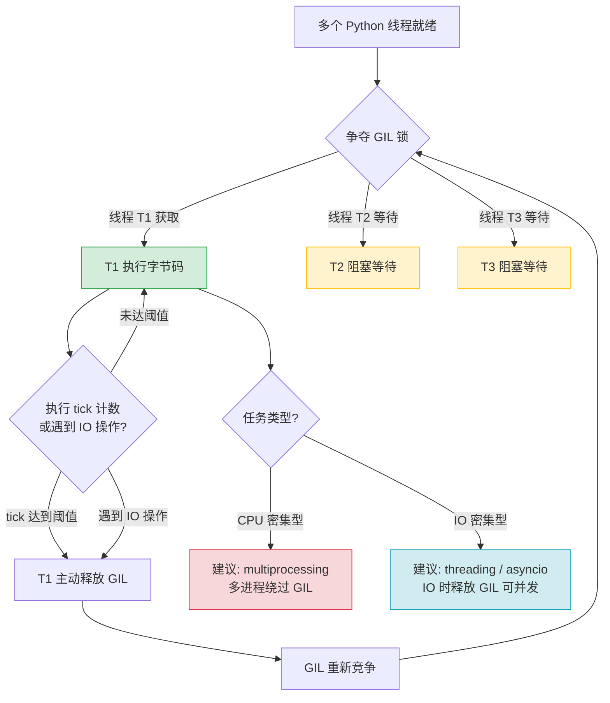

# 面向Java开发者的Python核心语法速通

> 作为Java开发者，你已经掌握了编程的核心概念。本文将帮助你快速对比学习Python，重点突出与Java的差异，帮助你快速上手。

> 📖 **参考链接**：
> - [Python 官方文档（中文）](https://docs.python.org/zh-cn/3/) -- Python 语言权威指南，包含教程、库参考、语言参考
> - [Python 教程](https://docs.python.org/zh-cn/3/tutorial/index.html) -- 从入门到进阶的官方教程，适合系统学习语法
> - [Python 标准库](https://docs.python.org/zh-cn/3/library/index.html) -- 内置模块与数据类型的完整参考
> - [Python 语言参考](https://docs.python.org/zh-cn/3/reference/index.html) -- 语法与语言元素的精确规范定义

---

## 目录

- [一、与Java对比概览](#一与java对比概览)
- [二、基础语法](#二基础语法)
- [三、函数与模块](#三函数与模块)
- [四、面向对象](#四面向对象)
- [五、常用标准库](#五常用标准库)
- [学习导航](#学习导航)
- [自检清单](#自检清单)

---

## 一、与Java对比概览

### 1.1 解释型 vs 编译型

| 特性 | Java | Python |
|------|------|--------|
| 执行方式 | 编译成字节码，JVM运行 | 解释执行（也可编译） |
| 开发流程 | 编写 → 编译 → 运行 | 编写 → 直接运行 |
| 启动速度 | 快 | 较慢 |
| 运行性能 | 高 | 适中 |

**关键点**：Python不需要编译环节，写完就能跑，开发效率更高。但在生产环境中，Python也可以通过编译优化性能。

### 1.2 动态 vs 静态类型

**Java（静态类型）**：
```java
String name = "张三";
int age = 25;
// 不能改变类型
name = 25; // 编译错误
```

**Python（动态类型）**：
```python
name = "张三"
age = 25
# 可以随时改变类型
name = 25  # 完全合法
```

**关键点**：Python不需要声明类型，解释器自动推断。这让代码更简洁，但大型项目需要类型注解。

> **生活化类比：** Python 的动态类型 vs Java 的静态类型，就像便签纸 vs 表格。Java 的静态类型是一张预先设计好的表格，每一列都标明了"姓名（String）""年龄（int）""电话（String）"，你填数据时必须严格遵守格式，填错了编译就报错。Python 的动态类型就像一张便签纸，你可以先写"张三"，然后划掉写"25"，再划掉写"True"，随心所欲。便签纸灵活方便、随手就能写，但数据多了容易乱；表格虽然死板，但数据一多反而清楚好管理。

### 1.3 缩进 vs 花括号

**Java**：
```java
if (age > 18) {
    System.out.println("成年人");
    if (hasLicense) {
        System.out.println("可以驾驶");
    }
}
```

**Python**：
```python
if age > 18:
    print("成年人")
    if has_license:
        print("可以驾驶")
# 靠缩进区分代码块
```

**关键点**：
- Python强制使用缩进（通常4个空格），代码格式统一
- 不需要花括号，减少了语法噪音
- 缩进错误就是语法错误，一开始需要适应

### 1.4 pip vs Maven/Gradle

| 对比 | Java | Python |
|------|------|--------|
| 包管理工具 | Maven / Gradle | pip |
| 依赖文件 | pom.xml / build.gradle | requirements.txt / pyproject.toml |
| 仓库 | Maven Central | PyPI |
| 本地仓库 | ~/.m2/repository | ~/.local/lib/python3.x/site-packages |

**常用命令对比**：

| Java | Python |
|------|--------|
| `mvn install` | `pip install` |
| `mvn dependency:tree` | `pip list` |
| `mvn clean package` | `pip wheel` |

**关键点**：pip比Maven简单很多，没有复杂的生命周期管理，就是简单的包安装。

---

## 二、基础语法

### 2.1 变量定义

Python没有类型声明，直接赋值：

```python
# 直接赋值，自动推断类型
name = "Alice"       # 字符串
age = 25            # 整数
height = 1.75       # 浮点数
is_student = True   # 布尔值

# 多重赋值
a = b = c = 10
x, y, z = 1, 2, 3   # 解包，常用
```

对应Java：
```java
String name = "Alice";
int age = 25;
double height = 1.75;
boolean isStudent = true;
```

### 2.2 基本数据类型

| Python | Java | 说明 |
|--------|------|------|
| `int` | `int`/`long` | 整数，任意精度 |
| `float` | `float`/`double` | 浮点数 |
| `bool` | `boolean` | 布尔值 (`True`/`False`) |
| `str` | `String` | 字符串 |
| `None` | `null` | 空值 |

**注意**：
- Python的`int`可以无限大，不会溢出
- `True`和`False`首字母大写
- `None`代替`null`

### 2.3 List（列表）≈ ArrayList

对应Java的`ArrayList`，但更灵活：

```python
# 创建列表
numbers = [1, 2, 3, 4, 5]
mixed = [1, "hello", 3.14, True]  # 可以放不同类型

# 访问元素（从0开始）
print(numbers[0])      # 1
print(numbers[-1])     # 5，负数表示从后往前

# 切片操作 ❤️ 非常方便
print(numbers[1:3])    # [2, 3]  左闭右开
print(numbers[:2])     # [1, 2]  从头开始
print(numbers[2:])     # [3, 4, 5] 到末尾
print(numbers[::2])    # [1, 3, 5] 步长2

# 常用操作
numbers.append(6)      # 添加到末尾
numbers.insert(0, 0)   # 插入到指定位置
numbers.pop()          # 删除并返回最后一个
numbers.pop(0)         # 删除指定位置
numbers.remove(3)      # 删除第一个值为3的元素
len(numbers)           # 获取长度

# 检查元素是否存在
if 3 in numbers:
    print("存在")
```

### 2.4 Tuple（元组）≈ 不可变List

```python
# 创建元组
coordinates = (10, 20)
point = 10, 20  # 括号可以省略

# 解包（常用）
x, y = coordinates
print(x)  # 10
print(y)  # 20

# 元组不可修改
coordinates[0] = 20  # 报错
```

**使用场景**：函数返回多个值，作为字典的key等。

### 2.5 Dict（字典）≈ HashMap

```python
# 创建字典
person = {
    "name": "Alice",
    "age": 25,
    "is_student": True
}

# 访问
print(person["name"])       # Alice
print(person.get("name"))   # Alice
print(person.get("gender", "unknown"))  # 默认值

# 修改/添加
person["age"] = 26
person["gender"] = "female"

# 遍历
for key in person:
    print(key)  # 遍历key

for key, value in person.items():
    print(key, value)  # 同时遍历key和value

# 检查key是否存在
if "name" in person:
    print("name exists")
```

### 2.6 Set（集合）≈ HashSet

```python
# 创建集合
numbers = {1, 2, 3, 4}
empty_set = set()  # 空集合必须用set()

# 集合操作
a = {1, 2, 3}
b = {3, 4, 5}
print(a & b)  # 交集 {3}
print(a | b)  # 并集 {1, 2, 3, 4, 5}
print(a - b)  # 差集 {1, 2}

# 添加删除
numbers.add(5)
numbers.remove(1)
```

### 2.7 列表推导式 ❤️ Python特色

这是Python非常方便的语法，Java没有直接对应：

**传统写法**：
```python
numbers = [1, 2, 3, 4, 5]
squares = []
for n in numbers:
    squares.append(n * n)
```

**列表推导式写法**：
```python
numbers = [1, 2, 3, 4, 5]
squares = [n * n for n in numbers]
# 结果: [1, 4, 9, 16, 25]
```

**带条件过滤**：
```python
# 只保留偶数的平方
even_squares = [n * n for n in numbers if n % 2 == 0]
# 结果: [4, 16]
```

**字典和集合也支持推导式**：
```python
# 字典推导
square_dict = {n: n * n for n in numbers}
# {1: 1, 2: 4, 3: 9, 4: 16, 5: 25}

# 集合推导
square_set = {n * n for n in numbers}
```

---

## 三、函数与模块

### 3.1 函数定义 - def

**Python**：
```python
def add(a, b):
    return a + b

# 调用
result = add(1, 2)
```

**对应Java**：
```java
public int add(int a, int b) {
    return a + b;
}
```

**默认参数**：
```python
def greet(name, greeting="Hello"):
    return f"{greeting}, {name}!"

print(greet("Alice"))                # Hello, Alice!
print(greet("Bob", "Good morning"))  # Good morning, Bob!
```

### 3.2 *args 和 **kwargs - 可变参数

对应Java的可变参数，但更灵活：

```python
# *args 接收任意多个位置参数，打包成tuple
def sum_all(*args):
    total = 0
    for num in args:
        total += num
    return total

print(sum_all(1, 2, 3))      # 6
print(sum_all(1, 2, 3, 4))   # 10

# **kwargs 接收任意多个关键字参数，打包成dict
def print_info(**kwargs):
    for key, value in kwargs.items():
        print(f"{key}: {value}")

print_info(name="Alice", age=25, city="Beijing")
# 输出:
# name: Alice
# age: 25
# city: Beijing
```

**同时使用**：
```python
def func(*args, **kwargs):
    print(args)    # (1, 2, 3)
    print(kwargs)  # {'x': 1, 'y': 2}

func(1, 2, 3, x=1, y=2)
```

**解包调用**：
```python
numbers = [1, 2, 3]
sum_all(*numbers)  # 等同于 sum_all(1, 2, 3)

params = {"name": "Alice", "age": 25}
print_info(**params)  # 等同于 print_info(name="Alice", age=25)
```

### 3.3 lambda - 匿名函数

对应Java的Lambda表达式：

**Python**：
```python
add = lambda a, b: a + b
print(add(1, 2))  # 3

# 常用在排序等场合
numbers = [(1, 3), (4, 1), (2, 5)]
sorted(numbers, key=lambda x: x[1])
# 按第二个元素排序
```

**Java对比**：
```java
BiFunction<Integer, Integer, Integer> add = (a, b) -> a + b;
```

### 3.4 import - 导入模块

对应Java的import，但有几种写法：

```python
# 导入整个模块
import math
print(math.pi)  # 3.1415926...

# 导入特定成员
from math import pi, sqrt
print(pi)
print(sqrt(16))

# 导入并重命名
import numpy as np
import pandas as pd

# 导入模块下的所有内容（不推荐）
from math import *
```

**相对导入**（包内使用）：
```python
from . import module_b      # 同目录导入
from ..package_a import foo  # 上级目录导入
```

对比Java：
```java
// 对应 import math.*; ↓
from math import *

// 对应 import math.pi; ↓
from math import pi

// 对应 import java.util.ArrayList; ↓
import java.util.ArrayList  →  import java.util.ArrayList
```

> **生活化类比：生成器=自助餐取餐** —— 生成器（Generator）就像自助餐的取餐台：你不需要一次性把所有菜端到桌上（不需要一次性把所有数据加载到内存），而是吃一盘拿一盘（按需 yield 一个值）。普通列表好比把整桌菜一次性端上来，菜多桌子就放不下（内存爆掉）；生成器则是"边吃边取"，无论后面有多少菜，桌上永远只有一盘，内存占用恒定。`yield` 关键字就是服务员递出餐盘的手，每次调用 `next()` 递一盘，吃完再要。这种"懒加载"特性在处理大文件、流式数据时格外香。

---

## 三点五、流程控制与文件操作

### 流程控制

**条件分支**

```python
# if-elif-else（Python没有switch-case，3.10+有match-case）
score = 85

if score >= 90:
    grade = "A"
elif score >= 80:
    grade = "B"
elif score >= 60:
    grade = "C"
else:
    grade = "D"

# match-case模式匹配（Python 3.10+）
match grade:
    case "A":
        print("优秀")
    case "B":
        print("良好")
    case _:
        print("其他")
```

**循环结构**

```python
# for循环（遍历可迭代对象）
for i in range(5):       # 0,1,2,3,4
    print(i)

for index, value in enumerate(["a", "b", "c"]):  # (0,'a'),(1,'b'),(2,'c')
    print(f"{index}: {value}")

# while循环 + break/continue
count = 0
while count < 10:
    count += 1
    if count % 2 == 0:
        continue  # 跳过偶数
    if count > 7:
        break     # 大于7停止
    print(count)

# 循环else子句（Java没有的特性：循环正常结束才执行，break跳出不执行）
for i in range(5):
    print(i)
else:
    print("循环正常结束")
```

**推导式（Python特色，Java无等价物）**

```python
# 列表推导式
squares = [x**2 for x in range(10)]          # [0,1,4,9,...,81]
evens = [x for x in range(20) if x % 2 == 0]  # 过滤偶数

# 字典推导式
char_count = {c: "hello".count(c) for c in set("hello")}  # {'h':1,'e':1,'l':2,'o':1}

# 集合推导式
unique = {x % 3 for x in [1,2,4,5,7]}  # {1,2}
```

### 文件操作

**文件读写**

```python
# 基本读写（不推荐，忘记close会泄漏资源）
f = open("data.txt", "w", encoding="utf-8")
f.write("hello")
f.close()

# with上下文管理器（推荐，类似Java的try-with-resources）
with open("data.txt", "r", encoding="utf-8") as f:
    content = f.read()       # 读取全部
    # 或逐行读取
    for line in f:           # 逐行读取，内存友好
        print(line.strip())
```

**mode参数**

| mode | 含义 | Java等价 | 文件不存在时 |
|------|------|---------|------------|
| `r` | 只读 | `FileReader` | 报错 |
| `w` | 只写（覆盖） | `FileWriter` | 创建 |
| `a` | 追加 | `FileWriter(true)` | 创建 |
| `r+` | 读写 | `RandomAccessFile` | 报错 |
| `rb` | 二进制读 | `FileInputStream` | 报错 |
| `wb` | 二进制写 | `FileOutputStream` | 创建 |

**JSON文件处理**

```python
import json

# 写入JSON
data = {"name": "张三", "age": 30, "hobbies": ["读书", "游泳"]}
with open("data.json", "w", encoding="utf-8") as f:
    json.dump(data, f, ensure_ascii=False, indent=2)

# 读取JSON
with open("data.json", "r", encoding="utf-8") as f:
    loaded = json.load(f)
    print(loaded["name"])  # 张三
```

**CSV文件处理**

```python
import csv

# 写入CSV
with open("users.csv", "w", newline="", encoding="utf-8") as f:
    writer = csv.DictWriter(f, fieldnames=["name", "age"])
    writer.writeheader()
    writer.writerow({"name": "张三", "age": 30})

# 读取CSV
with open("users.csv", "r", encoding="utf-8") as f:
    reader = csv.DictReader(f)
    for row in reader:
        print(row["name"], row["age"])
```

**与Java对比**：Python的`with`语句等价于Java的`try-with-resources`，都保证资源自动关闭。Python文件操作更简洁，无需显式关闭。

---

## 四、面向对象

### 4.1 类定义 - class

**Python**：
```python
class Person:
    # 构造方法
    def __init__(self, name, age):
        self.name = name  # 实例变量
        self.age = age
    
    # 实例方法，第一个参数必须是self
    def introduce(self):
        print(f"我是 {self.name}, {self.age}岁")

# 创建对象
p = Person("Alice", 25)
p.introduce()  # 我是 Alice, 25岁
```

**对应Java**：
```java
class Person {
    private String name;
    private int age;
    
    public Person(String name, int age) {
        this.name = name;
        this.age = age;
    }
    
    public void introduce() {
        System.out.println("我是 " + name + ", " + age + "岁");
    }
}

Person p = new Person("Alice", 25);
p.introduce();
```

**关键点对比**：

| Python | Java | 说明 |
|--------|------|------|
| `class` | `class` | 关键字相同 |
| `__init__` | 构造方法 | 初始化方法 |
| `self` | `this` | 指向当前对象，Python必须显式写 |
| 方法第一个参数总是`self` | 隐式`this` | Python显式，Java隐式 |

### 4.2 self vs this

- Java：`this`是隐式的，只有需要区分变量名时才用
- Python：`self`必须显式写在方法参数第一个位置，访问成员也需要`self.`

### 4.3 继承

**Python**：
```python
class Student(Person):  # 括号里写父类
    def __init__(self, name, age, school):
        super().__init__(name, age)  # 调用父类构造
        self.school = school
    
    # 重写方法
    def introduce(self):
        super().introduce()  # 调用父类方法
        print(f"我在 {self.school} 上学")
```

**对应Java**：
```java
class Student extends Person {
    private String school;
    
    public Student(String name, int age, String school) {
        super(name, age);
        this.school = school;
    }
    
    @Override
    public void introduce() {
        super.introduce();
        System.out.println("我在 " + school + " 上学");
    }
}
```

### 4.4 多继承与MRO

Python支持多继承，Java（除了接口）不支持：

```python
class A:
    def say(self):
        print("A")

class B:
    def say(self):
        print("B")

class C(A, B):  # 多继承
    pass

c = C()
c.say()  # 输出 A，因为MRO顺序是 C → A → B
```

**MRO（Method Resolution Order）**：方法解析顺序
- Python使用C3算法计算MRO
- 可以用 `C.__mro__` 查看顺序
- 遵循：子类优先，广度优先

**使用场景**：Mixin设计模式，通过多继承给类添加功能。

### 4.5 魔术方法（Magic Methods）

Python中以`__xx__`命名的特殊方法，对应Java的特殊方法/重写：

| Python魔术方法 | Java对应 | 说明 |
|---------------|---------|------|
| `__init__` | 构造方法 | 初始化对象 |
| `__str__` | `toString()` | 转字符串 |
| `__len__` | `size()`/`length()` | 长度 |
| `__getitem__` | `get()` | 下标访问 |
| `__call__` | 无直接对应 | 让对象可以像函数一样调用 |

**示例**：
```python
class Person:
    def __init__(self, name):
        self.name = name
    
    def __str__(self):
        return f"Person(name={self.name})"
    
    def __call__(self):
        print(f"{self.name} is called")

p = Person("Alice")
print(p)  # 调用 __str__ → Person(name=Alice)
p()       # 调用 __call__ → Alice is called
```

### 4.6 @property - 优雅的getter/setter

Java需要写冗长的getter/setter：

```java
// Java写法
private int age;
public int getAge() {
    return age;
}
public void setAge(int age) {
    this.age = age;
}
// 调用: p.getAge(), p.setAge(25)
```

Python用@property更优雅：

```python
class Person:
    def __init__(self):
        self._age = 0
    
    @property
    def age(self):
        # getter
        return self._age
    
    @age.setter
    def age(self, value):
        # setter，可以做校验
        if 0 <= value <= 150:
            self._age = value
        else:
            raise ValueError("Invalid age")

# 调用就像直接访问属性一样
p = Person()
p.age = 25      # 调用setter
print(p.age)    # 调用getter
```

太香了！👍

---

## 五、常用标准库

Python自带电池（batteries included），很多功能开箱即用。

### 5.1 os - 操作系统接口

对应Java的`java.io.File`等：

```python
import os

# 获取当前工作目录
cwd = os.getcwd()

# 列出目录内容
files = os.listdir('.')

# 创建目录
os.mkdir('new_dir')

# 路径拼接（不用管斜杠方向）
path = os.path.join('dir', 'file.txt')

# 判断文件/目录是否存在
os.path.exists(path)
os.path.isfile(path)
os.path.isdir(path)

# 获取文件大小
size = os.path.getsize(path)
```

### 5.2 sys - Python解释器相关

```python
import sys

# 命令行参数
print(sys.argv)  # sys.argv[0] 是脚本名

# 退出程序
sys.exit(0)  # 0表示成功，非0表示错误

# Python版本
print(sys.version)

# 模块搜索路径
print(sys.path)
```

### 5.3 json - JSON处理

比Java的Jackson/Gson简单多了：

```python
import json

# Python对象转JSON字符串
data = {"name": "Alice", "age": 25}
json_str = json.dumps(data)
# 格式化输出
json_str_pretty = json.dumps(data, indent=4, ensure_ascii=False)

# JSON字符串转Python对象
parsed = json.loads(json_str)

# 直接读写文件
with open('data.json', 'w', encoding='utf-8') as f:
    json.dump(data, f, ensure_ascii=False, indent=4)

with open('data.json', 'r', encoding='utf-8') as f:
    data = json.load(f)
```

### 5.4 re - 正则表达式

对应Java的`java.util.regex`：

```python
import re

# 匹配
pattern = r'\d+'  # 匹配数字
text = "我有123个苹果"
match = re.search(pattern, text)
if match:
    print(match.group())  # 123

# 查找所有匹配
matches = re.findall(pattern, text)

# 替换
result = re.sub(pattern, 'XXX', text)
# 结果: "我有XXX个苹果"

# 分割
parts = re.split(r'\s+', "hello   world  python")
```

**小技巧**：用`r''`原生字符串写正则，不用转义反斜杠。

### 5.5 datetime - 日期时间

对应Java的`java.time`：

```python
from datetime import datetime, timedelta

# 获取当前时间
now = datetime.now()
print(now.year, now.month, now.day, now.hour, now.minute, now.second)

# 格式化
print(now.strftime('%Y-%m-%d %H:%M:%S'))
# 输出: 2024-01-15 10:30:00

# 解析字符串
dt = datetime.strptime('2024-01-15', '%Y-%m-%d')

# 时间运算
delta = timedelta(days=7)
future = now + delta  # 7天后
past = now - delta    # 7天前
```

### 5.6 collections - 高级数据结构

**Counter** - 计数器：
```python
from collections import Counter

words = ["a", "b", "a", "c", "a", "b"]
counter = Counter(words)
print(counter)        # Counter({'a': 3, 'b': 2, 'c': 1})
print(counter['a'])   # 3
print(counter.most_common(2))  # [('a', 3), ('b', 2)]
```

**defaultdict** - 默认值字典：
```python
from collections import defaultdict

# 不用提前判断key是否存在
d = defaultdict(list)
d['key'].append(1)  # 如果key不存在，自动创建空list
d['key'].append(2)
# 结果: d['key'] = [1, 2]
```

**OrderedDict** - 有序字典（Python 3.7+ 普通dict也有序了）

**deque** - 双端队列，O(1)头尾操作：
```python
from collections import deque

q = deque()
q.append(1)
q.appendleft(0)
q.pop()
q.popleft()
```

### 5.7 itertools - 迭代器工具

提供很多有用的迭代器操作：

```python
import itertools

# 排列组合
numbers = [1, 2, 3]
print(list(itertools.permutations(numbers, 2)))
# 输出: [(1,2), (1,3), (2,1), (2,3), (3,1), (3,2)]

print(list(itertools.combinations(numbers, 2)))
# 输出: [(1,2), (1,3), (2,3)] 不考虑顺序

# 笛卡尔积
print(list(itertools.product([1, 2], ['a', 'b'])))
# 输出: [(1, 'a'), (1, 'b'), (2, 'a'), (2, 'b')]

# 无限迭代
for i in itertools.count(0, 2):  # 0, 2, 4, 6...
    if i > 10:
        break
    print(i)
```

---

## 学习导航

### 📚 接下来怎么学

| 学习阶段 | 推荐内容 | 目标 |
|---------|---------|------|
| 基础巩固 | Python官方文档 基础教程 | 吃透语法细节 |
| 代码风格 | PEP 8 编码规范 | 写出地道的Python |
| 工具链 | pip + virtualenv + pytest | 掌握开发工具 |
| 进阶特性 | 生成器(yield)、装饰器、上下文管理器 | 理解Python idioms |
| 并发编程 | threading、multiprocessing、asyncio | 处理并行任务 |
| 生态方向 | Web开发 → Flask/Django<br>数据分析 → Pandas/Numpy<br>AI → PyTorch/TensorFlow | 选择方向深入 |

### 🔗 优质资源

- [Python官方文档](https://docs.python.org/zh-cn/3/) - 权威指南
- [菜鸟教程Python](https://www.runoob.com/python/python-tutorial.html) - 中文入门
- [Real Python](https://realpython.com/) - 高质量英文教程

---
## 常见面试题

> 以下面试题覆盖本章核心知识点，附详细答案解析。

### 1. Python动态类型与Java静态类型有何区别？（★★）

**答案：** Python是动态类型语言，变量不需要声明类型，解释器在运行时自动推断，同一个变量可以随时改变类型（如 `name = "张三"` 后可以 `name = 25`）。Java是静态类型语言，变量必须声明类型（如 `String name = "张三"`），编译时检查类型，变量类型不可改变。

动态类型的优势是代码简洁、开发灵活；缺点是大型项目中类型不明确，容易出错。Java的静态类型在编译期就能发现类型错误，IDE支持更好，适合大型项目。Python 3.5+引入了类型注解（Type Hints），配合mypy等工具可以在一定程度上弥补动态类型的不足。在实际面试中，这道题考察的是对语言设计哲学的理解，而非简单的概念背诵。

### 2. 列表推导式的原理是什么？它和传统for循环有什么区别？（★★）

**答案：** 列表推导式（List Comprehension）是Python的一种语法糖，通过在一行内完成"迭代+过滤+转换"来创建新列表。其基本语法为 `[expression for item in iterable if condition]`。

与传统for循环相比，列表推导式有三大优势：①代码更简洁，一行代替多行；②执行效率更高，因为推导式在C层面执行，避免了Python的append方法调用开销；③可读性更好，意图一目了然。

例如 `[x**2 for x in range(10) if x % 2 == 0]` 等价于传统写法中先创建空列表，再for循环遍历，if判断，最后append。Python还支持字典推导式和集合推导式，语法类似。面试中常会让候选人现场写一个列表推导式，考察Pythonic的编码风格。

### 3. 装饰器（Decorator）的作用是什么？请举例说明。（★★★）

**答案：** 装饰器是Python中一种强大的设计模式，本质上是一个接受函数作为参数并返回新函数的高阶函数。它可以在不修改原函数代码的情况下，为函数添加额外的功能（如日志记录、性能计时、权限校验、缓存等）。

装饰器的核心原理是闭包：外层函数接收被装饰的函数，内层函数（wrapper）包裹原函数，在原函数调用前后添加额外逻辑。

```python
import time
def timer(func):
    def wrapper(*args, **kwargs):
        start = time.time()
        result = func(*args, **kwargs)
        print(f"{func.__name__} 耗时: {time.time() - start:.2f}s")
        return result
    return wrapper

@timer  # 等价于 slow_function = timer(slow_function)
def slow_function():
    time.sleep(1)
```

装饰器在Web框架（如Flask的路由`@app.route`）、认证系统、日志系统等场景中广泛应用。`@property`、`@staticmethod`、`@classmethod`都是内置装饰器的典型代表。带参数的装饰器需要额外嵌套一层函数，是面试中的进阶考点。

> **生活化类比：装饰器=礼物包装** —— 装饰器就像给礼物包一层包装纸：礼物本身（原函数）没有被拆开修改，但外面多了一层漂亮的包装（额外功能）。你可以包一层（计时）、再包一层（日志）、再包一层（权限校验），层层叠加却不动礼物本体。收到礼物的人（调用方）拿到的还是一个"礼物"，只是拆开时多了惊喜。这比 Java 里继承或 AOP 切面更轻量，一个 `@xxx` 就能"包装"完成，这也是 Flask/FastAPI 路由用装饰器定义的妙处。

### 4. 什么是GIL（全局解释器锁）？它对Python并发有什么影响？（★★★）

**答案：** GIL（Global Interpreter Lock，全局解释器锁）是CPython解释器中的一种互斥锁，它确保同一时刻只有一个线程在执行Python字节码。这意味着即使在多核CPU上，Python的多线程也无法实现真正的并行计算。

GIL存在的原因是为了保护CPython的内存管理安全（Python使用引用计数进行垃圾回收，多线程同时修改引用计数会导致竞态条件）。

GIL的影响：①CPU密集型任务：多线程不仅不能加速，反而可能因线程切换更慢，应使用多进程（multiprocessing）替代；②IO密集型任务：线程在等待IO时会释放GIL，所以多线程对IO密集型任务仍然有效，也可使用asyncio实现异步IO。

需要注意：GIL是CPython的实现细节，Jython和IronPython没有GIL。Python 3.13+引入了实验性的"无GIL"模式。面试中常问"Python多线程是不是假的"，答案是否定的——多线程是真线程，只是受GIL限制无法并行执行CPU密集型计算。

> **生活化类比：GIL=单车道交通管制** —— GIL 就像一条单车道隧道（CPython 解释器），无论你有多少辆车（线程），隧道口都只有一个红绿灯（GIL 锁），同一时刻只允许一辆车通过。哪怕你有 8 车道高速（8 核 CPU）接入，到了隧道口也得排队。对于"等人下车"的 IO 操作（等网络/磁盘），车可以主动让出车道让别的车先过（释放 GIL），所以 IO 密集型多线程仍有效；但对于"搬货"的 CPU 计算，车占着车道不动，多车排队反而更慢，这时不如修多条独立隧道（multiprocessing 多进程）。Python 3.13 的"无GIL"实验，相当于把单车道隧道改造成多车道，是近年来最重要的改进之一。

**GIL 执行流程示意图**：



---

## 避坑指南

> 本章学习中常见的错误和陷阱，提前了解，少走弯路。

### 坑1：缩进混用导致IndentationError

**错误现象：** 代码运行时抛出 `IndentationError: unexpected indent` 或 `TabError: inconsistent use of tabs and spaces in indentation`。

**产生原因：** Python使用缩进定义代码块，如果混用Tab和空格（如一部分用Tab缩进，另一部分用4空格缩进），解释器无法确定代码块边界。这是Java开发者最容易踩的坑，因为Java用花括号定义代码块，缩进只是风格问题。

**正确做法：** 统一使用4个空格进行缩进，在IDE中设置"将Tab转换为空格"。推荐使用VS Code的Python插件，它会在你按Tab时自动插入4个空格。

```python
# 错误：混用Tab和空格
def func():
    print("hello")  # 此行用Tab缩进
    print("world")  # 此行用4空格缩进，报错！

# 正确：统一使用4空格
def func():
    print("hello")
    print("world")
```

### 坑2：可变对象作为默认参数

**错误现象：** 函数多次调用时，默认参数的值会"记住"上一次的修改，导致预期之外的行为。

**产生原因：** Python在函数定义时只计算一次默认参数值，而不是每次调用时重新计算。如果默认值是可变对象（如list、dict），每次调用都会修改同一个对象。这是Python面试中的经典陷阱题。

**正确做法：** 使用 `None` 作为默认值，在函数体内判断并创建新对象。

```python
# 错误写法
def add_item(item, items=[]):
    items.append(item)
    return items

print(add_item(1))  # [1]
print(add_item(2))  # [1, 2] —— 预期是[2]，但列表被共享了！

# 正确写法
def add_item(item, items=None):
    if items is None:
        items = []
    items.append(item)
    return items
```

### 坑3：在遍历列表时修改列表

**错误现象：** 在for循环中删除或添加列表元素，导致跳过元素或索引越界。

**产生原因：** 列表在遍历过程中长度发生变化，但迭代器仍按原始索引推进，导致部分元素被跳过。

**正确做法：** 创建列表的副本进行遍历，或使用列表推导式创建新列表。

```python
# 错误：边遍历边删除
numbers = [1, 2, 3, 4, 5]
for n in numbers:
    if n % 2 == 0:
        numbers.remove(n)  # 看似正确，但有隐患
print(numbers)  # [1, 3, 5]

# 正确：使用列表推导式
numbers = [1, 2, 3, 4, 5]
numbers = [n for n in numbers if n % 2 != 0]
```

### 坑4：import循环依赖

**错误现象：** 两个模块互相import对方，导致 `ImportError` 或 `AttributeError: partially initialized module`。

**产生原因：** 模块A导入模块B，模块B又导入模块A，形成循环依赖。Python在导入模块时会执行模块顶层代码，循环导入导致部分模块未完全初始化就被使用。

**正确做法：** ①重构代码，将共同依赖抽取到第三个模块；②将import语句放在函数内部（延迟导入）；③使用接口/抽象基类打破循环。

```python
# 错误：循环导入
# module_a.py
from module_b import func_b
def func_a():
    return func_b()

# module_b.py
from module_a import func_a  # 此时module_a尚未初始化完成
def func_b():
    return func_a()

# 正确：延迟导入
# module_a.py
def func_a():
    from module_b import func_b
    return func_b()
```

### 坑5：混淆`is`和`==`

**错误现象：** 用 `is` 判断值相等时得到预期之外的结果，如 `a is 1000` 返回 `False` 但 `a == 1000` 返回 `True`。

**产生原因：** `is` 判断两个对象是否为同一个对象（内存地址相同），`==` 判断两个对象的值是否相等。Python对小整数（-5到256）和短字符串有缓存机制，可能导致 `is` 在测试时表现不一致。

**正确做法：** 判断值相等用 `==`，判断是否为 `None` 用 `is None`（因为 `None` 是单例）。

```python
a = 1000
b = 1000
print(a == b)  # True，值相等
print(a is b)  # False（可能），不同对象

# 判断None只能用is
x = None
if x is None:  # 正确
    print("x is None")
```

> **提示：** 更多常见错误与解决方案，请参考 [学习路线总览](../../README.md) 中的排错指南。

---
## 本章学习自检

> 学完本文，请对照以下清单检验学习效果，确保已掌握所有关键知识点：

### 基础语法 ✅

- [ ] 能说出Python和Java在执行方式、类型系统、语法格式上的四大核心差异
- [ ] 能正确写出list、tuple、dict、set的定义和基本操作
- [ ] 理解切片操作`[start:end:step]`的用法
- [ ] 会写列表推导式，能看懂带条件的推导式

### 函数与模块 ✅

- [ ] 理解`*args`和`**kwargs`的作用，会用它们接收可变参数
- [ ] 知道lambda的用法场景
- [ ] 掌握`import`、`from ... import ...`、`import ... as ...`的区别

### 面向对象 ✅

- [ ] 理解`self`的作用，为什么必须写在第一个参数位置
- [ ] 会写继承，知道如何调用父类的`__init__`和方法
- [ ] 了解多继承和MRO的概念
- [ ] 能说出几个常用的魔术方法及其作用
- [ ] 会用`@property`实现getter/setter，知道它比Java简洁在哪里

### 常用标准库 ✅

- [ ] 会用`os.path`处理路径
- `json`模块：
  - [ ] 会把Python对象dump成JSON字符串
  - [ ] 会把JSON字符串load成Python对象
- [ ] 会用`re`做基本的正则匹配和替换
- [ ] 会用`datetime`做日期格式化和运算
- [ ] 听过`collections.Counter`、`defaultdict`，知道它们解决什么问题
- [ ] 知道`itertools`提供排列组合等工具

---

> 恭喜你！作为Java开发者，你已经掌握了Python的核心语法。现在你可以开始写简单的Python程序了。接下来就是多练习，习惯Python的编码风格，你很快就能上手！

---

*本文档面向有Java基础的开发者快速梳理Python核心语法，重点突出差异，帮助快速迁移。*

> - 返回 [学习路线总览](../../README.md)
