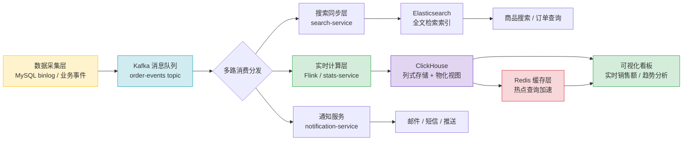

# 电商订单实时统计分析平台

> 学习路线对应：综合实战（第1-8周知识串联）
> 技术栈：Spring Boot + Kafka + MySQL + Elasticsearch + ClickHouse + Spring Cloud + Docker + K8s
> 项目目标：构建一个完整的电商订单实时统计分析系统，覆盖订单创建、消息驱动、数据同步、搜索和分析全链路

> 📖 **参考链接**：
> - [Kafka 官方文档](https://kafka.apache.org/documentation/) -- Kafka 消息队列核心概念、生产者/消费者配置说明
> - [Flink 官方文档](https://flink.apache.org/docs/) -- Flink 流处理引擎，实时 ETL 与窗口计算参考
> - [ClickHouse 官方文档](https://clickhouse.com/docs/) -- ClickHouse 列式数据库，MergeTree 引擎与物化视图指南
> - [Redis 官方文档](https://redis.io/docs/) -- Redis 缓存、数据结构与持久化配置
> - [Elasticsearch 官方指南](https://www.elastic.co/guide/) -- ES 全文检索、索引设计与聚合查询

---

## 本文目录

- [一、项目架构](#一项目架构)
- [二、模块设计](#二模块设计)
- [三、微服务架构](#三微服务架构)
- [四、容器化部署](#四容器化部署)
- [五、性能优化](#五性能优化)
- [六、常见面试问题（基于项目）](#六常见面试问题基于项目)

## 一、项目架构

### 1.1 整体架构

```
用户端（Vue 3）→ Gateway（Spring Cloud Gateway）
  → order-service（Spring Boot + JPA + MySQL）
    → Kafka（订单创建事件）
      → search-service（消费 → 写入 Elasticsearch）
      → stats-service（消费 → 写入 ClickHouse）
      → notification-service（消费 → 发送邮件/短信）
```

**数据流向**：
1. 用户通过前端页面下单
2. 请求经过 Gateway 路由到 order-service
3. order-service 写入 MySQL 并发送 Kafka 消息
4. search-service 消费消息，将订单数据写入 ES（供搜索）
5. stats-service 消费消息，将订单数据写入 ClickHouse（供统计分析）
6. notification-service 消费消息，发送通知

### 1.2 技术选型与理由

| 组件 | 选型 | 版本 | 理由 |
|------|------|------|------|
| 后端框架 | Spring Boot | 3.x | 生态成熟，社区活跃，与 Spring Cloud 无缝集成 |
| ORM | Spring Data JPA | 3.x | 快速开发，减少 SQL 编写 |
| 消息队列 | Kafka | 3.x | 高吞吐（百万 TPS），适合订单事件流 |
| 搜索引擎 | Elasticsearch | 8.x | 全文检索，商品搜索核心能力 |
| 分析数据库 | ClickHouse | 23.x | 列式存储，聚合分析性能极佳（秒级十亿行） |
| 关系数据库 | MySQL | 8.0 | 事务支持，业务主存储 |
| 服务注册/配置 | Nacos | 2.x | 阿里开源，同时支持服务发现和配置管理 |
| 网关 | Spring Cloud Gateway | 4.x | 响应式网关，性能优于 Zuul |
| 熔断降级 | Sentinel | 1.8.x | 流量控制、熔断降级 |
| 容器化 | Docker + K8s | 最新稳定版 | 标准化部署，弹性伸缩 |

### 1.3 系统架构图（文字描述）

```
┌─────────────────────────────────────────────────────────────────┐
│                        外部请求                                   │
│                   Vue 3 前端 / 移动端                             │
└─────────────────────────┬───────────────────────────────────────┘
                          │
                          ▼
┌─────────────────────────────────────────────────────────────────┐
│              Spring Cloud Gateway (网关层)                        │
│        路由转发 / JWT 鉴权 / Sentinel 限流                        │
└──────┬──────────────┬──────────────┬──────────────┬──────────────┘
       │              │              │              │
       ▼              ▼              ▼              ▼
┌──────────┐  ┌──────────┐  ┌──────────┐  ┌──────────────────┐
│  order-  │  │  search- │  │  stats-  │  │  notification-   │
│  service │  │  service │  │  service │  │  service         │
│  (8081)  │  │  (8082)  │  │  (8083)  │  │  (8084)          │
└────┬─────┘  └────┬─────┘  └────┬─────┘  └────────┬─────────┘
     │             │             │                  │
     ▼             │             │                  │
┌─────────┐        │             │                  │
│  MySQL  │        │             │                  │
└────┬────┘        │             │                  │
     │             │             │                  │
     └───────┬─────┴─────────────┴──────────────────┘
             │
             ▼
      ┌──────────┐
      │  Kafka   │  (order-events topic)
      └────┬─────┘
           │
    ┌──────┼──────┬──────────────┐
    ▼      ▼      ▼              ▼
┌──────┐ ┌──────┐ ┌──────────┐ ┌──────────────┐
│  ES  │ │  CH  │ │  Redis   │ │  Email/SMS   │
│(搜索)│ │(统计)│ │  (缓存)  │ │  (通知)      │
└──────┘ └──────┘ └──────────┘ └──────────────┘
```

> **生活化类比：实时数仓=新闻直播间** —— 实时数仓就像新闻直播间。传统数据库（MySQL）是"录播节目"——事情发生、录制、剪辑、定时播出，观众看到的永远是"昨天的新闻"（T+1 报表）。实时数仓则是"直播间"——订单一下单，数据立刻通过 Kafka（信号传输车）实时流到 ClickHouse（直播大屏），运营看板上的数字秒级跳动，就像直播间里主持人实时播报"刚刚又成交了一单"。本项目中 Kafka 充当高速数据通道，ClickHouse 充当实时分析引擎，两者配合实现了从"录播"到"直播"的跨越。

> **生活化类比：批处理=周报** —— 批处理就像每周写周报。数据攒了一周（HDFS/数据仓库里的历史数据），周一早上跑个定时任务（MapReduce/Spark Batch），跑几个小时出一份报表——"上周总销售额 500 万"。优点是数据全、计算准、能做复杂分析；缺点是"新鲜度"差，看到报告时事情已经过去一周了。实时处理则是"每发生一笔就更新一次看板"——新鲜但计算能力有限。这就是为什么很多企业两者并存：实时看"今天怎么样"，批处理看"这个月/这一年趋势如何"。

> **生活化类比：lambda架构=双轨制** —— Lambda 架构就像铁路的"双轨制"——一条轨道跑高铁（速度层/实时层），一条跑货运慢车（批处理层）。高铁负责快速送达紧急物资（实时统计当天销售额），慢车负责运送大宗货物（离线计算全年的历史趋势）。两条轨道并行运行，最后在终点站（服务层）汇合——实时数据先到先用，批处理数据到了后覆盖修正。本项目的架构也体现了这个思想：Kafka + ClickHouse 是"高铁"（实时层），MySQL + 定时 ETL 是"慢车"（批处理层），前端看板则同时消费两路数据。双轨制的好处是"既快又准"——实时层保证新鲜度，批处理层保证准确度。

**实时统计分析系统架构 Mermaid 图**：



> 上图展示了电商订单实时统计分析平台的完整数据链路：数据采集层通过 MySQL binlog 和业务事件写入 Kafka，统计服务、搜索服务和通知服务分别消费消息并写入各自的存储（ClickHouse 做实时聚合分析、Elasticsearch 做全文检索、通知服务推送告警），最终通过可视化看板对外展示，Redis 缓存层加速热点查询。

---

## 二、模块设计

### 2.1 order-service（订单服务）

**核心职责**：订单的创建、查询、取消，以及订单事件的生产。

**数据库设计**：
```sql
CREATE TABLE orders (
    id            BIGINT AUTO_INCREMENT PRIMARY KEY,
    order_no      VARCHAR(32) NOT NULL UNIQUE COMMENT '订单编号',
    user_id       BIGINT NOT NULL COMMENT '用户 ID',
    product_id    BIGINT NOT NULL COMMENT '商品 ID',
    product_name  VARCHAR(200) COMMENT '商品名称',
    category      VARCHAR(50) COMMENT '商品分类',
    amount        DECIMAL(10, 2) NOT NULL COMMENT '订单金额',
    quantity      INT NOT NULL DEFAULT 1 COMMENT '商品数量',
    status        VARCHAR(20) NOT NULL DEFAULT 'CREATED' COMMENT '订单状态',
    create_time   DATETIME NOT NULL DEFAULT CURRENT_TIMESTAMP,
    update_time   DATETIME NOT NULL DEFAULT CURRENT_TIMESTAMP ON UPDATE CURRENT_TIMESTAMP,
    INDEX idx_user_id (user_id),
    INDEX idx_create_time (create_time)
) ENGINE=InnoDB DEFAULT CHARSET=utf8mb4;
```

**核心 API**：

| 方法 | 路径 | 说明 |
|------|------|------|
| POST | `/orders` | 创建订单 |
| GET | `/orders/{id}` | 查询订单详情 |
| GET | `/orders?userId={userId}&page={page}&size={size}` | 分页查询用户订单 |
| PUT | `/orders/{id}/cancel` | 取消订单 |

**创建订单核心代码**：
```java
@RestController
@RequestMapping("/orders")
@Slf4j
public class OrderController {

    @Autowired
    private OrderService orderService;

    @PostMapping
    public Result<OrderVO> createOrder(@RequestBody @Valid CreateOrderDTO dto) {
        OrderVO order = orderService.createOrder(dto);
        return Result.success(order);
    }
}

@Service
@Slf4j
public class OrderService {

    @Autowired
    private OrderRepository orderRepository;

    @Autowired
    private KafkaTemplate<String, OrderEvent> kafkaTemplate;

    @Transactional(rollbackFor = Exception.class)
    public OrderVO createOrder(CreateOrderDTO dto) {
        // 1. 构建订单实体
        Order order = new Order();
        order.setOrderNo(generateOrderNo());
        order.setUserId(dto.getUserId());
        order.setProductId(dto.getProductId());
        order.setProductName(dto.getProductName());
        order.setCategory(dto.getCategory());
        order.setAmount(dto.getAmount());
        order.setQuantity(dto.getQuantity());
        order.setStatus("CREATED");

        // 2. 保存到 MySQL
        order = orderRepository.save(order);
        log.info("订单已保存到 MySQL, orderId={}", order.getId());

        // 3. 发送 Kafka 事件（与数据库写入在同一事务中）
        OrderEvent event = OrderEvent.builder()
            .orderId(order.getId())
            .orderNo(order.getOrderNo())
            .userId(order.getUserId())
            .productId(order.getProductId())
            .productName(order.getProductName())
            .category(order.getCategory())
            .amount(order.getAmount())
            .quantity(order.getQuantity())
            .eventType("ORDER_CREATED")
            .createTime(order.getCreateTime())
            .build();

        // 使用事务消息确保一致性
        kafkaTemplate.executeInTransaction(operations -> {
            operations.send("order-events", String.valueOf(order.getId()), event);
            return true;
        });
        log.info("Kafka 消息已发送, orderId={}", order.getId());

        return OrderVO.from(order);
    }
}
```

**事务一致性保证**：
- 使用 `@Transactional` 确保 MySQL 写入和 Kafka 发送在同一个本地事务中
- 通过 `kafkaTemplate.executeInTransaction()` 发送事务消息
- 如果 Kafka 发送失败，MySQL 写入也会回滚

### 2.2 search-service（搜索服务）

**核心职责**：消费 Kafka 订单事件，维护 ES 中的商品搜索索引。

**ES 索引设计**：
```json
PUT /products
{
  "settings": {
    "number_of_shards": 3,
    "number_of_replicas": 1,
    "refresh_interval": "5s",
    "analysis": {
      "analyzer": {
        "ik_pinyin": {
          "type": "custom",
          "tokenizer": "ik_max_word",
          "filter": ["lowercase"]
        }
      }
    }
  },
  "mappings": {
    "properties": {
      "productId":    { "type": "long" },
      "productName":  {
        "type": "text",
        "analyzer": "ik_max_word",
        "search_analyzer": "ik_smart",
        "fields": { "keyword": { "type": "keyword" } }
      },
      "category":     { "type": "keyword" },
      "price":        { "type": "double" },
      "salesCount":   { "type": "integer" },
      "rating":       { "type": "float" },
      "tags":         { "type": "keyword" },
      "status":       { "type": "keyword" },
      "createTime":   { "type": "date", "format": "yyyy-MM-dd HH:mm:ss" }
    }
  }
}
```

**Kafka 消费者**：
```java
@Component
@Slf4j
public class OrderEventConsumer {

    @Autowired
    private ElasticsearchRestTemplate esTemplate;

    @KafkaListener(topics = "order-events", groupId = "search-service-group")
    public void handleOrderEvent(ConsumerRecord<String, OrderEvent> record) {
        OrderEvent event = record.value();
        log.info("收到订单事件, orderId={}, eventType={}", event.getOrderId(), event.getEventType());

        try {
            // 更新 ES 中的商品销量（增加销量计数）
            UpdateRequest updateRequest = new UpdateRequest("products", 
                String.valueOf(event.getProductId()));
            updateRequest.script(new Script(
                ScriptType.INLINE, "painless",
                "ctx._source.salesCount = (ctx._source.salesCount ?: 0) + params.quantity",
                Collections.singletonMap("quantity", event.getQuantity())
            ));
            updateRequest.upsert(buildProductDoc(event));
            
            esTemplate.update(updateRequest, IndexCoordinates.of("products"));
            log.info("ES 商品索引已更新, productId={}", event.getProductId());
        } catch (Exception e) {
            log.error("ES 更新失败, orderId={}", event.getOrderId(), e);
            throw new RuntimeException("ES 更新失败", e);
        }
    }
}
```

**搜索 API**：
```java
@RestController
@RequestMapping("/search")
public class SearchController {

    @Autowired
    private ElasticsearchRestTemplate esTemplate;

    @GetMapping("/products")
    public Result<PageResult<ProductDoc>> search(SearchDTO dto) {
        NativeSearchQueryBuilder queryBuilder = new NativeSearchQueryBuilder();

        // 关键词搜索（全文检索）
        if (StringUtils.hasText(dto.getKeyword())) {
            queryBuilder.withQuery(QueryBuilders.boolQuery()
                .must(QueryBuilders.multiMatchQuery(dto.getKeyword(), "productName^3", "tags"))
                .filter(QueryBuilders.termQuery("status", "ON_SALE"))
            );
        }

        // 分类过滤
        if (StringUtils.hasText(dto.getCategory())) {
            queryBuilder.withFilter(QueryBuilders.termQuery("category", dto.getCategory()));
        }

        // 价格区间过滤
        if (dto.getMinPrice() != null || dto.getMaxPrice() != null) {
            queryBuilder.withFilter(QueryBuilders.rangeQuery("price")
                .gte(dto.getMinPrice()).lte(dto.getMaxPrice()));
        }

        // 排序
        queryBuilder.withSorts(getSortBuilders(dto.getSortBy()));

        // 高亮
        queryBuilder.withHighlightBuilder(
            new HighlightBuilder().field("productName").preTags("<em>").postTags("</em>"));

        // 分页
        queryBuilder.withPageable(PageRequest.of(dto.getPage(), dto.getSize()));

        // 聚合统计
        queryBuilder.addAggregation(AggregationBuilders.terms("category_agg").field("category"));
        queryBuilder.addAggregation(AggregationBuilders.range("price_range").field("price")
            .addRange(0, 100).addRange(100, 500).addRange(500, 1000).addRange(1000, Double.MAX_VALUE));

        SearchHits<ProductDoc> searchHits = esTemplate.search(
            queryBuilder.build(), ProductDoc.class, IndexCoordinates.of("products"));

        return Result.success(PageResult.from(searchHits));
    }
}
```

### 2.3 stats-service（统计服务）

**核心职责**：消费 Kafka 订单事件，写入 ClickHouse，提供统计分析 API。

**ClickHouse 表设计**：
```sql
CREATE TABLE order_events (
    event_time      DateTime,
    event_date      Date DEFAULT toDate(event_time),
    order_id        UInt64,
    order_no        String,
    user_id         UInt64,
    product_id      UInt64,
    product_name    String,
    category        LowCardinality(String),
    amount          Decimal(10, 2),
    quantity        UInt16,
    event_type      LowCardinality(String),
    status          LowCardinality(String)
)
ENGINE = MergeTree()
PARTITION BY toYYYYMM(event_time)
ORDER BY (event_date, category, event_time)
TTL event_time + INTERVAL 180 DAY;
```

**物化视图（预聚合）**：
```sql
-- 每小时销售额和订单数
CREATE TABLE order_hourly_stats (
    hour            DateTime,
    category        LowCardinality(String),
    order_count     UInt64,
    total_amount    Decimal(20, 2),
    user_count      UInt64,
    avg_amount      Decimal(10, 2)
)
ENGINE = SummingMergeTree()
PARTITION BY toYYYYMM(hour)
ORDER BY (category, hour);

CREATE MATERIALIZED VIEW mv_order_hourly TO order_hourly_stats AS
SELECT
    toStartOfHour(event_time) AS hour,
    category,
    count() AS order_count,
    sum(amount) AS total_amount,
    uniq(user_id) AS user_count,
    avg(amount) AS avg_amount
FROM order_events
GROUP BY hour, category;
```

**Kafka 消费者**：
```java
@Component
@Slf4j
public class OrderEventConsumer {

    @Autowired
    @Qualifier("clickHouseJdbcTemplate")
    private JdbcTemplate clickHouseJdbcTemplate;

    private final List<OrderEvent> buffer = new ArrayList<>();
    private final int BATCH_SIZE = 1000;

    @KafkaListener(topics = "order-events", groupId = "stats-service-group")
    public void handleOrderEvent(OrderEvent event) {
        synchronized (buffer) {
            buffer.add(event);
            if (buffer.size() >= BATCH_SIZE) {
                flush();
            }
        }
    }

    @Scheduled(fixedDelay = 5000)  // 每 5 秒 flush 一次
    public void scheduledFlush() {
        synchronized (buffer) {
            if (!buffer.isEmpty()) {
                flush();
            }
        }
    }

    private void flush() {
        if (buffer.isEmpty()) return;
        List<OrderEvent> batch = new ArrayList<>(buffer);
        buffer.clear();

        String sql = "INSERT INTO order_events " +
            "(event_time, order_id, order_no, user_id, product_id, product_name, " +
            " category, amount, quantity, event_type, status) " +
            "VALUES (?, ?, ?, ?, ?, ?, ?, ?, ?, ?, ?)";

        clickHouseJdbcTemplate.batchUpdate(sql, batch, batch.size(),
            (ps, event) -> {
                ps.setObject(1, event.getCreateTime());
                ps.setLong(2, event.getOrderId());
                ps.setString(3, event.getOrderNo());
                ps.setLong(4, event.getUserId());
                ps.setLong(5, event.getProductId());
                ps.setString(6, event.getProductName());
                ps.setString(7, event.getCategory());
                ps.setBigDecimal(8, event.getAmount());
                ps.setInt(9, event.getQuantity());
                ps.setString(10, event.getEventType());
                ps.setString(11, "CREATED");
            });
        log.info("批量写入 ClickHouse, 数量={}", batch.size());
    }
}
```

**统计分析 API**：
```java
@RestController
@RequestMapping("/stats")
public class StatsController {

    @Autowired
    @Qualifier("clickHouseJdbcTemplate")
    private JdbcTemplate chJdbcTemplate;

    @GetMapping("/hourly")
    public Result<List<Map<String, Object>>> hourlyStats(
            @RequestParam String date,
            @RequestParam(required = false) String category) {
        // 直接查询预聚合表，毫秒级响应
        String sql = "SELECT hour, category, order_count, total_amount, user_count, avg_amount " +
                     "FROM order_hourly_stats " +
                     "WHERE toDate(hour) = ? " +
                     (category != null ? "AND category = ? " : "") +
                     "ORDER BY hour";
        return category != null
            ? Result.success(chJdbcTemplate.queryForList(sql, date, category))
            : Result.success(chJdbcTemplate.queryForList(sql, date));
    }

    @GetMapping("/category-summary")
    public Result<List<Map<String, Object>>> categorySummary(
            @RequestParam String startDate, @RequestParam String endDate) {
        String sql = "SELECT category, sum(order_count) AS total_orders, " +
                     "sum(total_amount) AS total_amount, sum(user_count) AS total_users " +
                     "FROM order_hourly_stats " +
                     "WHERE toDate(hour) BETWEEN ? AND ? " +
                     "GROUP BY category ORDER BY total_amount DESC";
        return Result.success(chJdbcTemplate.queryForList(sql, startDate, endDate));
    }

    @GetMapping("/trend")
    public Result<List<Map<String, Object>>> dailyTrend(
            @RequestParam String startDate, @RequestParam String endDate) {
        // 按天趋势（从小时数据聚合）
        String sql = "SELECT toDate(hour) AS day, sum(order_count) AS orders, " +
                     "sum(total_amount) AS amount, sum(user_count) AS users " +
                     "FROM order_hourly_stats " +
                     "WHERE toDate(hour) BETWEEN ? AND ? " +
                     "GROUP BY day ORDER BY day";
        return Result.success(chJdbcTemplate.queryForList(sql, startDate, endDate));
    }
}
```

### 2.4 notification-service（通知服务）

**核心职责**：消费 Kafka 订单事件，发送通知，保证幂等性。

```java
@Component
@Slf4j
public class NotificationConsumer {

    @Autowired
    private EmailService emailService;

    @Autowired
    private RedisTemplate<String, String> redisTemplate;

    @KafkaListener(topics = "order-events", groupId = "notification-service-group")
    public void handleOrderEvent(ConsumerRecord<String, OrderEvent> record) {
        OrderEvent event = record.value();

        // 幂等性保证：基于 orderId 去重
        String dedupKey = "notification:order:" + event.getOrderId();
        Boolean success = redisTemplate.opsForValue()
            .setIfAbsent(dedupKey, "1", Duration.ofHours(24));
        if (Boolean.FALSE.equals(success)) {
            log.info("重复通知，跳过, orderId={}", event.getOrderId());
            return;
        }

        try {
            // 发送邮件通知
            emailService.sendOrderConfirmation(event.getUserId(), event.getOrderNo());
            log.info("订单通知已发送, orderId={}", event.getOrderId());
        } catch (Exception e) {
            // 发送失败，删除去重标记，允许重试
            redisTemplate.delete(dedupKey);
            log.error("通知发送失败, orderId={}", event.getOrderId(), e);
            throw new RuntimeException("通知发送失败", e);
        }
    }
}
```

---

## 三、微服务架构

### 3.1 服务注册与发现

**Nacos 配置**：
```yaml
# 每个微服务的 bootstrap.yml
spring:
  application:
    name: order-service
  cloud:
    nacos:
      discovery:
        server-addr: localhost:8848
        namespace: dev          # 命名空间隔离
        group: DEFAULT_GROUP
      config:
        server-addr: localhost:8848
        namespace: dev
        file-extension: yaml
        shared-configs:
          - data-id: common-config.yaml
            group: DEFAULT_GROUP
            refresh: true
```

**服务列表**：

| 服务名 | 端口 | 实例数 | 说明 |
|--------|------|--------|------|
| order-service | 8081 | 2 | 订单服务 |
| search-service | 8082 | 2 | 搜索服务 |
| stats-service | 8083 | 2 | 统计服务 |
| notification-service | 8084 | 2 | 通知服务 |
| gateway-service | 8080 | 2 | 网关服务 |

### 3.2 服务间调用

**OpenFeign 声明式调用**：
```java
@FeignClient(name = "search-service", path = "/internal")
public interface SearchFeignClient {

    @PutMapping("/products/{productId}/sales")
    Result<Void> updateSales(@PathVariable Long productId, @RequestBody UpdateSalesDTO dto);
}

// 在 order-service 中调用
@Service
public class OrderCompletionService {
    @Autowired
    private SearchFeignClient searchClient;

    public void updateProductSales(Long productId, Integer quantity) {
        searchClient.updateSales(productId, new UpdateSalesDTO(quantity));
    }
}
```

**Sentinel 熔断降级**：
```java
@FeignClient(name = "search-service", path = "/internal",
             fallbackFactory = SearchFeignFallbackFactory.class)
public interface SearchFeignClient {
    // ...
}

@Component
public class SearchFeignFallbackFactory implements FallbackFactory<SearchFeignClient> {
    @Override
    public SearchFeignClient create(Throwable cause) {
        return (productId, dto) -> {
            log.error("search-service 调用失败, productId={}", productId, cause);
            return Result.fail("搜索服务暂时不可用");
        };
    }
}
```

### 3.3 网关路由

```yaml
spring:
  cloud:
    gateway:
      routes:
        - id: order-service
          uri: lb://order-service
          predicates:
            - Path=/api/orders/**
          filters:
            - StripPrefix=1
            - name: RequestRateLimiter
              args:
                redis-rate-limiter.replenishRate: 100
                redis-rate-limiter.burstCapacity: 200

        - id: search-service
          uri: lb://search-service
          predicates:
            - Path=/api/search/**
          filters:
            - StripPrefix=1

        - id: stats-service
          uri: lb://stats-service
          predicates:
            - Path=/api/stats/**
          filters:
            - StripPrefix=1

      default-filters:
        - name: JwtAuthFilter     # 全局 JWT 鉴权
```

---

## 四、容器化部署

### 4.1 Docker Compose 编排

```yaml
version: '3.8'
services:
  mysql:
    image: mysql:8.0
    environment:
      MYSQL_ROOT_PASSWORD: root123
      MYSQL_DATABASE: order_db
    ports:
      - "3306:3306"
    healthcheck:
      test: ["CMD", "mysqladmin", "ping", "-h", "localhost"]
      interval: 10s
      timeout: 5s
      retries: 5

  zookeeper:
    image: confluentinc/cp-zookeeper:7.3.0
    environment:
      ZOOKEEPER_CLIENT_PORT: 2181

  kafka:
    image: confluentinc/cp-kafka:7.3.0
    depends_on:
      - zookeeper
    environment:
      KAFKA_BROKER_ID: 1
      KAFKA_ZOOKEEPER_CONNECT: zookeeper:2181
      KAFKA_ADVERTISED_LISTENERS: PLAINTEXT://kafka:9092
      KAFKA_OFFSETS_TOPIC_REPLICATION_FACTOR: 1
    ports:
      - "9092:9092"

  elasticsearch:
    image: elasticsearch:8.17.0
    environment:
      - discovery.type=single-node
      - xpack.security.enabled=false
      - "ES_JAVA_OPTS=-Xms512m -Xmx512m"
    ports:
      - "9200:9200"

  clickhouse:
    image: clickhouse/clickhouse-server:23.8
    ports:
      - "8123:8123"
      - "9000:9000"

  nacos:
    image: nacos/nacos-server:v2.2.0
    environment:
      - MODE=standalone
    ports:
      - "8848:8848"

  redis:
    image: redis:7-alpine
    ports:
      - "6379:6379"

  order-service:
    build: ./order-service
    depends_on:
      mysql:
        condition: service_healthy
      kafka:
        condition: service_started
    ports:
      - "8081:8081"

  search-service:
    build: ./search-service
    depends_on:
      - elasticsearch
      - kafka
    ports:
      - "8082:8082"

  stats-service:
    build: ./stats-service
    depends_on:
      - clickhouse
      - kafka
    ports:
      - "8083:8083"

  notification-service:
    build: ./notification-service
    depends_on:
      - kafka
      - redis
    ports:
      - "8084:8084"

  gateway-service:
    build: ./gateway-service
    depends_on:
      - nacos
    ports:
      - "8080:8080"
```

### 4.2 K8s 部署

**Deployment 示例（order-service）**：
```yaml
apiVersion: apps/v1
kind: Deployment
metadata:
  name: order-service
  namespace: ecommerce
spec:
  replicas: 2
  selector:
    matchLabels:
      app: order-service
  template:
    metadata:
      labels:
        app: order-service
    spec:
      containers:
        - name: order-service
          image: ecommerce/order-service:1.0.0
          ports:
            - containerPort: 8081
          env:
            - name: SPRING_PROFILES_ACTIVE
              value: "k8s"
          envFrom:
            - configMapRef:
                name: order-service-config
          resources:
            requests:
              memory: "512Mi"
              cpu: "500m"
            limits:
              memory: "1Gi"
              cpu: "1000m"
          livenessProbe:
            httpGet:
              path: /actuator/health/liveness
              port: 8081
            initialDelaySeconds: 30
            periodSeconds: 10
          readinessProbe:
            httpGet:
              path: /actuator/health/readiness
              port: 8081
            initialDelaySeconds: 10
            periodSeconds: 5
---
apiVersion: v1
kind: Service
metadata:
  name: order-service
  namespace: ecommerce
spec:
  selector:
    app: order-service
  ports:
    - port: 8081
      targetPort: 8081
  type: ClusterIP
```

**ConfigMap 示例**：
```yaml
apiVersion: v1
kind: ConfigMap
metadata:
  name: order-service-config
  namespace: ecommerce
data:
  SPRING_DATASOURCE_URL: "jdbc:mysql://mysql-service:3306/order_db?useSSL=false&serverTimezone=Asia/Shanghai"
  SPRING_DATASOURCE_USERNAME: "root"
  KAFKA_BOOTSTRAP_SERVERS: "kafka-service:9092"
  NACOS_SERVER_ADDR: "nacos-service:8848"
```

**HPA（水平自动扩缩）**：
```yaml
apiVersion: autoscaling/v2
kind: HorizontalPodAutoscaler
metadata:
  name: order-service-hpa
  namespace: ecommerce
spec:
  scaleTargetRef:
    apiVersion: apps/v1
    kind: Deployment
    name: order-service
  minReplicas: 2
  maxReplicas: 10
  metrics:
    - type: Resource
      resource:
        name: cpu
        target:
          type: Utilization
          averageUtilization: 70
    - type: Resource
      resource:
        name: memory
        target:
          type: Utilization
          averageUtilization: 80
```

---

## 五、性能优化

### 5.1 Kafka 优化

| 优化项 | 配置 | 说明 |
|--------|------|------|
| 分区数 | 6（3 个 Broker × 2） | 提高并行消费能力 |
| Producer 批量发送 | `batch.size=16KB, linger.ms=10` | 减少网络请求次数 |
| Producer 压缩 | `compression.type=snappy` | 减少网络传输量 |
| Consumer 批量拉取 | `max.poll.records=500` | 减少拉取次数 |
| 消费并行度 | concurrency=3 | 与分区数匹配 |

### 5.2 ES 优化

| 优化项 | 配置 | 说明 |
|--------|------|------|
| 分片数 | 3 Primary + 1 Replica | 单分片 10-50GB |
| 关闭不必要索引 | `index: false` | 减少索引大小 |
| 批量写入 | bulk API，每批 500 条 | 减少网络开销 |
| 搜索优化 | `filter` 替代 `must` | 利用缓存 |
| 聚合优化 | `size: 0` 不返回文档 | 只返回聚合结果 |

### 5.3 ClickHouse 优化

| 优化项 | 配置 | 说明 |
|--------|------|------|
| 按天分区 | `PARTITION BY toYYYYMMDD` | 查询裁剪 |
| 批量写入 | 每 1000 条或每 5 秒 flush | 减少 Part 数量 |
| 物化视图 | 预聚合热点查询 | 毫秒级响应 |
| 数据类型 | LowCardinality、UInt | 减少内存占用 |
| 压缩算法 | ZSTD | 压缩比更高 |

### 5.4 微服务优化

| 优化项 | 说明 |
|--------|------|
| 连接池 | HikariCP，最小 5 最大 20 |
| 线程池 | 自定义线程池隔离 Kafka 消费线程 |
| 缓存 | Redis 缓存热点数据（商品信息、分类列表） |
| 异步 | 非核心逻辑异步化（如日志记录、审计） |
| 限流 | Sentinel 网关层 + 服务层双重限流 |

---

## 六、常见面试问题（基于项目）

### 1. 如何保证订单创建和 Kafka 消息发送的一致性？

**答**：使用 `@Transactional` 事务管理 + Kafka 事务消息。在同一个本地事务中，先写入 MySQL 订单数据，再通过 `kafkaTemplate.executeInTransaction()` 发送 Kafka 消息。如果消息发送失败，MySQL 事务回滚，保证数据一致性。如果消息发送成功但消费者处理失败，由 Kafka 消费者组的重试机制保证最终一致性（手动提交 offset，处理成功后才提交）。

### 2. ES 数据同步延迟如何处理？

**答**：数据同步链路为：MySQL → Kafka → ES 消费者。延迟来源：MySQL binlog 写入 → Kafka 发送 → 消费写入。Canal 解析 binlog 近实时（秒级），Kafka 传输延迟毫秒级，ES 写入延迟约 1-2 秒（含 refresh）。总体延迟在 3-5 秒内，对搜索场景可接受。对于实时性要求极高的查询（如确认订单是否已同步），可先查 MySQL 再查 ES 作为兜底。

### 3. ClickHouse 和 ES 在这个项目中各司什么职？

**答**：ES 负责**商品搜索**（全文检索）：利用倒排索引实现关键词搜索、分词匹配、高亮显示、相关性排序。ClickHouse 负责**统计分析**（聚合计算）：利用列式存储实现海量数据的聚合查询（PV/UV、销售额、趋势分析）。两者各司其职，通过 Kafka 异步同步数据，互不影响。

### 4. 微服务之间如何保证数据一致性？

**答**：采用**最终一致性**方案，通过 Kafka 异步解耦：
- order-service 创建订单后发送 Kafka 事件
- search-service、stats-service、notification-service 各自消费事件，独立处理
- 每个消费者保证幂等性（基于 orderId 去重）
- 如果消费者处理失败，Kafka 重试机制保证消息不丢失
- 关键业务（如库存扣减）使用 Seata 分布式事务

### 5. 如何扩展系统支持更大流量？

**答**：多维度扩展：
- **Kafka**：增加分区数（与 Broker 配合），提高并行消费能力
- **ES**：增加 Data Node，提高搜索和写入吞吐
- **ClickHouse**：使用分布式表 + 分片，水平扩展
- **微服务**：K8s HPA 自动扩缩，根据 CPU/内存/QPS 自动增减实例
- **网关**：增加 Gateway 实例，Nginx 负载均衡
- **数据库**：MySQL 读写分离 + 分库分表

### 6. 项目中如何处理消息重复消费？

**答**：利用 Redis 实现幂等性：
- 消费消息时，以 `orderId + eventType` 作为唯一键写入 Redis（`setIfAbsent`，设置过期时间）
- 如果写入成功，表示首次消费，执行正常业务逻辑
- 如果写入失败（已存在），表示重复消费，跳过处理
- 业务处理失败时，删除 Redis 去重标记，允许重试时重新处理

### 7. 为什么选择 Kafka 而不是 RocketMQ 或 RabbitMQ？

**答**：Kafka 的核心优势在于**高吞吐**和**持久化**：
- 高吞吐：百万 TPS 级别，适合订单事件流这种高频写入场景
- 持久化：消息写入磁盘，支持消息回溯和重复消费
- 分区机制：天然支持并行消费，水平扩展能力强
- 生态成熟：与大数据生态（Spark、Flink、ClickHouse）无缝集成
- RocketMQ 在事务消息方面更优，但本项目 Kafka 的事务消息已能满足需求

## 本章学习自检

完成本章学习后，应该能够：
- [ ] 用自己的话解释项目整体架构、数据流向（MySQL -> Kafka -> ES/ClickHouse）、各服务职责与技术选型理由
- [ ] 手写核心模块代码（订单创建 + Kafka 发送、ES 搜索 + 聚合、ClickHouse 批量写入 + 统计分析）
- [ ] 回答常见面试题（订单与 Kafka 一致性保证、ES 数据同步延迟处理、ClickHouse vs ES 职责分工、微服务间数据一致性、消息重复消费处理等）
- [ ] 在实战项目中借鉴此架构搭建自己的实时统计分析系统
- [ ] 识别并避免常见错误（事务消息配置不当、消费者幂等性缺失、ClickHouse 批量写入不及时、ES 分片规划不合理等）

---

> **学习导航**：
> - 返回 [学习路线总览](../../README.md)
> - 关联模块：[01 Java 基础](../../01-java-basics/) | [02 JavaWeb 单体架构](../../02-javaweb-monolith/) | [03 分布式微服务](../../03-distributed-microservices/) | [04 Python AI Agent](../../04-python-aiagent/)
> - 实战应用：[电商订单实时统计分析平台](./01-电商订单实时统计分析平台.md)

