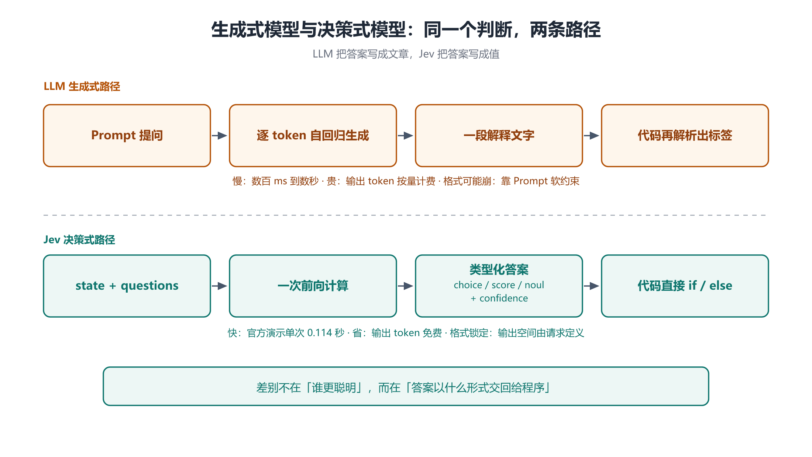

# 第 1 章 决策式模型的诞生：Jev 是什么，为什么它不说话

## 一、这一章要解决的问题

2026 年 9 月中旬，一个叫 **Jev** 的模型在中文互联网上被反复提起，很快被概括成一句话 —— **「只会做选择的新模型」**。它不聊天、不写文章、不写代码，你甚至没法像用 ChatGPT 那样跟它对话。

这一章回答四个问题：

- **它是什么**：Jev 到底输入什么、输出什么？
- **谁做的**：为什么是一批做 RLHF 的人跑出来做「不说话的模型」？
- **凭什么**：官方声称快 193.6 倍、便宜 444.6 倍，这个数从哪来？
- **分界线在哪**：生成式模型与决策式模型，差别到底在哪一个环节？

后面五章都建立在这一章画出的那条分界线上，所以这一章先把「生成式 / 决策式」这条线画清楚，再谈细节。

> ⚠️ **时点提醒**：Jev 于 2026-09-15 结束两年隐身状态正式发布【三方】，本笔记记录于 2026-09-28，即发布后第 13 天。官方**未公开架构**，定价与限流仍在动态调整。本笔记是**时间切片**，不是长期结论。

## 二、机制与原理

### 2.1 一个函数，两种输出空间

先回到基础模型的定义。在 [`docs/大模型与神经网络原理笔记/`](../大模型与神经网络原理笔记/ch01_raw_model.md) 第 1 章里，基础模型被拆到最底层：

```text
Raw Model( token 列表 ) → 下一个 token 的概率分布
```

模型本身**只会输出概率分布**。要得到一句完整的话，得把这个函数反复调用 —— 每次取一个 token 追加回输入，再算下一个，这就是**自回归**。所谓「聊天」「写文章」「写代码」，全都是在这个循环外面套出来的效果。

Jev 保留了前半句，改掉了后半句。

它**仍然是一个神经网络，仍然输出概率**；但概率不再摊在「词表里下一个 token 是谁」上，而是摊在**调用方预先定义好的选项**上。于是同一套「算概率」的机制，产出的东西从「一段文字」变成了「一个判断」。

| | 生成式模型（LLM） | 决策式模型（Jev） |
|---|---|---|
| 输出空间 | 整个词表（几万到几十万 token） | 调用方定义的那几个选项 |
| 产出形式 | 自由文本，需要再解析 | 类型化的值，可直接进 `if / else` |
| 调用方式 | 一次调用生成一串 token（自回归） | 一次前向给出一个判断（并行求值多个问题） |
| 服务对象 | **人**读 | **程序**用 |
| 输出 token | 按量计费 | 免费【官方】 |
| 出错形态 | 可能格式崩、可能编出不存在的选项 | 不会格式崩；**仍可能选错** |

这条分界线是本笔记的地基：**Jev 的创新不在「算得更准」，而在「把输出空间从词表换成了调用方定义的选项集」**。

### 2.2 它输出什么：一个值，不是一个答案

Jev 的每次响应给出的不是一个「答案」，而是一个**带确定性的判断**。官方把它归纳成三类原语（第 2 章展开）：

- `choice` —— 从你定义的选项里选一个，同时返回**全量概率分布**；
- `score` —— 沿你定义的有序量表打分，返回**概率加权值**；
- `noul` —— 是 / 否问题，返回 **0 到 1 的概率**。

`choice` 与 `score` 还会额外带一个 `confidence`（0 到 1），由概率分布导出【官方】。

这就把「判断」拆成了两个可以分开使用的信息：**选了什么**，以及**有多确定**。传统做法是让 LLM 生成一段 JSON，再从里面把标签抠出来 —— 只拿到「选了什么」；Jev 直接把「有多确定」也交出来，这是第 5 章「置信度分流」能成立的前提。

### 2.3 为什么要造它：一批做 RLHF 的人反过来质疑 RLHF

Jev 出自旧金山的 **TypeSafe AI**，创始人 **Diogo Almeida** 先后在 Google Brain 与 OpenAI 做研究，深度参与了 RLHF（基于人类反馈的强化学习）这条技术路线 —— 官方称 RLHF 由他共同发明【官方】。署名方面另有硬证据：他是 **InstructGPT 论文（arXiv:2203.02155）的第 4 作者**，也出现在 **GPT-4 技术报告（arXiv:2303.08774）的贡献者名单**中（归在 Reinforcement Learning & Alignment 板块的 Foundational RLHF and InstructGPT work 等分组）【一手】。

他做 Jev 的动机，恰恰来自对 RLHF 的反思。综合他在访谈与播客上的公开发言【三方】：

- **聊天能力没有自然带来自动化。** 模型已经很会说话，却仍需要人给目标、检查结果并承担错误 —— ChatGPT 与各类编码助手依然属于「辅助工具」。
- **RLHF 优化的是人的偏好。** 人类更容易奖励流畅、自信、看起来有帮助的回答。这让模型更好用，**也可能让它在没有把握时表现得过于肯定**。
- **自动化需要可靠的不确定性。** 软件除了要知道模型选了什么，还要知道这个选择有多可信；置信度足够可靠，程序才能决定「自动执行 / 再检查一次 / 交给人」。
- **判断应该直接交给代码。** LLM 经常先生成一段解释，程序再从中提取标签；Jev 直接返回规定好的类型和概率。

一句话概括这个转向：**面向人的 AI 被训练成取悦和辅助人；而模型能够为程序提供可靠决策，才有可能真正实现自动化**【三方】。

### 2.4 名字的来历：杰文斯悖论

**Jev** 这个名字取自 19 世纪经济学家 **William Stanley Jevons（威廉·斯坦利·杰文斯）**【三方】。

杰文斯观察到一个反直觉的现象：蒸汽机效率提高、单位煤耗下降之后，**英国的煤炭总消耗量反而上升了** —— 因为成本降下来，用得起蒸汽机的场景变多了。这就是后来被称为**杰文斯悖论**的东西：**效率提升不一定减少总消耗，反而可能放大总消耗。**

把这个类比放到 Jev 身上，逻辑是：如果单次判断的成本从「一次 LLM 调用」降到「一次几乎免费的判断」，那么软件里愿意做判断的地方会**暴增** —— 过去因为太贵而不做的路由、过滤、校验、打分，全都可以补上。**总智能需求因此上升，而不是下降。**

### 2.5 System One：名字借自思维心理学

官方给 Jev 的定位是「**System One 模型**」【官方】。这个名字借自思维心理学中「快思考 / 慢思考」的划分：

- **System Two** 是缓慢、审慎、语言化的推理 —— 这正是 LLM 写出答案时所模仿的东西；
- **System One** 是眨眼之间发生的快速、直觉式判断。

Jev 要占据的是后者在软件里的位置：**那数以百万计、又小又快、根本不该动用一整段生成文本的决策** —— 路由、打分、过滤、抽取、放行【官方】。



上图把这条分界线画成了两条工程路径：上半是 LLM 的「生成 → 再解析」，下半是 Jev 的「一次前向 → 直接给值」。**差别不在谁更聪明，而在答案以什么形式交回给程序。**

### 2.6 发布与采用

- **发布**：2026-09-15 结束两年隐身状态推出 Jev；同时宣布由 DCVC 领投的 **4000 万美元种子轮融资**【三方】。⚠️ 部分报道记作 9 月 19 日发布，与 9-15 存在分歧，本笔记以 9-15 为准。
- **分发**：官方 HTTP API（`api.typesafe.ai`），并经 OpenRouter、Vercel AI Gateway 等第三方平台接入【官方】【三方】。
- **采用速度**：上线 Vercel AI Gateway 后 24 小时内，被接近 13% 的付费团队使用；截至 2026-09-21，Jev 在该平台占到约 21.2% 的请求量、触达 29% 的团队【三方】。⚠️ 该平台当时正在做限时免费推广（9-25 结束），采用率**不能直接等同于商业成功**。

## 三、工程实践

### 3.1 什么时候该想到 Jev

把判断交给 Jev 之前，先自检这四个条件（都满足才值得）：

| 条件 | 说明 |
|---|---|
| **答案是离散的** | 是 / 否、有限选项、有序量表 —— 而不是一段话、一段代码 |
| **结果要进代码** | 判断结果的下游是 `if / else`、路由表、工作流分支，而不是给人看 |
| **调用量大、单次价值低** | 邮件分类、消息过滤、每条回复打标 —— 用 LLM 做「不值当」 |
| **需要「有多确定」** | 下游要按确定性分流（自动执行 / 复核 / 升级），而不只是要一个标签 |

### 3.2 什么时候不该用

- **要生成内容**：写文案、写代码、写解释 —— 这是 LLM 的地盘，Jev 完全不碰【官方】。
- **要多步推理链**：Jev 是「一次判断」，不是「一步一步想」。需要链条的场合仍然交给 LLM。（注意：第 5 章 2.2 的「复合评分」是另一回事 —— 把一个大判断拆成多个原子问题、在代码里并行判断，本质仍是一次性判断，不是链式推理。）
- **输入不是文本**：Jev 只吃文本。图像、音频、视频、二进制**必须先转成文本或结构化字段**再作为 `state` 送入【官方】。
- **非英语负载**：英文是主要训练语言、准确率最好；其他语言（含 CJK）**能处理但不等同**，官方明确要求在自家内容上先测【官方】。

### 3.3 官方演示的四个场景（作为「该用在哪」的参照）

官方给出的演示场景，共同点都是「高频、小判断、结果进代码」【三方】：

1. **客服工单分类** —— 是否涉及取消 / 退款 / 用户愤怒 / Bug 报告 / 需要升级。官方演示中，一批消息完成标签分类耗时约 2.3 秒、成本约 0.1 美分，同一批任务用聊天模型约需 20 秒。
2. **Agent 工具选择** —— 在多个候选工具中挑出正确的那一个。
3. **实时过滤信息流** —— 每条回复都可看作一道多选题：真实提问 / 热门观点 / 推广内容 / 情绪煽动 / 单纯捣乱。
4. **会议记录实时处理** —— 是否在对助手说话、对方是否说完、是否提出具体请求、是否有需要采取的行动。

## 四、常见坑与边界条件

- **「不生成文本」不等于「更简单」。** 它是另一个设计目标，不是同一件事的简化版。用「它只是个小模型」的心态去理解，后面会一直错位。
- **「不会幻觉格式」不等于「不会判断错」。** 官方反复强调的「零幻觉」指的是**输出形状被锁定** —— 它造不出你没列过的选项；但它**完全可能在你列出的选项里选错**，也可能对错误答案给出很高的置信度【官方】。这一条在第 3 章与第 6 章会反复出现。
- **架构未公开。** 外界猜测它可能建立在某个开放权重模型之上，官方从未确认【三方】。任何关于「它内部是什么结构」的说法都只能算推测。
- **别把名字搞混。** **Jev** 是模型名，**TypeSafe AI** 是公司名；`jev-latest` 是别名，`jev-1.13.0` 才是版本号【官方】。
- **别把「便宜」当成唯一卖点。** 官方最显眼的位置放的是倍数（快 193.6× / 便宜 444.6×），但 Jev 真正的差异是**输出形态**。倍数会随对比对象变化（第 6 章），输出形态不会。

## 五、关键结论

1. Jev 是一个**决策式模型**：输入自然语言状态 + 预定义问题，输出类型化判断（`choice` / `score` / `noul`）与 `confidence`，**不生成自由文本**【官方】。
2. 它与 LLM 的差别可以精确定位到一个环节：**输出空间从「整个词表」换成了「调用方定义的选项集」**。
3. 它出自 TypeSafe AI（创始人 Diogo Almeida —— RLHF 共同发明人之一，InstructGPT 论文第 4 作者、GPT-4 技术报告贡献者），动机是**对 RLHF 的反思**：RLHF 优化「讨人喜欢」，而自动化需要「可靠的不确定性」【官方】【一手】。
4. 命名取自**杰文斯悖论** —— 单次判断成本下降，会让需要判断的地方变多，总智能需求上升【三方】。
5. 官方定位 **System One**：占据软件里那些「又快又小、不该动用一段生成文本」的决策位【官方】。
6. 判断它适不适用，看四条：**答案是离散的、结果要进代码、调用量大、需要确定性度量**。
7. ⚠️ **type-safe 保证的是形状，不是正确性** —— 这一条是本笔记后续所有章节的前提。

## 本章要点回顾

- Jev = **决策式模型**，输出空间由请求定义；LLM = 生成式模型，输出空间是整个词表。
- 三类原语 `choice` / `score` / `noul`，`choice` 与 `score` 附 `confidence`。
- 出自 TypeSafe AI，创始人 Diogo Almeida；2026-09-15 发布，DCVC 领投 4000 万美元种子轮。
- 命名取自杰文斯悖论：**效率提升放大总消耗**。
- 官方定位 System One：软件内部的快速直觉式判断。
- 适用四条件：答案是离散的 / 结果要进代码 / 调用量大 / 需要「有多确定」。
- 不适用：要生成内容、要多步推理、输入非文本、非英语重负载。
- ⚠️ **不生成文本 ≠ 更简单；不幻觉格式 ≠ 不会判断错。**
