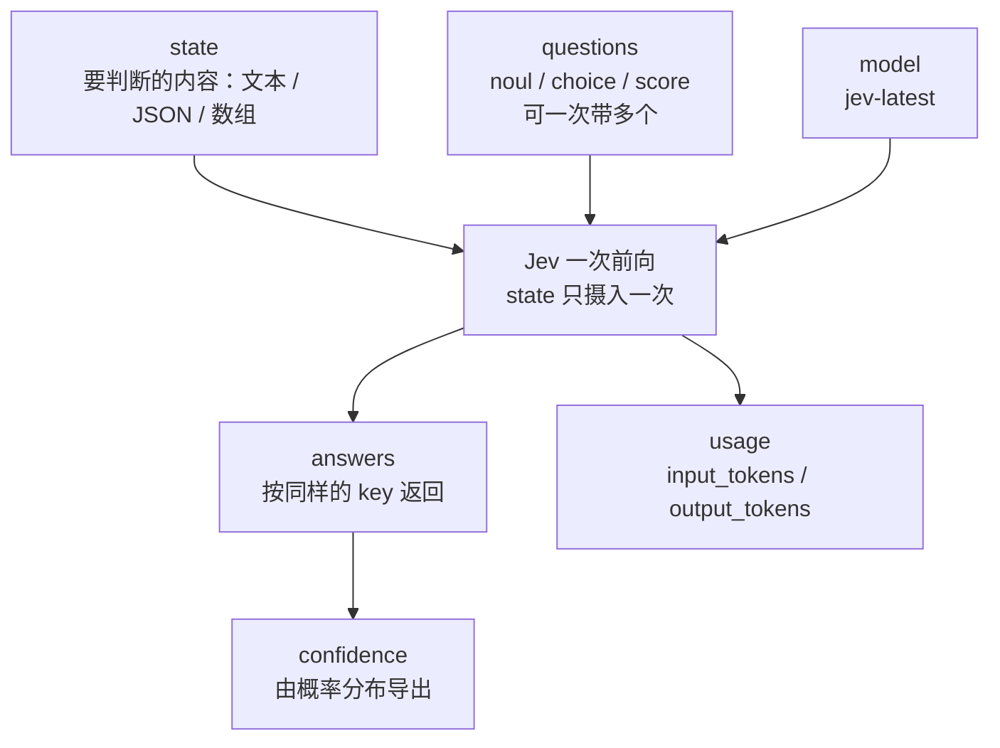
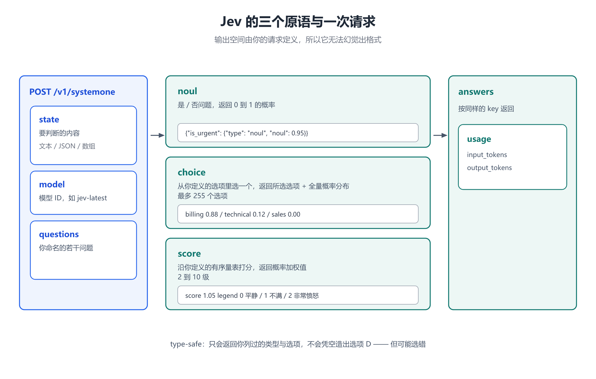

# 第 2 章 三个原语与 API 契约：choice / score / noul

## 一、这一章要解决的问题

第 1 章说 Jev「输出空间由请求定义」。这句话要成立，必须有一个**足够简单、又足够严的输出契约** —— 简单到能覆盖绝大多数判断，严到能保证程序拿到的东西一定解析得动。

这一章回答：

- Jev 的 API **长什么样**？请求怎么组织、响应怎么读？
- 三类原语 `choice` / `score` / `noul` 各自的**语义边界**在哪？
- `confidence` 这个数**是怎么来的**，能拿来干什么？
- 官方说的 **type-safe** 到底保证了什么、**没**保证什么？
- 限流、上下文、错误码这些工程细节怎么处理？

> ⚠️ **未实测声明**：本章所有请求 / 响应示例均**依官方 API 文档撰写，未经本人实测**（没有 TypeSafe API Key）。字段名与结构以官方文档为准，实际调用可能因版本、账号权限、限流策略不同而有出入。

## 二、机制与原理

### 2.1 一次请求的形状：三个字段

Jev 的评测端点只有一个【官方】：

```text
POST https://api.typesafe.ai/v1/systemone
Authorization: Bearer <API_KEY>
Content-Type: application/json
```

请求体只有三个顶层字段：

| 字段 | 类型 | 含义 |
|---|---|---|
| `state` | string / object / array | **要判断的内容**。纯文本用字符串；聊天记录、业务记录、程序当前状态这类用对象或数组 |
| `model` | string | 用哪个模型处理，例如 `"jev-latest"` |
| `questions` | map<string, Question> | **你要问的问题**。key 由你自己起名，答案会按同样的 key 返回 |

这里有一个设计细节值得注意：**`questions` 的 key 不会送给底层模型，也不参与推理**【官方】。它纯粹是给调用方做结果映射用的。也就是说，你完全可以用 `q1`、`q2` 这种名字，不必担心影响判断质量。

### 2.2 三个原语：一个判断的三种形状

每个 `Question` 都是三类原语之一，由 `type` 字段决定。三者共享 `type` 与 `instructions`，各自追加自己的 `criteria`【官方】。

#### `noul` —— 是 / 否

```json
{
  "is_urgent": {
    "type": "noul",
    "instructions": "这段内容是否表达了紧迫性？",
    "criteria": {
      "true": "明确带有时间压力",
      "false": "没有表达紧迫"
    }
  }
}
```

- 返回的是**概率**，不是一个布尔值：0 表示否、1 表示是，中间值表示不确定【官方】。
- `criteria` 里的 `true` / `false` 是**可选的**，用来把「是」和「否」的边界写清楚。
- 正因为返回概率，`noul` 天然适合做**阈值分流**（第 5 章）。

#### `choice` —— 从你定义的选项里选一个

```json
{
  "department": {
    "type": "choice",
    "instructions": "这个问题该由哪个团队处理？",
    "criteria": {
      "billing": "付款、开票、退款",
      "technical": "Bug、故障、集成",
      "sales": "定价、升级、新开户"
    }
  }
}
```

- `criteria` 是**必填**的映射表：选项名 → 该选项的评分标准描述；某个选项不需要额外说明时写 `null`【官方】。
- 返回**所选选项** + **全量概率分布**（各项概率之和为 1）【官方】。
- **单个 `choice` 最多 255 个选项**【官方】。这个上限足够容纳绝大多数分类体系，但要注意：选项越多，`criteria` 的文本越长，会直接吃掉上下文预算。

#### `score` —— 沿有序量表打分

```json
{
  "frustration": {
    "type": "score",
    "instructions": "这位客户有多不满？",
    "criteria": ["平静", "不满", "非常愤怒"]
  }
}
```

- `criteria` 是**必填的有序数组**，从低到高排列；**至少 2 级，最多 10 级**【官方】。
- 返回的是**概率加权值**，因此**可以落在两级之间** —— 官方示例里 `score` 就是 `1.05`，落在「不满（1）」与「非常愤怒（2）」之间【官方】。
- 响应同时带 `legend`（级别序号 → 描述的回映射）与 `probabilities`（每一级的概率）【官方】。

### 2.3 响应：按 key 返回，附带用量

```json
{
  "model": "jev-1.13.0",
  "answers": {
    "department": {
      "type": "choice",
      "choice": "billing",
      "probabilities": { "billing": 0.88, "technical": 0.12, "sales": 0.0 },
      "confidence": 0.81
    }
  },
  "usage": { "input_tokens": 318, "output_tokens": 34 }
}
```

三类 Answer 的结构对照：

| 原语 | 返回字段 |
|---|---|
| `noul` | `noul`（0 到 1 的概率） |
| `choice` | `choice`（概率最高的选项）、`probabilities`（全量分布）、`confidence` |
| `score` | `score`（概率加权值）、`legend`、`probabilities`、`confidence` |

`usage` 里的 `output_tokens` 会有一个非零数字，但**输出 token 不计费**【官方】—— 计费的只有输入。

### 2.4 `confidence` 从哪来

`confidence` 是 **0 到 1 的确定性度量，由该答案的概率分布导出**【官方】。

关键要理解它**不是**「正确答案的概率」：

- 如果 `probabilities` 是 `{billing: 0.88, technical: 0.12, sales: 0.0}`，分布很集中 → `confidence` 高；
- 如果分布接近均匀（比如三项各 0.33），`confidence` 就低。

所以 `confidence` 度量的是**模型自己的态度有多集中**，而不是**它有多大概率是对的**。这两者能否对齐，取决于训练方法（第 3 章的 RLCD）。官方对此的表述很克制：**confidence 告诉你分布有多集中，不告诉你答案是否正确**【官方】。

### 2.5 type-safe 的边界：锁的是形状，不是正确性

官方反复强调 Jev「不会幻觉」。把这句话拆开看，它锁的是**输出形状**：

- 不会返回你没列过的选项（选项只有 A、B、C 时，它**造不出 D**）；
- 不会返回畸形的结构（不会突然输出一段解释文字代替字段）。

保证来自**类型化契约本身**，而不是来自训练方法【官方】。但要立刻补上后半句：

> **不会输出错误格式，不等于不会做出错误判断。** 它仍然可能选错那个 A，也可能对一个错误答案给出过高的置信度。

这条边界是本笔记里出现频率最高的一句话，第 3 章（校准）、第 5 章（阈值）、第 6 章（争议）都要回到它。

### 2.6 一次摄入、并行求值

Jev 的工作方式与 LLM 有一个结构性差别：**它把 `state` 摄入一次，然后对所有问题并行求值**【官方】。

这带来两个直接后果：

1. **`state` 的重复输入成本被摊薄。** 十个问题共享同一份 `state`，而不是把 `state` 重复发十遍。
2. **一次往返能拿到多个判断。** 官方把这个模式叫 **speculative fan-out**（推测性扇出），鼓励把大判断拆成多个原子问题、打包进一个请求【官方】。

对照 LLM：LLM 是逐 token 自回归，问题是串行的；Jev 的问题之间没有先后依赖，可以真正并行。**这是它速度优势的主要来源之一**【三方】。

用 Mermaid 还原一次请求的数据流（竖向）：





### 2.7 模型、别名与限制

| 项 | 值 |
|---|---|
| 当前模型 ID | `jev-1.13.0`【官方】 |
| 别名 | `jev-latest`（最新稳定版，SDK 默认）、`jev-preview`（最新版，含预览版；当前与 `jev-latest` 指向同一模型）【官方】 |
| 定价 | **$42 / Btok**，即 **$0.042 / 百万输入 token**；**输出 token 免费**【官方】 |
| 限流 | 250,000 token/秒；1,200 请求/分（官方说明**正在动态调整**）【官方】 |
| 上下文 | 单请求 64k token；其中 `state` + 最长的那一个问题 不超过 32k【官方】 |
| 输入类型 | **仅文本**（字符串 / JSON 对象 / 文本数组）；不支持图像、音频、视频【官方】 |
| 微调 | **不做按账户微调**，所有账号共用同一份权重；领域适配靠 `state` 与 `instructions` / `criteria`【官方】 |
| 数据 | 不用客户请求 / 响应训练；企业版可谈零数据保留（ZDR）【官方】 |
| 语言 | 英文为主要训练语言、准确率最佳；其他语言（含 CJK）能处理但**不等同**，官方要求自行先测【官方】 |

**别名会移动**：`jev-latest` 指向的版本会随新版本发布而变化，意味着**你这边不改代码，答案也可能变**。官方给的建议是：如果你针对某个版本调过置信度阈值，**请钉住版本化 ID**（如 `jev-1.13.0`），按自己的节奏再迁移【官方】。响应里的 `model` 字段会回报实际回答的版本号，记得记日志。

## 三、工程实践

### 3.1 一次请求同时问三个原语

下面这个示例把 `state` 只发一遍，同时问三类问题 —— 这就是 fan-out 的典型用法。**⚠️ 依官方文档编写，未经实测**：

```bash
curl https://api.typesafe.ai/v1/systemone \
  -H "Authorization: Bearer $TYPESAFE_API_KEY" \
  -H "Content-Type: application/json" \
  -d '{
    "state": {
      "channel": "email",
      "body": "已经三天了，我的提现一直失败，到底有没有人管？"
    },
    "model": "jev-1.13.0",
    "questions": {
      "is_urgent": {
        "type": "noul",
        "instructions": "这段内容是否表达了紧迫性？",
        "criteria": { "true": "明确带有时间压力", "false": "没有表达紧迫" }
      },
      "department": {
        "type": "choice",
        "instructions": "该由哪个团队处理？",
        "criteria": {
          "billing": "付款、开票、退款",
          "technical": "Bug、故障、集成",
          "sales": "定价、升级、新开户"
        }
      },
      "frustration": {
        "type": "score",
        "instructions": "客户有多不满？",
        "criteria": ["平静", "不满", "非常愤怒"]
      }
    }
  }'
```

### 3.2 用结构承载「问题 + 它引用的数据」

`instructions` 不只能是字符串，也可以是对象或数组【官方】。当一个问题需要引用额外数据时，把它**放在同一个对象里、用反引号按名字指过去**，比塞进长句子里可靠得多：

```json
{
  "instructions": {
    "candidate": {
      "name": "张三",
      "city": "杭州",
      "last_employer": "某公司"
    },
    "question": "这份简历与 `candidate` 是同一个人吗？"
  }
}
```

这样做的价值是：**规则和数据各有各的字段**，不会在拼接长文本时互相污染，也让同一份 `state` 能被多个问题用不同方式引用。

### 3.3 错误码与限流处理

| 状态码 | 含义 | 处理 |
|---|---|---|
| `401` | API Key 缺失或无效 | 检查 `Authorization` 头 |
| `422` | 请求体校验失败（缺必填字段、问题畸形） | 响应体会指出出错字段 |
| `429` | 超过限流 | **指数退避**后重试，不要立刻重试 |
| `529` | TypeSafe 暂时过载 | 同上，退避后重试 |

官方客户端 SDK **默认就带退避重试**，并会遵循响应里的 `retry-after` 头；如果直接调 HTTP，需要自己实现【官方】。另外官方明确说明**限流正在动态调整**（大量 GPU 订单落地后可能放宽），所以**不要把限流值硬编码**进业务逻辑【官方】。

## 四、常见坑与边界条件

- **`confidence` 不是「正确率」。** 它只说明分布有多集中。一个自信的错误答案可以拿到很高的 `confidence`。
- **`choice` 的选项数量会吃上下文。** 255 是上限，但每个选项的 `criteria` 描述都会计入 64k 预算；选项多时务必按 2.6 的方式一次扇出，而不是逐个请求。
- **`score` 的结果可能不是整数。** 它是概率加权值（官方示例 `1.05`），下游若按整数分支会踩坑 —— 要么按区间分档，要么直接用 `probabilities` 自己算。
- **`questions` 的 key 不参与推理。** 别指望给 key 起个「聪明的名字」能提升判断质量；影响判断的是 `instructions` 与 `criteria`。
- **别名漂移。** 用了 `jev-latest` 就意味着答案可能在你不知情时变化；调过阈值就钉版本。
- **不做微调 ≠ 不能适配。** 领域知识要写进 `state`，领域规则要写进 `instructions` / `criteria`，这是官方给出的**唯一**适配通道【官方】。
- **只吃文本。** 图像 / 音频 / 视频必须先转成文本或结构化字段，这一步的成本要算进整体方案里。
- **非英语要实测。** 官方明确说 CJK 能处理但准确率不等同英文【官方】—— 中文负载上线前必须在自己的数据上跑一遍。

## 五、关键结论

1. **一个端点、三个字段**：`POST /v1/systemone`，`state` + `model` + `questions`，答案按同样的 key 返回【官方】。
2. **三类原语**：`noul`（是 / 否概率）、`choice`（选项 + 全量分布，≤255 个）、`score`（有序量表 + 概率加权值，2–10 级）【官方】。
3. **`confidence` 由概率分布导出**，度量的是「分布有多集中」，**不是「答案有多对」**【官方】。
4. **type-safe 锁的是形状**：不会返回未列出的选项、不会返回畸形结构；**不保证选对**【官方】。
5. **一次摄入、并行求值**：`state` 只发一次，多个问题打包在一个请求里 —— 这是 fan-out 的基础，也是速度优势的主要来源【官方】【三方】。
6. **工程三件事**：钉版本（别裸用别名）、退避重试（别硬编码限流）、非英语先测。
7. **`jev-1.13.0` / $0.042 每百万输入 token / 输出免费 / 64k 上下文 / 仅文本输入** —— 这是记录时点的官方口径。

## 本章要点回顾

- 端点 `POST /v1/systemone`；请求体三字段 `state` / `model` / `questions`。
- 三个原语：`noul`（0–1 概率）、`choice`（≤255 选项 + 分布）、`score`（2–10 级 + 加权值）。
- `choice` 与 `score` 带 `confidence`；`confidence` 来自概率分布的集中程度。
- **type-safe 锁形状，不锁正确性** —— 造不出选项 D，但可能选错 A。
- 一次请求携带多个问题，`state` 只摄入一次，问题并行求值（fan-out）。
- 上下文 64k（`state` + 最长问题 32k）；仅文本；不做按账户微调。
- 别名 `jev-latest` 会移动，调过阈值就钉 `jev-1.13.0`。
- 错误码 401 / 422 / 429 / 529；限流动态调整，务必退避重试。
