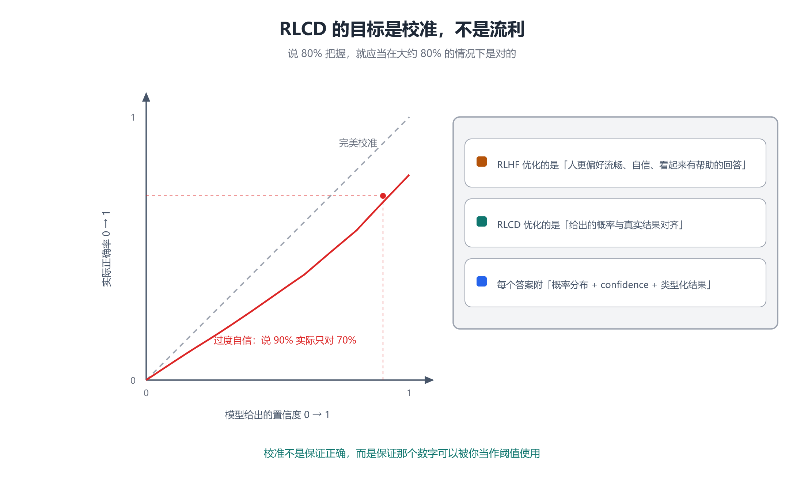
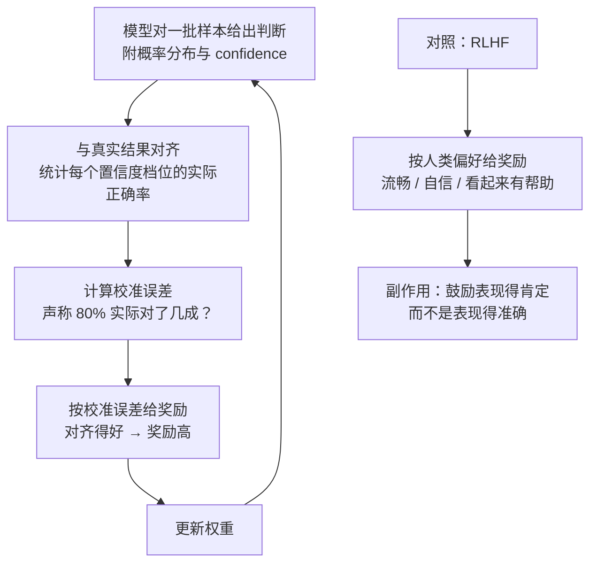

# 第 3 章 RLCD：校准是怎么训练出来的

## 一、这一章要解决的问题

第 2 章留下了一个悬而未决的问题：**`confidence` 这个数字凭什么可信？**

如果一个模型说「我有 80% 把握」，而它实际只有 55% 的时候是对的，那这个数字就是装饰品 —— 按它做置信度分流等于碰运气。要让 `confidence` 能被代码当作**阈值**使用，模型必须满足一个性质：**它声称的概率，要和真实的正确率对得上。**

官方把这个性质叫**校准（calibration）**，把训练它的方法叫 **RLCD**。这一章回答：

- 校准到底是什么意思？怎么度量？
- 为什么「用人类反馈训练」会**破坏**校准？
- RLCD 与 RLHF 的差别，是不是只是换了个奖励信号？
- 官方说的「零幻觉」和「校准」为什么是**两件独立的事**？
- 工程上该怎么正确使用这个 `confidence`？

> ⚠️ **可验证性说明**：官方**只公开了 RLCD 的名字与训练目标**（优化校准），**未公开架构与算法细节**（来源：官方）。本章对机制的描述来自官方概念页与创始人的公开表述，**无法从外部验证**。凡属推断的地方，均已标注。

## 二、机制与原理

### 2.1 校准：说 80%，就要对 80%

校准的定义可以直接量化。把所有「模型说自己有 80% 把握」的样本挑出来，看它们**实际答对了多少**：

下表为**示意值**（非实测数据），仅用于说明两种校准形态的差异：

| 模型声称的置信度 | 实际正确率（完美校准） | 实际正确率（过度自信） |
|---|---|---|
| 50% | 50% | 约 35% |
| 70% | 70% | 约 50% |
| 90% | 90% | 约 70% |
| 99% | 99% | 约 85% |

把每个置信度档位上的「声称值」和「实际值」画成散点，就得到**可靠度图（reliability diagram）**：完美校准的模型落在对角线上；**过度自信**的模型落在对角线**下方**。



校准与「准确率」是**两个独立的指标**：

- **准确率**回答：它答对了多少？
- **校准**回答：它**知道自己有多可能答对**吗？

一个准确率 70% 但校准良好的模型，比一个准确率 75% 但严重过度自信的模型**更适合进自动化流程** —— 因为前者可以按置信度分流，后者不行。

### 2.2 RLHF 为什么会破坏校准

这是理解 RLCD 的起点。RLHF（基于人类反馈的强化学习）的奖励来自**人的偏好判断**（来源：三方）：

> 人类更容易奖励流畅、自信、看起来有帮助的回答。

这个奖励信号本身没有错 —— 它把模型从「只会续写」训成了「会帮忙」。但它有一个副作用：**它在鼓励模型表现得肯定，而不是表现得准确**。一个在没有把握时仍然用自信语气作答的模型，往往比一个如实说「我不确定」的模型更容易拿到人类的高分。

于是在**需要程序自动决策**的场景里，RLHF 训出来的模型有一个结构性缺陷：**它没有可靠的「不确定」可供使用**。第 1 章里创始人的反思说的正是这件事 —— **自动化需要可靠的不确定性**（来源：三方）。

### 2.3 RLCD：把奖励从「像不像好答案」换成「概率对不对得上」

**RLCD** 的全称是 **Reinforcement Learning for Calibrated Decisions（基于校准决策的强化学习）**（来源：官方）。

它的训练目标只有一个：**校准，而不是流畅**（来源：官方）。用官方的话说：

> 模型在「它声称的置信度」与「它实际正确的频率」对齐时获得奖励。如果它说某个答案有 80% 的可能，那么在大量样本上，这个答案就应当在大约 80% 的情况下成立。流利的文笔不是目标，校准良好的数字才是（来源：官方）。

用 Mermaid 还原这个训练目标（竖向）：



这个对照是理解 Jev 的关键：**RLHF 与 RLCD 优化的是两个不同的东西**。前者优化「人喜欢什么」，后者优化「概率是否可信」。两者不是替代关系 —— LLM 依然需要 RLHF 来变得好用，Jev 需要 RLCD 来变得可依赖。

### 2.4 训练数据：完全合成

据创始人的公开表述，Jev **完全基于合成数据进行训练**，采用的正是他称之为「基于校准决策的强化学习」的方法（来源：三方）。官方文档层面确认的只有一点：**Jev 用 RLCD 训练以返回校准的决策，且不用客户数据训练**（来源：官方）。

这两条合起来意味着两件事：

- **合成数据**是能大规模构造「已知正确答案」样本的前提 —— 要度量校准，就必须知道每个样本的真实结果。
- **不用客户数据训练**意味着**领域适配只能走请求侧**（`state` + `instructions` / `criteria`），而不是走微调（来源：官方）。

### 2.5 「零幻觉」与「校准」是两件独立的事

这一条最容易被混为一谈，官方专门做了澄清（来源：官方）：

| | 保证什么 | 来自哪里 | 不保证什么 |
|---|---|---|---|
| **零幻觉（type-safe）** | 输出被锁死在你定义的形状内：不会返回未列出的选项、不会返回畸形结构 | **类型化契约** —— 来自请求结构，**不是**来自训练 | 不保证选对 |
| **校准（RLCD）** | 声称的概率与真实正确率对齐，`confidence` 可以当阈值用 | **训练方法** | 不保证正确 |

两者**互不替代**：

- 光有 type-safe：你拿到一个格式完美的 `billing 0.88`，但它可能是错的，而且那个 `0.88` 毫无意义。
- 光有校准：概率可信，但如果输出空间不锁定，程序仍然要面对格式解析问题。

**只有两者同时成立，`confidence` 才是一个「信号」而不是「装饰」**（来源：官方）。

### 2.6 一个必须记住的边界

即便校准做得再好，官方也给出了明确的用法限定：

> 把 `confidence` 当作**旋钮**，而不是**证书**（来源：官方）。

也就是说，`confidence` 不能直接读作「正确概率」，它需要**你在自己的历史标注数据上标定阈值**之后，才能用来做分流决策（第 5 章展开）。

## 三、工程实践

### 3.1 `confidence` 的正确用法：置信度分流

官方给出的标准用法是三段式（来源：官方）：

1. **在你自己的历史标注数据上标定阈值** —— 不能拍脑袋定，也不能用别人的数字；
2. **高置信度的决策自动执行**；
3. **低置信度的升级处理**（复核、换问法再问、或转人工）。

这样做的好处是：**用覆盖率换准确率，是主动选择，不是碰运气**。你想让自动执行的比例高一些，就把阈值调低，同时接受更多的误判；想更稳，就调高阈值，同时接受更多人工介入。

### 3.2 阈值标定的实操步骤

```text
1. 准备一批历史样本（有已知正确答案的，几百到几千条即可）
2. 用与线上完全相同的 state / instructions / criteria 跑一遍 Jev
3. 收集每条样本的 (confidence, 是否正确)
4. 按 confidence 分桶（如每 0.05 一桶），统计每桶的实际正确率
5. 画可靠度图，确认它大致贴合对角线 —— 不贴合说明该任务的校准不佳
6. 选定一个可接受的正确率下限（例如 97%），找到对应的 confidence 阈值
7. 上线后持续用新样本复核，因为别名漂移会改变答案分布
```

第 5 步是**不可跳过**的：官方对 `jev-1.13` 专门有一页文档说明**模型锯齿（jaggedness）** —— `state` 变长时准确率会漂移（来源：官方）。也就是说，**同一个任务在不同长度的输入上，校准表现可能不同**，标定必须在接近真实分布的数据上做。

### 3.3 什么时候应该「换个问法」而不是降阈值

当某个问题的 `confidence` 长期偏低时，通常不是模型不行，而是**问题本身没拆对**。官方推荐的方向是**把大判断拆成原子问题，在代码里组合结果**（来源：官方）：

- 不要问「这条工单该不该升级」（一个复合判断）；
- 改问「是否涉及退款」「是否提到 Bug」「是否明确要求人工」，再在代码里按业务规则组合。

原子问题更容易校准，也更容易在标定时发现「是哪一步在拖后腿」。

## 四、常见坑与边界条件

- **把 `confidence` 当正确率。** 这是最常见也最贵的误用。它只说明分布集中程度；集中 ≠ 正确。
- **用别人的阈值。** 阈值与**任务、`state` 长度分布、选项粒度**强相关，换任务必须重标。
- **忽略模型锯齿。** `state` 长度变化会带来准确率漂移（来源：官方），短输入上标定的阈值搬到长输入上可能失效。
- **以为「零幻觉」能兜住一切。** type-safe 只保证形状，判断错误它管不了。
- **指望微调来适配领域。** 官方明确不做按账户微调（来源：官方），所有适配只能走请求侧。
- **以为 RLCD 已经被验证。** 官方未公开算法细节，**RLCD 的效果无法从外部独立验证**（来源：三方）。本笔记对它的描述忠实于官方口径，但不构成对效果的背书。
- **忽略合成数据的含义。** 「完全合成数据」意味着训练分布与你的真实业务分布之间**必然存在落差**，这也是为什么阈值必须在自家数据上标定。

## 五、关键结论

1. **校准 = 声称的概率与真实正确率对齐**：说 80% 把握，就应在约 80% 的情况下是对的（来源：官方）。
2. **准确率与校准是两个独立指标**；进自动化流程，校准比准确率更关键。
3. **RLHF 优化的是「人更偏好什么」**，副作用是鼓励模型表现得肯定，而非表现得准确（来源：三方）。
4. **RLCD 优化的是「概率与真实结果是否对齐」** —— 这是 Jev 存在的技术理由（来源：官方）。
5. **「零幻觉」与「校准」互不替代**：前者来自类型化契约，后者来自训练方法；**只有两者同时成立，`confidence` 才是信号**（来源：官方）。
6. **`confidence` 是旋钮不是证书**：必须在自家历史标注数据上标定阈值后才能用于分流（来源：官方）。
7. **官方未公开架构与算法细节**，RLCD 的实际效果无法从外部验证 —— 这一点在第 6 章的争议里会再次出现。

## 本章要点回顾

- 校准 = 「声称的置信度」与「实际正确率」对齐；用可靠度图度量，过度自信的模型落在对角线下方。
- RLHF 优化人类偏好 → 副作用是过度自信；RLCD 优化校准 → 目标是把概率变成可用的阈值。
- 据媒体报道，Jev 完全基于**合成数据**训练（来源：三方）；官方确认的只有**不用客户数据训练**、也不做按账户微调（来源：官方）。
- **零幻觉（形状）** 来自类型化契约；**校准（数字）** 来自 RLCD —— 两者独立、互不替代。
- `confidence` 是**旋钮**：先在自己数据上标定阈值，再按置信度分流。
- 官方专页提示 `jev-1.13` 存在**模型锯齿**：`state` 变长时准确率漂移，标定要贴近真实分布。
- 问题 `confidence` 长期偏低时，优先**拆成原子问题**，而不是一味降阈值。
