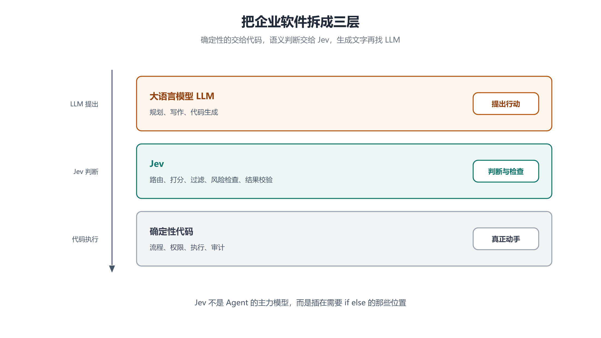
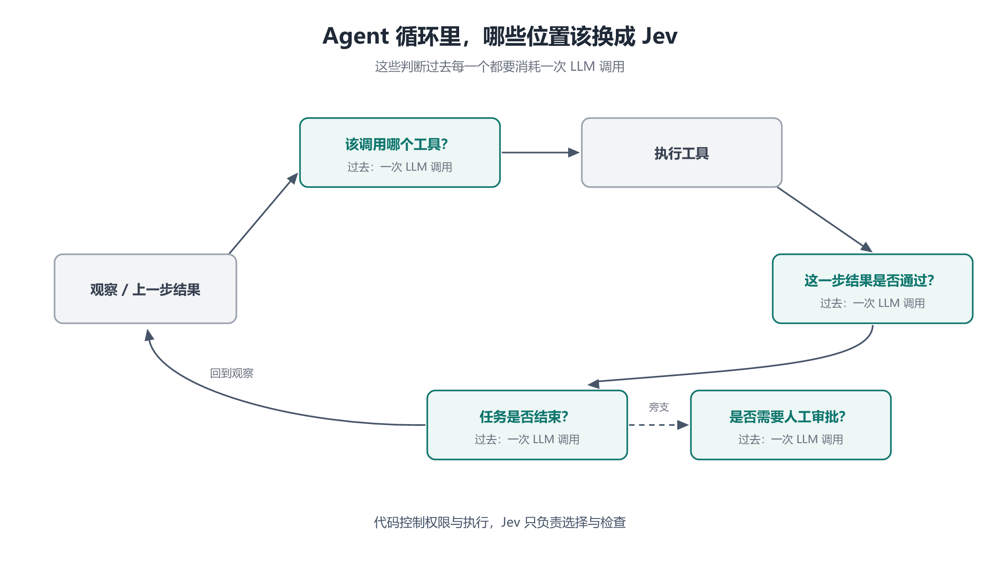

# 第 4 章 与 LLM 的分工：三层架构与 Agent 循环里的决策节点

## 一、这一章要解决的问题

到第 3 章为止，Jev 自身已经讲清楚了：它是什么、怎么调、为什么 `confidence` 可信。但一个模型的价值不取决于它自己，而取决于**它被放在系统的哪个位置**。

这一章回答：

- Jev 和 LLM 是**替代关系**还是**分工关系**？
- 一个系统应该怎么切分，才能让三者（代码 / Jev / LLM）各就各位？
- **Agent 循环**里哪些节点应该换成 Jev？换了之后架构变成什么样？
- 除了「做判断」，Jev 还能不能干别的？
- 官方给它的最精准定位是哪一句话？

## 二、机制与原理

### 2.1 三层架构：代码 / Jev / LLM

Vercel 给出的建议是把企业软件拆成三个部分【三方】：

| 层 | 负责什么 | 不负责什么 |
|---|---|---|
| **确定性代码** | 流程、权限、执行、审计 —— 所有客观可判定的规则 | 理解语义 |
| **Jev** | 需要**语义理解**的判断：路由、打分、过滤、风险检查、结果校验 | 生成内容、决定权限 |
| **大语言模型 LLM** | 规划、写作、代码生成 —— 真正需要生成文字的地方 | 高频小判断（太慢太贵） |



这张图是本章的核心：**Jev 不是 Agent 的主力模型，而是插在需要 `if else` 的那些位置**【三方】。

用一句话概括三者的接口关系：

```text
LLM 提出行动  →  Jev 判断与检查  →  代码执行（并持有最终权限）
```

注意最后一环：**真正的权限和执行始终由代码控制**，Jev 只负责「选择」与「检查」。这个顺序不能反 —— 一旦让 Jev 的输出直接触发不可逆动作，第 2 章那条「type-safe 不保证正确」的边界就会立刻变成事故。

### 2.2 为什么「让 LLM 做意图理解」很难受

在 Jev 出现之前，语义判断的常规做法是：让 LLM 理解一段话，在提示词里要求它按固定 JSON 结构输出分类，后面的代码解析 JSON 再决定动作。这就是 Agent 架构里的「意图理解」与「行为分类」。

这个方案**能跑通，但很难受**，主要卡在三点【三方】：

1. **慢。** 大模型得「想半天」，用户得看着思考图标一直闪。这让**内容推荐**这类需要即时响应的场景根本无法使用大模型的理解能力。
2. **贵。** 意图理解环节最终只输出一个「愤怒」的情绪分类，但为了得出这个结果，模型可能已经写了一篇两千字的「小作文」—— 而输出 token 是按量计费的。
3. **不稳定。** LLM 的输出要和后续代码衔接，就必须按固定格式输出；但提示词里的约束是**软约束** —— 遇到模型幻觉、上下文过长等情况，漏掉一个 JSON 片段很常见，代码层直接解析失败。

Jev 恰好同时解决了这三点，而且解决方式很干净：

| 痛点 | Jev 的做法 |
|---|---|
| 慢 | 一次前向、多问题并行，官方演示单次判断 0.114 秒（对照 LLM 8.566 秒）【三方】 |
| 贵 | 输出 token 免费，只按输入计费【官方】 |
| 不稳定 | 输出空间由请求定义，是**硬约束**，不存在「漏掉一个字段」【官方】 |

用一句话概括它补上的能力：**让「智能」有了代码层面的「确定性」** —— 输入侧能理解自然语言（像 LLM），输出侧是固定结构（像 `if else`）【三方】。

### 2.3 Agent 循环里的决策节点

一个 Agent 真正工作起来，需要**不断做决策**【三方】：

- 下一步调用哪个工具？
- 刚才的执行是否成功？
- 要不要重试？
- 应该继续执行，还是询问用户？
- 某一步是否需要人工审批？

这些问题过去**每一个都消耗一次 LLM 调用**。它们共同的特征是：**答案离散、判断依赖语义、结果直接进代码分支** —— 正好落在 Jev 的能力范围内。



Vercel 已经把 Jev 放进了这样的 Agent 循环【三方】：

```text
生成模型（LLM）负责「理解」与「提出行动」
        ↓
Jev 位于中间的决策节点：对下一步行动做「选择」或「检查」
        ↓
代码持有权限，执行真正的动作
```

也就是说，架构并没有把 LLM 换掉，而是**把 LLM 从「每一步都要过一遍」的必经路径上摘了出来** —— 它只在需要理解和生成时被调用，而高频的中间判断交给 Jev。

### 2.4 除了做判断：Jev 作为「监测工具」

这是官方提到的一个容易被忽略的用法：**Jev 可以与 LLM 协同工作，充当大模型行为的监测工具**【三方】。

典型的实时任务包括：

- **Agent 运行轨迹监控** —— 每一步是否偏离了预期？
- **越狱防范** —— 这段输入是否在试图绕过安全约束？

这类任务同样是「高频、小判断、结果要立刻进代码」，但它的判断对象**不是用户输入，而是模型自己的行为**。这打开了一个新位置：Jev 不一定要在被调用链的「业务路径」上，也可以挂在**旁路的监督路径**上。

### 2.5 最精准的定位：一个能理解自然语言的「模糊 if 语句」

据媒体报道，官方给出的产品定位有两句，本笔记认为值得原文保留【三方】：

> 一个能够理解自然语言的「**模糊 if 语句**」。
>
> 一个「**前沿智能函数调用**」（frontier intelligent function call）。

这两句抓住了同一件事的两个侧面：

- **「if 语句」** 强调的是**形态** —— 它的输出就是条件判断的输入；
- **「模糊」** 强调的是**能力** —— 它判断的是代码判断不了的东西（用户是不是生气了、这条回复是不是广告）。

也正因为如此，Jev 的核心价值**不在开放式能力**，而在于「主动放弃文本生成」之后换来的**工程性质**。放弃写文章，换来的是：输出确定、成本极低、延迟极短、可并行。这是一次**用能力范围换工程确定性**的交易。

## 三、工程实践

### 3.1 拆分原则：什么交给谁

| 判断类型 | 交给谁 | 判据 |
|---|---|---|
| 客观可判定的规则 | **代码** | 能从数据库查出来、能写成布尔表达式 |
| 需要语义理解的离散判断 | **Jev** | 人能一眼分辨、代码写不出规则（「这条消息是不是在骂人」） |
| 需要生成文字 / 代码 / 计划 | **LLM** | 输出不是离散值，而是内容 |
| 需要多步推理链 | **LLM** | 需要「一步一步想」，不是一次判断 |
| 高频、单次价值低 | **Jev** | 用 LLM 做不划算 |
| 不可逆动作的最终决定 | **代码 + 人** | 权限与执行权不交给任何模型 |

### 3.2 改造示例：把 LLM 分类换成 Jev

一个常见的改造前后对比：

```text
改造前（LLM 做分类）
  用户消息 → LLM（提示词要求输出 JSON）→ 解析 JSON → if/else
  问题：慢（秒级）、贵（输出按量计费）、可能解析失败

改造后（Jev 做判断）
  用户消息 → Jev（state + questions）→ 直接拿到 choice / probabilities
  收益：快（一次前向）、省（输出免费）、不会解析失败
  代价：只能做离散判断，生成类需求仍要回到 LLM
```

⚠️ **改造时必须保留的东西**：第 3 章说的**阈值标定**。不要因为「Jev 有 type-safe」就省掉分流阈值 —— 那条边界只管形状，不管对错。

### 3.3 一个务实的落地顺序

1. **先找最痛的那个高频判断**（通常是客服工单分类或内容过滤），单独替换，用第 3 章的方法标定阈值；
2. **再把 Agent 循环里的中间判断逐个换掉**（工具选择 → 结果校验 → 是否结束）；
3. **最后才考虑把 Jev 挂到监督路径上**（轨迹监控、越狱防范）；
4. **全程保留 LLM**：它是「理解 + 生成」的那一层，不会因为引入 Jev 而消失。

## 四、常见坑与边界条件

- **把 Jev 当 Agent 主模型。** 它不会规划、不会生成，把它放在需要「想清楚再动手」的位置会直接失效。
- **让 Jev 的输出直接触发不可逆动作。** 权限和执行必须留在代码里；Jev 只提供判断与置信度。
- **以为引入 Jev 就能删掉 LLM。** 三层是分工，不是替代 —— 生成、规划、多步推理仍然归 LLM。
- **忽略「慢」这一条的真实来源。** Jev 快的原因不只是模型小，还因为**问题可并行**（第 2 章 2.6）；如果业务上问题之间真的存在依赖，这个优势会打折。
- **把「监测」当成「保证」。** Jev 做越狱防范也是判断，也有误判率；它降低风险，不消除风险。
- **忽视非英语准确率。** 官方明确英文最好、其他语言（含 CJK）不等同【官方】—— 中文场景上线前必须自测。

## 五、关键结论

1. **三者是分工关系**：代码管确定性规则与执行、Jev 管语义判断、LLM 管理解与生成【三方】。
2. **Jev 的定位是「插在需要 `if else` 的位置」**，不是 Agent 的主力模型。
3. **LLM 做意图理解有三个结构性痛点**：慢、贵、格式不稳定（软约束）—— Jev 恰好逐一解决。
4. **Agent 循环里的中间判断是最佳落点**：工具选择、结果校验、是否结束、是否需审批。
5. **Jev 还能做监测**：Agent 轨迹监控与越狱防范，属于旁路监督路径。
6. **最精准的两句定位**：能理解自然语言的「模糊 if 语句」/「前沿智能函数调用」。
7. **Jev 的核心价值不在开放式能力**，而在放弃文本生成后换来的**工程确定性** —— 这是一次有意识的交易。

## 本章要点回顾

- 三层架构：**确定性代码（执行/权限）/ Jev（语义判断）/ LLM（生成与规划）**。
- LLM 做分类的三个痛点：**慢、贵、格式不稳定**；Jev 用「一次前向 + 输出锁定 + 输出免费」逐一解决。
- Agent 循环里的高频判断（工具选择 / 结果校验 / 是否结束 / 是否审批）是 Jev 的主要落点。
- 架构变化是**把 LLM 从必经路径上摘出来**，而不是把它换掉。
- Jev 也可作为**监测工具**（轨迹监控、越狱防范）。
- 定位：**能理解自然语言的「模糊 if 语句」**。
- 核心价值 = **用能力范围换工程确定性**。
- ⚠️ 权限与执行永远留在代码里；Jev 只提供判断与置信度。
