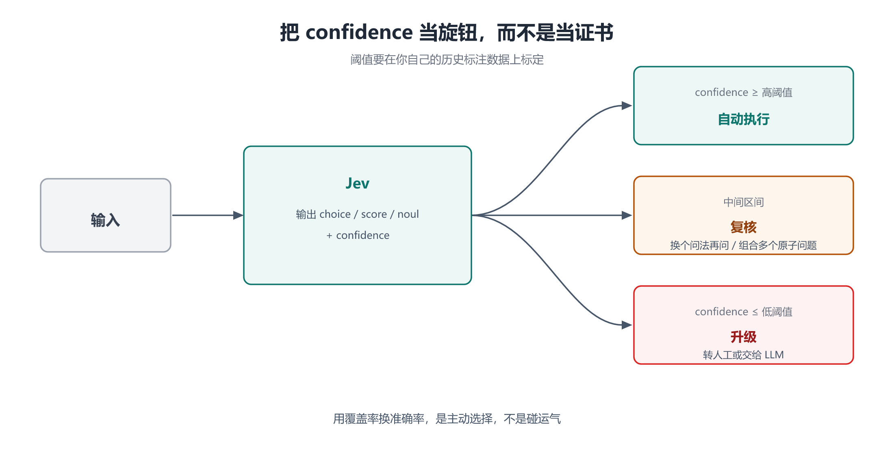

# 第 5 章 工程实践：置信度分流、阈值标定与成本测算

## 一、这一章要解决的问题

前四章讲清了 Jev 是什么、怎么调、为什么可信、放在哪。这一章把剩下的问题一次性收掉 —— **真上线要处理的那些事**：

- 怎么用一次请求拿到多个判断，而不把 `state` 重复发十遍？
- **置信度分流**具体怎么写？三段式的边界在哪？
- 阈值怎么标定，标完怎么复核？
- 一次判断到底多少钱？怎么算自己场景的账单？
- 接哪里：官方 API、官方 SDK、还是第三方聚合平台？
- 上线后要记什么日志，才能在模型版本漂移时发现？

## 二、机制与原理

### 2.1 扇出：一次请求打包多个问题

这是 Jev 最重要的一条工程性质。**`state` 只摄入一次，所有问题并行求值**【官方】。官方把它叫 **speculative fan-out（推测性扇出）**。

它的经济含义很直接：**你为 `state` 付的钱只付一次，问题数量不影响 `state` 那部分的成本。** 十个问题共享一份 `state`，而不是把 `state` 重复发十遍。

但扇出有一个**预算约束**必须算清楚【官方】：

| 预算 | 数值 | 说明 |
|---|---|---|
| 单请求总上下文 | 64k token | `state` + **全部问题** 之和 |
| `state` + 最长问题 | 32k token | 这一项单独设限 |

也就是说：**问题越多，`criteria` 的文本越长，能留给 `state` 的预算就越少。** 选项多、量表描述细的场合要特别小心（第 2 章提到 `choice` 最多 255 个选项，每个选项的描述都吃预算）。

### 2.2 复合评分：把大判断拆成原子问题再组合

官方推荐的一个模式是 **composite scoring（复合评分）**【官方】：不要把复合判断塞进一个问题，而是**拆成多个原子问题，在代码里组合结果**。（这与第 1 章 3.2「要多步推理链就交给 LLM」并不矛盾：拆原子问题是一次性并行判断，不是链式推理。）

```text
不要这样问：
  「这条工单是否需要升级？」（复合判断，校准困难）

改成这样问：
  is_urgent        → noul   是否表达紧迫
  mentions_refund  → noul   是否涉及退款
  is_angry         → score  不满程度
  department       → choice 归属团队
再在代码里按业务规则组合：
  if (is_urgent > 0.8 && department === "billing") escalate();
```

好处有三：**每个原子问题更容易校准**、**标定时能看出是哪一步在拖后腿**、**业务规则改动不用重问模型**（改代码即可）。

### 2.3 用概率训练下游经典模型

还有一个更进一步的用法：**把 Jev 输出的概率当作特征，训练一个下游的经典模型**【官方】。

场景是这样的：你已经有一条成熟的业务规则或一个小型分类器，但特征不够。让 Jev 对历史样本批量打标（输出概率而非硬标签），把这些概率作为**额外特征**喂给你的模型 —— 比用硬标签保留了更多信息量（0.51 和 0.99 在硬标签下都是「是」，在概率下截然不同）。

这条路径的价值在于：**Jev 不一定要在线**。它可以是一次性的「特征生产器」，把语义信息固化成数字。

### 2.4 版本钉住与日志

第 2 章提过别名漂移，这里给出工程做法：

- **调过阈值就钉版本化 ID**（如 `jev-1.13.0`），不要裸用 `jev-latest`【官方】；
- **记录响应里的 `model` 字段** —— 它回报实际回答的版本号，用于事后归因【官方】；
- **记录 `probabilities` 而不只是 `choice`** —— 硬标签丢了信息，出问题时无法复盘「当时离边界有多近」；
- **记录 `usage`** —— 用来对账，也用来发现 `state` 膨胀。

## 三、工程实践

### 3.1 置信度分流：三段式

这是 Jev 最标准的用法，官方给出的形态就是三路【官方】：



```text
                      ┌─ confidence ≥ 高阈值 ─→ 自动执行（进 if/else）
输入 → Jev → confidence ├─ 低阈值 < c < 高阈值 ─→ 复核：换个问法再问 / 组合多个原子问题
                      └─ confidence ≤ 低阈值 ─→ 升级：转人工，或交给 LLM
```

三个出口各自对应一种「不确定的处置方式」：

| 出口 | 含义 | 典型动作 |
|---|---|---|
| **自动执行** | 足够确定 | 直接走业务分支 |
| **复核** | 不确定，但可能通过**更多信息**变确定 | 换一种问法再问一次；或拆成更细的原子问题；或补充 `state` |
| **升级** | 不确定，且模型帮不上忙 | 转人工；或交给 LLM 生成解释后由人处理 |

### 3.2 阈值标定的完整流程

阈值**必须**在自家历史标注数据上标定【官方】。流程见第 3 章 3.2，这里补充**上线后的复核**：

```text
标定期（一次性）
  历史标注样本 → 跑 Jev → 按 confidence 分桶 → 画可靠度图 → 选定阈值

运行期（持续）
  抽样人工复核「自动执行」的决策 → 统计实际正确率
  若低于预期 → 调高阈值（牺牲覆盖率换准确率）
  若长期远高于预期 → 可调低阈值（拿回覆盖率）
  模型版本变化（看响应里的 model 字段）→ 重新标定
```

核心心法只有一句：**用覆盖率换准确率，是主动选择，不是碰运气**【官方】。

### 3.3 成本测算

记录时点的官方定价【官方】：

```text
输入：$42 / Btok   =  $0.042 / 百万 token
输出：免费

若一次判断平均消耗 1000 个输入 token：
  100 万次判断 = 1000 × 1,000,000 = 1e9 token = 1 Btok
  费用 = 1 × $42 = 约 42 美元
```

这个数字来自第三方的测算，与官方定价一致【三方】。算自己场景的账单时，只需估两个量：

1. **单次判断的输入 token 数** —— 主要是 `state` 的长度加上所有问题的 `criteria` 文本；
2. **月判断次数**。

⚠️ **两条容易漏算的成本**：

- **扇出会放大单次输入。** 一次请求带十个问题，输入 token 是十个问题的 `criteria` 加一份 `state`，而不是「一次判断」的直觉值。
- **上游预处理成本。** Jev 只吃文本，图像 / 音频 / 视频要先转文本（OCR、ASR 等），这部分成本不在 Jev 的账单里，但属于整体方案。

### 3.4 接哪里

| 通道 | 说明 |
|---|---|
| **官方 HTTP API** | `POST https://api.typesafe.ai/v1/systemone`；需要自己实现退避重试【官方】 |
| **官方 SDK** | Python / JavaScript，**默认带退避重试**并遵循 `retry-after`【官方】 |
| **OpenRouter** | 第三方聚合平台，模型地址 `openrouter.ai/~typesafe/jev-latest`【三方】 |
| **Vercel AI Gateway** | 第三方网关；上线 24 小时内被接近 13% 的付费团队使用【三方】 |

选型建议：**能直连就直连**（少一层中间商的延迟与定价），需要多模型统一网关时才走聚合平台。

### 3.5 可观测性清单

上线 Jev 后至少要能回答这四个问题：

- 这个判断是**哪个版本**的模型做的？（记 `model`）
- 当时的**概率分布**是什么？（记 `probabilities`，不只是 `choice`）
- 这次调用的**输入规模**多大？（记 `usage.input_tokens`，用于发现 `state` 膨胀）
- 走的是**哪个出口**？（自动执行 / 复核 / 升级，用于统计覆盖率）

## 四、常见坑与边界条件

- **把 `state` 重复发十遍。** 扇出的意义就是只发一次；拆成十个请求等于把成本乘十。
- **忽略 32k 那条单独的限制。** 64k 是总量，`state` + 最长问题还有 32k 的单独上限【官方】。
- **阈值拍脑袋。** 没标定的阈值等于没有阈值。
- **只存硬标签。** 丢了 `probabilities`，就丢了复盘能力，也丢了 2.3 那条「当特征用」的可能性。
- **不记版本号。** 别名漂移后答案变了，你却无法归因。
- **把限流值硬编码。** 官方明确说限流**正在动态调整**【官方】。
- **忘记算上游预处理。** 非文本输入转文本的成本属于方案总成本。
- **非英语不做 A/B。** 官方要求在自己的内容上先测；中文负载尤其要注意【官方】。

## 五、关键结论

1. **扇出是 Jev 的核心工程性质**：`state` 只摄入一次，多问题并行求值；成本优势与速度优势都源于此【官方】。
2. **上下文有两层预算**：总 64k（`state` + 全部问题）、`state` + 最长问题 32k【官方】。
3. **复合评分**：把复合判断拆成原子问题，在代码里组合 —— 更好校准、更好定位、改规则不用重问模型【官方】。
4. **概率可以当特征**：用 Jev 的 `probabilities` 训练下游经典模型，Jev 可以只离线跑一次【官方】。
5. **分流三段式**：高置信自动执行、中间复核、低置信升级；阈值必须在自家数据上标定【官方】。
6. **成本口径**：$0.042 / 百万输入 token、输出免费；一次判断约 1000 输入 token 时，100 万次约 42 美元【官方】【三方】。
7. **上线四件套**：钉版本、记 `model`、记 `probabilities`、记 `usage`。

## 本章要点回顾

- **扇出**：一次请求打包多个问题，`state` 只付一次钱；总预算 64k、`state` + 最长问题 32k。
- **复合评分**：拆成原子问题，在代码里组合；比一个复合大问题更好校准。
- **概率当特征**：Jev 可离线批量打标，把语义固化成数字喂给下游模型。
- **分流三段式**：自动执行 / 复核 / 升级；`confidence` 是旋钮不是证书。
- **成本**：$0.042 / 百万输入 token，输出免费；100 万次判断（每次 1000 token）约 42 美元。
- **通道**：官方 API / 官方 SDK（带退避）/ OpenRouter / Vercel AI Gateway。
- **可观测性四问**：哪个版本、什么分布、多大输入、走了哪个出口。
- ⚠️ 别硬编码限流、别丢概率、别忘算上游预处理成本。
