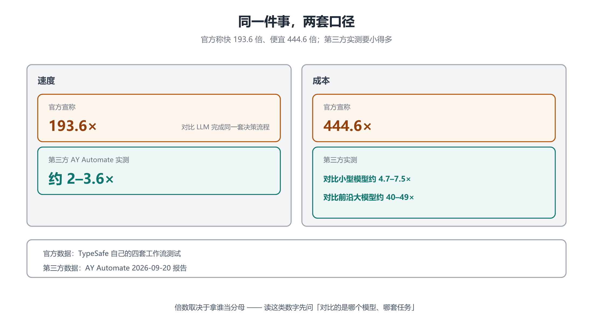

# 第 6 章 基准、争议与生态：倍数、分类器与黑盒

## 一、这一章要解决的问题

前五章基本站在「Jev 是什么、怎么用」的立场上。但一个刚发布两周的模型，**围绕它的争议比它的能力更值得读** —— 因为争议决定了它到底能不能长期留在你的技术栈里。

这一章回答：

- 官方宣称的 **193.6× / 444.6×**，第三方实测为什么只有 **2–3.6×**？
- 「它就是个分类器」这个说法，站得住吗？
- 为什么有人说它比 LLM **更黑盒**？
- 「零幻觉」这个卖点，被误读在哪？
- 社区在复刻什么？开源模型反超了吗？
- 采用率数据能说明什么、不能说明什么？

## 二、机制与原理

### 2.1 官方宣称：193.6× 与 444.6×

TypeSafe 官网最显眼的位置放着两个数字：**比 LLM 快 193.6 倍、便宜 444.6 倍**【官方】。

这两个数出自 TypeSafe 官方首页（`typesafe.ai` 明列「193.6x Faster, 444.6x Cheaper」）【官方】。据媒体报道，它们来自 **TypeSafe 自己设计的四套工作流测试**：完成同一套决策流程，LLM 花费的时间和钱是 Jev 的 193.6 倍和 444.6 倍【三方】。⚠️ 注意口径 —— 这是「**完成整套流程**」的对比，不是「单次调用」的对比；且该测试**定义未公开、不可独立复现**。

其他官方或官方演示的对比数字【三方】：

| 场景 | 对比对象 | 结果 |
|---|---|---|
| 单次决策演示 | LLM | Jev 0.114 秒 vs 8.566 秒 |
| 命令安全审查分类 | ChatGPT Luna 5.6（Vercel 工程师 Pranit Sharma 反馈） | 快 5–18 倍，准确率也有提高 |
| Computer Use 单次决策 | Claude Opus 5 | 快 14–40 倍，价格 1/155 |
| 商业邮件分类 | Gemini（BryoAI CTO Nikhil Mudholkar 测试） | Gemini 准确率略高，但成本高 10–20 倍 |

### 2.2 第三方实测：小得多

2026-09-20，自动化服务公司 **AY Automate** 发布了第三方测试报告，结论与官方口径差距明显【三方】：

- **速度**：Jev 比几款对照模型快约 **2 到 3.6 倍**（不是 193.6 倍）；
- **成本**：与便宜的小模型相比，省下的费用约 **4.7 到 7.5 倍**；与较贵的前沿模型相比才达到 **40 到 49 倍**（不是 444.6 倍）。



### 2.3 差距从哪来：分母是谁

这两组数字**不是矛盾，而是分母不同**。差异主要来自三处：

| 变量 | 官方口径 | 第三方口径 |
|---|---|---|
| **对比对象** | 主要对比前沿 LLM | 同时对比小模型与前沿模型，分别给数 |
| **任务集** | TypeSafe 自选的四套工作流 | 独立设计的对照任务 |
| **测量对象** | 整套决策流程的端到端耗时与花费 | 单次判断的延迟与成本 |

**关键结论**：Jev 相对**小模型**的优势很小（4.7–7.5 倍成本），相对**前沿模型**才显著（40–49 倍成本）。所以「快 193.6 倍」这句话成立与否，完全取决于**你原本打算用哪个模型来做这件事**。

> 读这类倍数时的通用问法：**对比的是哪个模型、哪套任务、量的是一次调用还是一套流程？** 三个问题答不上来，这个倍数就没有意义。

⚠️ 官方文档本身**没有给出统一的延迟数字**；网上流传的「70–500ms」出自 eogee、AIHub 等第三方站点的转述（它们称其为「官方基准」，官方文档并未记载），不作为依据（见 [`_来源与数据分级.md`](_来源与数据分级.md) 第五节）。

### 2.4 争议一：它是不是「就是个分类器」

这是最主流的一条质疑【三方】。

质疑方的论据很扎实：**结构化输出、限制解码、读取候选 token 的概率，这些技术早就存在**。BERT 这类 encoder 模型本来就擅长分类、匹配与打分；GPT / Claude 这类 decoder-only 模型擅长写文章、代码与对话。Jev 的形态「更接近 BERT 一类 encoder 模型」，属于**新瓶装旧酒**。

官方的回应是：Jev 采用了一套名为 **RLCD** 的训练方法，训练目标是让模型**直接作出选择、评分并给出概率**【三方】。

但这里有一条硬约束：**TypeSafe 尚未公开架构**，其训练方法是否如其所说，**外部无法判断**【三方】。所以这场争论目前**没有定论**：

- 说它是分类器的人，无法证伪 RLCD 的存在；
- 官方也无法让外部验证 RLCD 的效果。

对使用者的实际影响是：**不要把「Jev 是一种新范式」当成既成事实**。它是一个**接口设计得很好的决策模型**——这一点是确定的；它是不是训练方法上的突破，是未定的。

### 2.5 争议二：它可能比 LLM 更黑盒

开发者 **Simon Willison** 提出的这条批评，本笔记认为最值得认真对待【三方】：

> Jev 甚至可能比传统 LLM 更「黑盒」。因为 LLM 至少还能被要求解释自己的判断，但 Jev 最终留给开发者的，可能只有一个数字 —— 比如 0.83 或 10000。这个数字为什么是 0.83，模型依据了文本中的什么特征，根本无法得到追问。

这条批评击中的是**放弃文本生成所付出的代价**：

| | LLM | Jev |
|---|---|---|
| 输出 | 一段可读的推理过程 + 结论 | 一个数字 |
| 可解释性 | 可以追问「你为什么这么判断」 | 无法追问 |
| 调试方式 | 读它的解释，判断哪里想错了 | 只能靠统计（分桶、可靠度图） |

也就是说，第 4 章说的「用能力范围换工程确定性」，**代价之一就是可解释性**。这不是可以绕开的取舍，而是设计决定的必然结果。

工程上的应对只有一条路：**用统计替代解释** —— 靠第 3 章的阈值标定与可靠度图来建立信任，而不是靠读模型的理由。

### 2.6 争议三：「零幻觉」被误读

官方反复强调 Jev 不会出现幻觉【三方】。这句话**完全正确，但极易被读成「它不会出错」**。

精确的边界是：

- **可以保证**：问题只有 A、B、C 三个选项时，Jev 不会突然回答 D；
- **不能保证**：它仍然可能选择错误的 A，也可能对一个错误答案给出**过高的置信度**。

所以「零幻觉」这个词在 Jev 的语境里，指的是**格式层面不产生幻觉**，不是**判断层面不产生错误**。这两件事在中文里都容易被叫作「幻觉」，混用会直接导致上线事故。

这一条与第 2 章 2.5、第 3 章 2.5 是同一件事，此处第三次强调，因为它是最容易被误读、后果也最严重的一条。

### 2.7 社区复刻：形态不难抄，效果难验证

Jev 发布不到一周，社区就开始尝试复刻这种形态【三方】：

| 项目 | 做法 |
|---|---|
| **Kev** | 直接基于 Qwen 3.5 制作了 0.8B、4B、9B 三个 Jev-like 模型 |
| **JevRL** | 在小型语言模型之上增加决策输出模块，同样实现 `Choice`、`Score` 等结构化概率输出 |

这些复刻说明一件事：**「把语言模型从生成文字改造成输出判断」这件事，技术路径不止一条**【三方】。有人甚至用两小时通过微调做出了类似能力，因此认为 Jev 本身没什么门槛。

但要注意区分两个层面：

- **形态**（输出 `choice` / `score` / `noul` + 概率）—— 确实容易复刻；
- **校准质量**（声称 80% 就真的对 80%）—— 才是 RLCD 声称要解决的问题，也是复刻项目**没有公开验证**的部分。

### 2.8 开源反超：Laya 的 421M

一个值得注意的对照是开源模型 **Laya**【三方】：

| 项 | Laya | Jev 1.13.0 |
|---|---|---|
| 参数规模 | 421M（约 4.2 亿） | 未公开 |
| 许可 | Apache 2.0 | 闭源 API |
| 单问题延迟 | 官方自称低近 8 倍 | — |
| typed-decisions 准确率 | **0.766** | 0.727 |

在 Laya 自己公布的 **typed-decisions** 测试集上，专用微调 checkpoint 的准确率 **0.766**，高于对比中 Jev 1.13.0 的 **0.727**【三方】。

⚠️ 解读这份对比时要保留三点：**测试集由 Laya 自己公布**、**只比准确率没比校准**、**参数规模与训练成本差异巨大**。它证明的是「开源小模型能在某个特定任务上追平甚至反超」，**不是**「Jev 不行了」。

### 2.9 商业化：采用率很高，但单价压力极大

采用率数据确实亮眼【三方】：

- 上线 Vercel AI Gateway 后 24 小时内，被接近 **13%** 的付费团队使用，首日采用率超过该平台此前所有新模型；
- 截至 2026-09-21，Jev 占该平台约 **21.2%** 的请求量、触达 **29%** 的团队。

但这组数据**不能直接等同于商业成功**：

- 该平台当时正在做**限时免费推广**（9-25 结束），优惠结束后有多少能留下，仍需观察；
- **单价极低意味着另一重压力**：Jev 需要**极其庞大、持续的调用量**才能撑起可观的收入规模【三方】。

这恰好呼应了它的名字 —— 杰文斯悖论既是 Jev 的产品逻辑，也是它自己的商业模式赌注：**赌判断的调用量会大到足以让极低的单价变成可观的收入。**

## 三、工程实践

### 3.1 怎么读「快 N 倍 / 便宜 N 倍」

拿到任何倍数，先问三句：

1. **分母是谁？** —— 对前沿模型还是对小模型？（Jev 对小模型只有 4.7–7.5 倍优势）
2. **量的是什么？** —— 单次调用，还是一整套流程的端到端？
3. **任务是谁选的？** —— 官方自选的四套工作流，还是独立设计的对照任务？

### 3.2 怎么自己测（而不是信任何一方）

```text
1. 拿你真实场景的 100–500 条样本，人工标好正确答案
2. 用你原本的 LLM 方案跑一遍：记延迟、记 token 账单、记准确率
3. 用 Jev 跑同样的样本：同样的 state / instructions / criteria
4. 对齐口径再比：
   - 延迟按 P50 / P95 比，不按平均值比
   - 成本按「每条样本的输入 token × 单价」算，别忘扇出放大
   - 准确率之外，再比一次「置信度分桶后的准确率」（校准）
5. 结论只对你这批数据成立 —— 别外推
```

第 4 步最后一项是 Jev 特有的：**只有比了校准，才知道它能不能进自动化流程**。一个准确率更高但校准很差的模型，在自动分流场景里反而更难用。

## 四、常见坑与边界条件

- **把官方倍数当成你的倍数。** 分母不同，数字可以差 1–2 个量级。
- **把「不会幻觉」读成「不会出错」。** 前者是格式，后者是判断。
- **拿「它就是个分类器」直接否定。** 接口形态确实不新，但这不等于价值为零 —— 价值在于**把校准、成本、并行这些性质打包成了一个可直接调用的服务**。
- **拿「社区两小时复刻」直接否定。** 复刻的是形态，不是校准；两者要分开评价。
- **用 Laya 的对比推翻 Jev。** 那是**自公布测试集 + 只比准确率**的结果，维度不完整。
- **把 Vercel 采用率当商业验证。** 限时免费期的数据说明不了留存。
- **期待可解释性。** Jev 给不了理由，只能给数字；要解释就得回到 LLM（多花一次调用）。

## 五、关键结论

1. **官方 193.6× / 444.6× 与第三方 2–3.6× 不矛盾**：分母不同 —— 对前沿模型优势大，对小模型优势小【官方】【三方】。
2. **读倍数先问三句**：分母是谁、量的是单次还是整套、任务是谁选的。
3. **「是不是分类器」目前没有定论**：官方未公开架构，RLCD 无法外部验证；但**接口设计的价值是确定的**。
4. **它可能比 LLM 更黑盒**：LLM 可以被追问理由，Jev 只留一个数字 —— 这是放弃文本生成的必然代价【三方】。
5. **「零幻觉」= 格式不幻觉**，不等于判断不错、也不等于置信度不会过高。
6. **社区复刻的是形态，不是校准**：Kev（基于 Qwen 3.5 的 0.8B / 4B / 9B）与 JevRL 都属此类【三方】。
7. **开源 Laya（421M, Apache 2.0）在自公布测试集上以 0.766 超过 Jev 的 0.727** —— 但那是单维度的对比【三方】。
8. **采用率很高，但免费推广期与极低单价双重打折**：Jev 的商业模式本身就是在赌杰文斯悖论成立【三方】。
9. **最终判据只有一条**：在**你自己的数据**上，测延迟、测账单、测**校准**。

## 本章要点回顾

- 官方宣称 **快 193.6× / 便宜 444.6×**（TypeSafe 自选四套工作流）；第三方 AY Automate 实测 **2–3.6× / 4.7–7.5×（对小模型）/ 40–49×（对前沿模型）**。
- 差距来自**分母**：对比对象、任务集、单次 vs 整套流程。
- 争议一「就是个分类器」：**无定论**，官方未公开架构。
- 争议二「更黑盒」：LLM 能追问理由，Jev 只给数字 —— **可解释性是被主动放弃的代价**。
- 争议三「零幻觉」被误读：**保证不输出选项 D，不保证不选错 A**。
- 社区复刻：**Kev**（Qwen 3.5 基座，0.8B / 4B / 9B）、**JevRL**（加决策输出模块）。
- 开源对照：**Laya 421M / Apache 2.0**，typed-decisions 上 0.766 vs Jev 0.727。
- 商业化：Vercel 24 小时 13% 付费团队、9-21 占 21.2% 请求量；但**限时免费 + 极低单价**双重打折。
- 唯一可靠判据：**在自家数据上比延迟、账单与校准**。
