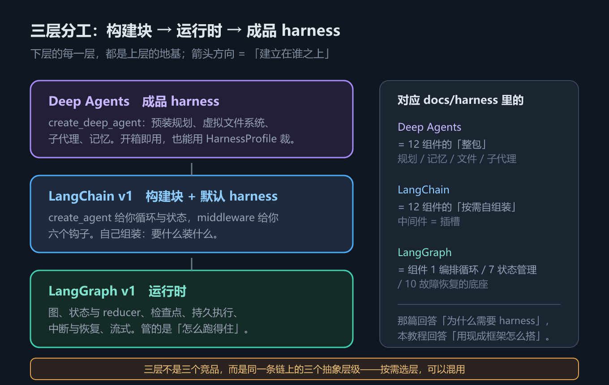
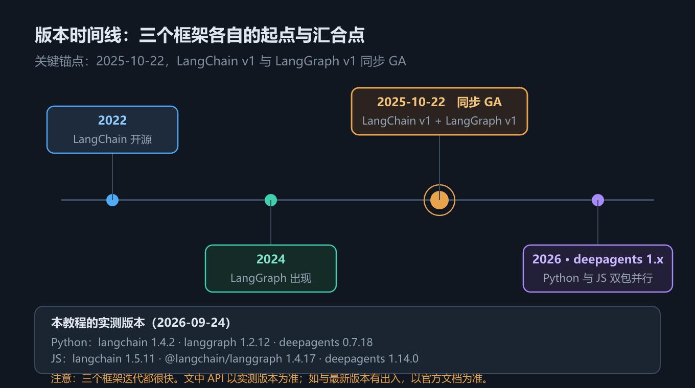

# 第 1 章 三件套定位与心智模型：构建块、运行时与成品 harness

## 一、这一章要解决的问题

LangChain、LangGraph、Deep Agents 这三个名字在彼此的文档里反复出现：装 `langchain` 会带进 `langgraph`，想用 Deep Agents 又得先看懂 `create_agent`。不先把「谁管哪一段」钉死，后面每一章都会在同一个地方卡住——比如明明装了 `langchain`，却在 `langchain.agents.middleware` 里找不到 `FilesystemMiddleware`。

这一章只回答三件事：

1. 三者各自**是什么**，边界画在哪；
2. 它们**怎么叠起来**，一次请求从入口到落盘经过哪些层；
3. **版本锚点**在哪，两套语言 SDK 的入口分别叫什么。

本章**不含代码示例**，因此第三节不是代码节，而是安装与环境。它是全书的地图，不是第一段程序。

## 二、机制与原理

### 2.1 先把一个词对齐：Harness

本仓库另有一篇原理篇 [`docs/harness/`](../harness/README.md)，回答的是「**为什么**需要 harness」：`Agent = Model + Harness`，长周期任务必然带来五个问题（上下文腐化、错误累积、跨会话失忆、权限越界、无法自验），harness 的 12 个组件就是为对冲这五个问题而存在。

本篇回答的是另一个问题：「**用现成框架怎么搭**」。而两篇的口径是同一套——LangChain 官方 v1 文档对 Agent 与 Harness 的定义与原理篇完全一致：

> An agent is a model calling tools in a loop until a given task is complete.
>
> 中译：**Agent 是一个在循环中调用工具、直到给定任务完成的模型。**

> The harness is everything around that loop — prompts, tools, and any middleware that shapes the model's behavior.
>
> 中译：**Harness 是围绕该循环的一切——提示词、工具，以及任何塑造模型行为的中间件。**

这句话是全书的主轴：**循环本身很小，harness 才是工程量所在**。三个框架的差别，本质上就是「帮你把 harness 的哪一段做掉了」。

### 2.2 三层分工：构建块 / 运行时 / 成品 harness

下表回答的问题是：**遇到一个需求时，我该去翻哪个框架的文档？**

| 层 | 框架 | 定位 | 一句话 | 覆盖 harness 的哪一段 |
|---|---|---|---|---|
| **构建块** | LangChain v1 | 一个**高度可配置的 harness** | `create_agent` 给你循环 + 中间件插槽，其余自己组装 | 循环、提示词、工具、中间件插槽 |
| **运行时** | LangGraph v1 | **图 + 状态 + 持久化**的底层基础设施 | 管状态、管检查点、管中断、管恢复 | 状态机、持久化、中断恢复、流式 |
| **成品 harness** | Deep Agents | 在 `create_agent` 之上**预装**一整套能力 | 规划、虚拟文件系统、子代理、记忆开箱即用 | 一整套预置中间件与工具集 |

三者的依赖方向是单向的：**Deep Agents 依赖 `create_agent`，`create_agent` 编译出的是 LangGraph 图**。所以学的时候是从下往上（先懂循环，再懂图，最后懂预装栈），用的时候是从上往下（先试 Deep Agents，不够再往下钻）。


*图 1　三件套分层：构建块 / 运行时 / 成品 harness*

一句话记住边界（**是心智模型上的分工，不是「谁没这个能力」**）：**想找提示词、工具、中间件，去 LangChain 那一层；想找状态、检查点、中断、恢复，去 LangGraph 那一层。**

之所以强调「不是能力边界」：实现上两边互相依赖——`create_agent` 编译出来的**就是**一张 LangGraph 图，签名里就有 `checkpointer`（第 2 章参数表列了）；LangGraph 也自带 `ToolNode` 这类预置件。所以这句话回答的是「**该去哪一层找答案**」，不是「谁不认识什么」。

### 2.3 版本时间线

下图回答的问题是：**为什么网上教程的写法经常和你的代码对不上？**


*图 2　版本时间线*

关键锚点只有一个：**LangChain v1 与 LangGraph v1 于 2025-10-22 同步 GA**（官方公告）。在此之前，两者的 0.x 版本 API 与 v1 差异很大——这是绝大多数「教程跑不起来」的根因。Deep Agents 不在同一条发布线上，它以 `deepagents` 包独立演进：**Python 包还在 0.x（实测 0.7.18），JS 包已到 1.x（实测 1.14.0）**，两边版本号不同步。

本教程所有结论的实测版本如下（2026-09-24，Windows，Python 3.13.14 / Node 22.22.2）：

| 语言 | 组件 | 实测版本 |
|---|---|---|
| Python | `langchain` / `langchain-core` | 1.4.2 / 1.6.4 |
| Python | `langgraph` | 1.2.12 |
| Python | `deepagents` | 0.7.18 |
| Python | `langchain-openai` / `langchain-anthropic` | 1.6.5 / 1.7.4 |
| JS | `langchain` / `@langchain/core` | 1.5.11 / 1.2.12 |
| JS | `@langchain/langgraph` | 1.4.17 |
| JS | `deepagents` | 1.14.0 |

注意最后两行：**Python 的 `deepagents` 是 0.7.18，JS 的 `deepagents` 是 1.14.0**。两边的版本号**不同步**，不要按版本号对齐功能——判断某个能力在不在，去查该语言自己的包。

### 2.4 Python / JavaScript 双 SDK 对照

下表回答的问题是：**我在 Python 里学会的写法，换成 TypeScript 要改哪几个字？**

| # | 主题 | Python | TypeScript |
|---|---|---|---|
| 1 | 入口函数 | `create_agent` / `create_deep_agent` | `createAgent` / `createDeepAgent` |
| 2 | 内存检查点 | `InMemorySaver` | `MemorySaver` |
| 3 | 内存 Store | `InMemoryStore`（`langgraph.store.memory`） | `InMemoryStore`（`@langchain/langgraph`） |
| 4 | 工具定义 | `@tool` 装饰器 + 类型注解 + docstring | `tool(fn, { name, description, schema })`，schema **必填** |
| 5 | 中间件定义 | 装饰器（`@before_model` 等）或 `AgentMiddleware` 子类 | `createMiddleware({ beforeModel, wrapModelCall, ... })` |
| 6 | 改写模型请求 | `handler(request.override(model=...))` | `handler({ ...request, model })` |
| 7 | `HarnessProfile` | `HarnessProfile(system_prompt_suffix=...)`，集合用 `frozenset` | `createHarnessProfile({ systemPromptSuffix })`，集合用 `Set` |
| 8 | 结构化输出默认策略 | 工具策略（脚本模型即可跑通） | provider 原生 JSON schema（需真实模型支持） |

命名规律很清楚：**Python 用 snake_case 的参数与函数名，JS 用 camelCase**（`response_format` / `responseFormat`、`context_schema` / `contextSchema`）。完整 14 条差异清单见 [`code/README.md`](code/README.md)——那里面还包含几条只有踩过才知道的坑（比如节点名的大小写、返回 `Command` 时 JS 必须显式声明 `ends`）。

## 三、安装与环境

本教程的示例**全部离线可跑**：用一个脚本化的假模型替代真实 LLM，不需要 API Key、不产生网络请求，结果确定可复现。想换成真实模型，见 [`code/README.md`](code/README.md) 的「换用真实模型」一节。

安装三件套（Python 侧）：

```bash
python -m venv .venv
. .venv/Scripts/activate        # Windows；macOS / Linux 用 source .venv/bin/activate
pip install langchain langgraph deepagents
```

安装三件套（JS 侧）：

```bash
pnpm add langchain @langchain/langgraph deepagents
```

两处**可选**依赖需要单独装，官方文档常把它们当成默认就有（详见下一节）：

```bash
pip install "langchain[mcp]"        # MCP 接入，beta
pip install langgraph-checkpoint-sqlite   # SqliteSaver，默认安装不含
```

装完跑一段最小验证。Python 侧：

```python
from langchain.agents import create_agent

agent = create_agent(
    model="openai:gpt-4o",   # 换成你有 Key 的 provider:model
    tools=[],
)
result = agent.invoke({"messages": [{"role": "user", "content": "用一句话介绍你自己"}]})
print(result["messages"][-1].content)
```

TypeScript 侧：

```typescript
import { createAgent, HumanMessage } from "langchain";

const agent = createAgent({
  model: "openai:gpt-4o",   // 换成你有 Key 的 provider:model
  tools: [],
});
const result: any = await agent.invoke({
  messages: [new HumanMessage("用一句话介绍你自己")],
});
console.log(result.messages[result.messages.length - 1].content);
```

能打印出模型回复，就说明「循环 + 工具 + 模型」这条最小链路是通的。注意这段验证代码**需要真实 API Key**，属于本教程「未实测」的部分——本机没有 Key，`code/` 下的示例一律用假模型。

## 四、常见坑与边界条件

**1. 版本漂移是常态，节点名尤其不可信。** 三个框架迭代很快，`deepagents` 两个语言的版本号还不同步（Python 0.7.x / JS 1.x）。更要命的是：**图节点名是内部实现细节**——同一个中间件，Python 里叫 `PatchToolCallsMiddleware.before_agent`（P 大写），JS 里叫 `patchToolCallsMiddleware.before_agent`（p 小写）。要判断「装了哪些能力」，看工具列表或中间件清单，**不要硬编码节点名**。

**2. 「注册了」不等于「模型看得见」。** 这是全书反复出现的坑：Deep Agents 的工具节点里注册了 9 个工具，但**绑定给模型的只有 8 个**——因为默认后端不提供执行能力，`execute` 不向模型暴露。排查「模型为什么不用某个工具」时，先确认它到底有没有被绑定。

**3. 包归属容易记混。** 官方文档把 `FilesystemMiddleware`、`SubAgentMiddleware` 列在 LangChain 的 middleware 清单里，但实测（1.4.2）**`langchain.agents.middleware` 没有这两个类**，它们在 `deepagents` 里；`SkillsMiddleware` 也从 `deepagents.middleware` 导入，而不是 `deepagents` 顶层。按包归属去翻文档，比按概念翻更快。

**4. 两个「文档有、默认没装」的依赖。** MCP 接入需要额外装 `langchain[mcp]`；`SqliteSaver` 需要额外装 `langgraph-checkpoint-sqlite`。不装就是 `ModuleNotFoundError`，与代码写错无关。

**5. 本章的未实测范围。** 真实模型端到端（工具选择倾向、提示词遵从度、真实 token 计费）、LangSmith 上报、MCP 真实服务器连接，均**不在实测范围内**，正文会逐处标注。

## 五、关键结论

1. **Harness = 围绕 Agent Loop 的一切**——提示词、工具、中间件。循环很小，harness 很大；三个框架的差别就是「帮你做掉了 harness 的哪一段」。
2. **三层分工**：LangChain v1 = 构建块（循环 + 中间件插槽），LangGraph v1 = 运行时（图 + 状态 + 持久化），Deep Agents = 成品 harness（预装规划、文件系统、子代理、记忆）。
3. **依赖方向单向**：Deep Agents → `create_agent` → LangGraph 图。学是自下而上，用是自上而下。
4. **版本锚点**：LangChain v1 与 LangGraph v1 于 **2025-10-22** 同步 GA；Deep Agents 独立演进，且**两语言版本号不同步**（Python 0.7.18 / JS 1.14.0）。
5. **双 SDK 命名规律**：Python snake_case、JS camelCase；入口函数 `create_agent` / `createAgent`。
6. **本教程的口径**：API 名称、参数名、默认值一律以**本机实测**为准，与官方文档冲突处显式标注；需 API Key 的内容标注「未实测」。

## 本章要点回顾

- **Harness 是围绕循环的一切**；官方 v1 口径与 [`docs/harness/`](../harness/README.md) 原理篇一致——那篇讲「为什么需要 harness」，本篇讲「怎么用现成框架搭」。
- **三层**：构建块（LangChain v1）/ 运行时（LangGraph v1）/ 成品 harness（Deep Agents）；见**图 1**。
- **分层判据**：提示词 / 工具 / 中间件去 LangChain 找，状态 / 检查点 / 中断去 LangGraph 找——这是最快的定位方式（**心智模型上的分工**，不是「谁没这个能力」）。
- **版本锚点 2025-10-22**：LangChain v1 与 LangGraph v1 同步 GA；见**图 2**。
- **两语言版本号不同步**，功能差异以各自包为准。
- **双 SDK 对照**：`create_agent` / `createAgent`、`InMemorySaver` / `MemorySaver`、`@tool` / `tool(fn, { schema })`；完整 14 条见 `code/README.md`。
- **三个反复踩的坑**：节点名不可硬编码；「注册了 ≠ 模型看得见」；`FilesystemMiddleware` / `SubAgentMiddleware` / `SkillsMiddleware` 都在 `deepagents` 而不在 `langchain.agents.middleware`。
- **需额外安装**：`langchain[mcp]`、`langgraph-checkpoint-sqlite`。
- **示例全部离线可跑**（假模型），真实模型端到端、LangSmith、MCP 真实服务器**均未实测**。
