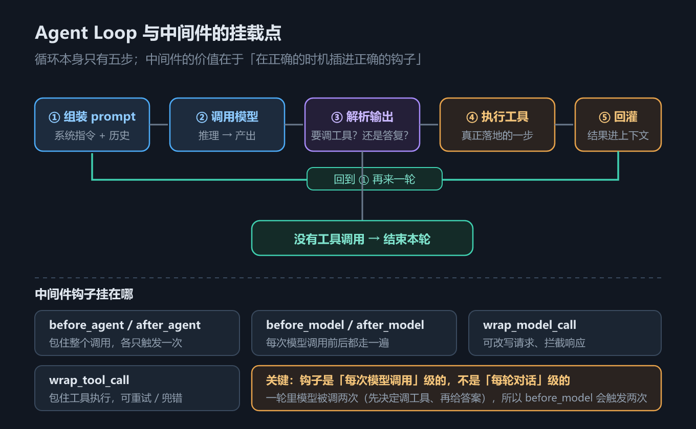
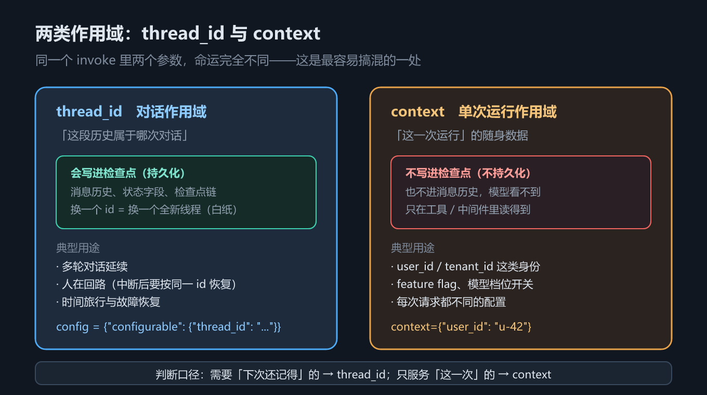

# 第 2 章 create_agent 与 Agent Loop：状态、作用域与结构化输出

## 一、这一章要解决的问题

第 1 章把三件套的边界画清楚了。从这一章开始写代码，而所有代码都从同一个函数长出来：`create_agent`（JS 侧 `createAgent`）。

它看起来只是一个「创建 agent」的工厂函数，实际上它一次性替你决定了好几件互相牵连的事：

1. **循环长什么样**——调模型、执行工具、回灌结果、再调模型，什么时候停；
2. **状态放在哪**——哪些东西跟着对话走，哪些东西只属于这一次运行；
3. **结果怎么取**——自由文本从哪读，结构化数据从哪读。

这三件事对应的三个坑分别是：「为什么模型好像自己执行了工具」、「为什么同一个 `thread_id` 的历史越滚越长」、「`response_format` 传了但返回值里找不到」。

## 二、机制与原理

### 2.1 Agent Loop：模型从不执行工具

循环的骨架只有四步：

```text
用户消息 → [模型] → 有 tool_calls？
                        ├─ 有 → [tools 节点执行] → ToolMessage 追加进状态 → 回到 [模型]
                        └─ 无 → 结束，最后一条消息就是回答
```

关键认知：**模型只输出「请调用 `get_weather(city='上海')`」这段结构化意图，它自己从不执行任何函数**。真正读参数、调函数、把返回值包成 `ToolMessage` 写回状态的是框架的 **tools 节点**。分清「模型做的」和「框架做的」，是排查 agent 行为问题的第一步——很多看起来像「模型幻觉」的现象，其实是框架在某一步把消息改写或丢弃了。


*图 3　Agent Loop 与中间件挂载点*

图 3 里那些挂在循环各处的挂载点就是**中间件**（第 3 章的主题）。`create_agent` 给你的不是「一个写死的循环」，而是「一个循环 + 一圈插槽」。

### 2.2 `create_agent` 的完整参数表

下表回答的问题是：**这个函数到底能配哪些东西？**（注意：**本表不列默认值**——`create_agent` 的参数默认值随版本变化，本教程只登记实测确认存在的参数名与语义，要查默认值请以你所用版本的签名为准。）

| 参数（Python / JS） | 作用 | 出处 |
|---|---|---|
| `model` | 模型实例，或 `"provider:model"` 字符串 | 实测示例 |
| `tools` | 工具列表 | 实测示例 |
| `system_prompt` / `systemPrompt` | 系统提示词——harness 的核心部分 | 官方文档 |
| `middleware` | 中间件列表（见第 3 章） | 实测示例 |
| `response_format` / `responseFormat` | 结构化输出 schema（见 2.5） | 实测示例 |
| `state_schema` / `stateSchema` | 自定义状态 schema（默认即 `AgentState`） | 官方文档 |
| `context_schema` / `contextSchema` | 单次运行的上下文 schema（见 2.4） | 实测示例 |
| `checkpointer` | 检查点存储，`thread_id` 生效的前提（见第 7 章） | 实测示例 |
| `store` | 跨线程长期记忆（见第 7 章） | 官方文档（本教程未实测） |
| `name` | agent 的名字；把它当子图挂进别的图时用于标识（见第 14 章） | 实测示例 |
| `interrupt_before` / `interrupt_after` | 在指定节点前后中断执行 | **实测签名**（文档正文未列出） |
| `cache` | 节点级缓存 | **实测签名**（文档正文未列出） |
| `transformers` | 消息变换器 | **实测签名**（文档正文未列出） |

最后三行是**差异清单第 7 条**的内容：官方文档的**正文叙述**只列了部分参数；`interrupt_before`、`interrupt_after`、`cache`、`transformers` 这几个要从 **API 参考页的签名**（或本机 `inspect.signature`）才看得到（实测版本 `langchain` 1.4.2）。所以「文档没写」指的是**正文没讲**，不是查不到——参考页本身就是签名。能用，但也不等于稳定，用之前先看自己版本的签名。

### 2.3 `AgentState.messages` 只追加

agent 的状态容器是 `AgentState`，它内置一个 `messages` 字段，并给这个字段绑定了 `add_messages` reducer（归并函数）。语义是：**你传进来的消息被追加到历史尾部，而不是替换历史**。

实测证据：同一个 `thread_id` 连续问两轮，第一轮后历史 1 条，**第二轮后历史 4 条而不是 2 条**——第二轮那一条 user 消息是「加」进去的，不是「换」上去的。

这件事有两面：

- **好处**：多轮对话天然成立，不需要你手动拼历史；
- **代价**：历史只增不减，几轮之后就会撞上上下文窗口——这就是第 5 章「上下文工程」要处理的问题。

注意这个「只追加」是 **`messages` 字段专属**的（靠 `add_messages` reducer 实现）。**自定义字段没有 reducer 时是「覆盖」语义**，两条规则不一样，第 6 章会给出实测对照。

### 2.4 两类作用域：`thread_id` 与 `context`

agent 里的数据分两层，混用会出很多怪问题。


*图 4　状态与两类作用域（thread_id / context）*

下表回答的问题是：**一个变量该放 `thread_id` 那一层，还是 `context` 那一层？**

| 维度 | `thread_id`（对话作用域） | `context`（单次运行作用域） |
|---|---|---|
| 归属 | 一次**对话** | 一次**运行** |
| 写入方式 | `config={"configurable": {"thread_id": "..."}}` | `invoke(..., context={...})` |
| 是否进检查点 | **是**，下次同 `thread_id` 可续上 | **否**，运行结束即丢弃 |
| 是否进消息历史 | 消息进（`messages` 字段） | **不进**，模型看不到 |
| 典型内容 | 消息历史、工具改写的状态 | `user_id`、租户 ID、feature flag、数据库连接 |
| 前置条件 | 需要 `checkpointer` | 需要 `context_schema` 声明 |

判断口径很简单：**「这次对话结束后还需要吗？」需要 → `thread_id`；不需要 → `context`。**`context` 是「这一次运行的随身证件」，工具里通过 `runtime.context` 读取，模型完全看不到它（除非你主动写进返回值）。

顺带一条实测差异：`context_schema` 的字段名两边各随本语言习惯——Python 示例里读 `runtime.context['user_id']`，JS 示例里读 `runtime.context.userId`。

### 2.5 结构化输出：`response_format`

自由文本输出对下游程序不友好。`response_format` 传一个 schema 后，框架会在状态里多写一个 `structured_response` 字段。

实测结论（Python 侧，`langchain` 1.4.2）：`result["structured_response"]` 拿到的是**已校验的 Pydantic 实例**，不是字符串，不需要自己 `json.loads`。

但两语言的**默认策略不同**，这是必须记住的差异：

| | Python | TypeScript |
|---|---|---|
| 默认策略 | **工具策略**（把 schema 包装成一个工具让模型调用） | **provider 原生 JSON schema 输出** |
| 脚本化假模型能否跑通 | 能（实测通过） | **不能**（策略工具不经 `bindTools` 暴露，假模型无法命中） |
| 实测状态 | **已实测** | **未实测——只给写法，不给结果** |

TypeScript 侧的写法是 `createAgent({ model, tools: [], responseFormat: Weather })`，取结果用 `result.structuredResponse`。这段代码需要真实模型（需 API Key），本机没有 Key，因此**未实测**。另外 JS 的策略工具名默认是 `"extract"`，可用 `schema.name` 覆盖。

## 三、代码：Python 与 TypeScript

下面两段是同一件事的两个语言版本，只留主干；完整版（含假模型脚本、四节完整输出）见 `code/` 下的文件。

Python 侧：

```python
from langchain.agents import create_agent
from langchain.tools import ToolRuntime, tool
from langgraph.checkpoint.memory import InMemorySaver
from pydantic import BaseModel, Field
from _fake_model import ScriptedChatModel, reply, tool_call   # 见 code/README.md

@tool
def get_weather(city: str) -> str:
    """查询某个城市的天气。"""
    return f"{city}: 22°C，晴"

# ① 一次工具调用的完整往返
agent = create_agent(
    model=ScriptedChatModel(script=[tool_call("get_weather", {"city": "上海"}, "call_1"),
                                    reply("上海 22°C，晴。")]),
    tools=[get_weather],
)
result = agent.invoke({"messages": [{"role": "user", "content": "上海天气怎么样？"}]})

# ② messages 只追加：同一 thread_id 再问一次
chat = create_agent(model=ScriptedChatModel(script=[reply("你好，我是脚本模型。"),
                                                   reply("你刚才说你叫小明。")]),
                    tools=[], checkpointer=InMemorySaver())
cfg = {"configurable": {"thread_id": "chat-1"}}
chat.invoke({"messages": [{"role": "user", "content": "你好，我叫小明。"}]}, cfg)
second = chat.invoke({"messages": [{"role": "user", "content": "我叫什么？"}]}, cfg)
print(len(second["messages"]))          # 4，不是 2

# ③ 两类作用域：thread_id 走 config，context 走 invoke 关键字
#     ctx_agent 的定义见 code/python/02_create_agent.py（一个读 runtime.context 的 whoami 工具）
out = ctx_agent.invoke({"messages": [{"role": "user", "content": "我是谁？"}]},
                       config={"configurable": {"thread_id": "ctx-1"}},
                       context={"user_id": "u-42"})

# ④ 结构化输出
class Weather(BaseModel):
    """天气查询结果。"""
    city: str = Field(description="城市名")
    temp_c: int = Field(description="摄氏度温度")

struct_agent = create_agent(model=ScriptedChatModel(script=[tool_call("Weather", {"city": "上海", "temp_c": 22}, "s1")]),
                            tools=[], response_format=Weather)
out = struct_agent.invoke({"messages": [{"role": "user", "content": "上海天气？"}]})
print(type(out["structured_response"]).__name__)   # Weather
```

TypeScript 侧：

```typescript
import { createAgent, tool, HumanMessage } from "langchain";
import { MemorySaver } from "@langchain/langgraph";
import { z } from "zod";
import { ScriptedChatModel, reply, toolCall } from "./_fakeModel";   // 见 code/README.md

const getWeather = tool(async (args: { city: string }) => args.city + ": 22C sunny", {
  name: "get_weather",
  description: "查询某个城市的天气。",
  schema: z.object({ city: z.string().describe("城市名") }),   // schema 必填
});

// ① 一次工具调用的完整往返
const agent = createAgent({
  model: new ScriptedChatModel({ script: [toolCall("get_weather", { city: "上海" }, "call_1"),
                                          reply("上海 22°C，晴。")] }) as any,
  tools: [getWeather],
});
const result: any = await agent.invoke({ messages: [new HumanMessage("上海天气怎么样？")] });

// ② messages 只追加
const chat = createAgent({
  model: new ScriptedChatModel({ script: [reply("你好，我是脚本模型。"), reply("你刚才说你叫小明。")] }) as any,
  tools: [], checkpointer: new MemorySaver(),
});
const cfg = { configurable: { thread_id: "chat-1" } };
await chat.invoke({ messages: [new HumanMessage("你好，我叫小明。")] }, cfg);
const second: any = await chat.invoke({ messages: [new HumanMessage("我叫什么？")] }, cfg);
console.log(second.messages.length);        // 4，不是 2

// ③ 两类作用域：thread_id 在 config 里，context 是 invoke 的同级字段
//     ctxAgent 的定义见 code/typescript/02_create_agent.ts（一个读 runtime.context 的 whoami 工具）
await ctxAgent.invoke({ messages: [new HumanMessage("我是谁？")] },
  { configurable: { thread_id: "ctx-1" }, context: { userId: "u-42" } });

// ④ 结构化输出（⚠️ 未离线实测，只给写法）
const Weather = z.object({ city: z.string(), tempC: z.number() });
const structAgent = createAgent({ model: "openai:gpt-4o" as any, tools: [], responseFormat: Weather });
// const s = await structAgent.invoke({ messages: [new HumanMessage("上海天气？")] });
// console.log(s.structuredResponse);      // { city: '上海', tempC: 22 }
```

实测输出（Python，2026-09-24）：

```text
① 一次工具调用的完整往返
  HumanMessage    : 上海天气怎么样？
  AIMessage       : (tool_calls: get_weather {"city": "上海"})
  ToolMessage     : 上海: 22°C，晴
  AIMessage       : 上海 22°C，晴。

② 第 1 轮后，历史里有 2 条消息
   第 2 轮后，历史里有 4 条消息（不是 2 条）

③ 工具看到的 context：user_id=u-42

④ type(result['structured_response']) = Weather
```

第 ① 节的四步消息序列（Human → AI(tool_call) → ToolMessage → AI(final)）就是 Agent Loop 的最小完整证据：中间那条 `ToolMessage` **不是模型写的**，是框架的 tools 节点写进去的。

## 四、常见坑与边界条件

**1. `response_format` 传了却取不到值。** 先确认读的是 `result["structured_response"]` 而不是最后一条消息。Python 侧返回的是**已校验的对象**（实测：Pydantic 实例），不是 JSON 字符串。JS 侧默认走 provider 原生 JSON schema，**脚本化假模型跑不通**——这不是你的代码错了，是策略不同。

**2. `thread_id` 不生效。** 没有 `checkpointer` 时，`thread_id` 只是个没人读的字符串，历史不会累积。要么配 `InMemorySaver`（JS `MemorySaver`），要么接受「每轮都是全新对话」。

**3. 把 `context` 当全局变量用。** `context` **不进检查点也不进消息历史**，运行一结束就没了。它适合放「这一次运行的随身数据」（用户 ID、租户、连接），不适合放「下次还要用的东西」。

**4. 把 `messages` 的追加语义套到自定义字段上。** `messages` 只追加是因为它绑了 `add_messages` reducer；**自定义字段默认是覆盖语义**。两条规则不同，第 6 章有实测对照表。

**5. 指望 `create_agent` 记住「非消息」的东西。** 默认 `AgentState` 里只有 `messages`。要放别的东西得用 `state_schema` 扩展，并且想清楚 reducer——否则你写的字段会被下一次 `invoke` 覆盖掉。

**6. 未实测范围。** TypeScript 侧的结构化输出（需 API Key）**未实测**；真实模型下的工具选择行为、token 计费同样不在实测范围内。本节的实测结论均来自脚本化假模型 + `langchain` 1.4.2。

## 五、关键结论

1. **Agent Loop = 模型 → 工具 → 回灌 → 再模型**；**模型只输出工具调用意图，执行工具的是框架的 tools 节点**。
2. **`create_agent` 的参数不止文档正文列的那些**——实测签名还含 `interrupt_before` / `interrupt_after` / `cache` / `transformers`（`langchain` 1.4.2）。
3. **`AgentState.messages` 只追加**（`add_messages` reducer）：实测第二轮历史 4 条而非 2 条；代价是上下文只增不减。
4. **两类作用域**：`thread_id` = 对话作用域，进检查点；`context` = 单次运行作用域，不进检查点、不进消息历史、模型看不到。
5. **结构化输出**：Python 侧 `result["structured_response"]` 是已校验对象（实测通过）；**JS 侧默认走 provider 原生 JSON schema，未实测**，只给写法。
6. **判断某个行为归属**：先问「这是模型做的还是框架做的」——大部分「模型幻觉」其实是框架的消息改写。

## 本章要点回顾

- **循环四步**：用户消息 → 模型 → 有 `tool_calls` 就执行工具并回灌 → 再模型，直到不再请求工具；见**图 3**。
- **模型从不执行工具**；`ToolMessage` 是框架写的。实测消息序列：Human → AI(tool_call) → ToolMessage → AI(final)。
- **参数表**按实测签名给全，含文档正文未列的 `interrupt_before` / `interrupt_after` / `cache` / `transformers`；**表内不列默认值**。
- **`messages` 只追加**；第二轮历史 4 条而非 2 条。自定义字段**没有 reducer 就是覆盖**。
- **两类作用域**见**图 4**：`thread_id`（对话，进检查点）/ `context`（单次运行，不进检查点、模型看不到）；`context` 需要 `context_schema`。
- **结构化输出**：Python `result["structured_response"]` 是已校验对象（实测）；JS `result.structuredResponse`，**未实测**，默认策略是 provider 原生 JSON schema。
- **JS 侧三个命名差异**：`createAgent`、`responseFormat`、`contextSchema`；工具定义 `schema` 必填。
