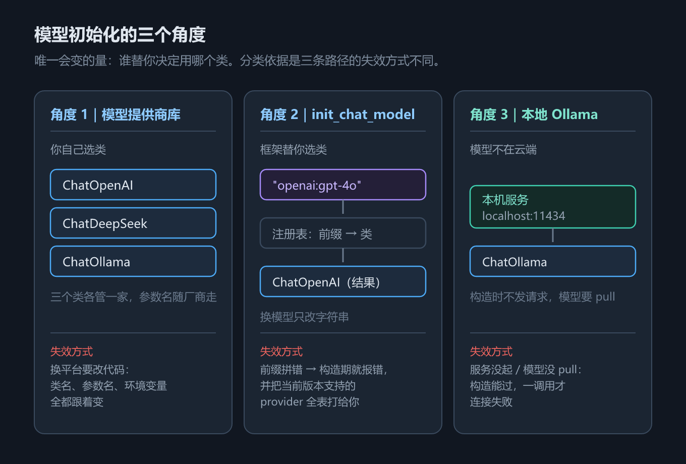
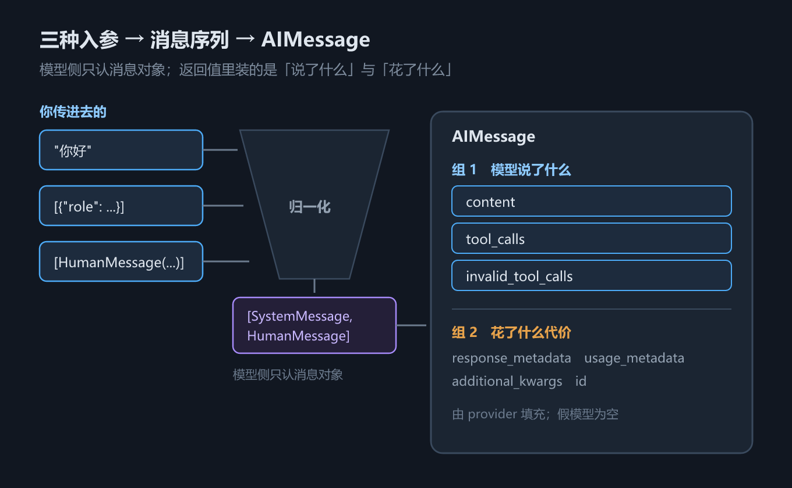

# 第 2 章 模型的创建与调用：三个初始化角度与四种调用形态

## 一、这一章要解决的问题

第 1 章把三件套的边界画完了，但一行代码都没写。从这一章开始动手，而所有 Agent 代码的第一行都长一个样：**先造一个模型对象，再把它交给别的东西。**

「造模型」看起来是全书最简单的一步——无非 `ChatOpenAI(...)`。但它同时替后面钉死了三件很难再改的事：

1. **用谁家的接口**——换个平台，类名、参数名、环境变量名、甚至「支不支持工具调用」全都跟着变；
2. **你传进去的东西，模型到底收到了什么**——这是排查一切「模型为什么不按我说的做」的起点；
3. **一次调用回来的对象里有什么**——只读 `content`，会把 token 账、结束原因、工具调用意图全丢掉。

这三件事对应的三个典型症状是：「明明设了 `temperature=0`，输出还是飘」、「我就传了个字典，怎么就报错了」、「钱花哪儿了不知道」。

本章只讲**单个模型对象**的创建与调用。它**不涉及**：Agent 循环（第 5 章 `create_agent` 与 Agent Loop）、消息类型与提示词模板的细节（第 3 章 Message 与提示词模板）、结构化输出（第 4 章 结构化输出）、工具与运行时上下文（第 7 章 工具与运行时上下文）。本章是它们共同的前置。

## 二、机制与原理

### 2.1 三个初始化角度

「初始化一个模型」这件事里，唯一会变的量是：**谁替你决定用哪个类**。按这个变量切，就得到三个角度——

- **角度 1｜模型提供商库**：你自己选类（`langchain-openai` 的 `ChatOpenAI`、`langchain-deepseek` 的 `ChatDeepSeek`）。控制最细，但参数名跟着厂商走。
- **角度 2｜统一入口 `init_chat_model()`**：你写 `"provider:model"` 字符串，框架按前缀去注册表里查该用哪个类。换模型只改字符串。
- **角度 3｜本地 Ollama（`ChatOllama`）**：模型不在云端，就在本机。前两个角度问的是「用哪家的 API」，这一个问的是「模型部署在哪」。

为什么这么分？因为这三种写法的**失效方式完全不同**：角度 1 换平台要改代码；角度 2 拼错前缀会在构造时就报错（见 2.2）；角度 3 服务没起、模型没 `pull`，构造能过但一调用就连接失败。分清楚你用的是哪一条路，就知道出错时该查什么。


*图 3　模型初始化的三个角度*

顺带对齐一个说法：本教程的内容底本（尚硅谷 LangChain 课件）把模型初始化拆成**三个轴**——谁家的 API / 参数写在配置文件还是硬编码 / 在线还是本地。本章取的是其中的第一条轴，因为它才是决定「代码怎么写」的那一条；另外两条是工程习惯问题——密钥放 `.env` 而不是硬编码，是常识，不必占一节。后文再提到「讲义」，指的都是这份底本。

### 2.2 `init_chat_model` 的常用参数

下表回答的问题是：**这个函数到底能配哪些东西，哪些是它自己的参数、哪些只是转发？**

实测签名（`langchain` 1.4.2）：

```python
init_chat_model(model=None, *, model_provider=None,
                configurable_fields=None, config_prefix=None, **kwargs)
```

**它自己的参数只有四个**，`temperature` / `api_key` / `base_url` / `max_tokens` 全走 `**kwargs` 转发给底层那个 `ChatXxx` 类。这一点是理解后面所有坑的钥匙：**转发意味着参数名不归 LangChain 管**——`ChatOpenAI` 收 `base_url`，`ChatDeepSeek` 收 `api_base`，写错了报错的是底层类，不是 `init_chat_model`。

| 参数 | 作用 | 谁在管 |
|---|---|---|
| `model` | 模型名，或 `"provider:model"` 形式 | `init_chat_model`（用来自动选类） |
| `model_provider` | 提供商名，等价于 `model` 里的前缀 | `init_chat_model`（用来自动选类） |
| `temperature` | 采样温度，越高越随机 | 转发给底层类 |
| `api_key` | 密钥；不传则从环境变量读 | 转发给底层类 |
| `base_url` | 请求地址 | 转发给底层类（**参数名随厂商变**） |
| `max_tokens` | 输出 token 上限 | 转发给底层类 |

两处**本机实测与讲义不一致**（讲义参数表引自官方文档 `.../models#parameters`），按本教程口径**以实测为准**：

- **`temperature` 的默认值**：讲义参数表写 `0.7`；实测 `ChatOpenAI.model_fields["temperature"].default` 是 `None`（不传就不传，由服务端决定），`ChatOpenAI.model_fields["model_name"].default` 才是 `"gpt-3.5-turbo"`。所以「不设温度」和「设成 0.7」不是一回事。
- **支持的 provider 列表**：讲义列了 **24 个**（且有两处拼写粘连：`bedrockbedrock_converse`、`google_vertexaigrog`）；实测报错信息里给出的完整列表是 **28 个**（`langchain` 1.4.2），比讲义多出 `baseten`、`langsmith`、`litellm`、`meta`：
  `anthropic, anthropic_bedrock, azure_ai, azure_openai, baseten, bedrock, bedrock_converse, cohere, deepseek, fireworks, google_anthropic_vertex, google_genai, google_vertexai, groq, huggingface, ibm, langsmith, litellm, meta, mistralai, nvidia, ollama, openai, openrouter, perplexity, together, upstage, xai`。
  这份列表会随版本变，别背——拼错时框架会把当前版本的全表打给你。

### 2.3 `invoke` 的三种入参形态

`invoke` 接受三种写法。下表回答的问题是：**这三种写法真的等价吗，为什么要有三种？**

| 你传的 | 模型实际收到 | 适用场景 |
|---|---|---|
| 一个字符串 | `[HumanMessage(...)]` | 快速测试、单轮问答 |
| `list[dict]`（`{"role": ..., "content": ...}`） | 逐条转成对应消息对象 | 报文、数据库里取出来的数据 |
| `list[Message]`（`SystemMessage` / `HumanMessage` / …） | 原样 | 代码里拼逻辑（本教程统一用这种） |


*图 4　invoke 三种入参 → AIMessage 结构*

实测结论：三种写法的归一化结果**逐条一致**（见本章第三节的运行输出）。差异只在你这一侧——`dict` 适合序列化和网络传输，消息对象有类型、能挂 `tool_calls`。消息类型本身的细节（四种角色、`content_blocks`、提示词模板）是第 3 章 Message 与提示词模板的主题。

一条**边界条件**值得单独记住：**`dict` 形态指的是 dict 的列表**。传单条 dict（`model.invoke({"role": "user", "content": "hi"})`）会被直接拒绝——Python 抛 `ValueError: Invalid input type <class 'dict'>`，JS 抛 `TypeError`。这不是「静默忽略」，是硬报错。

### 2.4 返回的 `AIMessage` 结构

`invoke` 返回的不是字符串，是一个 `AIMessage`。下表回答的问题是：**这个对象里除了文本，还有什么值得读？**

| 字段 | 含义 | 谁填的 |
|---|---|---|
| `content` | 最终文本 | 模型 |
| `tool_calls` | 模型请求调用的工具列表（`name` / `args` / `id`） | 模型 |
| `invalid_tool_calls` | 格式错误、无法解析的调用尝试 | 模型（异常情况） |
| `response_metadata` | 原始响应元数据：模型版本、`finish_reason` 等 | **provider 驱动** |
| `usage_metadata` | 标准化后的 token 账：`input_tokens` / `output_tokens` / `total_tokens` | **provider 驱动** |
| `additional_kwargs` | 厂商特有字段（如 DeepSeek 的 `reasoning_content`） | provider 驱动 |
| `id` | LangChain 内部给这次运行分配的 ID | 框架 |

前三个字段是「模型说了什么」，后四个是「这次调用花了什么代价」。**`response_metadata` 和 `usage_metadata` 由 provider 驱动填**——本教程的假模型不产生它们（实测：`response_metadata = {}`、`usage_metadata = None`），真实 provider 才会填。真实 provider 下的完整长相（讲义原文，**本教程未实测**）：

```text
content='2 + 3 * 2 = **8**'
response_metadata={'model_name': 'gpt-5.4-mini-2026-03-17',
                   'finish_reason': 'stop', 'model_provider': 'openai', ...}
usage_metadata={'input_tokens': 16, 'output_tokens': 15, 'total_tokens': 31, ...}
```

`finish_reason` 有两个常见取值：`stop`（正常结束）与 `length`（撞到 `max_tokens` 被截断）。看到「回答说到一半没了」，先查这个字段，再看 `max_tokens`。

### 2.5 四种调用形态

下表回答的问题是：**同一个模型，我该用哪个方法调它？**

| 方法（Python） | 对应 JS | 行为 | 典型场景 |
|---|---|---|---|
| `invoke` | `invoke` | 阻塞，一次返回一个 `AIMessage` | 批处理、无需实时反馈 |
| `stream` | `stream` | 返回 chunk 迭代器，边生成边拿 | 聊天机器人、长文本 |
| `batch` | `batch` | 一批输入，按**原顺序**返回 list | 文档摘要、批量分类 |
| `ainvoke` | **没有** | `invoke` 的异步孪生 | 高并发 Web 服务 |

这四个方法不是四套实现，而是两个维度的组合：**要不要等**（同步 / 异步）× **怎么收**（整条 / 流式 / 一批）。Python 把两个维度都做成了独立方法，所以有 6 个（`invoke` / `stream` / `batch` 与各自的 `a` 版本）；JS 只保留了「怎么收」那一维——因为 JS 的这三个方法本来就返回 `Promise`，`await` 一下就是异步版，不需要第二套名字。这是双语言最容易记混的一处。

`stream` 的 chunk 语义必须说清楚：**chunk 是「增量」，不是「片段」**。真实模型逐 token 产出，一条几百字的回答会分成多个 chunk（具体个数取决于模型与供应商，本教程**未实测**），要靠循环拼接。本教程的假模型**只吐 1 个 chunk**（一次给整条消息），而且类型是 `AIMessage` 而不是真实模型会用的 `AIMessageChunk`（Python 侧实测）——这两点都是为了让输出可复现，不是真实行为。所以「假模型 stream 只有 1 个 chunk」只能用来验证「框架的流式管道通了」，不能用来验证「分块粒度」；写 `isinstance(chunk, AIMessageChunk)` 这类判断时更要小心。

`batch` 也有两条纪律：**返回顺序与输入顺序一致**（实测 `["第一", "第二", "第三"]`），以及它的价值在真实网络下才体现——框架并发发出请求，比 `for` + `invoke` 少很多往返等待。想限制并发数，在 `config` 里传 `max_concurrency`（见 2.6）。

### 2.6 `profile` 属性与 `config` 参数

**`profile` 是模型的「能力画像」**：上下文窗口多大、支不支持工具调用、支不支持结构化输出。实测（`langchain-openai` 1.6.5，**构造层实测，未联网**）：

```text
init_chat_model('openai:gpt-4o').profile（节选）
= {'max_input_tokens': 128000, 'max_output_tokens': 16384,
   'tool_calling': True, 'structured_output': True}
```

两条边界：**① 画像存在与否取决于 LangChain 有没有为这个模型声明过**——声明过就是一个 dict（`gpt-4o` 实测 25 个键），没声明就是 `None`（实测 `openai:zzz-unknown-model`）；假模型继承基类，Python 侧是 `None`、JS 侧是 `{}`。**② 画像描述的是「构造出来的那个对象」，不是「服务端真的这么干」**，它适合做运行时判断，不适合当契约。

**`config` 是「这一次调用的记账方式」**，不改模型行为。下表回答的问题是：**config 里能放什么，各自影响什么？**

| 配置项 | 作用 | 本教程实测 |
|---|---|---|
| `run_name` | 给这次运行起个可读名字 | 透传到回调 |
| `tags` | 标签，用于分类过滤 | 透传到回调 |
| `metadata` | 任意键值对（`user_id`、`session_id`…） | 透传到回调 |
| `callbacks` | 回调处理器 | 触发 `on_chat_model_start` |
| `max_concurrency` | `batch` 的最大并发数 | 未实测 |
| `recursion_limit` | 图执行的递归深度上限 | 未实测（第 10 章 LangGraph 图与状态用得上） |
| `configurable` | 运行时覆盖模型参数 | 未实测；需初始化时声明 `configurable_fields` |

前四项的用途集中在**可观测**上：它们不进消息、不影响模型输出，只在追踪系统（如 LangSmith）里可见。第 17 章 可观测与评测会接着用它们。实测还发现框架会往 `metadata` 里**自动补**几个键：`ls_provider`、`ls_model_type`、`ls_integration`、`lc_versions`（JS 侧叫 `versions`）——这些不是你写的，是给追踪用的。

后三项属于另一类：**它们真的会影响执行**——`max_concurrency` 改并发度，`recursion_limit` 改递归上限，`configurable` 改这次调用实际用的模型参数。所以这张表按「只记账 / 真影响执行」分两半，读的时候要分清。

最后一条容易踩的点：**把 config 钉在模型对象上要用 `with_config()`，而它返回的不是原来的模型类**。实测 Python 返回 `RunnableBinding`、JS 也返回 `RunnableBinding`；照样能 `invoke`，但 `isinstance` / `instanceof` 判断会失败。要取回原对象用 `.bound`。

## 三、代码：Python 与 TypeScript

下面两段是同一件事的两个语言版本，只留主干；完整版（含五节完整输出）见 `code/python/02_models.py` 与 `code/typescript/02_models.ts`。

Python 侧：

```python
from _fake_model import ScriptedChatModel, reply, tool_call
from langchain.chat_models import init_chat_model
from langchain_core.callbacks import BaseCallbackHandler
from langchain_core.messages import HumanMessage, SystemMessage

# ① 三个初始化角度（只构造，不发请求）
direct = init_chat_model("openai:gpt-4o", api_key="sk-placeholder")     # → ChatOpenAI
compat = init_chat_model(model="deepseek-chat", model_provider="openai",  # 兼容用法：任何
                         api_key="sk-placeholder",                        # OpenAI 兼容平台
                         base_url="https://api.deepseek.com/v1")          # 都走 openai 前缀
init_chat_model("deepseek:deepseek-chat")   # ImportError：缺 langchain-deepseek
init_chat_model("qwen-plus")                # ValueError：推断不出 provider

# ② 三种入参形态 → 归一化（用 .seen 看模型实际收到什么）
probe = ScriptedChatModel(script=[reply("收到。")] * 3)
probe.invoke("翻译成英文：你好世界")                       # → [HumanMessage]
probe.invoke([{"role": "system", "content": "你是翻译助手。"},
              {"role": "user", "content": "翻译成英文：你好世界"}])   # → [System, Human]
probe.invoke([SystemMessage("你是翻译助手。"),
              HumanMessage("翻译成英文：你好世界")])                  # → [System, Human]
print(probe.seen[-1])        # 模型侧只认消息对象

# ③ AIMessage 结构
msg = ScriptedChatModel(script=[reply("2 + 3 * 2 = 8")]).invoke("2 + 3 * 2 = ？")
print(msg.content, msg.tool_calls, msg.response_metadata, msg.usage_metadata)
# 假模型：'2 + 3 * 2 = 8' [] {} None —— 后两项要真实 provider 才填

# ④ 四种调用形态
ScriptedChatModel(script=[reply("一次性返回。")]).invoke("你好")
list(ScriptedChatModel(script=[reply("流式输出。")]).stream("你好"))    # 假模型：1 个 chunk
ScriptedChatModel(script=[reply("第一"), reply("第二"), reply("第三")]).batch(["q1", "q2", "q3"])

# ⑤ profile 与 config
print(ScriptedChatModel(script=[reply("x")]).profile)      # 假模型：None
class TagProbe(BaseCallbackHandler):
    def on_chat_model_start(self, serialized, messages, *, tags=None, metadata=None, **kw):
        print(tags, metadata)                              # tags/metadata 只能从回调看见
ScriptedChatModel(script=[reply("收到。")]).invoke(
    "你好", config={"tags": ["ch02"], "metadata": {"user_id": "u-42"}, "callbacks": [TagProbe()]})
```

TypeScript 侧：

```typescript
import { initChatModel } from "langchain";
import { BaseCallbackHandler } from "@langchain/core/callbacks/base";
import { HumanMessage, SystemMessage } from "@langchain/core/messages";
import { ScriptedChatModel, reply } from "./_fakeModel";

// ① 三个初始化角度（只构造，不发请求）
// ⚠️ JS 的 initChatModel 是**异步**的，必须 await
const unified = await initChatModel("openai:gpt-4o", { apiKey: "sk-placeholder" });
// 本机未装 @langchain/openai，这一行会抛（中译：无法导入 @langchain/openai）：
//   Error: Unable to import @langchain/openai. Please install with `pnpm install @langchain/openai`
await initChatModel("qwen-plus");   // 抛 Unable to infer model provider（中译：推断不出模型提供商）

// ② 三种入参形态 → 归一化（用 seen 看模型实际收到什么）
const probe = new ScriptedChatModel({ script: [reply("收到。"), reply("收到。"), reply("收到。")] });
await probe.invoke("翻译成英文：你好世界");                        // → [HumanMessage]
await probe.invoke([{ role: "system", content: "你是翻译助手。" },
                    { role: "user", content: "翻译成英文：你好世界" }]);   // → [System, Human]
await probe.invoke([new SystemMessage("你是翻译助手。"),
                    new HumanMessage("翻译成英文：你好世界")]);            // → [System, Human]
console.log(probe.seen.at(-1));     // 模型侧只认消息对象

// ③ AIMessage 结构
const msg: any = await new ScriptedChatModel({ script: [reply("2 + 3 * 2 = 8")] })
  .invoke("2 + 3 * 2 = ？");
console.log(msg.content, msg.tool_calls, msg.response_metadata, msg.usage_metadata);
// 假模型："2 + 3 * 2 = 8" [] {} undefined

// ④ 三种调用形态（JS 没有 ainvoke，invoke/stream/batch 本身就返回 Promise）
const one: any = await new ScriptedChatModel({ script: [reply("一次性返回。")] }).invoke("你好");
const chunks: any[] = [];
for await (const c of await new ScriptedChatModel({ script: [reply("流式输出。")] }).stream("你好")) {
  chunks.push(c);                                    // 假模型：1 个 chunk
}
await new ScriptedChatModel({ script: [reply("第一"), reply("第二"), reply("第三")] })
  .batch(["q1", "q2", "q3"]);

// ⑤ profile 与 config
console.log(new ScriptedChatModel({ script: [reply("x")] }).profile);   // 假模型：{}
class TagProbe extends BaseCallbackHandler {
  name = "TagProbe";
  async handleChatModelStart(_llm: any, _m: any, _rid: string, _pid?: string,
                             _extra?: any, tags?: string[], metadata?: any, runName?: string) {
    console.log(tags, metadata, runName);   // tags/metadata 只能从回调看见
  }
}
await new ScriptedChatModel({ script: [reply("收到。")] }).invoke("你好", {
  tags: ["ch02"], metadata: { user_id: "u-42" }, callbacks: [new TagProbe()], runName: "my_run",
});
```

实测输出（Python，2026-09-29，`langchain` 1.4.2 / `langchain-openai` 1.6.5 / Python 3.13.14；**节选**，超长行做了折行、内容未改）：

```text
① 模型初始化的三个角度：提供商库 / init_chat_model / 本地 Ollama
    ChatOpenAI(model='gpt-4o') → ChatOpenAI，model_name='gpt-4o'
    init_chat_model('openai:gpt-4o') → ChatOpenAI（前缀 openai 自动选中了 ChatOpenAI）
    底层实际用的 base_url = https://api.deepseek.com/v1
      init_chat_model('deepseek:deepseek-chat') → ImportError: Initializing ChatDeepSeek
        requires the langchain-deepseek package. Please install it with `pip install langchain-deepseek`
      init_chat_model('qwen-plus') → ValueError: Unable to infer model provider for
        model='qwen-plus'. Please specify 'model_provider' directly.

② invoke 的三种入参形态，与模型实际收到的消息（.seen 观测）
  [字符串] 模型收到 1 条：['HumanMessage']
  [dict 列表] 模型收到 2 条：['SystemMessage', 'HumanMessage']
  [消息对象列表] 模型收到 2 条：['SystemMessage', 'HumanMessage']
  单条 dict → ValueError: Invalid input type <class 'dict'>.
               Must be a PromptValue, str, or list of BaseMessages.

③ 返回值 AIMessage 的字段结构
    content            = '2 + 3 * 2 = 8'
    tool_calls         = []
    response_metadata  = {}
    usage_metadata     = None
    id                 = lc_run--…   ← 框架自动生成的运行 ID（后半段每次不同）
    tool_calls = [{'name': 'get_weather', 'args': {'city': '上海'}, 'id': 'call_1', 'type': 'tool_call'}]

④ 四种调用形态：invoke / stream / batch / ainvoke
  invoke  → '一次性返回。'
  stream  → 1 个 chunk：['流式输出。']
  batch   → ['第一', '第二', '第三']
  ainvoke → '异步返回。'

⑤ profile 属性与 config 参数（tags / metadata / callbacks）
    假模型 profile = None（基类不带画像）
    init_chat_model('openai:gpt-4o').profile（节选）
      = {'max_input_tokens': 128000, 'max_output_tokens': 16384,
         'tool_calling': True, 'structured_output': True}
    [回调] tags     = ['ch02', 'demo']
    [回调] metadata = {'user_id': 'u-42', 'ls_provider': 'scriptedchatmodel',
                       'ls_model_type': 'chat', 'ls_integration': 'langchain_chat_model',
                       'lc_versions': {'langchain-core': '1.6.4', 'langchain': '1.4.2'}}
    返回对象类型 = RunnableBinding（不再是 ScriptedChatModel）
```

第 ② 节的三行「模型收到 N 条」就是本章最核心的证据：**三种写法在模型这一侧看起来完全一样**。第 ③ 节里 `response_metadata = {}`、`usage_metadata = None` 是假模型的产物，不是框架漏填。

## 四、常见坑与边界条件

**1. provider 前缀拼错，报错信息指向的是「包」而不是「前缀」。** 实测 JS 侧 `initChatModel("deepseek:deepseek-chat")` 抛的是 `Unable to import @langchain/deepseek`（中译：无法导入 `@langchain/deepseek`）——**前缀名与包名不是简单拼接**：实测 `openai` → `@langchain/openai`、`anthropic` → `@langchain/anthropic`、`ollama` → `@langchain/ollama`；读本机已装包源码（`langchain` 1.5.11 的 `chat_models/universal`）还能看到 `azure_openai` 也指向 `@langchain/openai`、`bedrock` 指向 `@langchain/aws`。Python 侧同一件事抛 `ImportError: Initializing ChatDeepSeek requires the langchain-deepseek package`（中译：初始化 `ChatDeepSeek` 需要 `langchain-deepseek` 包）。看到这类错，先去装包，别改前缀。

**2. `base_url` 的兼容用法，以及「前缀指的是协议不是厂商」。** 绝大多数平台都兼容 OpenAI 接口规范，所以没有专用集成时，把模型名和地址塞进 `openai` 前缀即可（实测：`model="deepseek-chat", model_provider="openai", base_url="https://api.deepseek.com/v1"` → 底层是 `ChatOpenAI`，`openai_api_base` 就是传进去的地址）。但要记住**参数名随厂商变**：讲义明确提示 `ChatDeepSeek` 用的是 `api_base` 而不是 `base_url`（本机未装 `langchain-deepseek`，这一条按讲义口径、**未实测**）。

**3. 环境变量名每个 provider 一套，而且不传 `api_key` 会**在构造时**就报错。** 实测 `init_chat_model("openai:gpt-4o")` 在不传 key 时直接抛 `OpenAIError: Missing credentials. Please pass an api_key ... or set the OPENAI_API_KEY ... environment variable`（中译：缺少凭据。请传入 `api_key`，或设置 `OPENAI_API_KEY` 环境变量）——不是等到调用才失败。命名规律是 `{PROVIDER}_API_KEY`，但**别猜**：`langchain-deepseek` 读 `DEEPSEEK_API_KEY`，`ChatTongyi` 读 `DASHSCOPE_API_KEY`，名字和 provider 名并不总是对得上。

**4. Ollama 必须先起服务，且要先 `pull` 模型。** `ChatOllama(model="deepseek-r1:1.5b")` 的构造不需要服务在线，所以「构造成功」不代表能用。默认地址 `http://localhost:11434`；服务没起是连接失败，模型没 `pull` 是模型不存在，两种报错要分清楚。本机无 Ollama，**未实测**。

**5. `stream` 的 chunk 是增量，不是片段。** 真实模型逐 token 产出多个 chunk，本教程假模型只吐 1 个、且类型是 `AIMessage` 而非 `AIMessageChunk`（均实测）。所以：**别用假模型的 chunk 数去推断真实分块粒度**，也别写死 `AIMessageChunk` 类型判断；另外别忘了把 chunk 拼起来才是完整回答。注意 `chunk.content` 与 `chunk.text` 都能读文本，但多模态场景下 `content` 可能是 list——第 3 章 Message 与提示词模板讲了 `content_blocks` 这个统一口径。

**6. `dict` 形态必须传列表。** 传单条 dict 是硬报错，且**两语言报错形态不同**：Python 是 `ValueError: Invalid input type <class 'dict'>. Must be a PromptValue, str, or list of BaseMessages.`（中译：输入类型非法，必须是 `PromptValue`、`str` 或 `BaseMessage` 的列表），JS 是 `TypeError: promptValue.toChatMessages is not a function`（中译：`promptValue.toChatMessages` 不是一个函数）——JS 那条信息完全看不出问题在哪，排查时要有心理准备。

**7. `with_config()` 之后对象类型就变了。** 实测 Python 与 JS 都返回 `RunnableBinding`，`isinstance(obj, ChatOpenAI)` / `obj instanceof ChatOpenAI` 都会是 `False`。它照样能 `invoke`，但如果你后面写了类型判断或按类取属性，就会在这一步断掉；要拿回原对象用 `.bound`。

**8. 本章的未实测范围。** 真实 provider 的 `invoke` / `stream` 真实分块 / token 计费，以及 `langchain-deepseek`、`langchain-ollama` 的参数细节，均**未实测**（本机无 API Key、无本地 Ollama）。本章所有「实测」结论分两类：**构造层实测**（不发请求，如 `init_chat_model` 的类映射、`profile` 内容、各类报错）与**假模型实测**（调用链路）。真实 provider 的调用行为不在其中。

## 五、关键结论

1. **三个初始化角度，按「谁决定用哪个类」切**：提供商库（自己选类）、`init_chat_model`（前缀选类）、本地 Ollama（模型在本机）。
2. **`init_chat_model` 自己的参数只有四个**（`model` / `model_provider` / `configurable_fields` / `config_prefix`），其余全是 `**kwargs` 转发——所以**参数名随厂商变**，这是「写错参数」类问题的根源。
3. **`invoke` 的三种入参形态归一化结果一致**（实测）：字符串 → 一条 `HumanMessage`，`dict` 列表与消息对象列表 → 同一组消息对象。**单条 dict 会被拒绝**。
4. **`AIMessage` 里「模型说了什么」是 `content` / `tool_calls`；「花了什么代价」是 `response_metadata` / `usage_metadata`**，后者由 provider 驱动填，假模型为空。
5. **四种调用形态**：`invoke` / `stream` / `batch` / `ainvoke`；**JS 侧没有异步孪生方法**，因为 `invoke` / `stream` / `batch` 本来就返回 `Promise`。`stream` 的 chunk 是增量不是片段。
6. **`profile` 是能力画像，声明过才有**（实测 `gpt-4o` 是 dict，未知模型是 `None`）；**`config` 是单次调用的记账信息**，`tags` / `metadata` / `run_name` 只透传给回调，不进消息。
7. **`with_config()` 返回 `RunnableBinding`**，不再是原来的模型类。

## 本章要点回顾

- **三个初始化角度**见**图 3**：提供商库 / `init_chat_model` / 本地 Ollama；分类依据是「谁替你决定用哪个类」，三种写法的失效方式各不相同。
- **`init_chat_model` 只有四个自己的参数**，`temperature` / `api_key` / `base_url` / `max_tokens` 都是转发；实测 `ChatOpenAI` 的 `temperature` 默认是 `None`（**与讲义参数表的 0.7 不一致，以实测为准**）。
- **实测 provider 列表 28 个**（讲义列的是旧集合），且会随版本变——拼错时框架会把全表打给你。
- **`invoke` 三种入参归一化一致**见**图 4**；实测字符串 → 1 条 `HumanMessage`，`dict` 列表 / 消息对象列表 → 2 条（System + Human）；**单条 dict 直接报错**。
- **`AIMessage` 七字段**：`content` / `tool_calls` / `invalid_tool_calls` / `response_metadata` / `usage_metadata` / `additional_kwargs` / `id`；假模型只填前三个（`response_metadata = {}`、`usage_metadata = None`）。
- **四种调用形态**：`invoke` / `stream` / `batch` / `ainvoke`；**JS 没有 `ainvoke` 这一套**；假模型 `stream` 只吐 1 个 chunk（可复现性取舍，不是真实行为）。
- **`profile`**：实测 `openai:gpt-4o` → `{'max_input_tokens': 128000, 'tool_calling': True, 'structured_output': True, ...}`；未知模型 → `None`；假模型 Python `None` / JS `{}`。
- **`config`**：`tags` / `metadata` / `run_name` / `callbacks` 只影响记账，实测透传到 `on_chat_model_start`；框架自动补 `ls_provider` / `ls_model_type` / `ls_integration` / `lc_versions`。
- **四个坑**：provider 前缀报错指向包名；`base_url` 是兼容用法但参数名随厂商变；不传 `api_key` 在**构造时**就失败；`with_config()` 返回 `RunnableBinding`。
- **未实测**：真实 provider 的 `invoke` / 真实 `stream` 分块 / token 计费 / DeepSeek 与 Ollama 的参数细节。示例全部离线可跑（假模型）。
