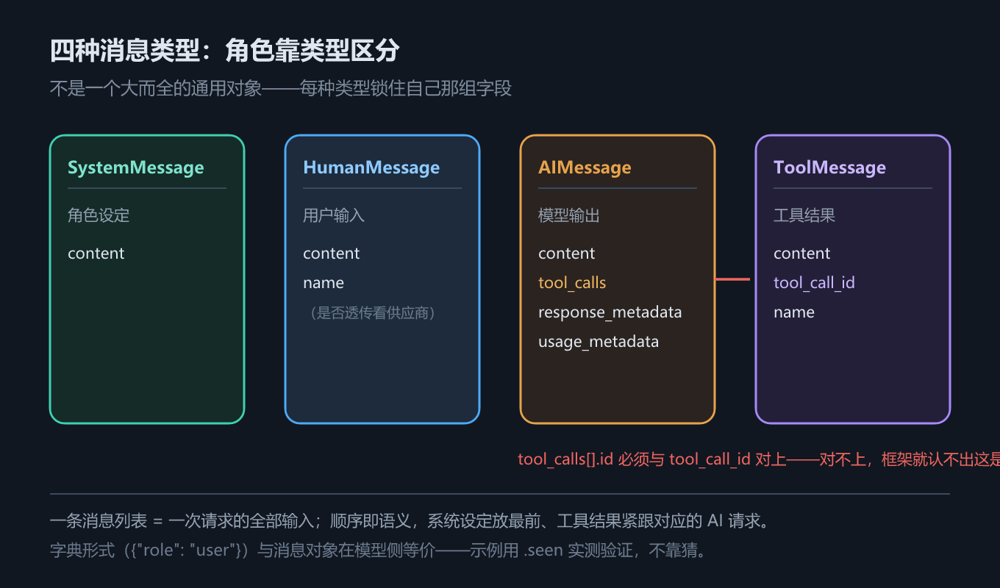
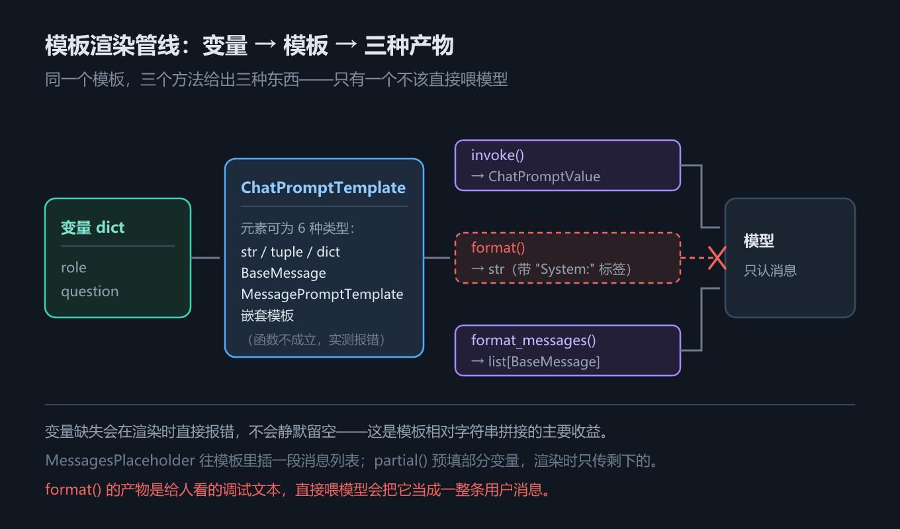

# 第 3 章 Message 与提示词模板：四种消息类型与模板渲染

## 一、这一章要解决的问题

第 2 章「模型的创建与调用」解决的是「模型怎么造出来、怎么调」。一旦开始调，紧接着就是第二个问题：**往里塞什么？**

大模型本身没有记忆。它的输出只和这一次请求里带进去的内容有关；很多大模型 API 服务也不在服务端维护会话历史，是**无状态**（stateless）的。所以「记住对话」这件事，从第一天起就是客户端自己的责任——你必须把该带的历史拼好、带全。

LangChain 里承担「带什么进去」的基本单元是 **Message（消息）**：它既代表模型接收到的输入，也代表模型生成的输出，还携带描述上下文状态的元信息。这一章回答两个问题：

1. **消息怎么构造**——四种消息类型各管什么、`tool_calls` 与 `tool_call_id` 怎么配对、JSON dict 和消息对象有什么区别、`content` 和 `content_blocks` 该用哪个；
2. **提示词怎么渲染**——`ChatPromptTemplate` 的三个调用方法返回什么、初始化时列表里能放哪六种东西、占位符与部分预填充怎么用。

这一章是后面两章的前置：第 4 章「结构化输出」要在消息上挂 schema，第 5 章「`create_agent` 与 Agent Loop」里流动的从头到尾都是这一章构造的消息。**把消息看懂，后面所有调试才有抓手**——很多看起来像「模型幻觉」的现象，其实是消息在这一步被拼错或被改写。

## 二、机制与原理

### 2.1 四种消息类型：角色靠类型区分

先回答「为什么是四种类型，而不是一个带 `role` 字段的通用对象」。

如果只有一个 `{role, content}` 的通用结构，那么「AI 请求调用工具」和「工具返回结果」这两种消息就得共用同一个字段空间——前者要带工具名和参数，后者要带「这是哪次调用的结果」。**它们的载荷根本不一样**，硬塞进一个类型，类型系统就帮不上任何忙，只能靠运行时约定。所以 LangChain 把角色拆成四个类，让「角色 → 载荷」在类型层面就定死。

第二个理由是**跨供应商统一**：LangChain 1.x 提供了一套跨模型的 Message 标准，OpenAI、Anthropic、Gemini 的消息格式差异由框架抹平。你写 `HumanMessage`，框架按当前 provider 翻译成对方要的样子——这也是为什么同一份代码能换模型跑。

下表回答的问题是：**这条消息是谁说的，它必须带哪些字段？**

| 类型 | dict 写法 | 关键字段 | 谁写的 | 用途 |
|---|---|---|---|---|
| `SystemMessage` | `{"role": "system", ...}` | `content` | 你（开发者） | 设定角色、行为准则、边界；对话开始时的「工作说明书」 |
| `HumanMessage` | `{"role": "user", ...}` | `content`、`name` | 你 / 用户 | 用户输入，可含多模态内容 |
| `AIMessage` | `{"role": "assistant", ...}` | `content`、`tool_calls`、`response_metadata`、`usage_metadata` | 模型 | 模型的输出：要么是文本，要么是工具调用意图 |
| `ToolMessage` | `{"role": "tool", ...}` | `content`、`tool_call_id`、`name` | 框架的工具节点 | 工具执行结果，回灌给模型继续生成 |



*图 5　四种消息类型*

表里有三个字段值得单独点出来：

- **`AIMessage.tool_calls`** 是一个 `ToolCall` 列表，每项含 `name`（要调哪个工具）、`args`（参数）、`id`（本次调用的唯一标识）。它是**模型的意图**，不是执行结果——模型从不执行任何函数（第 5 章会展开这一点）。
- **`ToolMessage.tool_call_id`** 必须等于上一条 `AIMessage` 里那个 `tool_calls[].id`。框架靠这个 id 把「工具结果」配回「是哪次调用」。对不上就会报错——这是 Agent Loop 的胶水，也是第 7 章「工具与运行时上下文」的前提。
- **`name`** 是元数据字段，用于同类型消息之间的区分（比如多人对话里标出发言者）。它是否真的被透传给模型，取决于模型供应商，**不能假设一定生效**（见第四节第 5 条）。

### 2.2 两种构造方式：JSON dict 与消息对象

同一段对话有两种写法。下表回答的问题是：**我该用哪一种？**

| 维度 | JSON dict | 消息对象 |
|---|---|---|
| 长什么样 | `{"role": "user", "content": "你好"}` | `HumanMessage("你好")` |
| 适合场景 | 从数据库、HTTP 报文、前端传来的数据 | 在代码里拼逻辑 |
| 校验时机 | 传进模型 / 模板时才转换并校验 | 构造时立即校验 |
| 能不能挂 `tool_calls` | 能，写在 `tool_calls` 键里 | 能，构造参数 |
| **模型侧看到的东西** | **转换后的消息对象** | **消息对象** |

最后一行是本节的关键。实测：把同一段对话分别以 dict 和消息对象喂给脚本化假模型，`.seen` 记录下来的类型序列**完全一致**：

```text
传 dict     → 模型侧收到: ['SystemMessage', 'HumanMessage', 'AIMessage', 'ToolMessage']
传消息对象  → 模型侧收到: ['SystemMessage', 'HumanMessage', 'AIMessage', 'ToolMessage']
两者是否一致: True
```

也就是说，**dict 在进入模型之前就被框架转成了消息对象，模型侧根本看不出区别**。「用哪种写法」纯粹是你这一侧的偏好问题。

但 dict 的键名是框架约定死的，写错就是校验报错而不是静默忽略：

- `assistant` 消息的工具调用放在 `tool_calls` 键下；
- `tool` 消息**必须**带 `tool_call_id`；
- 模板元素里的 dict 还额外要求键**恰好是** `role` 和 `content` 两个（多一个少一个都报 `ValueError`）。

### 2.3 `content` 与 `content_blocks`：弱类型内容 vs 标准化内容块

下表回答的问题是：**多模态内容到底怎么写、怎么读？**

| 维度 | `content` | `content_blocks` |
|---|---|---|
| 类型 | 弱类型：`str` 或 `list[dict]` | `list[TypedDict]`，每个块都有 `type` 字段 |
| 纯文本时 | `"你好"` | `[{"type": "text", "text": "你好"}]` |
| 多模态时 | `[{"type": "text", ...}, {"type": "image_url", "image_url": ...}]`，**字段名随供应商** | `[{"type": "text", ...}, {"type": "image", "base64": ..., "mime_type": ...}]`，**跨供应商统一** |
| 换模型 | 要改代码 | 不用改 |
| 读思维链 / 引用 | 要自己去 `additional_kwargs` 里扒 | 统一读，靠 `type` 区分 |

`content_blocks` 是 1.x 消息对象的重要升级，目标是提供一套**跨模型供应商标准化的多模态数据结构**。支持的块类型包括 `text`（文本）、`image`（图片）、`audio`（音频）、`video`（视频）、`tool_call`（工具调用）、`reasoning`（推理 / 思维链）。

实测三条（离线可验证）：

```text
纯文本 content       : '你好'
纯文本 content_blocks: [{'type': 'text', 'text': '你好'}]
从 content 反读 blocks: [{'type': 'text', 'text': '图里是一瓶香水。'}]
```

源码层面补一句：`content_blocks` 是一个 **property**（`langchain-core` 1.0.0 起提供），它的 docstring 是 `Load content blocks from the message content.`——中译：**从消息的 `content` 里解析出内容块**。所以它和 `content` 不是两份数据：`content_blocks=` 只是构造时的别名，最终都写进同一个 `content` 字段；而每次访问 `content_blocks` 都会**重新解析一遍，没有缓存**（讲义称其为「懒加载」，实测口径一致）。

实践口径很简单：**写多模态用 `content_blocks`，读思维链 / 引用优先读 `content_blocks`。**

### 2.4 多轮对话历史的管理与裁剪

因为模型无状态，**每次调用都必须传完整的历史**。讲义给了三种错误示范，可以归并成一条原则：**永远在同一个消息列表上追加，不要重新创建列表，也不要忘了把 AI 的回复存回去。**

```text
第 1 轮：  [system, user]
                                          → AI 回复 → 存回列表
第 2 轮：  [system, user, assistant, user]
                                          → AI 回复 → 存回列表
第 3 轮：  [system, user, assistant, user, assistant, user]
                                          → AI 回复 → 存回列表
```

注意每一轮的输入都是「上一轮的全部内容 + 这一轮的新输入」——列表**只追加，不重建**。

代价是历史只增不减，几轮之后就会撞上上下文窗口。这件事在第 5 章（`create_agent` 与 Agent Loop）会以「`messages` 字段只追加」的形式再出现一次，在第 9 章「上下文工程」里会系统处理。

这一章先给最小手段：**保留 system 消息 + 最近 N 轮对话**。

为什么单独把 system 消息挑出来保留？因为它承担的是**角色设定**——丢掉之后模型的语气、约束会整体漂移；而更早的问答只是上下文，丢掉代价小得多。这就是「只保留最近 N 轮」这条裁剪规则的依据。

实测：7 条历史裁到 5 条（system + 最近 2 轮），并且用假模型的 `.seen` 验证了**模型实际收到的就是裁剪后的那份**：

```text
原始历史: 7 条
裁剪之后: 5 条（system + 最近 2 轮）
  1. [SystemMessage] '你是 Python 导师。'
  2. [HumanMessage] '列表和元组有什么区别？用一句解释'
  3. [AIMessage] '列表可变，元组不可变。'
  4. [HumanMessage] '什么是字典？用一句解释'
  5. [AIMessage] '字典是键值对集合。'
→ 模型实际收到 6 条消息（裁剪后的 5 条 + 新问题 1 条）
```

这条输出说明的是：**模型没有记忆，你给多少它就看多少**。裁剪发生在客户端，不是模型的事。同时它也提醒一个风险：按「条数」硬切可能把一次工具调用切成半截（切掉 `AIMessage(tool_calls)` 却留下它的 `ToolMessage`），详见第四节第 4 条。

### 2.5 `ChatPromptTemplate` 的三种调用方式

先说为什么需要模板。

用 f-string 拼提示词在 demo 里够用，但变量一多就可读性骤降、改一处容易漏一处、**没有任何变量校验**（拼错了照样发出一个缺值的提示词）。更根本的问题是：现代聊天模型 API **原生支持角色概念**，它要的不是一个字符串，而是一个**结构化的消息列表**。用字符串去伪造角色（`"Human：你好\nAI：你好！..."`）不仅难维护，还极易让模型混淆对话边界。

于是 LangChain 1.x 的 Prompt 机制完成了一次替换：**`PromptTemplate`（字符串 → 字符串）让位给 `ChatPromptTemplate`（变量 → 消息列表）**。

下表回答的问题是：**三个调用方法返回的东西不一样，我该用哪个？**

| 方法 | 返回 | 类型 | 适合用来做什么 |
|---|---|---|---|
| `invoke(inputs)` | `ChatPromptValue` | 可直接喂给模型 | 走 Runnable 链、直接 `model.invoke(...)` |
| `format(**vars)` | 纯文本字符串 | `str` | 打印、写日志、喂给只吃字符串的旧接口 |
| `format_messages(**vars)` | 消息列表 | `list[BaseMessage]` | 还要再拼别的东西时 |



*图 6　ChatPromptTemplate 渲染管线：变量 → 模板 → 消息列表 → 模型*

三者**同源**：都先把变量填进模板，再决定输出成什么形态。实测：

```text
invoke()          → langchain_core.prompt_values.ChatPromptValue，含 4 条消息
format()          → str（纯字符串）
format_messages() → list，含 4 条消息

format() 的结果：
  System: 你是一个 AI 开发工程师。你的名字是 小谷AI。
  Human: 你能开发哪些 AI 应用?
  AI: 我能开发很多 AI 应用。
  Human: 你能帮我做什么?
```

注意 `format()` 把角色拼成了 `System:` / `Human:` / `AI:` 这样的**标签行**。这只是给人看的文本表示，**不要再拿它去调模型**——那会把结构化的角色信息压回一段字符串，正是 `ChatPromptTemplate` 想消灭的写法。

### 2.6 `ChatPromptTemplate` 初始化的六种参数类型

无论用 `ChatPromptTemplate([...])` 还是 `ChatPromptTemplate.from_messages([...])`，参数都是一个**列表**，而列表元素可以是六种类型。下表回答的问题是：**列表里每个位置到底能放什么？**

| # | 类型 | 例子 | 解决什么问题 |
|---|---|---|---|
| 1 | `str` | `"Hello, {name}!"` | 最省事，但**默认角色是 `human`**，写不出 system |
| 2 | `tuple` | `("system", "你的名字是{role}。")` | 最常用：角色字符串 + 模板字符串 |
| 3 | `dict` | `{"role": "system", "content": "..."}` | 数据来自 JSON / 配置时的自然形态 |
| 4 | `BaseMessage` | `SystemMessage("你是助手")` | 手上已经有实例化的消息对象 |
| 5 | `BaseMessagePromptTemplate` | `SystemMessagePromptTemplate.from_template("你是一个{role}")` | 先声明角色、再挂模板，可跨文件复用 |
| 6 | `BaseChatPromptTemplate` | `ChatPromptTemplate.from_messages([...])` | 模板拼模板，适合把提示词拆成多个文件维护 |

前三种面向「手写提示词」，第四种面向「已有消息对象」，第五种面向「跨文件复用的模板」，第六种面向「提示词分段维护」——**分类的依据是「这段提示词从哪来」，不是语法上的差别**。

实测六种都能渲染出消息列表：

```text
类型1 str → ['HumanMessage']
类型2 tuple → ['SystemMessage', 'HumanMessage']
类型3 dict → ['SystemMessage', 'HumanMessage']
类型4 BaseMessage → ['SystemMessage', 'HumanMessage']
类型5 MessagePromptTemplate → ['SystemMessage', 'HumanMessage']
类型6 嵌套 ChatPromptTemplate → ['SystemMessage', 'HumanMessage']
```

两点补充实测，都直接影响怎么写：

第一，**`BaseMessage` 里的花括号不会被当变量**。`HumanMessage(content="我的问题是:{word}英文怎么说？")` 渲染后 `{word}` **原样保留**，不会被替换。这不是 bug，而是「已实例化的消息不再参与模板渲染」这条规则的必然结果——它同时也是一条坑（见第四节第 6 条）。讲义也提到了这一点，本机实测确认。

第二，**「可调用对象」（函数）不是受支持的参数类型**。有些资料会把它列进「列表里能放什么」，实测是错的——把函数放进列表会直接报错：

```text
Python     : NotImplementedError: Unsupported message type: <class 'function'>
TypeScript : Error: Unable to coerce message from array: only human, AI, system, developer, or tool message coercion is currently supported.
```

Python 侧的类型别名 `MessageLikeRepresentation` 只认这六类：

```text
BaseMessagePromptTemplate | BaseMessage | BaseChatPromptTemplate | tuple | str | dict
```

其中 `str` 一类的官方注释是 `A string which is shorthand for ('human', template)`——中译：**字符串是 `('human', template)` 的简写**。这解释了为什么类型 1 的角色永远是 `human`。

### 2.7 `MessagesPlaceholder` 与 `partial()`

**`MessagesPlaceholder`（消息占位符）** 解决的是「历史里有几条消息、都是什么角色，我事先并不知道」这个问题。它把一整个消息列表**原样插入**到模板的指定位置，而不是把历史拼成一段文本：

```python
ChatPromptTemplate.from_messages([
    ("system", "你是一个{role}，目标用户是{audience}。"),
    MessagesPlaceholder("history"),   # ← 历史整段插在这里
    ("human", "{task}"),
])
```

实测渲染结果：

```text
  1. [SystemMessage] '你是一个客服专员，目标用户是普通用户。'
  2. [HumanMessage] '我买的东西坏了'
  3. [AIMessage] '很抱歉，我帮您处理。'
  4. [HumanMessage] '解释退款政策'
```

传入的历史是 `[("human", "..."), ("ai", "...")]` 这种**元组列表**也照样能渲染成消息对象。多轮对话、Agent 的中间步骤回灌都靠它。

**`partial()`（部分变量预填充）** 解决的是「有些变量每次调用都一样」这个问题。它返回一个**新的模板变体**，把指定的变量钉死，只留下真正会变的：

```text
partial() 之后，模板还需要的变量: ['history', 'task']
role / audience 已被钉死，渲染结果 → ['你是一个客服专员，目标用户是普通用户。', '解释退款政策']
```

同一套模板可以派生出「客服版」「销售版」，靠的就是 `partial()`。

## 三、代码：Python 与 TypeScript

下面两段是同一件事的两个语言版本，只留主干；完整版（八节、含假模型观测）见 `code/python/03_messages_prompts.py` 与 `code/typescript/03_messages_prompts.ts`。

Python 侧：

```python
from _fake_model import ScriptedChatModel, reply, show
from langchain_core.messages import AIMessage, HumanMessage, SystemMessage, ToolMessage
from langchain_core.prompts import ChatPromptTemplate, MessagesPlaceholder

# ① 四种消息类型：角色靠类型区分；tool_call_id 必须与 tool_calls[].id 对上
show([
    SystemMessage("你是一个严谨的技术助教。"),
    HumanMessage("上海天气怎么样？", name="alice"),
    AIMessage(content="", tool_calls=[{"name": "get_weather", "args": {"city": "上海"}, "id": "call_1"}]),
    ToolMessage(content="上海：22°C，晴", tool_call_id="call_1"),
    AIMessage("上海今天 22°C，晴。"),
])

# ② dict 与消息对象在模型侧等价——用 .seen 验证，而不是靠猜
model = ScriptedChatModel(script=[reply("上海 22°C，晴。")])
model.invoke([{"role": "system", "content": "你是助教"}, {"role": "user", "content": "天气？"}])
print([type(m).__name__ for m in model.seen[-1]])   # ['SystemMessage', 'HumanMessage']

# ③ 历史裁剪：保留 system + 最近 N 轮（system 是角色设定，丢了会整体漂移）
def keep_recent_messages(messages, max_pairs=2):
    system_msgs = [m for m in messages if isinstance(m, SystemMessage)]
    dialogue = [m for m in messages if not isinstance(m, SystemMessage)]
    return system_msgs + dialogue[-(max_pairs * 2):]

# ④ 三种调用方式返回三种东西
template = ChatPromptTemplate.from_messages([("system", "你的名字是 {name}。"), ("human", "{q}")])
value = template.invoke({"name": "小谷AI", "q": "你好"})          # ChatPromptValue
text = template.format(name="小谷AI", q="你好")                  # str
msgs = template.format_messages(name="小谷AI", q="你好")         # list[BaseMessage]

# ⑤ 六种初始化参数类型（详见完整版；str 的默认角色是 human）
built = ChatPromptTemplate.from_messages([
    ("system", "你是一个{role}"),
    MessagesPlaceholder("history"),
    ("human", "{q}"),
])
support = built.partial(role="客服专员")     # 预填充固定变量，返回新模板
```

TypeScript 侧：

```typescript
import { ChatPromptTemplate, MessagesPlaceholder } from "@langchain/core/prompts";
import { AIMessage, HumanMessage, SystemMessage, ToolMessage } from "@langchain/core/messages";
import { ScriptedChatModel, reply, show } from "./_fakeModel";

// ① 四种消息类型（JS 侧工具调用要显式写 type: "tool_call"）
show([
  new SystemMessage("你是一个严谨的技术助教。"),
  new HumanMessage({ content: "上海天气怎么样？", name: "alice" }),
  new AIMessage({ content: "", tool_calls: [{ name: "get_weather", args: { city: "上海" }, id: "call_1", type: "tool_call" }] as any }),
  new ToolMessage({ content: "上海：22°C，晴", tool_call_id: "call_1" }),
  new AIMessage("上海今天 22°C，晴。"),
]);

// ② dict 与消息对象在模型侧等价
const model = new ScriptedChatModel({ script: [reply("上海 22°C，晴。")] });
await model.invoke([{ role: "system", content: "你是助教" }, { role: "user", content: "天气？" }] as any);
console.log(model.seen[model.seen.length - 1].map((m: any) => m.constructor.name));

// ③ 历史裁剪（同上，写法一致）

// ④ 三种调用方式——⚠️ JS 侧三个都是异步的，必须 await
const template = ChatPromptTemplate.fromMessages([["system", "你的名字是 {name}。"], ["human", "{q}"]]);
const value: any = await template.invoke({ name: "小谷AI", q: "你好" });   // ChatPromptValue
const text = await template.format({ name: "小谷AI", q: "你好" });          // string
const msgs = await template.formatMessages({ name: "小谷AI", q: "你好" });  // BaseMessage[]

// ⑤ 六种初始化参数类型 + MessagesPlaceholder + partial
const built = ChatPromptTemplate.fromMessages([
  ["system", "你是一个{role}"],
  new MessagesPlaceholder("history"),   // ⚠️ JS 侧直接传变量名字符串
  ["human", "{q}"],
]);
const support: any = await built.partial({ role: "客服专员" });   // ⚠️ partial 也是异步
```

实测输出（Python，2026-09-29，`langchain` 1.4.2 / `langchain-core` 1.6.4）：

```text
① 四种消息类型：字段与用途
  1. [SystemMessage] '你是一个严谨的技术助教。'
  2. [HumanMessage] '上海天气怎么样？'
  3. [AIMessage] ''  tool_calls=[('get_weather', {'city': '上海'})]
  4. [ToolMessage] '上海：22°C，晴'
  5. [AIMessage] '上海今天 22°C，晴。'

② 两种构造方式：JSON dict 与消息对象
  传 dict     → 模型侧收到: ['SystemMessage', 'HumanMessage', 'AIMessage', 'ToolMessage']
  传消息对象  → 模型侧收到: ['SystemMessage', 'HumanMessage', 'AIMessage', 'ToolMessage']
  两者是否一致: True

③ content 与 content_blocks：多模态内容块
  纯文本 content       : '你好'
  纯文本 content_blocks: [{'type': 'text', 'text': '你好'}]
  多模态 content_blocks: [{'type': 'text', 'text': '这张图里有什么？'},
                          {'type': 'image', 'base64': 'iVBORw0KGgoAAAANSUhEUg...(略)', 'mime_type': 'image/png'}]

④ 多轮对话历史的管理与裁剪
  原始历史: 7 条
  裁剪之后: 5 条（system + 最近 2 轮）
  → 模型实际收到 6 条消息（裁剪后的 5 条 + 新问题 1 条）

⑤ ChatPromptTemplate 的三种调用方式
  invoke()          → langchain_core.prompt_values.ChatPromptValue，含 4 条消息
  format()          → str（纯字符串）
  format_messages() → list，含 4 条消息

⑥ ChatPromptTemplate 初始化的六种参数类型
  类型1 str → ['HumanMessage']
  类型2 tuple → ['SystemMessage', 'HumanMessage']
  类型3 dict → ['SystemMessage', 'HumanMessage']
  类型4 BaseMessage → ['SystemMessage', 'HumanMessage']
  类型5 MessagePromptTemplate → ['SystemMessage', 'HumanMessage']
  类型6 嵌套 ChatPromptTemplate → ['SystemMessage', 'HumanMessage']
  ⚠️ 可调用对象不受支持：NotImplementedError: Unsupported message type: <class 'function'>

⑦ MessagesPlaceholder 与 partial()
  带历史的渲染结果（4 条消息）：
    1. [SystemMessage] '你是一个客服专员，目标用户是普通用户。'
    2. [HumanMessage] '我买的东西坏了'
    3. [AIMessage] '很抱歉，我帮您处理。'
    4. [HumanMessage] '解释退款政策'
  partial() 之后，模板还需要的变量: ['history', 'task']

⑧ 验证：模板渲染出的消息，就是模型实际收到的消息
  1. [SystemMessage] '你是一个数学老师，回答要简短。'
  2. [HumanMessage] '1 + 1 = ?'
```

TypeScript 侧输出与之逐节对应，三处差异已在上面的代码注释里标出（`format` / `formatMessages` / `partial` 都是异步、`MessagesPlaceholder` 直接传变量名字符串、工具调用要显式写 `type: "tool_call"`）。

## 四、常见坑与边界条件

**1. `content` 可能是 list 而不是 str。** 纯文本时 `content` 是 `str`，多模态时它是 `list[dict]`。所以 `len(msg.content)`、`msg.content.startswith(...)`、`str(msg.content)` 这类写法在两种情况下语义完全不同——前者数的是字符数，后者数的是内容块个数。**判断类型，或者干脆统一用 `content_blocks`**。

**2. `format()` 返回 `str`，`format_messages()` 返回消息列表，别混用。** `format()` 的产物是给人和日志看的标签行文本，拿它去 `model.invoke(...)` 会把结构化的角色信息压回一段字符串——恰好是 `ChatPromptTemplate` 要消灭的写法。要喂模型，用 `invoke()` 的返回值或 `format_messages()`。

**3. 变量缺失会直接报错；模板里的花括号要转义。** 漏传变量时：

```text
Python     : KeyError: "Input to ChatPromptTemplate is missing variables {'q'}. Expected: ['q', 'role'] Received: ['role']"
TypeScript : Error: Missing value for input variable `q`
```

报错信息里会直接列出**期望哪些变量、实际给了哪些**，照着补即可。反过来，如果提示词里本来就有花括号（比如要求模型输出 JSON），必须写成双花括号转义：

```python
ChatPromptTemplate.from_messages([("human", '返回 JSON: {{"k": 1}} 变量 {v}')])
# 渲染结果：返回 JSON: {"k": 1} 变量 x
```

不转义就会把 `{"k": 1}` 里的 `"k"` 当成变量名，报 `missing variables {'"k"'}`。

**4. 按「条数」硬切历史，可能把一次工具调用切成半截。** 裁剪时如果切掉了 `AIMessage(tool_calls)` 却留下了它的 `ToolMessage`，模型就会看到一条「找不到对应调用的工具结果」。稳妥的做法是**按「轮」切而不是按「条」切**，或者检查切口是否落在一次完整工具往返的边界上。第 9 章「上下文工程」会给出更系统的裁剪手段。

**5. `name` 字段不一定被透传给模型。** `HumanMessage(name=...)` 在多人对话场景里很有用（让模型按发言人区分观点），但**是否支持取决于模型供应商**。讲义记录了一组对照：同一份「按 `name` 抽取发言人观点」的代码，走 OpenAI 官方接口时能正确读出 `Bob` / `Tom` / `audience`，走 `ChatOpenRouter` 网关时全部退化成 `unknown`；讲义还提到 DeepSeek 的 API 文档写明支持 `name`，但实测模型无法识别。所以不要把它当成可靠的结构化信号，要区分发言人时更稳的做法是把名字写进 `content`。**这一条属于讲义来源，本机未实测。**

**6. `BaseMessage` 里的花括号不会被替换。** 这是「已实例化消息不参与模板渲染」的规则，不是 bug。反过来用它也有好处：提示词里要写 JSON 示例时，放进 `SystemMessage(...)` 就完全不用转义。

**7. 本节未实测的范围。** 真实多模态调用（把图片 / 音频发给模型）需要 API Key；`name` 字段的透传行为依赖具体供应商。这两项**均未实测**，正文只给写法与出处。其余结论均来自脚本化假模型 + `langchain` 1.4.2 / `langchain-core` 1.6.4 的实测。

## 五、关键结论

1. **模型无状态，历史要自己维护**：每次调用都必须在同一个消息列表上追加、并保存 AI 的回复。
2. **四种消息类型是「角色 → 载荷」的绑定**：`SystemMessage` 定规则、`HumanMessage` 是输入、`AIMessage` 是输出（可带 `tool_calls`）、`ToolMessage` 回灌结果（必须带匹配的 `tool_call_id`）。
3. **JSON dict 与消息对象在模型侧完全等价**（实测 `.seen` 类型序列一致）；差别只在你这一侧的书写与校验时机。
4. **`content` 是弱类型，`content_blocks` 是标准化视图**：写多模态、读思维链 / 引用都优先用 `content_blocks`；它是 property，每次访问重新解析，不缓存。
5. **`ChatPromptTemplate` 的三种调用方式返回三种东西**：`invoke()` → `ChatPromptValue`（可直接喂模型）、`format()` → `str`、`format_messages()` → `list[BaseMessage]`。**JS 侧三者都是异步的。**
6. **初始化列表只认六种元素**：`str` / `tuple` / `dict` / `BaseMessage` / `BaseMessagePromptTemplate` / `BaseChatPromptTemplate`。分类依据是「提示词从哪来」。**`str` 默认角色是 `human`；可调用对象不受支持（实测报错）。**
7. **`MessagesPlaceholder` 插的是消息列表，`partial()` 钉的是固定变量**——前者给历史，后者做模板变体。
8. **裁剪历史的判据是「哪部分丢得起」**：system 是角色设定，必须留；更早的问答可以丢，但要保证不切断一次工具调用。

## 本章要点回顾

- **Message 是模型交互的最小单元**，既代表输入也代表输出；模型无状态，历史由客户端维护。
- **四种类型与关键字段**见**图 5**：`SystemMessage` / `HumanMessage` / `AIMessage`（`tool_calls`）/ `ToolMessage`（`tool_call_id` 必须与 `tool_calls[].id` 对上）。
- **两种构造方式等价**：dict 在进模型前被转成消息对象；实测模型侧类型序列完全一致。dict 的键名是约定死的（`role` / `content` / `tool_calls` / `tool_call_id`）。
- **`content` vs `content_blocks`**：前者弱类型（`str` 或 `list[dict]`，字段随供应商），后者是跨供应商统一的内容块列表；**真实多模态调用未实测**。
- **历史裁剪**：保留 system + 最近 N 轮；实测 7 → 5 条，且模型收到的就是裁剪后的那份。**别把一次工具调用切成半截。**
- **三种调用方式**见**图 6**：`invoke()` / `format()` / `format_messages()`；**JS 侧全部异步**。
- **六种初始化参数类型**：`str`（默认 human）/ `tuple` / `dict` / `BaseMessage`（花括号不渲染）/ `MessagePromptTemplate` / 嵌套 `ChatPromptTemplate`；**可调用对象不受支持**。
- **`MessagesPlaceholder` + `partial()`**：一个插历史列表，一个预填充固定变量。
- **三个必踩的坑**：`content` 可能是 list；`format()` 的字符串别拿去喂模型；提示词里的花括号要写 `{{` `}}`。
