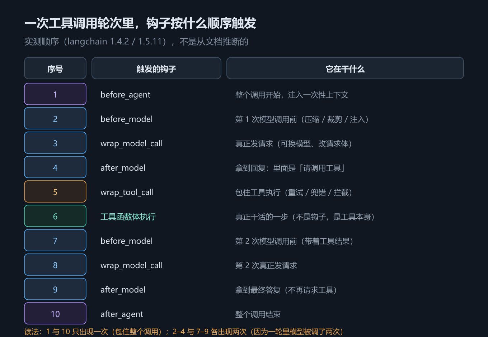
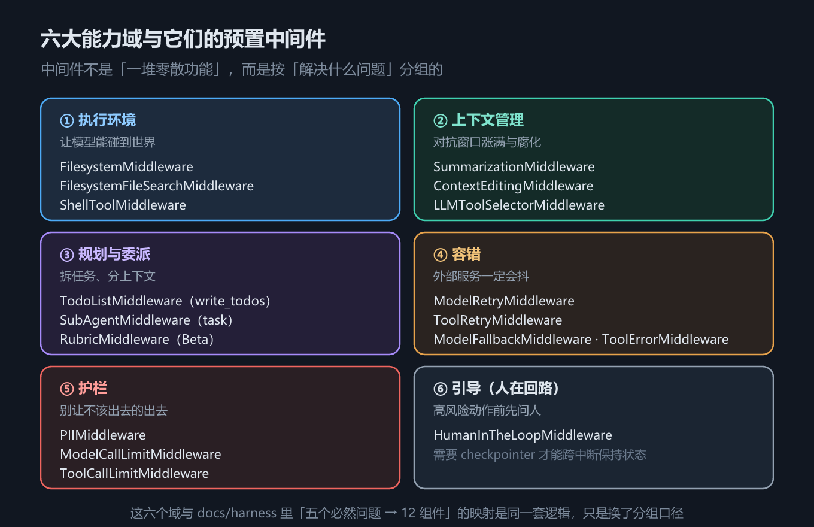

# 第 3 章 中间件：harness 的可插拔扩展点

## 一、这一章要解决的问题

第 2 章的循环是固定的：调模型、执行工具、回灌、再调。但真实项目马上会提出一堆循环之外的需求——历史太长要压缩、危险工具要人审、简单问题换便宜模型、跨会话要注入记忆、工具报错要重试。

这些需求**都不该去改框架源码**。LangChain v1 把它们统一收进一个扩展点：**中间件（middleware）**。回到第 1 章的定义，harness 是「围绕循环的一切」，而中间件就是这「一切」在 v1 里的**落点**。

这一章要解决三个问题：

1. 中间件到底能挂在循环的哪些位置，**执行顺序**是什么；
2. 两类中间件（node-style / wrap-style）能力差在哪；
3. 官方预置了哪些中间件，各自属于哪个包。

## 二、机制与原理

### 3.1 六个钩子与它们的实测触发顺序

一次含工具调用的完整轮次里，六个钩子的真实触发顺序如下（**实测，`langchain` 1.4.2**——官方文档只给出「模型调用前后」的示意，没有给出可执行顺序，这里以实测为准）：

```text
 1. before_agent
 2. before_model
 3. wrap_model_call
 4. after_model
 5. wrap_tool_call
 6. before_model
 7. wrap_model_call
 8. after_model
 9. after_agent
```

读法（这三句是理解全部中间件行为的关键）：

- `before_agent` / `after_agent` **包住整个 agent 调用**，各只触发一次；
- `before_model` → `wrap_model_call` → `after_model` 是**每一次模型调用**都走一遍；
- 上面出现了**两次** `before_model`，因为这一轮调了两次模型——第一次决定「要调 `get_weather`」，第二次拿到工具结果后给最终答案；
- `wrap_tool_call` 只在工具真正执行时出现一次，**夹在两次模型调用之间**；工具函数体是在 `wrap_tool_call` 之内执行的。


*图 5　六个钩子在一次工具调用中的真实触发顺序*

看到「`before_model` 出现两次」不要以为是 bug——**钩子的触发次数取决于这一轮调了几次模型，而不是调用了几次 agent**。这条认知能解释一大半「我的钩子为什么跑了两次」的疑问。

### 3.2 node-style 与 wrap-style：两类中间件

六个钩子分成两类，能力完全不同。

下表回答的问题是：**我这个需求该用哪一类钩子？**

| | node-style（`before_*` / `after_*`） | wrap-style（`wrap_model_call` / `wrap_tool_call`） |
|---|---|---|
| 钩子 | `before_agent`、`before_model`、`after_model`、`after_agent` | `wrap_model_call`、`wrap_tool_call` |
| 函数签名 | `(state, runtime)` | `(request, handler)` |
| 能否改写请求 | **不能直接改 `request` 对象**；但返回状态更新**可以改变模型看到的输入**（如改 `messages`） | **能**，改完 `request` 再交给 `handler` |
| 能否拦截响应 | 不能 | **能**，可以选择不调 `handler` 直接返回 |
| 组合方式 | 多个中间件按注册顺序**依次执行** | 层层**包裹**（洋葱模型），注册靠前的在外层 |
| 典型用途 | 审计、记账、往状态里注入数据、消息裁剪 | 换模型、重试、超时、脱敏、缓存、工具错误兜底 |

一句话判据：**只想「看」和「改状态」→ node-style；想「改请求」或「拦结果」→ wrap-style。**

wrap-style 的名字来源就是它的形态：`handler` 是「链条剩下的部分」，你不调它，后面的钩子和真正的模型调用就都不会发生——这是实现拦截、缓存、短路的地方。

### 3.3 六大能力域 × 预置中间件

下表回答的问题是：**我想要的能力，官方是不是已经有现成的了？**

| 能力域 | 预置中间件 | 归属包 | 详见 |
|---|---|---|---|
| 上下文治理 | `SummarizationMiddleware`、`ContextEditingMiddleware`（配合 `ClearToolUsesEdit`） | `langchain.agents.middleware` | 第 5 章 |
| 模型调用治理 | `PatchToolCallsMiddleware` | 默认装入 agent 图 | 本章 |
| 工具执行治理 | `ToolErrorMiddleware` | `langchain.agents.middleware` | 第 4 章 |
| 人在回路 | `HumanInTheLoopMiddleware` | `langchain.agents.middleware` | 第 8 章 |
| 规划与委派 | `TodoListMiddleware` / `SubAgentMiddleware` | `langchain.agents.middleware` / **`deepagents`** | 第 11 章 |
| 文件系统与记忆 | `FilesystemMiddleware`、`MemoryMiddleware`、`SkillsMiddleware` | **`deepagents`** | 第 10 / 12 章 |


*图 6　六大能力域 × 预置中间件*

「归属包」这一列是**差异清单第 3 条**的内容，务必记住：官方文档把 `FilesystemMiddleware`、`SubAgentMiddleware` 列在 LangChain 的 middleware 清单里，但实测 `langchain.agents.middleware`（1.4.2）**没有这两个类**，它们在 `deepagents` 里。同样，`SkillsMiddleware` 须从 `deepagents.middleware` 导入，`deepagents` 顶层不导出它（差异第 2 条）。

另外提醒：本矩阵只列**本教程后续章节会真正用到**的预置件。实测该包在 1.4.2 有 64 个导出，完整清单以你所用版本的 `__all__` 为准——不要在教程里背清单，要在代码里查。

### 3.4 自定义中间件：两种语言两种形态

| | Python | TypeScript |
|---|---|---|
| 装饰器 / 工厂 | `@before_model`、`@after_model`、`@wrap_tool_call` … | `createMiddleware({ beforeModel, wrapModelCall, ... })` |
| 类 / 对象 | 继承 `AgentMiddleware`，覆写同名方法 | 传一个对象字面量，字段名用 camelCase |
| 改写模型请求 | `handler(request.override(model=...))` | `handler({ ...request, model })` |

**改写请求的写法差异是双语言清单第 5 条**，也是最容易在两边复制粘贴时写错的一行：

- Python 侧是 `request.override(model=...)`——官方推荐写法。直接改 `request.model` 也能跑，但 `override` 会保留链上其它中间件的语义；
- JS 侧**没有** `request.override()`，约定是**展开原请求、覆盖要改的字段**：`handler({ ...request, model })`。

两边共同的纪律：**不要直接改 `request` 对象本身**，链上还有别的中间件在等它。

## 三、代码：Python 与 TypeScript

两段代码做同一件事：① 把六个钩子的触发顺序打出来；② 用 `wrap_model_call` 按消息数动态换模型。完整版见 `code/` 下对应文件。

Python 侧：

```python
from langchain.agents import create_agent
from langchain.agents.middleware import (AgentMiddleware, after_agent, after_model,
                                         before_agent, before_model, wrap_model_call,
                                         wrap_tool_call)
from langchain.tools import tool

TRACE: list[str] = []

@tool
def get_weather(city: str) -> str:
    """查询某个城市的天气。"""
    TRACE.append("        └─ 工具函数体真正执行")
    return f"{city}: 22°C，晴"

@before_agent
def hook_before_agent(state, runtime):
    TRACE.append("before_agent")

@wrap_model_call
def hook_wrap_model_call(request, handler):
    TRACE.append("wrap_model_call")
    return handler(request)          # 不调 handler 就等于拦下这次模型调用

# before_model / after_model / after_agent / wrap_tool_call 同形，此处略
agent = create_agent(model=..., tools=[get_weather], middleware=[hook_before_agent, hook_wrap_model_call, ...])
agent.invoke({"messages": [{"role": "user", "content": "上海天气？"}]})

# 改写模型请求：长上下文换强模型
class SwitchModelMiddleware(AgentMiddleware):
    def wrap_model_call(self, request, handler):
        if len(request.state["messages"]) > self.threshold:
            return handler(request.override(model=self.strong))   # ← Python 写法
        return handler(request)
```

TypeScript 侧：

```typescript
import { createAgent, createMiddleware, tool, HumanMessage } from "langchain";
import { z } from "zod";

const TRACE: string[] = [];
const getWeather = tool(async (args: { city: string }) => {
  TRACE.push("        └─ 工具函数体真正执行");
  return args.city + ": 22°C，晴";
}, { name: "get_weather", description: "查询某个城市的天气。", schema: z.object({ city: z.string() }) });

const traceMiddleware = createMiddleware({
  name: "TraceMiddleware",
  beforeAgent: () => { TRACE.push("before_agent"); },
  beforeModel: () => { TRACE.push("before_model"); },
  afterModel: () => { TRACE.push("after_model"); },
  afterAgent: () => { TRACE.push("after_agent"); },
  wrapModelCall: async (request: any, handler: any) => {
    TRACE.push("wrap_model_call");
    return handler(request);       // 不调 handler 就等于拦下这次模型调用
  },
  wrapToolCall: async (request: any, handler: any) => {
    TRACE.push("wrap_tool_call");
    return handler(request);
  },
});

const agent = createAgent({ model: ..., tools: [getWeather], middleware: [traceMiddleware] as any });
await agent.invoke({ messages: [new HumanMessage("上海天气？")] });

// 改写模型请求：JS 侧没有 request.override()，用展开覆盖
const switchModel = createMiddleware({
  name: "SwitchModelMiddleware",
  wrapModelCall: async (request: any, handler: any) =>
    request.state.messages.length > 2
      ? handler({ ...request, model: strong })    // ← JS 写法
      : handler(request),
});
```

实测输出（Python，2026-09-24）：

```text
  1. before_agent
  2. before_model
  3. wrap_model_call
  4. after_model
  5. wrap_tool_call
  6.         └─ 工具函数体真正执行
  7. before_model
  8. wrap_model_call
  9. after_model
 10. after_agent

wrap_* 钩子能改写请求：动态切换模型
  第一次调用：消息数 1 ≤ 2 → 用便宜模型
  最终回复：'便宜模型的回答'
  第二次调用：消息数 3 > 2 → 换用强模型
  最终回复：'强模型的回答'
```

两段输出合起来说明一件事：**钩子顺序由「这一轮调了几次模型、有没有执行工具」决定，而改写请求只影响这一次模型调用用的模型，不影响钩子顺序。**

## 四、常见坑与边界条件

**1. `before_model` 触发两次不是 bug。** 一轮里调了几次模型，它就触发几次。要「整个 agent 只跑一次」的逻辑，放 `before_agent` / `after_agent`。

**2. `after_model` 改不动模型已经产出的话。** 它拿到的是模型返回后的状态，改状态不会让模型重跑。要「干预模型看到的输入」，得用 `before_model`（改状态里的消息）或 `wrap_model_call`（改请求）。

**3. wrap-style 是洋葱，顺序容易想反。** 多个 `wrap_*` 中间件按注册顺序**外层在前**：靠前的先进入、后退出。排查顺序问题时要按「进栈 / 出栈」两侧分别看。

**4. 不调 `handler` 就是静默拦截。** 拦截是能力也是陷阱——忘了调 `handler`，表现为「模型好像没被调用」，而且不报错。写 wrap-style 时先确认每个分支都调了 `handler`。

**5. 改写请求不要直接改 `request` 对象。** Python 用 `request.override(...)`，JS 用 `handler({ ...request, model })`。直接改对象本身会污染链上其它中间件的语义。

**6. 包归属与导入路径。** `FilesystemMiddleware`、`SubAgentMiddleware` 在 `deepagents` 而不是 `langchain.agents.middleware`；`SkillsMiddleware` 从 `deepagents.middleware` 导入（差异第 2、3 条）。

**7. 上下文类中间件的参数形状两语言不同。** Python 是位置参数（`trigger=("messages", 8)`），JS 是对象（`trigger: { messages: 8 }`）——双语言清单第 7 条，第 5 章会用到。

**8. 未实测范围。** 本章实测只覆盖「六个钩子的顺序」与「`wrap_model_call` 换模型」两件事（脚本化假模型 + `langchain` 1.4.2 / JS 侧 `langchain` 1.5.11）。真实模型下的重试、超时、缓存行为，以及需要真实 provider 的中间件（如原生结构化输出）**未实测**。

## 五、关键结论

1. **中间件是 harness 在 v1 里的落点**：循环之外的一切——提示词、工具、行为塑造——都从这里插进去。
2. **实测触发顺序（`langchain` 1.4.2）**：`before_agent → before_model → wrap_model_call → after_model → wrap_tool_call → before_model → wrap_model_call → after_model → after_agent`。
3. **`before_agent` / `after_agent` 各一次**；`before_model → wrap_model_call → after_model` **每次模型调用走一遍**；`wrap_tool_call` 夹在两次模型调用之间。
4. **两类中间件**：node-style 只能读写状态（要影响模型输入得绕一层——改状态里的 `messages`）；wrap-style 能直接改请求、能拦结果、能短路（不调 `handler`）。
5. **六大能力域**：上下文治理、模型调用治理、工具执行治理、人在回路、规划与委派、文件系统与记忆；后两域的主要实现**在 `deepagents` 包里**。
6. **改写模型请求**：Python `handler(request.override(model=...))`，JS `handler({ ...request, model })`；都不要直接改 `request`。

## 本章要点回顾

- **中间件 = 循环上的挂载点**，见**图 5**；六大能力域与预置件见**图 6**。
- **实测顺序（1.4.2）**：`before_agent → before_model → wrap_model_call → after_model → wrap_tool_call → before_model → wrap_model_call → after_model → after_agent`。
- **钩子次数跟着模型调用次数走**：`before_model` 在一轮里出现两次是正常的。
- **两类中间件**：node-style（`(state, runtime)`，只能改状态，间接影响模型输入）/ wrap-style（`(request, handler)`，可直接改请求、可拦截、可短路）。
- **改写请求两语言写法不同**：Python `request.override(model=...)` / JS `handler({ ...request, model })`；**不要直接改 `request`**。
- **归属包**：`FilesystemMiddleware`、`SubAgentMiddleware`、`MemoryMiddleware` 在 `deepagents`；`SkillsMiddleware` 从 `deepagents.middleware` 导入。
- **预置清单别背**：实测 `langchain.agents.middleware` 在 1.4.2 有 64 个导出，以你所用版本的 `__all__` 为准。
- **自定义中间件**：Python 用装饰器或 `AgentMiddleware` 子类；JS 用 `createMiddleware({...})`。
