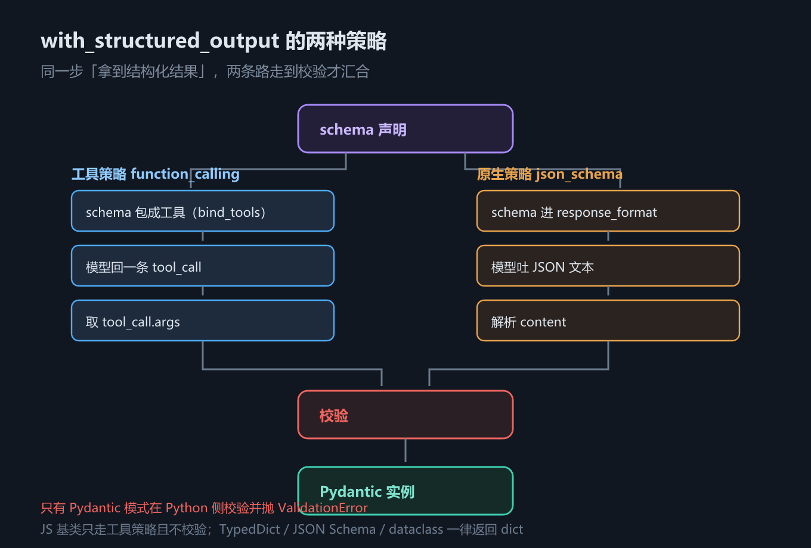

# 第 4 章 结构化输出：四种 schema 模式与两种策略

## 一、这一章要解决的问题

前一章讲完消息与提示词模板，模型已经能被「说话」了——但下游程序要的不是句子，是字段。

「让模型返回一个能直接喂给程序的对象」这件事，表面上只是换个参数，实际上牵出四个必须先想清楚的问题：

1. **结构怎么描述**——用 Pydantic 类、`TypedDict`、一段 JSON Schema，还是 `@dataclass`？它们能力一样吗？
2. **怎么把这个描述交给模型**——包成一个工具让模型「调用」，还是让模型走 provider 原生的 JSON 模式？
3. **拿回来的东西是谁解析、谁校验的**——失败了是抛异常还是静默给你一个坏对象？
4. **TypeScript 侧为什么经常不一样**——同一段 Python 逻辑换成 JS，默认策略、校验行为都可能变。

这四个问题都落在**模型这一层**，所以本章的主角是 `model.with_structured_output(...)`——它是离模型最近、也最不依赖 agent 的一个结构化输出 API。

而 agent 侧的 `response_format` / `responseFormat` 是**另一条路**（第 5 章 `create_agent` 与 Agent Loop 的主题），两者不是替代关系，是分工关系。本章 2.6 节专门讲清这条分界线，避免把两个 API 的默认值混为一谈。

本章的实测环境：Python `langchain` 1.4.2 / `langchain-core` 1.6.4 / `pydantic` 2.13.5；JS `langchain` 1.5.11 / `@langchain/core` 1.2.12 / `zod` 4.6.5。示例仍用脚本化假模型，**不需要 API Key**。

## 二、机制与原理

### 2.1 问题：手动链路的四个环节，每个都能静默出错

在 `with_structured_output` 之前，开发者写的是这样一条链：

```python
prompt = "以 JSON 格式返回：{name, age, occupation}"
response = model.invoke(prompt)              # ① 提示词要求 JSON
data = json.loads(response.content)          # ② 手动解析
if not isinstance(data["age"], int):         # ③ 手动校验
    raise ValueError("age must be int")
person = Person(**data)                      # ④ 手动建对象

# 换成结构化输出，这四环被压成一次调用：
structured = model.with_structured_output(Person)
person = structured.invoke("张三是一名 30 岁的软件工程师")
print(type(person))     # <class 'Person'>，不是 str、不是 dict
```

四个环节，每一环都有各自的失败方式：

| 环节 | 典型失败 | 后果 |
|---|---|---|
| ① 提示词要求 JSON | 模型在 JSON 前后加一句「好的，以下是结果：」 | `json.loads` 直接崩 |
| ② 手动解析 | 字段名写成 `title1`、`year2` | 解析成功，但下游取 `data["title"]` 拿到 `KeyError` |
| ③ 手动校验 | 忘了写 `isinstance` 那一行 | 类型错误一路流进数据库 |
| ④ 手动建对象 | 少一个字段 | `TypeError`，且发生在业务代码里而不是边界上 |

上表回答的问题是：**手动链路到底会在哪里断？** 答案是「每一环都可能，而且大部分是静默的」——②③ 两环尤其危险，因为 `json.loads` 成功不等于数据是对的。

结构化输出里，字段的 `description` 直接充当提示词的一部分，解析与校验由框架完成。下面是它的完整流程：



*图 7　with_structured_output 的两种策略*

TypeScript 侧是同一个思路，只是 schema 换成 `zod`、方法名换成驼峰：

```typescript
const Person = z.object({ name: z.string(), age: z.number(), occupation: z.string() });
const structured = model.withStructuredOutput(Person);
const person = await structured.invoke("张三是一名 30 岁的软件工程师");
console.log(person.name, person.age);
```

注意 `with_structured_output` **不是新的模型类**，它返回的是一个 `Runnable`——`model` 本身没被改动，只是套了一层「绑定 schema + 解析结果」的壳。所以它可以像普通 `Runnable` 一样接进链里，也可以直接 `invoke`。

### 2.2 四种 schema 模式：分界线是「有没有运行时类型信息」

LangChain 接受四种写法。下表回答的问题是：**描述一个结构，有哪几种写法，各自的代价是什么？**

| 模式 | 写法 | 返回 | 类型校验 | 能力边界 |
|---|---|---|---|---|
| **Pydantic** | `class P(BaseModel)` + `Field()` | **`P` 实例** | **有**，失败抛 `ValidationError` | 功能最全：约束、嵌套、枚举、默认值 |
| **`TypedDict`** | `class P(TypedDict)` + `Annotated` | `dict` | 无 | 只有类型声明，字段名错了也照收 |
| **JSON Schema** | 手写 dict，`title` / `type` / `properties` / `required` | `dict` | 无 | 最通用（跨语言、可序列化），但最啰嗦 |
| **`@dataclass`** | `@dataclass class P` | `dict` | 无 | 与 `TypedDict` 同级，写起来更像普通类 |

**为什么这么分？** 分界线只有一条：**这个 schema 在运行时是不是一个会自己校验的对象**。

- Pydantic 的 `BaseModel` 有 `model_validate`，所以框架能把模型给的 dict 喂进去、拿回一个实例，并在类型不对时抛错；
- `TypedDict` 和 `@dataclass` 都只是**类型声明**——`TypedDict` 在运行时就是一个 `dict` 的子类，`@dataclass` 生成的是 `__init__` / `__repr__`，两者都不会在字段名对不上时阻止你；
- JSON Schema 更彻底，它是一段**纯数据**，连 Python 类型都不是，所以「跨语言接口」最通用，「表达能力」也最弱。

这解释了一个容易误解的现象：**「四种都能用」和「四种都等价」是两件事**。四种都能绑到模型上、都能拿到结果，但只有 Pydantic 会在客户端拦住坏数据。

实测（`code/python/04_structured_output.py` 第 ② 节）：

```text
  Pydantic     工具名=Person       返回 Person   Person(name='张三', age=30, occupation='软件工程师')
  TypedDict    工具名=PersonDict   返回 dict     {'name': '张三', 'age': 30, 'occupation': '软件工程师'}
  JSON Schema  工具名=PersonJson   返回 dict     {'name': '张三', 'age': 30, 'occupation': '软件工程师'}
  @dataclass   工具名=PersonDC     返回 dict     {'name': '张三', 'age': 30, 'occupation': '软件工程师'}
```

上面这份输出里藏着本章第一个必须记住的实测结论：**「工具名」不是随便取的**。Pydantic / `TypedDict` / `@dataclass` 取类名，JSON Schema 取 `title` 字段——因为底层策略是把 schema 包成一个**工具**交给模型，模型回吐的 `tool_call.name` 必须和这个名字对上，解析器才能找到它（2.4 节会给出名字对不上时的后果）。

**TypeScript 侧只有两种形态。** 下表回答的问题是：**Python 的四种写法，JS 里各自对应什么？**

| Python | TypeScript | 说明 |
|---|---|---|
| Pydantic `BaseModel` | **`zod` schema** | 唯一带运行时校验能力的写法（但要配 agent 侧策略才生效，见 2.4） |
| JSON Schema dict | **JSON Schema dict** | 同样支持，工具名同样默认 `"extract"` |
| `TypedDict` | **无等价物** | TS 的 `interface` / `type` 编译后即被擦除，运行时拿不到字段信息 |
| `@dataclass` | **无等价物** | 同上；要「轻量结构」只能写 `interface` + 自己校验 |

实测（`code/typescript/04_structured_output.ts` 第 ② 节）：把被擦除的类型（运行时是 `undefined`）传给 `withStructuredOutput`，直接报 `TypeError: Cannot use 'in' operator to search for 'description' in undefined`——「中译：**无法在 undefined 上使用 `in` 运算符查找 'description'**」。这就是「类型擦除」在运行时的样子。

还有一处细节差异：**Python 的工具名从 schema 来，JS 的工具名默认是 `"extract"`**。JS 侧无论传 zod 还是 JSON Schema dict，基类实现都会落到同一个工具名上，只能用 `{ name: "..." }` 覆盖（实测见 2.3 节）。

### 2.3 两种策略：`function_calling` 与 `json_schema`

schema 描述完了，接下来是「怎么交给模型」。下表回答的问题是：**两条策略各自把 schema 变成了什么？**

| 策略 | 机制 | 模型要做什么 | 解析靠什么 |
|---|---|---|---|
| `method="function_calling"` | 把 schema 包成一个工具绑给模型（`bind_tools` + `tool_choice`） | 回一条 `tool_call`，`args` 就是结构化数据 | 从 `AIMessage.tool_calls` 里取 `args` |
| `method="json_schema"` | 走 provider 原生的结构化输出（如 OpenAI 的 `response_format: {type: "json_schema"}`） | 直接吐一段符合 schema 的 JSON 文本 | 解析 `message.content` 里的 JSON |

两者在**离线假模型上不可区分**，原因是一段很值得看的实测：Python 侧 `BaseChatModel.with_structured_output` 的实现里有一行

```python
_ = kwargs.pop("method", None)     # 取出来直接丢掉，后面永远走 bind_tools
```

——「中译：**把 `method` 参数取出来丢掉**」。也就是说，**基类实现会把 `method` 直接扔掉，永远走 `bind_tools` 那条路**。实测传 `method="json_schema"`、`method="bogus"` 都不报错、行为与默认完全一致：

```text
    bind_tools 收到：['Person']  额外参数：['ls_structured_output_format', 'tool_choice']
  默认（不传 method）          → Person(name='张三', age=30, occupation='软件工程师')
    bind_tools 收到：['Person']  额外参数：['ls_structured_output_format', 'tool_choice']
  method="function_calling" → Person(name='张三', age=30, occupation='软件工程师')
    bind_tools 收到：['Person']  额外参数：['ls_structured_output_format', 'tool_choice']
  method="json_schema"   → Person(name='张三', age=30, occupation='软件工程师')
```

真正实现 `json_schema` 的是 **provider 子类**（`ChatOpenAI` 等覆写了 `with_structured_output`）。所以「`method="json_schema"` 到底有没有生效」这个问题，**必须看你用的是哪个模型类**——用假模型或纯 `BaseChatModel` 子类时，它是个被忽略的参数。**本教程没有真实 provider，`json_schema` 的真实行为未实测。**

TypeScript 侧的基类实现同样只认工具调用，而且把这条限制写进了代码：

```typescript
// @langchain/core 1.2.12 · dist/language_models/chat_models.js（节选）
if (method === "jsonMode") throw new Error(`Base withStructuredOutput implementation only supports "functionCalling" as a method.`);
let functionName = name ?? "extract";   // 默认工具名，Python 侧没有这个默认值
```

——「中译：**基类的 withStructuredOutput 实现只支持 "functionCalling" 这一种 method**」。实测的行为是：

- 传 `{ method: "jsonMode" }` → 直接抛上面那个 `Error`；
- 传 `{ method: "jsonSchema" }` / `{ method: "functionCalling" }` / 不传 → **行为完全一致**，都走工具调用，默认工具名 `"extract"`。

**这就是「JS 默认走 json_schema」这句话需要修正的地方。** 准确的口径是：

- **provider 子类**（如 JS 版 `ChatOpenAI`）确实可能默认走 provider 原生 JSON schema——那是子类覆写的行为；
- **纯 `BaseChatModel` 子类**（含本教程的假模型）**默认就是工具调用**，和 Python 一样。

换句话说，「默认策略不同」不是 Python 与 JS 的语言差异，而是**基类与 provider 子类**的差异。本教程的假模型属于基类，所以两边默认一致。**真实 provider 的默认值本教程未实测，以你所用 provider 包的文档为准。**

### 2.4 类型校验：什么时候抛错、抛什么

这一节是双语言差异最大的一处。下表回答的问题是：**同一个 schema、同样一份坏数据，两个语言分别会怎样？**

| 场景 | Python（`langchain` 1.4.2） | TypeScript（`langchain` 1.5.11） |
|---|---|---|
| `age` 传 `"三十"` | 抛 `ValidationError`，`loc=('age',) type=int_parsing` | **原样返回** `{..., "age": "三十"}` |
| 漏填字段 | 抛 `ValidationError`，`type=missing` | **原样返回**，缺的字段就是不出现 |
| `age` 传 `"30"` | 强转成 `30`（Pydantic 默认宽松模式） | 原样返回字符串 `"30"` |
| `TypedDict` 字段名全错 | 原样透传，不报错 | 不适用（无 `TypedDict`） |
| 工具名对不上 | **静默返回 `None`** | **抛错** `No tool call found with name extract.` |

实测输出（Python 第 ④ 节）：

```text
  age 传中文 → ValidationError：loc=('age',) type=int_parsing
             msg=Input should be a valid integer, unable to parse string as an integer
  漏填 age  → ValidationError：loc=('age',) type=missing
  age 传 '30' → Person(name='张三', age=30, occupation='工程师')  （宽松模式，强转成功）
  TypedDict 字段名全错 → {'title1': '盗梦空间', 'year2': 2010}  （不校验）
```

实测输出（TypeScript 第 ④ 节）：

```text
  age 传中文 → {"name":"张三","age":"三十","occupation":"工程师"}
  漏填 age/occupation → {"name":"张三"}
```

两条结论：

1. **「校验」这件事只属于 Pydantic**（Python）。JS 的 `withStructuredOutput` 基类实现里，解析器只做一件事——「找到这条 `tool_call` 就返回它的 `args`」，**没有任何一步校验**。zod schema 在这个路径上只被用来生成 JSON Schema，不参与校验。
2. **坏数据在 JS 侧是「静默通过」的**，比 Python 更危险。要拿到校验，得走 agent 侧的工具策略（2.6 节），那条路径会用 zod 校验。

**`include_raw=True`：把异常降级成返回值。** 批量抽取任务里，一条坏数据不该打断整批。加上这个参数后返回结构变成三个字段：

| 键 | Python | TypeScript |
|---|---|---|
| `raw` | 原始 `AIMessage`（可读 token 用量） | 原始 `AIMessageChunk` |
| `parsed` | 校验后的对象，失败时为 `None` | 解析结果，失败时为 `null` |
| `parsing_error` | 异常对象，正常时为 `None` | **没有这个键** |

实测：Python 侧 keys 是 `['parsed', 'parsing_error', 'raw']`，JS 侧只有 `['raw', 'parsed']`——**JS 把错误吞掉了**，只留一个 `null`。

### 2.5 输出解析器：不推荐，但 API 仍在

在 `with_structured_output` 之前，标准做法是**输出解析器**（output parser）。它的流程是：

```text
提示词指导（把 schema 拼成文字塞进 system）
    → 模型生成文本
    → 解析器把文本转回对象
```

`PydanticOutputParser` 会把 schema 渲染成一段叫 `format_instructions` 的说明文字，由你手动拼进提示词：

```python
parser = PydanticOutputParser(pydantic_object=Movie)
prompt = ChatPromptTemplate.from_messages([
    ("system", "回答用户问题，必须始终输出 JSON。{format_instructions}"),
    ("human", "问题：{question}"),
])
chain = prompt.partial(format_instructions=parser.get_format_instructions()) | model | parser
```

TypeScript 侧是同一套东西，只是类名换成 `StructuredOutputParser.fromZodSchema`（注意 `partial()` 在这个版本返回的是 Promise，要 `await`）：

```typescript
const parser = StructuredOutputParser.fromZodSchema(Movie);
const prompt = ChatPromptTemplate.fromMessages([
  ["system", "回答用户问题，必须始终输出 JSON。{format_instructions}"],
  ["human", "问题：{question}"],
]);
const ready = await prompt.partial({ format_instructions: parser.getFormatInstructions() });
const chain = ready.pipe(model).pipe(parser);
```

实测两边都能跑通，但**整条链的成败压在「模型听话」上**：

```text
  Python  正常 JSON → Movie(title='盗梦空间', year=2010)
  Python  非 JSON 文本 → OutputParserException: Invalid json output: 《盗梦空间》2010 年上映
  JS      正常 JSON → {"title":"盗梦空间","year":2010}   （type = object）
  JS      非 JSON 文本 → OutputParserException | Failed to parse. Text: "《盗梦空间》2010 年上映".
                        Error: SyntaxError: Unexpected token '《', ... is not valid JSON
```

**为什么 v1 不再走这条路？** 三点：

1. **约束在提示词里，不在协议里。** 模型只是「被请求」输出 JSON，它完全可以在前面加一句「好的，以下是结果：」。
2. **失败是链级别的。** 解析失败会让整条 `chain` 断掉，没有重试、没有降级。
3. **token 花在描述上。** `format_instructions` 每次都要进 system 提示词，而 `with_structured_output` 把 schema 放在协议层（工具定义或 `response_format`），不占对话内容。

所以：**API 仍在（Python 的 `PydanticOutputParser` / `JsonOutputParser`、JS 的 `StructuredOutputParser` 都还能 import、还能用），但 v1 的路线不再推荐它。** 读旧代码时会遇到，新代码不要这么写。

### 2.6 与 agent 侧 `response_format` 的关系

到第 5 章 `create_agent` 与 Agent Loop 会看到 `response_format` 参数。它和 `with_structured_output` 的关系是**分工**，不是替代。下表回答的问题是：**我该用哪一个？**

| 维度 | `model.with_structured_output(schema)` | agent 侧 `response_format` / `responseFormat` |
|---|---|---|
| 作用范围 | **一次模型调用** | **agent 循环的最后一步**（拿到结构化结果即终止） |
| 结果取法 | `invoke()` 的返回值本身 | `result["structured_response"]` / `result.structuredResponse` |
| 是否重试 | 失败即抛（除非 `include_raw`） | **工具策略默认会重试**：把错误写回 `ToolMessage`，让模型自己改 |
| 策略参数 | `method="function_calling"` / `"json_schema"` | Python：`ToolStrategy` / `ProviderStrategy` / `AutoStrategy`；JS：`toolStrategy()` / `providerStrategy()` |
| 本章示例 | ①②③④⑤ 节 | ⑥ 节 |

Python 侧的三个策略类是 `with_structured_output` 的 `method` 在 agent 层的对应物：`ToolStrategy` 对应工具策略，`ProviderStrategy` 对应 provider 原生策略，`AutoStrategy` 由框架自动选。实测：`create_agent(model=..., tools=[], response_format=Person)` 传一个裸 schema 时会被包成 `AutoStrategy`，再由 `_supports_provider_strategy()` 读**模型的 `profile["structured_output"]` 标记**来决定——假模型没有这个标记，于是**落到 `ToolStrategy`**（工具名 `Person`，实测能跑通）。JS 侧是同一个判断思路，只是字段名不同（`model.profile.structuredOutput === true`）。

**工具策略最有价值的一点是「校验失败自动重试」**，这是 `with_structured_output` 没有的。实测（Python 第 ⑥ 节，模型第一次把 `age` 写成 `"三十"`）：

```text
  result['structured_response'] = Person(name='张三', age=30, occupation='软件工程师')
  1. [HumanMessage] '张三是一名 30 岁的软件工程师'
  2. [AIMessage] ''  tool_calls=[('Person', {'name': '张三', 'age': '三十', 'occupation': '工程师'})]
  3. [ToolMessage] "Error: Failed to parse structured output for tool 'Person..."
  4. [AIMessage] ''  tool_calls=[('Person', {'name': '张三', 'age': 30, 'occupation': '软件工程师'})]
  5. [ToolMessage] "Returning structured response: name='张三' age=30 occupatio..."
  模型被调用 2 次：第一次参数非法，框架把错误写回 ToolMessage，模型自己改对了。
```

第 3 条 `ToolMessage` 就是「重试」的全部秘密：**框架把校验错误原文写回对话，让模型看到自己错在哪**，然后回到循环顶部再调一次模型。把 `handle_errors=False` 关掉，行为立刻变成抛 `StructuredOutputValidationError`。

TypeScript 侧的行为一致。`responseFormat` 接受裸 schema（自动选策略）、`toolStrategy()`、`providerStrategy()` 三种写法，工具策略同样会重试：

```text
  toolStrategy(Person) 的策略工具名 = "Person"
  2. [AIMessageChunk] ""  tool_calls=[["Person",{"name":"张三","age":"三十","occupation":"工程师"}]]
  3. [ToolMessage] "Failed to parse structured output for tool 'Person':\n  - ..."
  4. [AIMessageChunk] ""  tool_calls=[["Person",{"name":"张三","age":30,"occupation":"软件工程师"}]]
  6. [AIMessage] "Returning structured response: {\"name\":\"张三\",\"age\":30,\"occ..."
```

三处 JS 侧细节：`toolStrategy(schema)` 返回的是一个**策略数组**（取 `[0].name` 拿工具名）；工具名默认是 `extract-1` 这样的**自增名字**（`zod` schema 没有 `title` 时），用 `.meta({ title: "Person" })` 才能固定；而 `providerStrategy()` 走的是「模型直接吐 JSON 文本」那条路，**校验失败不会重试，直接抛 `StructuredOutputParsingError`**。

## 三、代码：Python 与 TypeScript

下面两段只留主干，完整版（含假模型脚本、六节完整输出）见 `code/python/04_structured_output.py` 与 `code/typescript/04_structured_output.ts`。

Python 侧：

```python
from _fake_model import ScriptedChatModel, reply, tool_call   # 见 code/README.md
from langchain.agents import create_agent
from langchain.agents.structured_output import ToolStrategy
from pydantic import BaseModel, Field, ValidationError

class Person(BaseModel):
    """人物信息"""
    name: str = Field(description="姓名")
    age: int = Field(description="年龄")
    occupation: str = Field(description="职业")

# ① 一步到位：拿到的是 Person 实例，不是字符串
model = ScriptedChatModel(script=[tool_call("Person", {"name": "张三", "age": 30, "occupation": "软件工程师"}, "c1")])
person = model.with_structured_output(Person).invoke("张三是一名 30 岁的软件工程师")
print(type(person).__name__, person.name)          # Person 张三

# ② 非法参数抛 ValidationError；include_raw 则降级成返回值
try:
    ScriptedChatModel(script=[tool_call("Person", {"name": "张三", "age": "三十", "occupation": "工程师"}, "c1")]) \
        .with_structured_output(Person).invoke("x")
except ValidationError as exc:
    print(exc.errors()[0]["loc"], exc.errors()[0]["type"])   # ('age',) int_parsing

# ③ agent 侧：工具策略 + 校验失败自动重试
agent = create_agent(
    model=ScriptedChatModel(script=[tool_call("Person", {"name": "张三", "age": "三十", "occupation": "工程师"}, "c1"),
                                    tool_call("Person", {"name": "张三", "age": 30, "occupation": "软件工程师"}, "c2")]),
    tools=[], response_format=ToolStrategy(Person),
)
out = agent.invoke({"messages": [{"role": "user", "content": "张三是一名 30 岁的软件工程师"}]})
print(out["structured_response"])                  # Person(name='张三', age=30, ...)
```

TypeScript 侧：

```typescript
import { z } from "zod";
import { createAgent, HumanMessage, toolStrategy } from "langchain";
import { AIMessageChunk } from "@langchain/core/messages";
import { ScriptedChatModel, toolCall } from "./_fakeModel";   // 见 code/README.md

// ⚠️ withStructuredOutput 的解析器要求 AIMessageChunk，而公共假模型返回 AIMessage；
//    这里本地派生一个只改这一处的子类，不动公共假模型。
class ChunkScriptedChatModel extends ScriptedChatModel {
  async _generate(messages: any[]): Promise<any> {
    (this as any).seen.push([...messages]);
    const idx = Math.min((this as any).cursor, this.script.length - 1);
    (this as any).cursor += 1;
    const msg = this.script[idx];
    const calls: any[] = (msg as any).tool_calls ?? [];
    const chunk = new AIMessageChunk({
      content: msg.content,
      tool_calls: calls,
      tool_call_chunks: calls.map((c) => ({ name: c.name, args: JSON.stringify(c.args), id: c.id, index: 0, type: "tool_call_chunk" })),
    });
    return { generations: [{ text: String(chunk.content), message: chunk }] };
  }
}

const Person = z.object({
  name: z.string().describe("姓名"),
  age: z.number().describe("年龄"),
  occupation: z.string().describe("职业"),
}).meta({ title: "Person", description: "人物信息" });   // title 决定 agent 侧策略工具名

// ① 默认工具名是 "extract"，与 Python 不同
const m = new ChunkScriptedChatModel({ script: [toolCall("extract", { name: "张三", age: 30, occupation: "软件工程师" }, "c1")] }) as any;
console.log(await m.withStructuredOutput(Person).invoke("张三是一名 30 岁的软件工程师"));

// ② 基类不校验：age 传中文照样通过
const m2 = new ChunkScriptedChatModel({ script: [toolCall("extract", { name: "张三", age: "三十" }, "c1")] }) as any;
console.log(await m2.withStructuredOutput(Person).invoke("x"));   // {"name":"张三","age":"三十"}

// ③ agent 侧：工具策略 + 校验失败自动重试
const strategies: any = toolStrategy(Person);       // 返回的是数组
const toolName: string = strategies[0].name;        // "Person"（由 .meta({title}) 决定）
const m3 = new ChunkScriptedChatModel({
  script: [toolCall(toolName, { name: "张三", age: "三十", occupation: "工程师" }, "c1"),
           toolCall(toolName, { name: "张三", age: 30, occupation: "软件工程师" }, "c2")],
}) as any;
const agent = createAgent({ model: m3, tools: [], responseFormat: strategies });
const out: any = await agent.invoke({ messages: [new HumanMessage("张三是一名 30 岁的软件工程师")] });
console.log(out.structuredResponse);                // {"name":"张三","age":30,...}
```

两个示例的真实运行输出（2026-09-29）：

```text
======== Python：04_structured_output.py ========
① 手动链路 vs with_structured_output
  json.loads 成功，拿到 dict：{'name': '张三', 'age': '三十', 'occupation': '软件工程师'}
  手动校验 isinstance(data['age'], int) → False
  with_structured_output(Person) → Person 实例：Person(name='张三', age=30, occupation='软件工程师')
② 四种 schema 模式
  Pydantic     工具名=Person       返回 Person   Person(name='张三', age=30, occupation='软件工程师')
  TypedDict    工具名=PersonDict   返回 dict     {'name': '张三', 'age': 30, 'occupation': '软件工程师'}
  JSON Schema  工具名=PersonJson   返回 dict     {'name': '张三', 'age': 30, 'occupation': '软件工程师'}
  @dataclass   工具名=PersonDC     返回 dict     {'name': '张三', 'age': 30, 'occupation': '软件工程师'}
③ 两种策略
  默认（不传 method）          → Person(name='张三', age=30, occupation='软件工程师')
  method="function_calling" → Person(name='张三', age=30, occupation='软件工程师')
  method="json_schema"   → Person(name='张三', age=30, occupation='软件工程师')
④ 类型校验
  age 传中文 → ValidationError：loc=('age',) type=int_parsing
  漏填 age  → ValidationError：loc=('age',) type=missing
  age 传 '30' → Person(name='张三', age=30, occupation='工程师')  （宽松模式，强转成功）
  TypedDict 字段名全错 → {'title1': '盗梦空间', 'year2': 2010}  （不校验）
  include_raw=True → keys=['parsed', 'parsing_error', 'raw'] / parsing_error=ValidationError
  脚本回吐 Person，但 schema 是 PersonDict → None
⑤ 输出解析器
  正常 JSON → Movie(title='盗梦空间', year=2010)
  非 JSON 文本 → OutputParserException: Invalid json output: 《盗梦空间》2010 年上映
⑥ 与 agent 侧 response_format 的关系
  result['structured_response'] = Person(name='张三', age=30, occupation='软件工程师')
  1. [HumanMessage] / 2. [AIMessage] tool_calls=[('Person', age='三十')]
  3. [ToolMessage] "Error: Failed to parse structured output for tool 'Person..."
  4. [AIMessage] tool_calls=[('Person', age=30)] / 5. [ToolMessage] "Returning structured response: ..."
  模型被调用 2 次：第一次参数非法，框架把错误写回 ToolMessage，模型自己改对了。
  附：Ticket(title='订单未发货', urgency=<Priority.HIGH: '高'>, assignee=None)

======== TypeScript：04_structured_output.ts ========
① withStructuredOutput → {"name":"张三","age":30,"occupation":"软件工程师"}
  默认策略把 schema 绑成的工具名 = [["extract"]]
② zod → {"name":"张三","age":30,"occupation":"软件工程师"}   绑定工具名=[["extract"]]
  JSON Schema → {"name":"张三","age":30,"occupation":"软件工程师"}   绑定工具名=[["extract"]]
  withStructuredOutput(undefined) → TypeError: Cannot use 'in' operator to search for 'description' in undefined
③ 不传 config（默认） → {"name":"张三","age":30,"occupation":"软件工程师"}
  method=functionCalling → {"name":"张三","age":30,"occupation":"软件工程师"}
  method=jsonSchema → {"name":"张三","age":30,"occupation":"软件工程师"}
  method=jsonMode → Error: Base withStructuredOutput implementation only supports "functionCalling" as a method.
  name=Person → {"name":"张三","age":30,"occupation":"软件工程师"}
④ age 传中文 → {"name":"张三","age":"三十","occupation":"工程师"}
  漏填 age/occupation → {"name":"张三"}
⑤ keys = ["raw","parsed"] / parsed = {...} / raw 类型 = AIMessageChunk
⑥ toolStrategy(Person) 的策略工具名 = "Person"
  state.structuredResponse = {"name":"张三","age":30,"occupation":"软件工程师"}
  模型被调用 2 次（同 Python：ToolMessage 带回错误后重试）
  providerStrategy(Person) → {"name":"张三","age":30,"occupation":"软件工程师"}
  附：{"title":"订单未发货","urgency":"高"} / assignee = undefined
```

Python 输出里的第 ④ 节有两行值得单独看：`TypedDict 字段名全错 → {'title1': ...}` 说明**非 Pydantic 模式不校验**；而 `脚本回吐 Person，但 schema 是 PersonDict → None` 说明**工具名对不上时 Python 是静默的**。TS 输出里对应的那一步则是直接抛错——这是本章最后一条双语言差异，见第 4 节第 6 条。

## 四、常见坑与边界条件

**1. 工具名对不上，后果在两边不同。** Python 侧静默返回 `None`（实测），TS 侧抛 `No tool call found with name extract.`（实测）。所以在 Python 里换 schema 时要格外小心：**`None` 不是「模型没输出」，是「解析器没找到这条 tool_call」**。工具名的来源见 2.2 节的表。

**2. `Optional[X]` 不等于「有默认值」。** `Optional[int]` 只是允许 `None`，字段本身仍然必填——模型不给就抛 `missing`。要真正的默认值必须写 `Field(default=...)` 或 `Field(30, ...)`。另外**不同 provider 对 `default` 的支持不一致**（讲义里同一段代码在 CloseAI 与 OpenRouter 上给出了不同结果），这一条**属真实模型行为，本教程未实测**，只提醒你别把默认值当成跨 provider 的保证。

**3. 枚举字段模型给了非法值，只在 Pydantic 侧会被拦。** `Priority(str, Enum)` 或 `Literal["低","中","高"]` 都会被渲染成 JSON Schema 的 `enum`，但拦下非法值的仍是 Pydantic 的校验。TS 侧写 `z.enum([...])`，**而基类 `withStructuredOutput` 不校验**，非法值会原样通过——要拦住必须走 agent 侧的工具策略。

**4. 嵌套结构的字段名要对上，层级别太深。** 嵌套 `BaseModel` 在 Python 侧会被递归校验，字段名写错同样抛 `ValidationError`；但在 `TypedDict` / `@dataclass` / JSON Schema 三种模式里**嵌套的字段名错了也不报错**。另外讲义给的经验是**嵌套 ≤ 3 层**——这是模型能力问题而非框架限制，属**未实测**范围。

**5. 四种模式的「支持差异」集中在三处。** 一是**返回类型**（只有 Pydantic 是实例）；二是**是否校验**（只有 Pydantic 校验）；三是**工具名来源**（类名 vs `title` vs 默认 `"extract"`）。这三处差异合起来解释了大量「明明绑了 schema 却拿到 `None` / 拿到 dict」的困惑。

**6. 工具名不匹配在 Python 是 `None`，在 JS 是抛错——这是双语言差异，不是版本差异。** 实测：Python 的解析器是 `JsonOutputKeyToolsParser(first_tool_only=True)`，找不到 key 就返回 `None`；JS 的基类解析器显式 `throw new Error("No tool call found with name ...")`。同一件事两个语言一个静默一个报错，是排查时最容易走错方向的地方。

**7. JS 侧用 `withStructuredOutput` 需要 `AIMessageChunk`。** 这是实测踩到的：解析器第一步就检查 `AIMessageChunk.isInstance(input)`，而本教程的假模型返回 `AIMessage`（父子类，不是同一个类）。本章示例因此在 `04_structured_output.ts` 里本地派生了一个只改这一处的子类——**没有改公共假模型**。用真实 provider 时不会遇到这个问题（它们本来返回 chunk），但这条实现细节解释了「为什么有些模型接上去就报 `Input is not an AIMessageChunk`」。

**8. 未实测范围。** `method="json_schema"` 在真实 provider 上的行为、provider 子类的默认策略、`default` 字段的跨 provider 差异、真实模型对复杂嵌套 schema 的遵从度——**全部需要真实模型，本教程未实测**。本章的实测结论均来自脚本化假模型 + 上述版本。

## 五、关键结论

1. **结构化输出把四环压成一次调用**：schema 声明一次，绑定、约束、解析、校验由框架完成；`description` 直接成为提示词的一部分。
2. **四种 schema 模式的分界线是「运行时有没有类型信息」**：只有 Pydantic 返回实例并做校验，`TypedDict` / `@dataclass` / JSON Schema 都返回未经校验的 dict。
3. **两种策略在基类上不可区分**——Python 基类 `with_structured_output` 直接丢掉 `method` 参数，永远走 `bind_tools`；JS 基类只支持 `functionCalling`，`jsonMode` 直接抛错。**`json_schema` 的真实差别由 provider 子类实现**。
4. **「JS 默认走 json_schema」要改成「provider 子类可能走 json_schema」**：纯 `BaseChatModel` 子类（含假模型）两边默认都是工具调用。
5. **Python 侧校验只属于 Pydantic**；**JS 基类完全不校验**，坏数据静默通过——这是双语言最危险的一处差异。
6. **工具名对不上：Python 静默 `None`，JS 抛错**。换 schema 时先确认工具名。
7. **输出解析器 API 仍在但不再推荐**：约束留在提示词里、失败是链级别的、还多花 token。
8. **`with_structured_output` 管一次调用，agent 侧 `response_format` 管循环的最后一步**；后者多了「校验失败写回 `ToolMessage` 让模型重试」，且 JS 的 `providerStrategy()` **不重试**。

## 本章要点回顾

- **本章解决**：结构怎么描述（四种 schema 模式）、怎么交给模型（两种策略）、谁校验（只有 Pydantic）、JS 为什么不同。
- **四种模式**：Pydantic（实例 + 校验）/ `TypedDict`（dict）/ JSON Schema（dict）/ `@dataclass`（dict）；见 2.2 节表与**图 7**。
- **工具名来源**：Pydantic / `TypedDict` / `@dataclass` 取类名，JSON Schema 取 `title`，**JS 侧默认 `"extract"`**；对不上时 Python 返回 `None`、JS 抛错。
- **两种策略**：`function_calling`（包成工具）与 `json_schema`（provider 原生）。**Python 基类把 `method` 丢掉**（实测），JS 基类只认 `functionCalling`；真实 provider 行为**未实测**。
- **校验差异**：Python 抛 `ValidationError`（`int_parsing` / `missing`）；**JS 基类不校验**，原样返回。`include_raw=True` 时 Python 给 `{raw, parsed, parsing_error}`，**JS 只有 `{raw, parsed}`**。
- **输出解析器**（Python `PydanticOutputParser` / `JsonOutputParser`、JS `StructuredOutputParser`）**不推荐，但 API 仍在**；v1 路线是 `with_structured_output`。
- **与 agent 侧的分工**：`with_structured_output` 是一次调用，`response_format` 是循环的最后一步；agent 侧的工具策略（Python `ToolStrategy` / JS `toolStrategy()`）**默认会把校验错误写回 `ToolMessage` 让模型重试**，详见第 5 章 `create_agent` 与 Agent Loop。
- **TS 侧三处写法差异**：schema 用 `zod`、方法名 `withStructuredOutput`、结果取 `structuredResponse`；`toolStrategy()` 返回数组、工具名默认 `extract-N`（用 `.meta({ title })` 固定）。
- **本章示例**：`code/python/04_structured_output.py` 与 `code/typescript/04_structured_output.ts`，**均已实跑通过**，无需 API Key。
