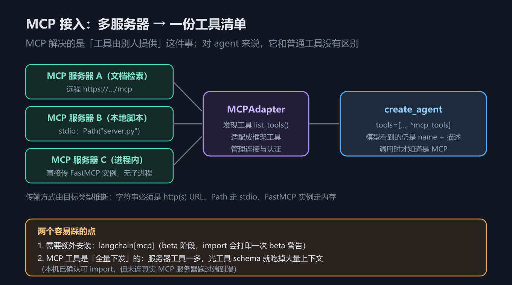

# 第 4 章 工具与运行时上下文：从 `@tool` 到 MCP 与 RAG

## 一、这一章要解决的问题

模型本身只会「说」。它输出一段结构化文本，声明「我想调用 `search_orders`，参数是 `{"query": "退款"}`」——**真正执行的是框架**。这句话听起来平淡，却是理解工具（Tool）的第一把钥匙：把模型当成一个只会说话、不会动手的组件，后面所有设计都顺了。


*图 7　工具调用往返与 ToolRuntime 注入*

本章要回答六个问题：① 模型看到的工具长什么样、schema 从哪来（2.2）；② 工具怎么读到图状态、单次运行配置、长期记忆（2.3）；③ 老代码里的注入写法怎么改（2.4）；④ 工具怎么反过来改图状态、返回值有几类（2.5）；⑤ 工具执行失败怎么办（2.6）；⑥ 工具由别人提供（MCP）、知识在外部（RAG）时怎么接（2.7 / 2.8）。前五个靠 `code/` 里的示例实测，后两个是规模化之后必然遇到的新问题。

## 二、机制与原理

### 2.1 一次工具调用的往返

模型侧拿到工具清单（`name` + `description` + 参数 schema），输出 `tool_calls`，每项形如 `{name, args, id}`；框架的 `tools` 节点按 `name` 找到工具、用 schema 校验参数、执行函数体，再把返回值包成 `ToolMessage` 并把 `tool_call_id` 填成第 1 步里的 `id`；这条 `ToolMessage` 追加进历史再次进入模型，模型据此决定「继续调工具」还是「给最终答案」。`id` ↔ `tool_call_id` 是整条链路的接缝——2.5 节的 `Command` 坑、2.6 节的错误处理坑，本质都是这条接缝没对上。

### 2.2 schema 三要素：名称、描述、参数

模型看不到你的函数体，它只看到三样东西。下表回答：**同一个功能，两种语言分别怎么写，schema 从哪来**。

| 要素 | Python | TypeScript |
|---|---|---|
| 名称 | 函数名（`@tool("web_search")` 可覆盖） | `name` 字段，**必填** |
| 描述 | 函数 docstring | `description` 字段 |
| 参数 schema | 类型注解自动推导（也可 `args_schema=` 传 Pydantic / JSON Schema） | `schema` 字段，**必填**（通常用 zod） |

**保留参数名**：`config` 与 `runtime` 是框架占用的参数名，**不能**拿来当工具的业务参数，否则运行时直接报错。要访问运行时信息就用 `runtime` 参数，别自己造同名参数。

### 2.3 `ToolRuntime`：工具里的「后门」

工具执行的那一刻，环境里有哪些信息可用？下表回答这个问题。

| 成员 | 含义 | Python | TypeScript |
|---|---|---|---|
| State | 短期记忆：本次会话的图状态（消息、计数器、自定义字段） | `runtime.state` | `runtime.state` |
| Context | 单次运行的不可变配置（user_id、tenant_id），**不进检查点** | `runtime.context` | `runtime.context` |
| Store | 长期记忆：跨会话持久化的键值存储 | `runtime.store` | `runtime.store` |
| Stream Writer | 执行过程中向外部实时推事件 | `runtime.stream_writer` | `runtime.writer` |
| Execution Info | 本次执行的元信息（文档口径：thread / run / 尝试次数） | `runtime.execution_info` | `runtime.executionInfo` |
| Tool Call ID | 本次调用的唯一标识，返回 `Command` 时要用 | `runtime.tool_call_id` | `runtime.toolCallId` |

两条实测补充（`langchain` 1.4.2 / JS 1.5.11）：**`runtime` 参数对模型完全隐藏**，模型只看到 `name` / `description` / 参数 schema；**JS 侧 `executionInfo` 的实际字段**是 `{checkpointId, checkpointNs, taskId, nodeAttempt, nodeFirstAttemptTime}`（本机未配 `thread_id`、无检查点），而文档口径为 `thread_id` / `run_id` / `node_attempt`（需 `deepagents>=0.5.0` 或 `langgraph>=1.1.5`）——字段名跨语言、跨版本都会变，别硬编码。

### 2.4 旧注入模式 → 新写法

v1 之前，往工具里注入东西靠一组「魔法类型」；下表回答**老代码里的注入写法现在该怎么改**（差异清单第 14 条：本机实测确认新写法统一走 `runtime: ToolRuntime` 参数，`langchain` 1.4.2）。

| 旧写法（v1 已不推荐） | v1 新写法 | 说明 |
|---|---|---|
| `InjectedState` 参数 | `runtime.state` | 一个 `runtime` 参数统一取代所有注入 |
| `InjectedStore` 参数 | `runtime.store` | 同上 |
| `get_runtime()` 调用 | `runtime: ToolRuntime` 形参 | 不再需要显式取 |
| `InjectedToolCallId` 参数 | `runtime.tool_call_id` | JS 侧为 `runtime.toolCallId` |

### 2.5 工具返回值的四类，与 `return_direct`

返回值会被框架怎么处理？会不会顺手改状态？下表回答这个问题。

| 返回类型 | 框架怎么处理 | 是否改图状态 |
|---|---|---|
| 字符串 | 直接转成 `ToolMessage` | 否 |
| 对象（dict 等） | 序列化后放进 `ToolMessage` | 否 |
| 多模态内容块列表（文本 + 图片等） | 转成 content 为多模态块的 `ToolMessage`；需模型支持该模态 | 否 |
| `Command` | **不会被自动转成 `ToolMessage`** | **是**，走 `update` 合并进状态 |

返回 `Command` 有一条硬规则：**必须自带一条 `tool_call_id` 匹配的 `ToolMessage`**，否则 `ToolNode` 找不到对应关系，直接抛 `ValueError`——因为历史里每条 `AIMessage` 的 tool call 都必须有对应的 `ToolMessage` 才算闭合。（例外：`Command` 的 `graph` 指向父图时，执行离开了当前图，这条要求解除。）**`return_direct`** 则用来短路循环：工具执行完直接把结果作为最终答案返回，不再回模型加工；批量调用时语义很关键——同一批并行工具里，**只有当每一个都 `return_direct=True`**，整批跑完才会直接结束，只要有一个没设，就仍带着全部 `ToolMessage` 回到模型。

### 2.6 错误处理：v1 换了写法

差异清单第 13 条：**v1 的 agent 中间件路线已不再推荐 `ToolException` / `handle_tool_error` 这套旧 API**。注意措辞——它们**没有从包里删掉**：`langchain.tools` 仍导出 `ToolException`，`StructuredTool` 仍有 `handle_tool_error` 字段，`langchain` 自己的 MCP 适配器（`langchain/mcp/tools.py`）就还在用它。变的是**错误处理的入口**，不是 API 的存在。现在有两条路：**① 自己写 `@wrap_tool_call` 中间件**，捕获异常后返回一条内容可读的 `ToolMessage`（`tool_call_id` 从 `request.tool_call["id"]` 取）；**② 用内置中间件**——Python 侧为 `ToolErrorMiddleware`（本机示例未实测其构造参数，按官方文档），JS 侧为 `toolErrorMiddleware`，本机实测签名 `{ onError, tools? }`，`onError(error, request)` 返回内容则转成错误 `ToolMessage`，**什么都不返回就原样抛出**；它**不重试**，要重试得再叠一个 `toolRetryMiddleware({ onFailure: "error" })`。

**不加任何中间件时的默认行为，两个语言不一样**（本机实测，这一点很容易踩）：

| 语言 | 工具抛异常时 | 后果 |
|---|---|---|
| Python | 异常**原样抛出**，整个 agent 调用失败 | 用户看到 500；调试时能直接拿到 traceback |
| JS | `ToolNode` **捕获**它，生成一条 error `ToolMessage`（内容形如 `Error: <消息>\n Please fix your mistakes.`）继续跑 | agent 不崩，但**真正的 bug 被掩盖成一次「模型自己会纠错」** |

实测证据：同一个 `divide(1, 0)` 工具，Python 侧抛 `ZeroDivisionError` 并终止；JS 侧产出 `ToolMessage`、流程继续走到最终答复。

所以在 Python 侧，`@wrap_tool_call` 的价值是**让 agent 不崩**；在 JS 侧，它的价值是**控制这条失败消息的措辞与分类**——让模型知道该换参数、还是该放弃。两边都建议：**调试期在 `@wrap_tool_call` 里加日志**，否则失败会被静默吞掉。

### 2.7 MCP：工具由别人提供

模型上下文协议（MCP, Model Context Protocol）把「工具供给」标准化了：工具不是自己写的，而是别人以服务形式提供的。



*图 8　MCP 接入与多服务器聚合*

Python 侧的接入点是 `MCPAdapter`（`langchain.mcp`，需额外安装 `langchain[mcp]>=1.4.0`，**beta**，import 时打印一次 `LangChainBetaWarning`）。**传输方式由目标类型推断**：字符串必须是 `http(s)` URL；`Path` 走 stdio（每个适配器起一个子进程）；进程内 `FastMCP` 实例走内存；`MCPConfig` 字典可把多台服务器塞进一个适配器。**工具在 `list_tools()` 时被发现**，适配成框架工具后直接 `tools=[*自己的工具, *mcp_tools]`——对 agent 来说，MCP 工具与普通工具没有区别。两个必须记住的点：① 需要额外装包；② **MCP 工具是全量下发的**，服务器工具一多，光工具 schema 就吃掉大量上下文——这正是第 5 章要处理的问题。

> ⚠️ **未实测**：本机已确认 `langchain[mcp]` 可安装、`langchain.mcp` 可 import，但**没有连接真实 MCP 服务器跑过端到端**。上述 API 形态以官方文档为准，实际行为未验证。

### 2.8 RAG：两种用法

检索增强生成（RAG, Retrieval-Augmented Generation）的本质是「把可能相关的资料，在提问时塞进上下文」——所以它其实是上下文工程的一个特例。一句话：**检索是一个工具，不是一个步骤**。离线阶段（切分 → 嵌入 → 入库）与 agent 完全解耦，可独立迭代；在线阶段有两种接法：

- **预检索**：调 agent 前先检索，把片段拼进系统提示或首条消息。实现简单、检索必然发生，代价是每次都查、片段可能与本次问题无关、固定占用上下文。
- **做成工具**（推荐）：把检索器包成一个 `@tool`，让模型自己决定查不查、查什么。检索于是变成一种「能力」而非「前置步骤」，代价是依赖模型判断（真实模型才有此行为，未实测）。


*图 9　RAG 检索链路*

## 三、代码：Python 与 TypeScript

完整可运行版本见 `code/python/04_tools.py` 与 `code/typescript/04_tools.ts`。

**① schema 从哪来**——Python 靠函数名 + docstring + 类型注解，JS 三样都要显式写：

```python
from langchain.tools import tool

@tool
def search_orders(query: str, limit: int = 5) -> str:
    """按关键词搜索订单。query 是关键词，limit 是返回条数上限。"""
    return f"找到 {limit} 条与「{query}」相关的订单"
# name 取自函数名；description 取自 docstring；参数 schema 取自类型注解
```

```typescript
import { tool } from "langchain";
import { z } from "zod";

const searchOrders = tool(
  async (args: { query: string; limit?: number }) => `找到 ${args.limit ?? 5} 条`,
  {
    name: "search_orders",            // ⚠️ 必填
    description: "按关键词搜索订单。",  // ⚠️ 必填
    schema: z.object({                // ⚠️ 必填
      query: z.string().describe("搜索关键词"),
      limit: z.number().optional().describe("条数上限"),
    }),
  },
);
```

**② `ToolRuntime` 注入**——Python 用类型注解声明，JS 用第二个位置参数（`MyState` / `Ctx` 的定义、以及 `create_agent(..., state_schema=MyState, context_schema=Ctx, store=InMemoryStore())` 的接线见示例文件）：

```python
from langchain.tools import ToolRuntime, tool

@tool
def inspect_runtime(runtime: ToolRuntime[Ctx, MyState]) -> str:
    """读取运行时上下文并回报（runtime 参数对模型隐藏）。"""
    history = len(runtime.state["messages"])                     # 短期记忆
    tenant = runtime.context.tenant_id                           # 单次运行配置
    runtime.store.put(("audit",), "last_call", {"t": tenant})    # 长期记忆
    hit = runtime.store.get(("audit",), "last_call")
    return f"历史 {history} 条 | tenant={tenant} | store 回读={hit.value}"
```

```typescript
import { createAgent, tool } from "langchain";
import { InMemoryStore } from "@langchain/langgraph"; // ⚠️ 不能从 "langchain" 导入
import { z } from "zod";

const inspectRuntime = tool(
  async (_args: unknown, runtime: any) => {   // runtime 是第二个位置参数
    const tenant = runtime.context.tenantId;
    await runtime.store.put(["audit"], "last_call", { t: tenant });
    return `历史 ${runtime.state.messages.length} 条 | tenant=${tenant}`;
  },
  { name: "inspect_runtime", description: "读取运行时上下文。", schema: z.object({}) },
);

const agent = createAgent({ model, tools: [inspectRuntime],
  contextSchema: z.object({ tenantId: z.string() }), store: new InMemoryStore() });
```

**③ 返回 `Command` 直接改状态**——注意那条自己补的 `ToolMessage`：

```python
from langchain.messages import ToolMessage
from langgraph.types import Command

@tool
def set_user_name(new_name: str, runtime: ToolRuntime[None, MyState]) -> Command:
    """把用户名字写进会话状态。"""
    return Command(update={
        "user_name": new_name,
        # ⚠️ 必须自带 tool_call_id 匹配的 ToolMessage，否则 ToolNode 抛 ValueError
        "messages": [ToolMessage(content=f"已改为 {new_name}",
                                 tool_call_id=runtime.tool_call_id)],
    })
```

```typescript
import { ToolMessage } from "langchain";
import { Command } from "@langchain/langgraph";

const setUserName = tool(
  async (args: { newName: string }, runtime: any) =>
    new Command({ update: {
      userName: args.newName,
      messages: [new ToolMessage({ content: `已改为 ${args.newName}`,
                                  tool_call_id: runtime.toolCallId })],  // camelCase
    }}),
  { name: "set_user_name", description: "把用户名字写进会话状态。",
    schema: z.object({ newName: z.string() }) },
);
```

**④ 错误处理用中间件，不用 `ToolException`**：

```python
from collections.abc import Callable
from langchain.agents.middleware import wrap_tool_call
from langchain.messages import ToolMessage
from langchain.tools.tool_node import ToolCallRequest

@wrap_tool_call
def handle_tool_errors(request: ToolCallRequest,
                       handler: Callable[[ToolCallRequest], ToolMessage]):
    """把工具异常翻译成模型能读懂的失败消息。"""
    try:
        return handler(request)
    except ZeroDivisionError as exc:
        return ToolMessage(content=f"工具执行失败：{exc}。请换个参数再试。",
                           tool_call_id=request.tool_call["id"])
```

```typescript
import { createMiddleware, ToolMessage } from "langchain";

const handleToolErrors = createMiddleware({
  name: "HandleToolErrors",
  wrapToolCall: async (request: any, handler: any) => {
    try {
      return await handler(request);
    } catch (exc: any) {
      return new ToolMessage({ content: `工具执行失败：${exc.message}。请换个参数再试。`,
                               tool_call_id: request.toolCall.id });  // camelCase
    }
  },
});
```

## 四、常见坑与边界条件

- **JS 侧 `InMemoryStore` 的导入源**（实测）：`langchain` 也导出了一个同名 `InMemoryStore`，但它**没有** `batch` / `put`；传给 `createAgent({store})` 后，`runtime.store.put` 报 `TypeError: this.store.batch is not a function`。改从 `@langchain/langgraph` 导入即恢复正常（已实测回读成功）。Python 侧从 `langgraph.store.memory` 导入。
- **不传 `store` 就没有 `runtime.store`**：JS 侧为 `undefined`，Python 侧为 `None`。工具里先判空，或构造 agent 时一定传入。
- **返回 `Command` 忘了 `ToolMessage`**：`ToolNode` 抛 `ValueError`，两种语言都一样。
- **工具异常的默认行为两语言不同**（实测）：**Python 直接抛出**、整个调用失败（好处是 bug 藏不住，坏处是用户看到 500）；**JS 被 `ToolNode` 吞成一条 error `ToolMessage`**、流程继续（好处是不崩，坏处是**真正的 bug 被掩盖成一次「模型自己会纠错」**）。两边都建议在 `@wrap_tool_call` 里加日志。
- **`runtime` 不是安全边界**：模型看不到 `runtime`，不等于用户影响不到它。`context` 由调用方传入，`state` 由消息驱动，敏感数据不要仅靠「模型看不见」来保护。
- **工具描述含糊 → 选错工具**：真实模型才暴露的行为（本教程用脚本模型，**未实测**），但机制上很直接——描述是模型唯一的判断依据；同理，工具 schema 每个都占上下文，MCP 是**全量下发**，接三台服务器可能一下多出几十个工具。
- **`return_direct` 只在整批都设置时才短路**；`Command` 的 `graph` 指向父图时才免除 `ToolMessage` 要求。

## 五、关键结论

1. **模型只输出 tool call，执行永远由框架完成**；`id` ↔ `tool_call_id` 是整条链路的接缝。
2. **schema 只有三样东西**：名称、描述、参数 schema。Python 从函数名 / docstring / 类型注解推导，JS 三样都必填。`config` 与 `runtime` 是保留参数名。
3. **`ToolRuntime` 是工具访问环境的唯一入口**：`.state`（短期）/ `.context`（单次运行）/ `.store`（长期）/ `.stream_writer`（JS 为 `.writer`）/ `.execution_info` / `.tool_call_id`（JS camelCase）；它对模型隐藏。
4. **旧注入模式已被取代**：`InjectedState` / `InjectedStore` / `get_runtime()` / `InjectedToolCallId` → 统一用 `runtime`（差异清单第 14 条，实测）。
5. **返回值四类**：字符串 / 对象 / 多模态 / `Command`；只有 `Command` 会改状态，且必须自带匹配 `tool_call_id` 的 `ToolMessage`。
6. **错误处理换写法**：v1 不再推荐 `ToolException` / `handle_tool_error`（**API 仍在包里**，只是 agent 路线换了入口），改用 `@wrap_tool_call` 或 `ToolErrorMiddleware`（JS 为 `toolErrorMiddleware`，实测签名 `{onError, tools?}`）。
7. **MCP 让工具供给标准化**：`MCPAdapter` 按目标类型推断传输方式，工具经 `list_tools()` 发现后与本地工具混用。**需额外安装 `langchain[mcp]`，beta；未连真实服务器实测。** RAG 有两种接法：预检索（简单但每次都查）与做成工具（推荐），离线建库与 agent 解耦。

## 本章要点回顾

- 模型只「说」，框架才「做」——`tool_calls` 与 `ToolMessage` 靠 `id` / `tool_call_id` 缝合；工具对模型可见的只有 **名称 + 描述 + 参数 schema**，`config` / `runtime` 是保留参数名。
- **`ToolRuntime` 一个参数管全部注入**：`state` / `context` / `store` / `stream_writer` / `execution_info` / `tool_call_id`（JS 侧 camelCase，`stream_writer` 在 JS 叫 `writer`）；迁移对照见 2.4 节。
- 返回值四类：字符串 / 对象 / 多模态 / `Command`；**返回 `Command` 必须自带匹配 `tool_call_id` 的 `ToolMessage`**，否则 `ValueError`；`return_direct` 只在**整批工具**都设置时才短路循环。
- 错误处理：v1 不再推荐 `ToolException` / `handle_tool_error`（**未删除**，只是换了入口），改用 `@wrap_tool_call` 或 `ToolErrorMiddleware`；**默认行为两语言相反**——Python 异常**原样抛出**、JS 才被 `ToolNode` 吞成 error `ToolMessage`（见 2.6 节对照表）。
- JS 侧 `InMemoryStore` 要从 `@langchain/langgraph` 导入，否则 `runtime.store.put` 报 `this.store.batch is not a function`（实测）。
- MCP：`MCPAdapter` + `langchain[mcp]`（beta，**未连真实服务器实测**）；RAG：预检索 vs 做成工具，推荐后者。
