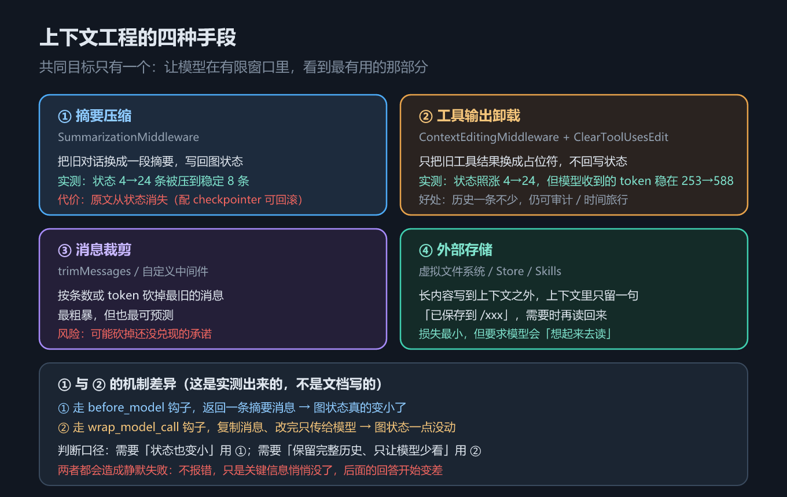
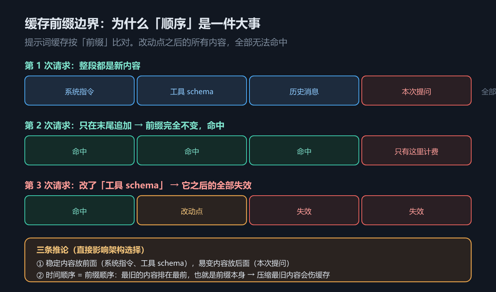

# 第 5 章 上下文工程：摘要、卸载、裁剪与缓存前缀

## 一、这一章要解决的问题

Agent 的上下文只增不减。`AgentState.messages` 的 reducer 是 `add_messages`，每轮都在后面追加：人类提问、AI 的工具请求、工具返回、AI 的回答……第 6 章会讲到，这个字段天生「只追加」。

于是第 4 章末尾那个问题就浮出来了：接了一台 MCP 服务器，光工具 schema 就吃掉一大块窗口；再跑几轮长任务，工具输出（日志、网页正文、检索片段）能把窗口塞满。上下文工程（context engineering）回答的就是：**在有限的窗口里，怎么让模型看到最有用的那部分**。

但这一章真正要讲的，是一个很容易搞错的问题——**「装了上下文中间件之后，图状态里的消息变少了吗？」** 答案是：**不一定**。



*图 10　上下文四种手段*

## 二、机制与原理

### 2.1 四种手段

它回答的问题是：**有哪些手段，各自的代价是什么**。

| # | 手段 | 代表实现 | 做法 | 主要代价 |
|---|---|---|---|---|
| ① | 摘要压缩 | `SummarizationMiddleware` | 把旧对话换成一段摘要，**写回图状态** | 当前状态里原文没了（**配了 checkpointer 仍可从更早的快照取回**） |
| ② | 工具输出卸载 | `ContextEditingMiddleware` + `ClearToolUsesEdit` | 把旧工具结果换成占位符，**不回写状态** | 状态里的历史仍在膨胀 |
| ③ | 消息裁剪 | `trimMessages` / 自定义中间件 | 按条数或 token 砍掉最旧的消息 | 可能砍掉还没兑现的承诺 |
| ④ | 外部存储 | 虚拟文件系统 / Store / Skills | 长内容写到上下文之外，只留一句「已保存到 /xxx」 | 要求模型「想得起来去读」 |

四种手段的共同目标只有一个：让模型在有限窗口里看到最有用的那部分。区别在于**信息损失发生在哪一层**——状态层、模型输入层，还是干脆挪出上下文。

### 2.2 核心差异：① 与 ② 走的是两个不同的钩子

这是本章最值得记住的一处，而且是**实测出来的**，不是文档写的（差异清单口径）。它回答的问题是：**为什么两个都叫「上下文中间件」，效果却完全不同**。

| | `SummarizationMiddleware`（①） | `ContextEditingMiddleware`（②） |
|---|---|---|
| 挂载钩子 | `before_model`（节点式） | `wrap_model_call`（包裹式） |
| 做法 | 返回一条摘要消息，**写回图状态** | 复制一份消息、改完**只传给模型** |
| 图状态 | 真的变小了 | 一点没动 |
| 模型收到的输入 | 变小 | 变小 |
| 历史可审计 / 可时间旅行 | 当前状态里没有；**配 checkpointer 时更早的快照仍保有原文** | 是（一条不少） |

第 3 章讲过两类中间件的区别：节点式钩子返回的值会**并入状态**，包裹式钩子只**改写这一次的请求**。上下文中间件正好是这两类各自最典型的代表。

### 2.3 用实测数字看差异

它回答的问题是：**这两个数字（状态消息数 / 模型收到的 token）到底怎么变**。示例 `code/python/05_context.py` 跑了 6 轮，每轮一次「拉日志（长工具输出）+ 回答」，同时打印两个数字：

| 轮次 | 基线：状态 / 模型 token | ① 摘要：状态 / 模型 token | ② 卸载：状态 / 模型 token |
|---|---|---|---|
| 1 | 4 / 253 | 4 / 253 | 4 / 253 |
| 2 | 8 / 511 | 8 / 511 | 8 / 511 |
| 3 | 12 / 770 | **8 / 528** | 12 / **530** |
| 4 | 16 / 1028 | 8 / 528 | 16 / **550** |
| 5 | 20 / 1287 | 8 / 528 | 20 / **569** |
| 6 | 24 / **1545** | 8 / **528** | 24 / **588** |

（token 数是示例自己算的近似值：每 4 个字符算 1 token，每条消息再加 3——刻意复刻框架内置计数器的默认口径，保证「触发用的尺子」和「打印出来的尺子」是同一把。）

逐列读：

- **基线**：状态从 4 条涨到 24 条，模型收到的 token 从 253 涨到 1545，一起线性上涨。
- **① 摘要**：第 3 轮触发（`trigger=("messages", 8)`），状态从 8 条被压到稳定 8 条，模型收到的 token 稳定在 528。**状态与模型输入一起变小。**
- **② 卸载**：状态照涨 4 → 24 一条不少，但模型收到的 token 稳定在 253 → 588（第 3 轮起几乎不再增长）。**两个数字分道扬镳**，这正是 2.2 节说的「不回写状态」。

一个细节：模型收到的消息数总比状态少 1 条（3 vs 4、7 vs 8）。因为状态里最后一条是 AI 的最终回答，它还没来得及被送回模型。

### 2.4 静默失败

两种手段**都不会报错**。压缩和清理本身是正常行为，只是关键信息悄悄没了，后面的回答开始变差——**不报错的失败最难查**。所以做上下文工程时，必须同时观测两个数字：状态里有多少、模型实际收到多少。本教程用假模型的 `seen` 字段做这件事（见 `code/README.md`），真实项目里对应的是 tracing（第 13 章）。

### 2.5 外部存储：损失最小的一种

把长内容写到上下文之外——虚拟文件系统（第 10 章）、Store（第 7 章）、Skills（第 12 章）——上下文里只留一句「已保存到 `/logs/svc-0.txt`」。这是四种手段里信息损失最小的：内容没丢，只是需要时再去读。代价也明确：**模型得想得起来去读**。

### 2.6 缓存前缀：为什么「顺序」是一件大事

前面四种手段都在「少放点东西」；提示词缓存（prompt caching）则是「少花点钱」。它回答的问题是：**同样的前缀反复发送，为什么有的计费有的不计费**。



*图 11　缓存前缀边界*

机制很朴素：**缓存按「前缀」比对**。请求从头开始逐段匹配，一旦某处变了，**从改动点往后的所有内容全部无法命中**。图 11 画了三次请求：第一次全部计费；第二次只在末尾追加（前缀完全没变）→ 全部命中，只有新增部分计费；第三次改了「工具 schema」→ 它之后的系统指令、历史消息全部失效。

由此有三条推论，直接影响架构选择：

1. **稳定内容放前面**（系统指令、工具 schema），**易变内容放后面**（本次提问）。
2. **时间顺序 = 前缀顺序**：最旧的内容排在最前，也就是前缀本身 → **压缩最旧内容会伤缓存**。
3. 因此「每轮都改工具清单」这类动态注册工具的做法（例如按需从 MCP 拉工具）虽然省上下文，却会**反复打断前缀**——省下的 token 与丢掉的缓存命中要一起算。

> ⚠️ **未实测**：缓存命中率与真实计费需要真实模型与 API Key，本机没有账号。以上是机制层面的推论，官方口径见 `_写作大纲与来源登记.md` 的 L3。

## 三、代码：Python 与 TypeScript

完整可运行版本见 `code/python/05_context.py` 与 `code/typescript/05_context.ts`。

**① 观测骨架**——关键是同时打印「状态消息数」和「模型实际收到的 token」：

```python
def run_case(title: str, middleware: list, rounds: int = 6) -> None:
    model = ScriptedChatModel(script=script)
    agent = create_agent(model=model, tools=[fetch_log], middleware=middleware)

    messages = []
    for i in range(rounds):
        out = agent.invoke({"messages": [*messages, HumanMessage(f"排查 svc-{i}")]})
        messages = out["messages"]          # 图状态里的消息
        last_seen = model.seen[-1]          # 模型实际收到的消息（假模型的观测口）
        print(f"状态 {len(messages)} 条 | 模型收到 {approx_tokens(last_seen)} token")
```

```typescript
async function runCase(title: string, middleware: any[], rounds = 6): Promise<void> {
  const model = new ScriptedChatModel({ script });
  const agent = createAgent({ model: model as any, tools: [fetchLog], middleware });

  let messages: BaseMessage[] = [];
  for (let i = 0; i < rounds; i += 1) {
    const out: any = await agent.invoke({
      messages: [...messages, new HumanMessage(`排查 svc-${i}`)],
    });
    messages = out.messages;                       // 图状态里的消息
    const lastSeen = model.seen[model.seen.length - 1]; // 模型实际收到的消息
    console.log(`状态 ${messages.length} 条 | 模型收到 ${approxTokens(lastSeen)} token`);
  }
}
```

**② 摘要压缩**——注意触发参数的双语言写法差异：

```python
SummarizationMiddleware(
    model=ScriptedChatModel(script=[reply("【摘要】前几轮排查了 svc-0 起的服务，均无新问题。")]),
    trigger=("messages", 8),   # 状态超过 8 条消息就触发（位置参数：元组）
    keep=("messages", 4),      # 最近 4 条保留原文
)
```

```typescript
summarizationMiddleware({
  model: new ScriptedChatModel({ script: [reply("【摘要】前几轮排查了 svc-0 起的服务，均无新问题。")] }),
  // ⚠️ JS 侧 trigger / keep 是**对象**：{ messages } / { tokens } / { fraction }
  trigger: { messages: 8 },
  keep: { messages: 4 },
});
```

**③ 工具输出卸载**——只清旧工具结果，保留最近几条：

```python
ContextEditingMiddleware(
    edits=[
        ClearToolUsesEdit(
            trigger=600,                      # 模型输入超过约 600 token 就动手
            keep=2,                           # 最近 2 条工具结果必须保留
            placeholder="[已清理：旧工具输出]",
        )
    ]
)
```

```typescript
contextEditingMiddleware({
  edits: [
    new ClearToolUsesEdit({
      trigger: { tokens: 600 },    // ⚠️ JS 用对象
      keep: { messages: 2 },
      placeholder: "[已清理：旧工具输出]",
    }),
  ],
});
```

## 四、常见坑与边界条件

- **触发参数语法不一致**（双语言差异第 7 条，实测）：Python 是位置参数 `trigger=("messages", 8)`、`keep=2`；JS 一律是对象 `trigger: { messages: 8 }`、`keep: { messages: 2 }`。抄代码时最容易在这里翻车。
- **摘要本身要花一次模型调用**：`SummarizationMiddleware` 需要一个 `model` 参数——示例里传的是假模型，真实场景这是**额外的 token 与延迟**，要计入成本。
- **「摘要后原文永久丢失」要加前提**：**不配 checkpointer** 时确实不可恢复；**配了 checkpointer** 就不一定——摘要发生在某个 super-step 内，**上一个检查点仍保有压缩前的完整消息**。本机实测（6 轮、`trigger=("messages", 8)`）：最终状态 8 条，而 `get_state_history` 的 **42 个快照**里仍能翻出第 1 轮的长工具输出原文。所以「当前状态可审计」要用手段 ② 而不是 ①；「历史可回溯」则取决于有没有 checkpointer。
- **卸载后状态继续膨胀**：适合「工具输出又大又只用一次」；如果之后要把完整状态重放给模型（例如换了个更大的模型），可能直接超窗。
- **两者都会静默失败**：不报错，只是答案质量下降。务必同时观测「状态」与「模型输入」两个数字。
- **压缩最旧内容会伤缓存**：时间顺序 = 前缀顺序，被压缩的正好是前缀部分。手段 ① 与缓存优化天然有张力。
- **裁剪是最粗暴也最可预测的一种**：按条数 / token 砍最旧的，风险是砍掉「我稍后会做 X」这类尚未兑现的承诺。
- **`keep` 要给足**：留太少会把当前的工具结果也清掉，模型立刻失去上下文。
- **未实测**：真实模型下的缓存命中率、真实 token 计费、真实摘要质量——都需要 API Key。

## 五、关键结论

1. **上下文只增不减是结构性的**：`messages` 用 `add_messages` reducer，天生只追加。
2. **四种手段**：摘要压缩、工具输出卸载、消息裁剪、外部存储；区别在于信息损失发生在哪一层。
3. **① 与 ② 机制不同**（实测）：`SummarizationMiddleware` 走 `before_model` 并**写回图状态**；`ContextEditingMiddleware` 走 `wrap_model_call`、**只改模型这次看到的请求、不回写状态**。
4. **实测数字**：基线状态 4 → 24 条、模型收到 token 253 → 1545；摘要后状态稳定 8 条 / 528 token；卸载后状态照涨 4 → 24 而模型收到 token 稳定在 253 → 588。
5. **判断口径**：需要「状态也变小」用 ①；需要「保留完整历史、只让模型少看」用 ②。
6. **两者都会造成静默失败**，必须同时观测状态与模型输入两个数字。
7. **缓存按前缀比对**，改动点之后全部失效 → 稳定内容放前面、时间顺序 = 前缀顺序、压缩最旧内容会伤缓存。

## 本章要点回顾

- 核心提问：**装了中间件，图状态变小了吗？** 答案是「不一定」。
- **摘要压缩走 `before_model` 并写回状态**；**工具输出卸载走 `wrap_model_call` 且不回写状态**——这是本章最重要的一条实测结论。
- 记住两个数字：状态 **4 → 24 条**（基线），模型 token **253 → 1545**；摘要后 **8 条 / 528 token**，卸载后 token 稳在 **253 → 588**。
- 触发参数：Python `trigger=("messages", 8)`（位置参数）/ JS `trigger: { messages: 8 }`（对象）。
- 两者都**静默失败**：不报错，只是信息悄悄没了。观测手段是同时看「状态」与「模型输入」。
- 消息裁剪（`trimMessages`）最粗暴也最可预测；外部存储（文件系统 / Store / Skills）损失最小，但要求模型主动读。
- 提示词缓存按**前缀**比对，改动点之后全部失效 → **时间顺序 = 前缀顺序**，所以压缩最旧内容会伤缓存。
- 缓存收益与真实 token 计费**未实测**（需 API Key）。
