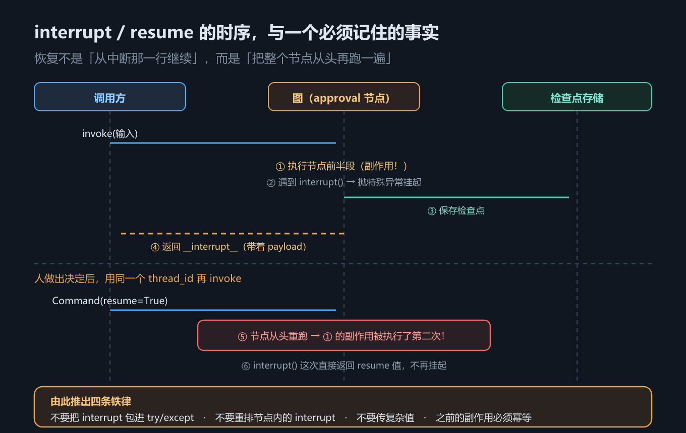
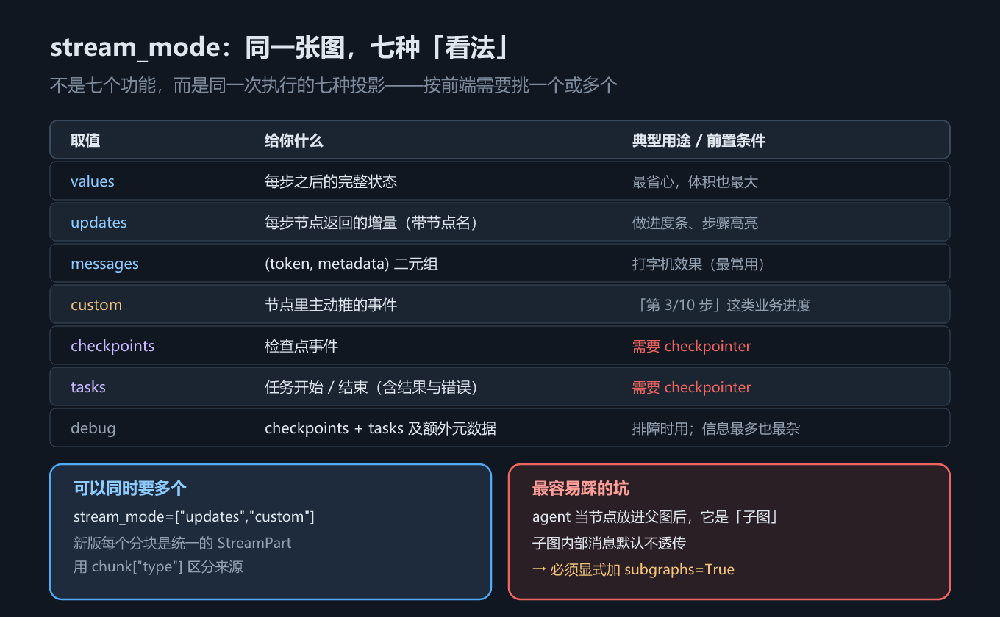

# 第 8 章 人在回路与流式：interrupt / resume / stream_mode

## 一、这一章要解决的问题

上一章解决了「状态存得下来」。这一章解决两个建立在它之上的问题：

1. **agent 要干一件不可逆的事**——扣款、发邮件、删数据。你不能让它自己决定，必须停下来等人点头，等完再接着跑。这叫**人在回路（human-in-the-loop, HITL）**。
2. **前端要看到过程**——不是等 30 秒后一次性蹦出一整段回答，而是逐字往外吐。这叫**流式（streaming）**。

两件事看着不相关，但**暂停与恢复**共用同一个底层事实：它们建立在检查点之上。所以本章的第一条硬性前置条件就是上一章的 checkpointer。（**流式本身不需要 checkpointer**——只有 `stream_mode` 里的 `checkpoints` / `tasks` 两档才要求，3.2 节那个父图流式示例就没配。）

> 版本锚点：本章结论在 `langgraph` **1.2.12**（Python）与 `@langchain/langgraph` **1.4.17**（JS）上实测；示例源码见 `code/python/08_hitl_stream.py` 与 `code/typescript/08_hitl_stream.ts`。

## 二、机制与原理

### 2.1 interrupt() 与 Command(resume=...)：一次完整的暂停与恢复

导入路径两边不同，先记住：

- Python：`from langgraph.types import Command, interrupt`
- TypeScript：`import { Command, interrupt } from "@langchain/langgraph"`

一次往返分两步：

1. **第一次 `invoke(input, cfg)`**。图正常跑，直到节点里调用 `interrupt(payload)`。此时图不是「返回值」，而是**抛出一个特殊的挂起异常**，LangGraph 捕获它、存下检查点、把控制权交回调用方。返回结果里多出一个 `__interrupt__` 键，里面装着 payload。
2. **第二次 `invoke(Command(resume=值), cfg)`**。用**同一个 `thread_id`** 再调一次，`interrupt()` 这次不再挂起，而是**直接返回 resume 值**，节点继续往下走。



*图 18　interrupt / resume 的时序，以及「恢复时整个节点从头重跑」这个必须记住的事实*

三个前置条件缺一不可，少任何一个都会得到「中断没生效」或「恢复找不到线程」：

| # | 前置条件 | 缺了会怎样 |
|---|---|---|
| 1 | 图必须带 checkpointer | 中断状态无处落盘，图根本停不住 |
| 2 | 调用必须带 `thread_id` | 恢复时定位不到这条线程 |
| 3 | payload 与 resume 值都必须**可序列化** | 写不进检查点，直接报错 |

> `Command(resume=...)` 是**唯一**可以当作 `invoke` / `stream` 输入的 `Command` 形态。像 `Command(goto=...)` 那种跳转形态只能在**节点内部**返回，不能从外面喂进去——这是新手最容易混的一处。

### 2.2 最核心的实测结论：恢复时整个节点从头重跑

这是本章唯一必须记死的一条，也是理解后面一切坑的钥匙：

> **恢复不是「从中断那一行继续」，而是把整个节点从头再执行一遍。**

本机实测的副作用日志说明了这一点：在 `interrupt()` 之前往列表里 append 一行「节点开始，读到 amount=199」，跑完一轮之后，**这行出现了两次**——第一次是原始执行，第二次是恢复时的重跑。

由此推出**四条铁律**：

| # | 铁律 | 为什么 |
|---|---|---|
| 1 | **不要把 `interrupt()` 包进 `try/except`** | 它靠抛异常来挂起；吞掉异常，暂停就失效了 |
| 2 | **不要重排节点内的 `interrupt()`** | 同一个节点里的多个中断按**调用顺序**依次对应 resume 值，顺序一变就配错 |
| 3 | **不要传复杂值** | payload 要能序列化进检查点，对象、函数、句柄都会失败 |
| 4 | **`interrupt()` 之前的副作用必须幂等** | 那段代码注定被执行两次 |

第 4 条的正确解法不是「让副作用幂等」，而是**把它挪出去**：把真正的副作用（扣款）拆成一个**独立的节点**，放在 `interrupt()` 之后。这样重跑的是审批节点，扣款节点只会执行一次——示例里的 `approval` 与 `charge` 就是这么分的。

### 2.3 静态中断：`interrupt_before` / `interrupt_after`

除了节点内的 `interrupt()`，编译时还能声明「在某个节点前/后停下来」：

- Python：`graph.compile(checkpointer=..., interrupt_before=["charge"])`
- TypeScript：`graph.compile({ checkpointer, interruptBefore: ["charge"] })`

它的问题是**只会在节点边界停**，停不到节点中间，也拿不到结构化的人工输入（恢复时是再 `invoke(None)` 续跑，人工决定得另外写进状态）。所以它适合**调试时观察中间状态**，**不推荐用来做审批流**——审批流请用节点内的 `interrupt()`。

### 2.4 stream_mode：同一张图，七种投影

这张表回答「我该用哪个 `stream_mode`」。注意它不是七个功能，而是**同一次执行的七种看法**。

| 取值 | 给你什么 | 典型用途 / 前置条件 |
|---|---|---|
| `values` | 每步之后的**完整状态** | 最省心，体积也最大 |
| `updates` | 每步节点返回的**增量**（带节点名） | 做进度条、步骤高亮 |
| `messages` | `(token, metadata)` 二元组 | 打字机效果（最常用） |
| `custom` | 节点里主动推的事件 | 「第 3/10 步」这类业务进度 |
| `checkpoints` | 检查点事件 | 需要 checkpointer |
| `tasks` | 任务开始 / 结束（含结果与错误） | 需要 checkpointer |
| `debug` | `checkpoints` + `tasks` 及额外元数据 | 排障；信息最多也最杂 |



*图 19　stream_mode 各档投影分别给你什么，以及 agent 当子图时最容易踩的坑*

**可以同时要多种**：传一个列表即可（Python `stream_mode=["updates","custom"]`，JS `streamMode: ["updates","custom"]`）。此时每个分块要自己分辨来源——Python 侧是 `(mode, payload)` 二元组，JS 侧是 `[mode, payload]` 数组；加了 `subgraphs=True` 之后，前面还会再多一层 namespace。

`custom` 档需要节点里主动推：Python 用 `get_stream_writer()`，JS 用 `getWriter()`。

### 2.5 坑：agent 当子图后，内部消息默认不透传

`create_agent` 返回的是**一张已编译的图**。把它直接当节点加进父图，它就变成了**子图**——而子图的内部输出默认不往上传。

实测三组对比：

| 组 | 怎么流 | 能看见什么 |
|---|---|---|
| A | 直接 `stream` 子 agent | 内部消息**一览无余**（模型调用、工具消息全在） |
| B | 父图 `stream`，**不加** `subgraphs` | 只剩跨边界的少数几条，模型内部的 token 全没了 |
| C | 父图 `stream`，**加** `subgraphs=True` | 内部消息恢复，且分块**带 namespace**，能区分来自哪个子图 |

这就是「图能跑、结果也对，但打字机效果莫名其妙没了」的根因。要透传，就显式加 `subgraphs=True`。

## 三、代码：Python 与 TypeScript

### 3.1 interrupt / resume 的完整往返

Python 侧的关键是看副作用日志：`interrupt()` 之前那行会被执行两次。

```python
from langgraph.checkpoint.memory import InMemorySaver
from langgraph.graph import END, START, StateGraph
from langgraph.types import Command, interrupt

SIDE_EFFECTS: list[str] = []

def approval(state: Order) -> Command:
    SIDE_EFFECTS.append(f"节点开始，读到 amount={state['amount']}")   # ⚠️ 恢复时会再跑一次
    decision = interrupt({"question": f"确认扣款 {state['amount']} 元？",
                          "amount": state["amount"]})
    return Command(goto="charge") if decision else Command(goto="cancelled")

def charge(state: Order) -> dict:
    SIDE_EFFECTS.append(f"调用扣款接口：{state['amount']} 元")        # 真正的副作用，放在 interrupt 之后
    return {"status": "已扣款"}

hitl = (StateGraph(Order)
        .add_node("approval", approval).add_node("charge", charge)
        .add_node("cancelled", lambda s: {"status": "已取消"})
        .add_edge(START, "approval").add_edge("charge", END).add_edge("cancelled", END)
        .compile(checkpointer=InMemorySaver()))          # 前置条件 ①
cfg = {"configurable": {"thread_id": "order-1"}}         # 前置条件 ②

r1 = hitl.invoke({"amount": 199, "status": "待审批"}, cfg)
print(r1["__interrupt__"][0].value)      # {'question': '确认扣款 199 元？', 'amount': 199}
print(hitl.get_state(cfg).next)          # ('approval',) —— 停在半路

r2 = hitl.invoke(Command(resume=True), cfg)   # 唯一能当输入用的 Command 形态
print(r2["status"])                      # 已扣款
print(SIDE_EFFECTS)                      # 「节点开始」出现了两次 → 整个节点从头重跑
```

TypeScript 侧有一处**必须显式声明**的差异：节点返回 `Command` 时，要在 `addNode` 的第三个参数里声明可能的去向。

```typescript
import { Annotation, Command, END, MemorySaver, START, StateGraph, interrupt } from "@langchain/langgraph";

const SIDE_EFFECTS: string[] = [];
const Order = Annotation.Root({
  amount: Annotation<number>({ default: () => 0 }),
  status: Annotation<string>({ default: () => "" }),
});

const approval = (state: any): Command => {
  SIDE_EFFECTS.push(`节点开始，读到 amount=${state.amount}`);      // ⚠️ 恢复时会再跑一次
  const decision = interrupt({ question: `确认扣款 ${state.amount} 元？`, amount: state.amount });
  return decision ? new Command({ goto: "charge" }) : new Command({ goto: "cancelled" });
};

const hitl = new StateGraph(Order)
  // ⚠️ JS 侧要求：返回 Command 的节点必须声明 ends，否则编译期报 UnreachableNodeError
  //    Python 侧靠类型注解 Command[Literal["charge","cancelled"]] 表达同一件事
  .addNode("approval", approval, { ends: ["charge", "cancelled"] })
  .addNode("charge", () => ({ status: "已扣款" }))
  .addNode("cancelled", () => ({ status: "已取消" }))
  .addEdge(START, "approval").addEdge("charge", END).addEdge("cancelled", END)
  .compile({ checkpointer: new MemorySaver() });
const cfg = { configurable: { thread_id: "order-1" } };

const r1: any = await hitl.invoke({ amount: 199, status: "待审批" }, cfg);
console.log(r1.__interrupt__?.[0]?.value);        // payload
console.log((await hitl.getState(cfg)).next);     // 停在半路

const r2: any = await hitl.invoke(new Command({ resume: true }), cfg);   // 同一 thread_id
console.log(r2.status, SIDE_EFFECTS);             // 日志里「节点开始」出现两次
```

> 差异清单第 8 条：**JS 侧返回 `Command` 的节点必须用 `ends` 声明去向**，Python 侧靠类型注解表达。忘了写就是编译期报错，不是运行期。

### 3.2 子图流式：A / B / C 三组对比

Python 侧把 agent 直接当节点挂进父图，然后三种流法各跑一次。

```python
sub_agent = create_agent(model=ScriptedChatModel(script=[...]), tools=[lookup])
parent = (StateGraph(dict)
          .add_node("agent", sub_agent)        # 已编译的图可以直接当节点
          .add_edge(START, "agent").add_edge("agent", END).compile())
inp = {"messages": [{"role": "user", "content": "查 x"}]}

a = list(sub_agent.stream(inp, stream_mode="messages"))                   # A 直接 stream 子 agent
b = list(parent.stream(inp, stream_mode="messages"))                      # B 父图，不加 subgraphs
c = list(parent.stream(inp, stream_mode="messages", subgraphs=True))      # C 父图，加 subgraphs

for ns, (msg, meta) in c:                    # C 的分块带 namespace，能区分来自哪个子图
    print(ns[0].split(":")[0] if ns else "()", meta.get("langgraph_node"))
```

TypeScript 侧有两处差异：要取 `agent.graph`（`createAgent` 返回的是包装对象，不是 `Runnable`），并且 `stream` 返回的是异步迭代器。

```typescript
const subAgent = createAgent({ model: new ScriptedChatModel({ script: [...] }) as any, tools: [lookup] });
const parent = new StateGraph(Parent)
  // ⚠️ JS 侧：createAgent 返回 ReactAgent 包装对象，要当节点用必须取 .graph
  .addNode("agent", (subAgent as any).graph)
  .addEdge(START, "agent").addEdge("agent", END).compile();
const inp = { messages: [new HumanMessage("查 x")] };

async function collect(stream: AsyncIterable<any>, tagged: boolean) {
  const lines: string[] = [];
  for await (const chunk of stream) {                     // 异步迭代器
    const [msg, meta] = tagged ? chunk[1] : chunk;        // 带 subgraphs 时多一层 namespace
    const ns = tagged ? String(chunk[0]?.[0] ?? "()").split(":")[0] : "()";
    lines.push(`${ns} node=${meta?.langgraph_node} [${msg.constructor.name}]`);
  }
  return lines;
}
const a = await collect(await subAgent.stream(inp, { streamMode: "messages" }), false);
const b = await collect(await parent.stream(inp, { streamMode: "messages" }), false);
const c = await collect(await parent.stream(inp, { streamMode: "messages", subgraphs: true }), true);
```

> ⚠️ **别把 A/B/C 的「分块个数」当结论**：示例用的是脚本化假模型，它一次吐一条完整消息，不是逐 token 吐，所以个数不可比（Python 侧实测 B 是 2 条，JS 侧是 1 条，会随版本变）。真正要看的是**哪几条消息能看见**：A 全见、B 只剩进出两条、C 恢复并标出来源。
> 完整可跑版本：`code/python/08_hitl_stream.py`、`code/typescript/08_hitl_stream.ts`。

## 四、常见坑与边界条件

1. **恢复时节点从头重跑**——所有坑的总根源。凡 `interrupt()` 之前的代码，都要假设它会跑两次。
2. **别用 `try/except` 包 `interrupt()`**。它靠抛异常挂起，吞掉异常等于取消暂停；确实要 catch，必须把异常原样重抛。
3. **同一个节点里多个 `interrupt()` 靠调用顺序对应 resume 值**，重排顺序会串位。
4. **payload 和 resume 值都要可序列化**，别塞对象、函数、数据库连接。
5. **恢复必须用同一个 `thread_id`**，并且要带上 checkpointer；换线程就是换了一张白纸，`interrupt()` 会当成第一次执行。
6. **`Command(resume=...)` 是唯一能当输入用的 `Command` 形态**；`Command(goto=...)` 只能在节点里返回。
7. **`subgraphs=True` 忘了加**，表现是「后端日志正常、前端打字机不动」。判断方法：看流出来的分块里有没有 `langgraph_node` 是子图内部节点。
8. **`stream_mode` 传列表后分块形状变了**。Python 变成 `(mode, payload)`、JS 变成 `[mode, payload]`，再加 `subgraphs=True` 则前面多一层 namespace——升级或改配置后要同步改解析代码。
9. **JS 类型定义里 `StreamMode` 还多一个 `"tools"`**（`@langchain/langgraph` 1.4.17 实测），示例未使用、本章不展开；Python 侧未见对应取值。

## 五、关键结论

1. **HITL 建立在检查点之上**：三个前置条件是 checkpointer、`thread_id`、可序列化 payload。**流式不在此列**——它不需要 checkpointer，只有 `checkpoints` / `tasks` 两档 `stream_mode` 才要求。
2. **`interrupt()` 靠抛异常挂起**，因此不能被 `try/except` 吞掉；`Command(resume=...)` 是唯一能当 `invoke` 输入的 `Command` 形态。
3. **恢复时整个节点从头重跑**（副作用日志实测出现两次）——由此推出四条铁律：不包 `try/except`、不重排、不传复杂值、之前的副作用必须幂等。**真正的副作用要拆成独立节点**放在 `interrupt()` 之后，而不是想办法让副作用幂等。
4. **静态中断只适合调试**：它只能在节点边界停，且恢复时拿不到结构化的人工输入。
5. **`stream_mode` 是同一执行的七种投影**，可组合成列表；`custom` 需要节点里主动推。
6. **`subgraphs=True` 是子图流式的开关**：不加，agent 内部消息默认不透传。

## 本章要点回顾

- **导入路径**：Python `from langgraph.types import Command, interrupt`；JS `import { Command, interrupt } from "@langchain/langgraph"`。
- **HITL 三个前置条件**：checkpointer、`thread_id`、可序列化 payload（**流式不需要 checkpointer**）。
- **一次往返**：第一次 `invoke` 返回 `__interrupt__`，第二次用 `Command(resume=值)` + 同一 `thread_id` 恢复。
- **核心事实**：恢复 = **整个节点从头重跑**（实测副作用日志出现两次）。
- **四条铁律**：不包 `try/except`、不重排 `interrupt()`、不传复杂值、之前的副作用必须幂等。
- **正确姿势**：把真副作用（扣款）拆成独立节点，放在 `interrupt()` 之后。
- **静态中断**（`interrupt_before` / `interrupt_after`，JS 是 `interruptBefore` / `interruptAfter`）只用于调试，不推荐做审批流。
- **`stream_mode` 七档**：`values` / `updates` / `messages` / `custom` / `checkpoints` / `tasks` / `debug`，可组合成列表。
- **子图坑**：agent 当节点后内部消息默认不透传，必须显式 `subgraphs=True`（Python 可直接 `add_node`，JS 要取 `.graph`）。**JS 特有**：返回 `Command` 的节点必须声明 `ends`，否则编译期报 `UnreachableNodeError`。
