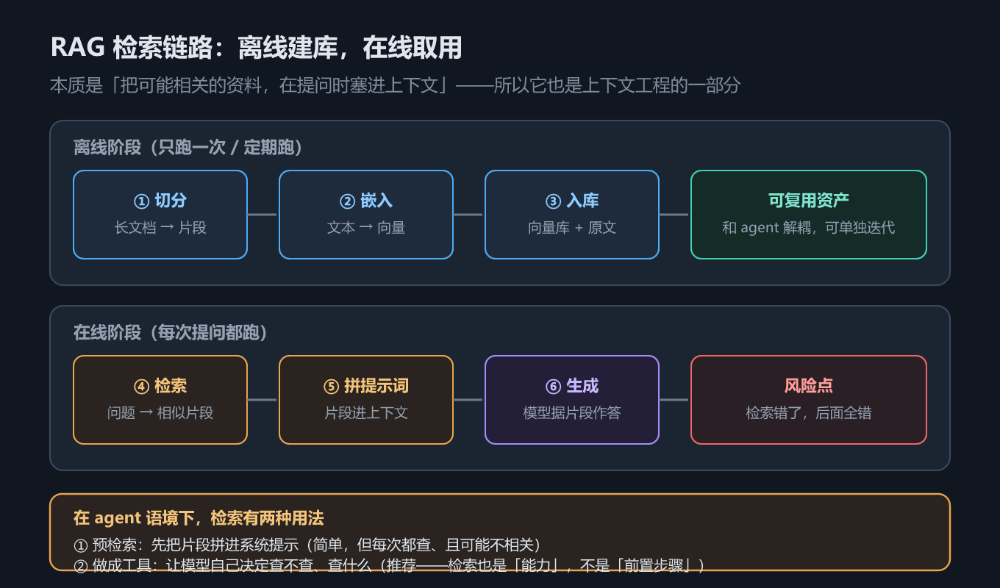
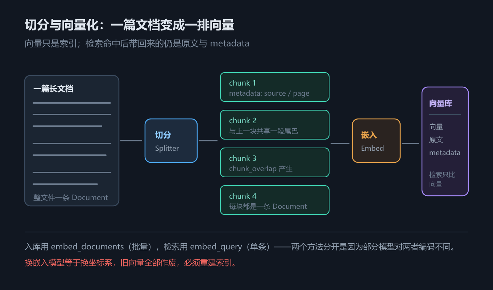

# 第 8 章 RAG 全链路：从文档加载到检索增强

## 一、这一章要解决的问题

前面七章把「模型 + 工具 + 循环」这套骨架搭完了。但骨架一跑真实业务，第一个失败立刻出现：**你问它公司内部的退换货政策，它一本正经地编了一个。**

这不是模型不听话，是它**不知道**——训练数据里没有你公司那份文档。三条路可选：

1. **重新训练 / 微调**——贵、慢，知识一改就要重来一次；
2. **把文档整篇塞进提示词**——文档一多就撞上下文窗口，而且每轮都要为它付费；
3. **检索增强生成（RAG）**——先检索出最相关的几段，再连同问题一起交给模型。

第 3 条是工程上最常用的：它把「模型不知道」转化成「给模型现查」。

本章讲 RAG 的**完整链路**——Load（加载）→ Split（切分）→ Embed（嵌入）→ Store（入库）→ Retrieve（检索），以及最后一跳：把检索器包成工具，交给第 5 章的 agent 调用。

本章**不涉及**：向量库的选型运维（Milvus / Chroma 只讲到「什么时候该换」）、重排序与混合检索（那是检索调优的下一层）、模型侧的上下文治理（见第 9 章 上下文工程）。



*图 14　RAG 检索链路*

## 二、机制与原理

### 2.1 链路五步，以及每一步的产物

RAG 常被讲成一堆组件，但拆开看只有五步，每步都只做一件事——**把上一步的产物换成下一种形态**：

| 步骤 | 输入 → 输出 | 谁在做 |
|---|---|---|
| Load | 文件 → `Document(page_content, metadata)` | Document Loader |
| Split | 长 `Document` → 多个短 `Document` | Text Splitter |
| Embed | 文本 → 向量（`list[float]`） | Embeddings |
| Store | 向量 + 原文 → 可检索的库 | Vector Store |
| Retrieve | 查询文本 → 最相关的几个 `Document` | Retriever |

这个表回答的问题是：**我该在哪一步排查问题**。检索不准，先看 Split（块切碎了）和 Retrieve（相似度算法）；答案编造，先看 Load（源文件里到底有没有这段）。

整条链路有一个关键的分界：**前四步（Load / Split / Embed / Store）是离线的**，文档一改才重跑一次；**只有 Retrieve 是在线的**，每次提问都要跑。这个「离线半程 + 在线半程」的切法，决定了后面的部署形态——离线半程可以放进批处理任务，在线半程才需要低延迟。

### 2.2 文档加载器：所有 Loader 只做一件事

`langchain-community` 里有一长串 Loader，名字按格式排开，很容易被当成一堆需要分别记的 API。但它们做的事完全相同：**读文件，产出 `Document` 列表**。

真正的差异只有两点：

1. **一个文件切成几条**——整文件一条？每行一条？每页一条？
2. **metadata 里留下什么**——页码、行号、来源路径？

下表回答的问题是：**换个格式，我该改哪两件事**。

| Loader | 一个文件 → 几条 | metadata 里多了什么 |
|---|---|---|
| `TextLoader` | 1 条（整文件） | 只有 `source` |
| `CSVLoader` | 每行 1 条 | `row`（行号，从 0 起） |
| `JSONLoader` | 由 `jq_schema` 决定 | `seq_num` + `metadata_func` 自定义字段 |
| `PyPDFLoader` | **每页 1 条** | `page`、`total_pages`、`page_label` |
| `DirectoryLoader` | 目录内每个文件套一遍上面的规则 | 同被套用的 Loader |

`metadata` 不是装饰——它是**回答时能标注出处**的依据。第 2.5 节的检索会把原文连同 metadata 一起带回来，前端「来源：faq.txt 第 2 行」就是这么来的。

`JSONLoader` 的 `jq_schema` 值得单独说一句：它用 jq 语法指定「从 JSON 里取哪一段」。取数组每个元素的某个字段就写 `.[].字段名`，再配 `content_key` 指定「哪个字段当正文」。**TS 版这里不同**——它收的是 JSON Pointer（RFC 6901）而不是 jq，见第 3 节。

### 2.3 文档切分器：为什么必须切，以及两种实现的差别

切分的必要性来自一个矛盾：**检索的粒度要小，回答的上下文要完整**。

块切得太大，一个块里混着好几个主题，检索命中后塞给模型的大部分是噪声；块切得太小，一句话被拦腰截断，模型拿到半句。所以 `chunk_size` 与 `chunk_overlap` 这两个参数要按语料调，没有通用值。

`TextSplitter` 有三个看起来并列的方法，实际是一条调用链：

- `split_text(text) -> list[str]`：最底层，切一个字符串；
- `create_documents(texts) -> list[Document]`：把每个字符串切完包成 `Document`；
- `split_documents(docs) -> list[Document]`：接收 `Document`，取出正文切完再包回 `Document`（metadata 保留）。

即 `split_documents` 内部调用 `create_documents`，后者内部对每段调用 `split_text`。日常用 `split_documents` 就够了——它保 metadata。

真正要理解的是两种实现的差别，它决定了「超长段落会怎样」：

- **`CharacterTextSplitter`**：只认你给的那一个分隔符。切完就交差——**即使某段超过 `chunk_size` 也不管**。它的提示只有一条 `logging` 级别的 WARNING，默认不显示。
- **`RecursiveCharacterTextSplitter`**：按分隔符列表**逐级回退**（默认 `["\n\n", "\n", " ", ""]`）。段落切不动就换句子，句子切不动就换词，最后按字符硬切。它保证「不超过 `chunk_size`」，代价是可能切在句子中间。

所以默认选后者。这也解释了一个常见困惑：**为什么明明设了 `chunk_size=30`，却切出了 38 字的块**——你用的是 `CharacterTextSplitter`。

`chunk_overlap` 的作用是让相邻块**共享一段尾巴**。没有它，答案正好落在边界上时，两个块各拿一半、都不完整；有了它，至少有一个块包含完整答案。



*图 15　文档切分与向量化*

### 2.4 嵌入模型：把文本换成能比距离的向量

嵌入（embedding）做的事只有一件：**把一段文本映射成一个定长向量**，使得语义相近的文本在向量空间里距离更近。检索之所以能「按意思找」而不是「按关键词找」，全靠这一步。

两个方法要分清：

- `embed_documents(list[str]) -> list[list[float]]`：批量嵌入，入库时用；
- `embed_query(str) -> list[float]`：单条嵌入，检索时用。

为什么分成两个方法而不是一个？因为**部分模型对文档和查询用不同的编码方式**（非对称嵌入），有的还会在查询前加特殊前缀。混用会让检索质量莫名下降，而且不报错。

维度是模型的属性，不是你能随便定的——`text-embedding-3-small` 是 1536 维，换个模型就变。**入库用的模型必须和检索用的模型是同一个**，否则向量空间对不上，检索结果等于随机。

### 2.5 向量存储：写入与检索

向量库（Vector Store）对外只有两组操作：

- **写入**：`add_documents(docs)`——它内部对每个 `Document` 调 `embed_documents`，把正文换成向量后，连同原文与 metadata 一起存下；
- **检索**：`similarity_search(query, k)`——把查询换成向量，在库里找最近的 k 条，返回**原始 `Document`**（不是向量）。

注意「返回原始 Document」这一点：向量只是索引，真正给模型看的还是原文。所以 metadata 一路都没丢。

`similarity_search_with_score` 会额外带回相似度分数。**分数不要跨库比较**——不同向量库、不同距离度量（余弦 / 内积 / 欧氏）下，同一个分数的含义不同。

本教程示例用的是 `InMemoryVectorStore`（Python）/ `MemoryVectorStore`（TS），进程退出即消失，只适合验证链路。**什么时候该换**：

| 场景 | 该用什么 |
|---|---|
| 验证链路、跑测试 | 内存向量库 |
| 单机、几万条以内 | Chroma / FAISS |
| 生产、要水平扩展 | Milvus / Qdrant / pgvector |

换库**不改业务代码**——它们实现同一套接口，换的只是构造函数那一行。

### 2.6 检索器接入 agent：检索是一个工具

RAG 的最后一跳，是让 agent 自己决定「什么时候去查」。

接法很简单：把检索器包成 `@tool`（见第 7 章 工具与运行时上下文）。对模型来说这就是一个普通工具——它看不到向量库、看不到 retriever，只看到工具的 name / description / schema。

```python
@tool
def search_docs(query: str) -> str:
    """在知识库中检索与问题相关的资料。"""
    docs = retriever.invoke(query)
    return "\n".join(d.page_content for d in docs)
```

这一步之后，检索从**一个固定步骤**变成了**一个可选动作**：模型觉得需要外部知识才调它，不需要就直接答。这正是 RAG 与「每次都先检索再回答」那种流水线做法的区别。

**但也别高估它**：检索器给什么，模型就只能看什么。检索不到相关内容时，模型要么说不知道，要么编——后者更常见。所以**RAG 的质量上限由检索质量决定**，不在模型侧。

## 三、代码：Python 与 TypeScript

两套示例一一对应：`code/python/08_rag.py` 与 `code/typescript/08_rag.ts`。样例语料由代码现场生成，不依赖任何外部素材；嵌入用假嵌入，全程离线、零 API Key。

> **注意**：假嵌入的向量没有语义，所以示例里检索到的内容**不代表相关**。它验证的是链路通不通，不是检索准不准。

### 3.1 加载：同一份语料，四种切法

```text
[TextLoader]  notes.txt  → 1 个 Document
    page_content = 'RAG 的第一条铁律：检索质量决定生成质量。 / 如果检索回来的片段本身不相关，再...'
    metadata     = {'source': 'notes.txt'}

[CSVLoader]   orders.csv  → 3 个 Document（每行一条）
    'order_id: A-1001 / product: 机械键盘 / status...'   metadata={'source': 'orders.csv', 'row': 0}

[JSONLoader]  faq.json  → 2 个 Document
    '检索增强生成，提问前先把相关资料塞进上下文。'   metadata={'source': 'faq.json', 'seq_num': 1, 'q': 'RAG 是什么'}

[PyPDFLoader] manual.pdf → 1 个 Document（每页一条）
    page_content = 'RAG means retrieval augmented generation.'
    metadata     = {..., 'total_pages': 1, 'page': 0, 'page_label': '1'}

[DirectoryLoader] glob='*.md' → 1 个 Document
    '# 部署说明 /  / 生产环境请把向量库换成 Milvus 或 Chroma。'
```

这几行输出就是 2.2 节那张表的依据：**一个文件切几条**（整文件 / 每行 / 每页 / 每条记录），以及 **metadata 里留下什么**（`row` / `page` / `seq_num`）。

`manual.pdf` 是本示例**手搓**出来的最小合法 PDF（单页一行文本）——为了让示例自包含，不下载、不依赖外部文件，同时又能走通 pypdf 的真实解析路径。

### 3.2 切分：两种实现的真实差别

同一段 93 字、含一个空行的文本，`chunk_size=30`：

```text
[CharacterTextSplitter] separator='\n\n'：
    [WARNING] Created a chunk of size 38, which is longer than the specified 30
    → 2 个 chunk
     38 字 | 检索增强生成的第一步，是把私有文档切成语义完整的片段。切得太碎会丢失上下文。
     53 字 | 切得太大会稀释关键词，所以 chunk_size 与 chunk_overlap 这两个参数要按语料来调。
    → 只认 '\n\n'：切完就交差，长度超过 chunk_size 也不管（38 > 30、53 > 30）。

[RecursiveCharacterTextSplitter] → 4 个 chunk
     30 字 | 检索增强生成的第一步，是把私有文档切成语义完整的片段。切得太
      8 字 | 碎会丢失上下文。
     26 字 | 切得太大会稀释关键词，所以 chunk_size 与
     26 字 | chunk_overlap 这两个参数要按语料来调。
    → 依次尝试 ['\n\n', '\n', ' ', '']，粗的切不动就换更细的。
```

两个细节值得记住：`CharacterTextSplitter` 超长时**只发一条 WARNING**，而那条 WARNING 走的是 `logging`、默认不显示——所以「明明设了 30 却切出 38」这个问题，很多人是查了很久才发现的。`RecursiveCharacterTextSplitter` 反过来，它保证不超 `chunk_size`，代价是可能切在句子中间（上面第 1 块就断在「切得太」）。

### 3.3 嵌入与检索

```text
embed_query('退换货') → 维度 16，前 4 位 [...]
similarity_search('退换货怎么处理', k=2) → 2 条
    [1] faq.txt | 退换货政策：签收后 7 天内可无理由退换。
    [2] faq.txt | 运费规则：单笔订单满 99 元免运费。
```

Python 示例用 `DeterministicFakeEmbedding` 保证同一段文本每次得到同一个向量（可复现），并另用 `FakeEmbeddings` 做了一次对照，证明它每次结果不同——**只够验证管道，不能当检索质量看**。

### 3.4 接进 agent

```text
工具名 = 'search_knowledge'
1. [HumanMessage] '为什么要做文档切分？'
2. [AIMessage] ''  tool_calls=[('search_knowledge', {'query': '切分'})]
3. [ToolMessage] '[1] (orders.csv) order_id: A-1001\nproduct: 机械键盘\nstatus: 已...'
4. [AIMessage] '根据知识库：切分是为了控制单次进上下文的长度，并提高检索命中率。'
```

模型先请求 `search_knowledge`，框架执行检索、把片段包成 `ToolMessage` 回灌，模型再据此作答——这就是 RAG 的在线半程。**注意本示例里模型是脚本化的**，所以「先检索再回答」是写死的；真实模型才会自己判断要不要检索、检索什么，那部分需 API Key，本教程未实测。

### 3.5 双语言差异

| 项 | Python | TypeScript |
|---|---|---|
| `JSONLoader` 的路径语法 | jq（`.[].字段`） | **JSON Pointer**（`/0/a`） |
| 内存向量库 | `InMemoryVectorStore` | `MemoryVectorStore`（来自 `@langchain/classic`） |
| 假嵌入 | `DeterministicFakeEmbedding` / `FakeEmbeddings` | `FakeEmbeddings`（`@langchain/core/utils/testing`） |
| CSV 加载 | 内置，无额外依赖 | 需另装 `d3-dsv` |
| Loader 包归属 | 全在 `langchain-community` | 分散在 `@langchain/classic` 与 `@langchain/community` |

第 1 行是最容易踩的：照抄 Python 的 jq 路径到 TS，会直接抛 `Invalid JSON pointer.`。

## 四、常见坑与边界条件

1. **`chunk_overlap` 必须小于 `chunk_size`。** 相等或更大时，切分器会陷入「切完退回去又切」的循环，多数实现直接报错。经验值是 `chunk_size` 的 10%–20%。

2. **空分隔符会让 `CharacterTextSplitter` 报错。** `separator=""` 不是「按字符切」的意思——要按字符切，用 `RecursiveCharacterTextSplitter`（它的回退列表最后一项就是空串），或显式设 `chunk_size` 让它在超长时硬切。

3. **假嵌入只验机制，不验语义。** 示例里检索排序看着「挺对」，那是巧合——假向量是哈希出来的，与语义无关。换成真实嵌入模型之前，任何关于「检索准不准」的结论都不成立。

4. **入库与检索必须用同一个嵌入模型。** 换模型等于换坐标系，旧向量全部作废，必须重建索引。这不是「最好这样」，是**必须**。

5. **`JSONLoader` 的两语言语法不同。** Python 是 jq，TS 是 JSON Pointer，写法不通用（见 3.5）。

6. **PDF 需要额外依赖。** Python 侧要装 `pypdf`；TS 侧的 `PDFLoader` 要装 `pdf-parse`。没装时不是「解析效果差」，是直接 import 失败。

7. **`langchain-community` 已进入 sunset。** 本机实测（0.4.2）import 时会打印 `DeprecationWarning`：该包不再积极维护，官方建议迁移到各独立集成包。本章只借它讲「文件 → Document」这件事，与 sunset 无关；但**新项目选型时要知道这一点**。

## 五、关键结论

1. **RAG 的五步是形态转换，不是五个组件。** 文件 → Document → 短 Document → 向量 → 可检索的库 → 相关片段。每步只做一件事，排查问题时按这个链条往前找。

2. **Loader 之间没有本质区别**，差异只有两点：一个文件切几条、metadata 留什么。metadata 是标注出处的唯一依据。

3. **默认用 `RecursiveCharacterTextSplitter`**。它保证不超 `chunk_size`；`CharacterTextSplitter` 会静默超长，提示只在默认不可见的日志里。

4. **检索器就是一个工具。** 包成 `@tool` 交给 agent 之后，检索从固定步骤变成可选动作——这是 RAG 与流水线式问答的本质区别。

5. **上限在检索侧，不在模型侧。** 检索不到，模型只能编。所以调 RAG 的第一顺位是切分粒度与检索策略，不是换更大的模型。

6. **离线半程与在线半程要分开部署。** Load / Split / Embed / Store 只在文档变更时跑；只有 Retrieve 在每次提问时跑。

## 本章要点回顾

- RAG 链路：**Load → Split → Embed → Store → Retrieve**，前四步离线、最后一步在线。
- Loader 的产物永远是 `Document(page_content, metadata)`；差异只在「切几条」与「metadata 留什么」。
- `split_documents` → `create_documents` → `split_text` 是一条调用链；日常用最外层那个。
- `CharacterTextSplitter` 只认一个分隔符且会超长；`RecursiveCharacterTextSplitter` 逐级回退且保证不超。默认选后者。
- `chunk_overlap` 让相邻块共享尾巴，避免答案被切在边界上；但它必须小于 `chunk_size`。
- 嵌入把文本换成向量；入库用 `embed_documents`、检索用 `embed_query`，两者不可混用。
- 向量库换实现不改业务代码；`InMemoryVectorStore` / `MemoryVectorStore` 只适合验证链路。
- 检索器包成 `@tool` 就是普通工具——agent 自己决定何时检索。
- **检索质量决定 RAG 上限**；模型再好也补不回检索不到的知识。
