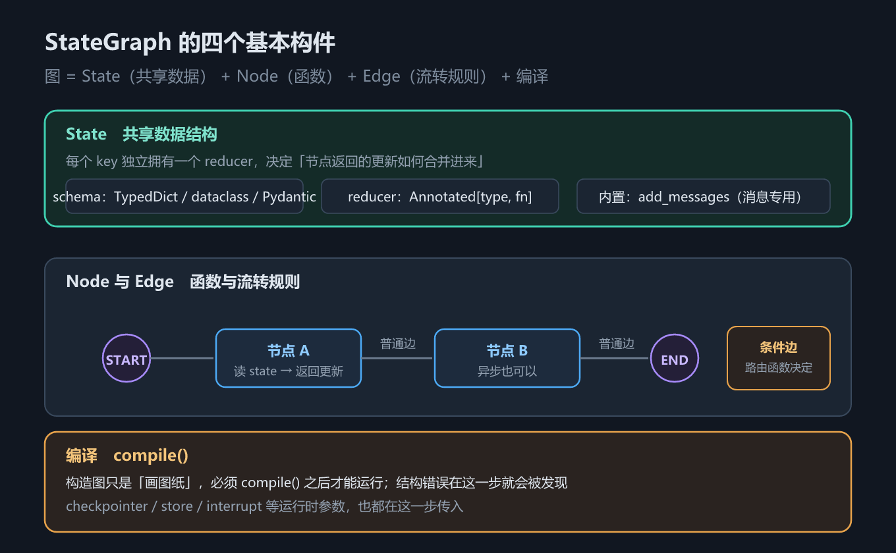
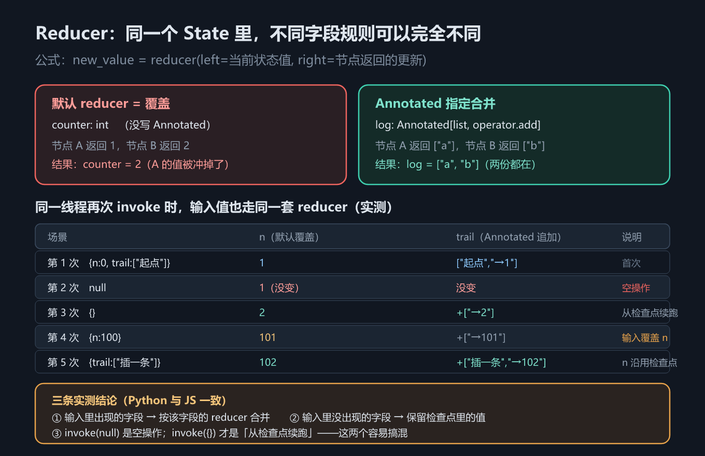

# 第 10 章 LangGraph 图与状态：Reducer、条件边与 Send

## 一、这一章要解决的问题

前五章都活在 `create_agent` 里。它很好用，但流程形状是固定的：模型 → 工具 → 模型 → …… 直到模型不再请求工具。第 6 章的中间件能往这个循环上挂钩子，却改不了循环本身的形状。

一旦需求不是这个形状——先分类再分流、把 100 个文件并行处理再汇总、加一道人工审批、跑一条多阶段流水线——就得自己画图。LangGraph 就是干这个的：**图 + 状态 + 持久化**。



*图 18　图的基本构件*

这一章要回答五个问题：

1. State 怎么定义（schema 有哪几种形态）；
2. 节点返回的更新**怎么合并进**当前状态（reducer）；
3. 流程怎么表达（节点 / 边 / 条件边 / 入口点）；
4. 并行怎么派发（`Send`）；
5. **同一线程再次 `invoke` 会发生什么**——这是本章最反直觉、也最容易踩的一处。

## 二、机制与原理

### 2.1 `StateGraph` 与 State schema

图 = **State（共享数据）+ Node（函数）+ Edge（流转规则）**，最后必须 `compile()` 才能运行。构造图只是「画图纸」；结构错误在编译这一步就会被发现，`checkpointer` / `store` 等运行时参数也在这一步传入。

State schema 就是「共享数据长什么样」。它回答的问题是：**用哪种方式描述状态字段**。

| 形态 | Python | TypeScript |
|---|---|---|
| 字典式 | `TypedDict`（最常用） | `Annotation.Root({...})` |
| 类式 | `dataclass` | 同上（JS 没有等价的 dataclass 写法） |
| 校验式 | Pydantic `BaseModel` | zod schema（`Annotation.Root` 内） |
| 默认值 | 字段可给默认值，也可在 `invoke` 时传入 | 每个字段用 `default: () => 值` 显式给 |

要点：**每个字段各管各的**。同一个 State 里，`counter` 可以是覆盖语义、`log` 是追加语义、`messages` 是消息专用语义，互不影响。

### 2.2 Reducer：默认是覆盖，`Annotated` 才合并

reducer 回答的问题是：**节点返回的更新，怎么和当前状态里的旧值合并**。

```text
new_value = reducer(left = 当前状态值, right = 节点返回的更新)
```



*图 19　Reducer 合并语义*

| 字段写法 | reducer | 两个节点分别返回 | 最终值 |
|---|---|---|---|
| `counter: int`（无 `Annotated`） | **覆盖** | A 返回 `1`，B 返回 `2` | `2`（A 的值被冲掉） |
| `log: Annotated[list, operator.add]` | 追加 | A 返回 `["a"]`，B 返回 `["b"]` | `["a", "b"]` |
| `messages: Annotated[list, add_messages]` | 消息专用 | A、B 各返回一条 AI 消息 | 起点 + a + b |

**默认 reducer 就是覆盖**——这是最容易忘的一条。想让两个节点的贡献都留下，必须显式写 `Annotated[type, reducer]`。JS 侧同理：`Annotation<T>({ reducer: (a, b) => ... })` 不写 `reducer` 就是覆盖。

### 2.3 `add_messages`

消息不是普通列表，它需要按 ID 去重更新：同一条消息（同一个 `id`）再次出现应该是**替换**，而不是重复追加。`add_messages` 就是内置的消息专用 reducer。JS 侧对应的是 `messagesStateReducer`（另有预置 schema `MessagesAnnotation`）——注意本章 JS 示例为了与 Python 对照，`messages` 用的是普通 `concat`，所以行为上只追加、不去重。

### 2.4 `Overwrite`：合并型 reducer 的逃生舱

如果一个字段有合并型 reducer（例如 `operator.add`），那「返回空列表」是**清不掉**它的：空列表会被拼上去，旧值还在。要强制覆盖，得包一层显式指令 `Overwrite([])`。

### 2.5 节点、边、条件边、入口点


*图 20　条件边与 `Send` 并行*

- **入口点**：`START`（Python）/ `START`（JS）——图的起点。
- **节点**：一个函数，读 state、返回更新字典；异步函数也可以。
- **普通边**：`add_edge("a", "b")`，从 a 无条件走到 b。
- **条件边**：`add_conditional_edges("classify", 路由函数, 映射表)`。路由函数返回一个**节点名**，图就走那条分支——**一次只走一条**，适合分类、分流、按条件重试。

### 2.6 `Send`：一条边派发 N 个并行分支

条件边是「选一条路」，`Send` 是「**同时走多条路**」。路由函数不再返回节点名，而是返回一个 `Send` 列表：`[Send("worker", {"item": it}) for it in state["items"]]`。LangGraph 会为每一项起一个并行任务，它们在**同一个 super-step** 里执行，结果靠目标字段的 reducer 汇总——这就是 map-reduce。

注意：`Send` 携带的 payload 是**给目标节点的输入**，不是完整状态。所以 worker 节点读的是 `state["item"]`（单数、当前那一项），而不是 `state["items"]`。

### 2.7 `Command` 与子图

- **`Command`**：在节点里返回它，可以**同时**做两件事——`update` 更新状态、`goto` 跳转到指定节点。它是「动态路由 + 状态更新」的合一。第 12 章会讲它的另一种形态 `Command(resume=...)`。
  - 双语言差异第 8 条：**JS 侧返回 `Command` 的节点必须显式声明去向** `addNode(name, fn, { ends: [...] })`，否则编译时报 `UnreachableNodeError`；Python 靠类型注解 `Command[Literal[...]]`。
- **子图**：编译好的图可以直接当节点用。Python 直接 `add_node("x", agent)`；JS 要取 `agent.graph`——`ReactAgent` 包装对象本身不是 Runnable（差异第 9 条）。

### 2.8 同一线程再次 `invoke` 的语义

这一条官方文档只讲 reducer 本身，没讲「同一线程再次 `invoke` 时输入如何进入状态」。本机实测（差异清单第 9 条，`langgraph` 1.2.12 / JS 1.4.17，两侧一致）给出如下结果——图只有一个节点 `bump`：`n = n + 1`，`trail` 追加 `f"→{n}"`；`n` 无 reducer（覆盖），`trail` 有 `operator.add`（追加）。

| 调用 | 传入 | 结果 `n` | 结果 `trail` | 为什么 |
|---|---|---|---|---|
| 第 1 次 | `{"n": 0, "trail": ["起点"]}` | `1` | `["起点", "→1"]` | 首次执行 |
| 第 2 次 | `None` | `1` | 不变 | **空操作**：已跑完的线程没有待执行任务，直接返回当前状态 |
| 第 3 次 | `{}` | `2` | `+["→2"]` | **从检查点续跑**：节点读到检查点里的 `n=1`，+1 得 2 |
| 第 4 次 | `{"n": 100}` | `101` | `+["→101"]` | 输入里的 `n` 按默认 reducer（覆盖）冲掉检查点里的 2 |
| 第 5 次 | `{"trail": ["插一条"]}` | `102` | `+["插一条", "→102"]` | 输入里没有 `n` → 沿用检查点的 101；`trail` 按 `operator.add` **追加** |

三条结论：

1. 输入字典里**出现**的字段 → 按**该字段自己的 reducer** 合并进检查点状态；
2. 输入字典里**没出现**的字段 → **保留检查点里的值**；
3. `invoke(None, cfg)` 是**空操作**；`invoke({}, cfg)` 才是「从检查点续跑」——这两个极容易搞混。

第 1、2 条是最阴的坑：以为「同一线程会累积」，结果标量字段被输入悄悄重置了。

## 三、代码：Python 与 TypeScript

完整可运行版本见 `code/python/10_state_graph.py` 与 `code/typescript/10_state_graph.ts`。

**① State schema 与 reducer**——一个字段覆盖、一个字段合并：

```python
import operator
from typing import Annotated, TypedDict
from langgraph.graph import END, START, StateGraph, add_messages

class State(TypedDict):
    counter: int                                   # 无 Annotated → 覆盖
    log: Annotated[list[str], operator.add]        # 追加
    messages: Annotated[list, add_messages]        # 消息专用：追加 + 按 ID 去重

def node_a(state: State) -> dict:
    return {"counter": 1, "log": ["a 跑过"], "messages": [AIMessage(content="a")]}

g = (StateGraph(State).add_node("a", node_a).add_node("b", node_b)
     .add_edge(START, "a").add_edge("a", "b").add_edge("b", END).compile())
# counter = 2（最后写的赢）；log = ["a 跑过", "b 跑过"]（合并）
```

```typescript
import { Annotation, END, START, StateGraph } from "@langchain/langgraph";

const State = Annotation.Root({
  counter: Annotation<number>({ default: () => 0 }),   // 无 reducer → 覆盖
  log: Annotation<string[]>({ reducer: (a, b) => a.concat(b), default: () => [] }),
  messages: Annotation<unknown[]>({ reducer: (a, b) => a.concat(b), default: () => [] }),
});

const g = new StateGraph(State)
  .addNode("a", () => ({ counter: 1, log: ["a 跑过"], messages: ["a"] }))
  .addNode("b", () => ({ counter: 2, log: ["b 跑过"], messages: ["b"] }))
  .addEdge(START, "a").addEdge("a", "b").addEdge("b", END)
  .compile();
```

**② 同一线程再次 `invoke`**——5 次调用，两种字段两种命运：

```python
g2 = (StateGraph(Acc).add_node("bump", bump)
      .add_edge(START, "bump").add_edge("bump", END)
      .compile(checkpointer=InMemorySaver()))
cfg = {"configurable": {"thread_id": "t-1"}}

for label, inp in [("第 1 次", {"n": 0, "trail": ["起点"]}),
                   ("第 2 次", None),          # ⚠️ 空操作
                   ("第 3 次", {}),            # ⚠️ 续跑
                   ("第 4 次", {"n": 100}),    # ⚠️ 覆盖 n
                   ("第 5 次", {"trail": ["插一条"]})]:
    r = g2.invoke(inp, cfg)   # n=1 → 1 → 2 → 101 → 102
```

```typescript
const g2 = new StateGraph(Acc)
  .addNode("bump", (state: any) => {
    const n = state.n + 1;
    return { n, trail: [`→${n}`] };
  })
  .addEdge(START, "bump").addEdge("bump", END)
  .compile({ checkpointer: new MemorySaver() });   // Python 侧叫 InMemorySaver
const cfg = { configurable: { thread_id: "t-1" } };

for (const [label, inp] of rows) {
  const r: any = await g2.invoke(inp, cfg);        // null 是空操作、{} 才是续跑
  console.log(`n=${r.n} trail=${JSON.stringify(r.trail)}`);
}
```

**③ `Send`：map-reduce 并行**：

```python
class FanState(TypedDict):
    items: list[str]
    results: Annotated[list[str], operator.add]

def split(state: FanState) -> list[Send]:
    """返回 Send 列表而不是节点名——每一项起一个并行任务。"""
    return [Send("worker", {"item": it}) for it in state["items"]]

def worker(state: dict) -> dict:
    return {"results": [f"{state['item']} 处理完毕"]}

fan = (StateGraph(FanState).add_node("worker", worker)
       .add_conditional_edges(START, split, ["worker"])
       .add_edge("worker", END).compile())
```

```typescript
const fan = new StateGraph(FanState)
  .addNode("worker", (s: any) => ({ results: [`${s.item} 处理完毕`] }))
  .addConditionalEdges(
    START,
    (s: any) => s.items.map((it: string) => new Send("worker", { item: it })),
    ["worker"],
  )
  .addEdge("worker", END)
  .compile();
```

**④ `Overwrite`：清空合并型字段**：

```python
def reset_log(state: State) -> dict:
    # 直接返回 [] 没用：operator.add 会把 [] 拼上去，旧值还在
    return {"log": Overwrite([])}
```

```typescript
new StateGraph(State)
  .addNode("reset", () => ({ log: new Overwrite([]) as any }))
  .addEdge(START, "reset").addEdge("reset", END)
  .compile();
```

## 四、常见坑与边界条件

- **默认 reducer 是覆盖，不是合并**：**顺序执行**的两个节点都写同一个标量字段时，留下的是**最后执行的那个**。但**同一 super-step 的并行分支写同一个无 reducer 字段会直接报错**——实测抛 `InvalidUpdateError: At key 'x': Can receive only one value per step.`。不是「不确定地覆盖」，而是**编译能过、跑起来抛异常**。凡可能被并发写入的字段，必须给 reducer。
- **`invoke(None)` 与 `invoke({})` 完全不同**：前者是空操作（什么都不做，直接返回当前状态），后者才是「从检查点续跑」。实测第 2、3 次调用就是这两个。
- **输入字典里的字段会被自己的 reducer 处理**：标量字段传了值就覆盖检查点里的值（实测第 4 次 `n=100` → `101`）。想「续跑但不动状态」就传 `{}`。
- **`Overwrite` 只对合并型字段有意义**：无 reducer 的字段本来就是覆盖，包不包都一样。
- **`Send` 的 payload 是目标节点的输入**：worker 里读的是 `state["item"]`（当次那一项），不是完整的 `state["items"]`。
- **`Send` 的汇总靠 reducer**：`results` 必须是 `Annotated[list, operator.add]` 这类合并型字段，否则并行分支互相覆盖。
- **JS 返回 `Command` 的节点必须声明 `ends`**（差异第 8 条），否则编译报 `UnreachableNodeError`。
- **JS 把 agent 当节点要取 `agent.graph`**（差异第 9 条）；Python 可以直接 `add_node("x", agent)`。
- **没有 checkpointer 就没有跨 `invoke` 的记忆**：2.8 节的所有结论都建立在 `compile(checkpointer=...)` 之上。Python 用 `InMemorySaver`，JS 用 `MemorySaver`（差异第 2 条）。
- **JS 示例的 `messages` 用的是普通 `concat`**：与 Python 的 `add_messages` 不完全等价（少了按 ID 去重更新）。要消息语义就用 `messagesStateReducer` 或 `MessagesAnnotation`。
- **节点名是内部实现细节**：跨语言、跨版本都会变（差异第 12 条），别硬编码。

## 五、关键结论

1. **图 = State + Node + Edge**，必须 `compile()` 才能运行；`checkpointer` / `store` 在编译时传入。
2. **State schema 三形态**：TypedDict / dataclass / Pydantic（JS 统一用 `Annotation.Root`，每个字段用 `default: () => ...`）。
3. **默认 reducer = 覆盖**（**顺序**执行时后者覆盖前者；**并行**写同一无 reducer 字段会抛 `InvalidUpdateError`）；`Annotated[type, reducer]` 才是合并。消息用 `add_messages`（JS：`messagesStateReducer`）。
4. **`Overwrite` 是合并型 reducer 的逃生舱**：返回空列表**不会**清空字段，要包 `Overwrite([])`。
5. **条件边选一条路，`Send` 走多条路**：`Send` 是 map-reduce，靠目标字段的 reducer 汇总。
6. **`Command` = 状态更新 + 动态跳转**；子图可以直接当节点（JS 取 `.graph`）。
7. **同一线程再次 `invoke`（实测）**：输入里出现的字段按各自 reducer 合并、没出现的保留检查点值；`invoke(None)` 是空操作、`invoke({})` 才是续跑。

## 本章要点回顾

- **图 = State（数据）+ Node（函数）+ Edge（流转）**，`compile()` 之后才可运行。
- **默认 reducer 是覆盖**——`counter` 两个节点都写，最后只剩 `2`；要合并必须写 `Annotated[type, reducer]`。
- `add_messages` 是消息专用 reducer（追加 + 按 ID 去重）；JS 侧为 `messagesStateReducer`。
- **`Overwrite([])` 才能清空合并型字段**，直接返回 `[]` 没用。
- 条件边 = 路由函数返回节点名，一次走一条；`Send` = 返回 `Send` 列表，同一 super-step 并行，靠 reducer 汇总（map-reduce）。
- `Command` 可同时更新状态与跳转；JS 侧要在 `addNode` 里声明 `ends`。
- **同一线程再次 invoke 的三条实测结论**：出现的字段按自己的 reducer 合并 / 没出现的沿用检查点 / **`None` 是空操作而 `{}` 才是续跑**。
- 记住那串数字：`n` 走 **1 → 1 → 2 → 101 → 102**，`trail` 一路追加到 `["起点","→1","→2","→101","插一条","→102"]`。
