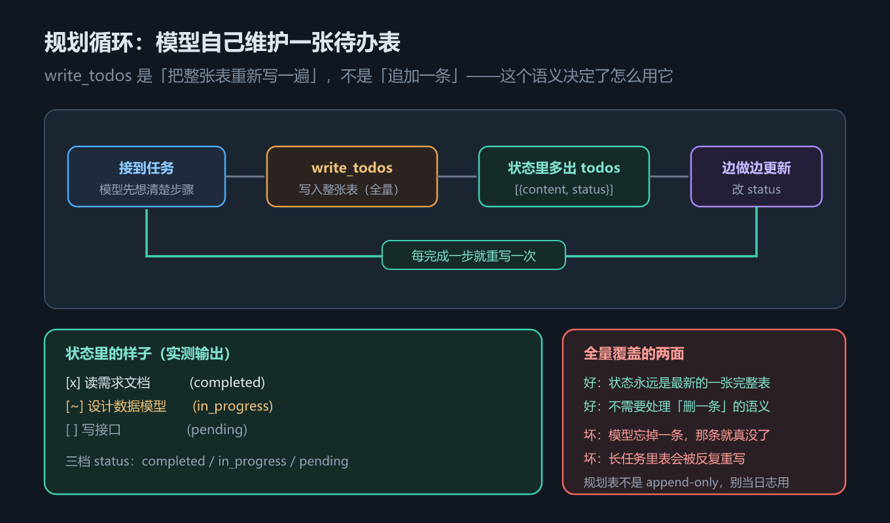
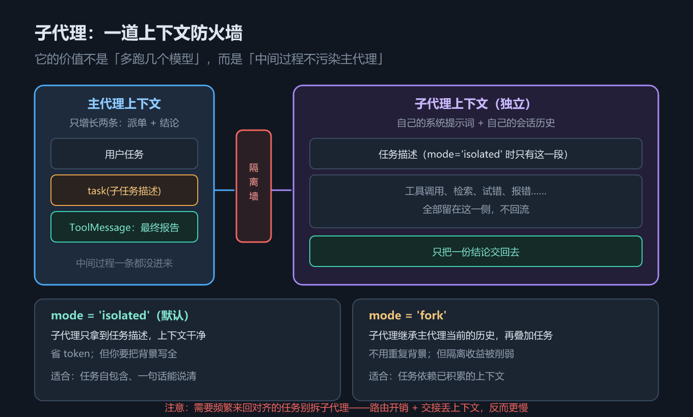

# 第 11 章 规划与委派：write_todos 与子代理

## 一、这一章要解决的问题

一个任务只要够长，就会同时遇到两个麻烦：

1. **跑偏**——模型做到第七步忘了第一步的目标，或者干脆漏掉一步；
2. **上下文膨胀**——所有中间过程都堆在主对话里，越到后面越贵、越糊涂。

Deep Agents 给这两个麻烦各准备了一件工具：**规划**（`write_todos`）和**委派**（子代理 + `task` 工具）。本章回答四个问题：

1. `write_todos` 的**语义**到底是什么？为什么它不是「往列表里加一条」？
2. 规划能力为什么默认不开，开了之后状态里多了什么？
3. 一个 `SubAgent` 能配哪些字段？主代理凭什么决定要不要派活？
4. 子代理的两种 `mode` 差在哪？为什么说它的价值是**上下文隔离**而不是并行？

> 版本锚点：本章结论在 `deepagents` **0.7.18**（Python）/ **1.14.0**（JS）、`langchain` **1.4.2** 上实测；示例源码见 `code/python/11_delegation.py` 与 `code/typescript/11_delegation.ts`。

## 二、机制与原理

### 2.1 write_todos 的语义：全量覆盖，不是追加

先看规划表长什么样。这张表回答「`todos` 这个字段里装的是什么」——实测它是一份**结构化待办列表**，每条含 `content` 与 `status`：

| 键 | 取值 | 含义 |
|---|---|---|
| `content` | 自由文本 | 这一条要做什么 |
| `status` | `pending` / `in_progress` / `completed` | 当前状态 |

一次调用写进去的实测值：

```text
state['todos'] = [
  {'content': '读需求文档',   'status': 'completed'},
  {'content': '设计数据模型', 'status': 'in_progress'},
  {'content': '写接口',       'status': 'pending'},
]
```

**关键在语义，不在结构**：`write_todos` 是**全量覆盖**——模型每次都要把**整张表重新写一遍**，而不是「追加一条」。

这带来一个必须记住的推论：**规划列表不是 append-only**。状态里的 `todos` 永远是最新的一张完整表，所以**模型忘掉一条，那条就真的没了**。这也解释了为什么规划提示词里会反复强调「每轮更新完整列表」——不是啰嗦，是这个工具的数据模型决定的。



*图 22　规划循环：模型每轮重写整张待办表，状态里的 todos 始终是最新快照*

### 2.2 规划要显式开启

`write_todos` **默认不在**绑定给模型的工具里（第 9 章「注册 9 个、模型可见 8 个」都不含它）。要开规划，必须显式加中间件：

- Python：`from langchain.agents.middleware import TodoListMiddleware`，然后 `create_deep_agent(model=..., middleware=[TodoListMiddleware()])`
- TypeScript：`import { todoListMiddleware } from "langchain"`，然后 `middleware: [todoListMiddleware()]`

加与不加的差别，实测有两条：

| | 不加 `TodoListMiddleware` | 加了之后 |
|---|---|---|
| 模型被绑定的工具 | 8 个（无 `write_todos`） | 9 个（多出 `write_todos`） |
| 状态里的键 | 无 `todos` | **多出 `todos`** |

所以「agent 到底有没有规划能力」，有两个可验证的观测点：**模型侧的工具名**，以及**状态里的 `todos` 键**。后者比前者更直接。

### 2.3 SubAgent 的全部 11 个字段

这张表回答「定义一个子代理能配什么」。官方文档只列了 `name` / `description` / `system_prompt` / `tools`（可选 `model` / `middleware`），**本机实测一共 11 个字段**（差异清单第 12 条）。

| 字段（Python） | TypeScript | 作用 |
|---|---|---|
| `name` | `name` | 子代理标识，`task` 的 `subagent_type` 用它指名 |
| `description` | `description` | **主代理判断该不该派活的唯一依据**（见 2.4） |
| `system_prompt` | `systemPrompt` | 子代理自己的系统提示 |
| `tools` | `tools` | 子代理可用的工具 |
| `model` | `model` | 子代理自己的模型（可用更便宜的） |
| `middleware` | `middleware` | 子代理专属中间件 |
| `interrupt_on` | `interruptOn` | 子代理内哪些工具调用前要人工审批 |
| `skills` | `skills` | 子代理可加载的技能 |
| `permissions` | `permissions` | 子代理的文件权限（第 10 章） |
| `response_format` | `responseFormat` | 子代理的结构化输出 |
| `mode` | `mode` | `isolated`（默认）或 `fork`（见 2.5） |

**字段多的意义**：子代理不是「一个只有提示词的小模型」，它可以是**一个独立配置的 agent**——有自己的工具白名单、自己的权限边界、自己的模型、自己的中断点。**权限和中断这两个字段尤其值得用**：把子代理能碰的文件收窄，比事后审计便宜得多。

### 2.4 description 是唯一依据，task 返回的是报告

主代理不会「读」子代理的 `system_prompt`——**它只看得到 `name` + `description`**。`task` 工具给模型暴露的参数就是这两样的投影：

```text
task(description: "查一下 LangGraph 的检查点机制", subagent_type: "researcher")
```

- `subagent_type` → 对应子代理的 `name`；
- `description` → 派给它做什么。

所以 `description` 写得含糊，子代理就**永远不会被用上**——不是效果差，是根本没被选中。写 `description` 的正确姿势是**写清「什么时候该派给我」**，而不是「我是谁」。示例里的写法是「负责查资料。当需要外部信息时派给它。」——后半句才是关键。

另一个必须建立的预期：**`task` 的返回是一份最终报告，不是子代理的完整对话**。子代理的中间过程（读了哪些文件、试错了多少次）留在它**自己的上下文**里，主代理只拿到结论。这正是委派省 token 的来源，也是它的风险来源——**结论错了，主代理看不到中间过程，很难察觉**。



*图 23　子代理的上下文防火墙：主代理只看到 name + description 与最终报告*

### 2.5 mode：isolated 与 fork

这张表回答「子代理一开始能看见什么」。两种模式的区别只有一处，但影响很大。

| `mode` | 子代理的初始上下文 | 适合 |
|---|---|---|
| `isolated`（默认） | **干净上下文**：只有你派给它的那段任务描述 | 任务自包含、一句话能说清 |
| `fork` | **继承主代理当前的对话历史**，再叠加任务描述 | 任务需要主代理已积累的上下文才能做对 |

取舍是直接的：

- `isolated` 上下文干净、省 token，但**背景要你在 `description` 里写全**；
- `fork` 不用重复背景，但子代理一开始上下文就很长，**隔离带来的收益被削掉一部分**——你省了「交接」，付出了「污染」。

### 2.6 子代理的价值是上下文隔离，不是并行

这是本章最容易被误解的一点。子代理常被当成「多开几个模型并行跑」的性能手段，但它的**核心收益是上下文隔离**：

- 子代理的中间过程**不污染主代理的上下文窗口**——主代理全程只持有任务清单和结论；
- 「并行」是隔离的**副产品**，而且**由模型决定**：`task` 工具的描述里明确告诉模型「任务相互独立时，就在**同一条消息里发多个 tool call** 并发跑」——所以并发是**可选项**，不是保证（模型完全可以一次只发一个）。

推论同样重要：**如果任务之间需要频繁来回对齐，别拆子代理**。两笔经常被低估的开销是——

1. **路由开销**：主代理要判断派给谁、写清任务描述、再理解回来的报告；
2. **交接时的上下文损失**：`isolated` 模式下，你写不全的背景，子代理就是不知道。

任务越耦合，这两笔开销越贵，拆出去反而不如主代理一口气做完。

## 三、代码：Python 与 TypeScript

### 3.1 开启规划，看状态里的 todos

Python 侧加 `TodoListMiddleware` 后发一次 `write_todos`，再把状态里的 `todos` 打出来——这就是 2.1、2.2 两节结论的证据。

```python
from _fake_model import ScriptedChatModel, reply, tool_call
from deepagents import create_deep_agent
from langchain.agents.middleware import TodoListMiddleware
from langchain_core.messages import HumanMessage

TODOS = [
    {"content": "读需求文档", "status": "completed"},
    {"content": "设计数据模型", "status": "in_progress"},
    {"content": "写接口", "status": "pending"},
]
agent = create_deep_agent(
    model=ScriptedChatModel(script=[tool_call("write_todos", {"todos": TODOS}, "t1"), reply("计划已建。")]),
    middleware=[TodoListMiddleware()],          # ← 不加这行，write_todos 不会出现
)
out = agent.invoke({"messages": [HumanMessage("帮我规划一下")]},
                   config={"configurable": {"thread_id": "todo-1"}})
for item in out["todos"]:                       # 状态里多出来的键
    print(item["status"], item["content"])      # 每次写入都是整张表
```

TypeScript 侧的中间件工厂是 `todoListMiddleware()`，其余一致。

```typescript
import { createDeepAgent } from "deepagents";
import { todoListMiddleware } from "langchain";
import { ScriptedChatModel, reply, toolCall } from "./_fakeModel";

const TODOS = [
  { content: "读需求文档", status: "completed" },
  { content: "设计数据模型", status: "in_progress" },
  { content: "写接口", status: "pending" },
];
const agent = createDeepAgent({
  model: new ScriptedChatModel({
    script: [toolCall("write_todos", { todos: TODOS }, "t1"), reply("计划已建。")],
  }) as any,
  middleware: [todoListMiddleware()] as any,
});
const out: any = await agent.invoke(
  { messages: [{ role: "user", content: "帮我规划一下" }] },
  { configurable: { thread_id: "todo-1" } },
);
for (const item of out.todos) console.log(item.status, item.content);
```

### 3.2 定义子代理并派活

Python 侧先构造一个 `SubAgent`，再让主代理用 `task` 把活派给它。注意 `description` 那句话——它是子代理能否被选中的唯一依据。

```python
from _fake_model import ScriptedChatModel, reply, tool_call
from deepagents import SubAgent, create_deep_agent
from langchain_core.messages import HumanMessage

researcher = SubAgent(
    name="researcher",
    description="负责查资料。当需要外部信息时派给它。",   # ← 主代理只看这一句
    system_prompt="你是调研员，只负责查资料并给出结论，不要改任何文件。",
    tools=[],
)
m_boss = ScriptedChatModel(script=[
    tool_call("task", {"description": "查一下 LangGraph 的检查点机制", "subagent_type": "researcher"}, "c1"),
    reply("调研完成，结论如下……"),
])
boss = create_deep_agent(model=m_boss, subagents=[researcher])
out = boss.invoke({"messages": [HumanMessage("帮我调研一下检查点机制")]},
                  config={"configurable": {"thread_id": "delegate-1"}})
print("task" in m_boss.last_bound_tool_names())    # True
```

TypeScript 侧 `SubAgent` 用对象字面量（字段是 camelCase），派活方式与 Python 一致。

```typescript
import { createDeepAgent } from "deepagents";
import { ScriptedChatModel, reply, toolCall } from "./_fakeModel";

const researcher = {
  name: "researcher",
  description: "负责查资料。当需要外部信息时派给它。",   // ← 主代理只看这一句
  systemPrompt: "你是调研员，只负责查资料并给出结论，不要改任何文件。",
  tools: [],
};
const mBoss = new ScriptedChatModel({
  script: [
    toolCall("task", { description: "查一下 LangGraph 的检查点机制", subagent_type: "researcher" }, "c1"),
    reply("调研完成，结论如下……"),
  ],
});
const boss = createDeepAgent({ model: mBoss as any, subagents: [researcher] as any });
await boss.invoke({ messages: [{ role: "user", content: "帮我调研一下检查点机制" }] },
                  { configurable: { thread_id: "delegate-1" } });
```

> 完整可跑版本（含 `SubAgent` 11 个字段逐个打印、`task` 返回值截取、`mode` 两种取值的说明）：`code/python/11_delegation.py`、`code/typescript/11_delegation.ts`。

## 四、常见坑与边界条件

1. **把 `write_todos` 当 append-only**。它是**全量覆盖**；模型漏写一条，那条就从状态里消失，没有「历史待办」可回查。
2. **忘了加 `TodoListMiddleware`**。默认没有 `write_todos`，模型想规划也没工具可用（第 9 章第 2 条坑）。
3. **`description` 写成自我介绍**。主代理只凭 `name` + `description` 决定派不派活，含糊的描述等于这个子代理**不存在**。
4. **以为 `task` 会返回子代理的完整对话**。它只返回**最终报告**；中间过程在主代理这里不可见，结论出错时很难追溯。
5. **把子代理当并行加速器**。`isolated` 子代理**可以并发**（主代理一轮里发多个 `task`，它们并行执行——`task` 工具描述就是这么写的），但**发几个由模型决定**，不保证并发；核心收益仍是上下文隔离，耦合紧的任务拆出去会更慢。
6. **`isolated` 下背景没写全**。子代理只有你给的那段描述，主代理已积累的上下文它一概不知——需要背景就改用 `fork`，或在描述里补全。
7. **`fork` 的上下文一开始就很长**。继承主代理历史会让子代理的上下文窗口提前被占掉，隔离收益打折。
8. **子代理质量需真实模型才能评估**。「子代理会不会被正确选中、报告质量如何」**需 API Key，未实测**；本章只验证「字段有哪些、工具是否暴露、状态多了什么键」。
## 五、关键结论

1. **`write_todos` 是全量覆盖语义**：模型每次重写整张表，状态里的 `todos` 永远是最新快照，**规划列表不是 append-only**，漏写即丢失。
2. **规划默认不开**：必须显式加 `TodoListMiddleware()` / `todoListMiddleware()`；加上后 `write_todos` 才绑定给模型，状态里多出 `todos` 键（每条含 `content` / `status`）。
3. **`SubAgent` 实测 11 个字段**：`name` / `description` / `system_prompt` / `tools` / `model` / `middleware` / `interrupt_on` / `skills` / `permissions` / `response_format` / `mode`——文档只列了前 6 个。
4. **`description` 是子代理被用上的唯一依据**：主代理只看 `name` + `description`，写清「何时该派给我」而不是「我是谁」。
5. **`task` 返回一份最终报告**，不是子代理的完整对话；中间过程留在子代理自己的上下文里。
6. **`mode` 两档**：`isolated`（默认，干净上下文，省 token 但要写全背景）与 `fork`（继承主代理历史，省交接但一开始上下文就长）。
7. **子代理的价值是上下文隔离，不是并行**：需要频繁来回对齐的任务别拆——路由开销与交接时的上下文损失经常被低估。

## 本章要点回顾

- **规划表结构**：`todos` 是列表，每条含 `content` 与 `status`（`pending` / `in_progress` / `completed`）。
- **全量覆盖语义**：模型每轮重写整张表；**忘掉一条就真没了**——规划表不是 append-only。
- **开启方式**：`TodoListMiddleware()` / `todoListMiddleware()`；开启后状态多出 `todos` 键，模型多出 `write_todos` 工具。- **`SubAgent` 11 字段**：`name` / `description` / `system_prompt` / `tools` / `model` / `middleware` / `interrupt_on` / `skills` / `permissions` / `response_format` / `mode`（JS 侧为 camelCase）。
- **`description` 决定生死**：主代理只看 `name` + `description` 决定派不派活；含糊 = 子代理不存在。- **`task(description, subagent_type)`**：`subagent_type` 对应 `name`；返回的是**最终报告**，不是完整对话。
- **`mode` 取舍**：`isolated`（默认，干净上下文，背景要自己写全）/ `fork`（继承历史，省交接但上下文长）。
- **核心收益是上下文隔离**；并行是**可选项**（一轮可发多个 `task` 并发跑，但发几个由模型决定）而非保证；**耦合紧的任务别拆**；子代理是否被正确选中、报告质量**需 API Key，未实测**。
