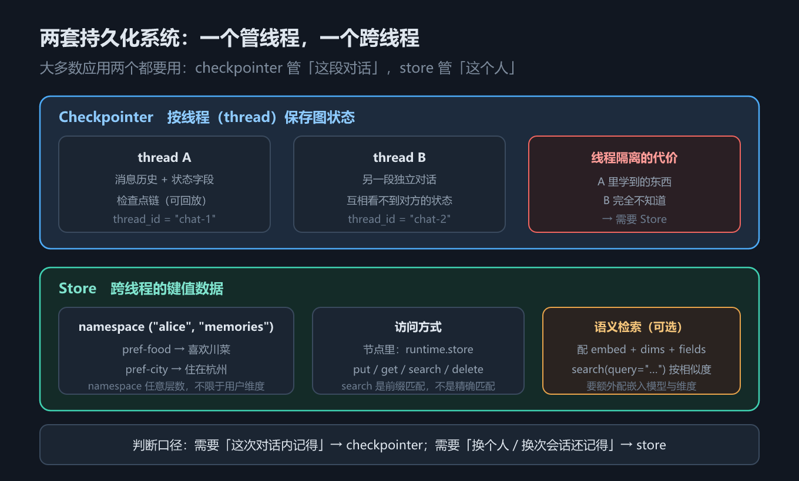
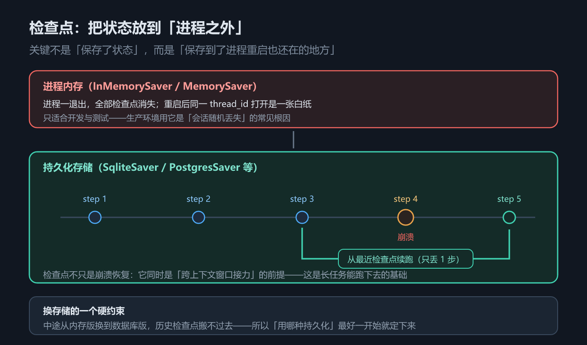
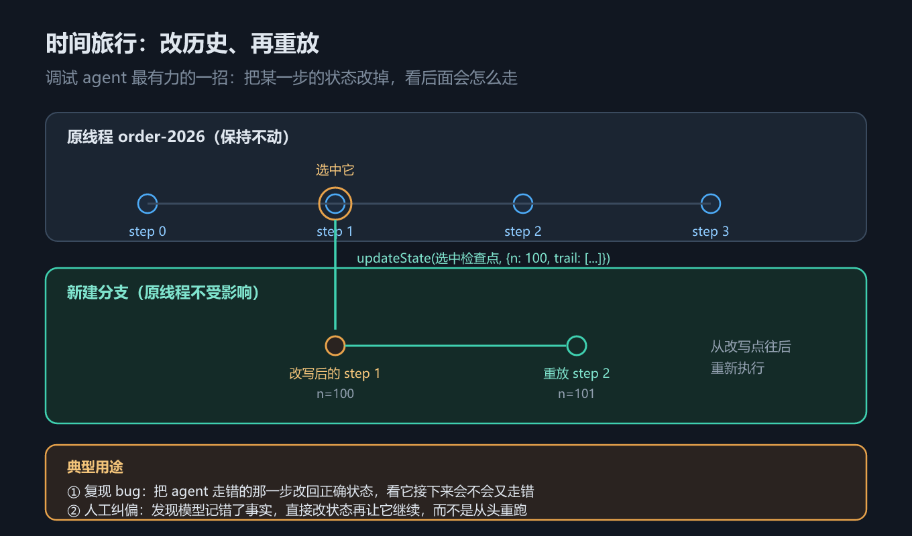

# 第 11 章 持久化与持久执行：检查点、线程、时间旅行与长期记忆

## 一、这一章要解决的问题

第 10 章讲的是**一次运行之内**状态怎么合并。但真实应用里，图跑完之后问题才开始：进程重启了，对话历史还在吗？agent 走到第 5 步崩了，是整条链路重来还是接着跑？模型在某一步记错了事实，能不能改回正确状态让它从那里继续？张三在 A 会话说过「我住杭州」，换个会话还记得吗？

这四件事对应两套**互不替代**的机制：**检查点（checkpoint）** 管「这一段对话」，**存储（store）** 管「这个人」。本章把两套都讲清，并给出本机实测的行为边界。

> 版本锚点：本章结论在 `langgraph` **1.2.12**（Python）与 `@langchain/langgraph` **1.4.17**（JS）上实测；示例源码见 `code/python/11_persistence.py` 与 `code/typescript/11_persistence.ts`。

## 二、机制与原理

### 2.1 两套持久化系统：checkpointer 与 store

先看下面这张表——它回答的问题是「我该把东西存哪一套」。选错了会出现「对话能续上但记不住用户」或「记得住用户但对话一断就丢」这类奇怪现象。

| | Checkpointer（检查点保存器） | Store（跨线程存储） |
|---|---|---|
| **作用范围** | 单个线程（thread） | 跨线程 |
| **存什么** | 图状态的完整快照 | 应用自定义的键值数据 |
| **怎么取** | 运行时传 `thread_id` | 节点里用 `runtime.store` |
| **典型用途** | 对话延续 / 人在回路 / 时间旅行 / 故障恢复 | 用户偏好 / 长期事实 / 共享知识 |
| **隔离性** | 线程之间互相看不到 | 按命名空间（namespace）自行隔离 |

判断口径只有一句：**需要「这次对话内记得」→ checkpointer；需要「换个人、换次会话还记得」→ store。**



*图 21　checkpointer 与 store 两套持久化系统：一个按线程存图状态，一个跨线程存键值*

### 2.2 检查点、线程与命名空间

图在**每一个超步（superstep）边界**存一份检查点。超步就是「一轮可以并行执行的节点」。所以检查点不是「保存结果」，而是「保存到某一步为止的完整状态」。

运行配置里的 `configurable` 字典决定「读/写哪一份检查点」。它有三个层次，`config = {"configurable": {...}}`：

| 键 | 示例值 | 含义 |
|---|---|---|
| `thread_id` | `"order-2026"` | 哪条线程（必填） |
| `checkpoint_ns` | `""` | 线程里的哪张图；顶层图为空串，子图有自己的命名空间 |
| `checkpoint_id` | `"1ef4..."` | 哪一个快照；不传就取最新 |

`thread_id` 是**对话的身份证**——同一个 `thread_id` 的多次 `invoke` 共享同一条状态历史，换一个就是一张白纸。`checkpoint_ns` 区分「同一个线程里这条状态属于哪张图」，把 agent 当子图挂进父图后，子图的状态就落在自己的命名空间里（第 12 章「子图消息不透传」用的是同一个底层概念）。`checkpoint_id` 指向具体快照；`update_state` 之所以能改写历史，就是因为它接收的是**某个历史快照自带的 config**。

### 2.3 持久执行（durable execution）与内置实现

有了逐超步的检查点，「持久执行」是免费得到的：进程崩了，重启后拿同一个 `thread_id` 再 `invoke` 一次，图从**最近的检查点**继续，只丢最后一次超步。



*图 22　检查点把状态放到进程之外：内存版重启即失，持久化版从最近检查点续跑*

内置实现只有三种口径，别混用：

| 实现 | 导入路径 | 落在哪 | 适用 |
|---|---|---|---|
| `InMemorySaver`（JS：`MemorySaver`） | `langgraph.checkpoint.memory` / `@langchain/langgraph` | 进程内存 | 开发与测试 |
| `SqliteSaver` | `langgraph.checkpoint.sqlite` | 单个 SQLite 文件 | 本地单机 |
| `PostgresSaver` | `langgraph.checkpoint.postgres` | PostgreSQL | 生产 |

> ⚠️ **与官方文档的差异（差异清单第 5 条）**：文档在排障章节直接写 `from langgraph.checkpoint.sqlite import SqliteSaver`，但 **`langgraph` 1.2.12 的默认安装不含 `langgraph.checkpoint.sqlite`**，必须先 `pip install langgraph-checkpoint-sqlite`（生产用 `langgraph-checkpoint-postgres`）。本仓库 `code/python/requirements.txt` 里这一行特意注释掉了，就是为了提醒。JS 侧对应 `@langchain/langgraph-checkpoint-*` 系列包（未实跑）。

### 2.4 读与改：get_state / get_state_history / update_state

这张表回答「我怎么看见和改动检查点」。

| 方法 | Python | TypeScript | 给你什么 |
|---|---|---|---|
| 当前快照 | `graph.get_state(cfg)` | `await graph.getState(cfg)` | `values` / `next` / `config` / `metadata` |
| 历史快照 | `graph.get_state_history(cfg)` | `await graph.getStateHistory(cfg)` | **异步迭代器**，从新到旧 |
| 改写历史 | `graph.update_state(cfg, values)` | `await graph.updateState(cfg, values)` | 返回**新分支**的 config |

两个字段要会读：`values` 是这一份快照的完整状态；`next` 是**待执行节点**——跑完的线程 `next` 为空，这是判断「图是否停在半路」最可靠的信号。**时间旅行（time travel）** 就是「拿一个历史快照的 config，改掉几个字段，再从那里重放」。它**新建分支**，原线程的历史一条都不动。这使它成为调试 agent 最有力的一招：把 agent 走错的那一步改回正确状态，看它接下来会不会又走错。



*图 23　时间旅行：选中历史检查点、改写状态、从改写点新建分支重放，原线程不受影响*

### 2.5 Store：跨线程的键值记忆

Store 的模型很简单：**命名空间是一个字符串元组，任意层数** + 一个键 + 一个 JSON 可序列化的值。`("alice", "memories")` 只是「用用户维度做命名空间」这一种用法，不是唯一用法。

| 方法 | Python | TypeScript | 说明 |
|---|---|---|---|
| 写入 | `put(namespace, key, value, index=None)` | `await store.put(ns, key, value, index?)` | 值必须是 JSON 可序列化对象 |
| 读取 | `get(namespace, key) -> Item \| None` | `await store.get(ns, key)` | 读 `.value` 拿数据 |
| 搜索 | `search(namespace_prefix, *, query=None, filter=None, limit=10, offset=0)` | `await store.search(nsPrefix, { query?, filter?, limit?, offset? })` | **前缀**匹配，不是精确匹配 |
| 删除 | `delete(namespace, key)` | `await store.delete(ns, key)` | |
| 列命名空间 | `list_namespaces(*, prefix=None, suffix=None, max_depth=None, limit=100, offset=0)` | `await store.listNamespaces({ prefix?, suffix?, maxDepth?, limit?, offset? })` | 返回命名空间路径列表 |

> 上表中位置参数形式（`put` / `get` / `search(prefix)` / `list_namespaces(prefix=...)`）是本机实测跑过的；`query` / `filter` / `limit` 等关键字选项来自官方 Stores 页，未逐项实跑；`delete` 的签名取自 `BaseStore` 定义（JS 侧类型定义 `@langchain/langgraph-checkpoint` 1.1.5），示例中未单独调用。

**`search` 是前缀匹配，这是最容易踩的一处**：数据写进 `("alice", "memories")` 和 `("alice", "notes")` 之后，`search(("alice",))` 会把两个命名空间下的条目**全都捞出来**（实测命中 3 条），而不是只返回 `("alice",)` 这一层。想要精确一层，就把命名空间写细：`search(("alice", "memories"))`。

**语义检索（semantic search）** 需要在构造 Store 时配 `index`：

| 字段 | Python | TypeScript | 含义 |
|---|---|---|---|
| 嵌入模型 | `embed` | `embeddings` | 一个 LangChain `Embeddings` 实例 |
| 维度 | `dims` | `dims` | 向量维度，必须与模型一致 |
| 索引字段 | `fields` | `fields` | 从值里取哪些字段去做嵌入 |

配好之后 `search(ns, query="…")` 会按相似度排序，返回项多一个 `score` 字段。

> ⚠️ **需 API Key，未实测**：`index` 需要真实嵌入模型（OpenAI / Cohere 等）才能产生向量。本章示例用的是不带 `index` 的 `InMemoryStore`，纯键值语义——**语义检索只给写法、不给运行结果**。另注意 Python 用 `embed`、JS 用 `embeddings`，字段名不同。

**节点里怎么拿到 store**：图挂上 store 之后，节点通过运行时对象访问——Python 是节点第二个参数 `runtime: Runtime`（来自 `langgraph.runtime`）上的 `runtime.store`；JS 节点的第二个参数就是运行时对象，`runtime.store` 直接用，也可以用 `getStore()` 从当前配置取。工具侧则统一走 `ToolRuntime.store`（见第 7 章，那条路径本机实测跑过）。

## 三、代码：Python 与 TypeScript

### 3.1 检查点续跑、历史快照与时间旅行

Python 侧先跑四次 `invoke` 看 `n` 怎么变，再读快照与历史，最后挑一个中间快照改写后重放。

```python
from langgraph.checkpoint.memory import InMemorySaver
from langgraph.graph import END, START, StateGraph

class Counter(TypedDict):
    n: int
    trail: list[str]

def step(state: Counter) -> dict:
    n = state["n"] + 1
    return {"n": n, "trail": [*state.get("trail", []), f"step→{n}"]}

graph = (StateGraph(Counter).add_node("step", step)
         .add_edge(START, "step").add_edge("step", END)
         .compile(checkpointer=InMemorySaver()))
cfg = {"configurable": {"thread_id": "order-2026"}}

print(graph.invoke({"n": 0, "trail": []}, cfg)["n"])   # 1
print(graph.invoke({}, cfg)["n"])                      # 2   空字典 → 从检查点续跑
print(graph.invoke(None, cfg)["n"])                    # 2   None  → 空操作
print(graph.invoke({"n": 100}, cfg)["n"])              # 101 输入覆盖 n 再 +1

snap = graph.get_state(cfg)
print(snap.values, snap.next)                          # 已跑完 → next 为空元组
for s in graph.get_state_history(cfg):                 # 从新到旧
    print(s.metadata["step"], s.values["n"], s.next)

target = list(graph.get_state_history(cfg))[-2]        # 从最早往回数第 2 个检查点
forked = graph.update_state(target.config,             # 用历史快照的 config → 新建分支
                            {"n": 100, "trail": ["人工改写：从 100 开始"]})
print(graph.invoke(None, forked))                      # 从改写点往后重放 → n=101
# 原线程 cfg 的历史一条都没动——时间旅行是「开分支」，不是「改历史」
```

TypeScript 侧一一对应，注意 `getStateHistory` 是**异步迭代器**，必须 `for await` 收下来再取下标。

```typescript
import { Annotation, END, MemorySaver, START, StateGraph } from "@langchain/langgraph";

const Counter = Annotation.Root({
  n: Annotation<number>({ default: () => 0 }),
  trail: Annotation<string[]>({ default: () => [] }),
});
const step = (s: any) => ({ n: s.n + 1, trail: [...s.trail, `step→${s.n + 1}`] });

const graph = new StateGraph(Counter)
  .addNode("step", step).addEdge(START, "step").addEdge("step", END)
  .compile({ checkpointer: new MemorySaver() });          // JS 叫 MemorySaver
const cfg = { configurable: { thread_id: "order-2026" } };

console.log((await graph.invoke({ n: 0, trail: [] }, cfg)).n);  // 1
console.log((await graph.invoke({}, cfg)).n);                   // 2   空对象 → 续跑
console.log((await graph.invoke(null, cfg)).n);                 // 2   null  → 空操作
console.log((await graph.invoke({ n: 100 }, cfg)).n);           // 101

const snap = await graph.getState(cfg);
console.log(snap.values, snap.next);                            // 已跑完 → next 为空数组
const history: any[] = [];
for await (const s of await graph.getStateHistory(cfg)) history.push(s);

const forked = await graph.updateState(history[history.length - 2].config, {
  n: 100,
  trail: ["人工改写：从 100 开始"],
});
console.log(await graph.invoke(null, forked));                  // 从改写点往后重放
```

**四个数字要记住**：第 1 次 `n=1`；第 2 次传 `{}` → `n=2`（从检查点状态**重新执行**了那个节点）；第 3 次传 `None` / `null` → `n=2`（**空操作**，已跑完的线程没有待执行任务，图一步都没跑）；第 4 次传 `{n: 100}` → 默认 reducer 覆盖掉检查点里的 2，再 +1 得 `101`。`trail` 一直在变长，因为四次输入里从没给过 `trail`——它始终沿用检查点里的值。这就是第 10 章那条结论的另一面：**输入里出现的字段按各自的 reducer 合并，没出现的保留检查点值**。

### 3.2 Store：跨线程记忆与前缀搜索

Python 侧往两个命名空间写三条数据，然后用一次前缀搜索看命中几条。

```python
from langgraph.store.memory import InMemoryStore

store = InMemoryStore()
USER = ("alice", "memories")

store.put(USER, "pref-food", {"text": "喜欢川菜"})
store.put(USER, "pref-city", {"text": "住在杭州"})
store.put(("alice", "notes"), "note-1", {"text": "上周开会提到 Q3 目标"})

print(store.get(USER, "pref-food").value)          # {'text': '喜欢川菜'}

hits = store.search(("alice",))                    # ⚠️ 前缀匹配
print(len(hits))                                   # 3 —— 两个命名空间的都捞出来了
print([i.key for i in store.search(USER)])         # ['pref-food', 'pref-city']
print(store.list_namespaces(prefix=("alice",)))    # ('alice','memories') 与 ('alice','notes')
store.delete(USER, "pref-city")                    # 删除某个键
```

TypeScript 侧注意两处差异：命名空间是**数组**，所有方法都要 `await`。

```typescript
import { InMemoryStore } from "@langchain/langgraph";

const store = new InMemoryStore();
const USER = ["alice", "memories"];

await store.put(USER, "pref-food", { text: "喜欢川菜" });
await store.put(USER, "pref-city", { text: "住在杭州" });
await store.put(["alice", "notes"], "note-1", { text: "上周开会提到 Q3 目标" });

console.log((await store.get(USER, "pref-food"))?.value);   // { text: '喜欢川菜' }

const hits = await store.search(["alice"]);                 // ⚠️ 前缀匹配
console.log(hits.length);                                   // 3
console.log((await store.search(USER)).map((i) => i.key));  // ['pref-food', 'pref-city']
console.log(await store.listNamespaces({ prefix: ["alice"] }));
await store.delete(USER, "pref-city");
```

> 完整可跑版本（含打印格式与末尾的分工对照表）：`code/python/11_persistence.py`、`code/typescript/11_persistence.ts`。

## 四、常见坑与边界条件

1. **`invoke({})` 和 `invoke(None)` 语义相反**。空字典 = 从检查点状态重新执行；`None` / `null` = 空操作。想「续跑」用空字典，想「从这份快照重放」用 `None`。
2. **生产环境别用 `InMemorySaver` / `MemorySaver` / `InMemoryStore`**。进程一退出全没，表现为「用户的会话随机丢失」。
3. **`SqliteSaver` 要另装包**（`pip install langgraph-checkpoint-sqlite`），否则 import 就失败（差异清单第 5 条）。**中途换后端，历史搬不过去**——持久化方案要在项目早期定。
4. **`search` 是前缀匹配**。命名空间写粗了会误命中；数据一多就把命名空间写细。
5. **时间旅行不是改历史**。`update_state` 返回的是新分支的 config，原线程不受影响；要接着新分支跑，必须用返回的那个 config。
6. **两边挂 store 的位置不同**。Python 是 `compile(checkpointer=..., store=...)`，JS 是把 store 放进运行配置一起传（`invoke(input, { ...cfg, store })`）——这是双语言差异里容易漏的一处。**另外 `get_state_history` 在 JS 侧是异步迭代器**，直接 `console.log` 只会得到迭代器对象，必须先 `for await` 收进数组。

## 五、关键结论

1. **checkpointer 管线程，store 管人**。前者按 `thread_id` 存图状态快照，后者按命名空间存跨线程键值数据，两者不可互替。
2. **检查点是逐超步存的**，因此「持久执行」不需要额外机制：崩溃后用同一个 `thread_id` 再 `invoke`，图从最近检查点续跑。
3. **`thread_id` / `checkpoint_ns` / `checkpoint_id` 三级定位**：哪条线程 → 线程里的哪张图 → 哪一个快照。`update_state` 的输入就是一份带 `checkpoint_id` 的历史 config。
4. **时间旅行新建分支**，原线程历史不动——调试 agent 最有力的一招。
5. **`search` 是前缀匹配**：`search(('alice',))` 会命中 `('alice','memories')` 与 `('alice','notes')` 下的全部条目（实测 3 条）。
6. **语义检索要额外配 `index`（`embed`/`embeddings` + `dims` + `fields`）**，且需要真实嵌入模型；本章只给写法，未实测。

## 本章要点回顾

- **两套持久化**：checkpointer（按线程、存图状态、传 `thread_id` 取）vs store（跨线程、存键值、用 `runtime.store` 取）。
- **配置三级定位**：`thread_id`（哪条线程）→ `checkpoint_ns`（哪张图）→ `checkpoint_id`（哪个快照）。
- **内置 checkpointer**：`InMemorySaver` / `MemorySaver`（开发）、`SqliteSaver`（本地，**需另装 `langgraph-checkpoint-sqlite`**）、`PostgresSaver`（生产）。
- **实测四连**：`{n:0}` → 1；`{}` → 2（续跑）；`None` → 2（空操作）；`{n:100}` → 101（覆盖后 +1）。
- **`get_state` 看当前，`get_state_history` 看历史**（JS 是异步迭代器），`next` 为空表示已跑完。
- **`update_state` 新建分支**，原线程不受影响——时间旅行的实现方式。
- **Store API**：`put` / `get` / `search` / `delete` / `list_namespaces`；`search` 是**前缀**匹配，实测 `search(('alice',))` 命中 3 条。
- **语义检索**：构造时配 `index = {embed/embeddings, dims, fields}`，`search(..., query=...)` 按相似度返回 `score`——需嵌入模型，**未实测**；**换后端搬不了历史**，持久化方案要在项目早期定下来。
