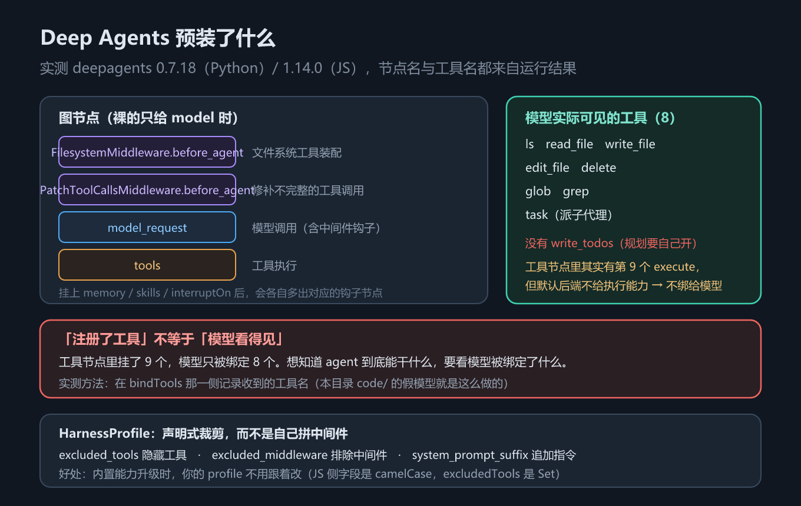

# 第 13 章 Deep Agents 全景：预装 harness 与 HarnessProfile

## 一、这一章要解决的问题

前六章都在「自己拼」：循环要配、工具要写、上下文要管、子代理要自己搭。**Deep Agents** 走的是另一条路——它在 `create_agent` 之上**预装**一整套常用能力：虚拟文件系统、子代理委派、技能与记忆、待办规划。

预装带来三个必须回答的问题：

1. 默认到底给了什么？（工具、中间件、图节点）
2. 哪些是「注册了」但**模型根本看不见**的？
3. 预装的东西我不想要，怎么裁？——这是 `HarnessProfile` 要解决的。

本章只讲**全景与裁剪**；文件系统与权限的细节在第 14 章，规划与委派在第 15 章，技能与记忆在第 16 章。

> 版本锚点：本章结论在 `deepagents` **0.7.18**（Python）/ **1.14.0**（JS）、`langchain` **1.4.2** 上实测；示例源码见 `code/python/13_deep_agent.py` 与 `code/typescript/13_deep_agent.ts`。

## 二、机制与原理

### 2.1 create_deep_agent 的完整参数

下面这张表回答「我能配什么」。参数按**实测签名**给全——官方文档正文只列了其中一部分。

| 参数（Python） | TypeScript | 作用 |
|---|---|---|
| `model` | `model` | 模型实例或 `provider:model` 字符串 |
| `tools` | `tools` | **追加**自定义工具（不会移除内置工具） |
| `system_prompt` | `systemPrompt` | 自定义系统提示 |
| `middleware` | `middleware` | **追加**中间件（如 `TodoListMiddleware()`） |
| `subagents` | `subagents` | 子代理清单，支撑 `task` 工具 |
| `skills` | `skills` | 技能源路径列表 |
| `memory` | `memory` | 记忆文件路径列表（`AGENTS.md`） |
| `permissions` | `permissions` | 文件系统权限规则 |
| `backend` | `backend` | 文件与执行的落点（默认 `StateBackend`） |
| `interrupt_on` | `interruptOn` | 哪些工具调用前要人工审批 |
| `response_format` | `responseFormat` | 结构化输出 |
| `state_schema` | `stateSchema` | 自定义状态字段 |
| `context_schema` | `contextSchema` | 单次运行的上下文（`context`） |
| `checkpointer` | `checkpointer` | 检查点保存器（第 11 章） |
| `store` | `store` | 跨线程存储（第 11 章） |
| `debug` | 参数表中无此字段 | 调试日志 |
| `name` | `name` | agent 名（当子图时有用） |
| `cache` | 参数表中无此字段 | 节点级缓存 |

> 两条来源说明：Python 列的 `debug` / `cache` 来自本机实测签名；JS 侧的 `CreateDeepAgentParams`（`deepagents` 1.14.0 类型定义）里确实**没有**这两个字段，但多一个 `streamTransformers`。

### 2.2 默认工具集：注册 9 个，模型只看得见 8 个

这是本章最重要的一节，也是差异清单第 1 条。**「注册了工具」不等于「模型看得见」**——必须分成两个口径看。

| 工具 | 用途 | 注册在工具节点 | 绑定给模型 |
|---|---|---|---|
| `ls` | 列目录 | ✅ | ✅ |
| `read_file` | 读文件 | ✅ | ✅ |
| `write_file` | 写文件 | ✅ | ✅ |
| `edit_file` | 改文件 | ✅ | ✅ |
| `delete` | 删文件 | ✅ | ✅ |
| `glob` | 按文件名模式找 | ✅ | ✅ |
| `grep` | 按内容搜 | ✅ | ✅ |
| `execute` | 执行命令 | ✅ | ❌ |
| `task` | 派子代理 | ✅ | ✅ |

**合计：工具节点里注册 9 个，绑定给模型的只有 8 个。** 差的正是 `execute`——默认后端是 `StateBackend`，它把文件存在图状态里，**不提供执行能力**，所以 `execute` 根本不向模型暴露。换句话说，想看 agent 到底能干什么，要看**模型被绑定了什么**，而不是看工具节点里挂了什么。



*图 26　Deep Agents 预装的中间件栈与工具集：注册 9 个、模型可见 8 个*

**`write_todos` 默认不开。** 它既不在这 9 个里，也不在那 8 个里——想用规划能力，必须显式加中间件：

- Python：`from langchain.agents.middleware import TodoListMiddleware`，然后 `create_deep_agent(model=..., middleware=[TodoListMiddleware()])`
- TypeScript：`import { todoListMiddleware } from "langchain"`，然后 `middleware: [todoListMiddleware()]`

加上之后 `write_todos` 才会被绑定给模型，并且**状态里会多出一个 `todos` 键**（实测）。

> ⚠️ **与官方文档的差异（差异清单第 1 条）**：概览页把 `write_todos` 描述为「可选能力，v0.7 起需主动开启」，但没有给出默认工具清单。实测（`deepagents` 0.7.18）确认默认**不绑定** `write_todos`，与文档口径一致；但「9 注册 / 8 可见」这个区分文档里没有，是本机实测补上的。

### 2.3 四类内置能力

这张表回答「预装的这些东西，各自属于哪一类能力」。中间件在 JS 侧是工厂函数（`createFilesystemMiddleware` 等），名字对应。

| 能力域 | 提供什么 | 靠哪个中间件 |
|---|---|---|
| **执行环境** | 虚拟文件系统的 7 个文件工具；命令执行（取决于后端） | `FilesystemMiddleware` + `backend` |
| **上下文管理** | 大工具输出卸载到文件系统、摘要压缩、修补不完整的工具调用 | `FilesystemMiddleware` / `SummarizationMiddleware` / `PatchToolCallsMiddleware` |
| **委派** | `task` 工具 + 独立上下文的子代理 | `SubAgentMiddleware` |
| **引导** | 系统提示、技能（Skills）、记忆（Memory）、待办（`write_todos`） | `SkillsMiddleware` / `MemoryMiddleware` / `TodoListMiddleware` |

### 2.4 预装中间件栈与图节点名

打开编译后的图，能看到中间件各自插进来的钩子节点。**实测节点名两边不一样**：

| | Python | TypeScript |
|---|---|---|
| 模型调用节点 | `model` | `model_request` |
| 工具执行节点 | `tools` | `tools` |
| 文件系统钩子 | `FilesystemMiddleware.before_agent` | `FilesystemMiddleware.before_agent` |
| 修补工具调用 | `PatchToolCallsMiddleware.before_agent`（**P 大写**） | `patchToolCallsMiddleware.before_agent`（**p 小写**） |
| 挂 memory 后 | `MemoryMiddleware.before_agent` | 同左（驼峰工厂名） |
| 挂 skills 后 | `SkillsMiddleware.before_agent` | 同左 |
| 挂 `interrupt_on` 后 | `HumanInTheLoopMiddleware.after_model` | 同左 |

**结论：节点名是内部实现细节**，跨语言、跨版本都可能变。要判断「这个 agent 到底装了哪些能力」，请用**工具列表**或**中间件清单**，不要硬编码节点名——这是差异清单第 12 条特意标红的一条。

### 2.5 HarnessProfile：声明式裁剪，而不是自己拼中间件

预装能力的代价是「不想要的也塞进来了」。`HarnessProfile` 让你**声明式地**裁剪，而不是自己把中间件拆开重拼——好处是内置能力升级时，你的 profile 不用跟着改。

官方文档只提到了 `excluded_tools` 与 `excluded_middleware` 两个字段，**实测一共 7 个**（差异清单第 11 条）：

| 字段（Python） | TypeScript | 作用 |
|---|---|---|
| `base_system_prompt` | `baseSystemPrompt` | 替换基础系统提示 |
| `system_prompt_suffix` | `systemPromptSuffix` | 追加指令（如「一律用中文」） |
| `tool_description_overrides` | `toolDescriptionOverrides` | 改写某个工具的描述 |
| `excluded_tools` | `excludedTools` | 隐藏工具（Python `frozenset`，JS `Set`） |
| `excluded_middleware` | `excludedMiddleware` | 排除中间件 |
| `extra_middleware` | `extraMiddleware` | 追加中间件 |
| `general_purpose_subagent` | `generalPurposeSubagent` | 配置自动添加的通用子代理 |

两处边界要记住：

- **`excluded_middleware` 排不掉必需项**。`FilesystemMiddleware` 与 `SubAgentMiddleware` 被标为必需（前者撑起全部文件工具与权限，后者撑起 `task` 工具），排除它们不会生效。
- **JS 侧的工厂函数叫 `createHarnessProfile`**，字段是 camelCase，且 `excludedTools` / `excludedMiddleware` 在**实例上是 `Set`**——直接 `JSON.stringify` 会得到 `{}`，要用 `Array.from()`。

注册方式两边一致：`register_harness_profile(key, profile)` / `registerHarnessProfile(key, profile)`，之后按 key 取用。

## 三、代码：Python 与 TypeScript

### 3.1 探测默认工具集：注册 9 个 vs 模型可见 8 个

Python 侧从**模型那一侧**取工具名，再和工具节点里挂的做差集。注意 `bindTools` 是**每次模型调用时**才触发的，所以必须先 `invoke` 一次。

```python
from _fake_model import ScriptedChatModel, reply
from deepagents import create_deep_agent
from langchain_core.messages import HumanMessage

m0 = ScriptedChatModel(script=[reply("好的")])
agent0 = create_deep_agent(model=m0)
print(m0.last_bound_tool_names())            # [] —— bindTools 还没触发

agent0.invoke({"messages": [HumanMessage("你好")]},
              config={"configurable": {"thread_id": "probe"}})
names = m0.last_bound_tool_names()           # 模型这一侧看到的
print(len(names), names)                     # 8 个：不含 execute、不含 write_todos

node_tools = sorted(agent0.nodes["tools"].bound._tools_by_name.keys())
print(len(node_tools), sorted(set(node_tools) - set(names)))   # 9 个，差集 {'execute'}
# ⚠️ 上面这行读的是图内部的属性名，属于实现细节，换版本可能失效——
#    结论请以「模型被绑定了什么」为准。
```

TypeScript 侧只能从模型这一侧探测（包装对象的内部属性没有稳定路径），方法与 Python 完全一致。

```typescript
import { createDeepAgent } from "deepagents";
import { ScriptedChatModel, reply } from "./_fakeModel";

const m0 = new ScriptedChatModel({ script: [reply("好的")] });
const agent0 = createDeepAgent({ model: m0 as any });
console.log(m0.lastBoundToolNames());        // [] —— bindTools 还没触发

await agent0.invoke({ messages: [{ role: "user", content: "你好" }] },
                    { configurable: { thread_id: "probe" } });
const names = m0.lastBoundToolNames();
console.log(names.length, names);            // 8 个：ls / read_file / write_file / edit_file /
                                             // delete / glob / grep / task
```

> 为什么用假模型来探测：本教程的 `ScriptedChatModel` 会记录 `bindTools` 收到的工具名。这正是「注册 ≠ 可见」这条结论的证据来源。**真实模型下的工具选择倾向需要 API Key，未实测。**

### 3.2 显式开启规划，并用 HarnessProfile 裁剪

Python 侧先加 `TodoListMiddleware` 让 `write_todos` 出现，再用 `HarnessProfile` 裁掉执行能力。

```python
from deepagents import HarnessProfile, create_deep_agent, register_harness_profile
from langchain.agents.middleware import TodoListMiddleware

planned = create_deep_agent(model=m1, middleware=[TodoListMiddleware()])
out = planned.invoke({"messages": [HumanMessage("帮我做个计划")]})
print("write_todos" in m1.last_bound_tool_names())     # True —— 加了中间件才出现
print(out.get("todos"))                                # 状态里多出 todos 键

profile = HarnessProfile(
    system_prompt_suffix="回答一律用中文。",
    excluded_tools=frozenset({"execute"}),             # 不要执行能力（Python 是 frozenset）
    tool_description_overrides={"grep": "在本项目源码里搜索。"},
)
register_harness_profile("my-openai-profile", profile)
```

TypeScript 侧注意三处差异：工厂函数 `createHarnessProfile`、camelCase 字段、`excludedTools` 是 `Set`。

```typescript
import { createDeepAgent, createHarnessProfile, registerHarnessProfile } from "deepagents";
import { todoListMiddleware } from "langchain";

const planned = createDeepAgent({ model: m1 as any, middleware: [todoListMiddleware()] as any });
const out: any = await planned.invoke({ messages: [{ role: "user", content: "帮我做个计划" }] });
console.log(m1.lastBoundToolNames().includes("write_todos"));   // true
console.log(out.todos);                                        // 状态里多出 todos 键

const profile = createHarnessProfile({
  systemPromptSuffix: "回答一律用中文。",               // camelCase
  excludedTools: ["execute"],                          // 传数组，实例上是 Set
  toolDescriptionOverrides: { grep: "在本项目源码里搜索。" },
});
registerHarnessProfile("my-profile", profile);
console.log(Array.from(profile.excludedTools));        // ⚠️ 直接 JSON.stringify 会得到 {}
```

> 完整可跑版本（含「挂 memory / skills / subagents / interrupt_on 后节点怎么变」的对比）：`code/python/13_deep_agent.py`、`code/typescript/13_deep_agent.ts`。

## 四、常见坑与边界条件

1. **「注册了」≠「模型看得见」**。默认 9 个注册、8 个可见，差的 `execute` 是因为 `StateBackend` 不提供执行能力。判断 agent 能力请看模型侧绑定结果。
2. **`write_todos` 默认不开**，必须显式加 `TodoListMiddleware` / `todoListMiddleware`（差异清单第 1 条）。
3. **别硬编码图节点名**。Python 是 `model` / `PatchToolCallsMiddleware.before_agent`，JS 是 `model_request` / `patchToolCallsMiddleware.before_agent`——节点名是内部实现细节（差异清单第 12 条）。
4. **包归属别搞错**：`FilesystemMiddleware` / `SubAgentMiddleware` 在 `deepagents` 里，**不在** `langchain.agents.middleware`；`SkillsMiddleware` 也不在 `deepagents` 顶层导出，要从 `deepagents.middleware` 导入（差异清单第 2、3 条）。
5. **`tools=` 是追加不是替换**。想移除内置文件工具，得走 `HarnessProfile.excluded_tools` 或 `FilesystemMiddleware` 的白名单，不能靠 `tools=` 覆盖。
6. **`excluded_middleware` 排不掉必需项**（`FilesystemMiddleware` / `SubAgentMiddleware`）。
7. **JS 的 `excludedTools` 是 `Set`**，序列化前先 `Array.from()`；Python 侧是 `frozenset`，两边都不是普通列表。
8. **预装能力的效果需要真实模型才能评估**（子代理产出质量、技能是否被正确加载等）——本机无 API Key，**未实测**；本章只验证「装了什么、暴露了什么」。

## 五、关键结论

1. **Deep Agents = `create_agent` + 预装中间件栈**，把文件系统、子代理、技能、记忆、规划这些常用能力开箱给出来。
2. **默认工具集有两个口径**：工具节点注册 **9 个**，绑定给模型的只有 **8 个**（`execute` 因默认后端不提供执行能力而未暴露）。
3. **`write_todos` 默认不开**，要显式加 `TodoListMiddleware`；加上后状态里会多出 `todos` 键。
4. **四类内置能力**：执行环境、上下文管理、委派、引导。
5. **图节点名是内部实现细节**，Python 与 JS 不同（`model` vs `model_request`），不要硬编码。
6. **`HarnessProfile` 共 7 个字段**（文档只提 2 个），用来声明式裁剪；JS 侧是 `createHarnessProfile` + camelCase + `Set`。
7. **要看 agent 到底能干什么，看模型被绑定了什么**，而不是看工具节点里挂了什么。

## 本章要点回顾

- **入口**：`create_deep_agent` / `createDeepAgent`，18 个参数按实测签名给全（JS 侧无 `debug` / `cache`，多 `streamTransformers`）。
- **默认工具集**：工具节点注册 **9** 个，模型可见 **8** 个——差的是 `execute`（默认 `StateBackend` 不给执行能力）。
- **规划要自己开**：`TodoListMiddleware()` / `todoListMiddleware()`，加上后状态多出 `todos` 键。
- **四类内置能力**：执行环境（`FilesystemMiddleware`）、上下文管理（卸载 / 摘要 / 修补）、委派（`SubAgentMiddleware` + `task`）、引导（技能 / 记忆 / 待办）。
- **节点名两边不同**：Python `model` / `PatchToolCallsMiddleware.before_agent`；JS `model_request` / `patchToolCallsMiddleware.before_agent`——**别硬编码**。
- **`HarnessProfile` 7 个字段**：`base_system_prompt` / `system_prompt_suffix` / `tool_description_overrides` / `excluded_tools` / `excluded_middleware` / `extra_middleware` / `general_purpose_subagent`。
- **JS 三处差异**：`createHarnessProfile`、camelCase 字段、`excludedTools` 是 `Set`（`JSON.stringify` 得 `{}`）。
- **必需中间件排不掉**：`FilesystemMiddleware` / `SubAgentMiddleware`。
- **预装能力的效果需真实模型，未实测**；本章验证的是「装了什么、暴露了什么」。
