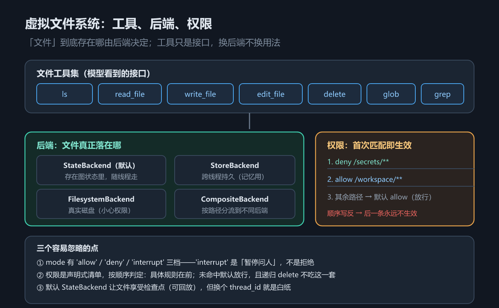

# 第 14 章 虚拟文件系统与执行环境：文件工具、权限与后端

## 一、这一章要解决的问题

第 13 章看到 Deep Agents 预装了一套文件工具，本章把它拆开讲透。要回答四个问题：

1. 这些文件与执行工具跑起来**到底返回什么**？
2. 文件存在**哪里**？——默认后端 `StateBackend` 的存储语义是什么？
3. 怎么限制 agent **只能动某些目录**？——`FilesystemPermission`。
4. 想让文件跨线程存活、落到真实磁盘、或丢进沙箱执行，该换哪个**后端（backend）**？

一句话主线：**工具是「面」，后端是「里」**。同一套文件工具，换个后端就从「只活一个线程」变成「跨线程持久」或「直写真实磁盘」。

> 版本锚点：本章结论在 `deepagents` **0.7.18**（Python）/ **1.14.0**（JS）、`langchain` **1.4.2** 上实测；示例源码见 `code/python/14_filesystem.py` 与 `code/typescript/14_filesystem.ts`。

## 二、机制与原理

### 2.1 8 个文件与执行工具的实际行为

这张表回答「每个工具是干什么的、本章示例覆盖了哪些」。Deep Agents 预装 **8 个文件与执行工具**：7 个纯文件工具（`ls` / `read_file` / `write_file` / `edit_file` / `delete` / `glob` / `grep`）加上 `execute`。第 13 章那个「注册 9 个」里的第 9 个是委派用的 `task`，归第 15 章。

| 工具 | 做什么 | 本章示例是否覆盖 |
|---|---|---|
| `ls` | 列目录 | ✅ |
| `write_file` | 写文件（整文件覆盖） | ✅ |
| `read_file` | 读文件（带行号头） | ✅ |
| `edit_file` | 按 `old_string` 精确替换 | ✅ |
| `delete` | 删文件 | ❌（只讲用途） |
| `glob` | 按文件名模式找 | ❌（只讲用途） |
| `grep` | 按内容搜 | ❌（只讲用途） |
| `execute` | 执行命令（取决于后端） | ❌（默认后端不提供） |

**实测返回值的原样**（`deepagents` 0.7.18，示例 `10_filesystem.py` 一次 `invoke` 内四连调用）：

```text
[write_file] Updated file /notes/todo.md
[read_file]  @@ lines 1-3 of 3 @@\n# 待办\n- 写文档\n- 跑测试
[edit_file]  Successfully replaced 1 instance(s)
[ls]         ['/notes/todo.md']
```

三个返回值各藏一处设计意图：

- **`read_file` 的 `@@ lines 1-3 of 3 @@` 是分页头**：告诉模型「你看到的是第 1–3 行，全文 3 行」，长文件可翻页，模型也知道**自己有没有看全**——这正是第 16 章「技能正文按需读、`limit=1000`」的前提。
- **`edit_file` 的 `1 instance(s)` 是匹配计数**：没匹配上会是 `0 instance(s)`，比抛异常温和——模型能自己发现改失败了。
- **`ls` 返回 Python 列表的字符串形态**：说明路径是**扁平存储 + 前缀匹配**，没有真实目录树。

### 2.2 StateBackend：文件存在图状态里

这是本章最需要记住的一条。默认后端 `StateBackend` 不碰磁盘、不碰外部存储，它把「文件」当成**图状态里的一个字段**（`state.files`）。

`state.files` 里一条文件记录，实测含四个键：

```text
state['files'] = {
  '/notes/todo.md': {
    'content':     '# 待办\n- 写文档\n- 跑测试 ✅',   # 文件正文
    'encoding':    'utf-8',
    'created_at':  '...',                              # 创建时间
    'modified_at': '...',                              # 最近修改时间
  }
}
```

把文件塞进状态，换来一组明确的**好处与代价**：好处是文件**跟着线程走**，天然享受检查点（第 11 章）——可回放、可时间旅行、崩溃后能恢复；代价是**换 `thread_id` 就没了**，新线程打开是一张白纸。一句话：`StateBackend` 的文件是**线程级**的，不是**全局级**的。要跨线程，得换后端（见 2.5）。

> 官方文档说默认写入「图状态中的本地文件系统」，与本机实测一致（`create_deep_agent` 源码里 `backend = backend if backend is not None else StateBackend()`）。

### 2.3 FilesystemMiddleware 的实测签名

这张表回答「这套文件工具能调哪些旋钮」。文件工具不是 `create_deep_agent` 直接塞进去的，而是由 `FilesystemMiddleware` 挂载；要改它的行为，就得看它的构造参数。

| 参数 | 默认值（实测） | 作用 |
|---|---|---|
| `backend` | `None` → 落到 `StateBackend()` | 文件与执行的落点 |
| `tools` | 全量 | **白名单**：只挂这里列出的文件工具 |
| `tool_token_limit_before_evict` | `20000` | 单个工具输出超过这个 token 数就**卸载到文件系统**（第 9 章的卸载机制） |
| `human_message_token_limit_before_evict` | `50000` | 人类消息超过这个 token 数时的卸载阈值 |
| `max_execute_timeout` | `3600` | `execute` 的最长执行秒数 |
| `grep_max_count` | `1000` | `grep` 最多返回多少条命中 |

两点提醒：**`tools` 是白名单，不是追加**——砍内置文件工具走这里（或 `HarnessProfile.excluded_tools`），`create_deep_agent(tools=...)` 那条路是**追加**自定义工具，砍不掉内置的（第 13 章第 5 条坑）；**两个 token 阈值是「卸载」而不是「截断」**——超限输出写进虚拟文件系统，上下文只留引用，即第 9 章的「工具输出卸载」。

### 2.4 FilesystemPermission：声明式权限

这张表回答「一条权限规则由哪几个字段组成」。权限用**声明式**写法描述，不用自己写回调。

| 字段 | 取值 | 含义 |
|---|---|---|
| `operations` | `["read"]` / `["write"]` / 两者 | 这条规则管哪些操作 |
| `paths` | 路径 glob，如 `'/workspace/**'` | 管哪些路径 |
| `mode` | `'allow'` / `'deny'` / `'interrupt'` | 命中后怎么办 |

**`mode` 有三档，第三档最容易漏**：

- `allow` —— 放行。
- `deny` —— 拒绝。
- **`interrupt` —— 暂停下来问人**，不是拒绝。这一档把**权限系统与人在回路（第 12 章）打通**了：agent 想动敏感路径时，图会 `interrupt` 等人审批，人放行才继续。

**规则按声明顺序「首次匹配即生效」（first match wins）**。这跟防火墙 ACL 是同一个思路，所以写法有讲究：

```text
1. 先声明「/secrets/** 禁止读写」     ← 具体规则放前面
2. 再声明「/workspace/** 允许读写」   ← 宽泛规则放后面
3. 没被任何规则命中的路径 → 默认 allow（放行）
```

顺序写反了会出大问题：先 `allow /workspace/**`、再 `deny /workspace/secrets/**`，**后一条永远不会生效**——因为第一条已经命中了。**具体规则在前、宽泛规则在后**，这是使用声明式权限时唯一必须背下来的纪律。

**默认策略是「放行」，这一点必须自己记住**：源码里 `_check_fs_permission` 的收尾就是 `return "allow"`——**没有任何规则命中 = 允许**。所以「只声明一条 deny」并不能得到「白名单」效果，想收紧必须**显式把要管的范围写全**（或在末尾补一条 `deny /**` 兜底）。

**一处例外：递归删除不吃「先匹配先赢」这一套。** 源码对 `delete` 单独处理——目标可能有子孙时，只要存在**任何**能覆盖到该子树（或它的某个祖先）的 `deny write` 规则，删除就会被拦下，**不管这条规则排在多后面**（源码注释：`regardless of rule order`）。理由是：早先的 `allow` 无法保证子树里每个后代都安全。所以「顺序纪律」只对 `read` / `write` / `edit` 成立，**别拿它去推 `delete`**。



*图 27　文件工具集与权限判定：声明顺序首次匹配即生效，mode 三档含 interrupt*

### 2.5 后端谱系：文件到底存在哪

这张表回答「不同后端把文件放哪、各自适合什么场景」。按实测签名给出。

| 后端 | 落点 | 特点 | 实测签名 |
|---|---|---|---|
| `StateBackend` | 图状态（默认） | 跟线程走、可回放；**跨线程丢失** | `StateBackend()` |
| `StoreBackend` | LangGraph Store | 跨线程持久；适合 `/memories/` 长期记忆 | `StoreBackend(*, namespace, store=None)` |
| `FilesystemBackend` | 真实磁盘 | 直接读写本机文件；要小心权限 | `FilesystemBackend(root_dir=None, virtual_mode=True, max_file_size_mb=10)` |
| `LocalShellBackend` | 本机 shell | 提供 `execute` 能力；生产环境慎用 | `LocalShellBackend(root_dir=None, *, virtual_mode=True, timeout=120, ...)` |
| `LangSmithSandbox` | 托管沙箱 | 隔离执行；适合不信任的代码 | 从 `deepagents.backends.langsmith` 导入 |
| `CompositeBackend` | 按路径分流 | 如 `/memories/**` 走 Store，其余走 State | `CompositeBackend(default, routes, *, artifacts_root='/')` |

两处必须记牢：

- **`StoreBackend` 的 `namespace` 是个函数**，从运行时（Runtime）算出来，不是写死的字符串。示例里写成 `lambda rt: ("memories",)`。
- **`LangSmithSandbox` 不在 `deepagents.backends` 顶层导出**，必须 `from deepagents.backends.langsmith import LangSmithSandbox`。这是本机实测（`deepagents` 0.7.18）确认的导入路径。

### 2.6 CompositeBackend：按路径分流

一个 agent 往往同时有「临时草稿」和「长期记忆」两类文件，前者该跟线程走、后者该跨线程。`CompositeBackend` 就是为这个场景准备的：**按路径前缀把请求路由到不同后端**。

```text
backend = CompositeBackend(
    default=StateBackend(),                                                   # 其余路径
    routes={'/memories/': StoreBackend(namespace=lambda rt: ("memories",))},  # 长期记忆
)
```

效果是：agent 写 `/memories/xxx` 就跨线程持久，写别处仍走状态，各取所需。这比「整个换成一个后端」灵活得多——**分流粒度是路径，不是整个 agent**。

## 三、代码：Python 与 TypeScript

### 3.1 文件工具往返：看返回值和 `state.files`

Python 侧用脚本模型连发四次工具调用，再把 `ToolMessage` 与 `state.files` 一起打出来——这就是 2.1、2.2 两节结论的证据来源。

```python
from _fake_model import ScriptedChatModel, reply, tool_call
from deepagents import create_deep_agent
from langchain_core.messages import HumanMessage

script = [
    tool_call("write_file", {"file_path": "/notes/todo.md", "content": "# 待办\n- 写文档\n- 跑测试"}, "c1"),
    tool_call("read_file", {"file_path": "/notes/todo.md"}, "c2"),
    tool_call("edit_file", {"file_path": "/notes/todo.md", "old_string": "- 跑测试", "new_string": "- 跑测试 ✅"}, "c3"),
    tool_call("ls", {"path": "/notes"}, "c4"),
    reply("做完了。"),
]
agent = create_deep_agent(model=ScriptedChatModel(script=script))
out = agent.invoke(
    {"messages": [HumanMessage("先写个待办，再读出来改一改")]},
    config={"configurable": {"thread_id": "fs-1"}},
)
for msg in out["messages"]:
    if type(msg).__name__ == "ToolMessage":
        print(f"[{msg.name}] {str(msg.content)[:88]}")   # 四条实测返回值见 2.1
print(sorted(k for k in out if not k.startswith("_")))   # ['files', 'messages', ...]
print(out["files"])                                      # 文件就在图状态里
```

TypeScript 侧语义完全一致，只有 `createDeepAgent` 与 `lastBoundToolNames` 的拼写差别。

```typescript
import { createDeepAgent } from "deepagents";
import { ScriptedChatModel, reply, toolCall } from "./_fakeModel";

const script = [
  toolCall("write_file", { file_path: "/notes/todo.md", content: "# 待办\n- 写文档\n- 跑测试" }, "c1"),
  toolCall("read_file", { file_path: "/notes/todo.md" }, "c2"),
  toolCall("edit_file", { file_path: "/notes/todo.md", old_string: "- 跑测试", new_string: "- 跑测试 ✅" }, "c3"),
  toolCall("ls", { path: "/notes" }, "c4"),
  reply("做完了。"),
];
const agent = createDeepAgent({ model: new ScriptedChatModel({ script }) as any });
const out: any = await agent.invoke(
  { messages: [{ role: "user", content: "先写个待办，再读出来改一改" }] },
  { configurable: { thread_id: "fs-1" } },
);
console.log(Object.keys(out).sort());   // ['files', 'messages', ...]
console.log(out.files);                 // 文件就在图状态里
```

> 注意：`state.files` 这个键名与「文件记录有哪四个字段」都属于**实测结论**（`deepagents` 0.7.18）；后端内部结构是可能随版本调整的实现细节，升级后请以实际输出为准。

### 3.2 声明权限、换后端

Python 侧先构造一条权限规则看它的三个字段，再用 `CompositeBackend` 把长期记忆分流出去。

```python
from deepagents import CompositeBackend, FilesystemPermission, StateBackend, StoreBackend

perm = FilesystemPermission(operations=["read", "write"], paths=["/workspace/**"], mode="allow")
print(perm)   # operations=['read', 'write'] paths=['/workspace/**'] mode='allow'

backend = CompositeBackend(
    default=StateBackend(),
    routes={"/memories/": StoreBackend(namespace=lambda rt: ("memories",))},
)
# agent 写 /memories/xxx → 落到 Store，跨线程持久；写别处 → 仍走图状态
```

TypeScript 侧权限按**对象字面量**给出，后端工厂收到 `config` 再实例化；`StoreBackend` 的命名空间在 JS 侧走构造参数。

```typescript
import { CompositeBackend, StateBackend, StoreBackend } from "deepagents";

const perm = { operations: ["read", "write"], paths: ["/workspace/**"], mode: "allow" };

const backend = (config: any) =>
  new CompositeBackend(new StateBackend(config), {
    "/memories/": new StoreBackend(config),
  });
```

> 完整可跑版本（含五个后端的签名打印、`LangSmithSandbox` 的导入路径验证、`CompositeBackend` 分流示例）：`code/python/14_filesystem.py`、`code/typescript/14_filesystem.ts`。

## 四、常见坑与边界条件

1. **换 `thread_id` 文件就没了**。默认 `StateBackend` 是线程级的；要跨线程必须换 `StoreBackend` 或 `CompositeBackend`，别指望它自己持久。
2. **权限规则顺序写反等于没写**。`allow /workspace/**` 放前面，后面的 `deny /workspace/secrets/**` 永远不会命中——**具体规则在前、宽泛规则在后**。
3. **`mode='interrupt'` 不是拒绝**。它会让图暂停等人审批，如果你没接人在回路（第 12 章）的处理逻辑，agent 会停在那里。
4. **`LangSmithSandbox` 顶层导不出来**。必须从 `deepagents.backends.langsmith` 导入——这是实测确认的路径（`deepagents` 0.7.18）。
5. **`LocalShellBackend` 会给模型 `execute` 能力**。默认 `StateBackend` 之所以不暴露 `execute`（第 13 章的「注册 9 可见 8」），就是因为默认后端没有执行能力；换上 shell 后端，这个工具就出现了——**生产环境慎用**。
6. **`permissions` 与「能执行命令的后端」互斥**——这是本节最容易撞墙的一处。实测（`deepagents` 0.7.18）：`FilesystemMiddleware(backend=LocalShellBackend(), _permissions=[...])` 直接抛 `NotImplementedError: FilesystemMiddleware does not yet support permissions with backends that provide command execution (SandboxBackendProtocol)`。原因是权限只覆盖文件工具，**约束不到 `execute` 的 shell 命令**，官方选择「直接拒绝」而不是「假装安全」。另外官方明确警告：开了 shell 后 `root_dir` / `virtual_mode=True` **都不构成安全边界**（命令能访问系统任意路径）。所以「限制 agent 只能动某些目录」这件事，**在带执行能力的后端上目前做不到**——要隔离就得换真沙箱（`LangSmithSandbox` 之类）。
6. **`tools=` 是追加，不是替换**。砍内置文件工具要走 `FilesystemMiddleware(tools=...)` 白名单或 `HarnessProfile.excluded_tools`。
7. **`FilesystemBackend` 直写真实磁盘**。务必用 `root_dir` 圈定范围，并配上 `FilesystemPermission`；它写的是你本机真实文件，不是沙箱。
8. **真实模型下的行为未实测**。工具**返回值**是框架产生的、可复现；但「模型会不会在合适时机选 `grep` 而不是 `read_file`」这类**工具选择倾向**需 API Key，**未实测**；`execute` 在 `LocalShellBackend` 下的真实执行输出、`LangSmithSandbox` 的实际沙箱执行（需账号）**均未实测**。

## 五、关键结论

1. **文件工具共 8 个**：7 个纯文件工具 + `execute`；第 13 章「注册 9 个」的第 9 个是委派用的 `task`。
2. **返回值即反馈**：`read_file` 的 `@@ lines 1-3 of 3 @@` 是分页头、`edit_file` 的 `Successfully replaced 1 instance(s)` 是匹配计数——模型靠这些文本自我纠错。
3. **默认 `StateBackend` 把文件存进图状态**（`state.files`，含 `content` / `encoding` / `created_at` / `modified_at`）：好处是跟线程走、享受检查点，代价是**换 `thread_id` 就没了**。
4. **`FilesystemMiddleware` 控制着卸载阈值**：`tool_token_limit_before_evict=20000` / `human_message_token_limit_before_evict=50000` / `max_execute_timeout=3600` / `grep_max_count=1000`，以及 `tools` 白名单。
5. **权限是三字段 + 三档 mode**：`operations` / `paths` / `mode`（`allow` / `deny` / **`interrupt`**），**按声明顺序首次匹配即生效，且未命中时默认 `allow`（放行）**；**例外是递归 `delete`**——deny 规则不受顺序约束，更靠后的 deny 照样拦得住。
6. **后端决定「文件活多久、活在哪」**：`StateBackend`（线程）/ `StoreBackend`（跨线程）/ `FilesystemBackend`（真实磁盘）/ `LocalShellBackend`（带 `execute`）/ `LangSmithSandbox`（托管沙箱，导入路径在 `deepagents.backends.langsmith`）。
7. **`CompositeBackend` 按路径分流**：一个 agent 里，草稿走状态、长期记忆走 Store，粒度是路径而非整个 agent。

## 本章要点回顾

- **8 个文件与执行工具**：`ls` / `read_file` / `write_file` / `edit_file` / `delete` / `glob` / `grep` + `execute`；`task` 属委派（第 15 章）。
- **实测返回值**：`Updated file /notes/todo.md`、`@@ lines 1-3 of 3 @@` 开头的读结果、`Successfully replaced 1 instance(s)`、`['/notes/todo.md']`。
- **`StateBackend` = 文件存在图状态里**：`state.files` 每条记录含 `content` / `encoding` / `created_at` / `modified_at`；**跟 `thread_id` 走、享受检查点，但换线程即失忆**，跨线程要换 `StoreBackend`。
- **`FilesystemMiddleware` 参数**：`backend`、`tools`（白名单）、两个 token 卸载阈值（`20000` / `50000`）、`max_execute_timeout=3600`、`grep_max_count=1000`。**注意 `permissions` 与带执行能力的后端（`LocalShellBackend` / 沙箱）互斥，同时用会抛 `NotImplementedError`。**
- **`FilesystemPermission(operations, paths, mode)`**：`mode` 三档 `allow` / `deny` / **`interrupt`（暂停问人）**；**声明顺序首次匹配即生效、未命中默认放行**（想收紧要显式写全），**递归 `delete` 是例外**（deny 不受顺序约束）。
- **后端谱系**：`StateBackend` / `StoreBackend` / `FilesystemBackend` / `LocalShellBackend` / `LangSmithSandbox` / `CompositeBackend`；`LangSmithSandbox` 要从 `deepagents.backends.langsmith` 导入；`CompositeBackend` 按路径分流（`routes={'/memories/': StoreBackend(...)}`）。
- **未实测**：真实模型下的工具选择倾向（需 API Key）、`LocalShellBackend` 的真实执行输出、`LangSmithSandbox` 的实际沙箱执行（需账号）。
