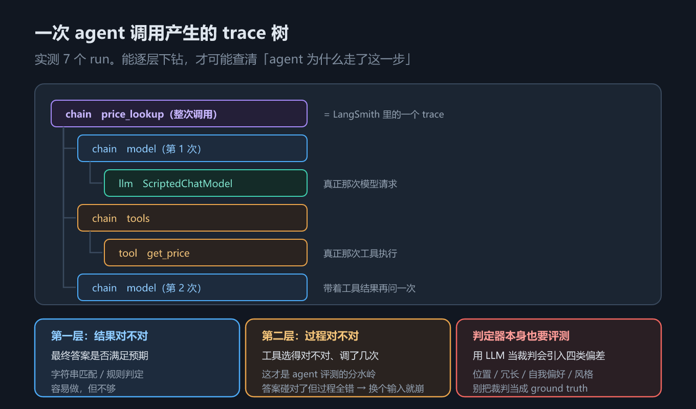

# 第 17 章 可观测与评测：追踪、数据集与成本

## 一、这一章要解决的问题

前 12 章把 agent 搭起来了，但它跑起来之后有两个问题一直没回答：

1. **它内部到底发生了什么？** 一次 `invoke` 出去，回来一个最终答案。中间调了几次模型、每次给模型看了什么、工具收到什么参数、从哪一步开始跑偏——不看过程，这些全是黑盒。agent 又是多步、自主的，「答案不对」往往只是表象，真正的原因藏在中间某一步。这叫**可观测（observability）**。
2. **它到底好不好？** 改了一版提示词、换了个模型、加了个工具，是变好还是变坏？靠几个手测样例拍脑袋不行，要有**用例集 + 判定 + 汇总**，也就是**评测（evaluation）**。

两件事共用一个基础：**一次运行留下的结构化记录**。有了它，追踪能逐层下钻、评测能自动判定。

> 版本锚点：本章结论在 `langchain` **1.4.2**（Python）/ **1.5.11**（JS）、`langchain-core` **1.6.4** 上实测；示例源码见 `code/python/17_observability.py` 与 `code/typescript/17_observability.ts`。
> ⚠️ **LangSmith 上报需要账号，本机无 API Key，未实测**。本章 trace 结构用**离线回调桩**演示——它和 LangSmith 记录的是同一批事件，只是不往外发。字段名一律以官方文档为准。

## 二、机制与原理

### 2.1 trace / run / span：一次调用是一棵树

LangChain 的执行天然是**嵌套**的：一次 agent 调用里套着若干次模型调用与工具调用。框架在每个执行单元的开始与结束各发一次**回调（callback）事件**，把这些事件按 `run_id` / `parent_run_id` 串起来，就得到一棵树。三个词先对齐：

| 词 | 指什么 | 类比 |
|---|---|---|
| **run** | 框架里最小的**被记录单元**：一次链执行、一次模型调用、一次工具调用各是一个 run，带 `run_type`、输入、输出、起止时间 | 树上的一个节点 |
| **span** | run 在 OpenTelemetry 语境下的叫法，强调「一段有起止的时间区间」 | 同一个东西，换个名字 |
| **trace** | 一次端到端调用产生的**整棵 run 树**，共享同一个 trace id | 树本身 |

`run_type` 常见取值有 `chain`（链 / 图节点）、`llm`（模型调用）、`tool`（工具执行）、`retriever`（检索）等。**层级不是按类型排的，而是按调用关系排的**——`llm` 之所以是 `chain` 的孩子，是因为那次模型调用确实发生在那个链里面。



*图 31　trace 结构与可观测三层：run 的父子关系、每个 run 的输入输出，以及从 trace 到指标的三层*

### 2.2 实测：一次 agent 调用产生 7 个 run

示例让 agent 回答「A-1 多少钱？」，模型第一轮请求 `get_price` 工具，第二轮给出最终答案。用离线回调记录后，树长这样（毫秒数每次不同，只关心结构）：

```text
├─ [chain] price_lookup   (11.8 ms)
  ├─ [chain] model        (5.2 ms)
    ├─ [llm  ] ChatModel  (4.9 ms)
  ├─ [chain] tools        (0.7 ms)
    ├─ [tool ] get_price  (0.2 ms)
  ├─ [chain] model        (4.1 ms)
    ├─ [llm  ] ChatModel  (3.8 ms)
```

**一共 7 个 run**：1 个根 `chain`（整次 agent 调用，对应 LangSmith 里的一条 trace）+ 2 个 `model` chain（图里的 `model` 节点，各挂 1 个 `llm`）+ 1 个 `tools` chain（挂 1 个 `tool`）。

为什么是 2 个 `model`：agent loop 的本质就是「调模型 → 有工具调用就执行 → 再调模型」。第一圈模型请求工具，第二圈模型拿到工具结果、给出最终答案。**run 的数量直接反映 loop 转了几圈**——这本身就是排障线索：本该一圈解决的问题转了三圈，说明模型在反复试。

### 2.3 逐层下钻：trace 凭什么能回答「为什么走了这一步」

关键在于：**每个 run 都有自己的输入和输出**，不只是有名字。第一个 `model` chain 的**输出**里能看到模型这轮决定调用 `get_price`、参数是 `{"sku": "A-1"}`；`tool` run 的输入正是那次调用的参数、输出是工具返回值；第二个 `model` chain 的**输入**里已经能看到上一步的 `ToolMessage`——这就是「最终答案是怎么来的」的直接证据。

所以排障姿势是**从根往下走**：先看根的输出对不对，再看是哪一次模型调用跑偏，再看那一次它到底看到了什么。没有 trace 时这些信息全部不存在，你只能拿最终答案反推——而 agent 是多步自主的，反推基本靠猜。

### 2.4 离线回调：TraceRecorder 的完整思路

上面那棵树不是 LangSmith 给的，是示例里一个几十行的 `TraceRecorder` 自己搭的。思路四步：① 继承 `BaseCallbackHandler`；② 在 `on_chain_start` / `on_chat_model_start` / `on_tool_start` 里用回调给的 `run_id`、`parent_run_id` 建节点、挂父子关系、记开始时间；③ 在对应的 `_end` 里记结束时间；④ 从根递归打印。

两个必须知道的细节（都是实测踩出来的）：**工具名在 `serialized["name"]` 里，不在回调参数里**（Python 侧如此；JS 侧的 `handleToolStart` 相反，名字在第 7 个参数上，照抄会拿到空名字）；**`parent_run_id` 为 `None` 的就是根**，不需要自己猜父子关系。

把 `TraceRecorder` 挂到 `config={"callbacks": [recorder]}` 上即可。**它不联网、不需要账号**——这就是本章能在无 API Key 环境下演示 trace 结构的原因。

### 2.5 LangSmith：做的是同一件事，只是把数据送到服务端

把 `TraceRecorder` 换成 LangSmith，机制上没有区别：**同样是给每个 run 记 start / end / 父子关系 / 元数据**。差别在三点：**数据去向**（从进程内存变成上报服务端）、**跨进程能力**（靠 trace id 把多服务的 run 拼成一棵树，离线回调做不到）、**附带能力**（可视化 UI、数据集、在线评测、人工标注，用离线桩都得自己写）。开启方式是环境变量（如 `LANGSMITH_TRACING` / `LANGSMITH_API_KEY`，具体名字以官方文档为准）。

> ⚠️ **未实测**：LangSmith 上报需要账号，本机无 API Key，本章没有跑通过一次真实上报。上面的对比来自官方文档与回调机制的推断；**字段名与开关一律以官方文档为准**。想验证，先拿 `TraceRecorder` 把结构吃透，再去控制台看同一棵树——两者应该长得一样。

### 2.6 评测的两个层次：结果对不对，过程对不对

有了 trace，「评测」就能分两层做。这张表回答「评测到底该评什么」。

| 层次 | 看什么 | 判定方式 | 局限 |
|---|---|---|---|
| **第一层：结果对不对** | 最终答案是否满足预期 | 字符串包含、正则、JSON schema、精确匹配 | 普通 LLM 评测就能做，**看不出过程问题** |
| **第二层：过程对不对** | 工具选得对不对、调了几次、顺序对不对、有没有绕路 | 断言 trace 里的工具名 / 调用次数 / 节点序列 | 需要 trace，成本更高 |

**第二层才是 agent 评测和普通 LLM 评测的分水岭。** agent 的答案是「多步 + 自主」攒出来的，**答案碰对了不代表过程对**。典型场景：问「A-1 多少钱」，agent 本该调 `get_price`，实际却调了通用的 `web_search`，恰好也搜到 199 元——第一层看答案对、通过；第二层看工具选错了，**换个输入这条捷径就走不通**。只做第一层的评测集会给这种系统打高分，直到上线才崩。反过来，过程对了结果一般也不差，所以**过程断言性价比很高**——不用 LLM 当裁判，断言工具名和调用次数就够了。

### 2.7 判定器本身也要评测

第一层的判定器，很多人第一反应是「再叫一个 LLM 来打分」（LLM-as-a-judge）。这条路能用，但要先知道它会**系统性地偏**。这张表回答「LLM 当裁判会往哪儿偏」。

| 偏差 | 表现 | 怎么缓解 |
|---|---|---|
| **位置偏差** | 两个答案对比时偏向排在前面的那个 | 交换顺序各评一次，取一致结果 |
| **冗长偏差** | 偏向更长、更啰嗦的答案 | 判定项里显式加「简洁」约束，或按长度分层 |
| **自我偏好** | 偏向和自己（同家族模型）风格接近的答案 | 换一个家族的模型当裁判 |
| **风格偏差** | 被措辞、格式、礼貌程度带偏，忽略实质 | 只喂结构化内容，或要求先抽事实再判 |

所以**判定器本身也是要被评测的对象**：能用确定性规则（字符串匹配、schema 校验、工具名断言）解决的，就别用 LLM；非用不可时，要有一小份人工标好的 golden set 定期校准它。本章示例的判定就是纯字符串匹配 + 工具名断言——**粗糙，但确定、可复现、不引入上述四类偏差**。

### 2.8 该盯的五个数

评测回答「对不对」，指标回答「贵不贵、快不快、稳不稳」。这张表回答「上线后该盯哪几个数」。

| 指标 | 为什么盯它 |
|---|---|
| **模型调用次数** | agent 的成本基本正比于它；失控循环也最先在这里暴露 |
| **输入 token** | 每轮都要重发完整历史，涨得比直觉快 |
| **缓存命中率** | 前缀缓存命中与否，单价可能差一个数量级 |
| **工具调用次数** | 工具选错、反复重试，看这里最直观 |
| **端到端 P95** | 平均延迟会掩盖长尾，而用户体验由长尾决定 |

> ⚠️ 本章示例的离线 trace **只记了耗时**。token 与成本字段需要真实模型返回的 `usage` 元数据，**本机无 API Key，未实测**。

### 2.9 LangSmith 的开通与配置

2.5 节讲了 LangSmith 与离线回调在机制上是同一件事，差别只在数据去向。这一节补上 2.5 节跳过的部分：**怎么把数据送出去**。三步——拿账号、配环境变量、看界面。

> ⚠️ **未实测**：本机没有 LangSmith 账号，下面三步**一步都没有真跑通过**。步骤与变量名来自讲义（`尚硅谷-03-LangSmith的使用`）与官方文档；其中「环境变量的读取规则」用本机 `langsmith` 0.14.0 源码离线核对过（只是读环境变量，不涉及上报），**上报、页面、指标全部未验证**。

**第一步：注册并拿到 API Key**

1. 打开 `https://smith.langchain.com/`，用邮箱或已有账号登录；
2. 进设置页（Settings）→ API Keys → Create API Key；
3. 弹出的 Key **只显示这一次**：点 copy 存好，关掉弹窗后官网上再也看不到内容，丢了只能删掉重建。

**第二步：配环境变量**

在 `.env` 里加四个变量（讲义口径）：

```bash
LANGSMITH_TRACING=true                                # 总开关：不开就不上报，代码照常跑
LANGSMITH_ENDPOINT=https://api.smith.langchain.com    # 上报地址：有默认值，只有自建/私有化部署才需要改
LANGSMITH_API_KEY=<YOUR_API_KEY>                      # 上一步拿到的 Key
LANGSMITH_PROJECT="pr-clear-harmony-32"               # 项目名：WebUI 按它分组，默认落进 default
```

下表回答：**这四个变量分别控制什么，漏了会怎样**。

| 变量 | 作用 | 缺了会怎样 |
|---|---|---|
| `LANGSMITH_TRACING` | 总开关 | 不开就不上报，代码照常跑（**静默失效**，最容易白忙一场） |
| `LANGSMITH_ENDPOINT` | 上报的服务端地址 | 有默认值 `https://api.smith.langchain.com`，一般不用设 |
| `LANGSMITH_API_KEY` | 身份凭证 | 开 tracing 却不给 Key，客户端告警 `LangSmithMissingAPIKeyWarning`（「使用托管版 LangSmith API 时必须提供 API Key」） |
| `LANGSMITH_PROJECT` | 项目名，WebUI 按它分组 | 落进默认项目 `default` |

三个容易踩的点，**已用本机 `langsmith` 0.14.0 源码离线核对**：

- **总开关只认小写 `"true"`**。源码是 `var_result == "true"` 的**精确字符串比较**，`True` / `TRUE` / `1` / `yes` **一律判为关闭**。这是本节最容易白忙一场的坑。
- **旧命名空间仍然有效**。`get_env_var` 会依次查 `LANGSMITH_*` 与 `LANGCHAIN_*` 两套前缀，所以 `LANGCHAIN_TRACING_V2=true`、`LANGCHAIN_PROJECT=...` 照样生效（实测通过）。新代码统一用 `LANGSMITH_*`。
- **项目名还有第三个来源**。`HOSTED_LANGSERVE_PROJECT_NAME` 优先级最高（托管部署用），其次 `LANGSMITH_PROJECT`，都没有才是 `default`。

**第三步：在 WebUI 里看什么**

打开 Tracing 页，先按 `LANGSMITH_PROJECT` 找到自己的项目，然后看四样：

- **run 树**：2.1–2.3 节讲的那棵树原样出现在页面上——根节点是一次 `invoke`，下面挂 `model` / `tools` 节点，再下面才是真正的 `llm` / `tool` run。点任一节点看它自己的输入输出，这就是 2.3 节说的「逐层下钻」。想确认自己对 trace 结构的理解，就拿 2.4 节的 `TraceRecorder` 打出来的树和页面上的树对一遍，两者应该长得一样。
- **耗时**：每个 run 的起止时间与总时长。长尾藏在哪个节点，一眼能看出来——对应 2.8 节「该盯的五个数」里的端到端 P95。
- **token 用量**：`llm` run 上有输入 / 输出 token 数。**这是离线回调拿不到的数据**（2.8 节已标注未实测）：token 来自模型响应里的 `usage` 元数据，只有真实模型才有，页面把它汇总到项目维度，成本估算也建在这上面。
- **标签与元数据**：`invoke(..., config={"run_name": ..., "tags": [...], "metadata": {...}})` 里的三个字段会挂到对应 run 上，用来在项目里筛选、分组（讲义示例用 `run_name` 给一次运行起名、用 `metadata` 记 `user_id` / `session_id`）。实测（离线、无 tracer）：这三个 config 字段不会让调用报错，但**不配 LangSmith 时它们不产生任何效果**，只是被 Runnable 原样收下。

> ⚠️ 页面上的字段名、按钮位置、指标口径都随 LangSmith 版本变化，**本节全部未实测**，以官方文档与页面实际显示为准。

## 三、代码：Python 与 TypeScript

### 3.1 用离线回调搭一棵 trace 树

Python 侧继承 `BaseCallbackHandler`，在 start / end 事件里建节点、挂父子关系，最后递归打印。

```python
import time
from langchain_core.callbacks import BaseCallbackHandler

class TraceRecorder(BaseCallbackHandler):
    def __init__(self) -> None:
        self.runs: dict[str, dict] = {}
        self.roots: list[str] = []

    def _start(self, run_id, parent_run_id, name, run_type) -> None:
        self.runs[run_id] = {"name": name, "type": run_type, "parent": parent_run_id,
                             "children": [], "t0": time.perf_counter(), "t1": None}
        if parent_run_id is None:
            self.roots.append(run_id)
        elif parent_run_id in self.runs:
            self.runs[parent_run_id]["children"].append(run_id)

    def _end(self, run_id) -> None:
        self.runs[run_id]["t1"] = time.perf_counter()

    def on_chain_start(self, serialized, inputs, **kw):
        self._start(kw["run_id"], kw.get("parent_run_id"),
                    (serialized or {}).get("name") or kw.get("name") or "chain", "chain")
    def on_chain_end(self, outputs, **kw): self._end(kw["run_id"])

    def on_chat_model_start(self, serialized, messages, **kw):
        self._start(kw["run_id"], kw.get("parent_run_id"), "ChatModel", "llm")
    def on_llm_end(self, response, **kw): self._end(kw["run_id"])

    def on_tool_start(self, serialized, input_str, **kw):
        # ⚠️ 工具名在 serialized['name'] 里，不在 kw 里
        self._start(kw["run_id"], kw.get("parent_run_id"),
                    (serialized or {}).get("name") or "tool", "tool")
    def on_tool_end(self, output, **kw): self._end(kw["run_id"])
```

TypeScript 侧的钩子名不同（`handleChainStart` 等），而且**工具名在第 7 个参数上**，不在 `serialized` 里。

```typescript
import { BaseCallbackHandler } from "@langchain/core/callbacks/base";

class TraceRecorder extends BaseCallbackHandler {
  name = "TraceRecorder";
  runs = new Map<string, any>();
  roots: string[] = [];

  private start(runId: string, parentId: string | undefined, name: string, type: string) {
    this.runs.set(runId, { name, type, parent: parentId, children: [], t0: performance.now() });
    if (!parentId) this.roots.push(runId);
    else this.runs.get(parentId)?.children.push(runId);
  }
  private end(runId: string) { this.runs.get(runId)!.t1 = performance.now(); }

  handleChainStart(_c: any, _i: any, runId: string, parentRunId?: string) {
    this.start(runId, parentRunId, "chain", "chain");
  }
  handleChainEnd(_o: any, runId: string) { this.end(runId); }
  handleChatModelStart(_l: any, _m: any, runId: string, parentRunId?: string) {
    this.start(runId, parentRunId, "ChatModel", "llm");
  }
  handleLLMEnd(_o: any, runId: string) { this.end(runId); }
  // ⚠️ 工具名在第 7 个参数（name）里，不在 serialized 里——JS 侧踩过一次
  handleToolStart(_t: any, _i: string, runId: string, parentRunId?: string,
                  _tags?: any, _m?: any, n?: string) {
    this.start(runId, parentRunId, n ?? "tool", "tool");
  }
  handleToolEnd(_o: any, runId: string) { this.end(runId); }
}
```

> 完整可跑版本（含 `tree()` 递归打印与 `agent.invoke(..., { callbacks: [recorder], runName: "price_lookup" })`）：`code/python/17_observability.py`、`code/typescript/17_observability.ts`。

### 3.2 离线评测的最小骨架

Python 侧跑 3 个用例，每个用例用 trace 取实际调用的工具名，再和预期比对。

```python
CASES = [
    {"input": "A-1 多少钱？", "expect_tool": "get_price", "expect_in_reply": "199"},
    {"input": "B-2 多少钱？", "expect_tool": "get_price", "expect_in_reply": "199"},
    {"input": "你好",        "expect_tool": None,        "expect_in_reply": "你好"},
]

passed = 0
for i, case in enumerate(CASES, 1):
    rec = TraceRecorder()
    agent = build_agent(case)                       # 真实评测里这里换成真模型
    out = agent.invoke({"messages": [HumanMessage(case["input"])]},
                       config={"callbacks": [rec], "configurable": {"thread_id": f"eval-{i}"}})
    called = sorted({r["name"] for r in rec.runs.values() if r["type"] == "tool"})
    actual_tool = called[0] if called else None
    final = str(out["messages"][-1].content)
    # 两层判定：过程（工具名）+ 结果（答案包含预期片段）
    ok = actual_tool == case["expect_tool"] and case["expect_in_reply"] in final
    passed += ok
    print(f"{i}  {case['input']:<14} 工具={str(actual_tool):<12} {'✅' if ok else '❌'}")

print(f"结果：{passed}/{len(CASES)} 通过")
```

TypeScript 侧结构一致，差别只在消息构造与 `Map` 的取值方式。

```typescript
const CASES = [
  { input: "A-1 多少钱？", expectTool: "get_price", expectInReply: "199" },
  { input: "B-2 多少钱？", expectTool: "get_price", expectInReply: "199" },
  { input: "你好",        expectTool: null,        expectInReply: "你好" },
];

let passed = 0;
for (let i = 0; i < CASES.length; i += 1) {
  const c = CASES[i];
  const rec = new TraceRecorder();
  const agent = buildAgent(c);                     // 真实评测里这里换成真模型
  const r: any = await agent.invoke(
    { messages: [new HumanMessage(c.input)] },
    { callbacks: [rec], configurable: { thread_id: `eval-${i}` } },
  );
  const called = [...rec.runs.values()].filter((x) => x.type === "tool").map((x) => x.name).sort();
  const actualTool = called[0] ?? null;
  const final = String(r.messages[r.messages.length - 1].content);
  const ok = actualTool === c.expectTool && final.includes(c.expectInReply);
  if (ok) passed += 1;
  console.log(`${i + 1}  ${c.input.padEnd(14)} 工具=${String(actualTool).padEnd(12)} ${ok ? "✅" : "❌"}`);
}
console.log(`结果：${passed}/${CASES.length} 通过`);
```

实测输出是 **3/3 通过**。这个「通过」很便宜：判定器只是工具名相等 + 字符串包含，两语言结果一致、完全可复现。它的价值不在准确，而在**把评测跑通成一条流水线**——真实项目里把 `build_agent` 换成真模型、把判定器换成更严的规则，骨架不变。

## 四、常见坑与边界条件

1. **别把 trace 当日志**。日志是「谁在什么时候打印了什么」，trace 是「谁嵌套在谁里面」；只有后者能回答「这一步是在哪次调用里发生的」。
2. **工具名两边位置不同**：Python 在 `serialized["name"]`，JS 在 `handleToolStart` 的第 7 个参数。
3. **`run_type` 的层级不代表调用顺序**。`llm` 挂在 `chain` 下是因为调用关系，不是因为它类型小；判断顺序要看时间戳，不要看缩进。
4. **只做第一层评测会给坏系统打高分**。答案碰对、过程全错是 agent 最常见的假阳性，务必加工具名 / 调用次数断言。
5. **别用 LLM 当唯一的裁判**。位置 / 冗长 / 自我偏好 / 风格四类偏差是系统性的，不会因为提示词写得好就消失。
6. **离线回调里没有 token 与成本，耗时也不代表生产延迟**。token / 成本来自模型返回的 `usage` 元数据，需要真实模型——**本机无 API Key，未实测**；示例毫秒数来自脚本模型，没有参考价值。
7. **trace 数据不是免费的**。完整记录输入输出会放大存储与隐私风险，生产环境要想清楚哪些 run 记全量、哪些只记摘要。

## 五、关键结论

1. **run 是被记录的最小执行单元，trace 是整棵 run 树，span 是 run 在 OTel 语境下的叫法**。层级按调用关系排，不按类型排。
2. **一次 agent 调用实测产生 7 个 run**：1 个根 chain + 2 个 `model` chain（各挂 1 个 `llm`）+ 1 个 `tools` chain（挂 1 个 `tool`）。run 数直接反映 loop 转了几圈。
3. **每个 run 都有自己的输入输出，所以能逐层下钻**——这是 trace 能回答「agent 为什么走了这一步」的根本原因。
4. **离线回调就能搭出同一棵树**：`BaseCallbackHandler` + start / end 事件 + `run_id` / `parent_run_id`。LangSmith 本质相同，只是把数据送到服务端并支持跨进程。
5. **评测分两层**：第一层结果对不对，第二层过程对不对。**第二层是 agent 评测与普通 LLM 评测的分水岭**——答案碰对了但过程全错，换个输入就崩。
6. **判定器本身也要评测**：LLM 当裁判有位置 / 冗长 / 自我偏好 / 风格四类系统性偏差；能用确定性规则就别用 LLM。
7. **上线盯五个数**：模型调用次数、输入 token、缓存命中率、工具调用次数、端到端 P95。
8. **LangSmith 上报需账号，本机未实测**；本章 trace 结构来自离线桩，字段名以官方文档为准。

## 本章要点回顾

- **三个词**：run（最小执行单元）/ trace（整棵 run 树）/ span（OTel 叫法）。
- **实测 trace 树**：7 个 run —— 1 根 chain + 2 个 model chain + 2 个 llm + 1 个 tools chain + 1 个 tool。
- **能下钻的原因**：每个 run 都带自己的 input / output。
- **离线搭树**：继承 `BaseCallbackHandler`，在 start / end 里记 `run_id` / `parent_run_id`；Python 工具名在 `serialized["name"]`，JS 在第 7 个参数。
- **LangSmith = 同一套事件 + 上报服务端 + 跨进程 + UI**；⚠️ **需账号，未实测**。
- **开通配置就三步**：注册拿 Key → 配 `LANGSMITH_TRACING` / `LANGSMITH_ENDPOINT` / `LANGSMITH_API_KEY` / `LANGSMITH_PROJECT` → 在 WebUI 看 run 树 / 耗时 / token 用量。**总开关只认小写 `"true"`**（离线核对 `langsmith` 0.14.0 源码，`True` / `1` 一律判为关闭）；整节**未实测**（见 2.9 节）。
- **评测两层**：结果对不对（第一层，普通 LLM 评测也能做）、过程对不对（第二层，**agent 评测的分水岭**）。
- **判定器四偏差**：位置 / 冗长 / 自我偏好 / 风格；能确定性判定就别上 LLM。
- **五个数**：模型调用次数 / 输入 token / 缓存命中率 / 工具调用次数 / 端到端 P95。
- **示例结果**：3 个用例、工具名 + 字符串匹配判定、**3/3 通过**。
